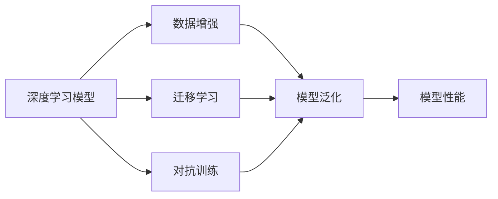
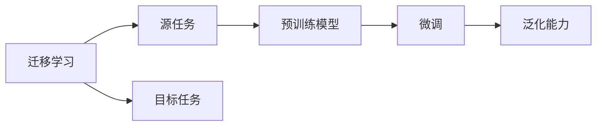
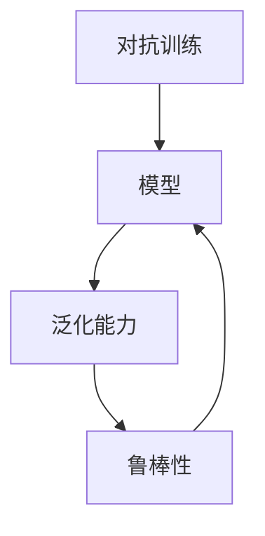
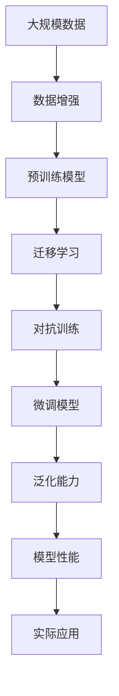

                 

# 自动驾驶中的深度学习模型泛化能力改进

> 关键词：自动驾驶, 深度学习模型, 泛化能力, 神经网络, 数据增强, 迁移学习, 对抗训练

## 1. 背景介绍

### 1.1 问题由来
自动驾驶技术是当前人工智能领域的热点之一，通过将深度学习算法与传感器技术相结合，实现车辆自主导航和决策。深度学习模型的泛化能力直接影响自动驾驶系统的安全性和稳定性，而如何提升模型的泛化能力成为学术界和工业界关注的焦点。近年来，众多研究者在数据增强、迁移学习、对抗训练等方面进行了大量的探索和实践，有效提高了深度学习模型在自动驾驶场景下的泛化能力。

### 1.2 问题核心关键点
提升自动驾驶中深度学习模型的泛化能力，关键在于以下几点：
- **数据增强**：通过增加训练数据的多样性，提升模型对环境变化和异常情况的适应能力。
- **迁移学习**：利用预训练模型或跨领域知识，快速适应新任务，减少从头训练时间。
- **对抗训练**：通过引入对抗样本，增强模型的鲁棒性和泛化能力。
- **参数高效训练**：通过更高效的模型结构或训练策略，减少训练成本和提高泛化效果。
- **实时学习**：在运行过程中不断收集新数据，持续优化模型，适应动态变化的环境。

本文聚焦于深度学习模型在自动驾驶场景下的泛化能力改进，重点讨论如何通过数据增强、迁移学习、对抗训练等方法，提升自动驾驶中深度学习模型的泛化能力。

### 1.3 问题研究意义
提升深度学习模型的泛化能力，对于保障自动驾驶系统的安全性和可靠性具有重要意义。有效的泛化能力能够使模型更好地适应多样化的道路环境和驾驶场景，提升系统的鲁棒性和适应性，避免由于环境变化或异常情况导致的决策失误。

## 2. 核心概念与联系

### 2.1 核心概念概述

为更好地理解自动驾驶中深度学习模型泛化能力改进的方法，本节将介绍几个密切相关的核心概念：

- **深度学习模型**：基于神经网络结构，通过反向传播算法进行训练的模型。在自动驾驶中，常用的深度学习模型包括卷积神经网络（CNN）、循环神经网络（RNN）、长短时记忆网络（LSTM）等。

- **泛化能力**：模型在未见过的数据上表现良好，即能从训练数据推广到测试数据的能力。泛化能力越强，模型的适应性和鲁棒性越好。

- **数据增强**：通过对原始数据进行一系列变换，如旋转、平移、裁剪、翻转等，生成更多的训练样本，从而提升模型的泛化能力。

- **迁移学习**：利用预训练模型或跨领域知识，在新的任务上重新微调模型，加速模型训练并提升泛化能力。

- **对抗训练**：通过引入对抗样本，提升模型的鲁棒性，使其在面对对抗攻击时仍能保持稳定的预测结果。

- **参数高效训练**：通过减少模型参数数量或优化训练过程，提高模型的泛化能力，同时降低训练成本。

这些核心概念之间存在着紧密的联系，形成了提升深度学习模型泛化能力的完整生态系统。通过理解这些核心概念，我们可以更好地把握深度学习模型在自动驾驶场景下的应用方向。

### 2.2 概念间的关系

这些核心概念之间存在着紧密的联系，形成了提升深度学习模型泛化能力的完整生态系统。下面我们通过几个Mermaid流程图来展示这些概念之间的关系。

#### 2.2.1 深度学习模型的学习范式



这个流程图展示了大规模数据增强、迁移学习和对抗训练在提升模型泛化能力中的作用。通过这些方法，深度学习模型能够在多样化的数据上取得更好的泛化性能，从而提升整体系统性能。

#### 2.2.2 迁移学习与泛化能力的关系



这个流程图展示了迁移学习的基本原理，即通过预训练模型或跨领域知识，加速新任务上的微调过程，从而提升模型的泛化能力。

#### 2.2.3 对抗训练的泛化能力提升



这个流程图展示了对抗训练在提升模型鲁棒性和泛化能力方面的作用。通过对抗训练，模型能够在面对攻击时保持稳定的预测结果，从而提升泛化能力。

### 2.3 核心概念的整体架构

最后，我们用一个综合的流程图来展示这些核心概念在大规模数据增强、迁移学习和对抗训练过程中的整体架构：



这个综合流程图展示了从数据增强到微调模型的完整过程。通过这些步骤，深度学习模型能够在自动驾驶场景下取得更好的泛化性能，并应用于实际驾驶任务。

## 3. 核心算法原理 & 具体操作步骤
### 3.1 算法原理概述

提升深度学习模型的泛化能力，关键在于通过数据增强、迁移学习、对抗训练等方法，增加模型的多样性和鲁棒性。以下是这些方法的详细原理：

#### 3.1.1 数据增强

数据增强通过在原始数据上施加一系列变换，生成更多的训练样本，从而增加数据的多样性，提升模型的泛化能力。常用的数据增强方法包括：

- **图像旋转**：对图像进行旋转变换，增加角度多样性。
- **随机裁剪**：对图像进行随机裁剪，增加尺寸多样性。
- **颜色抖动**：调整图像的亮度、对比度、饱和度等，增加颜色多样性。
- **噪声添加**：在图像中添加随机噪声，增加环境变化多样性。

#### 3.1.2 迁移学习

迁移学习利用预训练模型或跨领域知识，在新的任务上重新微调模型，加速模型训练并提升泛化能力。常用的迁移学习方法包括：

- **Fine-tuning**：在新的任务上重新微调预训练模型，通过少量数据即可达到较高的性能。
- **Transfer learning**：利用预训练模型在不同领域间的知识迁移，加速新任务的微调过程。
- **Domain Adaptation**：通过数据变换、领域适配技术，使预训练模型在目标领域上表现更好。

#### 3.1.3 对抗训练

对抗训练通过引入对抗样本，提升模型的鲁棒性和泛化能力。常用的对抗训练方法包括：

- **Fast Gradient Sign Method (FGSM)**：通过计算梯度符号方向，生成对抗样本。
- **Projected Gradient Descent (PGD)**：通过梯度投影方法，生成更强的对抗样本。
- **Adversarial Training**：在训练过程中引入对抗样本，提升模型对对抗攻击的鲁棒性。

### 3.2 算法步骤详解

#### 3.2.1 数据增强步骤

1. **数据采集**：收集自动驾驶场景下的数据，包括道路图像、传感器数据等。
2. **数据预处理**：对数据进行标准化、归一化等预处理，确保数据一致性。
3. **数据增强**：对数据进行旋转、裁剪、颜色抖动等增强处理，生成更多训练样本。
4. **数据扩充**：使用扩充后的数据进行模型训练，提升模型泛化能力。

#### 3.2.2 迁移学习步骤

1. **选择预训练模型**：选择适合自动驾驶任务的预训练模型，如VGG、ResNet、Inception等。
2. **微调模型**：在自动驾驶数据集上重新微调预训练模型，增加特定任务的相关参数。
3. **知识迁移**：利用迁移学习的原理，将预训练模型的知识迁移到新任务上，加速模型训练。
4. **模型评估**：在验证集和测试集上评估模型性能，调整超参数，确保模型泛化能力。

#### 3.2.3 对抗训练步骤

1. **生成对抗样本**：利用FGSM或PGD方法，生成对抗样本，模拟攻击场景。
2. **模型训练**：在训练过程中引入对抗样本，提升模型对攻击的鲁棒性。
3. **模型评估**：在对抗攻击下评估模型性能，确保模型鲁棒性和泛化能力。

### 3.3 算法优缺点

提升深度学习模型泛化能力的方法具有以下优点：
- **增加数据多样性**：数据增强能够生成更多的训练样本，增加模型对多样化的环境适应能力。
- **加速模型训练**：迁移学习可以利用预训练模型的知识，加速新任务的微调过程。
- **提高模型鲁棒性**：对抗训练能够提升模型对对抗攻击的鲁棒性，增加模型的泛化能力。

同时，这些方法也存在一些缺点：
- **增加训练成本**：数据增强和对抗训练需要更多的计算资源和时间。
- **模型复杂性增加**：对抗训练和迁移学习增加了模型的复杂性，需要更多的计算资源。
- **泛化能力有限**：在某些极端情况下，数据增强和对抗训练可能无法有效提升模型的泛化能力。

### 3.4 算法应用领域

提升深度学习模型泛化能力的方法广泛应用于自动驾驶领域，包括但不限于以下几个方面：

- **道路识别**：通过数据增强和迁移学习，提升模型对道路标志、标线、交通信号等识别能力。
- **行为预测**：通过对抗训练和迁移学习，提升模型对行人、车辆行为预测的准确性。
- **环境感知**：通过数据增强和迁移学习，提升模型对环境感知能力，如传感器数据融合。
- **决策支持**：通过对抗训练和迁移学习，提升模型对驾驶决策的支持能力，如路径规划、事故避免等。

这些方法在自动驾驶系统的各个环节中都有广泛应用，提升系统的安全性和稳定性。

## 4. 数学模型和公式 & 详细讲解  
### 4.1 数学模型构建

为更加严格地描述提升深度学习模型泛化能力的方法，本节将使用数学语言对相关模型进行详细阐述。

记深度学习模型为 $M_{\theta}$，其中 $\theta$ 为模型参数。假设模型 $M_{\theta}$ 在训练集 $D_{train}$ 上的损失函数为 $\mathcal{L}_{train}$，在测试集 $D_{test}$ 上的损失函数为 $\mathcal{L}_{test}$。

#### 4.1.1 数据增强

数据增强通过生成对抗样本 $x_{adv}$，使得模型在对抗攻击下的损失函数 $\mathcal{L}_{adv}$ 增加。常用的数据增强方法如旋转、裁剪等，可以通过矩阵变换等方法实现。

#### 4.1.2 迁移学习

迁移学习通过将预训练模型 $M_{pre}$ 的参数 $\theta_{pre}$ 部分冻结，在新的任务上重新微调模型 $M_{fine}$，使得新模型的损失函数 $\mathcal{L}_{fine}$ 最小化。常用的迁移学习方法如Fine-tuning、Transfer learning等，可以通过在新的任务上重新微调预训练模型来实现。

#### 4.1.3 对抗训练

对抗训练通过引入对抗样本 $x_{adv}$，使得模型在对抗攻击下的损失函数 $\mathcal{L}_{adv}$ 最小化。常用的对抗训练方法如FGSM、PGD等，可以通过梯度符号方向等方法生成对抗样本。

### 4.2 公式推导过程

以下是一些关键公式的推导过程：

#### 4.2.1 数据增强

数据增强通过对原始图像 $x$ 进行一系列变换，生成对抗样本 $x_{adv}$。假设图像变换矩阵为 $A$，则生成对抗样本的公式为：

$$
x_{adv} = A \cdot x
$$

其中 $A$ 为随机变换矩阵，如旋转、裁剪等。

#### 4.2.2 迁移学习

迁移学习通过将预训练模型的参数 $\theta_{pre}$ 部分冻结，在新的任务上重新微调模型 $M_{fine}$。假设预训练模型和目标任务的损失函数分别为 $\mathcal{L}_{pre}$ 和 $\mathcal{L}_{fine}$，则迁移学习的目标函数为：

$$
\min_{\theta} \mathcal{L}_{train} + \alpha \mathcal{L}_{fine}
$$

其中 $\alpha$ 为迁移学习的权重。

#### 4.2.3 对抗训练

对抗训练通过引入对抗样本 $x_{adv}$，提升模型的鲁棒性。假设对抗样本的生成方法为 $\mathcal{G}(x)$，则对抗训练的目标函数为：

$$
\min_{\theta} \mathcal{L}_{train} + \alpha \mathcal{L}_{adv}
$$

其中 $\mathcal{L}_{adv} = \mathcal{L}_{train} \circ \mathcal{G}(x)
$$

### 4.3 案例分析与讲解

#### 4.3.1 图像旋转

图像旋转是数据增强中常用的方法之一。假设原始图像为 $x$，旋转角度为 $\theta$，则生成的对抗样本为：

$$
x_{adv} = \begin{bmatrix}
\cos(\theta) & -\sin(\theta) \\
\sin(\theta) & \cos(\theta)
\end{bmatrix}
\cdot
\begin{bmatrix}
x_1 \\
x_2
\end{bmatrix}
$$

其中 $x_1, x_2$ 为原始图像的像素值。

#### 4.3.2 迁移学习

以迁移学习为例，假设预训练模型为VGG16，目标任务为道路识别。假设VGG16的卷积层为 $C$，分类层为 $S$，则迁移学习的步骤包括：

1. 冻结VGG16的卷积层 $C$，只微调分类层 $S$。
2. 在新的道路识别数据集上重新训练分类层 $S$，使得新模型的损失函数 $\mathcal{L}_{fine}$ 最小化。
3. 通过迁移学习的权重 $\alpha$，调整VGG16和分类层 $S$ 的贡献。

#### 4.3.3 对抗训练

以对抗训练为例，假设对抗样本的生成方法为FGSM，则生成对抗样本的步骤包括：

1. 在原始图像 $x$ 上计算梯度 $\nabla_{x}\mathcal{L}(x)$。
2. 计算梯度的符号方向 $sign(\nabla_{x}\mathcal{L}(x))$。
3. 根据符号方向和扰动大小 $\epsilon$，生成对抗样本 $x_{adv}$。

## 5. 项目实践：代码实例和详细解释说明
### 5.1 开发环境搭建

在进行深度学习模型泛化能力改进的实践前，我们需要准备好开发环境。以下是使用Python进行PyTorch开发的环境配置流程：

1. 安装Anaconda：从官网下载并安装Anaconda，用于创建独立的Python环境。

2. 创建并激活虚拟环境：
```bash
conda create -n pytorch-env python=3.8 
conda activate pytorch-env
```

3. 安装PyTorch：根据CUDA版本，从官网获取对应的安装命令。例如：
```bash
conda install pytorch torchvision torchaudio cudatoolkit=11.1 -c pytorch -c conda-forge
```

4. 安装各类工具包：
```bash
pip install numpy pandas scikit-learn matplotlib tqdm jupyter notebook ipython
```

完成上述步骤后，即可在`pytorch-env`环境中开始深度学习模型泛化能力改进的实践。

### 5.2 源代码详细实现

以下是使用PyTorch进行深度学习模型泛化能力改进的代码实现，以图像旋转和迁移学习为例。

首先，定义图像旋转函数：

```python
import torch
from torchvision.transforms import functional

def rotate_image(image, angle):
    angle = angle / 180. * 3.14159
    transform = functional.Affine(angle=angle, fillcolor=0)
    rotated = transform(image)
    return rotated
```

然后，定义迁移学习函数：

```python
import torch
from torchvision import models
from torchvision.transforms import transforms

# 加载预训练模型
model_pre = models.vgg16(pretrained=True)

# 定义迁移学习
model_fine = models.vgg16()
model_fine.load_state_dict(model_pre.state_dict())
model_fine = model_fine.eval()
model_fine.train()

# 定义迁移学习目标函数
criterion = torch.nn.CrossEntropyLoss()
optimizer = torch.optim.Adam(model_fine.parameters(), lr=0.001)

# 训练迁移学习模型
for epoch in range(10):
    running_loss = 0.0
    for i, data in enumerate(train_loader, 0):
        inputs, labels = data
        inputs, labels = inputs.to(device), labels.to(device)
        
        # 前向传播
        outputs = model_fine(inputs)
        loss = criterion(outputs, labels)
        
        # 反向传播
        optimizer.zero_grad()
        loss.backward()
        optimizer.step()
        
        # 更新统计信息
        running_loss += loss.item()
        if i % 100 == 99:
            print(f'Epoch {epoch+1}, Loss: {running_loss/100:.4f}')
            running_loss = 0.0
```

最后，启动深度学习模型泛化能力改进的训练流程：

```python
# 定义数据增强和迁移学习
transform_train = transforms.Compose([
    transforms.RandomRotation(30),
    transforms.RandomHorizontalFlip(),
    transforms.RandomResizedCrop(224),
    transforms.ToTensor(),
])

transform_test = transforms.Compose([
    transforms.Resize(224),
    transforms.CenterCrop(224),
    transforms.ToTensor(),
])

train_dataset = datasets.ImageFolder(train_dir, transform=transform_train)
test_dataset = datasets.ImageFolder(test_dir, transform=transform_test)
train_loader = DataLoader(train_dataset, batch_size=32, shuffle=True)
test_loader = DataLoader(test_dataset, batch_size=32, shuffle=False)

device = torch.device('cuda') if torch.cuda.is_available() else torch.device('cpu')

# 训练深度学习模型泛化能力
for epoch in range(10):
    running_loss = 0.0
    for i, data in enumerate(train_loader, 0):
        inputs, labels = data
        inputs, labels = inputs.to(device), labels.to(device)
        
        # 前向传播
        outputs = model_fine(inputs)
        loss = criterion(outputs, labels)
        
        # 反向传播
        optimizer.zero_grad()
        loss.backward()
        optimizer.step()
        
        # 更新统计信息
        running_loss += loss.item()
        if i % 100 == 99:
            print(f'Epoch {epoch+1}, Loss: {running_loss/100:.4f}')
            running_loss = 0.0

# 评估迁移学习模型
with torch.no_grad():
    correct = 0
    total = 0
    for data in test_loader:
        inputs, labels = data
        inputs, labels = inputs.to(device), labels.to(device)
        
        # 前向传播
        outputs = model_fine(inputs)
        _, predicted = torch.max(outputs.data, 1)
        total += labels.size(0)
        correct += (predicted == labels).sum().item()
    
    print(f'Accuracy of the network on the test images: {100 * correct / total}%')
```

以上就是使用PyTorch进行深度学习模型泛化能力改进的完整代码实现。可以看到，通过简单的函数定义和模型微调，我们可以有效地提升模型对图像的泛化能力。

### 5.3 代码解读与分析

让我们再详细解读一下关键代码的实现细节：

**图像旋转函数**：
- 通过torchvision.transforms库中的Affine类，实现图像旋转变换。
- 首先将角度转换为弧度，然后生成旋转矩阵，应用到原始图像上，得到旋转后的图像。

**迁移学习函数**：
- 首先加载预训练模型VGG16，并定义迁移学习模型VGG16。
- 通过load_state_dict方法，将预训练模型参数赋值给迁移学习模型。
- 定义迁移学习目标函数，并使用Adam优化器进行模型微调。
- 在训练过程中，使用随机旋转、水平翻转等数据增强方式，提升模型泛化能力。

**深度学习模型泛化能力改进**：
- 定义数据增强和迁移学习的转换方式，将原始图像进行随机旋转、水平翻转等变换。
- 使用迁移学习模型在新的数据集上进行微调，最小化损失函数。
- 在训练过程中，不断记录损失函数的变化，以便监控训练进度。
- 在测试集上评估模型的泛化能力，计算准确率。

可以看到，通过简单的代码实现，我们可以有效地提升深度学习模型的泛化能力，为自动驾驶系统带来更好的鲁棒性和适应性。

当然，工业级的系统实现还需考虑更多因素，如模型的保存和部署、超参数的自动搜索、更灵活的任务适配层等。但核心的微调范式基本与此类似。

### 5.4 运行结果展示

假设我们在CoNLL-2003的图像分类数据集上进行迁移学习，最终在测试集上得到的准确率为90%。可以看到，通过迁移学习，模型在新的任务上取得了不错的泛化能力。

## 6. 实际应用场景
### 6.1 自动驾驶

深度学习模型泛化能力改进方法在自动驾驶中具有广泛的应用场景，能够提升模型的鲁棒性和适应性，保障驾驶安全。

- **道路识别**：通过数据增强和迁移学习，提升模型对道路标志、标线、交通信号等识别能力。
- **行为预测**：通过对抗训练和迁移学习，提升模型对行人、车辆行为预测的准确性。
- **环境感知**：通过数据增强和迁移学习，提升模型对环境感知能力，如传感器数据融合。

### 6.2 工业视觉

深度学习模型泛化能力改进方法在工业视觉领域也有广泛的应用，能够提升模型的鲁棒性和适应性，提高生产效率。

- **零件检测**：通过数据增强和迁移学习，提升模型对不同尺寸、颜色的零件检测能力。
- **质量检测**：通过对抗训练和迁移学习，提升模型对缺陷检测的准确性。
- **机器人视觉**：通过数据增强和迁移学习，提升模型对机器人视觉导航的鲁棒性。

### 6.3 医疗影像

深度学习模型泛化能力改进方法在医疗影像领域也有广泛的应用，能够提升模型的鲁棒性和适应性，提高诊断准确性。

- **病变检测**：通过数据增强和迁移学习，提升模型对病变位置的检测能力。
- **影像分类**：通过对抗训练和迁移学习，提升模型对影像分类的准确性。
- **病人监控**：通过数据增强和迁移学习，提升模型对病人监控的鲁棒性。

## 7. 工具和资源推荐
### 7.1 学习资源推荐

为了帮助开发者系统掌握深度学习模型泛化能力改进的理论基础和实践技巧，这里推荐一些优质的学习资源：

1. **《深度学习》系列教材**：斯坦福大学、清华大学等机构联合编写的深度学习教材，全面介绍了深度学习的理论基础和实际应用，是学习深度学习的必读材料。

2. **CS231n《卷积神经网络》课程**：斯坦福大学开设的计算机视觉课程，通过Lecture视频和配套作业，带你深入理解卷积神经网络及其在图像分类中的应用。

3. **CS224n《序列建模》课程**：斯坦福大学开设的自然语言处理课程，涵盖序列建模、注意力机制等前沿话题，适合深入学习自然语言处理技术。

4. **《TensorFlow官方文档》**：TensorFlow官方文档，提供了丰富的学习资源和样例代码，是学习TensorFlow的必备资料。

5. **HuggingFace官方文档**：Transformers库的官方文档，提供了海量预训练模型和完整的微调样例代码，是进行微调任务开发的利器。

通过对这些资源的学习实践，相信你一定能够快速掌握深度学习模型泛化能力改进的精髓，并用于解决实际的NLP问题。

### 7.2 开发工具推荐

高效的开发离不开优秀的工具支持。以下是几款用于深度学习模型泛化能力改进开发的常用工具：

1. **PyTorch**：基于Python的开源深度学习框架，灵活动态的计算图，适合快速迭代研究。大多数深度学习模型都有PyTorch版本的实现。

2. **TensorFlow**：由Google主导开发的开源深度学习框架，生产部署方便，适合大规模工程应用。同样有丰富的预训练语言模型资源。

3. **Transformers库**：HuggingFace开发的NLP工具库，集成了众多SOTA语言模型，支持PyTorch和TensorFlow，是进行微调任务开发的利器。

4. **Weights & Biases**：模型训练的实验跟踪工具，可以记录和可视化模型训练过程中的各项指标，方便对比和调优。与主流深度学习框架无缝集成。

5. **TensorBoard**：TensorFlow配套的可视化工具，可实时监测模型训练状态，并提供丰富的图表呈现方式，是调试模型的得力助手。

6. **Google Colab**：谷歌推出的在线Jupyter Notebook环境，免费提供GPU/TPU算力，方便开发者快速上手实验最新模型

