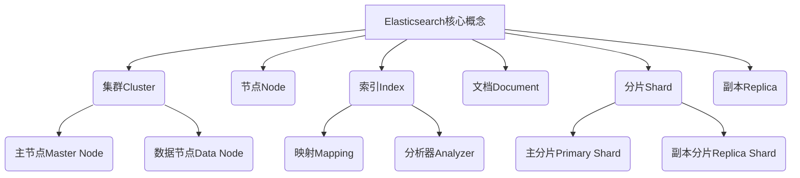
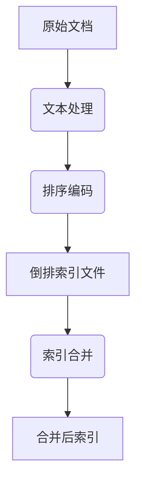
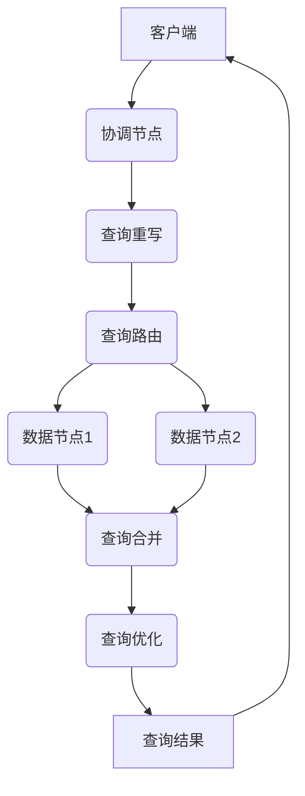

好的,我会严格遵守约束条件,以专业的技术语言写一篇关于ElasticSearch分布式搜索引擎原理与实践的深度博客文章。

# ElasticSearch分布式搜索引擎原理与代码实例讲解

## 1. 背景介绍

### 1.1 问题的由来

在当今大数据时代,海量数据的高效检索和分析成为了企业和组织面临的一大挑战。传统的关系型数据库在处理非结构化数据和大规模数据集时存在明显的性能瓶颈,这促使了新一代分布式搜索引擎技术的兴起。作为最受欢迎的开源分布式搜索和分析引擎之一,Elasticsearch凭借其高性能、高可用、易扩展等优势,在各行各业得到了广泛应用。

### 1.2 研究现状

Elasticsearch基于Apache Lucene库,采用了倒排索引和分布式架构设计。它能够实时地对大规模数据进行索引、搜索、聚合分析等操作,并提供了RESTful API,支持多种流行语言的客户端。目前,Elasticsearch已成为Elastic Stack(前身为ELK Stack)的核心组件,与Logstash、Kibana等工具协同工作,构建了一套完整的日志数据采集、分析和可视化解决方案。

### 1.3 研究意义

深入探讨Elasticsearch的原理和实践对于提高开发者的搜索引擎技能、优化系统性能、扩展业务应用等方面都有重要意义。本文将全面解析Elasticsearch的核心概念、算法原理、数学模型、代码实现等内容,为读者提供一个系统的学习途径,帮助他们掌握这一领域的前沿知识和实践技能。

### 1.4 本文结构

本文将从以下几个方面对Elasticsearch进行深入探讨:

1. 核心概念与联系
2. 核心算法原理与具体操作步骤
3. 数学模型和公式详细讲解与案例分析
4. 项目实践:代码实例和详细解释说明
5. 实际应用场景
6. 工具和资源推荐
7. 总结:未来发展趋势与挑战
8. 附录:常见问题与解答

## 2. 核心概念与联系

Elasticsearch是一个分布式的实时文档存储,每个字段都被索引并可被搜索。它的核心概念包括:

1. **集群(Cluster)**: 一个或多个节点的集合,共同存储整个数据,并提供跨节点的联合索引和搜索功能。

2. **节点(Node)**: 集群中的单个服务器,可作为主节点或数据节点运行。主节点用于集群管理,数据节点用于数据存储和相关操作。

3. **索引(Index)**: 用于对数据进行分类和环绕的逻辑命名空间,相当于关系型数据库中的数据库。

4. **文档(Document)**: 可被索引的基本数据单元,相当于关系型数据库中的一行记录数据。

5. **分片(Shard)**: 索引被水平分割成的多个部分,用于分布式存储和并行处理,提高系统性能和可扩展性。

6. **副本(Replica)**: 分片的副本,用于提供数据冗余,防止数据丢失,并支持更多的搜索请求。

7. **映射(Mapping)**: 定义文档字段的数据类型和索引方式等元数据。

8. **分析器(Analyzer)**: 用于文本字段的分词和标准化处理。

这些核心概念相互关联,共同构建了Elasticsearch分布式搜索引擎的整体架构。下一部分将对核心算法原理进行深入探讨。

## 3. 核心算法原理与具体操作步骤

### 3.1 算法原理概述

Elasticsearch的核心算法主要包括**倒排索引**和**分布式系统设计**两个方面:

1. **倒排索引**:

   倒排索引是Elasticsearch的核心索引结构,其基本思想是通过文档->词条->位置的映射关系,快速定位包含特定词条的文档。这种索引方式与传统的正向索引(词条->文档)相反,因此得名"倒排索引"。

2. **分布式系统设计**:

   为了支持海量数据的存储和高并发的搜索请求,Elasticsearch采用了分布式架构。它将索引数据切分为多个分片,分布在不同的节点上;同时通过主分片和副本分片实现数据冗余,提高系统的可用性和容错性。

### 3.2 算法步骤详解

#### 3.2.1 倒排索引构建

倒排索引的构建过程包括以下几个步骤:

1. **文档收集**: 从数据源获取原始文档数据。

2. **文本处理**: 对文档内容进行分词、小写转换、去除停用词等分析和标准化处理。

3. **排序与编码**: 对词条进行排序,并使用特定的编码方式(如前缀编码)压缩存储。

4. **索引写入**: 将处理后的词条及其对应的文档信息(文档ID、位置等)写入到倒排索引文件中。

5. **索引合并**: 对新增的索引片段进行定期合并,减小索引文件的数量,提高查询效率。

#### 3.2.2 分布式查询

在分布式环境下,Elasticsearch的查询过程如下:

1. **查询协调节点**: 接收查询请求的节点被称为协调节点,它负责分发查询到相关的数据节点。

2. **查询重写**: 协调节点会根据查询上下文对查询进行重写,以优化查询性能。

3. **查询路由**: 根据文档所在的分片计算出查询需要转发到哪些数据节点。

4. **查询执行**: 数据节点在本地倒排索引上执行查询,并返回相关文档的ID和排序值。

5. **查询合并**: 协调节点将各个数据节点的查询结果进行合并和重新排序。

6. **查询优化**: 根据相关性评分对查询结果进行优化,如分页、高亮、脚本执行等。

7. **响应返回**: 将最终的查询结果返回给客户端。

### 3.3 算法优缺点

**优点**:

1. **高性能**:倒排索引结构和分布式架构使Elasticsearch能够快速处理大规模数据的索引和搜索。

2. **高可用**:通过分片和副本机制实现数据冗余,提高系统的容错能力和可用性。

3. **可扩展性强**:随着数据和查询量的增长,可以通过添加更多节点来线性扩展系统的存储和计算能力。

4. **全文搜索能力强大**:支持各种文本分析和相关性排序算法,提供高质量的全文搜索体验。

**缺点**:

1. **不支持事务**:Elasticsearch以高性能为目标,不支持分布式事务,可能会出现数据不一致的情况。

2. **查询语法较复杂**:Elasticsearch的查询语法(如QueryDSL)相对复杂,有一定的学习曲线。

3. **资源消耗较大**:由于需要维护倒排索引和分布式架构,Elasticsearch对CPU、内存和磁盘IO的消耗较高。

4. **安全性需加强**:Elasticsearch默认情况下没有开启安全认证,需要额外配置才能提高系统的安全性。

### 3.4 算法应用领域

Elasticsearch广泛应用于以下领域:

1. **全文搜索**:电商网站、门户网站、论坛社区等对全文搜索有需求的场景。

2. **日志分析**:通过ELK Stack对服务器日志进行实时分析和可视化。

3. **指标监控**:对系统、应用、业务等各种指标数据进行实时监控和报警。

4. **安全分析**:对网络流量、系统审计日志等安全数据进行分析,发现潜在的威胁。

5. **商业智能(BI)**:对业务数据进行多维分析,支持商业决策。

6. **地理信息系统(GIS)**:对地理空间数据进行索引和查询,支持地理位置相关的应用。

## 4. 数学模型和公式详细讲解与举例说明

### 4.1 数学模型构建

Elasticsearch在文档相关性排序中采用了**BM25**算法的变体,该算法基于概率模型和向量空间模型。我们先来看看BM25的基本公式:

$$
\mathrm{score}(D,Q) = \sum_{q \in Q} \mathrm{IDF}(q) \cdot \frac{f(q,D) \cdot (k_1+1)}{f(q,D)+k_1\cdot\left(1-b+b\cdot\frac{|D|}{avgdl}\right)} \cdot \frac{(k_3+1)\cdot qf}{k_3+qf}
$$

其中:
- $\mathrm{score}(D,Q)$表示文档D对查询Q的相关性评分
- $q$表示查询语句Q中的一个词条
- $\mathrm{IDF}(q)$表示词条q的逆向文档频率
- $f(q,D)$表示词条q在文档D中出现的频率
- $|D|$表示文档D的长度(字段数)
- $avgdl$表示文档集合的平均长度
- $qf$表示词条q在查询语句Q中出现的频率
- $k_1$、$b$、$k_3$是算法的调节参数

这个公式由三部分组成:
1. $\mathrm{IDF}(q)$:词条q的重要性
2. $\frac{f(q,D) \cdot (k_1+1)}{f(q,D)+k_1\cdot\left(1-b+b\cdot\frac{|D|}{avgdl}\right)}$: 词条q在文档D中的权重
3. $\frac{(k_3+1)\cdot qf}{k_3+qf}$:词条q在查询语句Q中的权重

该模型综合考虑了词条在文档和查询中的重要性,以及文档长度的影响,能够较好地评估文档与查询的相关程度。

### 4.2 公式推导过程

我们以BM25算法中的文档词条权重部分为例,推导其公式:

$$
w(q,D) = \frac{f(q,D) \cdot (k_1+1)}{f(q,D)+k_1\cdot\left(1-b+b\cdot\frac{|D|}{avgdl}\right)}
$$

1) 首先,我们定义一个词条q在文档D中的原始词频为$f(q,D)$。

2) 为了避免词频过高导致权重过大,我们引入一个饱和函数:

$$
w(q,D) = \frac{f(q,D)}{f(q,D)+k_1}
$$

其中$k_1$是一个调节参数,用于控制饱和程度。当$f(q,D) \gg k_1$时,$w(q,D) \approx 1$,避免了词频过高的影响。

3) 但是,上式忽略了文档长度的影响。通常情况下,较长文档包含更多词条,词条的重要性会相对降低。因此,我们引入一个文档长度归一化因子:

$$
w(q,D) = \frac{f(q,D)}{f(q,D)+k_1\cdot\left(1-b+b\cdot\frac{|D|}{avgdl}\right)}
$$

其中:
- $b$是另一个调节参数,控制文档长度的影响程度
- $\frac{|D|}{avgdl}$表示文档D的长度与文档集合平