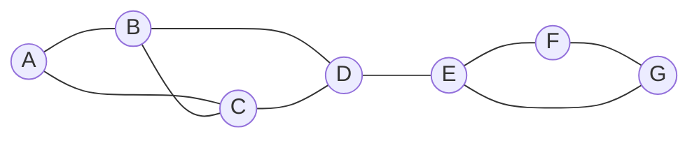

# Louvain社区发现算法原理与代码实例讲解

关键词：社区发现、Louvain算法、模块度、网络科学、图论

## 1. 背景介绍
### 1.1  问题的由来
在现实世界中，许多复杂系统都可以用网络来表示，如社交网络、生物网络、交通网络等。在这些网络中，往往存在着一些紧密联系的节点群体，我们称之为社区或模块。社区发现就是要找出网络中的这些社区结构，以帮助我们更好地理解复杂系统的组织和功能。

### 1.2  研究现状
社区发现是网络科学和数据挖掘领域的一个热门课题，已经提出了许多算法来解决这一问题，如基于图划分的算法、基于模块度优化的算法、动态规划算法等。其中，Louvain算法由于其高效性和对大规模网络的适用性而备受关注。

### 1.3  研究意义
社区发现在许多领域都有重要应用，如社交网络分析、蛋白质相互作用网络分析、推荐系统等。通过发现网络中的社区结构，我们可以更好地理解复杂系统的组织方式，揭示不同社区之间的关系，为进一步的分析和预测提供支持。

### 1.4  本文结构
本文将详细介绍Louvain社区发现算法的原理和实现。第2部分介绍相关的核心概念；第3部分讲解算法的原理和步骤；第4部分给出算法涉及的数学模型和公式；第5部分通过Python代码实例演示算法的具体实现；第6部分讨论算法的实际应用场景；第7部分推荐相关的工具和资源；第8部分总结全文并展望未来的发展方向。

## 2. 核心概念与联系
在讨论Louvain算法之前，我们首先需要了解一些相关的核心概念：

- 图（Graph）：由节点（Node）和连接节点的边（Edge）组成的数据结构，用于表示网络。
- 社区（Community）：图中的一个节点子集，子集内部的节点之间的连接较为紧密，而与外部的连接较为稀疏。
- 模块度（Modularity）：用于衡量一个社区划分的优劣的指标，反映了社区内部边的密度与社区之间边的稀疏程度之间的差异。
- 权重（Weight）：图中每条边的权重，表示节点之间连接的强度。

Louvain算法正是基于模块度来进行社区发现的。它通过不断地优化每个节点的所属社区，使整个网络的模块度不断提高，最终得到一个较好的社区划分结果。

## 3. 核心算法原理 & 具体操作步骤
### 3.1  算法原理概述
Louvain算法是一种基于模块度优化的社区发现算法，通过迭代地将节点移动到能够使模块度提升最大的社区中，不断地提高网络的模块度，直到达到一个稳定的状态。

### 3.2  算法步骤详解
Louvain算法主要分为两个阶段，每个阶段都是一个迭代优化的过程。

#### 阶段1：模块度优化
1. 初始时，每个节点被分配到一个独立的社区中。
2. 对于每个节点 i，考察将其移动到其邻居节点所在的社区中是否能够提升模块度。
3. 选择能够使模块度提升最大的社区，将节点 i 移动到该社区中。
4. 重复步骤 2-3，直到所有节点的社区归属不再变化，达到一个稳定状态。

#### 阶段2：社区聚合
1. 将阶段1得到的社区看作一个新的节点，两个社区之间的边的权重为社区间的边权重之和。
2. 在新的图上重复阶段1的优化过程，直到模块度不再提升。

通过交替执行阶段1和阶段2，Louvain算法最终得到一个层次化的社区结构。

### 3.3  算法优缺点
优点：
- 计算效率高，能够处理大规模网络数据。
- 不需要预先指定社区的数量或大小。
- 能够发现层次化的社区结构。

缺点：
- 算法的结果依赖于节点的遍历顺序。
- 对于某些网络，如果社区结构不明显，算法的效果可能不够理想。

### 3.4  算法应用领域
Louvain算法在许多领域都有广泛应用，如：
- 社交网络分析：发现社交网络中的用户群体。
- 生物信息学：分析蛋白质相互作用网络、基因共表达网络等。
- 推荐系统：基于社区发现的推荐算法。
- 网络安全：检测网络中的异常社区结构。

## 4. 数学模型和公式 & 详细讲解 & 举例说明
### 4.1  数学模型构建
我们用一个加权无向图 $G=(V,E,W)$ 来表示网络，其中 $V$ 为节点集合，$E$ 为边集合，$W$ 为边的权重矩阵。设 $C=\{c_1,c_2,\dots,c_k\}$ 表示图的一个社区划分，其中 $c_i$ 表示第 $i$ 个社区。

模块度 $Q$ 的定义如下：

$$Q=\frac{1}{2m}\sum_{i,j}\left(A_{ij}-\frac{k_ik_j}{2m}\right)\delta(c_i,c_j)$$

其中，$m=\frac{1}{2}\sum_{ij}A_{ij}$ 为图中边的总权重，$A_{ij}$ 为节点 $i$ 和 $j$ 之间的边权重，$k_i=\sum_jA_{ij}$ 为节点 $i$ 的度，$\delta(c_i,c_j)$ 为克罗内克函数，当节点 $i$ 和 $j$ 属于同一个社区时取值为1，否则为0。

直观地理解，模块度衡量了社区内部边的权重与随机情况下的期望值之间的差异。模块度越大，表示社区划分的效果越好。

### 4.2  公式推导过程
将一个节点 $i$ 从社区 $c_i$ 移动到社区 $c_j$ 后，模块度的变化量 $\Delta Q$ 可以表示为：

$$\Delta Q=\left[\frac{\sum_{in}+2k_{i,in}}{2m}-\left(\frac{\sum_{tot}+k_i}{2m}\right)^2\right]-\left[\frac{\sum_{in}}{2m}-\left(\frac{\sum_{tot}}{2m}\right)^2-\left(\frac{k_i}{2m}\right)^2\right]$$

其中，$\sum_{in}$ 表示社区 $c_j$ 内部的边权重之和，$\sum_{tot}$ 表示与社区 $c_j$ 中节点相连的所有边的权重之和，$k_{i,in}$ 表示节点 $i$ 与社区 $c_j$ 中节点相连的边的权重之和，$k_i$ 为节点 $i$ 的度。

在阶段1的优化过程中，对于每个节点，我们选择能够使 $\Delta Q$ 最大的社区进行移动，直到达到稳定状态。

### 4.3  案例分析与讲解
下面我们通过一个简单的例子来说明Louvain算法的执行过程。

考虑如下的一个无向加权图：



假设所有边的权重均为1。

初始时，每个节点被分配到一个独立的社区中：
```
A: {A}, B: {B}, C: {C}, D: {D}, E: {E}, F: {F}, G: {G}
```

在阶段1的优化过程中，节点A首先被考察。将A移动到社区{B}或{C}中都能使模块度提升，这里我们选择移动到{B}中。类似地，节点C也被移动到{B}中。接下来考察节点D，将其移动到{B,A,C}中可以使模块度达到最大，因此D也被移动到该社区。

经过阶段1的优化后，我们得到了两个社区：
```
{A,B,C,D}, {E,F,G}
```

在阶段2中，我们将这两个社区看作新的节点，它们之间有一条权重为1的边相连。重复阶段1的优化过程，发现无法再提升模块度，因此算法终止。

最终得到的社区划分结果为：
```
{A,B,C,D}, {E,F,G}
```

可以看出，Louvain算法成功地发现了图中的两个紧密连接的社区。

### 4.4  常见问题解答
Q: Louvain算法的时间复杂度是多少？
A: 在稀疏图上，Louvain算法的时间复杂度近似为 $O(n\log n)$，其中 $n$ 为节点数。在实践中，算法通常在几轮迭代后就能收敛到较好的结果。

Q: Louvain算法能否处理有向图？
A: 虽然Louvain算法最初是为无向图设计的，但通过适当修改模块度的定义，也可以将其应用于有向图。一种常见的做法是将有向图转化为无向图，然后再应用Louvain算法。

Q: 如何评估Louvain算法的社区发现效果？
A: 除了模块度之外，还可以使用一些外部指标来评估社区发现的效果，如互信息（Mutual Information）、ARI（Adjusted Rand Index）等。这些指标通过将算法的结果与已知的真实社区结构进行比较来衡量算法的性能。

## 5. 项目实践：代码实例和详细解释说明
### 5.1  开发环境搭建
我们将使用Python语言来实现Louvain算法。首先需要安装NetworkX库，它提供了丰富的图论算法和数据结构。可以通过以下命令安装NetworkX：

```bash
pip install networkx
```

### 5.2  源代码详细实现
下面是Louvain算法的Python实现代码：

```python
import networkx as nx
import numpy as np

def louvain(G):
    # 初始化每个节点为一个独立的社区
    communities = {n: i for i, n in enumerate(G.nodes())}

    # 计算初始模块度
    Q = modularity(G, communities)

    while True:
        # 阶段1：模块度优化
        while True:
            changed = False
            for n in G.nodes():
                max_q = 0
                max_c = None
                for c in set(communities.values()):
                    if c == communities[n]:
                        continue
                    q = modularity_gain(G, communities, n, c)
                    if q > max_q:
                        max_q = q
                        max_c = c
                if max_c is not None:
                    communities[n] = max_c
                    changed = True
            if not changed:
                break

        # 阶段2：社区聚合
        new_communities = {}
        for n, c in communities.items():
            if c not in new_communities:
                new_communities[c] = len(new_communities)
        communities = {n: new_communities[c] for n, c in communities.items()}

        # 计算新的模块度
        new_Q = modularity(G, communities)
        if new_Q <= Q:
            break
        Q = new_Q

    return communities

def modularity(G, communities):
    m = G.number_of_edges()
    Q = 0
    for c in set(communities.values()):
        nodes = [n for n in G.nodes() if communities[n] == c]
        e_c = G.subgraph(nodes).number_of_edges()
        a_c = sum(G.degree(nodes).values()) / (2 * m)
        Q += e_c / m - a_c ** 2
    return Q

def modularity_gain(G, communities, n, c):
    m = G.number_of_edges()
    k_i = G.degree(n)
    k_i_in = sum(G.edges[n, v]['weight'] for v in G.neighbors(n) if communities[v] == c)
    sum_in = sum(G.edges[u, v]['weight'] for u, v in G.edges() if communities[u] == c and communities[v] == c)
    sum_tot = sum(G.edges[u, v]['weight'] for u, v in G.edges() if communities[u] == c or communities[v] == c)
    k_i_c = sum(G.edges[n, v]['weight'] for v in G.neighbors(n) if communities[v] == communities[n])
    delta_Q = (sum_in + 2 * k_i_in) / (2 * m) - ((sum_tot + k_i) / (2