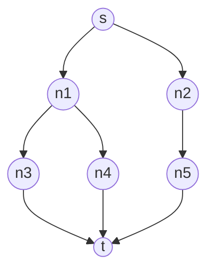

# Robotics 原理与代码实战案例讲解

## 1. 背景介绍
### 1.1  问题的由来
随着人工智能和机器人技术的快速发展,机器人已经成为现代社会不可或缺的一部分。从工业生产到日常生活,机器人正在越来越多的领域发挥着重要作用。然而,对于许多初学者和非专业人士来说,机器人技术仍然是一个相对陌生和复杂的领域。如何让更多人了解和掌握机器人技术,成为了一个亟待解决的问题。

### 1.2  研究现状
目前,国内外已经有许多关于机器人技术的书籍和教程,但大多数都偏重于理论知识的介绍,缺乏实践案例和代码实现的讲解。同时,现有的教材大多针对专业人士和高级用户,对于初学者来说难度较大。因此,如何编写一本适合初学者的、理论与实践相结合的机器人技术教程,成为了一个值得研究的课题。

### 1.3  研究意义
编写一本适合初学者的、理论与实践相结合的机器人技术教程,具有重要的意义:
1. 降低机器人技术的学习门槛,让更多人能够了解和掌握这一前沿技术。
2. 促进机器人技术在各行各业的应用,推动社会生产力的发展。
3. 为机器人技术的进一步发展提供人才储备和知识基础。

### 1.4  本文结构
本文将从以下几个方面对机器人技术进行介绍和讲解:
1. 核心概念与联系
2. 核心算法原理与具体操作步骤
3. 数学模型和公式的详细讲解与举例说明
4. 项目实践:代码实例和详细解释说明
5. 实际应用场景
6. 工具和资源推荐
7. 总结:未来发展趋势与挑战
8. 附录:常见问题与解答

## 2. 核心概念与联系
在机器人技术中,有几个核心概念需要了解和掌握:
- 机器人学(Robotics):研究机器人的设计、制造、控制和应用的科学。
- 机器人(Robot):能够执行特定任务的可编程机电一体化系统。
- 机器人操作系统(ROS):一个开源的机器人软件开发平台。
- 机器视觉(Machine Vision):使机器具备视觉感知能力的技术。
- 机器学习(Machine Learning):使机器具备学习和适应能力的技术。

这些概念之间有着密切的联系。机器人学是一门综合性很强的学科,涉及机械、电子、控制、计算机等多个领域的知识。而机器人操作系统、机器视觉、机器学习等技术则是机器人学的重要组成部分,为机器人赋予了感知、决策和执行的能力。只有很好地理解和掌握这些核心概念,才能更好地学习和应用机器人技术。

## 3. 核心算法原理 & 具体操作步骤
### 3.1  算法原理概述
在机器人技术中,有许多重要的算法,如运动规划算法、路径规划算法、目标识别算法、机器学习算法等。这些算法是机器人感知、决策和执行的基础。下面以路径规划算法 A* 为例,对其原理进行概述。

A* 算法是一种启发式搜索算法,常用于在网格地图中寻找从起点到目标点的最优路径。其基本思想是:从起点开始,根据估计函数 f(n)=g(n)+h(n) 来选择下一个搜索节点,其中 g(n) 表示从起点到当前节点 n 的实际代价,h(n) 表示从当前节点 n 到目标节点的估计代价。重复这一过程,直到找到目标节点或搜索失败。

### 3.2  算法步骤详解
A* 算法的具体步骤如下:
1. 将起点加入 Open 列表。
2. 重复如下过程:
   a. 遍历 Open 列表,选择 f 值最小的节点 n,将其切换到 Close 列表。
   b. 对节点 n 的每个可到达相邻节点 m 执行以下操作:
      - 如果 m 不可达或已在 Close 列表中,略过。
      - 如果 m 不在 Open 列表中,将其加入 Open 列表,并将 n 设为其父节点,计算 f(m)、g(m) 和 h(m)。
      - 如果 m 已在 Open 列表中,检查经由 n 到达 m 的 g 值是否更小,如是则将 n 设为 m 的父节点,并更新 f(m)、g(m)。
   c. 如果目标节点已加入 Close 列表,则找到了最优路径,算法结束;否则继续搜索。

### 3.3  算法优缺点
A* 算法的优点是:
- 完备性:只要存在解,A* 算法就一定能找到解。
- 最优性:找到的路径一定是最优路径。
- 效率高:利用估计函数引导搜索,避免了盲目搜索。

缺点是:
- 空间复杂度高:需要维护 Open 和 Close 两个列表。
- 启发函数的选择很关键,不恰当的启发函数会影响搜索效率。

### 3.4  算法应用领域
A* 算法在机器人路径规划、游戏 AI、GIS 路径查找等领域有广泛应用。在机器人领域,A* 算法常用于为机器人规划无碰撞的运动轨迹。结合机器人的运动学约束和环境信息,可以使用 A* 算法快速高效地为机器人规划出最优路径。

## 4. 数学模型和公式 & 详细讲解 & 举例说明
### 4.1  数学模型构建
在 A* 算法中,估计函数 $f(n)=g(n)+h(n)$ 起着至关重要的作用。其中,
- $g(n)$ 表示从起点 $s$ 到节点 $n$ 的实际代价,通常用起点到节点 $n$ 的实际距离来度量。
- $h(n)$ 表示从节点 $n$ 到目标节点 $t$ 的估计代价,通常采用启发函数来估计。

为了保证 A* 算法的最优性,启发函数 $h(n)$ 必须满足以下条件:
$$
\forall n, h(n) \leq h^*(n)
$$
其中,$h^*(n)$ 表示从节点 $n$ 到目标节点的真实最小代价。即启发函数不能高估到目标节点的代价。

### 4.2  公式推导过程
下面我们来推导为什么启发函数需要满足上述条件。

假设最优路径为 $s \rightarrow \cdots \rightarrow n \rightarrow \cdots \rightarrow t$,则有:
$$
\begin{aligned}
g(t) &= g(n) + c(n, t) \
f(t) &= g(t) + h(t) = g(t) \
f(n) &= g(n) + h(n) \
\end{aligned}
$$
其中,$c(n,t)$ 表示从节点 $n$ 到节点 $t$ 的实际代价。

由于 $h(n)$ 是 $n$ 到 $t$ 的估计代价,因此有:
$$
h(n) \leq c(n, t)
$$
将其代入上式,得:
$$
\begin{aligned}
f(n) &= g(n) + h(n) \
     &\leq g(n) + c(n, t) \
     &= g(t) \
     &= f(t)
\end{aligned}
$$
这说明在搜索过程中,如果 $h(n)$ 满足条件,则当前节点 $n$ 的 $f$ 值总是小于等于最优路径上任意节点的 $f$ 值。因此,A* 算法能够朝着最优路径方向搜索,直到找到目标节点。

### 4.3  案例分析与讲解
下面我们来看一个具体的例子。假设在一个 $5\times5$ 的网格地图中,起点为左上角的节点 $s$,目标点为右下角的节点 $t$。

我们使用曼哈顿距离作为启发函数:
$$
h(n) = |n_x - t_x| + |n_y - t_y|
$$
其中,$(n_x, n_y)$ 和 $(t_x, t_y)$ 分别表示节点 $n$ 和目标节点 $t$ 的坐标。

下图展示了 A* 算法的搜索过程:



其中,每个节点中的数字表示 $f$ 值,绿色表示在 Open 列表中,红色表示在 Close 列表中。

可以看到,A* 算法总是选择 $f$ 值最小的节点进行扩展,最终找到了最优路径 $s \rightarrow n1 \rightarrow n3 \rightarrow t$。

### 4.4  常见问题解答
Q: 如何选择合适的启发函数?
A: 启发函数的选择需要根据具体问题而定。一般来说,启发函数应该尽可能接近真实代价,但又不能高估。常见的启发函数有:
- 曼哈顿距离:适用于只能横向或纵向移动的情况。
- 欧几里得距离:适用于可以斜向移动的情况。
- 对角线距离:介于曼哈顿距离和欧几里得距离之间,适用于可以斜向移动但代价较大的情况。

Q: A* 算法的时间复杂度是多少?
A: A* 算法的时间复杂度与启发函数的选择有关。在最坏情况下,A* 算法可能退化为 Dijkstra 算法,时间复杂度为 $O(b^d)$,其中 $b$ 为每个节点的平均分支数,$d$ 为最优路径的深度。但在平均情况下,良好的启发函数可以极大地缩小搜索范围,使得 A* 算法能够快速找到最优解。

## 5. 项目实践：代码实例和详细解释说明
### 5.1  开发环境搭建
本项目使用 Python 语言实现 A* 算法,并使用 Pygame 库进行可视化展示。读者需要安装以下工具和库:
- Python 3.x
- Pygame

安装好上述工具和库后,就可以开始编写代码了。

### 5.2  源代码详细实现
下面是 A* 算法的 Python 实现代码:

```python
import pygame
import math

# 定义节点类
class Node:
    def __init__(self, parent=None, position=None):
        self.parent = parent
        self.position = position
        self.g = 0
        self.h = 0
        self.f = 0

    def __eq__(self, other):
        return self.position == other.position

# 定义 A* 算法函数
def astar(maze, start, end):
    # 初始化起点和终点
    start_node = Node(None, start)
    start_node.g = start_node.h = start_node.f = 0
    end_node = Node(None, end)
    end_node.g = end_node.h = end_node.f = 0

    # 初始化 Open 和 Close 列表
    open_list = []
    closed_list = []

    # 将起点加入 Open 列表
    open_list.append(start_node)

    # 循环搜索
    while len(open_list) > 0:
        # 获取当前节点
        current_node = open_list[0]
        current_index = 0
        for index, item in enumerate(open_list):
            if item.f < current_node.f:
                current_node = item
                current_index = index

        # 将当前节点移出 Open 列表,加入 Close 列表
        open_list.pop(current_index)
        closed_list.append(current_node)

        # 找到目标节点,返回路径
        if current_node == end_node:
            path = []
            current = current_node
            while current is not None:
                path.append(current.position)
                current = current.parent
            return path[::-1]

        # 生成子节点
        children = []
        for new_position in [(0, -1), (0, 1), (-1, 0), (1, 0), (-1, -1), (-1, 1), (1, -1), (1, 1)]:
            # 获取节点位置
            node_position = (current_node.position[0]