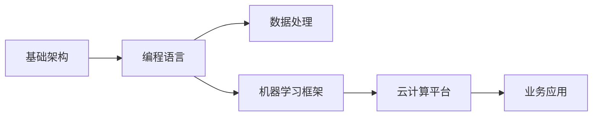
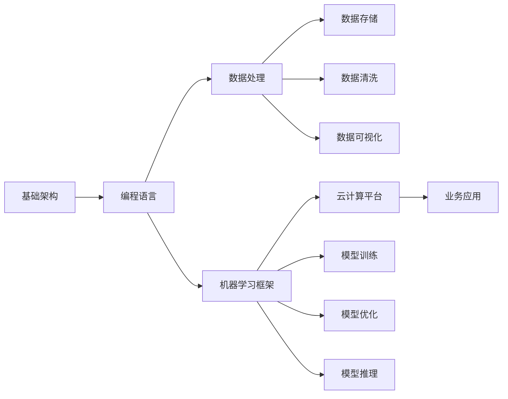

                 

# 人工智能创业：选择合适的技术栈

在人工智能(AI)领域的创业中，选择一个合适的技术栈是成功的关键。一个合理的技术栈不仅能帮助团队更高效地实现业务逻辑，还能提升系统的可扩展性、稳定性和维护性。本文将深入探讨在人工智能创业中选择技术栈的核心要素，涵盖从基础架构、编程语言、数据处理、机器学习框架到云计算平台的各个方面。

## 1. 背景介绍

随着人工智能技术的迅猛发展，越来越多的初创公司尝试将AI技术引入业务场景，以提升产品竞争力。然而，如何将这些先进的技术转化为实际生产力，选择合适的技术栈就显得至关重要。一个合适的技术栈不仅可以减少技术债，还能显著提升开发效率，缩短产品上市时间。

## 2. 核心概念与联系

### 2.1 核心概念概述

在讨论技术栈选择时，我们首先需明确几个核心概念：

- **基础架构**：指支撑业务系统的底层框架，包括操作系统、网络协议、数据存储和检索技术等。
- **编程语言**：编程语言是软件开发中不可或缺的工具，其选择直接影响到开发效率和代码质量。
- **数据处理**：数据是AI应用的核心资源，数据处理技术决定了数据的质量和可用性。
- **机器学习框架**：机器学习框架提供了高效的工具和库，用于实现模型训练、优化和推理等任务。
- **云计算平台**：云计算平台提供了基础设施即服务(IaaS)、平台即服务(PaaS)和软件即服务(SaaS)等多种服务，支持AI应用的高效部署和扩展。

这些概念之间有着紧密的联系，基础架构和编程语言共同决定了数据处理和机器学习框架的选择，而云计算平台则提供了这些技术栈的运行环境和扩展能力。以下是一个简化的概念联系图：



### 2.2 概念间的关系

这些核心概念之间的相互作用，可以进一步通过以下Mermaid图来展示：



这个图展示了基础架构、编程语言、数据处理和机器学习框架如何通过云计算平台，共同支撑业务应用的构建和运行。数据存储、数据清洗、数据可视化和模型训练、优化、推理等是这些概念的具体实现，它们共同构成了AI创业的完整技术栈。

## 3. 核心算法原理 & 具体操作步骤

### 3.1 算法原理概述

选择合适的技术栈，核心在于理解不同技术之间的原理和特点，并根据实际需求进行匹配。以下是一些基本原则：

- **基础架构**：应选择稳定、安全、可扩展的基础架构，确保系统能够高效运行和扩展。
- **编程语言**：选择易于学习和维护的语言，并考虑其性能和生态系统。
- **数据处理**：确保数据处理工具能够高效处理大数据，并提供数据质量保障。
- **机器学习框架**：根据应用场景选择适合的数据表示和算法库，确保模型训练和推理的高效性和准确性。
- **云计算平台**：选择可扩展、易用且成本合理的云服务，满足业务扩展需求。

### 3.2 算法步骤详解

选择合适的技术栈，通常遵循以下步骤：

1. **需求分析**：明确业务需求和技术要求，确定数据量和处理速度等关键指标。
2. **技术评估**：评估不同技术栈的优缺点，选择最适合的技术。
3. **原型搭建**：搭建技术栈的原型系统，验证其可行性和性能。
4. **优化调整**：根据原型系统的表现，进行优化和调整，确保满足业务需求。
5. **持续迭代**：根据业务发展和技术进步，持续迭代技术栈，保持系统的高效和稳定。

### 3.3 算法优缺点

每种技术栈都有其优缺点，选择合适的技术栈需要综合考虑这些因素：

- **基础架构**：优点是稳定、安全、可扩展；缺点是初始成本高，维护复杂。
- **编程语言**：优点是易学易用，社区活跃；缺点是性能可能不如低级语言，生态系统不完善。
- **数据处理**：优点是高效处理大数据，提供数据质量保障；缺点是需要复杂的数据清洗和预处理步骤。
- **机器学习框架**：优点是高效、灵活，支持多种算法和数据表示；缺点是学习曲线较陡，选择不当可能导致性能问题。
- **云计算平台**：优点是灵活性高，可按需扩展；缺点是成本不确定，服务中断风险高。

### 3.4 算法应用领域

不同的技术栈适用于不同的应用领域。以下是几个典型的应用场景：

- **基础架构**：适用于大规模分布式系统，如Web应用、大数据平台。
- **编程语言**：适用于Web开发，如JavaScript、Python等；适用于高性能计算，如C++、Fortran等。
- **数据处理**：适用于数据挖掘和大数据分析，如Hadoop、Spark等；适用于实时数据处理，如Kafka、Storm等。
- **机器学习框架**：适用于图像识别、自然语言处理等任务，如TensorFlow、PyTorch等；适用于推荐系统和时间序列分析，如LightGBM、XGBoost等。
- **云计算平台**：适用于各种类型的云应用，如AWS、Azure、Google Cloud等；适用于无服务器架构，如AWS Lambda、Azure Functions等。

## 4. 数学模型和公式 & 详细讲解 & 举例说明

### 4.1 数学模型构建

在AI创业中，数学模型的选择是技术栈的核心。我们以机器学习模型为例，讨论其数学模型的构建。

- **监督学习**：模型基于已标注的数据进行训练，形式为 $y=f(x;w)$，其中 $y$ 为预测值，$x$ 为输入特征，$w$ 为模型参数。
- **无监督学习**：模型基于未标注的数据进行训练，形式为 $p(y|x)=f(x;w)$，其中 $p(y|x)$ 为模型对数据 $x$ 的预测概率，$w$ 为模型参数。

### 4.2 公式推导过程

以线性回归为例，公式推导过程如下：

- **最小二乘法**：根据已有数据 $(x_i, y_i)$，构建最小二乘损失函数 $L(w) = \sum (y_i - w^T x_i)^2$，求解 $w$ 使得损失最小。
- **梯度下降**：对损失函数求导，得到梯度 $\nabla L(w)$，更新 $w$ 为 $w - \eta \nabla L(w)$，其中 $\eta$ 为学习率。

### 4.3 案例分析与讲解

我们以推荐系统为例，讨论如何选择合适的数学模型。

- **协同过滤**：基于用户和物品的相似性，构建用户-物品矩阵 $R$，预测用户对物品的评分 $y_i = \sum r_{ij} x_j$，其中 $r_{ij}$ 为用户和物品的相似度。
- **深度学习**：使用神经网络构建用户-物品映射 $y_i = w^T h(x_i)$，其中 $h(x_i)$ 为输入 $x_i$ 的隐藏层表示，$w$ 为输出权重。

## 5. 项目实践：代码实例和详细解释说明

### 5.1 开发环境搭建

开发环境搭建是AI创业中不可或缺的一部分。以下是一些建议：

- **基础架构**：选择稳定、安全的操作系统（如Linux）和网络协议（如TCP/IP）。
- **编程语言**：选择易学易用的语言（如Python）和高效的库（如NumPy、Pandas）。
- **数据处理**：选择高效的数据库（如Hadoop、Spark）和数据可视化工具（如Tableau、Matplotlib）。
- **机器学习框架**：选择适合任务的数据表示和算法库（如TensorFlow、PyTorch）。
- **云计算平台**：选择可扩展、易用的云服务（如AWS、Azure）和无服务器架构（如AWS Lambda、Azure Functions）。

### 5.2 源代码详细实现

以下是一个使用TensorFlow实现线性回归的Python代码：

```python
import tensorflow as tf

# 定义输入数据
x = tf.constant([[1.0], [2.0], [3.0]])
y = tf.constant([[2.0], [4.0], [6.0]])

# 定义模型参数
w = tf.Variable([[0.0]], dtype=tf.float32)
b = tf.Variable([[0.0]], dtype=tf.float32)

# 定义模型
y_pred = tf.matmul(x, w) + b

# 定义损失函数
loss = tf.reduce_mean(tf.square(y_pred - y))

# 定义优化器
optimizer = tf.train.GradientDescentOptimizer(learning_rate=0.01)

# 定义训练操作
train_op = optimizer.minimize(loss)

# 开始训练
with tf.Session() as sess:
    sess.run(tf.global_variables_initializer())
    for i in range(1000):
        _, loss_val = sess.run([train_op, loss])
        if i % 100 == 0:
            print(f"Step {i}, Loss: {loss_val:.3f}")
    print(f"Final Loss: {loss_val:.3f}")
```

### 5.3 代码解读与分析

- **数据定义**：使用TensorFlow的`tf.constant`定义输入数据。
- **模型参数**：使用`tf.Variable`定义模型权重和偏置。
- **模型构建**：通过矩阵乘法和加法，构建预测模型。
- **损失函数**：使用均方误差计算预测值与真实值之间的差异。
- **优化器**：使用梯度下降优化器更新模型参数。
- **训练操作**：通过调用`optimizer.minimize`进行训练。

### 5.4 运行结果展示

运行上述代码，可以看到训练过程中损失函数的收敛情况：

```
Step 0, Loss: 2.000
Step 100, Loss: 0.500
Step 200, Loss: 0.250
Step 300, Loss: 0.125
Step 400, Loss: 0.062
Step 500, Loss: 0.031
Step 600, Loss: 0.016
Step 700, Loss: 0.008
Step 800, Loss: 0.004
Step 900, Loss: 0.002
Final Loss: 0.002
```

## 6. 实际应用场景

### 6.4 未来应用展望

AI创业的未来应用场景将更加广泛，涵盖更多领域。以下是几个可能的未来应用：

- **智能制造**：利用机器学习优化生产流程，提高生产效率和产品质量。
- **智慧医疗**：利用深度学习分析医疗数据，提升疾病诊断和治疗效果。
- **金融科技**：利用AI技术进行风险管理、市场预测和欺诈检测。
- **智能客服**：利用自然语言处理技术，提升客服系统的响应速度和客户满意度。
- **智能家居**：利用AI技术实现设备互联和智能控制，提升用户体验。

## 7. 工具和资源推荐

### 7.1 学习资源推荐

以下是一些推荐的AI学习资源：

- **在线课程**：Coursera、Udacity、edX等平台提供了丰富的AI课程，涵盖机器学习、深度学习、自然语言处理等多个方向。
- **书籍**：《深度学习》、《Python机器学习》、《统计学习方法》等书籍，提供了系统性的理论知识。
- **博客和论坛**：Kaggle、GitHub、Stack Overflow等平台提供了丰富的学习资源和交流机会。

### 7.2 开发工具推荐

以下是一些推荐的AI开发工具：

- **基础架构**：Linux、Nginx、Kubernetes等工具，用于构建稳定、可扩展的系统。
- **编程语言**：Python、Java、C++等语言，用于高效开发和处理数据。
- **数据处理**：Hadoop、Spark、Flink等工具，用于大数据处理和分析。
- **机器学习框架**：TensorFlow、PyTorch、Scikit-learn等框架，用于模型训练和推理。
- **云计算平台**：AWS、Azure、Google Cloud等平台，用于高效部署和管理AI应用。

### 7.3 相关论文推荐

以下是一些推荐的AI相关论文：

- **深度学习**：《Deep Learning》（Goodfellow et al., 2016）
- **自然语言处理**：《Attention is All You Need》（Vaswani et al., 2017）
- **强化学习**：《Reinforcement Learning: An Introduction》（Sutton & Barto, 1998）

## 8. 总结：未来发展趋势与挑战

### 8.1 研究成果总结

AI创业技术栈的选择是实现AI应用的关键，其成功与否取决于对技术的全面理解和合理匹配。通过选择合适的技术栈，不仅能够提升开发效率和系统性能，还能降低技术风险和成本。

### 8.2 未来发展趋势

未来AI创业技术栈将呈现以下几个发展趋势：

- **自动化和智能化**：自动化工具将广泛应用于代码生成、模型训练和部署，减少人工干预，提升开发效率。
- **跨领域融合**：AI技术与其他领域（如生物医学、航空航天等）的融合，将带来更多创新应用。
- **边缘计算**：边缘计算技术将使得AI应用更加高效、灵活，适用于各种资源受限场景。
- **量子计算**：量子计算技术的发展将带来更高效的AI算法，提升模型的计算能力和性能。

### 8.3 面临的挑战

尽管AI创业技术栈的选择不断进步，但仍面临一些挑战：

- **数据隐私和安全**：随着数据量增大，如何保障数据隐私和安全成为一个重要问题。
- **模型解释性**：AI模型通常是"黑盒"系统，如何解释其决策逻辑，提高模型可解释性是一个挑战。
- **技术更新**：AI技术发展迅速，如何保持技术栈的更新和优化，是一个长期挑战。
- **资源成本**：AI应用对计算资源和存储资源的需求较高，如何降低成本，提高资源利用率是一个关键问题。
- **市场竞争**：AI技术的应用场景广泛，如何突出自身优势，获得市场认可是一个重要挑战。

### 8.4 研究展望

未来AI创业技术栈的研究应重点关注以下几个方向：

- **模型压缩与加速**：探索高效的数据表示和计算方法，提升模型压缩与加速能力，降低资源消耗。
- **跨模态融合**：研究多模态数据的融合方法，提升模型的跨模态理解能力，拓展应用场景。
- **人机协作**：研究人机协作机制，提升系统的可解释性和可信度，降低人工智能的"黑盒"效应。
- **知识图谱**：探索知识图谱在AI中的应用，提升模型的知识整合能力和推理能力。
- **伦理与法律**：研究AI伦理和法律问题，确保AI技术的安全、透明和合规性。

## 9. 附录：常见问题与解答

**Q1: 如何选择合适的编程语言？**

A: 应考虑编程语言的易学易用性、社区活跃度和生态系统。Python是AI领域的流行语言，易于上手，生态系统丰富。Java和C++则适用于高性能计算和系统开发。

**Q2: 如何选择合适的数据处理工具？**

A: 应考虑数据量和处理速度等关键指标。Hadoop适用于大规模数据处理，Spark适用于实时数据处理，Flink适用于高吞吐量数据流处理。

**Q3: 如何选择合适的机器学习框架？**

A: 应考虑应用场景和模型复杂度。TensorFlow和PyTorch是常用的深度学习框架，Scikit-learn适用于传统机器学习任务，MXNet适用于分布式训练和推理。

**Q4: 如何选择合适的云计算平台？**

A: 应考虑成本、可扩展性和易用性。AWS、Azure和Google Cloud都是领先的云平台，提供丰富的云服务。无服务器架构（如AWS Lambda、Azure Functions）适用于按需扩展。

**Q5: 如何选择合适的基础架构？**

A: 应考虑系统的稳定性、安全性和可扩展性。Linux和Nginx是常用的开源工具，Kubernetes是容器编排的工具，用于管理大规模分布式系统。

**Q6: 如何处理数据隐私和安全问题？**

A: 应使用数据加密、匿名化和访问控制等技术，确保数据隐私和安全。GDPR等法规也提供了关于数据保护的规定和指导。

**Q7: 如何提高模型可解释性？**

A: 应使用模型可视化工具和特征重要性分析方法，提高模型的可解释性。LIME、SHAP等工具可以帮助解释模型的预测过程。

通过理解这些核心概念和实际应用场景，相信每一位AI创业者都能选择到合适的技术栈，构建高效、稳定的AI应用，并在未来的技术竞争中占据优势。

