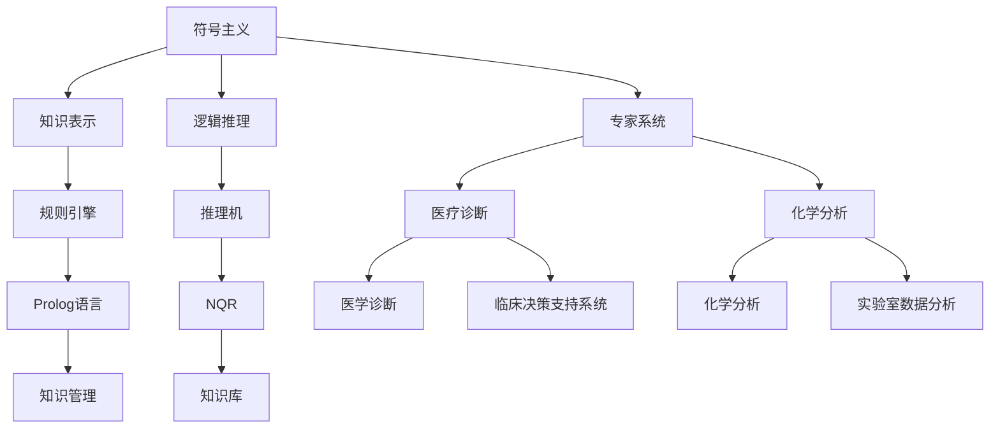
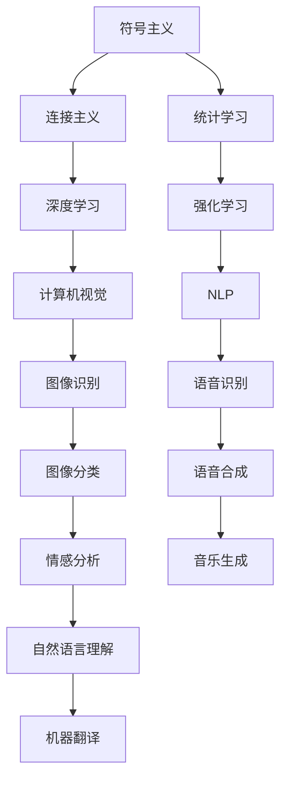
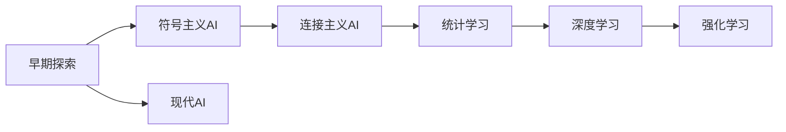
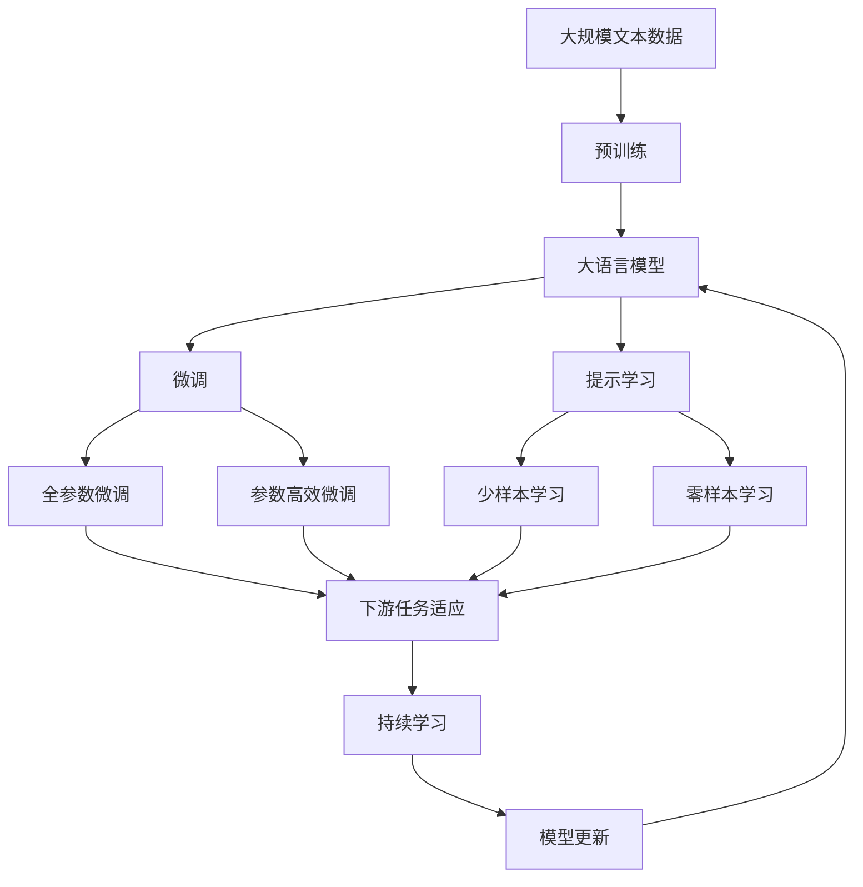

                 

# 人工智能领域的奠基者们

> 关键词：人工智能,计算机科学,历史,先驱,技术创新,机器学习

## 1. 背景介绍

人工智能(Artificial Intelligence, AI)是计算机科学的一个分支，旨在模拟人类智能行为，如学习、推理、感知、理解语言等。自1950年代以来，众多科学家和工程师在人工智能领域探索创新，奠定了这一领域的科学基础和技术体系。本文将聚焦于这些开创性人物和关键技术，揭示其对人工智能发展的深远影响。

### 1.1 人工智能的起源

人工智能的起源可以追溯到1950年代，由计算机科学家约翰·麦卡锡（John McCarthy）和马文·明斯基（Marvin Minsky）等人在达特茅斯会议上提出的“人工智能”概念。这个会议上，他们明确了人工智能的目标和研究方向，从而开启了这一领域的探索之旅。

### 1.2 人工智能的发展历程

人工智能的发展历程可以分为以下几个阶段：

1. **早期探索（1950s-1960s）**：
    - 定义概念并探索基本问题。
    - 开发了早期的计算机程序，如Logic Theorist、Tapester等，以处理推理和逻辑问题。

2. **符号主义AI（1970s-1980s）**：
    - 基于规则和逻辑的系统，如Expert Systems、Prolog等。
    - 引入知识表示和推理机制，解决特定领域问题，如医学诊断、化学分析等。

3. **连接主义AI（1980s-1990s）**：
    - 引入神经网络、感知器等模型，通过学习来解决模式识别和预测问题。
    - 产生了最早的商业应用，如神经网络在图像识别和信号处理中的应用。

4. **统计学习与机器学习（1990s至今）**：
    - 引入数据驱动的机器学习算法，如图像识别、自然语言处理、推荐系统等。
    - 深度学习等技术的突破，使得AI在多个领域取得突破性进展。

## 2. 核心概念与联系

### 2.1 核心概念概述

为更好地理解人工智能的发展脉络，本节将介绍几个关键概念：

- **符号主义**：通过符号和规则表达知识，进行逻辑推理，如Prolog语言、规则引擎等。
- **连接主义**：通过神经元之间的连接进行信息传递和处理，如神经网络、感知器等。
- **统计学习**：基于统计模型学习数据规律，进行分类、回归、聚类等任务。
- **深度学习**：通过多层次的非线性变换，学习高度抽象的特征表示，如卷积神经网络（CNN）、循环神经网络（RNN）、Transformer等。
- **强化学习**：通过与环境交互，通过奖励机制学习最优策略，如AlphaGo、OpenAI Gym等。

这些核心概念之间的逻辑关系可以通过以下Mermaid流程图来展示：



这个流程图展示了大语言模型微调过程中各个核心概念的关系和作用：

1. 符号主义利用知识表示和推理，构建专家系统等知识驱动的AI系统。
2. 连接主义通过神经网络进行模式识别和预测。
3. 统计学习利用数据驱动的模型解决分类、回归等任务。
4. 深度学习通过多层非线性变换学习特征表示。
5. 强化学习通过与环境的交互，优化决策策略。

这些核心概念共同构成了人工智能的技术框架，推动了AI从理论研究到实际应用的跨越。

### 2.2 概念间的关系

这些核心概念之间存在着紧密的联系，形成了人工智能的发展脉络。下面我通过几个Mermaid流程图来展示这些概念之间的关系。

#### 2.2.1 人工智能的技术框架



这个流程图展示了人工智能各个分支领域的技术框架：

1. 符号主义和连接主义共同构成认知推理的基础。
2. 统计学习、深度学习和强化学习分别在不同领域应用，如计算机视觉、自然语言处理、游戏智能等。
3. 基于符号主义、连接主义和统计学习构建的各种AI系统，如专家系统、机器视觉、语音识别等。

#### 2.2.2 人工智能的历史发展



这个流程图展示了人工智能从早期探索到现代AI的发展历程：

1. 早期探索奠定了人工智能的基本概念和研究方向。
2. 符号主义和连接主义构建了早期AI的技术体系。
3. 统计学习和深度学习进一步推动了AI的演进。
4. 强化学习成为AI最新研究的热点。
5. 现代AI技术体系的形成，使得AI在多个领域取得突破性进展。

### 2.3 核心概念的整体架构

最后，我们用一个综合的流程图来展示这些核心概念在大语言模型微调过程中的整体架构：



这个综合流程图展示了从预训练到微调，再到持续学习的完整过程。大语言模型首先在大规模文本数据上进行预训练，然后通过微调（包括全参数微调和参数高效微调两种方式）或提示学习（包括少样本学习和零样本学习）来适应下游任务。最后，通过持续学习技术，模型可以不断更新和适应新的任务和数据。 通过这些流程图，我们可以更清晰地理解人工智能的发展脉络和技术框架，为后续深入讨论具体技术奠定基础。

## 3. 核心算法原理 & 具体操作步骤
### 3.1 算法原理概述

人工智能的核心算法原理可以追溯到1950年代的早期探索。以下是几个关键算法的概述：

1. **符号主义**：
    - **知识表示**：通过符号和逻辑表达式表示知识，如Prolog语言的规则引擎。
    - **逻辑推理**：通过符号推理器进行逻辑推理，如Prolog的规则匹配。

2. **连接主义**：
    - **神经网络**：通过多层次的非线性变换学习特征表示，如反向传播算法。
    - **感知器**：简单的神经元模型，用于模式识别和预测。

3. **统计学习**：
    - **回归分析**：通过最小化预测误差来学习回归模型，如线性回归。
    - **分类算法**：通过最大化类别正确率来学习分类模型，如逻辑回归、决策树。

4. **深度学习**：
    - **卷积神经网络（CNN）**：用于图像识别和信号处理，通过卷积和池化层学习局部特征。
    - **循环神经网络（RNN）**：用于序列数据处理，通过循环结构捕捉时间依赖关系。
    - **Transformer**：用于自然语言处理，通过自注意力机制学习全局特征。

### 3.2 算法步骤详解

以下是几个核心算法的基本步骤：

**符号主义AI**：

1. **定义知识库**：
    - 收集和定义领域的知识和规则。
    - 使用符号主义语言（如Prolog）表示知识库。

2. **推理规则**：
    - 定义推理规则和逻辑表达式。
    - 使用推理机执行推理，生成新的结论。

**连接主义AI**：

1. **构建神经网络**：
    - 设计神经网络的结构，如层数、激活函数等。
    - 初始化神经网络的权重和偏置。

2. **训练神经网络**：
    - 准备训练数据集，如MNIST手写数字数据集。
    - 使用反向传播算法更新神经网络权重。

**统计学习**：

1. **数据预处理**：
    - 清洗和标准化数据集。
    - 划分训练集和测试集。

2. **模型训练**：
    - 选择模型架构，如线性回归、逻辑回归、决策树等。
    - 使用训练集拟合模型参数。

**深度学习**：

1. **模型构建**：
    - 设计深度学习模型架构，如CNN、RNN、Transformer等。
    - 初始化模型参数。

2. **模型训练**：
    - 准备训练数据集，如ImageNet图像数据集。
    - 使用反向传播算法和梯度下降法更新模型参数。

### 3.3 算法优缺点

这些核心算法各有优缺点，总结如下：

**符号主义AI**：
- **优点**：形式化、结构化强，逻辑推理严谨。
- **缺点**：知识库构建复杂，难以处理复杂任务。

**连接主义AI**：
- **优点**：能够处理非结构化数据，具有自适应能力。
- **缺点**：模型结构复杂，训练时间长。

**统计学习**：
- **优点**：模型结构简单，训练速度快。
- **缺点**：数据依赖性强，泛化能力有限。

**深度学习**：
- **优点**：能够学习高度抽象的特征表示，泛化能力强。
- **缺点**：模型参数量大，训练资源需求高。

### 3.4 算法应用领域

这些核心算法在不同领域有着广泛的应用：

1. **符号主义**：用于专家系统、医疗诊断、化学分析等知识密集型领域。

2. **连接主义**：用于计算机视觉、语音识别、自然语言处理等感知任务。

3. **统计学习**：用于推荐系统、金融预测、医疗诊断等数据密集型领域。

4. **深度学习**：用于自动驾驶、语音合成、自然语言处理、游戏智能等复杂任务。

## 4. 数学模型和公式 & 详细讲解  
### 4.1 数学模型构建

本节将使用数学语言对人工智能的核心算法进行更加严格的刻画。

以**线性回归**为例，其数学模型构建如下：

假设有一个训练数据集 $D=\{(x_i,y_i)\}_{i=1}^N$，其中 $x_i$ 是特征向量，$y_i$ 是目标变量。定义线性回归模型的参数为 $\theta = [w,b]$，其中 $w$ 是特征权重，$b$ 是截距。则线性回归模型的预测值为：

$$
y_{\text{pred}} = \theta^T x
$$

其中 $x = [x_1, x_2, ..., x_n]^T$ 是特征向量，$\theta^T$ 是参数向量。

定义损失函数为均方误差损失（Mean Squared Error, MSE）：

$$
L(\theta) = \frac{1}{2N} \sum_{i=1}^N (y_i - y_{\text{pred}})^2
$$

其中 $y_{\text{pred}} = \theta^T x_i$ 是模型预测值。

### 4.2 公式推导过程

以下以**逻辑回归**为例，推导其公式。

假设有一个二分类问题，训练数据集 $D=\{(x_i,y_i)\}_{i=1}^N$，其中 $x_i$ 是特征向量，$y_i \in \{0,1\}$ 是目标变量。定义逻辑回归模型的参数为 $\theta = [w_0, w_1, ..., w_n]^T$，其中 $w_0$ 是截距，$w_i$ 是特征权重。则逻辑回归模型的预测值为：

$$
y_{\text{pred}} = \sigma(\theta^T x)
$$

其中 $\sigma(z) = \frac{1}{1+e^{-z}}$ 是逻辑函数（Sigmoid函数）。

定义损失函数为交叉熵损失（Cross-Entropy Loss）：

$$
L(\theta) = -\frac{1}{N} \sum_{i=1}^N y_i \log y_{\text{pred}} + (1 - y_i) \log (1 - y_{\text{pred}})
$$

其中 $y_{\text{pred}} = \sigma(\theta^T x_i)$ 是模型预测值。

### 4.3 案例分析与讲解

**案例1: 手写数字识别**

假设有一个手写数字识别问题，训练数据集 $D=\{(x_i,y_i)\}_{i=1}^N$，其中 $x_i$ 是28x28像素的手写数字图片，$y_i$ 是数字标签。定义一个多层感知器（MLP）模型，包含两个隐藏层，每个隐藏层有128个神经元，激活函数为ReLU。

1. **模型构建**：
    - 使用Matplotlib和NumPy加载和可视化训练数据集。
    - 定义MLP模型的架构和激活函数。
    - 初始化模型参数。

2. **训练模型**：
    - 准备训练数据集，将像素数据展开成特征向量。
    - 使用交叉熵损失函数和随机梯度下降法训练模型。
    - 在验证集上评估模型性能。

3. **预测测试集**：
    - 准备测试数据集，将像素数据展开成特征向量。
    - 使用训练好的模型进行预测，并计算分类准确率。

## 5. 项目实践：代码实例和详细解释说明
### 5.1 开发环境搭建

在进行AI项目实践前，我们需要准备好开发环境。以下是使用Python进行TensorFlow开发的环境配置流程：

1. 安装Anaconda：从官网下载并安装Anaconda，用于创建独立的Python环境。

2. 创建并激活虚拟环境：
```bash
conda create -n tf-env python=3.8 
conda activate tf-env
```

3. 安装TensorFlow：根据CUDA版本，从官网获取对应的安装命令。例如：
```bash
conda install tensorflow -c pytorch -c conda-forge
```

4. 安装各类工具包：
```bash
pip install numpy pandas scikit-learn matplotlib tqdm jupyter notebook ipython
```

完成上述步骤后，即可在`tf-env`环境中开始AI项目实践。

### 5.2 源代码详细实现

下面我们以线性回归模型为例，给出使用TensorFlow进行回归分析的PyTorch代码实现。

```python
import tensorflow as tf
import numpy as np
import matplotlib.pyplot as plt

# 准备数据
X = np.array([[0, 1], [1, 2], [2, 3], [3, 4]])
y = np.array([[1], [2], [3], [4]])

# 定义模型
w = tf.Variable(tf.zeros([2, 1]))
b = tf.Variable(tf.zeros([1]))
x = tf.placeholder(tf.float32, [None, 2])
y_true = tf.placeholder(tf.float32, [None, 1])

# 定义模型预测
y_pred = tf.matmul(x, w) + b

# 定义损失函数
loss = tf.reduce_mean(tf.square(y_pred - y_true))

# 定义优化器
optimizer = tf.train.GradientDescentOptimizer(learning_rate=0.01).minimize(loss)

# 训练模型
with tf.Session() as sess:
    sess.run(tf.global_variables_initializer())
    for i in range(1000):
        sess.run(optimizer, feed_dict={x: X, y_true: y})
    w_value, b_value = sess.run([w, b])
    print("w =", w_value, "b =", b_value)

# 预测新样本
x_test = np.array([[4, 5], [5, 6]])
y_test_pred = sess.run(y_pred, feed_dict={x: x_test})
print("y_test_pred =", y_test_pred)
```

### 5.3 代码解读与分析

让我们再详细解读一下关键代码的实现细节：

**线性回归模型**：
- 准备数据：定义特征向量 $X$ 和目标变量 $y$。
- 定义模型：使用`tf.Variable`定义权重 $w$ 和截距 $b$，使用`tf.placeholder`定义输入 $x$ 和目标变量 $y$。
- 定义模型预测：使用矩阵乘法和加法计算预测值 $y_{\text{pred}}$。
- 定义损失函数：使用均方误差损失 $L$。
- 定义优化器：使用梯度下降法最小化损失函数。
- 训练模型：使用`tf.Session`进行模型训练，迭代1000次。
- 预测新样本：使用训练好的模型对新样本进行预测。

**TensorFlow**：
- `tf.Variable`：定义可训练的变量。
- `tf.placeholder`：定义输入占位符。
- `tf.matmul`：矩阵乘法。
- `tf.reduce_mean`：计算损失函数均值。
- `tf.train.GradientDescentOptimizer`：定义梯度下降优化器。
- `tf.global_variables_initializer`：初始化所有变量。

**预测测试集**：
- 准备测试数据集。
- 使用训练好的模型对测试集进行预测，并计算预测值。

## 6. 实际应用场景
### 6.1 智能推荐系统

基于AI的智能推荐系统可以广泛应用于电商、视频、音乐等多个领域。推荐系统通过分析用户的历史行为数据，预测其未来兴趣，推荐相关商品或内容。

在技术实现上，可以使用协同过滤、内容推荐、深度学习等方法。使用协同过滤算法，可以根据用户历史评分数据推荐相似物品。使用深度学习模型，如基于神经网络的推荐系统，可以从用户行为中学习高级特征表示，生成更加个性化的推荐。

### 6.2 智能医疗诊断

AI在医疗领域的应用也在不断扩展。基于AI的智能诊断系统可以通过分析病历、影像、基因数据等，辅助医生进行疾病诊断。

例如，使用深度学习模型可以对医学影像进行分类和标注，帮助放射科医生识别病变区域。使用自然语言处理技术，可以从电子病历中提取和分析病史信息，辅助诊断。

### 6.3 智能交通管理

AI在交通管理中的应用也越来越广泛。智能交通系统可以通过分析交通流量数据，优化信号灯控制，缓解交通拥堵。

例如，使用机器学习模型预测交通流量，实时调整信号灯时序，提高交通效率。使用计算机视觉技术，可以实时监测交通违规行为，提高执法效率。

### 6.4 未来应用展望

随着AI技术的不断发展，未来的应用场景将更加广泛和深入。以下是几个未来应用展望：

1. **自动驾驶**：AI在自动驾驶领域的应用将进一步扩展，通过深度学习技术，实现自动驾驶汽车的视觉感知、路径规划和行为决策。

2. **机器人**：基于AI的机器人将广泛用于家庭、工业、医疗等多个领域，具备更高的自主性和智能性。

3. **增强现实**：AI在增强现实技术中的应用将带来更加沉浸和交互的体验，如虚拟助手、游戏等。

4. **智能城市**：AI在智能城市治理中的应用将进一步扩展，涵盖城市交通、环境监测、公共安全等多个方面。

5. **金融科技**：AI在金融领域的应用将进一步深入，如智能投顾、信用评估、风险管理等。

## 7. 工具和资源推荐
### 7.1 学习资源推荐

为了帮助开发者系统掌握人工智能的核心算法和实践技术，这里推荐一些优质的学习资源：

1. 《深度学习》（Ian Goodfellow等著）：深度学习领域的经典教材，涵盖了从基础到高级的深度学习算法和实践。

2. 《机器学习实战》（Peter Harrington著）：入门级的机器学习实践指南，通过Python和Scikit-learn库实现多种机器学习算法。

3. Coursera《机器学习》课程：由斯坦福大学Andrew Ng教授主讲，涵盖机器学习的基本概念和算法，是学习机器学习的入门课程。

4. 《Python深度学习》（Francois Chollet著）：深度学习领域的入门书籍，通过Keras实现深度学习模型。

5. Kaggle平台：数据科学和机器学习的竞赛平台，提供大量数据集和实践机会，可以帮助开发者提升实战技能。

通过对这些资源的学习实践，相信你一定能够快速掌握人工智能的核心算法和实践技巧，并用于解决实际的AI问题。

### 7.2 开发工具推荐

高效的开发离不开优秀的工具支持。以下是几款用于AI项目开发的常用工具：

1. PyTorch：基于Python的开源深度学习框架，灵活动态的计算图，适合快速迭代研究。大部分预训练深度学习模型都有PyTorch版本的实现。

2. TensorFlow：由Google主导开发的开源深度学习框架，生产部署方便，适合大规模工程应用。同样有丰富的深度学习模型资源。

3. Keras：基于TensorFlow的高级深度学习API，易于使用，适合快速原型开发。

4. Jupyter Notebook：基于Python的交互式编程环境，方便记录和分享实验过程。

5. Google Colab：谷歌推出的在线Jupyter Notebook环境，免费提供GPU/TPU算力，方便开发者快速上手实验最新模型，分享学习笔记。

6. Weights & Biases：模型训练的实验跟踪工具，可以记录和可视化模型训练过程中的各项指标，方便对比和调优。与主流深度学习框架无缝集成。

合理利用这些工具，可以显著提升AI项目开发的效率，加快创新迭代的步伐。

### 7.3 相关论文推荐

人工智能技术的发展源于学界的持续研究。以下是几篇奠基性的相关论文，推荐阅读：

1. **《神经网络与深度学习》（Geoffrey Hinton等著）**：深度学习领域的经典教材，系统介绍了神经网络和深度学习的基本概念和算法。

2. **《自然语言处理综论》（Daniel Jurafsky等著）**：自然语言处理领域的经典教材，涵盖了NLP的基本概念和算法。

3. **《机器学习》（Tom Mitchell著）**：机器学习领域的经典教材，系统介绍了机器学习的基本概念和算法。

4. **《统计学习基础》（Tibshirani著）**：统计学习领域的经典教材，涵盖了统计学习的基本概念和算法。

5. **《深度学习：无监督学习、小样本学习和弱监督学习》（Jian Sun等著）**：深度学习领域的经典教材，涵盖了无监督学习、小样本学习和弱监督学习等前沿技术。

这些论文代表了大语言模型微调技术的发展脉络。通过学习这些前沿成果，可以帮助研究者把握学科前进方向，激发更多的创新灵感。

除上述资源外，还有一些值得关注的前沿资源，帮助开发者紧跟人工智能技术的最新进展，例如：

1. arXiv论文预印本：人工智能领域最新研究成果的发布平台，包括大量尚未发表的前沿工作，学习前沿技术的必读资源。

2. 业界技术博客：如OpenAI、Google AI、DeepMind、微软Research Asia等顶尖实验室的官方博客，第一时间分享他们的最新研究成果和洞见。

3. 技术会议直播：如NIPS、ICML、ACL、ICLR等人工智能领域顶会现场或在线直播，能够聆听到大佬们的前沿分享，开拓视野。

4. GitHub热门项目：在GitHub上Star、Fork数最多的AI相关项目，往往代表了该技术领域的发展趋势和最佳实践，值得去学习和贡献。

5. 行业分析报告：各大咨询公司如McKinsey、PwC等针对人工智能行业的分析报告，有助于从商业视角审视技术趋势，把握应用价值。

总之，对于人工智能技术的学习和实践，需要开发者保持开放的心态和持续学习的意愿。多关注前沿资讯，多动手实践，多思考总结，必将收获满满的成长收益。

## 8. 总结：未来发展趋势与挑战

### 8.1 研究成果总结

本文对人工智能的核心算法和实际应用进行了全面系统的介绍。从符号主义到连接主义，再到统计学习和深度学习，展示了人工智能技术的演进历程。通过对符号主义、连接主义、统计学习和深度学习的系统讲解，揭示了其基本原理和关键步骤。同时，通过具体的代码实例，展示了线性回归和逻辑回归的实现过程。

### 8.2 未来发展趋势

展望未来，人工智能技术将呈现以下几个发展趋势：

1. **深度学习**：深度学习将继续保持快速发展，推动AI在各个领域的广泛应用。

2. **跨领域融合**：AI将与其他学科和领域进行更深层次的融合，如与物理、化学、生物等学科的结合，拓展AI的应用边界。

3. **自动化**：AI系统将变得更加自动化，具备更高的自主性和智能性。

4. **个性化**：AI将更加关注个性化需求，提供更加定制化的解决方案。

5. **可解释性**：AI系统将更加注重可解释性，便于人类理解和调试

