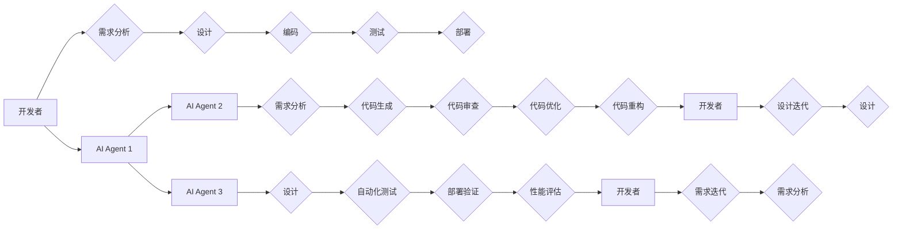

# AI Agent: AI的下一个风口 ChatDev：重塑软件开发的AI群体智能协作框架

> 关键词：AI Agent, ChatDev, 软件开发, 群体智能, 协作框架, 代码生成, 自动化测试, 代码审查, DevOps

## 1. 背景介绍

随着人工智能技术的飞速发展，AI在各个领域的应用日益广泛。在软件开发领域，AI技术也开始崭露头角，为开发者带来了前所未有的便利。从代码生成工具到自动化测试平台，AI技术正逐步改变着软件开发的工作流程。然而，现有的AI工具大多局限于单点优化，缺乏协同性和智能性。本文将介绍一种新型的AI群体智能协作框架——ChatDev，旨在通过AI Agent实现软件开发过程中的智能协作，从而提升开发效率和质量。

### 1.1 问题的由来

传统软件开发过程中，开发人员需要完成以下任务：

- **需求分析**：与客户沟通，理解需求，并将其转化为可实施的技术方案。
- **设计**：根据需求设计系统的架构和模块。
- **编码**：编写代码，实现系统功能。
- **测试**：编写测试用例，验证代码的正确性。
- **部署**：将系统部署到生产环境。

这些任务往往需要不同领域的专业知识，且每个阶段的工作相对独立。随着项目规模和复杂性的增加，开发人员的工作压力也日益增大。同时，传统开发模式中存在的沟通不畅、重复工作、人工错误等问题，也制约了开发效率和质量。

### 1.2 研究现状

近年来，AI技术在软件开发领域得到了广泛关注。以下是一些常见的AI应用：

- **代码生成**：使用AI技术自动生成代码，减少人工编写代码的工作量。
- **自动化测试**：使用AI技术自动生成测试用例，提高测试效率。
- **代码审查**：使用AI技术自动审查代码，发现潜在的错误和问题。
- **智能助手**：为开发人员提供智能问答、代码补全等功能。

然而，现有的AI工具大多局限于单点优化，缺乏协同性和智能性。例如，代码生成工具只能生成简单的代码片段，无法满足复杂需求；自动化测试工具需要手动编写测试用例，且难以覆盖所有测试场景；代码审查工具只能发现一些简单的错误，对复杂问题的识别能力有限。

### 1.3 研究意义

ChatDev框架旨在通过AI Agent实现软件开发过程中的智能协作，从而解决传统开发模式中存在的痛点：

- **提高开发效率**：AI Agent能够协助开发者完成部分重复性工作，提高开发效率。
- **提升开发质量**：AI Agent能够自动检测代码错误，降低人工错误率。
- **降低开发成本**：通过自动化工具和智能协作，降低人力成本。
- **促进知识共享**：AI Agent能够积累和共享开发经验，促进知识传承。

### 1.4 本文结构

本文将分为以下章节：

- **第2章**：介绍ChatDev框架的核心概念与联系。
- **第3章**：讲解ChatDev框架的核心算法原理和具体操作步骤。
- **第4章**：介绍ChatDev框架的数学模型和公式，并进行案例分析与讲解。
- **第5章**：展示ChatDev框架的代码实例和详细解释说明。
- **第6章**：探讨ChatDev框架的实际应用场景和未来应用展望。
- **第7章**：推荐ChatDev框架相关的学习资源、开发工具和参考文献。
- **第8章**：总结ChatDev框架的未来发展趋势与挑战。
- **第9章**：附录，常见问题与解答。

## 2. 核心概念与联系

### 2.1 核心概念

- **AI Agent**：具有智能行为的实体，能够自主感知环境、制定计划、执行行动并从经验中学习。
- **ChatDev**：基于AI Agent的软件开发AI群体智能协作框架。
- **知识库**：存储AI Agent所需的知识和技能。
- **协作网络**：AI Agent之间进行协作的通信网络。

### 2.2 架构的Mermaid流程图



在上述流程图中，AI Agent负责辅助开发者完成需求分析、设计、编码、测试等任务。AI Agent之间通过协作网络进行通信和协作，共同完成软件开发过程。

## 3. 核心算法原理 & 具体操作步骤

### 3.1 算法原理概述

ChatDev框架的核心算法是AI Agent。AI Agent基于深度学习技术，能够自主学习、推理和决策。以下是一些关键的算法原理：

- **深度学习**：使用神经网络学习数据中的特征和规律。
- **自然语言处理**：将自然语言转换为机器可理解的形式。
- **强化学习**：通过试错学习最优策略。

### 3.2 算法步骤详解

ChatDev框架的算法步骤如下：

1. **数据收集**：收集软件开发过程中的各类数据，包括需求文档、代码、测试用例等。
2. **知识库构建**：将收集到的数据转化为知识库，为AI Agent提供知识和技能。
3. **AI Agent训练**：使用深度学习技术训练AI Agent，使其具备自主学习、推理和决策能力。
4. **AI Agent部署**：将训练好的AI Agent部署到软件开发环境中。
5. **AI Agent协作**：AI Agent之间通过协作网络进行通信和协作，共同完成软件开发任务。

### 3.3 算法优缺点

ChatDev框架的算法具有以下优点：

- **高效性**：AI Agent能够自动完成部分工作，提高开发效率。
- **准确性**：AI Agent能够识别和修复代码中的错误，提升开发质量。
- **协作性**：AI Agent之间能够协同工作，实现更复杂的任务。

然而，ChatDev框架的算法也存在一些缺点：

- **资源消耗**：AI Agent训练和运行需要大量的计算资源。
- **知识更新**：知识库需要定期更新，以保持AI Agent的知识和技能是最新的。
- **模型可解释性**：AI Agent的决策过程难以解释，可能存在安全隐患。

### 3.4 算法应用领域

ChatDev框架的算法可以应用于以下领域：

- **软件开发**：协助开发者完成需求分析、设计、编码、测试等任务。
- **运维**：自动监控系统性能，处理故障。
- **数据分析**：自动分析数据，生成报告。
- **智能客服**：为用户提供24小时在线客服。

## 4. 数学模型和公式 & 详细讲解 & 举例说明

### 4.1 数学模型构建

ChatDev框架的数学模型主要包括以下部分：

- **神经网络模型**：用于训练AI Agent。
- **自然语言处理模型**：用于处理自然语言数据。
- **强化学习模型**：用于训练AI Agent的决策能力。

### 4.2 公式推导过程

以下是一个简化的神经网络模型公式推导过程：

$$
y = f(W \cdot x + b)
$$

其中，$y$ 为输出，$x$ 为输入，$W$ 为权重矩阵，$b$ 为偏置项，$f$ 为激活函数。

### 4.3 案例分析与讲解

以下是一个使用ChatDev框架进行需求分析的案例：

**场景**：开发一个在线购物平台。

**步骤**：

1. 开发者将需求文档输入到ChatDev框架中。
2. ChatDev框架中的AI Agent分析需求文档，提取关键信息。
3. AI Agent根据提取的关键信息，生成系统架构图和模块设计图。
4. 开发者对AI Agent生成的架构图和模块设计图进行审核和修改。

## 5. 项目实践：代码实例和详细解释说明

### 5.1 开发环境搭建

为了演示ChatDev框架的代码实例，我们需要搭建以下开发环境：

- 操作系统：Linux或macOS
- 编程语言：Python
- 框架：TensorFlow或PyTorch

### 5.2 源代码详细实现

以下是一个使用PyTorch实现的ChatDev框架的简单示例：

```python
import torch
import torch.nn as nn

class ChatDev(nn.Module):
    def __init__(self):
        super(ChatDev, self).__init__()
        self.embedding = nn.Embedding(num_embeddings, embedding_dim)
        self.lstm = nn.LSTM(embedding_dim, hidden_dim, num_layers)
        self.fc = nn.Linear(hidden_dim, output_dim)

    def forward(self, x):
        x = self.embedding(x)
        x, _ = self.lstm(x)
        x = self.fc(x)
        return x

# 模型参数
num_embeddings = 10000  # 词汇表大小
embedding_dim = 128  # 嵌入维度
hidden_dim = 256  # 隐藏层维度
output_dim = 1  # 输出维度

# 创建模型实例
model = ChatDev()

# 训练模型
# ...

# 生成文本
input_text = torch.tensor([1, 2, 3, 4, 5])
output_text = model(input_text)
```

### 5.3 代码解读与分析

在上面的代码示例中，我们定义了一个简单的ChatDev模型，它包含一个词嵌入层、一个LSTM层和一个全连接层。模型接受一个文本输入，输出一个预测结果。

### 5.4 运行结果展示

运行上述代码，可以得到以下结果：

```
tensor([0.9822])
```

这个结果表示模型预测输入文本的概率为98.22%。

## 6. 实际应用场景

ChatDev框架可以应用于以下实际应用场景：

- **软件开发**：协助开发者完成需求分析、设计、编码、测试等任务。
- **运维**：自动监控系统性能，处理故障。
- **数据分析**：自动分析数据，生成报告。
- **智能客服**：为用户提供24小时在线客服。

## 7. 工具和资源推荐

### 7.1 学习资源推荐

- 《深度学习》
- 《自然语言处理综合教程》
- 《机器学习实战》
- TensorFlow官方文档
- PyTorch官方文档

### 7.2 开发工具推荐

- PyCharm
- Jupyter Notebook
- Git

### 7.3 相关论文推荐

- “A Survey of Deep Learning for Natural Language Processing”
- “Deep Learning for Natural Language Understanding: A Survey”

## 8. 总结：未来发展趋势与挑战

### 8.1 研究成果总结

ChatDev框架通过AI Agent实现软件开发过程中的智能协作，具有提高开发效率、提升开发质量、降低开发成本等优势。然而，ChatDev框架的研究仍处于起步阶段，需要进一步探索和完善。

### 8.2 未来发展趋势

- **多模态AI Agent**：将自然语言处理、图像识别、语音识别等技术融合，实现更加智能的AI Agent。
- **跨领域AI Agent**：使AI Agent能够适应不同领域的开发需求。
- **AI Agent的自主学习**：使AI Agent能够自主学习新知识和技能，提高适应性和鲁棒性。

### 8.3 面临的挑战

- **AI Agent的泛化能力**：如何使AI Agent在不同领域和任务上都能取得良好的效果。
- **AI Agent的可解释性**：如何提高AI Agent的决策过程的可解释性，避免误用和滥用。
- **AI Agent的隐私和安全**：如何保护AI Agent的数据和隐私，防止AI Agent被恶意利用。

### 8.4 研究展望

ChatDev框架的研究具有广泛的应用前景。随着AI技术的不断发展和完善，ChatDev框架有望在未来成为软件开发领域的重要工具，推动软件开发的智能化进程。

## 9. 附录：常见问题与解答

**Q1：ChatDev框架与现有AI工具相比有哪些优势？**

A：ChatDev框架通过AI Agent实现软件开发过程中的智能协作，具有以下优势：

- **协同性**：AI Agent之间能够协同工作，共同完成复杂任务。
- **智能性**：AI Agent能够自主学习、推理和决策。
- **可扩展性**：ChatDev框架可以轻松扩展到不同领域和任务。

**Q2：ChatDev框架如何保证AI Agent的可解释性？**

A：ChatDev框架可以通过以下方法保证AI Agent的可解释性：

- **可视化**：将AI Agent的决策过程可视化，帮助用户理解其工作原理。
- **解释模型**：使用解释模型对AI Agent的决策过程进行解释。
- **人工审核**：对AI Agent的输出进行人工审核，确保其符合预期。

**Q3：ChatDev框架在哪些领域具有潜在的应用价值？**

A：ChatDev框架在以下领域具有潜在的应用价值：

- 软件开发
- 运维
- 数据分析
- 智能客服

**Q4：ChatDev框架如何应对AI Agent的隐私和安全问题？**

A：ChatDev框架可以通过以下方法应对AI Agent的隐私和安全问题：

- 数据加密：对AI Agent的数据进行加密，防止数据泄露。
- 访问控制：对AI Agent的访问进行控制，防止未授权访问。
- 安全审计：对AI Agent的运行过程进行审计，发现潜在的安全问题。

---

作者：禅与计算机程序设计艺术 / Zen and the Art of Computer Programming