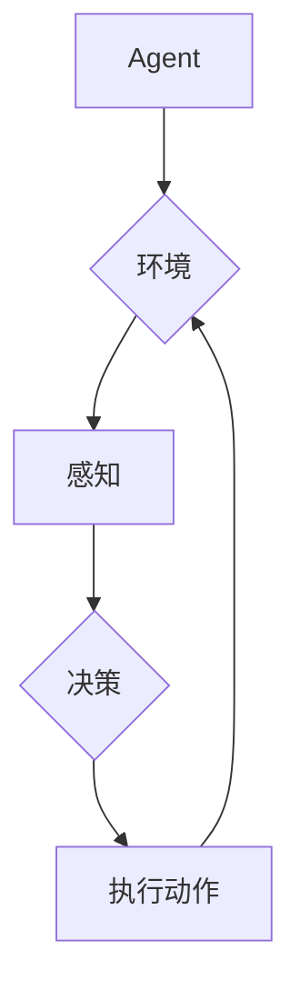

# AI Agent: AI的下一个风口 自主式智能体的典型案例

> 关键词：AI Agent，自主式智能体，强化学习，决策树，环境感知，人机交互，案例研究

## 1. 背景介绍

随着人工智能技术的飞速发展，从早期的专家系统到如今的深度学习，AI在各个领域都展现出了强大的潜力。然而，传统的AI系统往往局限于特定的任务和领域，缺乏自主性和适应性。近年来，AI Agent的概念逐渐兴起，它代表着AI技术的新方向——构建具有自主意识和决策能力的智能体。本文将深入探讨AI Agent的核心概念、算法原理、应用场景，并通过典型案例分析，展望AI Agent的未来发展趋势。

### 1.1 问题的由来

在现实世界中，人类能够适应复杂多变的环境，并做出明智的决策。然而，传统的AI系统往往缺乏这种自主性和适应性。它们通常只能在特定条件下工作，一旦环境发生变化，就需要重新设计和部署。为了使AI系统更加灵活和通用，研究者们开始探索AI Agent的概念。

### 1.2 研究现状

AI Agent的研究主要集中在以下几个方面：

- **强化学习（Reinforcement Learning）**：通过与环境交互，学习最优策略以最大化累积奖励。
- **决策树（Decision Trees）**：通过树形结构表示决策过程，实现逻辑推理和决策。
- **环境感知（Environment Awareness）**：通过传感器获取环境信息，使智能体能够感知外部世界。
- **人机交互（Human-Machine Interaction）**：使智能体能够与人类进行有效沟通，实现协作和共同决策。

### 1.3 研究意义

AI Agent的研究对于推动人工智能技术的发展具有重要意义：

- **提高AI的自主性和适应性**：使AI系统能够适应复杂多变的环境，并在不同领域发挥作用。
- **推动人机协作**：使人类与AI智能体能够协同工作，提高工作效率和生活质量。
- **拓展AI的应用场景**：将AI技术应用于更多领域，如医疗、教育、工业等。

### 1.4 本文结构

本文将分为以下几个部分：

- 核心概念与联系：介绍AI Agent的核心概念和架构。
- 核心算法原理 & 具体操作步骤：讲解AI Agent的算法原理和操作步骤。
- 数学模型和公式 & 详细讲解 & 举例说明：使用数学模型和公式描述AI Agent的决策过程。
- 项目实践：通过代码实例展示AI Agent的应用。
- 实际应用场景：探讨AI Agent在不同领域的应用。
- 工具和资源推荐：推荐学习资源、开发工具和参考文献。
- 总结：总结AI Agent的未来发展趋势与挑战。

## 2. 核心概念与联系

### 2.1 核心概念

AI Agent的核心概念包括：

- **智能体（Agent）**：具有自主意识和决策能力的实体，能够感知环境、做出决策并执行动作。
- **环境（Environment）**：智能体所在的物理或虚拟世界，提供状态信息和奖励。
- **策略（Policy）**：智能体根据环境状态做出的决策规则。
- **价值函数（Value Function）**：衡量智能体在特定状态下采取特定策略所能获得的累积奖励。
- **状态空间（State Space）**：智能体可能处于的所有状态的集合。
- **动作空间（Action Space）**：智能体可能执行的所有动作的集合。

### 2.2 Mermaid 流程图

以下是一个简单的Mermaid流程图，展示了AI Agent的基本架构：



### 2.3 核心概念联系

AI Agent的核心概念相互联系，共同构成了一个完整的决策和执行过程。智能体通过感知环境状态，根据策略做出决策，并执行动作。执行动作后，智能体会获得奖励，并根据奖励调整策略，以实现更好的性能。

## 3. 核心算法原理 & 具体操作步骤

### 3.1 算法原理概述

AI Agent的算法原理主要包括：

- **强化学习**：通过与环境交互，学习最优策略以最大化累积奖励。
- **决策树**：通过树形结构表示决策过程，实现逻辑推理和决策。
- **环境感知**：通过传感器获取环境信息，使智能体能够感知外部世界。
- **人机交互**：使智能体能够与人类进行有效沟通，实现协作和共同决策。

### 3.2 算法步骤详解

AI Agent的操作步骤如下：

1. **初始化**：设置智能体的初始状态、策略和动作空间。
2. **感知环境**：智能体通过传感器获取环境信息。
3. **做出决策**：智能体根据环境状态和策略，选择一个动作。
4. **执行动作**：智能体执行所选动作，并更新环境状态。
5. **获取奖励**：智能体根据执行的动作和奖励函数，获得奖励。
6. **更新策略**：智能体根据奖励和策略优化算法，调整策略。
7. **重复步骤2-6**：智能体持续与环境交互，不断学习和优化策略。

### 3.3 算法优缺点

**优点**：

- **自主性**：AI Agent能够自主感知环境、做出决策并执行动作。
- **适应性**：AI Agent能够适应复杂多变的环境，并做出相应的调整。
- **可扩展性**：AI Agent可以应用于不同领域和任务。

**缺点**：

- **学习成本高**：AI Agent需要大量的数据和时间进行训练。
- **可解释性差**：AI Agent的决策过程往往难以解释。

### 3.4 算法应用领域

AI Agent的应用领域包括：

- **机器人控制**：如自动驾驶汽车、工业机器人等。
- **游戏**：如棋类游戏、电子竞技等。
- **智能助手**：如虚拟助手、智能家居等。
- **医疗**：如辅助诊断、药物研发等。

## 4. 数学模型和公式 & 详细讲解 & 举例说明

### 4.1 数学模型构建

AI Agent的数学模型主要包括：

- **马尔可夫决策过程（MDP）**：描述智能体在不确定环境中做出决策的过程。
- **策略梯度方法**：通过梯度下降算法优化智能体的策略。
- **价值迭代方法**：通过迭代计算状态价值和策略值。

### 4.2 公式推导过程

以下是一个简单的MDP的公式推导过程：

**状态空间**：$S=\{s_1, s_2, ..., s_n\}$

**动作空间**：$A=\{a_1, a_2, ..., a_m\}$

**转移概率**：$P(s_{t+1}|s_t, a_t)$

**奖励函数**：$R(s_t, a_t)$

**策略**：$\pi(a|s)$

**状态价值函数**：$V(s)$

**策略值函数**：$Q(s,a)$

**Bellman方程**：

$$
V(s) = \sum_{a \in A} \pi(a|s) \times P(s_{t+1}|s_t, a) \times [R(s_t, a) + \gamma V(s_{t+1})]
$$

**策略迭代**：

$$
Q(s,a) = \sum_{s' \in S} P(s_{t+1}|s_t, a) \times [R(s_t, a) + \gamma \max_{a' \in A} Q(s', a')]
$$

### 4.3 案例分析与讲解

以下是一个简单的Q-learning案例：

假设有一个简单的环境，包含两个状态和两个动作。状态0表示“安全”，状态1表示“危险”。动作0表示“前进”，动作1表示“后退”。

转移概率和奖励函数如下表所示：

| 状态 | 动作 | 下一个状态 | 奖励 |
|------|------|------------|------|
| 0    | 0    | 0          | +1   |
| 0    | 1    | 1          | -1   |
| 1    | 0    | 1          | -10  |
| 1    | 1    | 0          | +2   |

初始Q值设置为0。

第1步，智能体在状态0选择动作0，得到奖励+1，更新Q值：

$$
Q(0, 0) = 0.5 \times 1 + 0.5 \times 0 = 0.5
$$

第2步，智能体在状态1选择动作0，得到奖励-10，更新Q值：

$$
Q(1, 0) = 0.5 \times (-10) + 0.5 \times 0 = -5
$$

...

通过不断迭代，智能体最终会学习到最优策略，即选择动作1，避免进入状态1。

## 5. 项目实践：代码实例和详细解释说明

### 5.1 开发环境搭建

为了实现AI Agent，我们需要搭建以下开发环境：

- 操作系统：Windows/Linux/MacOS
- 编程语言：Python
- 框架：TensorFlow、PyTorch等

### 5.2 源代码详细实现

以下是一个简单的AI Agent的代码示例：

```python
import numpy as np

class QLearningAgent:
    def __init__(self, num_states, num_actions, alpha, gamma):
        self.num_states = num_states
        self.num_actions = num_actions
        self.alpha = alpha
        self.gamma = gamma
        self.Q = np.zeros((num_states, num_actions))
    
    def choose_action(self, state):
        if np.random.rand() < 0.1:  # Exploration
            return np.random.choice(self.num_actions)
        else:  # Exploitation
            return np.argmax(self.Q[state])
    
    def update(self, state, action, reward, next_state):
        Q_old = self.Q[state, action]
        Q_new = reward + self.gamma * np.max(self.Q[next_state])
        self.Q[state, action] = self.Q[state, action] + self.alpha * (Q_new - Q_old)

# 环境定义
def get_state():
    # 这里定义获取环境状态的方法
    pass

def get_reward(action):
    # 这里定义获取奖励的方法
    pass

# 初始化智能体
agent = QLearningAgent(num_states=2, num_actions=2, alpha=0.1, gamma=0.9)

# 训练智能体
for i in range(1000):
    state = get_state()
    action = agent.choose_action(state)
    next_state = get_state()
    reward = get_reward(action)
    agent.update(state, action, reward, next_state)
```

### 5.3 代码解读与分析

以上代码实现了一个简单的Q-learning智能体。智能体通过与环境交互，学习最优策略。

- `QLearningAgent` 类：定义了Q-learning智能体的属性和方法。
- `choose_action` 方法：根据当前状态选择动作。
- `update` 方法：更新Q值。

### 5.4 运行结果展示

通过不断训练，智能体会学习到最优策略，并在环境中获得更高的奖励。

## 6. 实际应用场景

AI Agent的应用场景非常广泛，以下是一些典型的应用案例：

- **自动驾驶汽车**：AI Agent可以感知周围环境，做出决策，控制车辆行驶。
- **机器人导航**：AI Agent可以自主导航到目标位置，避开障碍物。
- **智能客服**：AI Agent可以与用户进行交互，提供个性化的服务。
- **智能推荐系统**：AI Agent可以分析用户行为，推荐个性化的商品或内容。

## 7. 工具和资源推荐

### 7.1 学习资源推荐

- 《深度学习》（Goodfellow et al.）
- 《强化学习：原理与案例》（Sutton and Barto）
- 《Python机器学习》（Sebastian Raschka）

### 7.2 开发工具推荐

- TensorFlow
- PyTorch
- OpenAI Gym

### 7.3 相关论文推荐

- "Reinforcement Learning: An Introduction" by Richard S. Sutton and Andrew G. Barto
- "Playing Atari with Deep Reinforcement Learning" by Volodymyr Mnih et al.
- "Deep Reinforcement Learning for Driving" by John Schulman et al.

## 8. 总结：未来发展趋势与挑战

### 8.1 研究成果总结

本文深入探讨了AI Agent的核心概念、算法原理、应用场景，并通过典型案例分析，展望了AI Agent的未来发展趋势。

### 8.2 未来发展趋势

- **更强大的算法**：开发更先进的强化学习、决策树、环境感知等技术。
- **更丰富的应用场景**：将AI Agent应用于更多领域，如医疗、教育、工业等。
- **更高效的开发工具**：开发更易用的开发工具，降低AI Agent的开发门槛。

### 8.3 面临的挑战

- **数据获取**：需要获取高质量、大规模的数据来训练AI Agent。
- **可解释性**：提高AI Agent的决策过程的可解释性。
- **安全性**：确保AI Agent的行为符合人类价值观。

### 8.4 研究展望

随着AI Agent技术的不断发展，相信它将在未来发挥越来越重要的作用，为人类社会带来更多便利和创新。

## 9. 附录：常见问题与解答

**Q1：什么是AI Agent？**

A：AI Agent是指具有自主意识和决策能力的实体，能够感知环境、做出决策并执行动作。

**Q2：AI Agent有哪些应用场景？**

A：AI Agent可以应用于自动驾驶、机器人导航、智能客服、智能推荐系统等众多领域。

**Q3：如何实现AI Agent？**

A：实现AI Agent需要使用强化学习、决策树、环境感知等技术。

**Q4：AI Agent的未来发展趋势是什么？**

A：AI Agent的未来发展趋势包括更强大的算法、更丰富的应用场景和更高效的开发工具。

作者：禅与计算机程序设计艺术 / Zen and the Art of Computer Programming