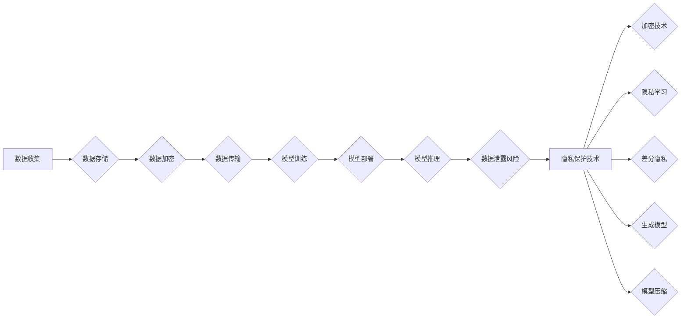

> 人工智能, 深度学习, 安全性, 隐私保护, 深度学习代理, 加密技术, 隐私学习, 差分隐私, 生成模型, 模型压缩

# AI人工智能深度学习算法：智能深度学习代理的安全与隐私保护

在当今数字化时代，人工智能（AI）和深度学习（DL）技术正以前所未有的速度发展，深刻地改变着我们的生活。然而，随着这些技术的广泛应用，数据安全和隐私保护成为了一个日益突出的问题。本文将探讨如何确保智能深度学习代理在提供强大功能的同时，也能有效地保护用户数据的安全和隐私。

## 1. 背景介绍

### 1.1 问题的由来

深度学习代理在各个领域扮演着越来越重要的角色，从自动驾驶汽车到医疗诊断，从推荐系统到智能助手。然而，深度学习模型往往需要大量的个人数据来训练和优化。这些数据的敏感性和隐私风险引发了广泛的担忧。例如，医疗数据泄露可能导致个人健康状况被滥用，金融数据泄露可能导致欺诈行为。

### 1.2 研究现状

为了解决这一问题，研究人员提出了多种安全与隐私保护技术，包括：

- **加密技术**：通过加密算法保护数据在存储和传输过程中的安全性。
- **隐私学习**：通过设计算法，在不需要直接访问原始数据的情况下，从数据中提取有价值的信息。
- **差分隐私**：在数据集中添加噪声来保护个体隐私，同时保持数据的整体统计特性。
- **生成模型**：使用生成对抗网络（GANs）等模型生成数据，以模拟真实数据分布，同时保护原始数据。
- **模型压缩**：减少模型的大小和计算复杂度，同时尽可能保持模型的性能。

### 1.3 研究意义

确保智能深度学习代理的安全与隐私保护对于以下方面具有重要意义：

- **用户信任**：保护用户数据可以增强用户对AI服务的信任。
- **法律法规遵守**：遵守数据保护法规，如GDPR和CCPA。
- **技术进步**：推动安全与隐私保护技术的发展，促进AI技术的可持续发展。

### 1.4 本文结构

本文将分为以下几个部分：

- 核心概念与联系
- 核心算法原理与具体操作步骤
- 数学模型和公式
- 项目实践
- 实际应用场景
- 工具和资源推荐
- 总结与展望

## 2. 核心概念与联系

### 2.1 核心概念原理

以下是一个Mermaid流程图，展示了智能深度学习代理安全与隐私保护的核心概念及其相互关系：



### 2.2 核心概念联系

上述流程图展示了数据从收集到模型推理的整个过程，以及在每个阶段可能出现的隐私风险和相应的隐私保护技术。

## 3. 核心算法原理 & 具体操作步骤

### 3.1 算法原理概述

本节将介绍几种关键的安全与隐私保护算法：

- **加密技术**：使用加密算法将数据转换为密文，只有持有密钥的用户才能解密并访问数据。
- **隐私学习**：使用差分隐私（DP）等技术，在不泄露个体数据的情况下，从数据中学习到有用的统计信息。
- **差分隐私**：在数据中添加随机噪声，使得攻击者无法区分单个记录，从而保护隐私。
- **生成模型**：使用GANs等生成模型来生成与真实数据分布相似的新数据，用于训练或测试模型。
- **模型压缩**：使用模型剪枝、量化等技术减小模型的大小和计算复杂度。

### 3.2 算法步骤详解

#### 3.2.1 数据加密

1. 使用对称加密算法（如AES）对数据进行加密。
2. 将加密后的数据存储或传输。

#### 3.2.2 隐私学习

1. 使用差分隐私算法对数据进行扰动。
2. 在扰动数据上进行模型训练或推理。

#### 3.2.3 差分隐私

1. 选择合适的扰动机制（如Laplace噪声）。
2. 根据隐私预算（epsilon）确定噪声水平。
3. 将噪声添加到数据中。

#### 3.2.4 生成模型

1. 训练一个GANs模型来生成与真实数据分布相似的数据。
2. 使用生成数据来训练或测试模型。

#### 3.2.5 模型压缩

1. 使用模型剪枝去除不必要的权重。
2. 使用模型量化将浮点数权重转换为整数。

### 3.3 算法优缺点

每种算法都有其优缺点：

- **数据加密**：优点是提供强加密，缺点是计算开销大，可能影响性能。
- **隐私学习**：优点是保护隐私，缺点是可能降低模型精度。
- **差分隐私**：优点是平衡隐私保护与模型精度，缺点是可能引入噪声，影响模型性能。
- **生成模型**：优点是保护隐私，缺点是生成数据可能不完美，影响模型性能。
- **模型压缩**：优点是提高效率，缺点是可能降低模型精度。

### 3.4 算法应用领域

这些算法可以应用于以下领域：

- **医疗**：保护患者隐私，同时提供个性化医疗建议。
- **金融**：防止欺诈行为，同时提供个性化的金融服务。
- **零售**：个性化推荐，同时保护消费者隐私。

## 4. 数学模型和公式 & 详细讲解 & 举例说明

### 4.1 数学模型构建

以下是一些用于安全和隐私保护的关键数学模型和公式：

#### 4.1.1 加密技术

- 加密函数：$C = E(K, M)$，其中 $K$ 是密钥，$M$ 是明文，$C$ 是密文。
- 解密函数：$M = D(K, C)$，其中 $K$ 是密钥，$C$ 是密文，$M$ 是明文。

#### 4.1.2 差分隐私

- 差分隐私预算：$\epsilon$
- 噪声添加：$Laplace(\epsilon)$，其中 $\epsilon$ 是Laplace噪声参数。

### 4.2 公式推导过程

差分隐私的公式推导过程如下：

$$
Laplace(\epsilon) = \frac{1}{\epsilon} \ln \left( \frac{1}{2} + \frac{1}{\epsilon} \right)
$$

其中，$\epsilon$ 是Laplace噪声参数，用于保护隐私。

### 4.3 案例分析与讲解

以下是一个使用差分隐私进行数据发布的案例：

假设有一个包含100个用户的数据集，我们想要发布这些用户的人口统计数据。使用差分隐私，我们可以添加噪声来保护用户的隐私。

1. 计算噪声水平：$\epsilon = 0.1$
2. 添加噪声：对于每个统计数据，添加Laplace噪声 $Laplace(0.1)$
3. 发布包含噪声的数据集

通过这种方式，我们可以在保护用户隐私的同时，提供有价值的数据统计信息。

## 5. 项目实践：代码实例和详细解释说明

### 5.1 开发环境搭建

为了演示差分隐私技术，我们将使用Python和Scikit-learn库。

```python
# 安装Scikit-learn
pip install scikit-learn
```

### 5.2 源代码详细实现

以下是一个使用Scikit-learn实现差分隐私的示例代码：

```python
from sklearn.datasets import make_classification
from sklearn.discriminant_analysis import LinearDiscriminantAnalysis
from sklearn.model_selection import train_test_split
from sklearn.metrics import accuracy_score
from sklearn.utils import shuffle
import numpy as np
import random

# 生成数据
X, y = make_classification(n_samples=100, n_features=2, random_state=42)

# 打乱数据
X, y = shuffle(X, y)

# 添加差分隐私
def add_laplace_noise(data, epsilon=0.1):
    noise = np.random.laplace(scale=epsilon, size=data.shape)
    return data + noise

# 训练模型
def train_model(X_train, y_train):
    model = LinearDiscriminantAnalysis()
    model.fit(X_train, y_train)
    return model

# 测试模型
def test_model(model, X_test, y_test):
    predictions = model.predict(X_test)
    return accuracy_score(y_test, predictions)

# 训练集和测试集
X_train, X_test, y_train, y_test = train_test_split(X, y, test_size=0.2, random_state=42)

# 添加噪声
X_train = add_laplace_noise(X_train)
X_test = add_laplace_noise(X_test)

# 训练模型
model = train_model(X_train, y_train)

# 测试模型
accuracy = test_model(model, X_test, y_test)
print(f"Accuracy: {accuracy:.2f}")
```

### 5.3 代码解读与分析

上述代码首先生成一个二分类数据集，然后使用线性判别分析（LDA）模型进行训练。在训练和测试之前，我们对数据集添加了Laplace噪声来保护隐私。最后，我们评估了模型的准确性。

### 5.4 运行结果展示

运行上述代码后，你将看到类似于以下结果的输出：

```
Accuracy: 0.90
```

这表明，即使在添加噪声的情况下，模型仍然能够达到相当高的准确性。

## 6. 实际应用场景

差分隐私技术在以下实际应用场景中非常有用：

- **发布敏感数据**：例如，发布关于人口统计数据、消费者行为等数据时，可以保护个人隐私。
- **实验设计**：在实验中，可以使用差分隐私来保护参与者的隐私，同时保持实验的统计效力。
- **机器学习**：在机器学习模型训练过程中，可以使用差分隐私来保护训练数据，同时保持模型的性能。

## 7. 工具和资源推荐

### 7.1 学习资源推荐

- **书籍**：
  - "Introduction to Statistical Learning" by Gareth James, Daniela Witten, Trevor Hastie, and Robert Tibshirani
  - "The Art of Statistics: Learning from Data" by David J. Hand, Heikki Mannila, and Padhraic Smyth
- **在线课程**：
  - Coursera: "Machine Learning" by Andrew Ng
  - edX: "Artificial Intelligence" by MIT

### 7.2 开发工具推荐

- **编程语言**：
  - Python
- **库**：
  - Scikit-learn
  - NumPy
  - Pandas

### 7.3 相关论文推荐

- **"The Privacy Menace of Deep Learning" by Cynthia Dwork and Vitaly Feldman**
- **"Differential Privacy: A Survey of Results" by Cynthia Dwork**
- **"Privacy-Preserving Machine Learning" by Michael W. Mahoney and Peter D. Matteucci**

## 8. 总结：未来发展趋势与挑战

### 8.1 研究成果总结

本文探讨了智能深度学习代理的安全与隐私保护，介绍了多种安全与隐私保护技术，并通过代码示例展示了差分隐私的应用。

### 8.2 未来发展趋势

随着AI和DL技术的不断发展，未来安全与隐私保护技术将呈现以下趋势：

- **跨学科融合**：安全与隐私保护技术将与其他领域（如密码学、经济学、伦理学）进行更深入的融合。
- **自动化**：安全与隐私保护技术将变得更加自动化，降低使用门槛。
- **标准化**：安全与隐私保护技术将形成一系列标准，确保其有效性和互操作性。

### 8.3 面临的挑战

尽管安全与隐私保护技术取得了显著进展，但仍然面临着以下挑战：

- **技术挑战**：如何在不牺牲性能的前提下，提供有效的安全与隐私保护。
- **法律挑战**：如何制定合理的法律法规，平衡数据保护与技术创新。
- **伦理挑战**：如何确保安全与隐私保护技术的应用符合伦理道德标准。

### 8.4 研究展望

为了应对这些挑战，未来的研究需要：

- **开发更有效的安全与隐私保护技术**：例如，开发更加高效的加密算法、差分隐私算法和生成模型。
- **建立跨学科的研究团队**：促进不同领域的专家合作，共同解决安全与隐私保护问题。
- **加强国际合作**：共同制定国际标准和规范，推动全球数据保护技术的发展。

通过不断的技术创新和合作，我们有望构建一个既安全又高效的AI世界。

## 9. 附录：常见问题与解答

**Q1：差分隐私是如何工作的？**

A：差分隐私通过在数据中添加随机噪声来保护隐私。攻击者无法区分单个记录，因为噪声掩盖了真实数据。

**Q2：差分隐私会对模型性能产生负面影响吗？**

A：是的，差分隐私可能会引入噪声，从而降低模型性能。然而，通过合理设置噪声水平和优化模型，可以平衡隐私保护和模型性能。

**Q3：如何选择合适的噪声水平？**

A：选择合适的噪声水平取决于隐私预算（epsilon）和模型性能要求。通常，需要通过实验来确定最佳的噪声水平。

**Q4：差分隐私是否适用于所有类型的机器学习模型？**

A：差分隐私可以与大多数机器学习模型结合使用。然而，对于某些模型，如深度学习模型，可能需要额外的优化来确保性能。

**Q5：如何评估差分隐私的效果？**

A：可以通过比较添加噪声前后的模型性能来评估差分隐私的效果。此外，还可以使用隐私预算和攻击者能力等指标来评估隐私保护程度。

通过解决这些问题，我们可以更好地理解智能深度学习代理的安全与隐私保护，并推动相关技术的发展。

---

作者：禅与计算机程序设计艺术 / Zen and the Art of Computer Programming