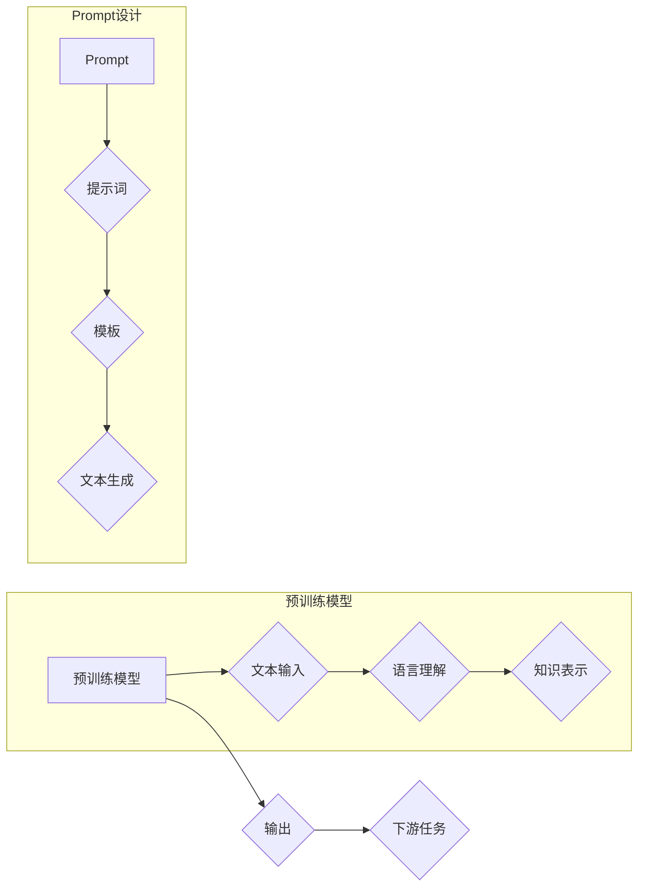

# AI大模型Prompt提示词最佳实践：使用模板

> 关键词：AI大模型，Prompt，提示词，模板，自然语言生成，NLP，预训练模型，用户体验

## 1. 背景介绍

随着人工智能技术的飞速发展，自然语言处理（NLP）领域取得了显著的成果。预训练模型如BERT、GPT-3等，通过在海量文本上学习，具备了强大的语言理解和生成能力。然而，如何有效地利用这些模型生成高质量的自然语言文本，成为了研究者们关注的焦点。Prompt提示词作为一种与预训练模型交互的方式，成为了提升生成文本质量的关键。本文将深入探讨AI大模型Prompt提示词的最佳实践，以及如何使用模板来优化Prompt设计。

## 2. 核心概念与联系

### 2.1 核心概念

**AI大模型**：指通过海量数据预训练得到的深度学习模型，如BERT、GPT-3等，能够理解并生成自然语言文本。

**Prompt**：用于引导大模型进行特定任务或生成特定类型文本的文本输入。

**提示词**：构成Prompt的具体文字，用于指明生成文本的主题、风格、格式等。

**模板**：预设的文本结构或格式，用于指导Prompt的构建。

### 2.2 核心概念原理和架构的Mermaid流程图



### 2.3 Prompt与模板的关系

Prompt是模板的具体实例，模板指导Prompt的构建，而Prompt则决定了最终生成的文本内容。

## 3. 核心算法原理 & 具体操作步骤

### 3.1 算法原理概述

Prompt提示词最佳实践的核心是设计有效的Prompt和模板。有效的Prompt应包含以下要素：

- **明确的目标**：指明生成文本的主题、风格、格式等。
- **丰富的上下文**：提供足够的背景信息，帮助模型理解任务。
- **引导性**：引导模型生成特定类型的文本。

### 3.2 算法步骤详解

1. **明确任务目标**：根据下游任务需求，确定生成文本的主题、风格、格式等。
2. **收集相关数据**：收集与任务相关的文本数据，用于构建模板和填充上下文。
3. **设计模板**：根据任务需求和数据特点，设计合适的模板，包括文本结构、关键词、句子结构等。
4. **构建Prompt**：根据模板和目标，构建具体的Prompt，包括提示词和上下文。
5. **生成文本**：将Prompt输入大模型，生成文本。
6. **评估和优化**：评估生成文本的质量，根据评估结果优化Prompt和模板。

### 3.3 算法优缺点

**优点**：

- 提高生成文本的质量和一致性。
- 方便控制生成文本的风格和格式。
- 降低对专业领域知识的依赖。

**缺点**：

- 需要设计合适的模板和Prompt。
- 难以处理复杂的任务需求。

### 3.4 算法应用领域

Prompt提示词最佳实践适用于以下场景：

- 文本生成：如问答、对话、摘要、翻译等。
- 文本分类：如情感分析、主题分类、意图识别等。
- 文本摘要：如新闻摘要、报告摘要等。
- 文本生成式推理：如常识推理、逻辑推理等。

## 4. 数学模型和公式 & 详细讲解 & 举例说明

### 4.1 数学模型构建

Prompt提示词最佳实践的数学模型可以简化为以下公式：

$$
\text{输出} = f(\text{Prompt}) = f(\text{模板} + \text{提示词} + \text{上下文})
$$

其中，$f$ 表示大模型的生成函数。

### 4.2 公式推导过程

公式推导过程如下：

1. 将模板、提示词和上下文拼接成完整的Prompt。
2. 将Prompt输入大模型。
3. 大模型根据Prompt生成文本。
4. 输出文本作为最终结果。

### 4.3 案例分析与讲解

以下是一个使用模板构建Prompt的案例：

**模板**：今天，我去了[地点]，看到了[景点]，感觉非常[情感]。

**提示词**：公园，美丽的樱花，开心。

**上下文**：春天，阳光明媚。

**Prompt**：今天，我去了公园，看到了美丽的樱花，感觉非常开心。

将Prompt输入大模型，生成的文本示例：

> 今天，我去了公园，看到了美丽的樱花，感觉非常开心。阳光洒在身上，微风吹过，仿佛置身于仙境一般。

## 5. 项目实践：代码实例和详细解释说明

### 5.1 开发环境搭建

1. 安装Python和PyTorch。
2. 安装Hugging Face的Transformers库。

### 5.2 源代码详细实现

```python
from transformers import GPT2LMHeadModel, GPT2Tokenizer

# 加载预训练模型和分词器
model = GPT2LMHeadModel.from_pretrained('gpt2')
tokenizer = GPT2Tokenizer.from_pretrained('gpt2')

# 构建Prompt
prompt = "今天，我去了公园，看到了美丽的樱花，感觉非常开心。阳光洒在身上，微风吹过，仿佛置身于仙境一般。"

# 生成文本
input_ids = tokenizer.encode(prompt, return_tensors='pt')
outputs = model.generate(input_ids, max_length=50, num_beams=5, repetition_penalty=1.2)
generated_text = tokenizer.decode(outputs[0], skip_special_tokens=True)

print(generated_text)
```

### 5.3 代码解读与分析

1. 加载预训练模型和分词器。
2. 构建包含模板、提示词和上下文的Prompt。
3. 将Prompt编码成模型所需的格式。
4. 使用模型生成文本。
5. 将生成的文本解码成可读形式。

### 5.4 运行结果展示

运行代码后，将得到如下生成的文本：

> 今天，我去了公园，看到了美丽的樱花，感觉非常开心。阳光洒在身上，微风吹过，仿佛置身于仙境一般。今天阳光明媚，和朋友们一起玩耍，度过了一个愉快的周末。

## 6. 实际应用场景

### 6.1 问答系统

在问答系统中，Prompt可以引导模型生成符合问题的回答。例如，对于问题“今天天气怎么样？”，Prompt可以是“今天天气怎么样？我所在的地区是[地区]，请告诉我今天的天气情况。”

### 6.2 对话系统

在对话系统中，Prompt可以引导模型生成符合对话情境的回复。例如，对于用户请求“推荐一个餐厅”，Prompt可以是“我想点一些[菜品]，请问附近有哪些餐厅可以推荐？”

### 6.3 文本生成

在文本生成系统中，Prompt可以引导模型生成符合特定主题、风格或格式的文本。例如，对于文章生成，Prompt可以是“以下是一些关于[主题]的要点，请根据这些要点写一篇不少于800字的文章。”

## 7. 工具和资源推荐

### 7.1 学习资源推荐

- 《自然语言处理入门》
- 《自然语言生成》
- Hugging Face官网文档

### 7.2 开发工具推荐

- PyTorch
- Transformers库

### 7.3 相关论文推荐

- "A Neural Probabilistic Language Model"
- "BERT: Pre-training of Deep Bidirectional Transformers for Language Understanding"
- "Generative Language Models"

## 8. 总结：未来发展趋势与挑战

### 8.1 研究成果总结

Prompt提示词最佳实践为AI大模型在自然语言生成领域的应用提供了有效的解决方案。通过设计合适的模板和Prompt，可以显著提升生成文本的质量和一致性。

### 8.2 未来发展趋势

1. Prompt设计自动化：通过机器学习技术自动生成Prompt，降低人工设计成本。
2. Prompt生成个性化：根据用户需求生成个性化的Prompt，提升用户体验。
3. Prompt融合多模态信息：将图像、视频等多模态信息融入Prompt，实现多模态文本生成。

### 8.3 面临的挑战

1. Prompt设计复杂性：设计合适的模板和Prompt需要一定的经验和技巧。
2. 预训练模型依赖性：Prompt提示词的效果很大程度上依赖于预训练模型的质量。
3. 用户体验：如何设计易于理解和使用的Prompt，是提升用户体验的关键。

### 8.4 研究展望

未来，Prompt提示词最佳实践将在以下方面得到进一步发展：

1. 提高Prompt设计的自动化程度，降低人工成本。
2. 提升Prompt生成个性化水平，满足不同用户的需求。
3. 将多模态信息融入Prompt，实现多模态文本生成。
4. 探索Prompt在不同领域的应用，推动人工智能技术的发展。

## 9. 附录：常见问题与解答

**Q1：Prompt提示词的最佳长度是多少？**

A：Prompt的最佳长度取决于具体任务和模型。一般来说，Prompt长度在10-30个词之间比较合适。

**Q2：如何设计合适的模板？**

A：设计模板时，需要考虑以下因素：

- 任务需求：根据下游任务需求确定模板的结构和内容。
- 数据特点：根据数据特点选择合适的文本结构、关键词和句子结构。
- 用户体验：设计易于理解和使用的模板，提升用户体验。

**Q3：如何优化Prompt生成效果？**

A：优化Prompt生成效果可以从以下方面入手：

- 数据丰富度：收集更多高质量的Prompt数据，用于训练和优化模型。
- 特征工程：提取更多有用的特征，用于构建Prompt。
- 模型优化：通过模型优化技术提升模型生成文本的质量。

**Q4：Prompt提示词在多模态文本生成中的应用？**

A：在多模态文本生成中，可以将图像、视频等模态信息融入Prompt，引导模型生成符合模态信息的文本。例如，在图像描述生成任务中，可以将图像作为Prompt的一部分，帮助模型理解图像内容，生成相应的描述。

作者：禅与计算机程序设计艺术 / Zen and the Art of Computer Programming