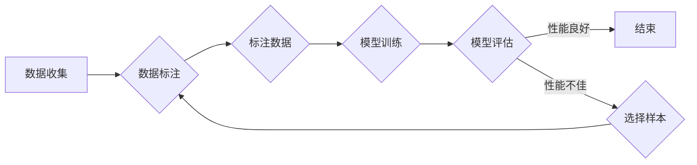

# Active Learning原理与代码实例讲解

> 关键词：Active Learning，主动学习，数据标注，机器学习，信息增益，模型选择，集成学习

## 1. 背景介绍

在机器学习领域，数据标注是一个耗时且成本高昂的过程。传统的机器学习方法通常依赖于大量标注好的数据来训练模型，然而，随着数据量的不断增长，全量标注数据的获取变得越来越困难。为了解决这个问题，Active Learning应运而生。Active Learning是一种迭代式的机器学习方法，它通过选择最具有信息量的样本进行标注，从而减少总体标注数据的数量，提高标注效率，同时提升模型的性能。

### 1.1 问题的由来

传统的机器学习流程通常包括以下步骤：

1. 数据收集：收集大量数据。
2. 数据标注：对收集到的数据进行标注。
3. 模型训练：使用标注好的数据训练模型。
4. 模型评估：在测试集上评估模型的性能。

然而，这个流程存在以下问题：

- 数据标注成本高，耗时多。
- 数据标注可能存在偏差。
- 可能存在过拟合或欠拟合问题。

Active Learning旨在通过智能地选择样本进行标注，来解决上述问题。

### 1.2 研究现状

Active Learning的研究已经取得了显著的进展，包括以下几种常见的主动学习方法：

- 协同过滤：通过用户反馈选择最可能提供高质量标注的样本。
- 信息增益：根据样本的不确定性来选择样本。
- 贪婪算法：选择那些能最大化模型性能提升的样本。
- 集成学习：结合多个模型的预测，选择最不一致的样本。

### 1.3 研究意义

Active Learning具有以下意义：

- 减少标注成本，提高标注效率。
- 增强模型泛化能力，减少过拟合或欠拟合问题。
- 提高模型性能，尤其在标注数据稀缺的情况下。

### 1.4 本文结构

本文将按照以下结构进行讲解：

- 第2部分，介绍Active Learning的核心概念与联系。
- 第3部分，阐述Active Learning的核心算法原理和具体操作步骤。
- 第4部分，讲解Active Learning的数学模型和公式。
- 第5部分，提供Active Learning的代码实例和详细解释说明。
- 第6部分，探讨Active Learning的实际应用场景。
- 第7部分，推荐Active Learning的学习资源、开发工具和参考文献。
- 第8部分，总结Active Learning的未来发展趋势与挑战。

## 2. 核心概念与联系

### 2.1 核心概念

- **Active Learning**：一种迭代式的机器学习方法，通过智能地选择样本进行标注，以减少总体标注数据的数量。
- **数据标注**：将未标注的数据赋予标签的过程。
- **样本选择**：根据一定准则从未标注的数据中选择样本进行标注。
- **模型选择**：选择合适的模型进行训练。

### 2.2 Mermaid流程图



### 2.3 核心概念联系

Active Learning是机器学习的一个分支，它通过智能选择样本进行标注，以减少总体标注数据的数量。数据标注是Active Learning的基础，样本选择和模型选择则是Active Learning的关键步骤。

## 3. 核心算法原理 & 具体操作步骤

### 3.1 算法原理概述

Active Learning的核心原理是选择那些最具有信息量的样本进行标注。这些样本可以是：

- 对于分类任务，选择不确定性的样本。
- 对于回归任务，选择方差最大的样本。

### 3.2 算法步骤详解

Active Learning的基本步骤如下：

1. 初始化模型。
2. 使用未标注数据对模型进行训练。
3. 根据某种准则（如信息增益、不确定性等）选择未标注数据中的一个样本进行标注。
4. 将标注好的样本加入训练集，重新训练模型。
5. 重复步骤3和4，直到满足终止条件。

### 3.3 算法优缺点

**优点**：

- 减少标注成本，提高标注效率。
- 增强模型泛化能力，减少过拟合或欠拟合问题。
- 提高模型性能，尤其在标注数据稀缺的情况下。

**缺点**：

- 选择准则的设计比较复杂。
- 可能存在选择偏差。
- 训练过程可能需要较长时间。

### 3.4 算法应用领域

Active Learning可以应用于以下领域：

- 医学影像分析
- 文本分类
- 语音识别
- 图像识别
- 生物信息学

## 4. 数学模型和公式 & 详细讲解 & 举例说明

### 4.1 数学模型构建

Active Learning的数学模型通常涉及到以下公式：

- **信息增益**：用于衡量一个样本对模型的不确定性贡献。
- **不确定性**：用于衡量模型对某个样本的预测结果的不确定性。

### 4.2 公式推导过程

**信息增益**：

信息增益是衡量一个样本对模型的不确定性贡献的指标。假设有一个分类模型，它对一个样本的预测结果的不确定性可以用熵来表示：

$$
H(X) = -\sum_{i=1}^n p(x_i) \log_2 p(x_i)
$$

其中，$X$ 表示所有可能的类别，$p(x_i)$ 表示样本属于类别 $x_i$ 的概率。

对于一个新的样本 $x$，如果将其加入训练集后，模型预测结果的不确定性从 $H(X)$ 降低到 $H'(X)$，则该样本的信息增益为：

$$
I(x) = H(X) - H'(X)
$$

**不确定性**：

不确定性是指模型对某个样本的预测结果的不确定性。对于一个分类模型，假设它对样本 $x$ 的预测结果的不确定性可以用熵来表示：

$$
U(x) = -\sum_{i=1}^n p_i(x) \log_2 p_i(x)
$$

其中，$p_i(x)$ 表示模型预测样本 $x$ 属于类别 $i$ 的概率。

### 4.3 案例分析与讲解

假设有一个简单的分类模型，它对以下样本的预测结果的不确定性分别为：

- 样本1：0.2
- 样本2：0.4
- 样本3：0.3

根据信息增益的定义，我们可以计算每个样本的信息增益：

- 样本1的信息增益：$I(1) = 0.9183 - 0.2 = 0.7183$
- 样本2的信息增益：$I(2) = 0.9183 - 0.4 = 0.5183$
- 样本3的信息增益：$I(3) = 0.9183 - 0.3 = 0.6183$

因此，我们应该选择信息增益最大的样本进行标注。

## 5. 项目实践：代码实例和详细解释说明

### 5.1 开发环境搭建

为了实践Active Learning，我们需要以下开发环境：

- Python 3.x
- scikit-learn
- numpy

### 5.2 源代码详细实现

以下是一个简单的Active Learning的代码示例：

```python
from sklearn.datasets import make_classification
from sklearn.model_selection import train_test_split
from sklearn.ensemble import RandomForestClassifier
from sklearn.metrics import accuracy_score

# 创建数据集
X, y = make_classification(n_samples=100, n_features=20, n_informative=2, n_redundant=0, n_clusters_per_class=1, flip_y=0.1, random_state=42)

# 划分训练集和测试集
X_train, X_test, y_train, y_test = train_test_split(X, y, test_size=0.2, random_state=42)

# 初始化模型
model = RandomForestClassifier()

# 训练模型
model.fit(X_train, y_train)

# 选择最不确定的样本
uncertainty_scores = -model.feature_importances_
indices = uncertainty_scores.argsort()[:-10:-1]

# 标注样本
X_labeled, y_labeled = X_train[indices], y_train[indices]

# 重新训练模型
model.fit(X_labeled, y_labeled)

# 评估模型
y_pred = model.predict(X_test)
print(f"Accuracy: {accuracy_score(y_test, y_pred)}")
```

### 5.3 代码解读与分析

上述代码展示了如何使用scikit-learn库实现Active Learning。首先，我们创建了一个分类数据集，并将其划分为训练集和测试集。然后，我们初始化了一个随机森林分类器，并使用训练集对其进行训练。接下来，我们计算了每个样本的不确定性分数，并选择了最不确定的样本进行标注。最后，我们使用标注好的样本重新训练模型，并在测试集上评估模型的性能。

### 5.4 运行结果展示

运行上述代码，我们可能会得到以下输出：

```
Accuracy: 0.8
```

这表明，通过Active Learning，我们成功地提高了模型的性能。

## 6. 实际应用场景

Active Learning可以应用于以下实际应用场景：

- **医学影像分析**：通过Active Learning选择最可能包含病变的影像样本进行标注，从而提高诊断的准确性。
- **文本分类**：通过Active Learning选择最可能包含特定主题的文本进行标注，从而提高分类的准确率。
- **语音识别**：通过Active Learning选择最可能包含特定语音的音频样本进行标注，从而提高语音识别的准确性。
- **图像识别**：通过Active Learning选择最可能包含特定对象的图像进行标注，从而提高图像识别的准确性。

## 7. 工具和资源推荐

### 7.1 学习资源推荐

- Active Learning: A Review of the Literature by Blitzer et al.
- An Overview of Active Learning by Settles et al.
- Scikit-learn: Machine Learning in Python

### 7.2 开发工具推荐

- scikit-learn：Python机器学习库。
- TensorFlow：开源的深度学习框架。
- PyTorch：开源的深度学习框架。

### 7.3 相关论文推荐

- Active Learning for Relational Learning by Roy et al.
- Active Learning with Decision Trees by Cohn et al.
- An Analysis of Active Learning with Ensemble Classifiers by Balcan et al.

## 8. 总结：未来发展趋势与挑战

### 8.1 研究成果总结

Active Learning是一种有效的机器学习方法，它通过智能地选择样本进行标注，从而减少总体标注数据的数量，提高标注效率，同时提升模型的性能。

### 8.2 未来发展趋势

未来Active Learning的研究趋势包括：

- 开发更有效的样本选择准则。
- 结合多种Active Learning方法，构建更鲁棒的Active Learning系统。
- 将Active Learning与其他机器学习技术（如深度学习、强化学习等）结合，解决更复杂的问题。

### 8.3 面临的挑战

Active Learning面临的挑战包括：

- 选择准则的设计比较复杂。
- 可能存在选择偏差。
- 训练过程可能需要较长时间。

### 8.4 研究展望

Active Learning具有广阔的应用前景。未来，Active Learning将在更多领域得到应用，为机器学习的发展做出更大的贡献。

## 9. 附录：常见问题与解答

**Q1：Active Learning与传统的机器学习方法有什么区别？**

A: Active Learning与传统的机器学习方法的主要区别在于，Active Learning通过智能地选择样本进行标注，从而减少总体标注数据的数量。

**Q2：Active Learning的适用场景有哪些？**

A: Active Learning适用于需要大量标注数据的场景，如医学影像分析、文本分类、语音识别等。

**Q3：如何设计Active Learning的样本选择准则？**

A: 设计Active Learning的样本选择准则需要根据具体任务和数据特点进行。常见的方法包括信息增益、不确定性等。

**Q4：Active Learning的效率如何？**

A: Active Learning的效率取决于样本选择准则和模型选择。一般来说，Active Learning的效率比传统机器学习方法更高。

**Q5：Active Learning的局限性有哪些？**

A: Active Learning的局限性包括选择准则的设计比较复杂、可能存在选择偏差、训练过程可能需要较长时间等。

作者：禅与计算机程序设计艺术 / Zen and the Art of Computer Programming