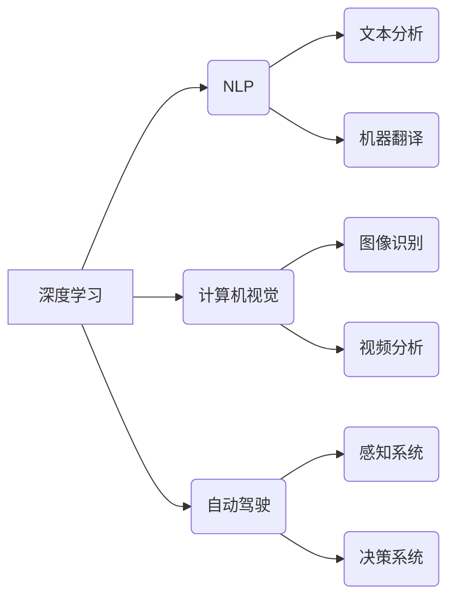

# Andrej Karpathy的AI演讲内容

> 关键词：Andrej Karpathy, 人工智能，深度学习，自然语言处理，自动驾驶，计算机视觉，未来展望

## 1. 背景介绍

Andrej Karpathy 是一位杰出的计算机科学家，以其在自然语言处理（NLP）和深度学习领域的贡献而闻名。他的工作不仅在学术界产生了深远影响，而且对工业界的AI应用也产生了重要影响。本文将深入探讨 Andrej Karpathy 的AI演讲内容，分析其核心观点，并展望人工智能的未来发展趋势。

## 2. 核心概念与联系

### 2.1 核心概念

#### 2.1.1 深度学习
深度学习是人工智能领域中的一种先进的技术，它通过模拟人脑中的神经网络结构，使用大量数据来学习和提取复杂模式。

#### 2.1.2 自然语言处理（NLP）
自然语言处理是人工智能的一个分支，专注于使计算机能够理解、解释和生成人类语言。

#### 2.1.3 计算机视觉
计算机视觉是AI的一个分支，它使计算机能够从图像或视频中提取信息。

#### 2.1.4 自动驾驶
自动驾驶技术利用AI来模拟人类驾驶行为，实现无人驾驶汽车。

### 2.2 架构的 Mermaid 流程图



## 3. 核心算法原理 & 具体操作步骤

### 3.1 算法原理概述

#### 3.1.1 深度学习原理
深度学习利用多层神经网络来学习数据中的复杂模式。每一层都从上一层的输出中提取更高级的特征，最终得到预测结果。

#### 3.1.2 NLP算法原理
NLP算法通常基于变换器（如Transformer）或循环神经网络（如LSTM）来处理序列数据，并学习语言模式。

#### 3.1.3 计算机视觉算法原理
计算机视觉算法使用卷积神经网络（CNN）来提取图像中的特征，并进行分类或检测。

#### 3.1.4 自动驾驶算法原理
自动驾驶系统结合了感知、决策和执行三个主要模块。感知模块使用图像识别和激光雷达等技术来感知周围环境，决策模块根据感知信息做出决策，执行模块控制车辆动作。

### 3.2 算法步骤详解

#### 3.2.1 深度学习步骤
1. 数据收集：收集大量相关数据。
2. 数据预处理：清洗、转换和归一化数据。
3. 构建模型：设计网络结构，选择合适的激活函数和优化器。
4. 训练模型：使用训练数据训练模型。
5. 评估模型：在验证集上评估模型性能。
6. 调优模型：根据评估结果调整模型结构和参数。

#### 3.2.2 NLP步骤
1. 数据收集：收集大量文本数据。
2. 数据预处理：分词、去除停用词等。
3. 构建模型：使用预训练的NLP模型或从头开始训练。
4. 训练模型：使用标注数据训练模型。
5. 评估模型：在验证集上评估模型性能。
6. 应用模型：将模型应用于实际任务。

#### 3.2.3 计算机视觉步骤
1. 数据收集：收集图像数据。
2. 数据预处理：归一化、裁剪等。
3. 构建模型：使用预训练的CV模型或从头开始训练。
4. 训练模型：使用标注数据训练模型。
5. 评估模型：在验证集上评估模型性能。
6. 应用模型：将模型应用于实际任务。

#### 3.2.4 自动驾驶步骤
1. 感知：使用摄像头、激光雷达等感知周围环境。
2. 决策：根据感知信息做出决策。
3. 执行：控制车辆动作。
4. 评估：评估自动驾驶系统的性能。

### 3.3 算法优缺点

#### 3.3.1 深度学习优缺点
**优点**：
- 高效学习复杂模式。
- 强大的泛化能力。

**缺点**：
- 对数据需求量大。
- 模型可解释性差。

#### 3.3.2 NLP优缺点
**优点**：
- 高效处理序列数据。
- 丰富的预训练模型。

**缺点**：
- 对低资源语言支持不足。
- 模型难以解释。

#### 3.3.3 计算机视觉优缺点
**优点**：
- 高效识别图像中的物体和场景。
- 广泛应用于图像识别和视频分析。

**缺点**：
- 对光照、视角敏感。
- 模型计算量大。

#### 3.3.4 自动驾驶优缺点
**优点**：
- 安全、高效的驾驶。
- 减少人为错误。

**缺点**：
- 技术复杂。
- 道德和伦理问题。

### 3.4 算法应用领域

深度学习、NLP、计算机视觉和自动驾驶在各个领域都有广泛的应用，包括：

- 医疗诊断
- 金融服务
- 教育领域
- 智能家居
- 交通出行

## 4. 数学模型和公式 & 详细讲解 & 举例说明

### 4.1 数学模型构建

#### 4.1.1 深度学习模型
深度学习模型通常由多层神经网络组成，每层包含多个神经元。每个神经元通过加权求和激活函数的输出。

#### 4.1.2 NLP模型
NLP模型通常基于变换器或循环神经网络，它们使用注意力机制来捕捉序列数据中的依赖关系。

#### 4.1.3 计算机视觉模型
计算机视觉模型通常基于卷积神经网络，它们使用卷积层来提取图像中的局部特征。

#### 4.1.4 自动驾驶模型
自动驾驶模型通常结合了多种传感器数据，使用深度学习模型进行感知和决策。

### 4.2 公式推导过程

#### 4.2.1 深度学习公式
假设一个简单的多层感知器（MLP）模型，其输入层、隐藏层和输出层的神经元数量分别为 $n_1, n_2, n_3$，则模型的前向传播公式为：

$$
y = f(W_3 \cdot h + b_3)
$$

其中 $h = f(W_2 \cdot x + b_2)$，$x$ 为输入，$y$ 为输出，$W$ 和 $b$ 分别为权重和偏置，$f$ 为激活函数。

#### 4.2.2 NLP模型公式
假设一个简单的变换器模型，其输入序列为 $x = [x_1, x_2, \ldots, x_T]$，则变换器的输出为：

$$
y_t = \text{softmax}(W_q \cdot Q_t + W_k \cdot K_t + b)
$$

其中 $Q_t$ 和 $K_t$ 分别为查询和键的向量表示，$W_q, W_k, b$ 为权重和偏置。

#### 4.2.3 计算机视觉模型公式
假设一个简单的卷积神经网络（CNN）模型，其输入图像为 $I = [I_1, I_2, \ldots, I_C]$，则模型的输出为：

$$
O = \text{ReLU}(W_f \cdot O_{f-1} + b_f)
$$

其中 $O_{f-1}$ 为前一层输出，$W_f, b_f$ 为权重和偏置。

#### 4.2.4 自动驾驶模型公式
自动驾驶模型通常由多个子模型组成，如感知、决策和执行模型。每个子模型都有自己的输入和输出。

### 4.3 案例分析与讲解

#### 4.3.1 案例一：图像分类
假设我们要使用深度学习模型进行图像分类任务。我们可以使用卷积神经网络（CNN）模型，其结构如下：

```
[Conv2d] -> [ReLU] -> [MaxPooling] -> [Flatten] -> [Dense] -> [Softmax]
```

在这个模型中，卷积层用于提取图像特征，ReLU激活函数用于增加模型非线性，MaxPooling用于减少特征空间维度，Flatten层用于将特征展平为一维向量，Dense层用于进行分类。

#### 4.3.2 案例二：文本分类
假设我们要使用NLP模型进行文本分类任务。我们可以使用变换器（Transformer）模型，其结构如下：

```
[Input Embedding] -> [Transformer] -> [Output Embedding] -> [Dense] -> [Softmax]
```

在这个模型中，输入嵌入层将文本转换为向量表示，变换器层用于捕获文本中的依赖关系，输出嵌入层将变换器层的输出转换为类别向量，Dense层用于进行分类。

## 5. 项目实践：代码实例和详细解释说明

### 5.1 开发环境搭建

为了实践上述算法，我们需要搭建以下开发环境：

- 操作系统：Linux或MacOS
- 编程语言：Python
- 深度学习框架：TensorFlow或PyTorch
- 数据集：根据具体任务选择合适的数据集

### 5.2 源代码详细实现

以下是一个简单的图像分类项目的代码示例，使用TensorFlow和Keras实现：

```python
import tensorflow as tf
from tensorflow.keras import layers, models

# 构建模型
model = models.Sequential([
    layers.Conv2D(32, (3, 3), activation='relu', input_shape=(32, 32, 3)),
    layers.MaxPooling2D((2, 2)),
    layers.Conv2D(64, (3, 3), activation='relu'),
    layers.MaxPooling2D((2, 2)),
    layers.Conv2D(64, (3, 3), activation='relu'),
    layers.Flatten(),
    layers.Dense(64, activation='relu'),
    layers.Dense(10, activation='softmax')
])

# 编译模型
model.compile(optimizer='adam',
              loss='sparse_categorical_crossentropy',
              metrics=['accuracy'])

# 训练模型
model.fit(train_images, train_labels, epochs=5)

# 评估模型
test_loss, test_acc = model.evaluate(test_images, test_labels)
print('
Test accuracy:', test_acc)
```

### 5.3 代码解读与分析

以上代码展示了如何使用TensorFlow和Keras构建和训练一个简单的图像分类模型。首先，我们使用Sequential模型构建了一个包含卷积层、最大池化层、全连接层和softmax层的神经网络。然后，我们使用adam优化器、sparse_categorical_crossentropy损失函数和accuracy指标编译模型。接着，我们使用训练数据训练模型，并使用测试数据评估模型性能。

### 5.4 运行结果展示

运行上述代码后，你将看到模型在训练集和测试集上的准确率。这个准确率反映了模型对图像分类任务的性能。

## 6. 实际应用场景

### 6.1 医疗诊断

深度学习在医疗诊断中的应用非常广泛，如图像识别可以帮助医生快速准确地识别病变组织，而NLP可以帮助医生分析病历和临床记录。

### 6.2 金融服务

在金融服务领域，深度学习可以用于信用评分、欺诈检测和投资策略等任务。计算机视觉可以用于自动处理金融报表和图像数据。

### 6.3 教育领域

深度学习可以用于个性化教育推荐、自动批改作业和智能辅导等任务。计算机视觉可以用于监控学生的学习状态和行为。

### 6.4 智能家居

智能家居系统可以利用深度学习进行语音识别、图像识别和自然语言处理，实现更加智能化的家庭控制。

### 6.5 交通出行

自动驾驶技术可以利用深度学习进行环境感知、路径规划和决策控制，实现更加安全、高效的交通出行。

## 7. 工具和资源推荐

### 7.1 学习资源推荐

- 《深度学习》
- 《自然语言处理综论》
- 《计算机视觉：算法与应用》
- 《自动驾驶：技术原理与应用》

### 7.2 开发工具推荐

- TensorFlow
- PyTorch
- Keras
- Jupyter Notebook

### 7.3 相关论文推荐

- "ImageNet Classification with Deep Convolutional Neural Networks"
- "A Neural Algorithm of Artistic Style"
- "Attention Is All You Need"
- "BERT: Pre-training of Deep Bidirectional Transformers for Language Understanding"

## 8. 总结：未来发展趋势与挑战

### 8.1 研究成果总结

深度学习、NLP、计算机视觉和自动驾驶等领域取得了显著的进展，推动了人工智能技术的快速发展。

### 8.2 未来发展趋势

- 模型将更加庞大和复杂。
- 计算效率将得到显著提升。
- 模型可解释性将得到加强。
- 应用将更加广泛。

### 8.3 面临的挑战

- 数据隐私和安全问题。
- 模型可解释性问题。
- 道德和伦理问题。
- 算力资源消耗问题。

### 8.4 研究展望

未来，人工智能将更加智能化、通用化，并在各个领域发挥越来越重要的作用。

## 9. 附录：常见问题与解答

**Q1：什么是深度学习？**

A：深度学习是一种利用多层神经网络学习数据中的复杂模式的人工智能技术。

**Q2：什么是自然语言处理？**

A：自然语言处理是人工智能的一个分支，专注于使计算机能够理解、解释和生成人类语言。

**Q3：什么是计算机视觉？**

A：计算机视觉是人工智能的一个分支，专注于使计算机能够从图像或视频中提取信息。

**Q4：什么是自动驾驶？**

A：自动驾驶技术利用AI来模拟人类驾驶行为，实现无人驾驶汽车。

**Q5：人工智能的未来发展趋势是什么？**

A：人工智能的未来发展趋势包括模型规模增大、计算效率提升、模型可解释性加强和应用领域扩大等。

---

作者：禅与计算机程序设计艺术 / Zen and the Art of Computer Programming