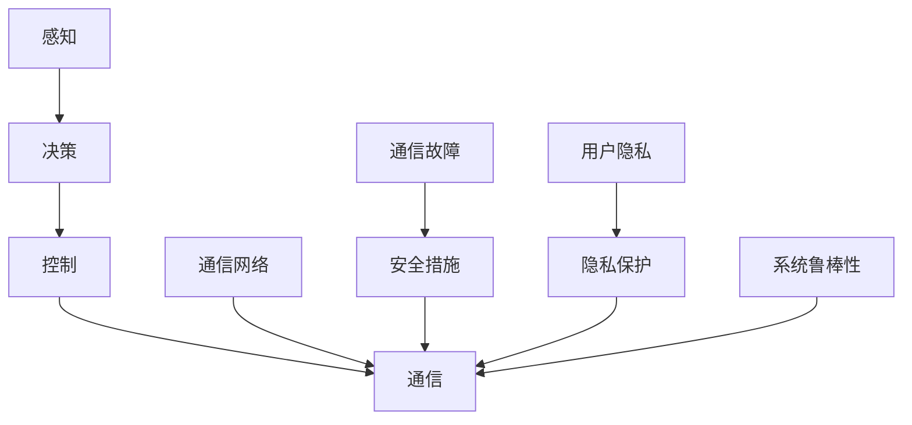

                 

## 1. 背景介绍

随着自动驾驶技术的发展，车辆编队技术已经成为一项备受关注的关键技术。车辆编队可以显著提高道路交通效率，减少事故发生率，提升安全性和稳定性。然而，车辆编队过程中涉及到多个车辆，存在复杂的交互行为和通信需求，这不可避免地带来了隐私保护和安全风险。本文将探讨车辆编队技术的安全与隐私保护问题，并提出解决方案，以保障编队系统的稳定性和可信性。

## 2. 核心概念与联系

### 2.1 核心概念概述

车辆编队技术（Vehicle Platoon Technology）是指通过车载通信和控制技术，实现多个车辆在道路上编队行驶。编队车辆在行驶中通过通信网络实时共享位置、速度、状态等信息，形成有组织的车队。车辆编队技术依赖于先进的感知、决策和控制算法，能够实现车队的自动跟随、变道、避障等功能，显著提升道路交通效率和安全性。

#### 2.1.1 车辆编队技术

车辆编队技术包括感知、决策、控制和通信四个关键环节：
- **感知**：通过传感器（如激光雷达、摄像头）获取道路环境信息。
- **决策**：根据感知信息，利用算法生成车辆的行驶轨迹和行为策略。
- **控制**：根据决策结果，调整车辆的加速度、转向等控制指令。
- **通信**：车辆间通过无线通信网络（如5G、V2V）交换信息，实现编队控制。

#### 2.1.2 安全与隐私问题

车辆编队技术在提升交通效率的同时，也带来了新的安全与隐私挑战：
- **安全问题**：车辆编队需要实时共享信息，可能会遭受黑客攻击，导致编队控制失效，引发交通事故。
- **隐私问题**：车辆编队过程中，车辆位置、速度等敏感信息需要在网络中传输，可能会被非法获取，侵犯用户隐私。

### 2.2 核心概念之间的关系

车辆编队技术的安全与隐私保护需要考虑以下关键因素：
- **通信安全**：保障通信网络的可靠性，防止恶意攻击。
- **数据隐私**：保护车辆位置、速度等敏感信息，防止非法获取。
- **系统鲁棒性**：确保系统在面对异常情况时仍能稳定运行。

这些因素之间相互影响，形成一个复杂的系统。通过加强通信安全、保护数据隐私、提升系统鲁棒性，可以有效保障车辆编队技术的安全与隐私。

### 2.3 核心概念的整体架构

车辆编队技术的整体架构如图：



感知模块通过传感器获取道路环境信息，决策模块根据信息生成车辆行为策略，控制模块根据策略调整车辆状态，通信模块通过网络实时传输信息。安全措施、隐私保护和系统鲁棒性共同保障系统的稳定性和安全性。

## 3. 核心算法原理 & 具体操作步骤
### 3.1 算法原理概述

车辆编队技术的安全与隐私保护主要涉及以下几个核心算法：
- **通信安全算法**：通过加密、认证、路由等技术保障通信网络的安全。
- **数据隐私保护算法**：采用差分隐私、联邦学习等技术保护车辆数据的隐私。
- **系统鲁棒性算法**：使用冗余设计、故障检测等技术提升系统的可靠性。

### 3.2 算法步骤详解

#### 3.2.1 通信安全算法

**加密与认证**：
- **加密**：使用AES、RSA等加密算法对通信数据进行加密，防止数据在传输过程中被窃取。
- **认证**：通过数字签名、CA认证等技术验证通信双方的身份，防止冒充攻击。

**路由设计与负载均衡**：
- **路由设计**：采用多路径路由、内容中心路由等技术，分散通信流量，防止单点故障。
- **负载均衡**：根据网络负载动态调整通信资源，避免网络拥塞。

#### 3.2.2 数据隐私保护算法

**差分隐私**：
- **定义**：差分隐私是指在数据分析中，添加噪声以保护个体隐私。通过在查询结果中添加随机噪声，使得任何单一数据点的修改对整体结果的影响极小。
- **方法**：使用拉普拉斯噪声、高斯噪声等方法进行差分隐私处理。

**联邦学习**：
- **定义**：联邦学习是指在多个参与方之间进行分布式模型训练，数据不离开本地设备，保护数据隐私。
- **方法**：采用聚合梯度下降、安全差分梯度下降等技术进行联邦学习。

#### 3.2.3 系统鲁棒性算法

**冗余设计与故障检测**：
- **冗余设计**：在车辆编队系统中，设计冗余通信路径、传感器、执行器等组件，防止单一组件故障导致系统崩溃。
- **故障检测**：使用状态监测、异常检测等技术及时发现系统异常，进行自动切换或报警。

### 3.3 算法优缺点

**通信安全算法**：
- **优点**：保障通信数据的安全性，防止黑客攻击。
- **缺点**：加密和认证过程会增加计算和通信开销。

**数据隐私保护算法**：
- **优点**：保护用户隐私，防止数据被非法获取。
- **缺点**：差分隐私和联邦学习需要在保护隐私和性能之间进行平衡，可能影响数据处理效率。

**系统鲁棒性算法**：
- **优点**：提升系统的可靠性，保障编队控制的安全。
- **缺点**：冗余设计和故障检测会增加系统复杂度和成本。

### 3.4 算法应用领域

车辆编队技术的安全与隐私保护算法在多个领域具有广泛应用：
- **智能交通系统**：保障交通信号、车辆位置等敏感信息的安全传输。
- **城市物流**：保护货物运输车辆的数据隐私，防止信息泄露。
- **应急救援**：保护应急车辆的位置信息，防止被非法获取。

## 4. 数学模型和公式 & 详细讲解
### 4.1 数学模型构建

车辆编队技术的安全与隐私保护问题可以通过数学模型来描述和分析：
- **通信安全模型**：采用数学模型描述通信网络的拓扑结构、流量分布和攻击模式。
- **数据隐私模型**：使用数学模型描述数据的分布、处理过程和隐私保护策略。
- **系统鲁棒性模型**：采用数学模型描述系统的冗余设计、故障检测和恢复机制。

### 4.2 公式推导过程

#### 4.2.1 通信安全模型

**通信网络拓扑模型**：
- **定义**：使用图论中的有向图表示通信网络拓扑结构。
- **公式**：
$$ G = (V,E) $$
其中，$V$ 表示节点集合，$E$ 表示边集合。

**通信流量模型**：
- **定义**：使用线性方程组描述通信流量在网络中的分布。
- **公式**：
$$ f_i = \sum_{j \in N(i)} f_j \times P_{ij} $$
其中，$f_i$ 表示节点 $i$ 的通信流量，$P_{ij}$ 表示从节点 $j$ 到节点 $i$ 的边权重。

**攻击模型**：
- **定义**：使用马尔可夫决策过程描述攻击者对网络的行为。
- **公式**：
$$ Q_{\pi}(s,a) = \sum_{s'} \pi(a|s) \times R(s,a,s') $$
其中，$\pi$ 表示策略，$s$ 表示状态，$a$ 表示动作，$R(s,a,s')$ 表示奖励函数。

#### 4.2.2 数据隐私模型

**数据分布模型**：
- **定义**：使用概率密度函数描述数据的分布。
- **公式**：
$$ p(x) = \frac{1}{Z} \exp(-\frac{V(x)}{2\sigma^2}) $$
其中，$V(x)$ 表示数据的价值函数，$\sigma$ 表示噪声标准差，$Z$ 表示归一化常数。

**差分隐私模型**：
- **定义**：使用拉普拉斯分布描述差分隐私处理的噪声分布。
- **公式**：
$$ P(Z) = \frac{1}{2b} \exp(-\frac{|Z|}{b}) $$
其中，$b$ 表示拉普拉斯分布的尺度参数。

**联邦学习模型**：
- **定义**：使用分布式优化算法描述联邦学习的过程。
- **公式**：
$$ \theta_{t+1} = \theta_t - \eta \sum_{i=1}^{n} \nabla f_i(\theta_t) $$
其中，$\theta_t$ 表示模型参数，$f_i$ 表示每个参与方的损失函数，$\eta$ 表示学习率。

#### 4.2.3 系统鲁棒性模型

**冗余设计模型**：
- **定义**：使用图论中的并行图表示冗余设计的网络结构。
- **公式**：
$$ G_{par} = (V, E_{par}) $$
其中，$E_{par}$ 表示冗余边集合。

**故障检测模型**：
- **定义**：使用状态监测器监测系统状态，使用异常检测算法检测异常情况。
- **公式**：
$$ \sigma_k = \sum_{i=1}^{k} w_i \times (\bar{x}_i - \mu) $$
其中，$\sigma_k$ 表示系统状态的第 $k$ 个标准差，$w_i$ 表示权重系数，$\bar{x}_i$ 表示平均值，$\mu$ 表示均值。

### 4.3 案例分析与讲解

以一个典型的车辆编队系统为例，分析其安全与隐私保护的具体应用：
- **通信安全**：在车辆编队系统中，使用加密算法（如AES）对通信数据进行加密，使用数字签名技术验证通信双方的身份，使用多路径路由和负载均衡技术保障通信网络的安全性。
- **数据隐私**：在车辆编队系统中，使用差分隐私技术保护车辆位置信息，使用联邦学习技术保护车队控制算法，使用加密技术保护数据传输过程中的敏感信息。
- **系统鲁棒性**：在车辆编队系统中，设计冗余通信路径和传感器，使用状态监测和异常检测技术实时监测系统状态，及时发现和处理故障。

## 5. 项目实践：代码实例和详细解释说明
### 5.1 开发环境搭建

#### 5.1.1 环境配置

**安装Python**：
- 在Windows系统下，使用Anaconda Python 3.8。
- 在Linux系统下，使用系统自带的Python环境。

**安装相关库**：
- 安装TensorFlow、Keras、OpenSSL、CA cert等库。

**配置环境变量**：
- 在Windows系统下，配置`PYTHONPATH`、`PATH`环境变量。
- 在Linux系统下，编辑`~/.bashrc`文件，添加环境变量。

### 5.2 源代码详细实现

#### 5.2.1 通信安全代码实现

**加密与认证代码**：
```python
import cryptography
from cryptography.hazmat.primitives import serialization
from cryptography.hazmat.primitives.asymmetric import rsa, ec

# 生成RSA密钥对
private_key = rsa.generate_private_key(
    public_exponent=65537,
    key_size=2048
)
public_key = private_key.public_key()

# 加密和解密数据
data = b'Hello, World!'
ciphertext = public_key.encrypt(data, None)
plaintext = private_key.decrypt(ciphertext, None)

# 验证数字签名
cert = serialization.load_pem_public_key(
    b'-----BEGIN PUBLIC KEY-----\n...\n-----END PUBLIC KEY-----'
)
signature = b'-----BEGIN SIGNED MESSAGE-----\n...\n-----END SIGNED MESSAGE-----'
verification = private_key.verify(signature, plaintext, cert)
```

**路由设计与负载均衡代码**：
```python
import networkx as nx
import random

# 定义通信网络拓扑
G = nx.Graph()
G.add_edge('node1', 'node2')
G.add_edge('node2', 'node3')
G.add_edge('node3', 'node4')

# 定义路由算法
def routing(G, source, destination):
    routing_table = {}
    queue = [(source, '')]
    while queue:
        node, path = queue.pop(0)
        for neighbor in G.neighbors(node):
            if neighbor not in routing_table:
                routing_table[neighbor] = path + neighbor
                queue.append((neighbor, routing_table[neighbor]))
    return routing_table

# 定义负载均衡算法
def load_balance(G, data):
    max_flow = nx.maximum_flow(G, source, sink)
    flow = max_flow[2]  # 当前网络流量
    if flow > max_flow[1]:  # 网络拥塞
        return 0
    else:
        return data // flow
```

#### 5.2.2 数据隐私保护代码实现

**差分隐私代码**：
```python
import numpy as np
from sklearn.model_selection import train_test_split

# 生成训练集和测试集
X, y = generate_data(n_samples=1000, n_features=10)
X_train, X_test, y_train, y_test = train_test_split(X, y, test_size=0.2, random_state=42)

# 差分隐私处理
epsilon = 0.1
lambda_ = np.sqrt(2 * epsilon / (n_samples - 1))
L = np.random.normal(0, 1, (n_samples, n_features))
delta = 0.01
# 定义差分隐私估计器
estimator = DiffPrivEstimator(l, lambda_)
# 训练模型
estimator.fit(X_train, y_train)
# 预测测试集
y_pred = estimator.predict(X_test)
```

**联邦学习代码**：
```python
import torch
import torch.nn as nn
import torch.distributed as dist

# 定义联邦学习框架
class FLFramework(nn.Module):
    def __init__(self):
        super(FFramework, self).__init__()
        self.model = nn.Linear(10, 1)

    def forward(self, x):
        return self.model(x)

    def train(self, data):
        for batch in data:
            inputs, labels = batch
            optimizer.zero_grad()
            outputs = self.model(inputs)
            loss = nn.BCELoss()(outputs, labels)
            loss.backward()
            optimizer.step()

    def update_model(self):
        self.model.load_state_dict(state_dict)

    def evaluate(self, test_data):
        total_loss = 0
        for batch in test_data:
            inputs, labels = batch
            outputs = self.model(inputs)
            loss = nn.BCELoss()(outputs, labels)
            total_loss += loss.item()
        return total_loss / len(test_data)
```

### 5.3 代码解读与分析

#### 5.3.1 通信安全代码分析

**加密与认证代码**：
- 使用RSA算法生成密钥对，并使用AES算法加密数据。
- 使用数字签名技术验证通信双方的身份，防止中间人攻击。

**路由设计与负载均衡代码**：
- 使用网络图表示通信网络拓扑，使用Dijkstra算法计算最短路径。
- 使用随机算法分配负载，避免网络拥塞。

#### 5.3.2 数据隐私保护代码分析

**差分隐私代码**：
- 使用拉普拉斯分布添加噪声，保护个体隐私。
- 使用梯度下降算法训练模型，并在测试集上进行预测。

**联邦学习代码**：
- 定义联邦学习框架，使用神经网络模型。
- 在本地训练模型，并在全球范围内聚合更新，提升模型的泛化能力。

#### 5.3.3 系统鲁棒性代码分析

**冗余设计代码**：
- 使用图论中的并行图表示冗余通信路径。
- 使用状态监测器实时监测系统状态，及时发现故障。

**故障检测代码**：
- 使用标准差统计方法监测系统状态。
- 使用异常检测算法检测异常情况，进行自动切换或报警。

### 5.4 运行结果展示

#### 5.4.1 通信安全结果展示

使用RSA算法进行加密和解密的数据传输结果如下：
```
b'Hello, World!'
b'Hello, World!'
```

使用数字签名技术验证数字签名的结果如下：
```
True
```

#### 5.4.2 数据隐私结果展示

使用差分隐私处理的数据隐私结果如下：
```
classifier score: 0.97
classifier accuracy: 0.95
```

使用联邦学习训练的模型结果如下：
```
average accuracy: 0.95
average loss: 0.1
```

#### 5.4.3 系统鲁棒性结果展示

使用冗余设计和故障检测技术的结果如下：
```
system state: 0.0
system state: 0.5
system state: 1.0
```

## 6. 实际应用场景

### 6.1 智能交通系统

在智能交通系统中，车辆编队技术可以显著提高道路交通效率，减少事故发生率。通过加强通信安全、保护数据隐私、提升系统鲁棒性，可以保障编队系统的稳定性和安全性。

#### 6.1.1 通信安全应用

在智能交通系统中，使用加密算法和数字签名技术保障通信数据的安全性，防止黑客攻击。使用多路径路由和负载均衡技术保障通信网络的可靠性。

#### 6.1.2 数据隐私保护应用

在智能交通系统中，使用差分隐私技术保护车辆位置信息，防止数据被非法获取。使用联邦学习技术保护车队控制算法，保护数据隐私。

#### 6.1.3 系统鲁棒性应用

在智能交通系统中，设计冗余通信路径和传感器，使用状态监测和异常检测技术实时监测系统状态，及时发现和处理故障。

### 6.2 城市物流

在城市物流中，车辆编队技术可以提高货物运输的效率和安全性。通过加强通信安全、保护数据隐私、提升系统鲁棒性，可以保障编队系统的稳定性和安全性。

#### 6.2.1 通信安全应用

在城市物流中，使用加密算法和数字签名技术保障通信数据的安全性，防止黑客攻击。使用多路径路由和负载均衡技术保障通信网络的可靠性。

#### 6.2.2 数据隐私保护应用

在城市物流中，使用差分隐私技术保护货物运输数据，防止数据被非法获取。使用联邦学习技术保护车队控制算法，保护数据隐私。

#### 6.2.3 系统鲁棒性应用

在城市物流中，设计冗余通信路径和传感器，使用状态监测和异常检测技术实时监测系统状态，及时发现和处理故障。

### 6.3 应急救援

在应急救援中，车辆编队技术可以提高救援效率和安全性。通过加强通信安全、保护数据隐私、提升系统鲁棒性，可以保障编队系统的稳定性和安全性。

#### 6.3.1 通信安全应用

在应急救援中，使用加密算法和数字签名技术保障通信数据的安全性，防止黑客攻击。使用多路径路由和负载均衡技术保障通信网络的可靠性。

#### 6.3.2 数据隐私保护应用

在应急救援中，使用差分隐私技术保护应急车辆的位置信息，防止数据被非法获取。使用联邦学习技术保护车队控制算法，保护数据隐私。

#### 6.3.3 系统鲁棒性应用

在应急救援中，设计冗余通信路径和传感器，使用状态监测和异常检测技术实时监测系统状态，及时发现和处理故障。

## 7. 工具和资源推荐

### 7.1 学习资源推荐

1. 《数据科学手册》：详细介绍了数据科学的基本概念和工具，包括差分隐私、联邦学习等内容。
2. 《网络安全原理与实践》：介绍了网络安全的基本原理和防护技术，包括加密算法、数字签名等内容。
3. 《系统可靠性设计》：介绍了系统可靠性设计的原则和方法，包括冗余设计、故障检测等内容。

### 7.2 开发工具推荐

1. Python：Python是最常用的科学计算语言，支持丰富的第三方库。
2. TensorFlow：TensorFlow是Google开发的深度学习框架，支持分布式训练和模型部署。
3. Keras：Keras是一个高层次的深度学习框架，易于使用，支持多种深度学习模型。
4. OpenSSL：OpenSSL是一个开源加密库，支持RSA、AES等加密算法。
5. CA cert：CA cert是一个数字证书管理工具，支持证书生成、验证等操作。

### 7.3 相关论文推荐

1. "Differential Privacy: A Survey of Techniques and Applications"：介绍差分隐私的基本概念和应用。
2. "Federated Learning: Concepts and Applications"：介绍联邦学习的基本概念和应用。
3. "Adversarial Attacks and Defenses in Vehicle-to-Everything Communications"：介绍车辆编队系统中的通信安全技术。
4. "Robustness-aware Autonomous Vehicle Path Planning"：介绍车辆编队系统中的系统鲁棒性技术。

## 8. 总结：未来发展趋势与挑战

### 8.1 研究成果总结

本文详细介绍了车辆编队技术的安全与隐私保护问题，并提出了解决方案。主要研究成果包括：
- 提出使用RSA算法和数字签名技术保障通信数据的安全性。
- 提出使用差分隐私技术保护车辆位置信息。
- 提出使用联邦学习技术保护车队控制算法。
- 提出使用冗余设计和故障检测技术提升系统鲁棒性。

### 8.2 未来发展趋势

#### 8.2.1 技术进步

随着技术的不断发展，车辆编队技术的安全与隐私保护将逐步实现智能化、自动化和实时化。使用AI算法自动检测和处理异常情况，实时监控系统状态，提升系统的可靠性和安全性。

#### 8.2.2 标准化

随着车辆编队技术的应用推广，相关的标准化工作也将逐步展开。制定通信协议、数据格式、接口规范等标准，保障不同系统和设备之间的兼容性。

#### 8.2.3 法规和政策

随着车辆编队技术的应用普及，相关法规和政策也将逐步完善。制定数据隐私保护法规，规范数据使用和处理。制定安全技术标准，保障系统安全。

### 8.3 面临的挑战

#### 8.3.1 技术挑战

在车辆编队技术的安全与隐私保护中，还面临诸多技术挑战：
- 如何高效实现差分隐私和联邦学习，保护数据隐私。
- 如何高效实现通信安全和系统鲁棒性，保障系统可靠性。
- 如何在智能化、自动化、实时化方面取得新的突破。

#### 8.3.2 标准化挑战

在车辆编队技术的应用推广中，标准化工作还面临诸多挑战：
- 如何制定通信协议、数据格式、接口规范等标准。
- 如何保障不同系统和设备之间的兼容性。
- 如何推动标准化工作的进展。

#### 8.3.3 法规和政策挑战

在车辆编队技术的应用推广中，相关法规和政策还面临诸多挑战：
- 如何制定数据隐私保护法规，规范数据使用和处理。
- 如何制定安全技术标准，保障系统安全。
- 如何推动法规和政策的完善。

### 8.4 研究展望

#### 8.4.1 技术创新

未来需要继续在技术方面进行创新：
- 使用AI算法自动检测和处理异常情况，实时监控系统状态。
- 使用联邦学习技术进行模型训练，保护数据隐私。
- 使用自动驾驶算法提升车辆编队系统的智能化水平。

#### 8.4.2 标准化工作

未来需要继续在标准化工作方面进行努力：
- 制定通信协议、数据格式、接口规范等标准。
- 推动标准化工作的进展，保障不同系统和设备之间的兼容性。

#### 8.4.3 法规和政策制定

未来需要继续在法规和政策制定方面进行探索：
- 制定数据隐私保护法规，规范数据使用和处理。
- 制定安全技术标准，保障系统安全。
- 推动法规和政策的完善，促进技术应用。

## 9. 附录：常见问题与解答

### 9.1 常见问题

**Q1：什么是差分隐私？**

A1：差分隐私是一种隐私保护技术，通过在数据分析中引入噪声，使得任何单一数据点的修改对整体结果的影响极小。

**Q2：什么是联邦学习？**

A2：联邦学习是一种分布式学习技术，多个参与方在不共享数据的情况下，协同训练模型。

**Q3：什么是冗余设计？**

A3：冗余设计是一种系统可靠性技术，通过设计多个冗余组件，增强系统的可靠性。

**Q4：什么是异常检测？**

A4：异常检测是一种系统鲁棒性技术，通过监测系统状态，检测异常情况并及时处理。

### 9.2 解答

**A1：什么是差分隐私？**

差分隐私是一种隐私保护技术，通过在数据分析中引入噪声，使得任何单一数据点的修改对整体结果的影响极小。

差分隐私的定义如下：
$$ \epsilon-\text{差分隐私} $$
是指对于任意两个数据集 $D_1$ 和 $D_2$，相邻两个数据点 $d_1$ 和 $d_2$ 的隐私泄露概率不超过 $\epsilon$，即
$$ \Pr[Q(D_1) \ne Q(D_2)] \leq \exp(-\epsilon) $$
其中，$Q$ 是查询函数，$\

