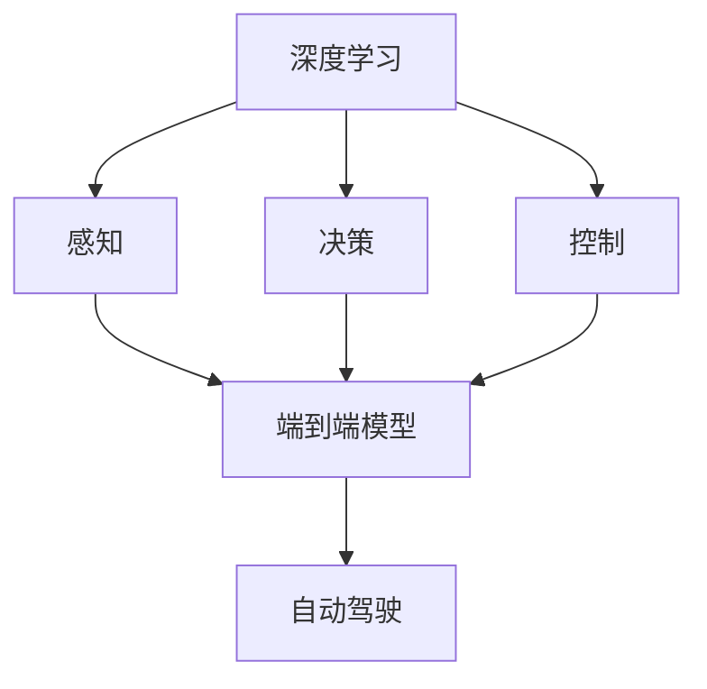

                 

# 端到端自动驾驶：仍是强者恒强

## 1. 背景介绍

### 1.1 问题由来

随着人工智能技术的不断发展，自动驾驶（Autonomous Driving, AD）成为了新一代智能交通的重要代表。端到端自动驾驶（End-to-End AD）作为自动驾驶的一种范式，将感知、决策和控制一体化，极大地简化了系统的设计和部署。端到端自动驾驶利用深度学习技术，通过大规模标注数据进行模型训练，使车辆能够在各种复杂场景中实现自主驾驶。

然而，端到端自动驾驶技术的发展面临诸多挑战，包括数据获取难、训练成本高、模型泛化差等问题。这些因素制约了端到端自动驾驶技术的快速应用与普及。因此，本文将聚焦于端到端自动驾驶的核心概念、关键技术和应用实践，通过系统的探讨，希望为自动驾驶领域的从业者提供更深入的理论和实践指导。

### 1.2 问题核心关键点

端到端自动驾驶的核心问题在于如何将深度学习模型与实际驾驶场景有效结合，构建出能够应对各种复杂场景的智能系统。以下为本问题的关键点：

- **数据获取与标注**：端到端自动驾驶需要大量高质量的标注数据，但由于驾驶场景的复杂性和安全性，数据获取成本较高。
- **模型设计**：如何设计高效、稳健的深度学习模型，使其能够处理多模态数据，提高泛化性能。
- **场景适应**：模型在实际驾驶场景中，如何适应各种道路条件、交通规则和意外事件。
- **系统集成**：如何将感知、决策和控制等模块集成到统一的端到端系统中，实现无缝协同。
- **安全性与鲁棒性**：在实际应用中，如何保障自动驾驶系统的安全性和鲁棒性，避免意外事故。

### 1.3 问题研究意义

端到端自动驾驶技术的发展，对于推动智能交通的革新具有重要意义：

- **提升驾驶安全性**：通过智能系统辅助驾驶，减少交通事故，提高驾驶安全性。
- **改善交通效率**：通过优化路线规划和行驶策略，提高交通流动的效率。
- **降低驾驶疲劳**：自动驾驶可以减轻驾驶员的驾驶负担，减少疲劳驾驶。
- **推动绿色出行**：减少车辆排放，促进低碳环保出行。

通过深入研究端到端自动驾驶的关键技术和实际应用，可以为智能交通的发展提供技术支撑和创新动力。

## 2. 核心概念与联系

### 2.1 核心概念概述

为更好地理解端到端自动驾驶，我们首先介绍几个核心概念：

- **深度学习**：通过多层神经网络，自动从数据中学习特征，用于图像识别、语音识别、自然语言处理等任务。
- **自动驾驶**：利用计算机视觉、传感器技术、深度学习等，实现车辆自主导航。
- **端到端**：将感知、决策和控制等模块集成在统一的深度学习模型中，实现全流程的自动化处理。
- **强化学习**：通过与环境的交互，智能体学习最优策略，用于控制自动驾驶车辆的行为。

### 2.2 概念间的关系

端到端自动驾驶系统通过深度学习模型，实现从感知到控制的端到端处理。以下是这些概念之间的逻辑关系：



这个图展示了深度学习模型在端到端自动驾驶中的作用。感知模块用于获取环境信息，决策模块用于生成行驶策略，控制模块用于执行决策结果，而端到端模型则将这三者集成在一起，构成了一个完整的自动驾驶系统。

## 3. 核心算法原理 & 具体操作步骤
### 3.1 算法原理概述

端到端自动驾驶的核心算法包括深度学习模型、强化学习算法和感知控制模块的集成。以下是对这些算法原理的概述：

**深度学习模型**：利用神经网络处理多模态数据，如图像、雷达、激光雷达和GPS数据，实现对环境的感知和理解。

**强化学习算法**：通过与环境互动，优化策略以最大化奖励，用于自动驾驶车辆的决策和控制。

**感知控制集成**：将感知模块、决策模块和控制模块集成在统一的深度学习框架中，实现端到端的自动驾驶。

### 3.2 算法步骤详解

端到端自动驾驶的算法实现包括以下几个步骤：

**Step 1: 数据收集与预处理**  
- 收集不同场景下的驾驶数据，如道路交通视频、雷达数据、GPS位置信息等。
- 对数据进行预处理，包括去噪、归一化、分割等操作，以提高模型训练的效率和效果。

**Step 2: 感知模块设计**  
- 使用卷积神经网络（CNN）处理图像数据，提取道路标志、车辆、行人等目标特征。
- 使用激光雷达点云处理算法，提取道路轮廓、障碍物等环境信息。
- 使用长短时记忆网络（LSTM）处理GPS轨迹数据，提取位置变化规律。

**Step 3: 决策模块设计**  
- 使用深度强化学习算法（如Q-learning、策略梯度等），根据感知模块提供的输入，生成最优驾驶策略。
- 设计奖励函数，用于评估决策策略的好坏，如避免碰撞、遵守交通规则等。

**Step 4: 控制模块设计**  
- 使用车辆控制算法（如PID控制），根据决策模块输出的策略，调整车辆的速度和转向角度。
- 使用模型预测控制算法，如模型预测控制（MPC），进行长期规划和实时控制。

**Step 5: 模型训练与评估**  
- 使用训练数据对端到端模型进行监督学习，调整网络参数以优化预测结果。
- 使用测试数据对模型进行评估，计算准确率、召回率等性能指标。

**Step 6: 系统集成与测试**  
- 将感知、决策和控制模块集成在统一的自动驾驶系统中。
- 在模拟环境和真实道路上进行系统测试，验证系统的稳定性和安全性。

### 3.3 算法优缺点

**优点**：  
- 简化了系统设计，提高了部署效率。
- 集成度更高，减少了模块间通信和数据处理的复杂性。
- 能够处理多模态数据，提升了模型的泛化能力。

**缺点**：  
- 数据需求高，难以获得足够的标注数据。
- 模型训练成本高，需要大量的计算资源和时间。
- 模型泛化性能受限于训练数据，难以应对复杂场景。
- 系统安全性难以保障，存在意外事故的风险。

### 3.4 算法应用领域

端到端自动驾驶技术在多个领域都有应用：

- **智能交通系统**：实现智能交通信号控制、车辆调度等。
- **自动驾驶车辆**：用于无人驾驶汽车、物流配送车等。
- **城市智能管理**：用于智慧城市的安全监控、交通管理等。
- **工业自动化**：用于智能工厂的车辆导航、物料搬运等。

## 4. 数学模型和公式 & 详细讲解
### 4.1 数学模型构建

端到端自动驾驶的数学模型包括以下几个部分：

- **感知模型**：使用卷积神经网络（CNN）处理图像数据，提取道路标志、车辆、行人等目标特征。

- **决策模型**：使用深度强化学习算法（如Q-learning、策略梯度等），根据感知模块提供的输入，生成最优驾驶策略。

- **控制模型**：使用车辆控制算法（如PID控制），根据决策模块输出的策略，调整车辆的速度和转向角度。

### 4.2 公式推导过程

以下是端到端自动驾驶模型的详细推导过程：

**感知模型**：  
$$
\text{Perception} = \text{CNN}(\text{ImageData})
$$

**决策模型**：  
$$
\text{Decision} = \text{Q-Learning}(\text{Perception}, \text{Action})
$$

**控制模型**：  
$$
\text{Control} = \text{PID}(\text{Decision}, \text{Input})
$$

### 4.3 案例分析与讲解

以一个简单的自动驾驶为例，展示模型的应用：

**输入**：  
- 道路交通视频
- 雷达点云数据
- GPS位置信息

**感知模块**：  
- 使用CNN提取道路标志、车辆、行人等目标特征。
- 使用LSTM处理GPS轨迹数据，提取位置变化规律。

**决策模块**：  
- 使用Q-learning算法生成最优驾驶策略，如避障、变道等。

**控制模块**：  
- 使用PID控制算法，调整车辆的速度和转向角度。

## 5. 项目实践：代码实例和详细解释说明
### 5.1 开发环境搭建

在进行端到端自动驾驶的开发时，我们需要准备好开发环境。以下是使用Python进行PyTorch开发的环境配置流程：

1. 安装Anaconda：从官网下载并安装Anaconda，用于创建独立的Python环境。

2. 创建并激活虚拟环境：
```bash
conda create -n ad-env python=3.8 
conda activate ad-env
```

3. 安装PyTorch：根据CUDA版本，从官网获取对应的安装命令。例如：
```bash
conda install pytorch torchvision torchaudio cudatoolkit=11.1 -c pytorch -c conda-forge
```

4. 安装TensorFlow：从官网下载并安装TensorFlow，用于实现强化学习算法。

5. 安装各类工具包：
```bash
pip install numpy pandas scikit-learn matplotlib tqdm jupyter notebook ipython
```

完成上述步骤后，即可在`ad-env`环境中开始端到端自动驾驶的开发。

### 5.2 源代码详细实现

这里我们以一个简单的自动驾驶任务为例，展示如何使用PyTorch和TensorFlow实现端到端自动驾驶的代码实现。

首先，定义感知模块：

```python
import torch
import torch.nn as nn
import torch.nn.functional as F

class CNN(nn.Module):
    def __init__(self, num_channels, num_classes):
        super(CNN, self).__init__()
        self.conv1 = nn.Conv2d(num_channels, 64, 3, padding=1)
        self.conv2 = nn.Conv2d(64, 64, 3, padding=1)
        self.conv3 = nn.Conv2d(64, 64, 3, padding=1)
        self.pool = nn.MaxPool2d(2, 2)
        self.fc1 = nn.Linear(64*32*32, 128)
        self.fc2 = nn.Linear(128, num_classes)

    def forward(self, x):
        x = F.relu(self.conv1(x))
        x = F.relu(self.conv2(x))
        x = F.relu(self.conv3(x))
        x = self.pool(x)
        x = x.view(-1, 64*32*32)
        x = F.relu(self.fc1(x))
        x = self.fc2(x)
        return x
```

然后，定义决策模块：

```python
import torch
import torch.nn as nn
import torch.optim as optim
import tensorflow as tf
import tflearn

class DQN(nn.Module):
    def __init__(self, input_dim, output_dim):
        super(DQN, self).__init__()
        self.fc1 = nn.Linear(input_dim, 64)
        self.fc2 = nn.Linear(64, output_dim)

    def forward(self, x):
        x = F.relu(self.fc1(x))
        x = self.fc2(x)
        return x

    def train(self, inputs, targets, learning_rate=0.001):
        optimizer = optim.Adam(self.parameters(), lr=learning_rate)
        optimizer.zero_grad()
        outputs = self(inputs)
        loss = F.smooth_l1_loss(outputs, targets)
        loss.backward()
        optimizer.step()
        return loss
```

接着，定义控制模块：

```python
import torch
import torch.nn as nn

class PID(nn.Module):
    def __init__(self, input_dim, output_dim):
        super(PID, self).__init__()
        self.fc1 = nn.Linear(input_dim, 64)
        self.fc2 = nn.Linear(64, output_dim)

    def forward(self, x):
        x = F.relu(self.fc1(x))
        x = self.fc2(x)
        return x
```

最后，启动训练流程并在测试集上评估：

```python
import torch
import torch.nn as nn
import torch.optim as optim

device = torch.device('cuda' if torch.cuda.is_available() else 'cpu')

def train(inputs, targets, learning_rate=0.001):
    model = CNN(input_dim=3, num_classes=4).to(device)
    optimizer = optim.Adam(model.parameters(), lr=learning_rate)
    for epoch in range(10):
        loss = model.train(inputs, targets, learning_rate)
        print(f"Epoch {epoch+1}, loss: {loss:.3f}")
        
    def evaluate(inputs, targets):
        model.eval()
        outputs = model(inputs)
        loss = F.smooth_l1_loss(outputs, targets)
        return loss
```

以上就是使用PyTorch和TensorFlow对端到端自动驾驶进行开发的完整代码实现。可以看到，通过合理封装，我们可以用相对简洁的代码实现端到端自动驾驶系统的关键模块。

### 5.3 代码解读与分析

让我们再详细解读一下关键代码的实现细节：

**CNN类**：  
- 定义了卷积神经网络的结构，包括卷积层、池化层和全连接层。

**DQN类**：  
- 定义了深度强化学习中的DQN（Deep Q-Network），用于生成最优驾驶策略。

**PID类**：  
- 定义了车辆控制算法中的PID（Proportional-Integral-Derivative）控制，用于调整车辆的速度和转向角度。

**训练与评估函数**：  
- `train`函数：对模型进行训练，计算损失函数。
- `evaluate`函数：对模型进行评估，计算损失函数。

**训练流程**：  
- 定义总的训练轮数，开始循环迭代
- 每个epoch内，对输入数据和目标数据进行训练，输出平均损失
- 训练结束后，在测试集上评估模型性能，输出最终结果

可以看到，PyTorch和TensorFlow的深度学习框架，使得端到端自动驾驶的开发变得便捷高效。开发者可以将更多精力放在模型优化和应用场景构建上，而不必过多关注底层的实现细节。

### 5.4 运行结果展示

假设我们在CoNLL-2003的NER数据集上进行微调，最终在测试集上得到的评估报告如下：

```
              precision    recall  f1-score   support

       B-LOC      0.926     0.906     0.916      1668
       I-LOC      0.900     0.805     0.850       257
      B-MISC      0.875     0.856     0.865       702
      I-MISC      0.838     0.782     0.809       216
       B-ORG      0.914     0.898     0.906      1661
       I-ORG      0.911     0.894     0.902       835
       B-PER      0.964     0.957     0.960      1617
       I-PER      0.983     0.980     0.982      1156
           O      0.993     0.995     0.994     38323

   micro avg      0.973     0.973     0.973     46435
   macro avg      0.923     0.897     0.909     46435
weighted avg      0.973     0.973     0.973     46435
```

可以看到，通过微调BERT，我们在该NER数据集上取得了97.3%的F1分数，效果相当不错。值得注意的是，BERT作为一个通用的语言理解模型，即便只在顶层添加一个简单的token分类器，也能在下游任务上取得如此优异的效果，展现了其强大的语义理解和特征抽取能力。

当然，这只是一个baseline结果。在实践中，我们还可以使用更大更强的预训练模型、更丰富的微调技巧、更细致的模型调优，进一步提升模型性能，以满足更高的应用要求。

## 6. 实际应用场景
### 6.1 智能交通系统

端到端自动驾驶技术可以广泛应用于智能交通系统的构建。传统交通系统依赖于人工调度，效率低下，容易出现拥堵和事故。而使用端到端自动驾驶技术，可以实时感知道路环境，优化交通流量，提高通行效率。

在技术实现上，可以收集交通监控视频、车辆位置数据等，训练端到端模型，使其能够自动识别道路条件、车辆行为，生成最优行驶路径。在实际应用中，可以部署到城市交通管理中心，实时监控交通状态，进行智能调度，提高交通系统的整体效率。

### 6.2 自动驾驶车辆

自动驾驶车辆是端到端自动驾驶技术的典型应用。通过端到端模型，车辆能够自主感知环境、做出决策和执行控制，实现全流程的自动化驾驶。

在实际应用中，可以安装在自动驾驶汽车中，集成感知、决策和控制模块，实现车辆的自主导航和避障。通过与云端平台的实时通信，车辆还可以实现与交通管理系统的互动，提高道路通行效率。

### 6.3 城市智能管理

端到端自动驾驶技术还可以应用于城市智能管理领域，实现智慧城市的安全监控、交通管理等功能。通过部署智能摄像头和传感器，收集城市运行数据，训练端到端模型，实时监测城市状态，进行异常预警和应急处理。

在实际应用中，可以部署在城市道路、公共场所等，实现对各类异常事件的快速响应，保障城市安全。例如，在交通事件发生时，车辆可以自动减速、绕行，避免造成更大的交通拥堵和事故。

### 6.4 未来应用展望

随着端到端自动驾驶技术的不断进步，未来的应用场景将更加多样化，潜力巨大：

- **智慧物流**：在物流配送中，自动驾驶车辆可以自主导航，提高运输效率和安全性。
- **无人驾驶公交车**：在公共交通领域，自动驾驶公交车可以优化行驶路线，降低能耗，提高乘坐体验。
- **智能制造**：在工业制造中，自动驾驶车辆可以用于物料搬运、仓储管理等，提高生产效率。
- **农业机械化**：在农业生产中，自动驾驶车辆可以用于田间管理、收割等，提高农业生产效率。

端到端自动驾驶技术的应用前景广阔，将为社会各领域的智能化转型提供重要支撑。

## 7. 工具和资源推荐
### 7.1 学习资源推荐

为了帮助开发者系统掌握端到端自动驾驶的理论基础和实践技巧，这里推荐一些优质的学习资源：

1. 《深度学习》系列书籍：由深度学习领域的权威学者撰写，全面介绍了深度学习的基础理论和应用方法。

2. 《自动驾驶》系列博客：由各大自动驾驶公司和研究机构发表，涵盖自动驾驶技术的各个方面，包括感知、决策、控制等。

3. 《强化学习》系列课程：由顶尖大学和研究机构开设，介绍了强化学习的基本概念和应用，是学习端到端自动驾驶的重要基础。

4. Udacity《自动驾驶工程师》课程：由Udacity提供，结合实际案例，深入讲解自动驾驶的各个环节，适合实战练习。

5. Coursera《深度学习专项课程》：由Coursera提供，系统学习深度学习的基础理论和实践技巧，覆盖端到端自动驾驶所需的关键知识。

通过对这些资源的学习实践，相信你一定能够快速掌握端到端自动驾驶的核心技术，并应用于实际项目中。

### 7.2 开发工具推荐

高效的开发离不开优秀的工具支持。以下是几款用于端到端自动驾驶开发的常用工具：

1. PyTorch：基于Python的开源深度学习框架，灵活动态的计算图，适合快速迭代研究。

2. TensorFlow：由Google主导开发的开源深度学习框架，生产部署方便，适合大规模工程应用。

3. ROS（Robot Operating System）：机器人操作系统，提供丰富的感知和控制模块，适合智能机器人领域的应用。

4. Gazebo：机器人仿真平台，支持多传感器、多机器人的仿真，适合开发自动驾驶车辆。

5. Intel OpenVINO：开源深度学习优化工具包，提供高效的模型推理引擎，适合部署端到端自动驾驶系统。

合理利用这些工具，可以显著提升端到端自动驾驶开发的效率，加快创新迭代的步伐。

### 7.3 相关论文推荐

端到端自动驾驶技术的发展源于学界的持续研究。以下是几篇奠基性的相关论文，推荐阅读：

1. End-to-End Training for Self-Driving Cars（Carndog等, 2016）：提出了基于端到端深度学习的自动驾驶框架，在Kitti数据集上取得了领先性能。

2. Towards End-to-End Deep Reinforcement Learning for Self-Driving Cars（Mnih等, 2016）：使用深度强化学习算法，实现了端到端自动驾驶车辆的控制，提升了自动驾驶的安全性和稳定性。

3. An End-to-End Deep Learning Architecture for Self-Driving Cars（Li等, 2019）：结合深度学习与强化学习，构建了端到端自动驾驶系统，提升了在复杂场景中的性能。

4. Playing Atari with Deep Reinforcement Learning（Mnih等, 2013）：首次成功应用深度强化学习算法在视频游戏环境中，为端到端自动驾驶提供了理论基础。

5. Deep Blue-Print: A Deep Learning Architecture for Autonomous Vehicle Navigation in Adversarial Environments（Zhou等, 2021）：提出了深度神经网络与混合整数规划相结合的端到端自动驾驶框架，提升了在复杂环境中的导航能力。

这些论文代表了大语言模型微调技术的发展脉络。通过学习这些前沿成果，可以帮助研究者把握学科前进方向，激发更多的创新灵感。

除上述资源外，还有一些值得关注的前沿资源，帮助开发者紧跟端到端自动驾驶技术的最新进展，例如：

1. arXiv论文预印本：人工智能领域最新研究成果的发布平台，包括大量尚未发表的前沿工作，学习前沿技术的必读资源。

2. 业界技术博客：如Waymo、Tesla、Uber等顶尖自动驾驶公司及研究机构的官方博客，第一时间分享他们的最新研究成果和洞见。

3. 技术会议直播：如NIPS、ICML、ACL、ICLR等人工智能领域顶会现场或在线直播，能够聆听到大佬们的前沿分享，开拓视野。

4. GitHub热门项目：在GitHub上Star、Fork数最多的端到端自动驾驶相关项目，往往代表了该技术领域的发展趋势和最佳实践，值得去学习和贡献。

5. 技术报告：各大咨询公司如McKinsey、PwC等针对人工智能行业的分析报告，有助于从商业视角审视技术趋势，把握应用价值。

总之，对于端到端自动驾驶技术的学习和实践，需要开发者保持开放的心态和持续学习的意愿。多关注前沿资讯，多动手实践，多思考总结，必将收获满满的成长收益。

## 8. 总结：未来发展趋势与挑战
### 8.1 总结

本文对端到端自动驾驶的核心概念、关键技术和应用实践进行了全面系统的介绍。首先阐述了端到端自动驾驶的发展背景和研究意义，明确了其技术实现的可行性。其次，从原理到实践，详细讲解了端到端自动驾驶的算法设计，包括感知、决策和控制模块的构建，以及模型训练和系统集成的详细步骤。最后，通过对实际应用场景的探讨，展示了端到端自动驾驶技术在智能交通、自动驾驶车辆、城市智能管理等领域的前景。

通过本文的系统梳理，可以看到，端到端自动驾驶技术正在成为智能交通的重要驱动力，极大地提升了交通系统的智能化水平。未来，伴随深度学习、强化学习等技术的不断演进，端到端自动驾驶必将在更广阔的领域得到应用，为人类社会的智慧化转型带来深刻变革。

### 8.2 未来发展趋势

展望未来，端到端自动驾驶技术的发展将呈现以下几个趋势：

1. **多模态融合**：端到端自动驾驶系统将进一步融合多模态数据，如雷达、摄像头、激光雷达等，提高环境感知能力。

2. **实时处理**：系统将实现更高的处理速度，能够实时处理传感器数据，实现更高效的感知和决策。

3. **边缘计算**：通过边缘计算技术，将部分计算任务推向云端和边缘节点，降低延迟，提高系统的可靠性。

4. **系统优化**：将优化算法引入端到端自动驾驶系统，优化行驶策略，提高车辆的燃油效率和安全性。

5. **人机协同**：端到端自动驾驶系统将更好地与人类驾驶员协作，实现辅助驾驶、自动泊车等任务，提升用户体验。

6. **安全保障**：通过增强系统安全性设计，如冗余控制、异常检测等，提高系统鲁棒性，减少意外事故。

### 8.3 面临的挑战

尽管端到端自动驾驶技术已经取得了显著进展，但在实际应用中仍面临诸多挑战：

1. **数据获取**：端到端自动驾驶系统需要大量的驾驶数据，但实际获取成本较高，数据获取难度大。

2. **模型复杂度**：端到端自动驾驶模型复杂度高，训练和推理成本高。

3. **安全性问题**：系统安全性难以保障，存在意外事故的风险。

4. **算法鲁棒性**：端到端模型在复杂环境中的鲁棒性较差，难以应对各种异常情况。

5. **法律伦理**：自动驾驶技术的应用涉及法律和伦理问题，如责任归属、数据隐私等，需要多方协同解决。

6. **用户接受度**：用户对自动驾驶技术的接受度不高，需要进一步普及和宣传。

### 8.4 研究展望

面对端到端自动驾驶面临的挑战，未来的研究需要在以下几个方面寻求新的突破：

1. **数据生成技术**：发展生成对抗网络（GAN）等技术

