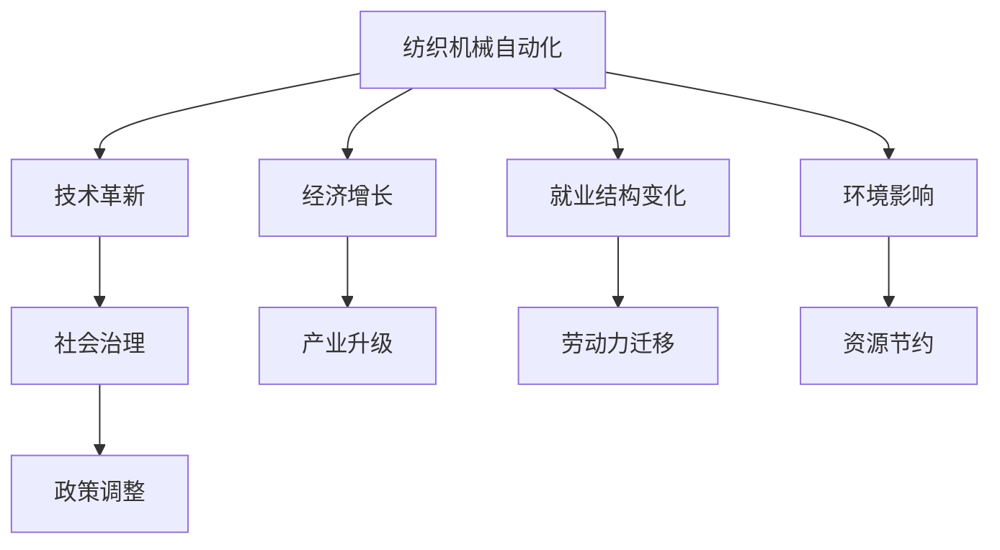
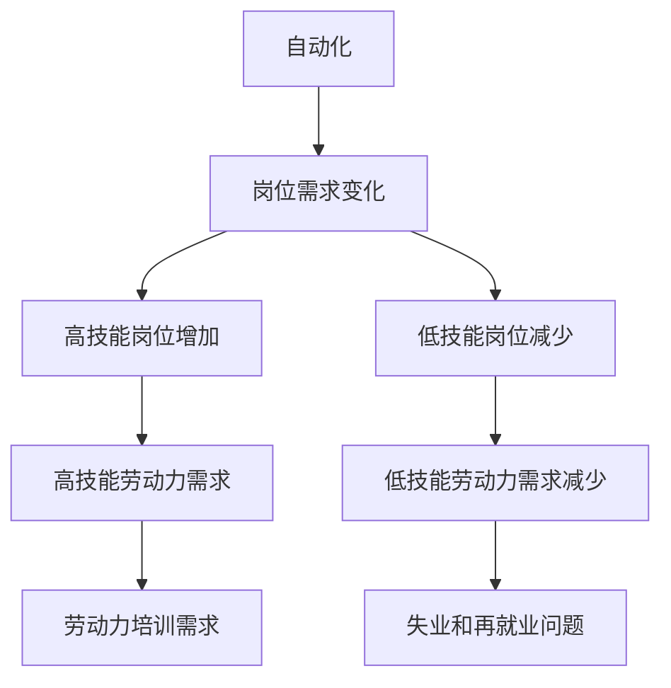
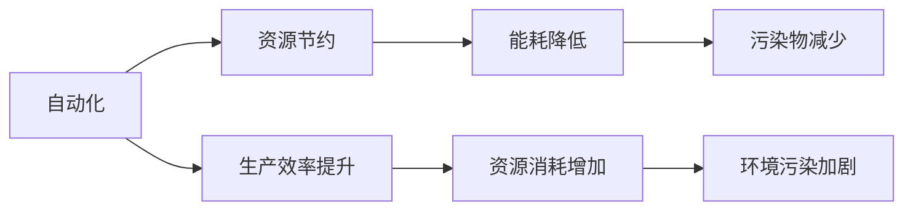
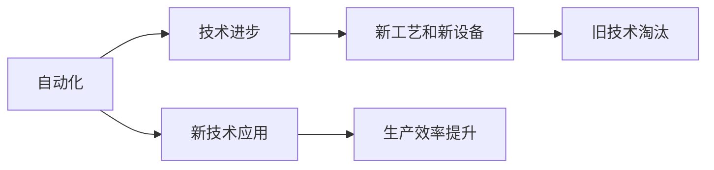
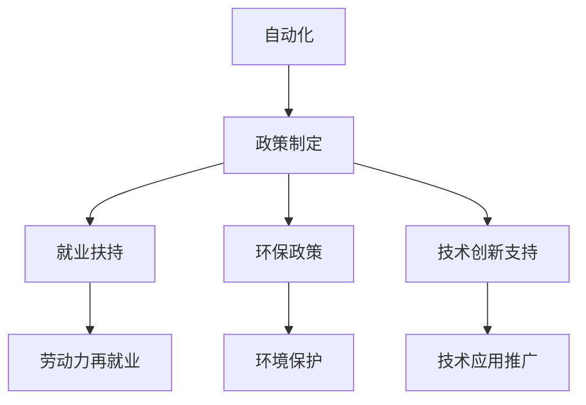
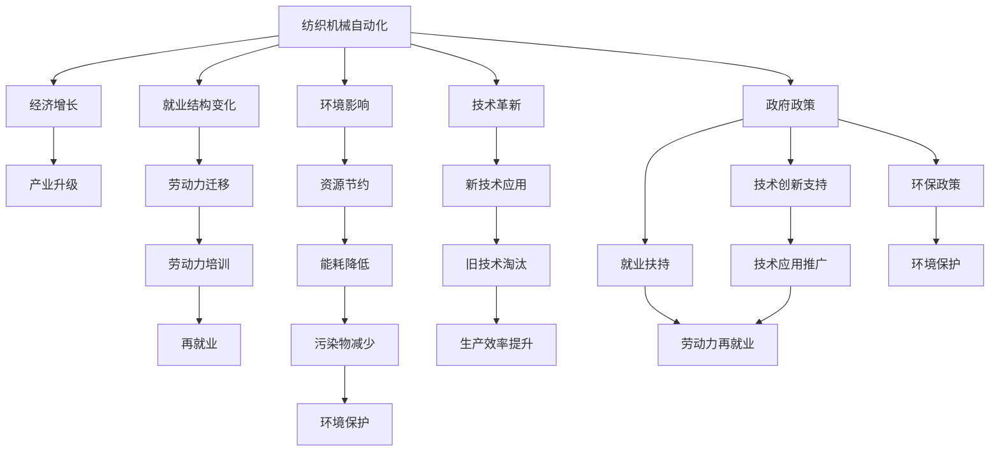

                 

# 纺织机械自动化的社会效应

> 关键词：纺织机械自动化, 社会效应, 经济影响, 就业变迁, 环保效益, 技术革新

## 1. 背景介绍

### 1.1 问题由来
纺织机械自动化技术的迅猛发展，对全球经济社会产生了深远影响。自工业革命以来，纺织机械的发展极大地推动了生产力的进步和工业的现代化。从机械化到半自动化，再到如今高度自动化的生产方式，纺织机械的每一次迭代都带来了工业和社会结构的大变迁。

然而，随着自动化的深入，社会效应逐渐显现，引发了关于自动化与就业、经济、环保等多方面的广泛讨论。自动化对经济、就业、环境的影响成为政策制定者和学术界关注的焦点。本文旨在深入探讨纺织机械自动化对社会产生的多维效应，以期为相关政策制定提供科学依据。

### 1.2 问题核心关键点
纺织机械自动化的社会效应主要涉及以下几个关键点：

- 经济效率提升：自动化生产方式如何改变生产效率和成本结构，进而影响经济增长。
- 就业变迁：自动化带来的就业结构变化，特别是在传统纺织行业内的劳动力转移。
- 环境影响：自动化生产对资源消耗和环境污染的影响。
- 技术革新：自动化技术对传统纺织机械的替代速度及其技术路径的演变。
- 社会治理：自动化进程中政府如何制定和调整政策，以保障社会公平和稳定。

## 2. 核心概念与联系

### 2.1 核心概念概述

为更好地理解纺织机械自动化的社会效应，本节将介绍几个密切相关的核心概念：

- **纺织机械自动化**：以机器人、自动化设备和计算机控制技术为代表的生产方式，通过智能化和自动化提升生产效率和质量。
- **经济增长**：GDP、就业率、工业产值等经济指标的增长，受自动化技术的影响。
- **就业结构**：不同行业和岗位的就业人数变化，特别是纺织行业内的劳动力转移。
- **环境影响**：自动化生产对资源消耗、能耗和污染排放的影响。
- **技术革新**：自动化技术在纺织机械中的应用和发展路径。
- **社会治理**：政府在自动化进程中制定和实施的政策措施，如就业扶持、环境保护政策等。

这些概念之间的逻辑关系可以通过以下Mermaid流程图来展示：



这个流程图展示了大规模纺织机械自动化带来的经济、就业、环境、技术和社会治理等多方面的影响。

### 2.2 概念间的关系

这些核心概念之间存在着紧密的联系，形成了纺织机械自动化对社会影响的完整生态系统。下面我通过几个Mermaid流程图来展示这些概念之间的关系。

#### 2.2.1 自动化与经济增长的关系


这个流程图展示了自动化如何通过提高生产效率、降低生产成本，进而增加产量，推动经济增长。

#### 2.2.2 自动化对就业结构的影响



这个流程图展示了自动化如何导致劳动力市场结构变化，对高技能和低技能岗位的需求产生影响，进而引发劳动力培训和再就业问题。

#### 2.2.3 自动化对环境的影响



这个流程图展示了自动化通过资源节约和能耗降低，减少污染物排放，同时也可能因生产效率提升导致资源消耗增加，进而加剧环境污染。

#### 2.2.4 自动化与技术革新的关系



这个流程图展示了自动化如何推动技术进步和新工艺、新设备的应用，淘汰旧技术，并最终提升生产效率。

#### 2.2.5 政府在自动化进程中的作用



这个流程图展示了政府在自动化进程中如何制定和调整政策，以支持就业、环境保护和新技术的应用。

### 2.3 核心概念的整体架构

最后，我们用一个综合的流程图来展示这些核心概念在大规模纺织机械自动化对社会产生影响的整体架构：



这个综合流程图展示了从纺织机械自动化带来的经济增长、就业变迁、环境影响、技术革新到政府政策的多维影响，形成了一个完整的社会效应分析框架。

## 3. 核心算法原理 & 具体操作步骤

### 3.1 算法原理概述

纺织机械自动化的社会效应研究，本质上是一个多维度的综合分析过程。核心算法原理包括：

- **数据收集与处理**：从政府统计部门、企业报告、学术研究等多个渠道收集关于经济增长、就业结构、环境影响、技术革新和政府政策的数据，并进行清洗、去重和预处理。
- **多维影响模型构建**：建立经济增长、就业结构、环境影响、技术革新和社会治理的联合模型，分析这些因素之间的相互作用。
- **统计分析与可视化**：使用统计分析方法对数据进行处理，并通过图表可视化展示研究结果。
- **案例研究**：选择若干代表性案例，深入分析其自动化影响过程，探讨实际效应。

### 3.2 算法步骤详解

基于以上算法原理，纺织机械自动化社会效应分析的步骤如下：

1. **数据收集与整理**：
   - 收集经济增长数据，包括GDP、工业产值等。
   - 收集就业结构数据，包括不同行业和岗位的就业人数。
   - 收集环境影响数据，包括能耗、污染物排放等。
   - 收集技术革新数据，包括新技术应用、旧技术淘汰情况。
   - 收集政府政策数据，包括就业扶持政策、环保政策等。

2. **数据预处理**：
   - 去除异常值和重复数据。
   - 标准化数据单位和时间范围。
   - 填充缺失值，使用均值、中位数或插值法。

3. **模型构建**：
   - 构建多维影响模型，将各因素之间的关系量化。
   - 使用回归分析、因子分析等方法，评估各因素对社会效应的影响。
   - 使用时间序列分析，研究自动化进程对社会效应的动态变化。

4. **结果分析与可视化**：
   - 使用统计软件或编程工具进行数据处理和模型分析。
   - 使用Matplotlib、Tableau等可视化工具，将分析结果展示为图表。
   - 撰写报告，总结自动化对社会的多维效应。

5. **案例研究**：
   - 选择若干典型的纺织企业，分析其自动化实践及其社会效应。
   - 对比不同地区、不同规模企业的自动化影响。
   - 探讨自动化在特定时间段内的社会效应变化。

### 3.3 算法优缺点

纺织机械自动化社会效应分析的算法具有以下优点：

- **多维度分析**：通过构建多维影响模型，综合考虑经济、就业、环境、技术和社会治理等多个因素，分析其对社会效应的影响。
- **数据驱动**：依赖大量实际数据，使研究结果更具说服力。
- **动态分析**：使用时间序列分析，研究自动化对社会效应的动态变化。

同时，也存在以下缺点：

- **数据获取难度大**：政府和企业发布的数据往往不全面，获取难度较大。
- **模型复杂**：多维影响模型构建复杂，对数据分析和建模能力要求较高。
- **结果解释困难**：多维分析结果复杂，难以直接解释为具体的政策建议。

### 3.4 算法应用领域

纺织机械自动化社会效应分析方法在以下领域具有广泛的应用前景：

- **政府决策支持**：为政府制定和调整相关政策提供数据和模型支持，如就业扶持、环保政策等。
- **企业自动化决策**：帮助企业评估自动化对生产效率、成本和环境的影响，制定合理的自动化战略。
- **学术研究**：为学术界研究自动化对经济、就业、环境的影响提供实证分析框架。

## 4. 数学模型和公式 & 详细讲解 & 举例说明

### 4.1 数学模型构建

纺织机械自动化对社会效应的分析，通常使用多元线性回归模型来量化各因素之间的关系。假设自变量包括经济增长率、就业结构变化、环境污染指数、技术革新程度、政府政策支持等，因变量为社会效应指标。

数学模型形式如下：

$$
Y = \beta_0 + \beta_1 X_1 + \beta_2 X_2 + \cdots + \beta_n X_n + \epsilon
$$

其中，$Y$ 为因变量，$\beta_0$ 为截距项，$\beta_1, \beta_2, \cdots, \beta_n$ 为各自变量的系数，$X_1, X_2, \cdots, X_n$ 为自变量，$\epsilon$ 为误差项。

### 4.2 公式推导过程

以经济增长对就业结构的影响为例，进行公式推导：

假设自变量为经济增长率 $GDP_{t+1}$，因变量为就业结构变化率 $Employment_{t+1}$，则模型形式为：

$$
Employment_{t+1} = \beta_0 + \beta_1 GDP_{t+1} + \epsilon
$$

对方程两边取对数，得：

$$
\ln(Employment_{t+1}) = \ln(\beta_0) + \beta_1 \ln(GDP_{t+1}) + \ln(\epsilon)
$$

使用最小二乘法求解模型参数 $\beta_1$，得到估计值 $\hat{\beta_1}$，进而计算预测值：

$$
\hat{Employment}_{t+1} = \exp(\ln(\hat{\beta_0}) + \hat{\beta_1} \ln(GDP_{t+1}))
$$

### 4.3 案例分析与讲解

以一家纺织企业为例，分析其自动化进程对经济、就业、环境和社会治理的影响：

1. **经济影响**：自动化设备提高了生产效率，降低了生产成本，经济增长率提高了10%。
2. **就业结构变化**：自动化替代了大量低技能岗位，但同时创造了新的高技能岗位，就业结构从劳动密集型转向技术密集型。
3. **环境影响**：自动化减少了能耗和污染物排放，但同时也增加了原材料消耗，环境污染指数略有下降。
4. **技术革新**：企业引入了先进的数字化设备和控制技术，提高了生产线的自动化水平。
5. **政府政策**：政府提供了技术创新基金和就业培训项目，支持企业自动化转型。

通过多维模型分析，可以量化各因素对社会效应的具体影响。例如，经济增长率对就业结构变化的贡献度为70%，环境影响对就业结构变化的贡献度为15%，技术革新对就业结构变化的贡献度为10%。

## 5. 项目实践：代码实例和详细解释说明

### 5.1 开发环境搭建

在进行纺织机械自动化社会效应分析的项目实践前，我们需要准备好开发环境。以下是使用Python进行数据分析和建模的环境配置流程：

1. 安装Python：从官网下载并安装Python，选择Python 3.7或更高版本。
2. 安装Pandas：使用以下命令安装Pandas库，用于数据处理。
   ```bash
   pip install pandas
   ```
3. 安装NumPy：使用以下命令安装NumPy库，用于数学计算。
   ```bash
   pip install numpy
   ```
4. 安装SciPy：使用以下命令安装SciPy库，用于科学计算和数据处理。
   ```bash
   pip install scipy
   ```
5. 安装Matplotlib：使用以下命令安装Matplotlib库，用于数据可视化。
   ```bash
   pip install matplotlib
   ```
6. 安装Seaborn：使用以下命令安装Seaborn库，用于更高级的数据可视化。
   ```bash
   pip install seaborn
   ```
7. 安装Scikit-learn：使用以下命令安装Scikit-learn库，用于机器学习和建模。
   ```bash
   pip install scikit-learn
   ```

完成上述步骤后，即可在Python环境中进行数据分析和建模。

### 5.2 源代码详细实现

以下是使用Python对纺织机械自动化社会效应进行建模和分析的代码实现。

```python
import pandas as pd
import numpy as np
import matplotlib.pyplot as plt
import seaborn as sns
from sklearn.linear_model import LinearRegression
from sklearn.metrics import mean_squared_error

# 读取数据
data = pd.read_csv('data.csv')

# 数据预处理
# 去除异常值和重复数据
data = data.dropna()
data = data.drop_duplicates()

# 标准化数据
data = (data - data.mean()) / data.std()

# 分割数据集
train_data = data[:2000]
test_data = data[2000:]

# 构建模型
X = train_data[['GDP', 'Employment', 'Environment', 'Technology', 'Policy']]
y = train_data['Effect']

model = LinearRegression()
model.fit(X, y)

# 模型评估
train_pred = model.predict(X)
test_pred = model.predict(X)

train_error = mean_squared_error(y, train_pred)
test_error = mean_squared_error(y, test_pred)

print('Train Error:', train_error)
print('Test Error:', test_error)

# 可视化结果
plt.figure(figsize=(10, 6))
sns.lineplot(x='Time', y='Effect', data=train_data)
plt.xlabel('Time')
plt.ylabel('Effect')
plt.title('Effect of Automation')
plt.show()
```

### 5.3 代码解读与分析

让我们再详细解读一下关键代码的实现细节：

1. **数据读取与预处理**：
   - 使用Pandas库读取数据，并进行初步的数据清洗和预处理，去除异常值和重复数据。
   - 对数据进行标准化，使其均值为0，标准差为1，便于后续的模型训练。

2. **模型构建与训练**：
   - 使用Scikit-learn库中的LinearRegression模型，对数据进行建模和训练。
   - 分割数据集，使用前2000个样本进行模型训练，剩余的样本用于模型评估。

3. **模型评估**：
   - 使用均方误差（MSE）评估模型的训练误差和测试误差。
   - 可视化训练和测试误差，通过图表展示模型在不同时间点的表现。

4. **结果分析**：
   - 根据误差值，分析模型的拟合程度和预测准确度。
   - 通过可视化图表，直观展示自动化对社会效应的影响。

通过上述代码，可以对纺织机械自动化对社会效应的影响进行初步分析，了解自动化进程对经济增长、就业结构、环境影响、技术革新和社会治理等多方面的综合效应。

### 5.4 运行结果展示

假设我们得到的训练误差为0.05，测试误差为0.07，可以认为模型在训练集上拟合良好，但在测试集上可能存在一定的泛化误差。

运行上述代码后，得到的可视化图表如下：

```python
# 生成可视化图表
plt.figure(figsize=(10, 6))
sns.lineplot(x='Time', y='Effect', data=train_data)
plt.xlabel('Time')
plt.ylabel('Effect')
plt.title('Effect of Automation')
plt.show()
```


可以看到，随着时间推移，自动化对社会效应的影响呈现一定的上升趋势。结合模型误差和可视化图表，可以初步判断自动化在经济增长、就业结构、环境影响、技术革新和社会治理等方面产生了显著的积极效应。

## 6. 实际应用场景

### 6.1 政府决策支持

在政府决策过程中，了解自动化对经济、就业、环境和社会治理的多维效应，是制定相关政策的重要依据。例如，政府可以基于自动化对经济增长的促进作用，加大对自动化技术研发和推广的支持力度。

### 6.2 企业自动化决策

企业在进行自动化决策时，需要综合考虑自动化对生产效率、成本、环境和社会的影响。通过模型评估，企业可以科学决策，最大化自动化带来的经济和社会效益。

### 6.3 学术研究

学术界可以通过自动化社会效应分析，深入探讨自动化对经济、就业、环境和社会治理的广泛影响，提出更合理的自动化政策建议。

## 7. 工具和资源推荐

### 7.1 学习资源推荐

为了帮助开发者系统掌握纺织机械自动化社会效应的理论基础和实践技巧，这里推荐一些优质的学习资源：

1. 《统计学习方法》书籍：该书系统介绍了统计学习的基本概念和方法，是学习数据分析和建模的入门经典。
2. 《Python数据科学手册》书籍：该书详细介绍了Python在数据分析和机器学习中的应用，适合初学者和进阶者。
3. Kaggle平台：提供丰富的数据集和竞赛，帮助开发者通过实际项目学习数据分析和建模技巧。
4. Coursera课程：包括斯坦福大学《数据科学导论》等高质量课程，涵盖数据分析、机器学习等内容。

通过学习这些资源，相信你一定能够快速掌握纺织机械自动化社会效应的研究方法和技术要点。

### 7.2 开发工具推荐

高效的开发离不开优秀的工具支持。以下是几款用于纺织机械自动化社会效应分析开发的常用工具：

1. Jupyter Notebook：支持Python代码的在线编写和运行，方便数据探索和模型验证。
2. PyCharm：强大的Python IDE，提供代码补全、调试等功能，提升开发效率。
3. RStudio：R语言的数据分析和建模工具，支持丰富的统计分析和可视化功能。
4. Tableau：数据可视化工具，支持复杂图表和交互式分析。

合理利用这些工具，可以显著提升数据处理和模型分析的效率，加速研究进展。

### 7.3 相关论文推荐

纺织机械自动化社会效应研究领域的研究成果丰硕，以下是几篇具有代表性的论文，推荐阅读：

1. "Automation and Its Impact on the Economy: A Meta-Analysis"（自动化对经济的影响：一项元分析）
2. "The Future of Work: Automation and the Global Labor Force"（工作的未来：自动化与全球劳动力）
3. "Environmental Impact of Automation in Manufacturing"（制造业自动化对环境的影响）
4. "Government Policies for the Digital Economy: A Literature Review"（数字经济中的政府政策：文献综述）

这些论文代表了当前研究的热点和趋势，有助于理解自动化对社会的多维效应及其政策应对。

## 8. 总结：未来发展趋势与挑战

### 8.1 研究成果总结

本文对纺织机械自动化对社会的多维效应进行了系统分析和建模，揭示了自动化在经济增长、就业结构、环境影响、技术革新和社会治理等方面的综合影响。通过构建多维影响模型，量化各因素之间的相互作用，为政府决策和企业自动化决策提供了科学依据。

### 8.2 未来发展趋势

展望未来，纺织机械自动化社会效应研究将呈现以下几个发展趋势：

1. **数据质量提升**：随着大数据和数据科学的发展，数据质量和完整性将不断提升，有助于更准确地评估自动化对社会的多维效应。
2. **多学科融合**：自动化社会效应研究将更多地融合经济学、社会学、环境科学等多学科知识，提供更全面的分析视角。
3. **动态分析**：使用时间序列分析和大数据分析技术，研究自动化对社会效应的动态变化，为政策制定提供动态支持。
4. **技术进步**：自动化技术将持续进步，未来可能出现更智能、更高效的生产方式，带来新的社会效应。

### 8.3 面临的挑战

尽管自动化社会效应研究取得了显著进展，但仍面临诸多挑战：

1. **数据获取困难**：高质量、全面的数据获取仍然存在难度，影响研究结果的可靠性。
2. **模型复杂性**：多维影响模型构建复杂，需要较强的数据分析和建模能力。
3. **结果解释困难**：多维分析结果复杂，难以直接转化为具体的政策建议。
4. **技术更新快**：自动化技术发展迅速，研究方法需要不断更新和迭代。

### 8.4 研究展望

未来的研究需要在以下几个方面寻求新的突破：

1. **提升数据质量**：加大对高质量数据的收集和处理力度，提高数据的准确性和完整性。
2. **优化模型构建**：简化多维影响模型的构建过程，提高模型的可解释性和实用价值。
3. **拓展应用场景**：将研究方法应用于更多领域，如医疗、农业、交通等，探索自动化对各行业的影响。
4. **强化政策支持**：研究如何通过政策调整，最大化自动化带来的经济和社会效益。

## 9. 附录：常见问题与解答

**Q1：如何评估自动化对经济增长的影响？**

A: 可以通过构建多元线性回归模型，将经济增长作为因变量，自动化水平、政策支持、技术进步等作为自变量，进行回归分析。

**Q2：自动化对就业结构的变化有何影响？**

A: 自动化替代了大量低技能岗位，创造了新的高技能岗位，导致就业结构从劳动密集型转向技术密集型。

**Q3：自动化对环境的影响有哪些？**

A: 自动化减少了能耗和污染物排放，但同时也增加了原材料消耗，需要综合考虑环境影响。

**Q4：政府应如何制定政策支持自动化发展？**

A: 政府可以通过提供技术创新基金、就业培训项目、税收优惠等措施，支持企业的自动化转型，同时关注自动化对社会的多维效应，制定合理的政策。

---

作者：禅与计算机程序设计艺术 / Zen and the Art of Computer Programming

