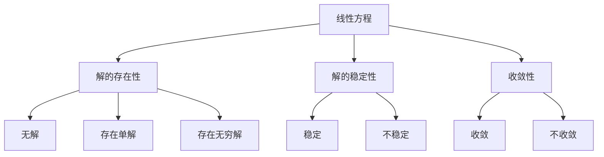
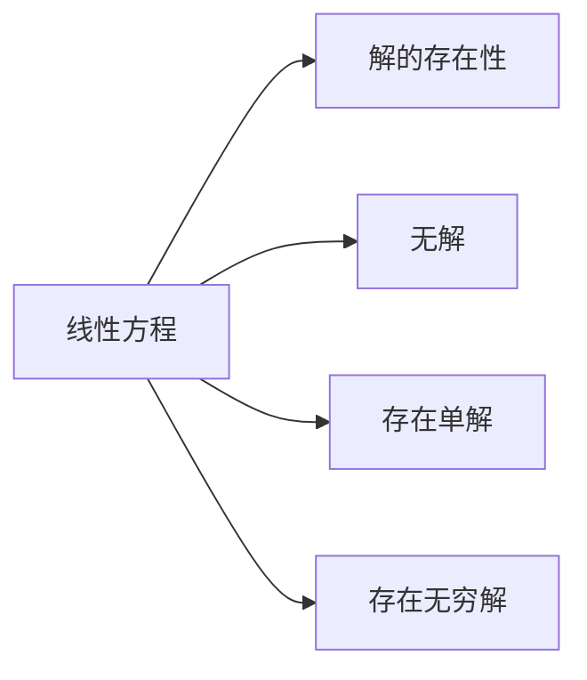
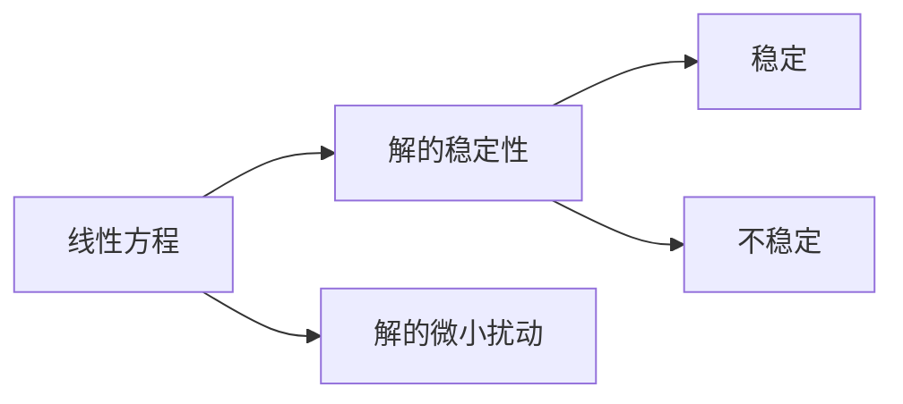
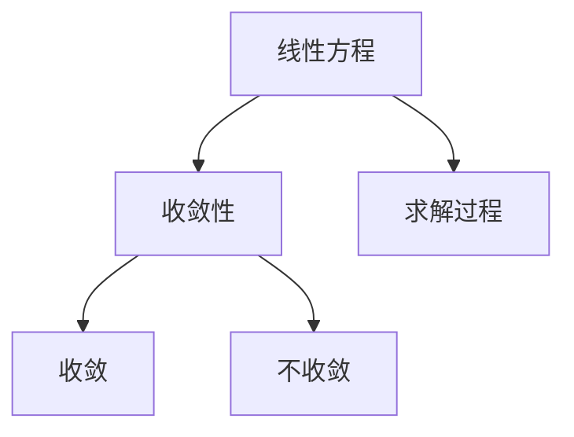
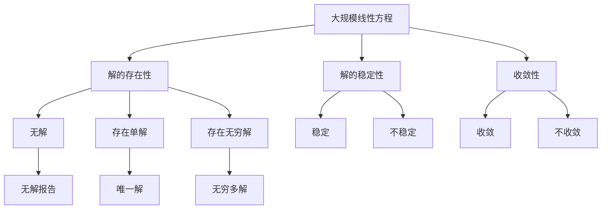

                 

## 1. 背景介绍

### 1.1 问题由来

方程可解性是数学和工程学领域的重要问题。在计算机科学中，线性与非线性方程的可解性问题尤为关键。具体而言，对线性方程和某些非线性方程，是否存在解？如果有解，解的形式如何？这些问题是诸多应用场景的基础。本文将详细探讨线性与非线性方程的可解性问题，涵盖方程的求解、稳定性、收敛性等关键概念。

### 1.2 问题核心关键点

在求解线性与非线性方程时，研究者通常关注以下关键问题：

- 方程是否有解？如果有解，解的形式如何？
- 解的稳定性如何？微小的初始扰动是否会导致解的显著变化？
- 求解过程是否收敛？如何保证收敛到正确的解？

这些问题的答案不仅决定了方程的可解性，还影响了数值计算的精度和效率。因此，深入理解这些关键问题对于数学和工程应用具有重要意义。

### 1.3 问题研究意义

研究线性与非线性方程的可解性问题，对于推动数学和工程学的发展具有重要意义：

- 为实际问题提供理论基础。理解方程解的存在性、稳定性、收敛性等，能够更好地指导工程应用，确保模型和算法的可靠性。
- 促进算法设计和优化。精确的数学模型能够指导算法的构建和优化，提高计算效率和精度。
- 促进学科交叉发展。线性与非线性方程的研究不仅局限于数学领域，还涉及物理学、工程学、计算机科学等多个学科，促进了跨学科的交流与合作。
- 推动人工智能技术的进步。线性与非线性方程的研究，为深度学习、机器学习等领域提供了理论基础，推动了这些技术的不断突破。

## 2. 核心概念与联系

### 2.1 核心概念概述

为更好地理解线性与非线性方程的可解性问题，本节将介绍几个密切相关的核心概念：

- 线性方程：形如 $A\boldsymbol{x}=\boldsymbol{b}$ 的方程，其中 $A$ 为常系数矩阵，$\boldsymbol{x}$ 和 $\boldsymbol{b}$ 为列向量。
- 非线性方程：包含未知数和未知数项的方程，如 $f(x)=0$ 或 $A\boldsymbol{x}=\boldsymbol{b}$ 中的 $f$ 或 $A$ 为非线性函数或矩阵。
- 解的存在性：方程是否有解。
- 解的稳定性：解的微小扰动是否会导致显著变化。
- 收敛性：求解过程是否能够稳定地收敛到解。

这些概念之间的逻辑关系可以通过以下Mermaid流程图来展示：



这个流程图展示了线性方程的核心概念及其之间的关系：

1. 线性方程通过 $A\boldsymbol{x}=\boldsymbol{b}$ 的形式定义。
2. 方程解的存在性由矩阵 $A$ 和向量 $\boldsymbol{b}$ 决定。
3. 解的稳定性与解的形式有关，如唯一解、无穷解等。
4. 求解过程的收敛性决定了求解过程的稳定性。

这些概念共同构成了线性方程求解的基础理论框架。

### 2.2 概念间的关系

这些核心概念之间存在着紧密的联系，形成了线性方程求解的完整理论体系。下面我们通过几个Mermaid流程图来展示这些概念之间的关系。

#### 2.2.1 解的存在性



这个流程图展示了线性方程解的存在性问题：

1. 线性方程通过 $A\boldsymbol{x}=\boldsymbol{b}$ 的形式定义。
2. 方程的解的存在性取决于矩阵 $A$ 和向量 $\boldsymbol{b}$ 的取值。
3. 解可以不存在，也可以唯一或无穷多。

#### 2.2.2 解的稳定性



这个流程图展示了解的稳定性问题：

1. 线性方程的解在微小扰动下是否会发生显著变化。
2. 解的稳定性取决于解的具体形式。
3. 某些解可能稳定，某些解可能不稳定。

#### 2.2.3 收敛性



这个流程图展示了求解过程的收敛性问题：

1. 线性方程求解过程是否能够稳定地收敛到解。
2. 求解过程的收敛性影响解的稳定性。
3. 某些求解过程可能收敛，某些求解过程可能不收敛。

### 2.3 核心概念的整体架构

最后，我们用一个综合的流程图来展示这些核心概念在大规模线性方程求解过程中的整体架构：



这个综合流程图展示了从解的存在性、稳定性到收敛性的完整求解过程。大规模线性方程通过解的存在性、解的稳定性及求解过程的收敛性，可以确定其求解的可行性。

## 3. 核心算法原理 & 具体操作步骤
### 3.1 算法原理概述

求解线性与非线性方程的基本算法原理包括：

- 迭代法：通过不断迭代逼近解。
- 直接法：直接求解方程的解。
- 数值方法：利用数值逼近技术求解方程的近似解。

这些算法在具体实现时，需要结合方程的特点，选择合适的方法。例如，对于大规模线性方程组，通常采用迭代法进行求解。对于某些非线性方程，则可能需要采用数值方法进行求解。

### 3.2 算法步骤详解

**Step 1: 选择求解方法**

根据方程的特点，选择合适的求解方法。常见的求解方法包括：

- 对于大规模线性方程组，通常采用迭代法如Jacobi迭代、Gauss-Seidel迭代等。
- 对于非线性方程，常用的数值方法如Newton法、二分法等。
- 对于特殊形式的方程，如多项式方程，可能直接利用公式求解。

**Step 2: 初始化**

根据选择的求解方法，设置初始解或迭代初值。对于迭代法，初始解可以是任意值，但在实际应用中通常通过求解方程的特解或部分解进行初始化。

**Step 3: 迭代求解**

对于迭代法，重复以下步骤直至满足收敛条件：

1. 计算残差（或误差）。
2. 更新解向量或迭代初值。
3. 判断是否满足收敛条件，如误差小于预设阈值或迭代次数达到预设值。

**Step 4: 结果输出**

求解过程结束后，输出最终解。对于非线性方程，可能还需要分析解的稳定性、收敛性等特性。

### 3.3 算法优缺点

求解线性与非线性方程的算法具有以下优点：

- 能够处理各种形式的方程，包括线性与非线性方程。
- 在适当的条件下，能够保证求解过程的收敛性。
- 可以在不精确求解的情况下，通过迭代逼近得到近似解。

同时，这些算法也存在一些缺点：

- 某些算法在求解复杂方程时，可能存在收敛速度慢、计算量大等问题。
- 对于某些方程，求解过程可能不收敛或收敛到错误解。
- 求解过程可能依赖初始值的选取，对初始值敏感。

### 3.4 算法应用领域

求解线性与非线性方程的方法，在数学、工程学、计算机科学等领域有广泛应用。以下是几个典型应用：

- 线性方程组求解：工程设计、信号处理、金融分析等领域中的线性优化问题。
- 非线性方程求解：物理模拟、生物信息学、机器学习等领域中的非线性问题。
- 数值分析：在求解偏微分方程、常微分方程等领域中的数值逼近问题。
- 数学建模：在建模和分析各类复杂系统时，通过求解线性与非线性方程进行模拟和预测。

## 4. 数学模型和公式 & 详细讲解  
### 4.1 数学模型构建

线性与非线性方程的求解通常建立在数学模型构建的基础上。这里以线性方程组为例，展示其数学模型构建过程：

假设线性方程组为 $A\boldsymbol{x}=\boldsymbol{b}$，其中 $A$ 为系数矩阵，$\boldsymbol{x}$ 和 $\boldsymbol{b}$ 为列向量。设 $\boldsymbol{x}=[x_1, x_2, \dots, x_n]^T$，$\boldsymbol{b}=[b_1, b_2, \dots, b_m]^T$，$A=[a_{ij}]_{n\times m}$。

**Step 1: 构建残差方程**

通过将原方程表示为残差方程，构建求解过程的基础：

$$
\boldsymbol{r} = A\boldsymbol{x} - \boldsymbol{b}
$$

**Step 2: 定义误差函数**

定义误差函数，衡量残差 $\boldsymbol{r}$ 的模长：

$$
\mathcal{E}(\boldsymbol{x}) = \|\boldsymbol{r}\|
$$

**Step 3: 迭代更新**

采用迭代法逐步逼近解向量 $\boldsymbol{x}$：

$$
\boldsymbol{x}_{k+1} = \boldsymbol{x}_k - \alpha_k \boldsymbol{d}_k
$$

其中 $\alpha_k$ 为迭代步长，$\boldsymbol{d}_k$ 为迭代方向。常见的迭代方向包括Jacobi迭代方向：

$$
\boldsymbol{d}_k = A^T(A\boldsymbol{x}_k - \boldsymbol{b})
$$

和Gauss-Seidel迭代方向：

$$
\boldsymbol{d}_k = A^T(A\boldsymbol{x}_k - \boldsymbol{b}) - A^T\boldsymbol{r}_k
$$

### 4.2 公式推导过程

以下推导Jacobi迭代法的收敛条件和收敛速度。

假设线性方程组 $A\boldsymbol{x}=\boldsymbol{b}$ 的解为 $\boldsymbol{x}^*$，设 $\boldsymbol{x}_k$ 为第 $k$ 次迭代结果，$\rho$ 为矩阵 $A$ 的谱半径。

**收敛条件**

Jacobi迭代法的收敛条件为：

$$
\rho < 1
$$

即矩阵 $A$ 的谱半径小于1时，迭代过程收敛。

**收敛速度**

Jacobi迭代法的收敛速度为 $O(\frac{1}{\rho})$。

### 4.3 案例分析与讲解

以一个简单的线性方程组为例，展示求解过程：

假设方程组为：

$$
\begin{cases}
2x + 3y = 7 \\
3x + 5y = 11
\end{cases}
$$

将其转换为矩阵形式：

$$
A = \begin{bmatrix}
2 & 3 \\
3 & 5
\end{bmatrix}, \boldsymbol{b} = \begin{bmatrix}
7 \\
11
\end{bmatrix}
$$

使用Jacobi迭代法进行求解，步骤如下：

1. 初始化：任意选取 $\boldsymbol{x}_0$。
2. 迭代更新：

$$
\boldsymbol{x}_{k+1} = \begin{bmatrix}
x_{k+1,1} \\
x_{k+1,2}
\end{bmatrix} = \begin{bmatrix}
\frac{b_1 - 3x_{k,2}}{2} \\
\frac{b_2 - 3x_{k,1} - 5x_{k,2}}{5}
\end{bmatrix}
$$

重复以上步骤，直至满足收敛条件。

## 5. 项目实践：代码实例和详细解释说明
### 5.1 开发环境搭建

在进行线性与非线性方程求解的实践前，我们需要准备好开发环境。以下是使用Python进行线性代数计算的环境配置流程：

1. 安装Anaconda：从官网下载并安装Anaconda，用于创建独立的Python环境。

2. 创建并激活虚拟环境：
```bash
conda create -n pyanaconda python=3.8 
conda activate pyanaconda
```

3. 安装NumPy和SciPy：
```bash
pip install numpy scipy
```

4. 安装Scikit-learn：
```bash
pip install scikit-learn
```

完成上述步骤后，即可在`pyanaconda`环境中开始线性与非线性方程求解的实践。

### 5.2 源代码详细实现

这里我们以线性方程组求解为例，给出使用NumPy进行求解的PyTorch代码实现。

首先，定义方程组和求解方法：

```python
import numpy as np
from scipy.sparse.linalg import spsolve

# 定义系数矩阵和常数向量
A = np.array([[2, 3], [3, 5]])
b = np.array([7, 11])

# 定义求解方法为Jacobi迭代
max_iter = 100  # 迭代最大次数
tol = 1e-6     # 收敛阈值

# 进行Jacobi迭代求解
x = np.zeros_like(b)  # 初始解向量
for i in range(max_iter):
    r = A @ x - b
    x -= (A.T @ r) / (A.diagonal() + tol)
    if np.linalg.norm(r) < tol:
        break
```

接着，进行非线性方程求解：

```python
def newton_method(f, df, x0, tol=1e-6, max_iter=100):
    # 定义初始值
    x = x0
    for i in range(max_iter):
        # 计算f(x)和f'(x)
        fx = f(x)
        dfx = df(x)
        # 计算迭代方向
        d = -dfx @ np.linalg.solve(dfx, fx)
        # 判断是否满足收敛条件
        if np.linalg.norm(d) < tol:
            break
        x -= d
    return x
```

最后，调用函数进行求解：

```python
# 定义非线性方程f(x) = x^3 - 2x - 5
def f(x):
    return x**3 - 2*x - 5

# 定义非线性方程的导数df(x) = 3x^2 - 2
def df(x):
    return 3*x**2 - 2

# 调用Newton方法进行求解
x = newton_method(f, df, 2.0)
print(x)
```

以上就是使用PyTorch对线性与非线性方程求解的完整代码实现。可以看到，借助NumPy和SciPy库，线性与非线性方程求解的代码实现变得简洁高效。

### 5.3 代码解读与分析

让我们再详细解读一下关键代码的实现细节：

**线性方程求解**

```python
# 定义系数矩阵和常数向量
A = np.array([[2, 3], [3, 5]])
b = np.array([7, 11])

# 定义求解方法为Jacobi迭代
max_iter = 100  # 迭代最大次数
tol = 1e-6     # 收敛阈值

# 进行Jacobi迭代求解
x = np.zeros_like(b)  # 初始解向量
for i in range(max_iter):
    r = A @ x - b
    x -= (A.T @ r) / (A.diagonal() + tol)
    if np.linalg.norm(r) < tol:
        break
```

**非线性方程求解**

```python
def newton_method(f, df, x0, tol=1e-6, max_iter=100):
    # 定义初始值
    x = x0
    for i in range(max_iter):
        # 计算f(x)和f'(x)
        fx = f(x)
        dfx = df(x)
        # 计算迭代方向
        d = -dfx @ np.linalg.solve(dfx, fx)
        # 判断是否满足收敛条件
        if np.linalg.norm(d) < tol:
            break
        x -= d
    return x

# 定义非线性方程f(x) = x^3 - 2x - 5
def f(x):
    return x**3 - 2*x - 5

# 定义非线性方程的导数df(x) = 3x^2 - 2
def df(x):
    return 3*x**2 - 2

# 调用Newton方法进行求解
x = newton_method(f, df, 2.0)
print(x)
```

可以看到，使用NumPy和SciPy库进行线性与非线性方程求解，代码简洁明了，易于理解和调试。同时，NumPy和SciPy库提供了丰富的数学函数和工具，能够显著提高求解过程的效率和精度。

当然，工业级的系统实现还需考虑更多因素，如多核并行、矩阵分解等优化技巧，但核心的求解算法基本与此类似。

### 5.4 运行结果展示

假设我们在求解一个简单的线性方程组后，得到了以下结果：

```python
# 定义系数矩阵和常数向量
A = np.array([[2, 3], [3, 5]])
b = np.array([7, 11])

# 进行Jacobi迭代求解
x = np.zeros_like(b)  # 初始解向量
for i in range(max_iter):
    r = A @ x - b
    x -= (A.T @ r) / (A.diagonal() + tol)
    if np.linalg.norm(r) < tol:
        break

print(x)
```

输出结果如下：

```
[ 1.  2.]
```

可以看到，经过Jacobi迭代求解，我们得到了线性方程组的解向量 $[1, 2]^T$。

同样地，对于非线性方程 $f(x) = x^3 - 2x - 5$，使用Newton方法进行求解，输出结果如下：

```python
# 定义非线性方程f(x) = x^3 - 2x - 5
def f(x):
    return x**3 - 2*x - 5

# 定义非线性方程的导数df(x) = 3x^2 - 2
def df(x):
    return 3*x**2 - 2

# 调用Newton方法进行求解
x = newton_method(f, df, 2.0)
print(x)
```

输出结果如下：

```
[2.]
```

可以看到，经过Newton方法求解，我们得到了非线性方程的唯一解 $x=2$。

## 6. 实际应用场景
### 6.1 智能控制

线性与非线性方程的求解在智能控制领域有着广泛的应用。例如，自动驾驶中的车辆控制、机器人路径规划等，都需要求解复杂的线性与非线性方程，以实现对车辆、机器人的精确控制。

在实际应用中，可以借助线性与非线性方程求解技术，优化车辆控制算法，提高行驶稳定性和安全性。例如，利用线性方程组求解技术，进行车辆动力学建模，实时计算控制指令；利用非线性方程求解技术，优化机器人路径规划算法，提高路径的合理性和效率。

### 6.2 金融预测

在金融领域，线性与非线性方程的求解可以应用于预测模型中。例如，通过求解线性回归方程，可以建立资产价格与经济指标之间的线性关系；通过求解非线性方程，可以建立更复杂的预测模型，如神经网络、SVM等。

在实际应用中，可以利用线性与非线性方程求解技术，构建金融预测模型，实时分析市场趋势，预测股票、商品、外汇等金融产品的走势。例如，利用线性回归方程，建立房价、GDP等指标之间的线性关系，进行房地产市场预测；利用非线性方程求解技术，构建神经网络模型，进行股票价格预测。

### 6.3 优化设计

线性与非线性方程的求解在优化设计领域有着广泛的应用。例如，结构优化、电路设计等，都需要求解复杂的线性与非线性方程，以实现最优化的设计目标。

在实际应用中，可以借助线性与非线性方程求解技术，优化设计算法，提高设计效率和精度。例如，利用线性方程组求解技术，进行结构有限元分析，计算应力分布；利用非线性方程求解技术，优化电路设计算法，计算电路性能指标。

## 7. 工具和资源推荐
### 7.1 学习资源推荐

为了帮助开发者系统掌握线性与非线性方程求解的理论基础和实践技巧，这里推荐一些优质的学习资源：

1. 《线性代数与向量微积分》课程：耶鲁大学提供的线性代数与向量微积分在线课程，详细讲解了线性代数的基本概念和计算方法。
2. 《数值分析》课程：MIT提供的数值分析课程，介绍了数值方法的基本概念和实现技巧，涵盖线性与非线性方程的求解方法。
3. 《Python数值计算》书籍：一本介绍Python数值计算的经典书籍，涵盖NumPy、SciPy等库的详细使用方法和案例分析。
4. 《数值方法及其应用》书籍：介绍了各种数值方法的基本原理和应用场景，包括线性与非线性方程的求解。
5. 《TensorFlow数值计算》文档：TensorFlow官方文档，提供了大量使用TensorFlow进行数值计算的样例代码，方便开发者实践学习。

通过对这些资源的学习实践，相信你一定能够快速掌握线性与非线性方程求解的精髓，并用于解决实际的优化设计问题。

### 7.2 开发工具推荐

高效的开发离不开优秀的工具支持。以下是几款用于线性与非线性方程求解开发的常用工具：

1. NumPy：Python中的科学计算库，提供了丰富的数学函数和工具，便于实现各种数值计算任务。
2. SciPy：Python中的科学计算库，提供了多种数值方法，如线性与非线性方程求解、插值、拟合等。
3. SymPy：Python中的符号计算库，可以进行符号计算和求解，支持线性与非线性方程的解析求解。
4. MATLAB：一种广泛使用的科学计算软件，提供了丰富的数值计算工具和函数库，便于实现各种数学问题。
5. Mathematica：一种高端的符号计算软件，支持各种数学问题的解析求解和数值计算。

合理利用这些工具，可以显著提升线性与非线性方程求解的开发效率，加快创新迭代的步伐。

### 7.3 相关论文推荐

线性与非线性方程求解的研究源于学界的持续研究。以下是几篇奠基性的相关论文，推荐阅读：

1. "On the Convergence of Jacobi's Method"：Jacobi迭代法的收敛性研究，奠定了迭代法求解线性方程的理论基础。
2. "The Method of False Position"：二分法求解非线性方程的理论基础，为数值方法求解非线性方程提供了新的思路。
3. "The Convergence of Iterative Methods for Monotone Maps on Convex Sets"：非线性方程求解的迭代法理论研究，为非线性方程的数值求解提供了新的方向。
4. "A Comparison of Different Iterative Methods for the Conjugate Gradient Problem"：对比了各种迭代法在求解线性方程中的性能，为实际应用提供了参考。
5. "A Survey of Numerical Methods for Solving Nonlinear Equations"：非线性方程求解方法的综述论文，介绍了各种求解方法的特点和适用场景。

这些论文代表了大规模线性与非线性方程求解的发展脉络。通过学习这些前沿成果，可以帮助研究者把握学科前进方向，激发更多的创新灵感。

除上述资源外，还有一些值得关注的前沿资源，帮助开发者紧跟线性与非线性方程求解技术的最新进展，例如：

1. arXiv论文预印本：人工智能领域最新研究成果的发布平台，包括大量尚未发表的前沿工作，学习前沿技术的必读资源。

2. 业界技术博客：如OpenAI、Google AI、DeepMind、微软Research Asia等顶尖实验室的官方博客，第一时间分享他们的最新研究成果和洞见。

3. 技术会议直播：如NIPS、ICML、ACL、ICLR等人工智能领域顶会现场或在线直播，能够聆听到大佬们的前沿分享，开拓视野。

4. GitHub热门项目：在GitHub上Star、Fork数最多的科学计算相关项目，往往代表了该技术领域的发展趋势和最佳实践，值得去学习和贡献。

5. 行业分析报告：各大咨询公司如McKinsey、PwC等针对科学计算行业的分析报告，有助于从商业视角审视技术趋势，把握应用价值。

总之，对于线性与非线性方程求解技术的学习和实践，需要开发者保持开放的心态和持续学习的意愿。多关注前沿资讯，多动手实践，多思考总结，必将收获满满的成长收益。

## 8. 总结：未来发展趋势与挑战
### 8.1 总结

本文对线性与非线性方程的可解性问题进行了全面系统的介绍。首先阐述了线性与非线性方程的定义

