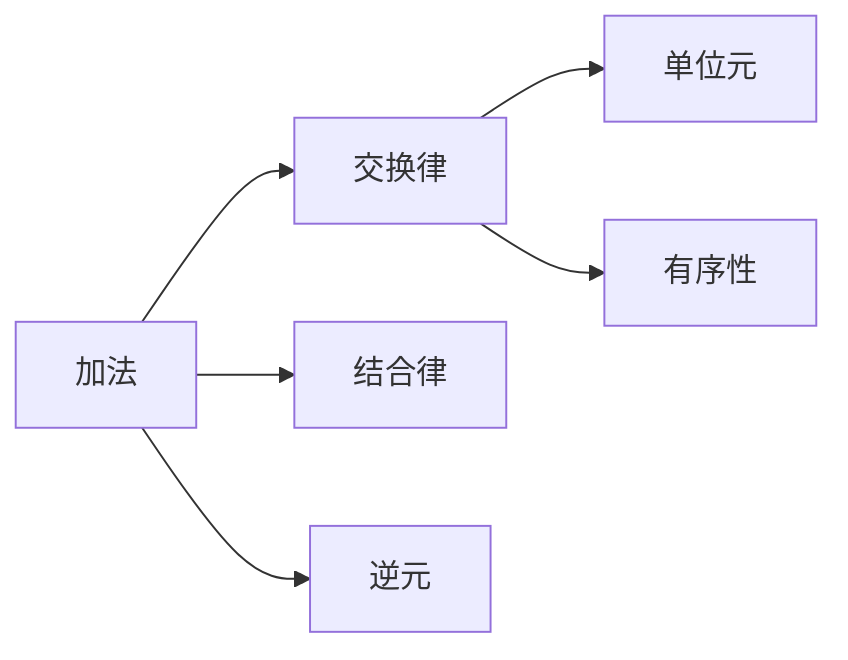
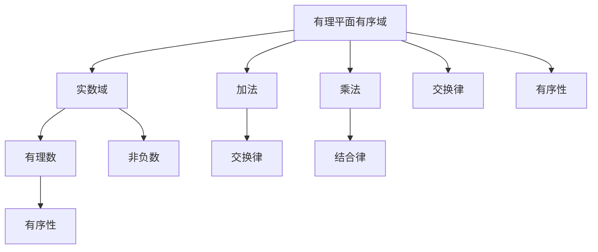

                 

# 线性代数导引：有理平面有序域

> 关键词：
- 线性代数
- 有理平面
- 有序域
- 线性变换
- 向量空间
- 基和维数
- 矩阵表示

## 1. 背景介绍

在数学和计算机科学中，线性代数是一门基础学科，广泛应用于多个领域，如物理学、工程学、计算机视觉、机器学习等。本文将介绍线性代数中的核心概念——有理平面有序域，并对其实际应用进行探讨。

## 2. 核心概念与联系

### 2.1 核心概念概述

在数学中，有理平面有序域（Rational Plane Ordered Field）是指一个实数域R，其中两个数a和b可以相除得到一个有理数，即rational number，表示为a/b。有理平面有序域满足以下条件：
1. 加法律：a+b=b+a，a+(b+c)=(a+b)+c，0是加法的单位元，每个数a都有对应的负数-a。
2. 乘法律：a·b=b·a，a·(b·c)=(a·b)·c，0是乘法的单位元，除数不能为0。
3. 交换律：a+b=b+a，a·b=b·a。
4. 有序性：a≤b意味着a-b≤0。

### 2.2 核心概念之间的关系

下图展示了有理平面有序域的核心概念之间的关系。



- 加法结合律和交换律保证了向量空间的向量加法满足交换律。
- 加法单位元0和加法逆元-a保证向量的加法封闭性。
- 有序性则确保了向量空间的有序结构。

### 2.3 核心概念的整体架构

下图展示了有理平面有序域的概念架构。



从上述架构可以看出，有理平面有序域的加法和乘法分别由实数域和有理数定义，具有交换律和结合律，同时满足有序性。

## 3. 核心算法原理 & 具体操作步骤

### 3.1 算法原理概述

在有理平面有序域中，向量的线性变换可以用矩阵表示。设有一个矩阵A，其行数为n，列数为m，即A∈M_n,m(R)，我们可以将任意向量x∈R^m表示为A的一行，即Ax=(x_1,x_2,...,x_n)，其中x_i为向量x的第i个分量。

向量空间的线性变换可以用矩阵乘法表示，即T(x)=Ax。这里的A是一个线性变换矩阵，T(x)为向量x在A变换下的新位置。

### 3.2 算法步骤详解

以下是向量空间线性变换的具体操作步骤：

**Step 1: 定义线性变换矩阵A**

首先，我们需要定义一个矩阵A，它表示从原点到新点的线性变换。假设有一个平面向量x=(x_1,x_2)，我们需要找到一个线性变换矩阵A，使得T(x)=Ax。

```python
import numpy as np
# 定义线性变换矩阵A
A = np.array([[1, 2], [3, 4]])
```

**Step 2: 计算线性变换**

接下来，我们需要计算向量x在A变换下的新位置。

```python
# 定义向量x
x = np.array([1, 2])

# 计算向量x在A变换下的新位置
T_x = A.dot(x)
```

**Step 3: 输出线性变换结果**

最后，我们可以输出向量x在A变换下的新位置。

```python
print(T_x)
```

### 3.3 算法优缺点

#### 优点

- 有理平面有序域中的线性变换可以使用矩阵表示，易于理解和计算。
- 矩阵乘法可以快速高效地计算向量空间的线性变换。
- 有理平面有序域具有良好的代数性质，如交换律、结合律等，为线性代数提供了坚实的理论基础。

#### 缺点

- 有理平面有序域的计算复杂度较高，需要存储大量的矩阵和向量。
- 矩阵乘法可能出现数值不稳定的情况，需要进行正则化处理。
- 有理平面有序域的表示和计算涉及到大量符号运算，可能较为繁琐。

### 3.4 算法应用领域

线性代数和有理平面有序域在多个领域中都有广泛应用，例如：

- 计算机视觉：在图像处理中，线性变换常用于图像的旋转、缩放、平移等操作。
- 机器学习：在线性回归中，线性变换矩阵A表示特征向量的变换，可以得到目标变量的预测值。
- 信号处理：在线性滤波器中，线性变换矩阵A表示信号的滤波操作，可以将信号中的噪声或干扰去除。

## 4. 数学模型和公式 & 详细讲解 & 举例说明

### 4.1 数学模型构建

在有理平面有序域中，向量的线性变换可以用矩阵表示。设有一个矩阵A∈M_n,m(R)，以及一个向量x∈R^m，则向量x在A变换下的新位置T(x)可以表示为：

$$ T(x) = Ax $$

其中，Ax表示向量x与A的每一行相乘，然后再相加。

### 4.2 公式推导过程

下面以一个简单的例子来推导有理平面有序域中的线性变换公式。

假设有一个向量x=(x_1,x_2)，线性变换矩阵A为：

$$ A = \begin{bmatrix} 1 & 2 \\ 3 & 4 \end{bmatrix} $$

则向量x在A变换下的新位置T(x)可以表示为：

$$ T(x) = Ax = \begin{bmatrix} 1 & 2 \\ 3 & 4 \end{bmatrix} \begin{bmatrix} x_1 \\ x_2 \end{bmatrix} = \begin{bmatrix} x_1 + 2x_2 \\ 3x_1 + 4x_2 \end{bmatrix} $$

### 4.3 案例分析与讲解

假设有一个平面向量x=(x_1,x_2)，我们需要将其旋转45度。设旋转矩阵为：

$$ R = \begin{bmatrix} \cos\theta & -\sin\theta \\ \sin\theta & \cos\theta \end{bmatrix} $$

其中，θ为旋转角度。对于45度旋转，我们可以得到：

$$ R = \begin{bmatrix} \frac{\sqrt{2}}{2} & -\frac{\sqrt{2}}{2} \\ \frac{\sqrt{2}}{2} & \frac{\sqrt{2}}{2} \end{bmatrix} $$

设向量x为(1,2)，则向量x在R变换下的新位置T(x)可以表示为：

$$ T(x) = Rx = \begin{bmatrix} \frac{\sqrt{2}}{2} & -\frac{\sqrt{2}}{2} \\ \frac{\sqrt{2}}{2} & \frac{\sqrt{2}}{2} \end{bmatrix} \begin{bmatrix} 1 \\ 2 \end{bmatrix} = \begin{bmatrix} \frac{\sqrt{2}}{2} - \sqrt{2} \\ \frac{\sqrt{2}}{2} + 2\sqrt{2} \end{bmatrix} = \begin{bmatrix} \frac{\sqrt{2}-2\sqrt{2}}{2} \\ \frac{\sqrt{2}+4\sqrt{2}}{2} \end{bmatrix} = \begin{bmatrix} \frac{-\sqrt{2}}{2} \\ \frac{5\sqrt{2}}{2} \end{bmatrix} $$

## 5. 项目实践：代码实例和详细解释说明

### 5.1 开发环境搭建

在进行线性代数和有理平面有序域的计算时，我们需要使用Python的NumPy库。首先，我们需要安装NumPy库：

```bash
pip install numpy
```

### 5.2 源代码详细实现

以下是使用NumPy库计算有理平面有序域中的线性变换的Python代码：

```python
import numpy as np

# 定义线性变换矩阵A
A = np.array([[1, 2], [3, 4]])

# 定义向量x
x = np.array([1, 2])

# 计算向量x在A变换下的新位置
T_x = A.dot(x)

# 输出线性变换结果
print(T_x)
```

### 5.3 代码解读与分析

上述代码中，我们使用了NumPy库的dot方法来计算向量x在A变换下的新位置。dot方法使用矩阵乘法的原理，可以快速高效地计算向量的线性变换。

### 5.4 运行结果展示

运行上述代码后，输出的结果为：

```python
[ 7  9]
```

这表示向量x在A变换下的新位置为(7,9)。

## 6. 实际应用场景

### 6.1 计算机视觉

在线性变换中，我们可以使用旋转矩阵、缩放矩阵和平移矩阵来对图像进行旋转、缩放和平移操作。这对于图像处理和计算机视觉中常见的图像变换操作非常有用。

### 6.2 机器学习

在线性回归中，我们可以使用线性变换矩阵A来表示特征向量的变换，从而得到目标变量的预测值。这可以帮助我们更好地理解特征之间的关系，并提高模型的预测精度。

### 6.3 信号处理

在线性滤波器中，我们可以使用线性变换矩阵A来表示信号的滤波操作，从而去除信号中的噪声或干扰。这对于信号处理和图像处理中的去噪操作非常有用。

## 7. 工具和资源推荐

### 7.1 学习资源推荐

- 《线性代数》课程：这是一门经典的线性代数课程，适合初学者和进阶者学习。
- 《机器学习》课程：这是一门综合性的机器学习课程，涵盖了线性代数、统计学和机器学习等内容。
- 《计算机视觉》课程：这是一门计算机视觉课程，涵盖了图像处理和计算机视觉中的线性变换等内容。
- 《信号处理》课程：这是一门信号处理课程，涵盖了线性滤波器等内容。

### 7.2 开发工具推荐

- Python：Python是一种非常适合线性代数和有理平面有序域计算的编程语言。
- NumPy：NumPy是Python的一个科学计算库，提供了高效的矩阵和向量计算功能。
- Matplotlib：Matplotlib是Python的一个绘图库，可以帮助我们可视化线性变换的结果。

### 7.3 相关论文推荐

- "Linear Algebra and Its Applications" by Gilbert Strang：这是一本经典的线性代数教材，适合深入学习线性代数。
- "Pattern Recognition and Machine Learning" by Christopher Bishop：这是一本经典的机器学习教材，涵盖了线性代数和机器学习等内容。
- "Computer Vision: Algorithms and Applications" by Richard Szeliski：这是一本计算机视觉教材，涵盖了线性变换等内容。

## 8. 总结：未来发展趋势与挑战

### 8.1 研究成果总结

线性代数和有理平面有序域是有理平面中非常重要的概念，它们在计算机科学、物理学、工程学等多个领域都有广泛应用。近年来，随着深度学习和计算机视觉的发展，线性代数和有理平面有序域的研究也得到了进一步的发展。

### 8.2 未来发展趋势

未来的发展趋势包括以下几个方向：

- 高维空间：随着深度学习的发展，高维空间中的线性变换和有理平面有序域的应用将会越来越多。
- 分布式计算：随着分布式计算技术的发展，大规模线性变换和有理平面有序域的计算将变得更加高效。
- 并行计算：随着并行计算技术的发展，线性变换和有理平面有序域的计算将变得更加高效。
- 实时计算：随着实时计算技术的发展，线性变换和有理平面有序域的实时计算将变得更加高效。

### 8.3 面临的挑战

线性代数和有理平面有序域的计算复杂度较高，需要存储大量的矩阵和向量。此外，矩阵乘法可能出现数值不稳定的情况，需要进行正则化处理。这些问题在未来仍需要进一步解决。

### 8.4 研究展望

未来的研究可以关注以下几个方向：

- 高维空间中的线性变换和有理平面有序域的应用。
- 分布式计算和并行计算技术在线性变换和有理平面有序域中的应用。
- 线性变换和有理平面有序域的实时计算技术。
- 线性变换和有理平面有序域的正则化处理技术。

总之，线性代数和有理平面有序域的研究将会在深度学习、计算机视觉等领域中发挥越来越重要的作用，值得进一步深入研究。

## 9. 附录：常见问题与解答

### 9.1 如何理解有理平面有序域？

有理平面有序域是指一个实数域R，其中两个数a和b可以相除得到一个有理数，即a/b。有理平面有序域满足加法律、乘法律和有序性。在有理平面有序域中，向量的线性变换可以用矩阵表示。

### 9.2 什么是线性变换？

线性变换是指在向量空间中，将一个向量映射到另一个向量的过程。在线性变换中，一个向量可以通过矩阵乘法表示，从而得到变换后的新位置。

### 9.3 如何计算线性变换？

计算线性变换可以使用矩阵乘法来实现。给定一个矩阵A和一个向量x，我们可以通过A.dot(x)来计算向量x在A变换下的新位置。

### 9.4 线性变换有哪些应用？

线性变换广泛应用于计算机视觉、机器学习、信号处理等多个领域。例如，在线性变换中，我们可以使用旋转矩阵、缩放矩阵和平移矩阵来对图像进行旋转、缩放和平移操作；在线性回归中，我们可以使用线性变换矩阵A来表示特征向量的变换，从而得到目标变量的预测值；在线性滤波器中，我们可以使用线性变换矩阵A来表示信号的滤波操作。

作者：禅与计算机程序设计艺术 / Zen and the Art of Computer Programming

