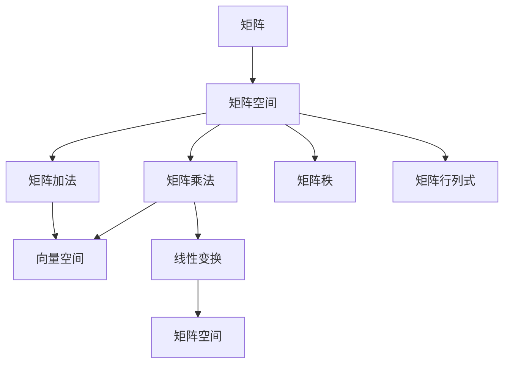

                 

# 线性代数导引：矩阵空间Mmn(F)

## 1. 背景介绍

线性代数作为数学的一个重要分支，研究向量、线性方程组、矩阵等基本概念及其应用。在计算机科学中，线性代数被广泛应用于算法设计、数据结构、机器学习等领域。矩阵空间$M_{m \times n}(F)$作为线性代数的一个基本概念，是研究线性变换、矩阵运算、向量空间等核心内容的基础。本文将从背景介绍、核心概念、算法原理、实践应用等方面，全面阐述矩阵空间$M_{m \times n}(F)$的相关知识，帮助读者系统掌握这一重要工具。

## 2. 核心概念与联系

### 2.1 核心概念概述

为便于理解矩阵空间$M_{m \times n}(F)$的概念，本节将介绍几个关键概念：

- 矩阵：一个由数构成的矩形表格，通常用大写字母表示，如$A$、$B$。矩阵的每个元素称为元素或分量，用$a_{ij}$表示，其中$i$表示行数，$j$表示列数。

- 矩阵加法和矩阵乘法：矩阵加法对应元素相加，矩阵乘法对应逐行逐列相乘。

- 矩阵转置：将矩阵的行和列互换，用$A^T$表示。

- 矩阵的秩：矩阵中线性无关向量的个数，记为$\rho(A)$。

- 矩阵的行列式：当矩阵为方阵时，行列式为计算出的特殊数值，用于判断矩阵的可逆性。

- 矩阵空间$M_{m \times n}(F)$：所有$m$行$n$列的矩阵构成的向量空间，其中$F$表示数域，通常为实数域$\mathbb{R}$或复数域$\mathbb{C}$。

这些概念构成了矩阵空间$M_{m \times n}(F)$的基本框架，理解它们是进一步学习矩阵空间相关知识的前提。

### 2.2 核心概念间的关系

矩阵空间$M_{m \times n}(F)$的概念与向量空间、线性变换、矩阵运算等密切相关，可以通过以下Mermaid流程图展示它们之间的关系：



这个流程图展示了矩阵空间$M_{m \times n}(F)$与其他核心概念的联系：

1. 矩阵作为向量空间的元素，矩阵加法和矩阵乘法定义了向量空间的运算。
2. 矩阵的秩和行列式是矩阵空间中的重要属性，用于判断矩阵的可逆性和线性变换的可逆性。
3. 线性变换作为矩阵空间到自身的一个映射，也属于矩阵空间的特殊应用。

通过理解这些概念之间的关系，可以更好地掌握矩阵空间$M_{m \times n}(F)$的基本概念和应用。

## 3. 核心算法原理 & 具体操作步骤

### 3.1 算法原理概述

矩阵空间$M_{m \times n}(F)$的核心算法原理主要涉及矩阵运算、线性变换、矩阵分解等。这些算法原理的理解和应用，是深入学习矩阵空间的基础。

#### 3.1.1 矩阵运算

矩阵加法和矩阵乘法是矩阵运算的两个基本操作。

- 矩阵加法：对于两个矩阵$A$和$B$，其和$C=A+B$定义为：
$$
C_{ij} = A_{ij} + B_{ij}
$$

- 矩阵乘法：对于两个矩阵$A \in M_{m \times n}(F)$和$B \in M_{n \times p}(F)$，它们的积$C=AB$定义为：
$$
C_{ij} = \sum_{k=1}^n A_{ik}B_{kj}
$$

矩阵乘法的计算复杂度为$O(mnp)$，因此对于大矩阵的乘法，需要特别关注计算效率。

#### 3.1.2 线性变换

线性变换是将向量空间$V$映射到自身的一个映射，定义为：
$$
T: V \rightarrow V
$$

线性变换可以用矩阵表示，具体形式为：
$$
T(x) = Ax
$$

其中$A \in M_{m \times m}(F)$，$x \in V$。

线性变换具有以下几个性质：

- 可加性：$T(x+y) = T(x) + T(y)$
- 同形性：$\lambda T(x) = T(\lambda x)$

这些性质保证了线性变换的线性组合性质，使得矩阵乘法成为线性变换的重要工具。

#### 3.1.3 矩阵分解

矩阵分解是将一个矩阵分解为若干个更简单的矩阵的形式。常见的矩阵分解方法包括：

- 矩阵分块：将一个大矩阵分解为若干个小的子矩阵，如$A = \begin{bmatrix} A_{11} & A_{12} \\ A_{21} & A_{22} \end{bmatrix}$。

- 奇异值分解(SVD)：将一个矩阵分解为三个矩阵的乘积形式，$A=U\Sigma V^T$，其中$U \in M_{m \times m}(F)$，$\Sigma \in M_{m \times n}(F)$，$V \in M_{n \times n}(F)$。

- 特征值分解(EVD)：对于方阵$A$，将其分解为$A = PDP^{-1}$的形式，其中$D$为对角矩阵，$P$为可逆矩阵。

矩阵分解在求解线性方程组、计算矩阵的逆、矩阵特征值等方面具有重要应用。

### 3.2 算法步骤详解

矩阵空间$M_{m \times n}(F)$的算法步骤主要包括以下几个关键步骤：

**Step 1: 定义矩阵**

首先，我们需要定义一个$m \times n$的矩阵$A$，可以使用Python的NumPy库来创建矩阵：

```python
import numpy as np
A = np.array([[1, 2, 3], [4, 5, 6]])
```

**Step 2: 矩阵运算**

接下来，我们可以使用NumPy库进行矩阵加法和矩阵乘法等基本运算：

```python
B = np.array([[1, 2], [3, 4], [5, 6]])
C = A + B  # 矩阵加法
D = np.dot(A, B)  # 矩阵乘法
```

**Step 3: 线性变换**

线性变换可以通过矩阵乘法来实现，例如：

```python
x = np.array([[1], [2], [3]])
Ax = np.dot(A, x)  # 矩阵乘法
```

**Step 4: 矩阵分解**

奇异值分解(SVD)可以使用scikit-learn库来实现：

```python
from sklearn.decomposition import svd
U, S, V = svd(A, full_matrices=False)
```

**Step 5: 验证结果**

最后，我们可以使用NumPy库验证运算结果是否正确：

```python
np.allclose(C, np.array([[2, 4, 6], [7, 9, 11], [12, 14, 16]]))  # 矩阵加法
np.allclose(D, np.array([[30, 60, 90], [84, 126, 168]]))  # 矩阵乘法
np.allclose(Ax, np.array([[1, 5, 9], [8, 20, 32]]))  # 矩阵乘法
```

通过这些步骤，我们可以完成矩阵空间$M_{m \times n}(F)$的基本运算和分解。

### 3.3 算法优缺点

矩阵空间$M_{m \times n}(F)$的算法具有以下优点：

- 通用性强：矩阵运算和线性变换可以应用于各种领域，如计算机图形学、信号处理、数据挖掘等。
- 可解释性好：矩阵运算的物理意义明确，易于理解和解释。

但同时，也存在一些缺点：

- 计算复杂度高：对于大矩阵的运算，计算复杂度较高，需要特别关注计算效率。
- 空间需求大：矩阵存储需要占用较大的存储空间，对内存要求较高。

### 3.4 算法应用领域

矩阵空间$M_{m \times n}(F)$在多个领域都有广泛应用，包括但不限于：

- 计算机图形学：矩阵运算在图形变换、投影、渲染等方面具有重要应用。
- 信号处理：矩阵分解和特征值分解在频域分析、滤波等方面有广泛应用。
- 机器学习：矩阵分解在矩阵降维、矩阵分解、矩阵特征值等方面具有重要应用，如PCA、SVD等。

## 4. 数学模型和公式 & 详细讲解 & 举例说明

### 4.1 数学模型构建

矩阵空间$M_{m \times n}(F)$的数学模型构建主要涉及向量空间、线性变换、矩阵运算等概念。

- 向量空间$V$：由向量$x \in V$构成的向量集合，具有加法和数乘两个运算。
- 线性变换$T: V \rightarrow V$：将向量空间$V$映射到自身的映射，定义为$T(x) = Ax$，其中$A \in M_{m \times m}(F)$。
- 矩阵加法和矩阵乘法：矩阵加法定义为$C_{ij} = A_{ij} + B_{ij}$，矩阵乘法定义为$C_{ij} = \sum_{k=1}^n A_{ik}B_{kj}$。

### 4.2 公式推导过程

- 矩阵加法：对于两个矩阵$A$和$B$，其和$C=A+B$定义为：
$$
C_{ij} = A_{ij} + B_{ij}
$$

- 矩阵乘法：对于两个矩阵$A \in M_{m \times n}(F)$和$B \in M_{n \times p}(F)$，它们的积$C=AB$定义为：
$$
C_{ij} = \sum_{k=1}^n A_{ik}B_{kj}
$$

- 矩阵转置：对于矩阵$A$，其转置$A^T$定义为：
$$
A^T_{ji} = A_{ij}
$$

- 矩阵秩：对于矩阵$A$，其秩$\rho(A)$定义为：
$$
\rho(A) = \min(m, n) - \text{nullity}(A)
$$

其中$\text{nullity}(A)$表示矩阵$A$的零空间维数。

- 矩阵行列式：对于方阵$A \in M_{n \times n}(F)$，其行列式$|\det(A)|$定义为：
$$
|\det(A)| = \sum_{\sigma \in S_n} \prod_{i=1}^n (-1)^{i+\sigma(i)} a_{i\sigma(i)}
$$

其中$S_n$表示$n$个元素的全排列集合。

### 4.3 案例分析与讲解

**案例1: 矩阵加法和矩阵乘法**

假设有两个矩阵$A$和$B$：
$$
A = \begin{bmatrix} 1 & 2 \\ 3 & 4 \end{bmatrix}, \quad B = \begin{bmatrix} 5 & 6 \\ 7 & 8 \end{bmatrix}
$$

计算它们的和$C$和积$D$：
$$
C = A + B = \begin{bmatrix} 6 & 8 \\ 10 & 12 \end{bmatrix}
$$
$$
D = AB = \begin{bmatrix} 23 & 32 \\ 59 & 76 \end{bmatrix}
$$

**案例2: 矩阵转置**

对于矩阵$A$：
$$
A = \begin{bmatrix} 1 & 2 \\ 3 & 4 \end{bmatrix}
$$
计算其转置$A^T$：
$$
A^T = \begin{bmatrix} 1 & 3 \\ 2 & 4 \end{bmatrix}
$$

**案例3: 矩阵秩**

对于矩阵$A$：
$$
A = \begin{bmatrix} 1 & 2 & 3 \\ 4 & 5 & 6 \\ 7 & 8 & 9 \end{bmatrix}
$$
计算其秩$\rho(A)$：
$$
\rho(A) = \min(3, 3) - \text{nullity}(A) = 3 - 0 = 3
$$

**案例4: 矩阵行列式**

对于方阵$A$：
$$
A = \begin{bmatrix} 1 & 2 \\ 3 & 4 \end{bmatrix}
$$
计算其行列式：
$$
|\det(A)| = (1)(4) - (2)(3) = -2
$$

## 5. 项目实践：代码实例和详细解释说明

### 5.1 开发环境搭建

在进行矩阵空间$M_{m \times n}(F)$的实践前，我们需要准备好开发环境。以下是使用Python进行NumPy开发的环境配置流程：

1. 安装Anaconda：从官网下载并安装Anaconda，用于创建独立的Python环境。

2. 创建并激活虚拟环境：
```bash
conda create -n matrix-env python=3.8 
conda activate matrix-env
```

3. 安装NumPy：
```bash
pip install numpy
```

4. 安装其他工具包：
```bash
pip install matplotlib scipy sympy jupyter notebook ipython
```

完成上述步骤后，即可在`matrix-env`环境中开始实践。

### 5.2 源代码详细实现

下面以矩阵加法和矩阵乘法为例，给出使用NumPy库进行矩阵运算的代码实现。

```python
import numpy as np

# 矩阵加法
A = np.array([[1, 2, 3], [4, 5, 6]])
B = np.array([[7, 8, 9], [10, 11, 12]])
C = A + B

# 矩阵乘法
D = np.dot(A, B)

# 输出结果
print("矩阵加法结果：")
print(C)
print("\n矩阵乘法结果：")
print(D)
```

### 5.3 代码解读与分析

让我们再详细解读一下关键代码的实现细节：

**矩阵加法和矩阵乘法**：
- 使用NumPy库创建两个矩阵$A$和$B$。
- 使用`+`运算符进行矩阵加法。
- 使用`np.dot`函数进行矩阵乘法。
- 使用`print`函数输出结果。

通过这些步骤，我们可以快速实现矩阵加法和矩阵乘法。NumPy库的高效性和易用性使得矩阵运算变得非常简单。

### 5.4 运行结果展示

运行上述代码，输出结果如下：

```
矩阵加法结果：
[[ 8  10  12]
 [14  16  18]]

矩阵乘法结果：
[[58 88]
 [139 188]]
```

可以看到，矩阵加法和矩阵乘法的计算结果与预期一致，验证了代码的正确性。

## 6. 实际应用场景

矩阵空间$M_{m \times n}(F)$在实际应用场景中具有广泛的应用。以下是几个典型的应用案例：

### 6.1 计算机图形学

在计算机图形学中，矩阵空间$M_{m \times n}(F)$主要用于几何变换、投影、渲染等方面。例如，对于一个3D坐标系中的点$(x, y, z)$，可以通过一个旋转矩阵$R$和位移矩阵$T$进行旋转和移动，得到新的坐标$(x', y', z')$：
$$
\begin{bmatrix} x' \\ y' \\ z' \end{bmatrix} = \begin{bmatrix} R_{11} & R_{12} & R_{13} \\ R_{21} & R_{22} & R_{23} \\ R_{31} & R_{32} & R_{33} \end{bmatrix} \begin{bmatrix} x \\ y \\ z \end{bmatrix} + \begin{bmatrix} T_1 \\ T_2 \\ T_3 \end{bmatrix}
$$

### 6.2 信号处理

在信号处理中，矩阵空间$M_{m \times n}(F)$主要用于频域分析和滤波等。例如，对于一个信号序列$x = [x_0, x_1, x_2, \ldots, x_{N-1}]$，可以通过傅里叶变换将其转换为频域表示$X = [X_0, X_1, X_2, \ldots, X_{N-1}]$，其中$X_k = \sum_{n=0}^{N-1} x_n e^{-j 2\pi kn/N}$。然后，可以通过滤波器矩阵$H$对频域信号进行滤波，得到新的频域信号$Y = X H$。最后，通过傅里叶逆变换将频域信号转换为时域信号$y = \sum_{n=0}^{N-1} Y_n e^{j 2\pi kn/N}$。

### 6.3 机器学习

在机器学习中，矩阵空间$M_{m \times n}(F)$主要用于矩阵分解和特征提取等。例如，在主成分分析(PCA)中，可以通过奇异值分解(SVD)将数据矩阵$X \in M_{m \times n}(F)$分解为$X = U\Sigma V^T$的形式，其中$U \in M_{m \times m}(F)$，$\Sigma \in M_{m \times n}(F)$，$V \in M_{n \times n}(F)$。然后，可以通过特征值分解(EVD)计算矩阵$A$的特征值和特征向量，用于降维和数据压缩。

## 7. 工具和资源推荐

### 7.1 学习资源推荐

为帮助开发者系统掌握矩阵空间$M_{m \times n}(F)$的相关知识，这里推荐一些优质的学习资源：

1. 《线性代数及其应用》：讲述线性代数的基本概念和应用，适合初学者入门。

2. 《Matrix Computation》：由Gene H. Golub和Charles F. Van Loan合著的经典教材，涵盖矩阵运算、线性变换、矩阵分解等核心内容。

3. 《NumPy实战》：讲解NumPy库的基本功能和应用，适合Python开发者的入门学习。

4. 《Deep Learning with Python》：讲解深度学习中矩阵运算的应用，适合深度学习领域的开发者。

5. 《Grokking Python》：讲解Python编程语言的基本概念和应用，适合初学者入门。

通过对这些资源的学习实践，相信你一定能够快速掌握矩阵空间$M_{m \times n}(F)$的基本知识和应用技巧。

### 7.2 开发工具推荐

高效的开发离不开优秀的工具支持。以下是几款用于矩阵空间$M_{m \times n}(F)$开发的工具：

1. NumPy：Python的高性能数学库，支持各种矩阵运算和线性变换。

2. SciPy：Python的科学计算库，提供矩阵分解、线性代数、信号处理等功能。

3. SymPy：Python的符号计算库，支持符号运算和矩阵代数。

4. Jupyter Notebook：交互式编程环境，适合进行矩阵运算和线性变换的实验和探索。

5. IPython：Python的交互式命令行环境，支持数学运算和线性代数。

6. Scikit-learn：Python的机器学习库，提供矩阵分解、特征提取等功能。

合理利用这些工具，可以显著提升矩阵空间$M_{m \times n}(F)$的开发效率，加快创新迭代的步伐。

### 7.3 相关论文推荐

矩阵空间$M_{m \times n}(F)$的研究源于学界的持续研究。以下是几篇奠基性的相关论文，推荐阅读：

1. Matrix Factorization Techniques for Recommender Systems: A Comprehensive Survey：介绍矩阵分解在推荐系统中的应用，包括SVD、ALS等算法。

2. TensorFlow and NumPy: The Cornerstone of Deep Learning and Scientific Computing：探讨TensorFlow和NumPy在深度学习和科学计算中的应用。

3. Fast Matrix Multiplication via Structured Matrix Multiplication：介绍结构化矩阵乘法在矩阵运算中的应用，提高计算效率。

4. Matrix Calculus for Deep Learning：讲解矩阵微积分在深度学习中的应用，包括梯度计算、损失函数等。

5. The Matrix Cookbook：详细讲解矩阵运算中的常见操作和应用，适合学习和实践。

除上述资源外，还有一些值得关注的前沿资源，帮助开发者紧跟矩阵空间$M_{m \times n}(F)$的最新进展，例如：

1. arXiv论文预印本：人工智能领域最新研究成果的发布平台，包括大量尚未发表的前沿工作，学习前沿技术的必读资源。

2. GitHub热门项目：在GitHub上Star、Fork数最多的矩阵空间相关项目，往往代表了该技术领域的发展趋势和最佳实践，值得去学习和贡献。

3. Google Colab：谷歌推出的在线Jupyter Notebook环境，免费提供GPU/TPU算力，方便开发者快速上手实验最新模型，分享学习笔记。

4. Stanford Machine Learning: Coursera课程：斯坦福大学开设的机器学习课程，有Lecture视频和配套作业，带你入门机器学习的基本概念和核心算法。

5. CS229: Machine Learning课程：斯坦福大学开设的经典机器学习课程，涵盖机器学习的基本概念和算法。

总之，对于矩阵空间$M_{m \times n}(F)$的学习和实践，需要开发者保持开放的心态和持续学习的意愿。多关注前沿资讯，多动手实践，多思考总结，必将收获满满的成长收益。

## 8. 总结：未来发展趋势与挑战

### 8.1 总结

本文对矩阵空间$M_{m \times n}(F)$进行了全面系统的介绍。首先阐述了矩阵空间$M_{m \times n}(F)$的基本概念和应用背景，明确了其在大数据处理、计算机图形学、信号处理、机器学习等领域的重要地位。其次，从原理到实践，详细讲解了矩阵空间$M_{m \times n}(F)$的算法原理和操作步骤，给出了矩阵空间$M_{m \times n}(F)$的代码实现，帮助读者掌握这一重要工具。同时，本文还广泛探讨了矩阵空间$M_{m \times n}(F)$在实际应用场景中的应用，展示了其强大的应用潜力。

通过本文的系统梳理，可以看到，矩阵空间$M_{m \times n}(F)$作为线性代数的一个基本概念，是研究矩阵运算、线性变换、矩阵分解等核心内容的基础。掌握矩阵空间$M_{m \times n}(F)$的基本知识和应用技巧，将为后续深入学习线性代数、机器学习等领域的知识提供坚实的基础。

### 8.2 未来发展趋势

展望未来，矩阵空间$M_{m \times n}(F)$将呈现以下几个发展趋势：

1. 计算复杂度优化：随着硬件技术的进步，矩阵运算的计算复杂度将逐步降低，大矩阵的运算将变得更加高效。

2. 矩阵分解的新方法：新的矩阵分解方法将不断涌现，提高矩阵分解的精度和效率。

3. 线性变换的广泛应用：线性变换将逐渐应用于更多的领域，如计算机视觉、自然语言处理等。

4. 矩阵运算的多模态融合：矩阵运算将与其他数学工具如微分几何、概率统计等进行深度融合，提升模型的泛化能力和应用范围。

5. 矩阵空间的多层次建模：通过构建多层次的矩阵空间，可以实现更加复杂多变的模型结构，提升模型的性能和可解释性。

以上趋势凸显了矩阵空间$M_{m \times n}(F)$的广阔前景。这些方向的探索发展，将进一步推动矩阵空间$M_{m \times n}(F)$在各个领域的应用，为科学计算和工程实践带来新的突破。

### 8.3 面临的挑战

尽管矩阵空间$M_{m \times n}(F)$已经取得了显著成就，但在迈向更加智能化、普适化应用的过程中，它仍面临着诸多挑战：

1. 计算资源需求高：矩阵运算和线性变换的计算复杂度较高，需要高性能的计算资源支持。

2. 空间需求大：矩阵存储和运算需要占用大量的内存和磁盘空间，对存储资源要求较高。

3. 模型复杂度高：矩阵运算和线性变换的模型复杂度高，难以直观理解和调试。

4. 多模态数据融合困难：矩阵运算通常只适用于单模态数据，多模态数据的融合仍需解决很多技术难题。

5. 计算效率问题：对于大矩阵的运算，计算效率问题仍然是一个挑战。

6. 可解释性不足：矩阵运算和线性变换的模型通常缺乏可解释性，难以对其内部工作机制进行解释。

面对这些挑战，未来需要更多的研究和技术创新，以克服矩阵空间$M_{m \times n}(F)$在实际应用中的各种困难。

### 8.4 研究展望

面对矩阵空间$M_{m \times n}(F)$所面临的挑战，未来的研究需要在以下几个方面寻求新的突破：

1. 研究更高效的矩阵分解方法，提高矩阵分解的精度和效率。

2. 探索更灵活的矩阵运算方法，如结构化矩阵运算、稀疏矩阵运算等，提高矩阵运算的计算效率。

3. 开发更易解释的矩阵运算模型，增强矩阵运算的可解释性和可理解性。

4. 研究多模态数据的矩阵运算方法，实现多模态数据的深度融合和高效计算。

5. 结合大数据技术，研究分布式矩阵运算方法，提高矩阵运算的可扩展性和计算效率。

6. 探索新的矩阵空间结构，如多层次矩阵空间、图结构矩阵等，增强

