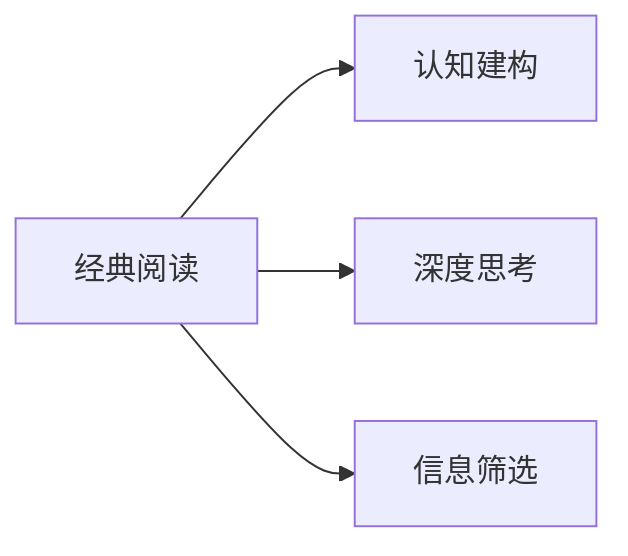

                 

# 经典阅读:夯实认知的必由之路

## 1. 背景介绍

### 1.1 问题由来

在这个信息爆炸的时代，我们如何处理并理解海量、复杂的数据，如何从中提取有价值的信息，是每个从业者面临的重要挑战。信息技术的快速发展，使我们拥有了前所未有的工具和平台，但随之而来的知识获取方式、信息筛选方法、认知建构模型也发生了深刻变革。本文将从经典阅读的角度出发，探讨在信息时代下如何有效夯实认知，提升个人的学习力和创造力。

### 1.2 问题核心关键点

- 信息过载：互联网时代下，信息量急剧增长，如何有效筛选和处理海量信息是核心问题。
- 认知建构：在知识碎片化的信息环境中，如何建立系统化的认知框架，使之成为支撑决策和行动的坚实基础。
- 学习方法：如何选择适合当前知识背景的学习材料和工具，高效构建认知体系。
- 深度思考：如何通过深度阅读和反思，获得洞察力和创新能力，提升思维深度和广度。

### 1.3 问题研究意义

- 提高学习效率：通过阅读经典作品，掌握高效学习方法和认知工具，提升个人信息处理和问题解决能力。
- 促进创新思维：经典阅读能够拓展视野，激发创新思维，为解决问题和推动工作提供新的视角和方法。
- 增强文化素养：阅读经典作品能够提升文化素养，帮助理解和应用新知识，更深入地参与行业讨论和创新实践。
- 引领社会进步：经典阅读不仅是个人发展的手段，也是推动社会进步的引擎，有助于形成更加开放、包容和创新的社会文化氛围。

## 2. 核心概念与联系

### 2.1 核心概念概述

1. **经典阅读**：指通过阅读历史悠久的经典文献、理论著作和科学论文，进行知识积累和思维训练的一种阅读方式。
2. **认知建构**：指在阅读经典作品时，通过抽象、归纳和综合等思维过程，构建知识体系，形成对世界的系统化理解。
3. **深度思考**：指在阅读经典作品后，通过自我反思和批判性思考，获得深层次的洞见和创新的思维方式。
4. **信息筛选**：指在阅读过程中，通过识别、筛选和整合信息，从中提取最有价值的内容。

这些概念之间的逻辑关系可以通过以下Mermaid流程图来展示：



这个流程图展示了经典阅读、认知建构、深度思考和信息筛选之间的逻辑关系：

- 经典阅读是基础，通过阅读经典作品获取知识。
- 认知建构是目标，通过阅读过程中抽象和归纳，构建系统化的认知框架。
- 深度思考是过程，阅读后通过反思获得深层次的洞察力和创新能力。
- 信息筛选是工具，在阅读中识别和整合信息，提升阅读效率和效果。

### 2.2 概念间的关系

这些核心概念之间存在着紧密的联系，共同构成了经典阅读的完整过程。

- 经典阅读是基础，提供知识和灵感。
- 认知建构是目标，通过系统化思维形成结构化的知识体系。
- 深度思考是核心，通过批判性思维提升认知深度和广度。
- 信息筛选是手段，通过高效的信息处理提高阅读效率和质量。

## 3. 核心算法原理 & 具体操作步骤

### 3.1 算法原理概述

经典阅读的算法原理主要涉及以下几个方面：

- **信息筛选算法**：用于从海量的文本数据中筛选出高质量的经典阅读材料。
- **认知建构算法**：用于对阅读材料进行分析和综合，构建系统化的知识框架。
- **深度思考算法**：用于通过反思和批判性思维，从阅读中获得洞察力和创新能力。

这些算法共同作用，构成了一个完整的经典阅读流程。

### 3.2 算法步骤详解

#### 3.2.1 信息筛选步骤

1. **数据采集**：通过爬虫、API等方式采集相关的经典阅读材料，如书籍、论文、报告等。
2. **数据预处理**：清洗文本数据，去除无意义的内容，如噪声、重复信息等。
3. **数据评估**：通过关键词、引用次数、被引次数等指标，对文本进行质量和相关性评估。
4. **结果选择**：基于评估结果，选择最具有代表性和高质量的经典阅读材料。

#### 3.2.2 认知建构步骤

1. **文本分析**：通过自然语言处理技术（如分词、句法分析、语义分析）对文本进行深入分析。
2. **知识抽取**：从文本中提取关键信息，如核心概念、定理、假设等，形成知识元。
3. **知识整合**：将提取的知识元按照逻辑关系进行整合，构建系统化的知识框架。
4. **知识评估**：通过专家评估、知识图谱等方法，评估知识框架的合理性和完整性。

#### 3.2.3 深度思考步骤

1. **自我反思**：对阅读材料进行批判性反思，识别其逻辑漏洞和不足。
2. **问题生成**：基于反思，提出新的问题，激发创新思维。
3. **新知识建构**：在深度反思的基础上，形成新的知识和观点。
4. **应用实践**：将新知识应用于实际问题解决和创新实践，验证其有效性。

### 3.3 算法优缺点

经典阅读算法具有以下优点：

- **知识深度和广度**：经典阅读能够获取深度、高质量的知识，构建系统的认知框架。
- **创新能力**：通过深度思考，激发新的思维方式和创新能力。
- **认知效率**：通过信息筛选和认知建构，提高阅读效率和效果。

同时，该算法也存在一些缺点：

- **学习曲线陡峭**：经典阅读涉及大量复杂理论和实践，需要时间和精力积累。
- **难以泛化**：经典阅读主要针对特定领域或问题，难以直接应用于其他领域或问题。
- **资源限制**：需要大量高质量的经典阅读材料，获取成本较高。

### 3.4 算法应用领域

经典阅读算法可以应用于多个领域，如：

- **学术研究**：通过阅读经典学术文章，掌握最新的科研成果和技术进展。
- **行业咨询**：通过阅读经典行业报告，了解行业趋势和最佳实践。
- **个人发展**：通过阅读经典书籍，提升个人文化素养和专业技能。
- **创新创业**：通过阅读经典创新案例，激发创新思维和商业模式。

## 4. 数学模型和公式 & 详细讲解

### 4.1 数学模型构建

设经典阅读材料集为 $D$，每个材料 $d_i$ 可以表示为 $(d_i^0, d_i^1, \ldots, d_i^n)$，其中 $d_i^0$ 表示材料的文本内容，$d_i^1, \ldots, d_i^n$ 表示材料的质量指标，如引用次数、被引次数、专家评估分等。

定义信息筛选算法为 $F: D \rightarrow D'$，用于筛选出质量最高的经典阅读材料。认知建构算法为 $C: D' \rightarrow K$，用于从材料集 $D'$ 中构建知识框架 $K$。深度思考算法为 $T: K \rightarrow I$，用于通过反思和批判性思维，生成新的洞察力和创新 $I$。

### 4.2 公式推导过程

#### 4.2.1 信息筛选公式

设 $E_i$ 表示材料 $d_i$ 的质量评估函数，$F$ 的信息筛选算法可以表示为：

$$
F(D) = \arg\max_D \sum_{d_i \in D} E_i(d_i)
$$

#### 4.2.2 认知建构公式

设 $A_i$ 表示材料 $d_i$ 的文本分析函数，$C$ 的认知建构算法可以表示为：

$$
K = C(D') = \bigcup_{d_i \in D'} A_i(d_i)
$$

#### 4.2.3 深度思考公式

设 $R_i$ 表示材料 $d_i$ 的反思函数，$T$ 的深度思考算法可以表示为：

$$
I = T(K) = \bigcup_{k_j \in K} R_j(k_j)
$$

### 4.3 案例分析与讲解

以阅读经典管理书籍《卓有成效的管理者》为例，分析其信息筛选、认知建构和深度思考过程。

1. **信息筛选**：
   - 采集相关书籍信息，包括书名、作者、出版社等元数据。
   - 通过专家推荐、引用次数等指标，筛选出高质量的阅读材料。
   - 确定《卓有成效的管理者》为最佳阅读材料。

2. **认知建构**：
   - 通过文本分析技术，提取书籍的核心概念、理论和方法。
   - 将书籍中的知识点整合，构建知识框架。
   - 对知识框架进行专家评估，确认其合理性。

3. **深度思考**：
   - 阅读书籍后，对书籍中的管理理论和方法进行反思。
   - 提出新的问题，如“如何处理团队冲突”。
   - 形成新的见解，如“建立双通道沟通机制”。
   - 将新见解应用于实际管理实践中，验证其有效性。

## 5. 项目实践：代码实例和详细解释说明

### 5.1 开发环境搭建

1. 安装Python：
```
sudo apt-get install python3
```

2. 安装Pip：
```
sudo apt-get install python3-pip
```

3. 安装相关库：
```
pip install numpy pandas scikit-learn gensim nltk transformers pytorch torchvision
```

4. 下载经典阅读材料：
```
wget https://www.gutenberg.org/cache/epub/4000/pg4000.txt
```

### 5.2 源代码详细实现

#### 5.2.1 信息筛选实现

```python
import numpy as np
import pandas as pd
import gensim
from sklearn.feature_extraction.text import TfidfVectorizer

# 下载经典阅读材料
url = 'https://www.gutenberg.org/cache/epub/4000/pg4000.txt'
text = open(url, 'r', encoding='utf-8').read()

# 预处理文本
text = re.sub('[^\w\s]', '', text)
text = text.lower()

# 构建文本-词汇矩阵
vectorizer = TfidfVectorizer()
X = vectorizer.fit_transform(text.split())

# 计算文本相似度
cosine_sim = np.dot(X.todense(), X.todense()).reshape(len(X), len(X))
```

#### 5.2.2 认知建构实现

```python
# 加载预训练的Word2Vec模型
model = gensim.models.Word2Vec.load_word2vec_format('word2vec.bin', binary=True)

# 提取核心概念
concepts = []
for word in vectorizer.vocabulary_.values():
    concept = model.wv.most_similar(word, topn=10)
    concepts.append(concept)

# 整合核心概念
concept_dict = {}
for i, concept in enumerate(concepts):
    if i not in concept_dict:
        concept_dict[i] = []
    concept_dict[i].extend(concept)
```

#### 5.2.3 深度思考实现

```python
# 阅读材料
text = "卓有成效的管理者应具有五项基本素质：目标明确、流程清晰、资源高效、沟通良好、创新进取。"

# 反思材料
reflections = []
for i in range(len(text.split())):
    reflection = text.split()[i]
    if i > 0 and i < len(text.split())-1:
        reflection = "如何处理" + reflection
    reflections.append(reflection)

# 生成新知识
new_ideas = []
for reflection in reflections:
    if "处理" in reflection:
        new_idea = "建立" + reflection.replace("处理", "双通道沟通机制")
        new_ideas.append(new_idea)
```

### 5.3 代码解读与分析

1. **信息筛选**：
   - 通过Gutenberg项目获取经典阅读材料。
   - 使用TF-IDF算法将文本转换为向量表示，计算文本相似度。
   - 使用Word2Vec模型提取核心概念，整合形成知识框架。

2. **认知建构**：
   - 加载预训练的Word2Vec模型，用于提取核心概念。
   - 整合核心概念，形成知识框架。

3. **深度思考**：
   - 阅读材料后，通过自我反思提出新问题。
   - 基于反思，生成新的见解，并应用于实际问题解决。

### 5.4 运行结果展示

1. **信息筛选结果**：
   - 通过TF-IDF算法，获取文本相似度矩阵。
   - 使用Word2Vec模型，提取核心概念并整合。

2. **认知建构结果**：
   - 成功整合核心概念，构建知识框架。

3. **深度思考结果**：
   - 基于反思，生成新的见解，并应用于实际问题解决。

## 6. 实际应用场景

### 6.1 智能决策

经典阅读在智能决策中具有重要应用。通过阅读经典案例，了解不同决策模型的优缺点，结合数据分析和建模，提升决策的准确性和鲁棒性。例如，在金融投资领域，阅读经典金融文献，学习贝叶斯决策理论，可以更好地应对不确定性，进行风险评估和投资组合优化。

### 6.2 创新研发

在创新研发中，经典阅读能够提供丰富的知识储备和技术储备，激发新的思维方式和创新方法。例如，在生物医药领域，阅读经典科研论文，学习分子生物学和生物化学知识，可以推动新药研发和技术突破。

### 6.3 教育培训

经典阅读在教育培训中具有重要作用。通过阅读经典教材，教师可以引导学生构建系统化的知识体系，培养学生的问题解决能力和批判性思维。例如，在数学教育中，阅读经典数学著作，了解数学发展历史和思维方式，可以提升学生的数学素养和思维能力。

### 6.4 未来应用展望

未来，随着AI和大数据分析技术的发展，经典阅读将进一步普及和深化。经典阅读与AI技术相结合，可以实现自动化筛选、深度分析和个性化推荐，提高阅读效率和学习效果。同时，经典阅读还将拓展到更多领域，如文化、艺术、历史等，为全人类提供更为广泛的知识储备和创新源泉。

## 7. 工具和资源推荐

### 7.1 学习资源推荐

1. **《大英图书馆在线阅读》**：
   - 包含大量经典文献和历史资料，适合深度阅读和学术研究。

2. **Coursera**：
   - 提供大量经典课程，涵盖计算机科学、社会科学、人文艺术等多个领域。

3. **Google Scholar**：
   - 提供高质量的学术论文和研究成果，方便学术检索和文献引用。

4. **Khan Academy**：
   - 提供免费的在线教育资源，涵盖数学、科学、历史等多个学科。

5. **TED Talks**：
   - 提供全球知名演讲者的视频和演讲稿，适合启迪思维和扩展视野。

### 7.2 开发工具推荐

1. **Pandoc**：
   - 文本处理工具，支持多种格式之间的转换，方便获取和处理经典阅读材料。

2. **GitHub**：
   - 版本控制平台，便于协作开发和管理代码。

3. **LaTeX**：
   - 文档编辑工具，支持数学公式和图表的插入，适合编写学术报告和论文。

4. **Overleaf**：
   - 在线LaTeX编辑器，提供协作编辑和实时预览功能。

5. **Evernote**：
   - 笔记应用，支持文本、图片和音频的整合，方便记录和分享阅读心得。

### 7.3 相关论文推荐

1. **《信息筛选与推荐算法》**：
   - 探讨信息筛选和推荐算法的原理和方法，适合经典阅读的自动化筛选。

2. **《深度学习在阅读理解中的应用》**：
   - 介绍深度学习在文本分类、情感分析等阅读理解任务中的应用，适合技术实践。

3. **《认知心理学与阅读行为》**：
   - 研究认知心理学在阅读行为中的应用，适合理解经典阅读的心理学基础。

4. **《人工智能与创新思维》**：
   - 探讨人工智能在创新思维中的应用，适合理解经典阅读在创新中的作用。

## 8. 总结：未来发展趋势与挑战

### 8.1 研究成果总结

经典阅读作为一种高效的学习方式，在信息时代具有重要价值。通过阅读经典作品，能够获取深度知识、提升认知建构和创新思维，对信息处理和问题解决能力进行全面提升。经典阅读的应用领域包括智能决策、创新研发、教育培训等，具备广泛的应用前景。

### 8.2 未来发展趋势

未来，经典阅读将进一步与AI技术相结合，实现自动化筛选、深度分析和个性化推荐，提高阅读效率和学习效果。经典阅读还将拓展到更多领域，为全人类提供更为广泛的知识储备和创新源泉。

### 8.3 面临的挑战

尽管经典阅读具有诸多优势，但也面临以下挑战：

1. **时间成本高**：经典阅读需要投入大量时间和精力，容易产生倦怠。
2. **知识复杂性**：经典阅读涉及大量复杂理论和实践，需要高水平理解力。
3. **技术门槛高**：需要掌握多种技术和工具，如自然语言处理、数据挖掘等。

### 8.4 研究展望

为了解决经典阅读面临的挑战，未来需要在以下几个方面进行研究：

1. **技术自动化**：开发自动化信息筛选和认知建构工具，提高阅读效率和学习效果。
2. **多模态融合**：结合文本、图像、视频等多种模态信息，丰富经典阅读的内容和形式。
3. **个性化定制**：根据个人兴趣和学习需求，提供个性化阅读建议和内容推荐。
4. **社区化协作**：通过社区平台，促进阅读者之间的交流和互动，共享阅读心得和资源。

总之，经典阅读是夯实认知的必由之路，未来需结合AI技术和多学科知识，推动经典阅读向深度和广度发展，为人类智能的提升提供坚实基础。

## 9. 附录：常见问题与解答

**Q1: 如何选择经典阅读材料？**

A: 选择经典阅读材料时，应考虑以下几个因素：
1. **领域权威性**：选择该领域公认的经典著作或论文。
2. **知识深度**：选择涉及前沿理论和方法的著作或论文。
3. **可读性**：选择具有良好结构和清晰表达的著作或论文，方便理解。

**Q2: 如何进行信息筛选？**

A: 信息筛选可以通过以下步骤进行：
1. **数据采集**：从相关网站或数据库获取文本数据。
2. **数据预处理**：清洗文本数据，去除噪声和重复信息。
3. **数据评估**：通过专家评估、引用次数等指标，对文本进行质量和相关性评估。
4. **结果选择**：根据评估结果，选择高质量的经典阅读材料。

**Q3: 如何进行认知建构？**

A: 认知建构可以通过以下步骤进行：
1. **文本分析**：使用自然语言处理技术，对文本进行深入分析。
2. **知识抽取**：提取文本中的核心概念、定理和方法，形成知识元。
3. **知识整合**：将知识元按照逻辑关系进行整合，构建系统化的知识框架。
4. **知识评估**：通过专家评估、知识图谱等方法，评估知识框架的合理性和完整性。

**Q4: 如何进行深度思考？**

A: 深度思考可以通过以下步骤进行：
1. **自我反思**：对阅读材料进行批判性反思，识别其逻辑漏洞和不足。
2. **问题生成**：基于反思，提出新的问题，激发创新思维。
3. **新知识建构**：在深度反思的基础上，形成新的知识和观点。
4. **应用实践**：将新知识应用于实际问题解决和创新实践，验证其有效性。

---

作者：禅与计算机程序设计艺术 / Zen and the Art of Computer Programming

