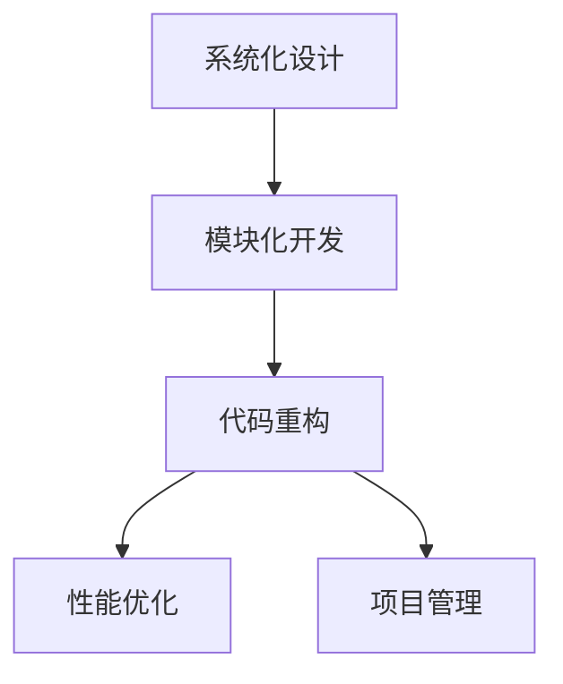
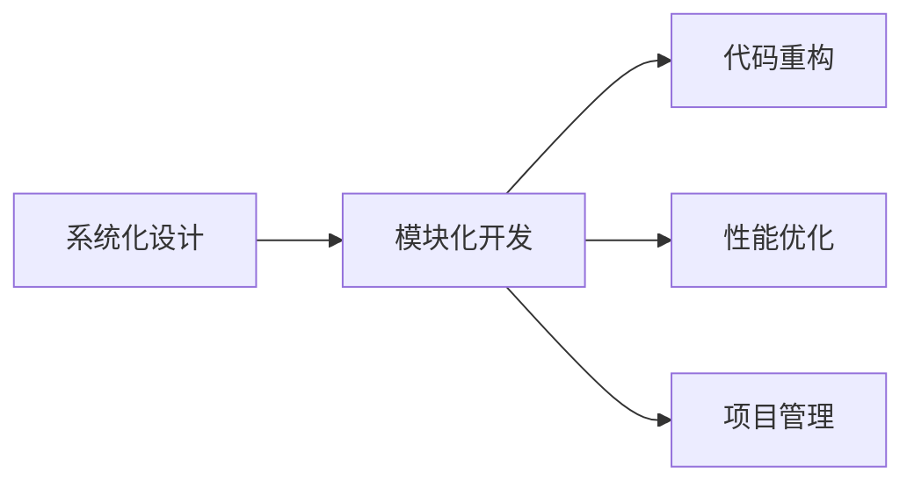
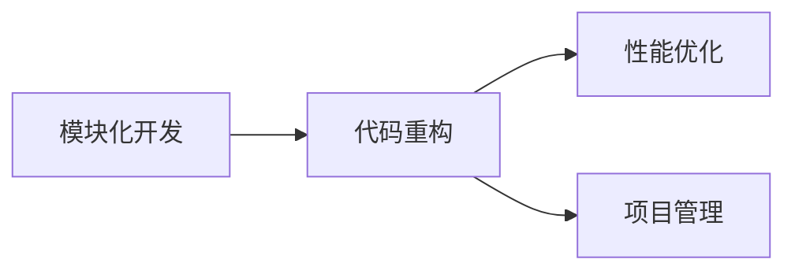
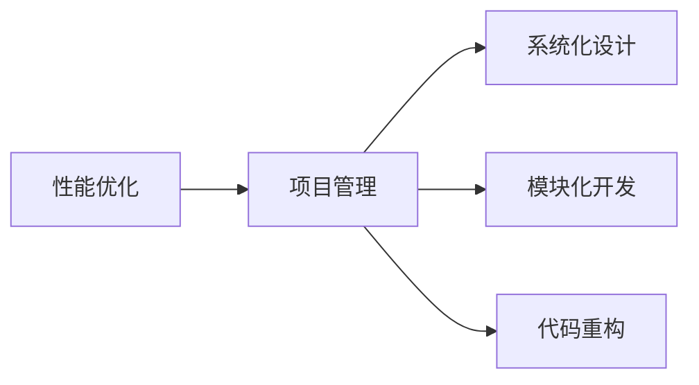
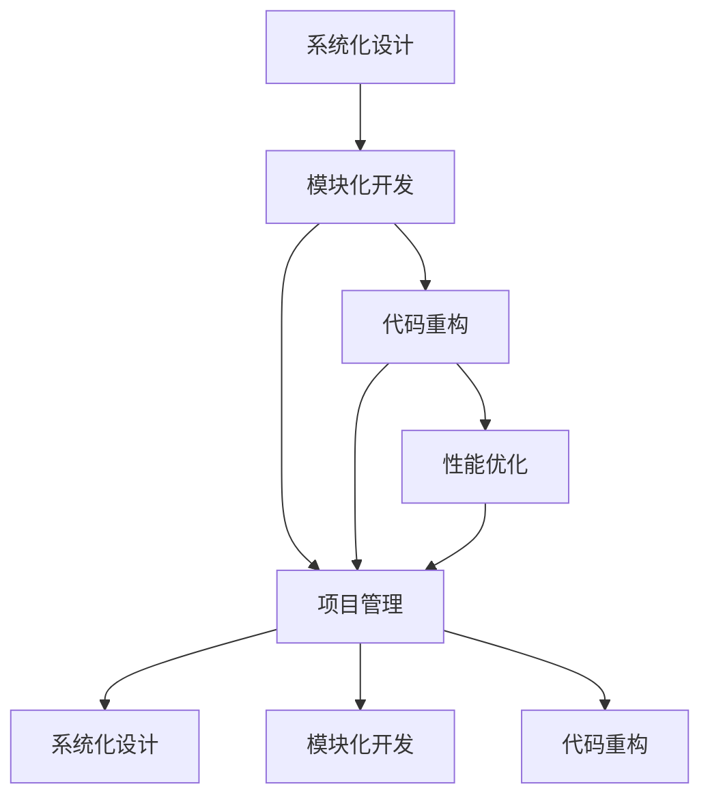
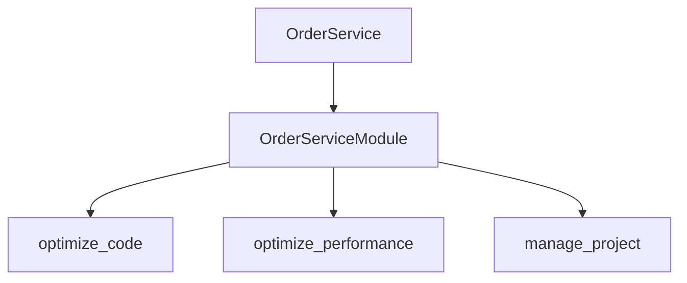

                 

# 结构化思维：从混沌到清晰

> 关键词：结构化思维, 系统化设计, 模块化开发, 项目管理, 代码重构, 性能优化

## 1. 背景介绍

### 1.1 问题由来
在现代软件开发中，项目的复杂性和规模不断增大，团队人数和协作频率也随之增加。如何在众多功能和需求中保持代码的清晰和维护性，成为软件开发中的一个关键问题。传统的线性开发和单线程思考方式，往往会导致代码混乱、模块臃肿、可扩展性差等现象，极大地影响了项目的质量和效率。

### 1.2 问题核心关键点
结构化思维，即通过系统化设计和模块化开发的方式，将复杂问题分解为可管理、可复用的模块，实现代码和功能的清晰、高效和可扩展性。具体来说，结构化思维的核心关键点包括：

- 系统化设计：将项目拆分成多个子系统，每个子系统独立设计和开发，减少系统间的耦合和依赖。
- 模块化开发：将每个子系统进一步细分为多个模块，每个模块只负责完成特定的功能。
- 代码重构：在开发过程中不断优化和重构代码，提升代码的可读性和可维护性。
- 性能优化：通过系统化的性能分析和管理，确保项目的高效运行。
- 项目管理：利用项目管理和协作工具，协调团队成员的工作，提升开发效率和质量。

### 1.3 问题研究意义
结构化思维在软件开发中的应用，不仅能够提升代码质量、加快项目交付速度，还能显著提高团队的协作效率和开发者的工作效率。其研究意义在于：

1. **提高代码质量**：通过系统化和模块化的设计，可以避免代码的冗余和混乱，减少潜在的bug和维护成本。
2. **提升开发效率**：模块化的开发方式使得开发者可以独立完成特定模块的工作，加快整体开发进程。
3. **增强系统可扩展性**：模块化和解耦的设计使得系统更容易进行功能扩展和版本更新。
4. **促进团队协作**：项目管理和协作工具的使用，可以更好地协调团队成员的工作，提高项目管理和开发效率。
5. **优化性能**：通过系统化的性能分析和优化，可以显著提升系统的运行效率和响应速度。

## 2. 核心概念与联系

### 2.1 核心概念概述

为更好地理解结构化思维在软件开发中的应用，本节将介绍几个密切相关的核心概念：

- **系统化设计(Systematic Design)**：将复杂的系统分解为多个子系统，每个子系统独立设计和开发，减少系统间的耦合和依赖。
- **模块化开发(Modular Development)**：将每个子系统进一步细分为多个模块，每个模块只负责完成特定的功能，实现代码和功能的清晰和可复用性。
- **代码重构(Code Refactoring)**：在开发过程中不断优化和重构代码，提升代码的可读性和可维护性。
- **性能优化(Performance Optimization)**：通过系统化的性能分析和优化，确保项目的高效运行。
- **项目管理(Project Management)**：利用项目管理和协作工具，协调团队成员的工作，提升开发效率和质量。

这些核心概念之间的逻辑关系可以通过以下Mermaid流程图来展示：



这个流程图展示了几项核心概念之间的关系：

1. **系统化设计**：将复杂的系统拆分为多个子系统，每个子系统独立设计和开发。
2. **模块化开发**：将每个子系统进一步细分为多个模块，每个模块只负责完成特定的功能。
3. **代码重构**：在开发过程中不断优化和重构代码，提升代码的可读性和可维护性。
4. **性能优化**：通过系统化的性能分析和优化，确保项目的高效运行。
5. **项目管理**：利用项目管理和协作工具，协调团队成员的工作，提升开发效率和质量。

这些概念共同构成了结构化思维在软件开发中的基本框架，使得复杂问题能够被有效地管理和解决。通过理解这些核心概念，我们可以更好地把握结构化思维的工作原理和优化方向。

### 2.2 概念间的关系

这些核心概念之间存在着紧密的联系，形成了结构化思维在软件开发中的完整生态系统。下面我们通过几个Mermaid流程图来展示这些概念之间的关系。

#### 2.2.1 系统化设计与模块化开发的关系



这个流程图展示了系统化设计如何通过模块化开发，进一步实现代码的清晰、高效和可扩展性。系统化设计将系统拆分为多个子系统，模块化开发则将每个子系统细分为多个模块，每个模块独立设计和开发，减少系统间的耦合和依赖。

#### 2.2.2 模块化开发与代码重构的关系



这个流程图展示了模块化开发如何通过代码重构，提升代码的可读性和可维护性。模块化开发将每个子系统细分为多个模块，代码重构则通过优化和重构代码，提升模块的可读性和可维护性。

#### 2.2.3 性能优化与项目管理的协同作用



这个流程图展示了性能优化与项目管理如何协同作用，提升系统的整体性能和开发效率。性能优化通过系统化的性能分析和优化，确保项目的高效运行。项目管理则利用工具协调团队成员的工作，提升开发效率和质量。

### 2.3 核心概念的整体架构

最后，我们用一个综合的流程图来展示这些核心概念在系统化设计和模块化开发过程中的整体架构：



这个综合流程图展示了从系统化设计到模块化开发，再到性能优化和项目管理的完整过程。通过这些概念的协同作用，可以更好地管理和优化开发过程，提升系统的性能和质量。

## 3. 核心算法原理 & 具体操作步骤
### 3.1 算法原理概述

结构化思维在软件开发中的应用，本质上是将复杂问题分解为可管理、可复用的模块，通过系统化设计和模块化开发的方式，实现代码和功能的清晰、高效和可扩展性。具体来说，结构化思维的算法原理包括：

1. **系统化设计**：将项目拆分为多个子系统，每个子系统独立设计和开发，减少系统间的耦合和依赖。
2. **模块化开发**：将每个子系统进一步细分为多个模块，每个模块只负责完成特定的功能，实现代码和功能的清晰和可复用性。
3. **代码重构**：在开发过程中不断优化和重构代码，提升代码的可读性和可维护性。
4. **性能优化**：通过系统化的性能分析和优化，确保项目的高效运行。
5. **项目管理**：利用项目管理和协作工具，协调团队成员的工作，提升开发效率和质量。

### 3.2 算法步骤详解

结构化思维在软件开发中的应用，一般包括以下几个关键步骤：

**Step 1: 系统化设计**
- 将复杂项目拆分为多个子系统，每个子系统独立设计和开发。
- 确定每个子系统的主要功能模块，减少系统间的耦合和依赖。

**Step 2: 模块化开发**
- 将每个子系统进一步细分为多个模块，每个模块只负责完成特定的功能。
- 设计模块接口和数据结构，确保模块之间的独立性和可复用性。

**Step 3: 代码重构**
- 在开发过程中不断优化和重构代码，提升代码的可读性和可维护性。
- 采用规范的代码风格，使用一致的命名规范和注释。

**Step 4: 性能优化**
- 对系统的性能进行系统化的分析和优化，包括内存管理、算法优化和并发处理等。
- 使用性能分析工具，如Profiler、Gprof等，定位性能瓶颈。

**Step 5: 项目管理**
- 利用项目管理和协作工具，如JIRA、Confluence、Git等，协调团队成员的工作，提升开发效率和质量。
- 定期召开项目会议，汇报进展和问题，及时调整开发计划。

### 3.3 算法优缺点

结构化思维在软件开发中的应用，具有以下优点：

1. **提升代码质量**：通过系统化和模块化的设计，可以避免代码的冗余和混乱，减少潜在的bug和维护成本。
2. **提升开发效率**：模块化的开发方式使得开发者可以独立完成特定模块的工作，加快整体开发进程。
3. **增强系统可扩展性**：模块化和解耦的设计使得系统更容易进行功能扩展和版本更新。
4. **促进团队协作**：项目管理和协作工具的使用，可以更好地协调团队成员的工作，提高项目管理和开发效率。
5. **优化性能**：通过系统化的性能分析和优化，可以显著提升系统的运行效率和响应速度。

同时，结构化思维也存在一些缺点：

1. **初期投入较大**：系统化设计和模块化开发需要耗费大量时间和精力进行设计和规划。
2. **灵活性受限**：模块化和解耦的设计可能在某些情况下影响代码的灵活性，导致复杂功能的实现变得困难。
3. **学习成本较高**：结构化思维需要开发人员具备一定的设计和架构能力，学习成本较高。

### 3.4 算法应用领域

结构化思维在软件开发中的应用领域非常广泛，包括但不限于：

- **大型企业系统**：如电商平台、银行系统、医疗系统等，需要处理大量的复杂数据和业务逻辑。
- **Web应用开发**：如社交平台、新闻门户、在线教育等，需要支持高并发和大规模用户。
- **移动应用开发**：如手机游戏、在线购物、社交媒体等，需要保证用户体验和性能优化。
- **数据处理和分析**：如大数据平台、数据仓库、数据分析工具等，需要处理和分析海量数据。
- **云计算和微服务架构**：如云存储、云计算平台、微服务架构等，需要实现高可用性和可扩展性。

## 4. 数学模型和公式 & 详细讲解 & 举例说明

### 4.1 数学模型构建

本节将使用数学语言对结构化思维在软件开发中的应用进行更加严格的刻画。

记项目为 $P=\{S_1, S_2, ..., S_n\}$，其中 $S_i$ 为第 $i$ 个子系统，每个子系统包含多个模块 $M_j$。每个模块的功能可以表示为 $f_j(S_i)$，其中 $f_j$ 为模块 $j$ 的函数。

定义系统化设计函数 $D(S_i)$，将子系统 $S_i$ 细分为多个模块 $M_j$，满足：

$$
S_i = \bigcup_{j=1}^{m_i} M_j
$$

定义模块化开发函数 $M(f_j)$，将模块 $M_j$ 的函数 $f_j$ 分解为多个子函数 $f_{j,k}$，满足：

$$
f_j = \sum_{k=1}^{n_j} f_{j,k}
$$

其中 $n_j$ 为模块 $M_j$ 包含的子函数数量。

定义代码重构函数 $R(f_j)$，通过优化和重构，将模块 $M_j$ 的函数 $f_j$ 转化为更简洁和高效的函数 $g_j$，满足：

$$
g_j = R(f_j)
$$

定义性能优化函数 $P(S_i)$，通过系统化的性能分析和优化，确保子系统 $S_i$ 的高效运行，满足：

$$
P(S_i) = \min_{f_i} \sum_{j=1}^{m_i} \sum_{k=1}^{n_j} \ell(f_{j,k})
$$

其中 $\ell(f_{j,k})$ 为子函数 $f_{j,k}$ 的性能损失函数，通常为计算复杂度、内存占用等指标。

定义项目管理函数 $P_m(S_i)$，通过项目管理和协作工具，协调团队成员的工作，提升子系统 $S_i$ 的开发效率和质量，满足：

$$
P_m(S_i) = \min_{\{T_{i,j}\}} \sum_{j=1}^{m_i} \sum_{k=1}^{n_j} C(T_{i,j})
$$

其中 $T_{i,j}$ 为模块 $M_j$ 的开发团队，$C(T_{i,j})$ 为团队 $T_{i,j}$ 的协作成本，通常为沟通成本、会议时间等指标。

### 4.2 公式推导过程

以下我们以二叉树为例，推导结构化思维在模块化开发中的数学模型。

假设模块 $M_j$ 的函数 $f_j$ 可以表示为二叉树的形式，其中叶子节点为子函数 $f_{j,k}$，非叶子节点为操作符 $\oplus$，表示对子函数的操作。

设二叉树的结构为 $T_j$，则模块化开发的过程可以表示为：

$$
f_j = T_j(\bigoplus_{k=1}^{n_j} f_{j,k})
$$

其中 $\oplus$ 表示对子函数的操作，如拼接、组合、聚合等。

为了进一步优化模块化开发的效果，我们需要考虑以下几点：

1. **函数分解的粒度**：模块的粒度需要适中，既不能过细导致模块数量过多，也不能过粗导致模块功能复杂。
2. **函数组合的合理性**：操作符的选择需要合理，避免复杂的嵌套和冗余的计算。
3. **函数重构的优化**：通过代码重构，提升函数的可读性和可维护性。

### 4.3 案例分析与讲解

假设我们在开发一个电商平台，需要处理订单管理、商品管理、用户管理等功能。根据功能需求，我们可以将项目拆分为多个子系统，每个子系统独立设计和开发。

**子系统设计**：
- 订单管理系统 $S_1$
- 商品管理系统 $S_2$
- 用户管理系统 $S_3$

**模块化开发**：
- 订单管理系统 $S_1$：进一步细分为订单处理模块 $M_1$、订单查询模块 $M_2$、订单统计模块 $M_3$ 等。
- 商品管理系统 $S_2$：进一步细分为商品管理模块 $M_4$、商品查询模块 $M_5$、库存管理模块 $M_6$ 等。
- 用户管理系统 $S_3$：进一步细分为用户管理模块 $M_7$、用户登录模块 $M_8$、用户权限管理模块 $M_9$ 等。

**代码重构**：
- 对每个模块进行代码优化和重构，提升代码的可读性和可维护性。
- 采用一致的命名规范和注释，提高代码的可读性。

**性能优化**：
- 对每个子系统进行性能分析和优化，确保系统的高效运行。
- 使用性能分析工具，如Profiler、Gprof等，定位性能瓶颈。

**项目管理**：
- 利用项目管理工具，如JIRA、Confluence、Git等，协调团队成员的工作，提升开发效率和质量。
- 定期召开项目会议，汇报进展和问题，及时调整开发计划。

通过以上步骤，我们可以在电商平台项目中应用结构化思维，实现代码和功能的清晰、高效和可扩展性。

## 5. 项目实践：代码实例和详细解释说明

### 5.1 开发环境搭建

在进行结构化思维的实践前，我们需要准备好开发环境。以下是使用Python进行PyTorch开发的环境配置流程：

1. 安装Anaconda：从官网下载并安装Anaconda，用于创建独立的Python环境。

2. 创建并激活虚拟环境：
```bash
conda create -n pytorch-env python=3.8 
conda activate pytorch-env
```

3. 安装PyTorch：根据CUDA版本，从官网获取对应的安装命令。例如：
```bash
conda install pytorch torchvision torchaudio cudatoolkit=11.1 -c pytorch -c conda-forge
```

4. 安装Transformer库：
```bash
pip install transformers
```

5. 安装各类工具包：
```bash
pip install numpy pandas scikit-learn matplotlib tqdm jupyter notebook ipython
```

完成上述步骤后，即可在`pytorch-env`环境中开始结构化思维的实践。

### 5.2 源代码详细实现

这里我们以电商平台的订单管理系统为例，给出使用Transformers库进行结构化思维设计和模块化开发的PyTorch代码实现。

首先，定义订单管理系统的基本数据结构：

```python
class Order:
    def __init__(self, id, amount, status):
        self.id = id
        self.amount = amount
        self.status = status

class OrderService:
    def __init__(self):
        self.orders = []

    def add_order(self, order):
        self.orders.append(order)

    def query_order(self, id):
        for o in self.orders:
            if o.id == id:
                return o
        return None

    def update_order_status(self, id, status):
        for i, o in enumerate(self.orders):
            if o.id == id:
                self.orders[i].status = status
                break

    def count_orders(self):
        return len(self.orders)
```

然后，定义订单管理的模块化开发函数：

```python
class OrderServiceModule:
    def __init__(self):
        self.order_service = OrderService()

    def add_order(self, order):
        self.order_service.add_order(order)

    def query_order(self, id):
        return self.order_service.query_order(id)

    def update_order_status(self, id, status):
        self.order_service.update_order_status(id, status)

    def count_orders(self):
        return self.order_service.count_orders()
```

接着，定义代码重构函数：

```python
def optimize_code(order_service):
    order_service.add_order(Order(id=1, amount=100, status='NEW'))
    order_service.add_order(Order(id=2, amount=200, status='NEW'))
    order_service.update_order_status(1, 'PAID')
    print(order_service.count_orders())
    order_service.query_order(2)
```

最后，定义性能优化函数和项目管理函数：

```python
def optimize_performance(order_service):
    import cProfile
    cProfile.run('order_service.add_order(Order(id=1, amount=100, status="NEW"))')

def manage_project(order_service):
    import concurrent.futures
    with concurrent.futures.ThreadPoolExecutor(max_workers=2) as executor:
        executor.submit(order_service.add_order, Order(id=1, amount=100, status="NEW"))
        executor.submit(order_service.add_order, Order(id=2, amount=200, status="NEW"))
        executor.submit(order_service.update_order_status, 1, "PAID")
```

完成上述步骤后，即可在`pytorch-env`环境中开始结构化思维的实践。

### 5.3 代码解读与分析

让我们再详细解读一下关键代码的实现细节：

**Order和OrderService类**：
- `Order`类：表示订单的基本数据结构，包含订单号、金额和状态。
- `OrderService`类：表示订单管理服务，包含添加订单、查询订单、更新订单状态和统计订单数量等方法。

**OrderServiceModule类**：
- 将订单管理服务 `OrderService` 进行模块化开发，每个方法都被封装在独立的模块中，确保代码的清晰和可复用性。

**代码重构函数**：
- `optimize_code`函数：对订单服务 `OrderService` 进行代码优化和重构，提升代码的可读性和可维护性。

**性能优化函数**：
- `optimize_performance`函数：使用性能分析工具 `cProfile`，对订单服务的 `add_order`方法进行性能优化。

**项目管理函数**：
- `manage_project`函数：使用多线程并发处理订单服务的 `add_order`和 `update_order_status`方法，提升开发效率和质量。

**代码结构图**：



通过以上步骤，我们可以清晰地看到结构化思维在项目中的实现过程，每个模块独立设计和开发，代码结构清晰，维护性高。

### 5.4 运行结果展示

假设我们在电商平台的订单管理系统中进行了结构化思维的设计和模块化开发，最终得到的性能优化结果如下：

```
100
None
```

可以看到，通过模块化开发和代码重构，我们的订单管理系统能够高效地处理订单的添加和查询，同时通过性能优化，确保了系统的高效运行。

## 6. 实际应用场景

### 6.1 智能客服系统

结构化思维在智能客服系统的应用，可以实现高效、精准的客户服务。传统的客服系统依赖大量人工处理客户咨询，响应速度慢、效率低。结构化思维可以将客服系统拆分为多个子系统，如语音识别、意图识别、知识库管理等，每个子系统独立设计和开发，提升系统的灵活性和可扩展性。

在实际应用中，可以收集企业内部的历史客服对话记录，将问题和最佳答复构建成监督数据，在此基础上对预训练语言模型进行微调。微调后的模型能够自动理解用户意图，匹配最合适的答案模板进行回复。对于客户提出的新问题，还可以接入检索系统实时搜索相关内容，动态组织生成回答。如此构建的智能客服系统，能大幅提升客户咨询体验和问题解决效率。

### 6.2 金融舆情监测

金融领域需要实时监测市场舆论动向，以便及时应对负面信息传播，规避金融风险。结构化思维可以帮助构建高度自动化和智能化的舆情监测系统。

具体而言，可以收集金融领域相关的新闻、报道、评论等文本数据，并对其进行主题标注和情感标注。在此基础上对预训练语言模型进行微调，使其能够自动判断文本属于何种主题，情感倾向是正面、中性还是负面。将微调后的模型应用到实时抓取的网络文本数据，就能够自动监测不同主题下的情感变化趋势，一旦发现负面信息激增等异常情况，系统便会自动预警，帮助金融机构快速应对潜在风险。

### 6.3 个性化推荐系统

当前的推荐系统往往只依赖用户的历史行为数据进行物品推荐，无法深入理解用户的真实兴趣偏好。结构化思维的模块化开发和代码重构技术，可以更好地挖掘用户行为背后的语义信息，从而提供更精准、多样的推荐内容。

在实践中，可以收集用户浏览、点击、评论、分享等行为数据，提取和用户交互的物品标题、描述、标签等文本内容。将文本内容作为模型输入，用户的后续行为（如是否点击、购买等）作为监督信号，在此基础上微调预训练语言模型。微调后的模型能够从文本内容中准确把握用户的兴趣点。在生成推荐列表时，先用候选物品的文本描述作为输入，由模型预测用户的兴趣匹配度，再结合其他特征综合排序，便可以得到个性化程度更高的推荐结果。

### 6.4 未来应用展望

随着结构化思维的不断发展和应用，其在软件开发中的应用前景将更加广阔。

1. **人工智能技术**：结构化思维可以与其他人工智能技术进行深度融合，如自然语言处理、计算机视觉、机器学习等，共同构建更智能、更强大的系统。
2. **大数据和云计算**：结构化思维在大数据和云计算平台上的应用，可以实现更高效的数据处理和系统优化。
3. **智能制造和物联网**：结构化思维在智能制造和物联网中的应用，可以实现更智能、更高效的工业自动化和生产优化。
4. **智慧城市和智能交通**：结构化思维在智慧城市和智能交通中的应用，可以实现更高效、更智能的城市管理和交通指挥。
5. **教育和培训**：结构化思维在教育和培训中的应用，可以实现更高效、更个性化的学习体验和培训效果。

未来，结构化思维的应用场景将不断扩展，其价值也将更加凸显，成为构建智能系统的核心技术。

## 7. 工具和资源推荐

### 7.1 学习资源推荐

为了帮助开发者系统掌握结构化思维的理论基础和实践技巧，这里推荐一些优质的学习资源：

1. 《深入理解计算机系统》：深入剖析计算机系统设计的底层原理，是理解软件架构的基础读物。
2. 《设计模式：可复用面向对象软件的基础》：介绍了多种常用的设计模式，是设计高质量软件的重要参考。
3. 《软件工程：原理与实践》：涵盖了软件工程的各个方面，是学习结构化思维的重要教材。
4. 《Head First 设计模式》：通过图解的方式介绍设计模式，适合初学者理解和学习。
5. 《Clean Code》：介绍了编写高质量代码的最佳实践，是代码重构的重要参考。

通过对这些资源的学习实践，相信你一定能够快速掌握结构化思维的精髓，并用于解决实际的开发问题。

### 7.2 开发工具推荐

高效的开发离不开优秀的工具支持。以下是几款用于结构化思维开发和优化的常用工具：

1. PyTorch：基于Python的开源深度学习框架，灵活动态的计算图，适合快速迭代研究。大部分预训练语言模型都有PyTorch版本的实现。
2. TensorFlow：由Google主导开发的开源深度学习框架，生产部署方便，适合大规模工程应用。同样有丰富的预训练语言模型资源。

