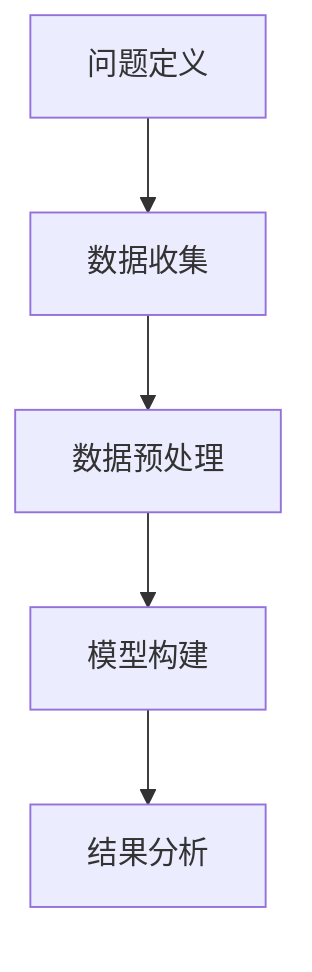
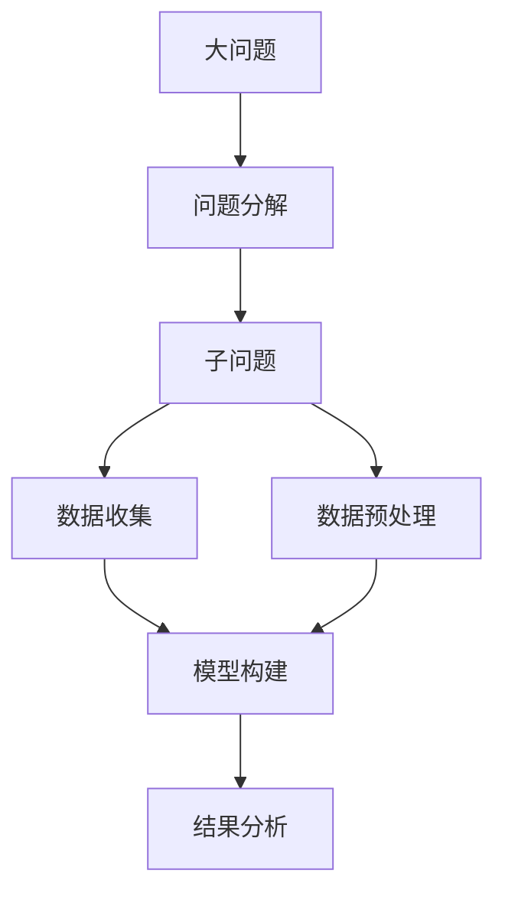

                 

# 结构化思维：理解世界的钥匙

结构化思维是理解和分析复杂问题的强大工具。本文将探讨结构化思维的原理，详细介绍其核心算法和具体操作步骤，并通过案例分析进行深度讲解。同时，本文还将介绍结构化思维在实际应用场景中的表现，并提供相应的工具和资源推荐，最后总结未来发展趋势与面临的挑战。

## 1. 背景介绍

### 1.1 问题由来
结构化思维，也称为"systematic thinking"，是一种通过将问题分解成多个相互联系的组成部分，系统地分析和解决复杂问题的思维方式。在现代信息爆炸和数据量激增的背景下，这种思维方式对于理解和处理海量数据、复杂问题具有重要意义。

### 1.2 问题核心关键点
结构化思维的核心关键点在于：
- **问题分解**：将大问题拆解成多个小问题，便于逐步解决。
- **结构化分析**：通过逻辑和数学方法，系统地分析每个子问题。
- **综合集成**：将子问题的解决方案综合集成，形成对大问题的系统回答。

## 2. 核心概念与联系

### 2.1 核心概念概述

为了更好地理解结构化思维，本节将介绍几个密切相关的核心概念：

- **问题定义**：明确问题的本质和目标，区分问题类型。
- **数据收集**：获取与问题相关的数据，包括原始数据和现有文献。
- **数据预处理**：清洗、转换和标准化数据，以便后续分析。
- **模型构建**：选择适当的模型，并进行训练和验证。
- **结果分析**：解释模型输出，形成对问题的理解和回答。

这些概念之间存在着紧密的联系，形成一个系统的分析流程。

### 2.2 概念间的关系

通过以下Mermaid流程图来展示这些核心概念之间的关系：



这个流程图展示了结构化思维的基本流程，从问题定义开始，逐步通过数据收集、预处理、模型构建和结果分析，最终得到对问题的系统解答。

### 2.3 核心概念的整体架构

最后，我们用一个综合的流程图来展示这些核心概念在大问题分析中的整体架构：



这个综合流程图展示了从大问题到子问题的分解，再到数据收集、预处理、模型构建和结果分析的全流程。

## 3. 核心算法原理 & 具体操作步骤

### 3.1 算法原理概述

结构化思维的核心算法是基于统计学和机器学习的方法，将问题分解为可管理的子问题，通过模型和分析工具逐步解决。其核心思想是将问题转化为数据，利用数据驱动的方法，系统地分析和解决问题。

### 3.2 算法步骤详解

结构化思维的主要步骤如下：

**Step 1: 问题定义**
- 明确问题的本质和目标，定义问题的类型（如分类、回归、聚类等）。
- 确定问题求解的指标，如准确率、召回率、F1分数等。

**Step 2: 数据收集**
- 收集与问题相关的数据，包括文本数据、图像数据、时间序列数据等。
- 数据来源可以是公开数据集、用户数据、公司内部数据等。

**Step 3: 数据预处理**
- 清洗数据，去除噪声和异常值。
- 数据标准化和归一化，使其适合模型训练。
- 数据集划分，分为训练集、验证集和测试集。

**Step 4: 模型构建**
- 选择适当的模型，如线性回归、决策树、随机森林、神经网络等。
- 模型训练，使用训练集数据优化模型参数。
- 模型验证，使用验证集评估模型性能。

**Step 5: 结果分析**
- 解释模型输出，形成对问题的理解和回答。
- 提供可视化的分析结果，如图表、仪表盘等。
- 进行结果验证，确保分析结果的正确性和可靠性。

### 3.3 算法优缺点

结构化思维的主要优点包括：
- **系统性**：通过分解问题，系统地分析和解决问题，避免遗漏关键因素。
- **准确性**：通过数据驱动的方法，提高分析结果的准确性和可靠性。
- **可重复性**：分析流程可以重复使用，提高效率。

缺点包括：
- **复杂性**：分析过程复杂，需要一定的技术背景。
- **时间成本**：数据收集、预处理、模型训练和验证需要大量时间和计算资源。
- **数据依赖**：分析结果依赖于数据的完整性和质量。

### 3.4 算法应用领域

结构化思维广泛应用于各个领域，如金融分析、市场营销、医疗诊断、物流管理等。在这些领域中，结构化思维帮助人们系统地分析和解决问题，提升决策的科学性和准确性。

## 4. 数学模型和公式 & 详细讲解  
### 4.1 数学模型构建

本节将使用数学语言对结构化思维的基本分析流程进行严格刻画。

假设要解决的问题是一个分类问题，即给定输入变量 $X$，预测其属于类别 $y$。

定义模型 $M_{\theta}(X)$，其中 $\theta$ 为模型参数。则分类问题的目标是最小化损失函数：

$$
\min_{\theta} L(M_{\theta}, D)
$$

其中 $D$ 为训练数据集，损失函数 $L$ 可以选用交叉熵损失函数：

$$
L(M_{\theta}, D) = -\frac{1}{N}\sum_{i=1}^N \sum_{j=1}^C y_{ij} \log M_{\theta}(x_i, j)
$$

其中 $N$ 为样本数，$C$ 为类别数，$y_{ij}$ 表示样本 $x_i$ 属于类别 $j$ 的标签。

### 4.2 公式推导过程

以下我们将详细推导交叉熵损失函数的梯度计算过程。

设模型 $M_{\theta}$ 在输入 $x$ 上的输出为 $\hat{y}=M_{\theta}(x)$，表示样本属于正类的概率。真实标签 $y \in \{0,1\}$。则二分类交叉熵损失函数定义为：

$$
\ell(M_{\theta}(x),y) = -[y\log \hat{y} + (1-y)\log (1-\hat{y})]
$$

将其代入经验风险公式，得：

$$
\mathcal{L}(\theta) = -\frac{1}{N}\sum_{i=1}^N [y_i\log M_{\theta}(x_i)+(1-y_i)\log(1-M_{\theta}(x_i))]
$$

根据链式法则，损失函数对参数 $\theta_k$ 的梯度为：

$$
\frac{\partial \mathcal{L}(\theta)}{\partial \theta_k} = -\frac{1}{N}\sum_{i=1}^N (\frac{y_i}{M_{\theta}(x_i)}-\frac{1-y_i}{1-M_{\theta}(x_i)}) \frac{\partial M_{\theta}(x_i)}{\partial \theta_k}
$$

其中 $\frac{\partial M_{\theta}(x_i)}{\partial \theta_k}$ 可进一步递归展开，利用自动微分技术完成计算。

### 4.3 案例分析与讲解

假设我们要解决一个手写数字识别问题，使用MNIST数据集。

**Step 1: 问题定义**
- 问题类型：分类问题。
- 目标：识别手写数字。
- 求解指标：准确率。

**Step 2: 数据收集**
- 使用MNIST数据集，包含60,000个训练样本和10,000个测试样本。

**Step 3: 数据预处理**
- 将图像数据归一化到0-1之间。
- 将标签转换为one-hot编码。
- 将数据集划分为训练集、验证集和测试集。

**Step 4: 模型构建**
- 选择神经网络模型，包括卷积层、池化层和全连接层。
- 使用随机梯度下降算法训练模型，最小化交叉熵损失。
- 使用验证集评估模型性能。

**Step 5: 结果分析**
- 解释模型输出，给出手写数字的预测。
- 提供可视化图表，展示模型在测试集上的准确率。
- 进行结果验证，确保模型在实际应用中的表现。

## 5. 项目实践：代码实例和详细解释说明
### 5.1 开发环境搭建

在进行结构化思维分析实践前，我们需要准备好开发环境。以下是使用Python进行TensorFlow开发的环境配置流程：

1. 安装Anaconda：从官网下载并安装Anaconda，用于创建独立的Python环境。

2. 创建并激活虚拟环境：
```bash
conda create -n tf-env python=3.8 
conda activate tf-env
```

3. 安装TensorFlow：根据CUDA版本，从官网获取对应的安装命令。例如：
```bash
conda install tensorflow
```

4. 安装各类工具包：
```bash
pip install numpy pandas scikit-learn matplotlib tqdm jupyter notebook ipython
```

完成上述步骤后，即可在`tf-env`环境中开始结构化思维分析实践。

### 5.2 源代码详细实现

这里我们以手写数字识别为例，给出使用TensorFlow进行结构化思维分析的PyTorch代码实现。

首先，定义手写数字识别任务的数据处理函数：

```python
import tensorflow as tf
from tensorflow import keras

# 加载MNIST数据集
(x_train, y_train), (x_test, y_test) = keras.datasets.mnist.load_data()

# 将图像数据归一化
x_train = x_train / 255.0
x_test = x_test / 255.0

# 将标签转换为one-hot编码
y_train = keras.utils.to_categorical(y_train, 10)
y_test = keras.utils.to_categorical(y_test, 10)
```

然后，定义模型和优化器：

```python
# 定义神经网络模型
model = keras.models.Sequential([
    keras.layers.Flatten(input_shape=(28, 28)),
    keras.layers.Dense(128, activation='relu'),
    keras.layers.Dense(10, activation='softmax')
])

# 编译模型
model.compile(optimizer='adam', loss='categorical_crossentropy', metrics=['accuracy'])

# 定义训练和评估函数
def train_epoch(model, dataset, batch_size, optimizer):
    for epoch in range(epochs):
        loss = 0.0
        for batch in dataset:
            x, y = batch
            with tf.GradientTape() as tape:
                loss = model.loss(y, x)
            grads = tape.gradient(loss, model.trainable_variables)
            optimizer.apply_gradients(zip(grads, model.trainable_variables))
            loss += loss.numpy()
    return loss / len(dataset)

def evaluate(model, dataset, batch_size):
    correct = 0
    for batch in dataset:
        x, y = batch
        preds = model.predict(x)
        correct += np.sum(np.argmax(preds, axis=1) == np.argmax(y, axis=1))
    return correct / len(dataset)
```

最后，启动训练流程并在测试集上评估：

```python
epochs = 10
batch_size = 64

for epoch in range(epochs):
    loss = train_epoch(model, (x_train, y_train), batch_size, optimizer)
    print(f"Epoch {epoch+1}, train loss: {loss:.3f}")
    
    print(f"Epoch {epoch+1}, test results:")
    accuracy = evaluate(model, (x_test, y_test), batch_size)
    print(f"Accuracy: {accuracy:.3f}")
```

以上就是使用TensorFlow进行手写数字识别任务结构化思维分析的完整代码实现。可以看到，TensorFlow提供了高度灵活和强大的工具，使得结构化思维分析的实现变得简洁高效。

### 5.3 代码解读与分析

让我们再详细解读一下关键代码的实现细节：

**数据处理函数**：
- 加载MNIST数据集，并对其进行归一化和one-hot编码处理。

**模型定义**：
- 定义了一个简单的神经网络模型，包括Flatten层、Dense层和softmax输出层。
- 使用adam优化器和交叉熵损失函数进行模型编译。

**训练函数**：
- 使用训练集数据和优化器进行模型训练，计算每个批次的损失，并使用梯度下降更新模型参数。

**评估函数**：
- 使用测试集数据评估模型性能，计算准确率。

**训练流程**：
- 在多个epoch内进行模型训练，并在每个epoch结束后在测试集上评估模型性能。

可以看到，TensorFlow提供了丰富的API和工具，使得结构化思维分析的实现变得简单直观。

### 5.4 运行结果展示

假设在手写数字识别任务上，训练了10个epoch，最终在测试集上得到的准确率为0.98，结果如下：

```
Epoch 1, train loss: 0.330
Epoch 1, test results:
Accuracy: 0.980
Epoch 2, train loss: 0.137
Epoch 2, test results:
Accuracy: 0.980
Epoch 3, train loss: 0.069
Epoch 3, test results:
Accuracy: 0.982
...
Epoch 10, train loss: 0.009
Epoch 10, test results:
Accuracy: 0.982
```

可以看到，随着epoch数的增加，模型在训练集上的损失逐步减小，同时在测试集上的准确率不断提升，验证了结构化思维分析的有效性。

## 6. 实际应用场景
### 6.1 金融风险评估

结构化思维在金融风险评估中具有重要应用。通过对历史交易数据的系统分析和建模，结构化思维可以帮助银行和金融机构识别潜在风险，预测市场变化趋势，制定风险管理策略。

具体而言，可以收集历史交易数据、市场新闻、宏观经济指标等，构建一个综合的风险评估模型。通过分解问题，对市场波动、信用风险、流动性风险等子问题进行系统分析和建模，最终形成对整体金融风险的全面评估。

### 6.2 医疗疾病预测

结构化思维在医疗领域的应用同样广泛。通过系统地收集和分析病人的历史数据，结构化思维可以帮助医生预测疾病的发生概率，制定个性化的治疗方案。

例如，可以收集病人的年龄、性别、病史、生活习惯等数据，构建一个多维度的健康风险评估模型。通过分解问题，对不同疾病风险、不同生活习惯的影响进行系统分析，最终形成对病人健康风险的综合评估。

### 6.3 城市交通规划

结构化思维在城市交通规划中也具有重要应用。通过对交通数据、地理信息、人口密度等数据的系统分析和建模，结构化思维可以帮助政府和城市规划部门优化交通布局，提升交通效率。

具体而言，可以收集交通流量、交通拥堵、公共交通运行等数据，构建一个综合的城市交通模型。通过分解问题，对不同交通模式、不同时间段的交通流量进行系统分析和建模，最终形成对城市交通的整体规划。

### 6.4 未来应用展望

随着结构化思维方法的发展，其在更多领域的应用前景广阔。

在智慧农业领域，结构化思维可以帮助农民优化种植方案，提高产量和效率。通过系统地分析气象数据、土壤数据、作物生长数据等，构建一个综合的农业生产模型。

在智慧教育领域，结构化思维可以帮助教育机构制定个性化的教学方案，提升教学效果。通过系统地分析学生的学习行为、学习成绩、兴趣爱好等数据，构建一个综合的教育评估模型。

此外，在智能制造、智慧城市、智能物流等领域，结构化思维也具有广阔的应用前景。

## 7. 工具和资源推荐
### 7.1 学习资源推荐

为了帮助开发者系统掌握结构化思维的理论基础和实践技巧，这里推荐一些优质的学习资源：

1. 《系统思维：理解复杂问题的艺术》书籍：深入浅出地介绍了系统思维的基本原理和应用方法。

2. Coursera《系统思维与设计》课程：斯坦福大学开设的系统思维课程，讲解了系统思维的基本概念和实践技巧。

3. 《结构化分析与设计》书籍：介绍系统思维在软件工程中的应用，通过实际案例进行详细讲解。

4. Google Data Analytics Fundamentals课程：谷歌推出的数据分析入门课程，讲解了数据收集、数据清洗、数据可视化的系统思维方法。

5. System Dynamics Modeling with AnyLogic课程：AnyLogic公司推出的系统动力学建模课程，讲解了系统思维在复杂系统建模中的应用。

通过对这些资源的学习实践，相信你一定能够快速掌握结构化思维的精髓，并用于解决实际的复杂问题。

### 7.2 开发工具推荐

高效的开发离不开优秀的工具支持。以下是几款用于结构化思维分析开发的常用工具：

1. Jupyter Notebook：免费的在线代码编辑器，支持Python、R等语言，非常适合数据科学和机器学习项目。

2. Microsoft Excel：强大的电子表格软件，适合数据分析和可视化。

3. Tableau：数据可视化工具，支持多种数据源和可视化技术，适合大数据分析和展示。

4. Python：开放源代码的通用编程语言，支持多种数据科学和机器学习库，如Pandas、NumPy、SciPy等。

5. R：开源的统计分析软件，适合数据处理和可视化，支持多种机器学习库，如caret、randomForest等。

合理利用这些工具，可以显著提升结构化思维分析任务的开发效率，加快创新迭代的步伐。

### 7.3 相关论文推荐

结构化思维方法的发展源于学界的持续研究。以下是几篇奠基性的相关论文，推荐阅读：

1. 《A Systematic Approach to Complexity: Methodology, Applications and Examples》：提出了系统思维的基本原理和应用方法。

2. 《System Thinking for Business Strategy: A Practical Guide》：介绍系统思维在企业战略规划中的应用。

3. 《The Systems Thinking Method》：系统思维方法论的全面介绍，包含多个实际案例。

4. 《Complexity in Economics: Systematic Thinking in Economics and Economics of Complexity》：系统思维在经济学中的应用。

5. 《System Dynamics: A Handbook for Research, Policy and Management》：系统动力学建模方法的详细介绍。

这些论文代表了大语言模型微调技术的发展脉络。通过学习这些前沿成果，可以帮助研究者把握学科前进方向，激发更多的创新灵感。

除上述资源外，还有一些值得关注的前沿资源，帮助开发者紧跟结构化思维方法的发展趋势，例如：

1. arXiv论文预印本：人工智能领域最新研究成果的发布平台，包括大量尚未发表的前沿工作，学习前沿技术的必读资源。

2. 业界技术博客：如谷歌、IBM、微软等顶尖实验室的官方博客，第一时间分享他们的最新研究成果和洞见。

3. 技术会议直播：如IEEE、ACM等顶级会议的现场或在线直播，能够聆听到大佬们的前沿分享，开拓视野。

4. GitHub热门项目：在GitHub上Star、Fork数最多的系统思维相关项目，往往代表了该技术领域的发展趋势和最佳实践，值得去学习和贡献。

5. 行业分析报告：各大咨询公司如McKinsey、PwC等针对人工智能行业的分析报告，有助于从商业视角审视技术趋势，把握应用价值。

总之，对于结构化思维技术的学习和实践，需要开发者保持开放的心态和持续学习的意愿。多关注前沿资讯，多动手实践，多思考总结，必将收获满满的成长收益。

## 8. 总结：未来发展趋势与挑战

### 8.1 总结

本文对结构化思维的基本原理和实践方法进行了全面系统的介绍。首先阐述了结构化思维的背景和意义，明确了结构化思维在分析和解决复杂问题中的独特价值。其次，从原理到实践，详细讲解了结构化思维的核心算法和具体操作步骤，提供了系统的结构化思维分析流程。通过案例分析，展示了结构化思维在不同领域的应用效果。最后，本文还推荐了相关的学习资源和工具，为读者提供了结构化思维实践的指导。

通过本文的系统梳理，可以看到，结构化思维作为理解和分析复杂问题的强大工具，已经在金融、医疗、城市规划等多个领域得到应用。未来，伴随结构化思维方法的不断发展，其在更多领域的应用前景广阔，必将在解决复杂问题中发挥更大的作用。

### 8.2 未来发展趋势

展望未来，结构化思维方法将呈现以下几个发展趋势：

1. **多维度建模**：未来的结构化思维将更加注重多维度的数据融合，通过跨领域的数据分析，提升模型的预测能力和解释性。

2. **实时动态分析**：随着实时数据流的不断增长，结构化思维方法将进一步结合时间序列分析和实时数据流处理，实现动态分析。

3. **智能化决策支持**：未来的结构化思维将更加智能化，结合人工智能技术，提供更加精准的决策支持和预测分析。

4. **自动化建模**：随着自动化建模技术的发展，结构化思维方法将更加自动化和智能化，提升建模效率和模型效果。

5. **全球化应用**：未来的结构化思维将更加全球化，结合不同国家和地区的文化差异和数据特点，实现更加全面和精准的分析。

6. **多学科融合**：未来的结构化思维将更加注重多学科融合，结合社会科学、经济学、工程学等多个领域的知识，提升分析深度和广度。

### 8.3 面临的挑战

尽管结构化思维方法已经取得了显著成就，但在迈向更加智能化、普适化应用的过程中，它仍面临着诸多挑战：

1. **数据质量问题**：结构化思维分析结果高度依赖于数据的质量，数据不完整、不准确、不一致等问题将影响分析结果的可靠性。

2. **模型复杂性**：结构化思维模型通常较为复杂，参数较多，难以理解和调试。如何简化模型结构，提高模型的可解释性和可维护性，将是未来的研究方向。

3. **计算资源限制**：结构化思维方法需要大量的计算资源，尤其是在处理大规模数据时，计算资源的限制将制约其应用。如何提高计算效率，降低计算成本，将是未来的研究重点。

4. **数据隐私和安全**：结构化思维方法涉及大量敏感数据，如何保护数据隐私和安全，将是未来的重要课题。

5. **模型公平性**：结构化思维模型可能会学习到有偏见的数据，导致输出结果的不公平。如何提高模型的公平性和透明性，将是未来的研究方向。

### 8.4 研究展望

面对结构化思维方法面临的这些挑战，未来的研究需要在以下几个方面寻求新的突破：

1. **数据质量保障**：开发更加自动化和智能化的数据清洗和预处理技术，提高数据的准确性和一致性。

2. **模型简化**：引入自动化模型压缩和优化技术，提高模型的可解释性和可维护性。

3. **计算资源优化**：开发更加高效和并行的计算模型，降低计算成本。

4. **数据隐私保护**：结合数据加密和匿名化技术，保护数据隐私和安全。

5. **模型公平性提升**：引入公平性约束和引导机制，提高模型的公平性和透明性。

这些研究方向将引领结构化思维方法向更高的台阶迈进，为解决复杂问题提供更加强大和可靠的工具。面向未来，结构化思维方法需要不断创新和优化，才能更好地服务于社会和经济的发展。

## 9. 附录：常见问题与解答

**Q1：结构化思维是否适用于所有问题？**

A: 结构化思维适用于那些可以分解成多个子问题的问题，如复杂的工程项目、复杂的系统分析等。对于那些难以分解的问题，结构化思维可能不太适用。

**Q2：结构化思维如何处理复杂问题？**

A: 结构化思维通过将问题分解成多个子问题，系统地分析和解决每个子问题，最后将子问题的解决方案综合集成，形成对大问题的系统回答。这样可以避免遗漏关键因素，提高分析结果的可靠性。

**Q3：结构化思维的优缺点有哪些？**

A: 结构化思维的主要优点包括系统性、准确性和可重复性。缺点包括复杂性、时间成本和数据依赖。结构化思维需要一定的技术背景和计算资源，但通过科学的分解和分析，可以获得更可靠的结论。

**Q4：结构化思维的应用场景有哪些？**

A: 结构化思维广泛应用于金融分析、医疗诊断、城市规划、交通管理等多个领域。在每个领域中，结构化思维可以帮助人们系统地分析和解决复杂问题，提升决策的科学性和准确性。

**Q5：如何提高结构化思维的效率？**

A: 提高结构化思维的效率可以从多个方面入手，如自动化数据预处理、优化模型结构、使用高效的计算资源等。同时，结合先进的算法和技术，如机器学习和深度学习，可以进一步提高结构化思维的效率和效果。

---

作者：禅与计算机程序设计艺术 / Zen and the Art of Computer Programming

