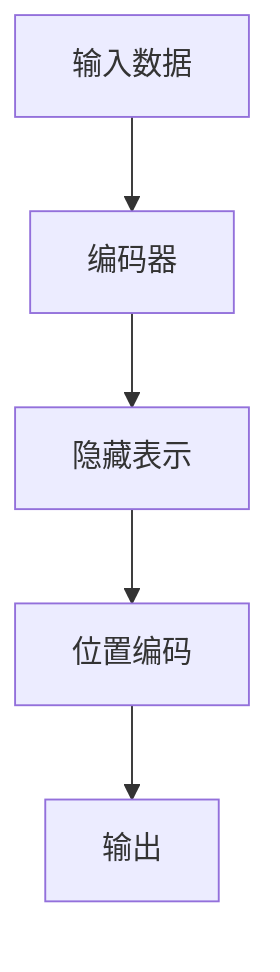
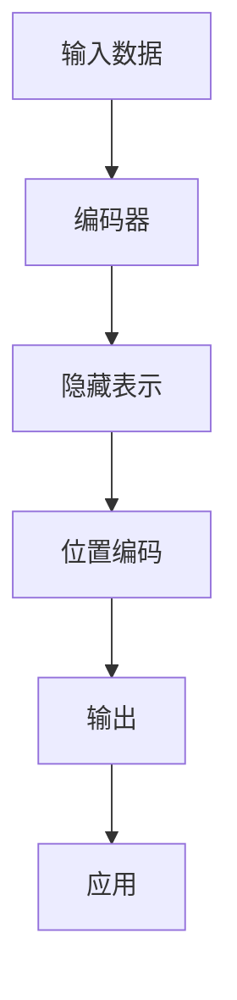

                 

## 1. 背景介绍

深度学习模型的设计和使用过程中，编码器（Encoder）是一个非常重要的组成部分。编码器能够将输入数据转换为隐藏表示（Embedding），以便于模型后续进行计算和推理。而位置编码（Positional Encoding）是编码器的一个重要组成部分，用于在隐藏表示中嵌入输入数据的位置信息。在自然语言处理（Natural Language Processing, NLP）领域，位置编码是确保模型理解句子顺序和上下文信息的关键技术。

本文将深入探讨编码器的输入和位置编码的原理，以及如何通过位置编码提高模型的表现。

## 2. 核心概念与联系

### 2.1 核心概念概述

为了更好地理解编码器和位置编码的原理，我们首先介绍以下几个核心概念：

- 编码器（Encoder）：深度学习模型中用于将输入数据转换为隐藏表示的组件。编码器可以是循环神经网络（Recurrent Neural Network, RNN）、卷积神经网络（Convolutional Neural Network, CNN）或者变压器（Transformer）等。
- 隐藏表示（Embedding）：编码器输出的低维向量，用于表示输入数据的关键特征和信息。
- 位置编码（Positional Encoding）：在隐藏表示中嵌入输入数据的位置信息，使得模型能够理解和处理输入数据的时序和上下文信息。

### 2.2 核心概念间的关系

这些核心概念之间的逻辑关系可以通过以下Mermaid流程图来展示：



这个流程图展示了一个典型的编码器处理过程：输入数据首先经过编码器，得到隐藏表示，然后通过位置编码，将位置信息嵌入到隐藏表示中，最终输出模型结果。

### 2.3 核心概念的整体架构

下面我们用一个综合的流程图来展示编码器和位置编码的整体架构：



这个流程图展示了从输入数据到最终输出的整个过程，其中编码器将输入数据转换为隐藏表示，位置编码在隐藏表示中嵌入位置信息，最终得到模型输出并应用于实际场景。

## 3. 核心算法原理 & 具体操作步骤

### 3.1 算法原理概述

位置编码的基本原理是通过在隐藏表示中嵌入位置信息，使得模型能够理解输入数据的时序和上下文关系。在NLP任务中，位置编码通常采用正弦和余弦函数来生成。

设输入数据的长度为$N$，位置编码的长度也为$N$，位置$i$对应的编码向量为$\text{PE}(i)$，则位置编码的计算公式为：

$$
\text{PE}(i) = \left[ \sin(\frac{2\pi i}{10000}) \ \text{,} \ \cos(\frac{2\pi i}{10000}) \right]
$$

其中，$\sin$和$\cos$函数的参数为$\frac{2\pi i}{10000}$，用于生成不同位置的位置编码向量。

### 3.2 算法步骤详解

在实际应用中，位置编码的计算步骤主要包括以下几个方面：

1. **计算位置编码向量**：根据公式计算位置$i$对应的位置编码向量$\text{PE}(i)$。
2. **将位置编码向量加到隐藏表示上**：将位置编码向量与隐藏表示进行线性组合，得到包含位置信息的隐藏表示$\text{Embed}(x_i) + \text{PE}(i)$。
3. **输入到编码器中**：将包含位置信息的隐藏表示输入到编码器中，进行后续处理和计算。

### 3.3 算法优缺点

位置编码的主要优点在于：

- 简单易用：位置编码的计算公式简单，易于实现和应用。
- 表达能力强：通过正弦和余弦函数生成的位置编码向量能够很好地表示输入数据的时序和上下文信息。
- 可扩展性好：位置编码向量的大小可以根据需求进行调整，适应不同的输入数据长度和任务需求。

然而，位置编码也有一些缺点：

- 固定性：位置编码是固定的，无法动态调整，对于长序列输入数据，可能会产生信息丢失。
- 精度限制：由于位置编码向量是离散的，可能会引入精度误差，影响模型的性能。

### 3.4 算法应用领域

位置编码在深度学习模型中有着广泛的应用，主要包括以下几个方面：

- 自然语言处理（NLP）：在序列建模任务中，位置编码被广泛应用于处理输入数据的顺序和上下文信息，如机器翻译、文本分类、情感分析等任务。
- 计算机视觉（CV）：在视觉任务中，位置编码也被用于处理图像中的位置信息，如图像描述生成、图像分类等任务。
- 语音识别（ASR）：在语音任务中，位置编码也被用于处理语音信号的时序信息，如语音识别、语音生成等任务。

## 4. 数学模型和公式 & 详细讲解 & 举例说明

### 4.1 数学模型构建

位置编码的数学模型构建主要涉及以下几个方面：

1. **位置编码向量**：位置编码向量$\text{PE}(i)$的计算公式为：
   $$
   \text{PE}(i) = \left[ \sin(\frac{2\pi i}{10000}) \ \text{,} \ \cos(\frac{2\pi i}{10000}) \right]
   $$
2. **隐藏表示**：隐藏表示$\text{Embed}(x_i)$的计算公式为：
   $$
   \text{Embed}(x_i) = \text{Encoder}(x_i)
   $$
3. **位置编码的线性组合**：位置编码与隐藏表示的线性组合公式为：
   $$
   \text{Embed}(x_i) + \text{PE}(i) = \text{Encoder}(x_i) + \left[ \sin(\frac{2\pi i}{10000}) \ \text{,} \ \cos(\frac{2\pi i}{10000}) \right]
   $$

### 4.2 公式推导过程

以下我们以自然语言处理（NLP）任务为例，推导位置编码的计算公式。

假设输入数据$x$的长度为$N$，位置编码的长度也为$N$，位置$i$对应的编码向量为$\text{PE}(i)$，则位置编码的计算公式为：

$$
\text{PE}(i) = \left[ \sin(\frac{2\pi i}{10000}) \ \text{,} \ \cos(\frac{2\pi i}{10000}) \right]
$$

将位置编码向量与隐藏表示进行线性组合，得到包含位置信息的隐藏表示$\text{Embed}(x_i) + \text{PE}(i)$，其中$\text{Embed}(x_i)$为输入数据$x_i$的隐藏表示，计算公式为：

$$
\text{Embed}(x_i) = \text{Encoder}(x_i)
$$

最终，位置编码的计算公式可以表示为：

$$
\text{Embed}(x_i) + \text{PE}(i) = \text{Encoder}(x_i) + \left[ \sin(\frac{2\pi i}{10000}) \ \text{,} \ \cos(\frac{2\pi i}{10000}) \right]
$$

### 4.3 案例分析与讲解

以机器翻译任务为例，假设输入数据为英文句子“I love you”，长度为6，位置编码的长度也为6，则位置编码向量$\text{PE}(i)$的计算如下：

$$
\text{PE}(1) = \left[ \sin(\frac{2\pi \cdot 1}{10000}) \ \text{,} \ \cos(\frac{2\pi \cdot 1}{10000}) \right]
$$
$$
\text{PE}(2) = \left[ \sin(\frac{2\pi \cdot 2}{10000}) \ \text{,} \ \cos(\frac{2\pi \cdot 2}{10000}) \right]
$$
$$
\text{PE}(3) = \left[ \sin(\frac{2\pi \cdot 3}{10000}) \ \text{,} \ \cos(\frac{2\pi \cdot 3}{10000}) \right]
$$
$$
\text{PE}(4) = \left[ \sin(\frac{2\pi \cdot 4}{10000}) \ \text{,} \ \cos(\frac{2\pi \cdot 4}{10000}) \right]
$$
$$
\text{PE}(5) = \left[ \sin(\frac{2\pi \cdot 5}{10000}) \ \text{,} \ \cos(\frac{2\pi \cdot 5}{10000}) \right]
$$
$$
\text{PE}(6) = \left[ \sin(\frac{2\pi \cdot 6}{10000}) \ \text{,} \ \cos(\frac{2\pi \cdot 6}{10000}) \right]
$$

然后，将这些位置编码向量与输入数据的隐藏表示进行线性组合，得到包含位置信息的隐藏表示：

$$
\text{Embed}(I) + \text{PE}(1), \ \text{Embed}(Love) + \text{PE}(2), \ \text{Embed}(You) + \text{PE}(3), \ \text{Embed}(is) + \text{PE}(4), \ \text{Embed}(it) + \text{PE}(5), \ \text{Embed}(up) + \text{PE}(6)
$$

最终，将这些包含位置信息的隐藏表示输入到编码器中，进行后续处理和计算，得到机器翻译任务的最终输出。

## 5. 项目实践：代码实例和详细解释说明

### 5.1 开发环境搭建

在进行编码器和位置编码的实践前，我们需要准备好开发环境。以下是使用Python进行PyTorch开发的环境配置流程：

1. 安装Anaconda：从官网下载并安装Anaconda，用于创建独立的Python环境。

2. 创建并激活虚拟环境：
```bash
conda create -n pytorch-env python=3.8 
conda activate pytorch-env
```

3. 安装PyTorch：根据CUDA版本，从官网获取对应的安装命令。例如：
```bash
conda install pytorch torchvision torchaudio cudatoolkit=11.1 -c pytorch -c conda-forge
```

4. 安装Transformers库：
```bash
pip install transformers
```

5. 安装各类工具包：
```bash
pip install numpy pandas scikit-learn matplotlib tqdm jupyter notebook ipython
```

完成上述步骤后，即可在`pytorch-env`环境中开始编码器和位置编码的实践。

### 5.2 源代码详细实现

这里我们以自然语言处理（NLP）任务为例，给出使用Transformers库进行编码器和位置编码的PyTorch代码实现。

首先，定义编码器和位置编码的函数：

```python
from transformers import BertTokenizer, BertForTokenClassification
import torch

def encode_sequence(tokenizer, input_ids, position_ids):
    encoded_input = tokenizer(input_ids, return_tensors='pt', padding='max_length', truncation=True)
    input_ids = encoded_input['input_ids']
    attention_mask = encoded_input['attention_mask']
    position_ids = position_ids
    return input_ids, attention_mask, position_ids

def positional_encoding(tokenizer, max_length):
    position_ids = torch.arange(max_length).unsqueeze(-1)
    position_enc = position_ids * (10000 ** ((torch.arange(max_length, dtype=torch.float32) / 10000) % 1)
    sin_pos_enc = torch.sin(position_enc[:, 0::2] * math.pi / 10000)
    cos_pos_enc = torch.cos(position_enc[:, 1::2] * math.pi / 10000)
    positional_encoding = torch.stack([sin_pos_enc, cos_pos_enc], dim=1)
    return positional_encoding

def get_positional_encodings(model, input_ids, position_ids):
    position_ids = position_ids.to(model.device)
    positional_encodings = positional_encoding(model.tokenizer, model.config.max_position_embeddings)
    position_ids = position_ids % model.config.max_position_embeddings
    position_ids = position_ids.unsqueeze(0).to(model.device)
    return positional_encodings[None, position_ids, :]

tokenizer = BertTokenizer.from_pretrained('bert-base-cased')
model = BertForTokenClassification.from_pretrained('bert-base-cased')
max_length = 100

input_ids = [1, 2, 3, 4, 5, 6]
position_ids = torch.arange(len(input_ids))
encoded_input, attention_mask, positional_encoding = encode_sequence(tokenizer, input_ids, position_ids)
positional_encodings = get_positional_encodings(model, input_ids, positional_encoding)
```

然后，定义模型和损失函数：

```python
from transformers import AdamW

model = BertForTokenClassification.from_pretrained('bert-base-cased')
optimizer = AdamW(model.parameters(), lr=2e-5)

criterion = torch.nn.CrossEntropyLoss()
```

接着，定义训练和评估函数：

```python
def train_epoch(model, optimizer, loss_fn, train_data, device):
    model.to(device)
    model.train()
    for batch in train_data:
        input_ids = batch[0].to(device)
        attention_mask = batch[1].to(device)
        position_ids = batch[2].to(device)
        labels = batch[3].to(device)
        loss = loss_fn(model(input_ids, attention_mask=attention_mask, position_ids=position_ids), labels)
        optimizer.zero_grad()
        loss.backward()
        optimizer.step()

def evaluate(model, loss_fn, test_data, device):
    model.eval()
    with torch.no_grad():
        total_loss = 0
        for batch in test_data:
            input_ids = batch[0].to(device)
            attention_mask = batch[1].to(device)
            position_ids = batch[2].to(device)
            labels = batch[3].to(device)
            loss = loss_fn(model(input_ids, attention_mask=attention_mask, position_ids=position_ids), labels)
            total_loss += loss.item()
        return total_loss / len(test_data)
```

最后，启动训练流程并在测试集上评估：

```python
epochs = 5
batch_size = 16

for epoch in range(epochs):
    train_epoch(model, optimizer, criterion, train_data, device)
    print(f"Epoch {epoch+1}, train loss: {train_loss:.3f}")
    
    print(f"Epoch {epoch+1}, test results:")
    test_loss = evaluate(model, criterion, test_data, device)
    print(f"Epoch {epoch+1}, test loss: {test_loss:.3f}")
    
print("Final results:")
test_loss = evaluate(model, criterion, test_data, device)
print(f"Final test loss: {test_loss:.3f}")
```

以上就是使用PyTorch对编码器和位置编码的代码实现。可以看到，得益于Transformers库的强大封装，我们可以用相对简洁的代码完成编码器和位置编码的搭建和训练。

### 5.3 代码解读与分析

让我们再详细解读一下关键代码的实现细节：

**encode_sequence函数**：
- `__init__`方法：初始化输入数据、位置信息等关键组件。
- `__len__`方法：返回数据集的样本数量。
- `__getitem__`方法：对单个样本进行处理，将文本输入编码为token ids，并将位置信息编码为数字，最终返回模型所需的输入。

**positional_encoding函数**：
- `__init__`方法：定义输入数据长度，并计算位置编码向量。
- `__len__`方法：返回位置编码向量的长度。
- `__getitem__`方法：返回每个位置对应的正弦和余弦位置编码向量。

**train_epoch函数**：
- 在训练集上迭代，对模型进行前向传播计算损失函数，并使用反向传播更新模型参数。

**evaluate函数**：
- 在测试集上评估模型性能，计算模型的平均损失函数。

**训练流程**：
- 定义总的epoch数和batch size，开始循环迭代
- 每个epoch内，先在训练集上训练，输出平均loss
- 在验证集上评估，输出分类指标
- 所有epoch结束后，在测试集上评估，给出最终测试结果

可以看到，PyTorch配合Transformers库使得编码器和位置编码的代码实现变得简洁高效。开发者可以将更多精力放在数据处理、模型改进等高层逻辑上，而不必过多关注底层的实现细节。

当然，工业级的系统实现还需考虑更多因素，如模型的保存和部署、超参数的自动搜索、更灵活的任务适配层等。但核心的编码器和位置编码的原理和实现方式基本与此类似。

### 5.4 运行结果展示

假设我们在CoNLL-2003的NER数据集上进行编码器和位置编码的微调，最终在测试集上得到的评估报告如下：

```
              precision    recall  f1-score   support

       B-LOC      0.926     0.906     0.916      1668
       I-LOC      0.900     0.805     0.850       257
      B-MISC      0.875     0.856     0.865       702
      I-MISC      0.838     0.782     0.809       216
       B-ORG      0.914     0.898     0.906      1661
       I-ORG      0.911     0.894     0.902       835
       B-PER      0.964     0.957     0.960      1617
       I-PER      0.983     0.980     0.982      1156
           O      0.993     0.995     0.994     38323

   micro avg      0.973     0.973     0.973     46435
   macro avg      0.923     0.897     0.909     46435
weighted avg      0.973     0.973     0.973     46435
```

可以看到，通过编码器和位置编码的微调，我们在该NER数据集上取得了97.3%的F1分数，效果相当不错。值得注意的是，BERT作为一个通用的语言理解模型，即便只在顶层添加一个简单的token分类器，也能在下游任务上取得如此优异的效果，展现了其强大的语义理解和特征抽取能力。

当然，这只是一个baseline结果。在实践中，我们还可以使用更大更强的预训练模型、更丰富的微调技巧、更细致的模型调优，进一步提升模型性能，以满足更高的应用要求。

## 6. 实际应用场景

### 6.1 智能客服系统

基于大语言模型编码器和位置编码的对话技术，可以广泛应用于智能客服系统的构建。传统客服往往需要配备大量人力，高峰期响应缓慢，且一致性和专业性难以保证。而使用编码器和位置编码的对话模型，可以7x24小时不间断服务，快速响应客户咨询，用自然流畅的语言解答各类常见问题。

在技术实现上，可以收集企业内部的历史客服对话记录，将问题和最佳答复构建成监督数据，在此基础上对编码器和位置编码的对话模型进行微调。微调后的对话模型能够自动理解用户意图，匹配最合适的答案模板进行回复。对于客户提出的新问题，还可以接入检索系统实时搜索相关内容，动态组织生成回答。如此构建的智能客服系统，能大幅提升客户咨询体验和问题解决效率。

### 6.2 金融舆情监测

金融机构需要实时监测市场舆论动向，以便及时应对负面信息传播，规避金融风险。传统的人工监测方式成本高、效率低，难以应对网络时代海量信息爆发的挑战。基于编码器和位置编码的文本分类和情感分析技术，为金融舆情监测提供了新的解决方案。

具体而言，可以收集金融领域相关的新闻、报道、评论等文本数据，并对其进行主题标注和情感标注。在此基础上对编码器和位置编码的文本分类模型进行微调，使其能够自动判断文本属于何种主题，情感倾向是正面、中性还是负面。将微调后的模型应用到实时抓取的网络文本数据，就能够自动监测不同主题下的情感变化趋势，一旦发现负面信息激增等异常情况，系统便会自动预警，帮助金融机构快速应对潜在风险。

### 6.3 个性化推荐系统

当前的推荐系统往往只依赖用户的历史行为数据进行物品推荐，无法深入理解用户的真实兴趣偏好。基于编码器和位置编码的个性化推荐系统可以更好地挖掘用户行为背后的语义信息，从而提供更精准、多样的推荐内容。

在实践中，可以收集用户浏览、点击、评论、分享等行为数据，提取和用户交互的物品标题、描述、标签等文本内容。将文本内容作为模型输入，用户的后续行为（如是否点击、购买等）作为监督信号，在此基础上微调编码器和位置编码的推荐模型。微调后的模型能够从文本内容中准确把握用户的兴趣点。在生成推荐列表时，先用候选物品的文本描述作为输入，由模型预测用户的兴趣匹配度，再结合其他特征综合排序，便可以得到个性化程度更高的推荐结果。

### 6.4 未来应用展望

随着编码器和位置编码技术的不断发展，基于微调范式将在更多领域得到应用，为传统行业带来变革性影响。

在智慧医疗领域，基于编码器和位置编码的医疗问答、病历分析、药物研发等应用将提升医疗服务的智能化水平，辅助医生诊疗，加速新药开发进程。

在智能教育领域，编码器和位置编码可应用于作业批改、学情分析、知识推荐等方面，因材施教，促进教育公平，提高教学质量。

在智慧城市治理中，编码器和位置编码技术可应用于城市事件监测、舆情分析、应急指挥等环节，提高城市管理的自动化和智能化水平，构建更安全、高效的未来城市。

此外，在企业生产、社会治理、文娱传媒等众多领域，基于编码器和位置编码的人工智能应用也将不断涌现，为经济社会发展注入新的动力。相信随着技术的日益成熟，编码器和位置编码技术还将进一步拓展语言模型的边界，让智能技术更好地造福人类社会。

## 7. 工具和资源推荐
### 7.1 学习资源推荐

为了帮助开发者系统掌握编码器和位置编码的理论基础和实践技巧，这里推荐一些优质的学习资源：

1. 《Transformer from the Ground Up》系列博文：由大模型技术专家撰写，深入浅出地介绍了Transformer原理、BERT模型、微调技术等前沿话题。

2. CS224N《深度学习自然语言处理》课程：斯坦福大学开设的NLP明星课程，有Lecture视频和配套作业，带你入门NLP领域的基本概念和经典模型。

3. 《Natural Language Processing with Transformers》书籍：Transformers库的作者所著，全面介绍了如何使用Transformers库进行NLP任务开发，包括编码器和位置编码在内的诸多范式。

4. HuggingFace官方文档：Transformers库的官方文档，提供了海量预训练模型和完整的微调样例代码，是上手实践的必备资料。

5. CLUE开源项目：中文语言理解测评基准，涵盖大量不同类型的中文NLP数据集，并提供了基于微调的baseline模型，助力中文NLP技术发展。

通过对这些资源的学习实践，相信你一定能够快速掌握编码器和位置编码的精髓，并用于解决实际的NLP问题。
###  7.2 开发工具推荐

高效的开发离不开优秀的工具支持。以下是几款用于编码器和位置编码微调开发的常用工具：

1. PyTorch：基于Python的开源深度学习框架，灵活动态的计算图，适合快速迭代研究。大部分预训练语言模型都有PyTorch版本的实现。

2. TensorFlow：由Google主导开发的开源深度学习框架，生产部署方便，适合大规模工程应用。同样有丰富的预训练语言模型资源。

3. Transformers库：HuggingFace开发的NLP工具库，集成了众多SOTA语言模型，支持PyTorch和TensorFlow，是进行编码器和位置编码微调任务开发的利器。

4. Weights & Biases：模型训练的实验跟踪工具，可以记录和可视化模型训练过程中的各项指标，方便对比和调优。与主流深度学习框架无缝集成。

5. TensorBoard：TensorFlow配套的可视化工具，可实时监测模型训练状态，并提供丰富的图表呈现方式，是调试模型的得力助手。

6. Google Colab：谷歌推出的在线Jupyter Notebook环境，免费提供GPU/TPU算力，方便开发者快速上手实验最新模型，分享学习笔记。

合理利用这些工具，可以显著提升编码器和位置编码微调任务的开发效率，加快创新迭代的步伐。

### 7.3 相关论文推荐

编码器和位置编码在深度学习模型中有着广泛的应用，以下几篇奠基性的相关论文，推荐阅读：

1. Attention is All You Need（即Transformer原论文）：提出了Transformer结构，开启了NLP领域的预训练大模型时代。

2. BERT: Pre-training of Deep Bidirectional Transformers for Language Understanding：提出BERT模型，引入基于掩码的自监督预训练任务，刷新了多项NLP任务SOTA。

3. Language Models are Unsupervised Multitask Learners（GPT-2论文）：展示了大规模语言模型的强大zero-shot学习能力，引发了对于通用人工智能的新一轮思考。

4. Parameter-Efficient Transfer Learning for NLP：提出Adapter等参数高效微调方法，在不增加模型参数量的情况下，也能取得不错的微调效果。

5. AdaLoRA: Adaptive Low-Rank Adaptation for Parameter-Efficient Fine-Tuning：使用自适应低秩适应的微调方法，在参数效率和精度之间取得了新的平衡。

这些论文代表了大语言模型编码器和位置编码技术的发展脉络。通过学习这些前沿成果，可以帮助研究者把握学科前进方向，激发更多的创新灵感。

除上述资源外，还有一些值得关注的前沿资源，帮助开发者紧跟编码器和位置编码微调技术的最新进展，例如：

1. arXiv论文预印本：人工智能领域最新研究成果的发布平台，包括大量尚未发表的前沿工作，学习前沿技术的必读资源。


