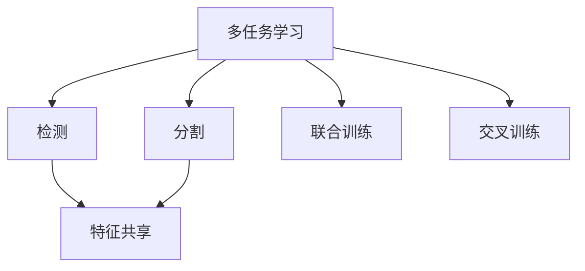
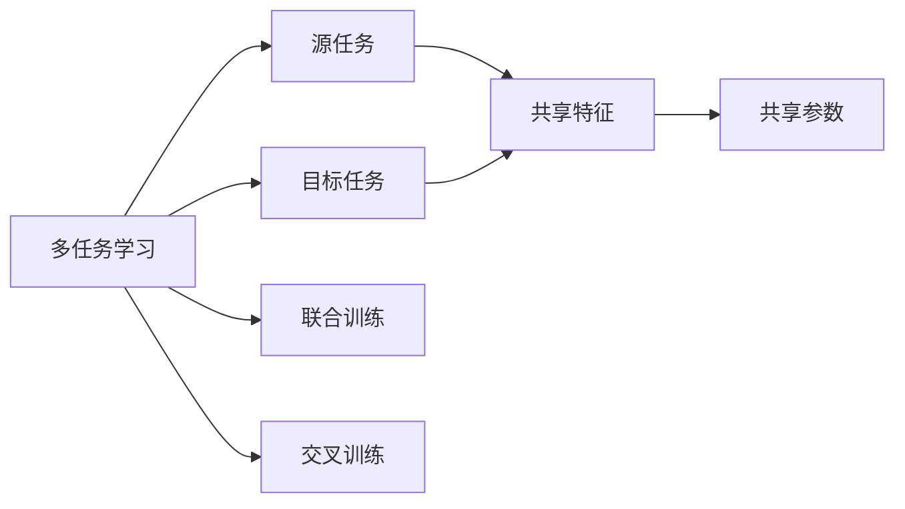
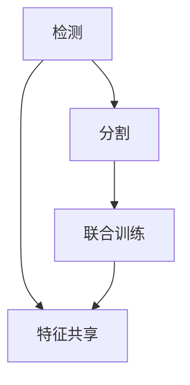
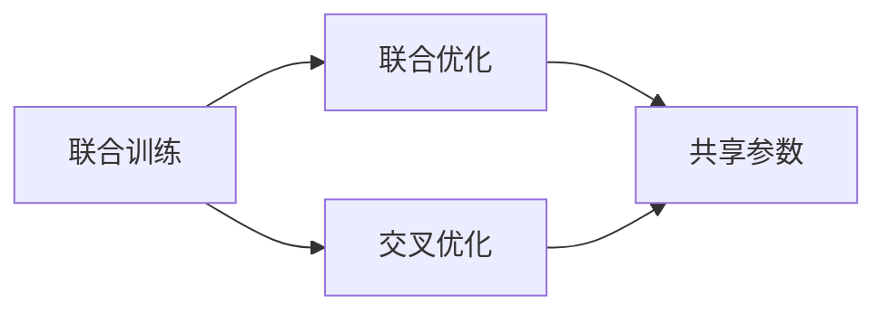
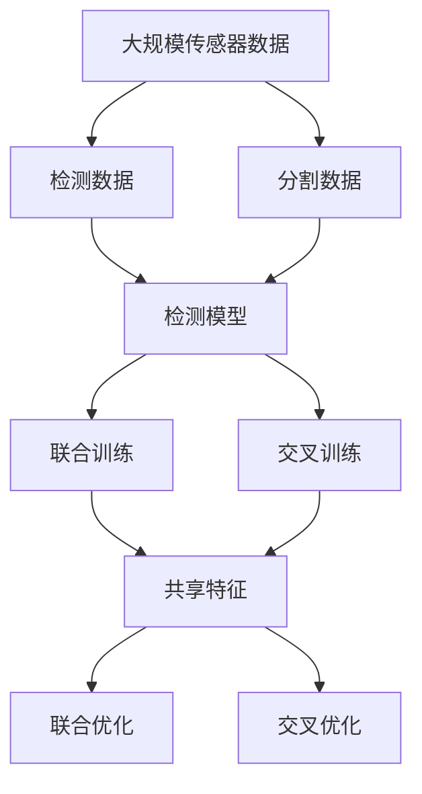

                 

# 自动驾驶中的多任务学习:同时处理检测分割等感知任务

## 1. 背景介绍

### 1.1 问题由来
自动驾驶技术近年来发展迅速，但在感知任务（如目标检测、语义分割等）中仍然面临许多挑战。传统的感知任务通常相互独立，需要分别部署模型进行处理，不仅增加了计算复杂度，也难以充分利用大规模传感器数据。因此，研究者们提出了多任务学习方法，旨在通过共享数据和模型参数，提升自动驾驶系统的感知能力。

### 1.2 问题核心关键点
多任务学习（Multi-task Learning, MTL）是一种同时学习多个相关任务的模型学习范式，通过共享特征和参数，提升模型在多个任务上的性能。其核心思想是，在单一个深度学习模型中，同时训练多个子任务，使得模型能够利用这些任务间的共性，提升各个任务的泛化能力。

在自动驾驶领域，检测分割等感知任务通常被看作是高度相关的任务，通过共享数据和模型参数，可以进一步提升系统的感知能力。

### 1.3 问题研究意义
多任务学习在自动驾驶中的应用，不仅能够提升感知任务的性能，还能减少计算资源消耗，提高系统的实时性。通过同时处理检测分割等感知任务，可以有效降低算法的复杂度，减少计算成本，提高系统的可靠性。

## 2. 核心概念与联系

### 2.1 核心概念概述

为更好地理解自动驾驶中的多任务学习方法，本节将介绍几个密切相关的核心概念：

- 多任务学习(Multi-task Learning, MTL)：指在同一个模型中，同时训练多个子任务的学习范式。通过共享特征和参数，提升模型在多个任务上的性能。
- 检测（Detection）：识别出图像中的目标对象及其位置。通常包括目标分类和目标定位。
- 分割（Segmentation）：将图像中不同类别的区域进行划分，通常包括语义分割和实例分割。
- 特征共享（Feature Sharing）：指不同任务间共享低层特征，提升特征表示的通用性。
- 联合训练（Joint Training）：指多个任务同时进行训练，共享模型参数，提升整体性能。
- 交叉训练（Cross-training）：指通过多个任务间的相互训练，提升模型的泛化能力。

这些核心概念之间的逻辑关系可以通过以下Mermaid流程图来展示：



这个流程图展示了多任务学习的基本架构：

1. 多任务学习将检测、分割等多个任务融合在一个模型中。
2. 检测和分割共享低层特征，提升特征表示的通用性。
3. 多任务学习模型通过联合训练，提升各个任务的性能。
4. 通过交叉训练，进一步提升模型的泛化能力。

### 2.2 概念间的关系

这些核心概念之间存在着紧密的联系，形成了多任务学习的完整生态系统。下面我通过几个Mermaid流程图来展示这些概念之间的关系。

#### 2.2.1 多任务学习的学习范式



这个流程图展示了多任务学习的基本原理，以及它与共享特征和参数的关系。

#### 2.2.2 检测与分割的关联



这个流程图展示了检测和分割任务的关联，以及它们通过联合训练和特征共享提升性能的过程。

#### 2.2.3 联合训练与交叉训练的关系



这个流程图展示了联合训练和交叉训练的关系，以及它们通过共享参数提升模型性能的过程。

### 2.3 核心概念的整体架构

最后，我们用一个综合的流程图来展示这些核心概念在大规模感知任务中的整体架构：



这个综合流程图展示了从传感器数据到检测模型的整个流程，以及多任务学习在其中发挥的作用。

## 3. 核心算法原理 & 具体操作步骤
### 3.1 算法原理概述

多任务学习在自动驾驶中的应用，本质上是一种多目标优化问题。其核心思想是，在同一个模型中，同时训练多个相关任务，通过共享特征和参数，提升模型在多个任务上的性能。

形式化地，假设模型的参数为 $\theta$，给定多个子任务 $t_1, t_2, ..., t_k$，每个任务对应的损失函数为 $L_t(\theta)$，则多任务学习的目标为：

$$
\min_{\theta} \sum_{t=1}^{k} \lambda_t L_t(\theta)
$$

其中 $\lambda_t$ 为子任务 $t$ 的权重系数，用于平衡不同任务的重要性。

在实践中，多任务学习通常采用联合训练和交叉训练两种方式：

1. **联合训练**：将不同任务的损失函数加权求和，共同优化模型参数。这种方法通过共享特征和参数，提升各个任务的性能。
2. **交叉训练**：将不同任务间进行相互训练，提升模型的泛化能力。这种方法通过多任务间的相互学习，进一步提升模型性能。

### 3.2 算法步骤详解

基于多任务学习的自动驾驶感知任务通常包括以下关键步骤：

**Step 1: 准备数据集**
- 收集和标注大规模传感器数据（如摄像头、雷达、激光雷达等），生成多个相关的数据集，包括目标检测数据集、语义分割数据集等。
- 确保数据集的多样性和覆盖面，涵盖不同的场景、天气、光照等条件。

**Step 2: 设计多任务模型**
- 选择合适的多任务学习框架，如TensorFlow、PyTorch等。
- 在模型中设计多个子任务，包括目标检测、语义分割等任务。
- 设计共享特征层和各自的任务头，确保模型能够同时处理多个任务。

**Step 3: 选择损失函数**
- 根据不同任务的性质，选择合适的损失函数，如交叉熵、二分类损失、像素级别的交叉熵等。
- 对不同任务的损失函数进行加权，确保模型能够平衡不同任务的重要性。

**Step 4: 设置优化器和超参数**
- 选择合适的优化器，如Adam、SGD等。
- 设置学习率、批大小、迭代次数等超参数，以适应不同的训练场景。

**Step 5: 联合训练**
- 将多个子任务的损失函数加权求和，作为模型的总损失函数。
- 对模型进行联合训练，共享特征和参数，提升各个任务的性能。

**Step 6: 交叉训练**
- 在联合训练的基础上，设计交叉训练机制，通过多任务间的相互学习，进一步提升模型性能。
- 选择不同的任务间进行交叉训练，如检测和分割的相互训练，提升模型的泛化能力。

**Step 7: 评估和优化**
- 在验证集上评估模型的性能，通过交叉验证等方式进行模型选择。
- 根据评估结果，调整模型的超参数，进行模型优化。

### 3.3 算法优缺点

多任务学习在自动驾驶中的应用，具有以下优点：

1. 高效利用数据：通过共享数据和模型参数，可以有效利用大规模传感器数据，提升模型的泛化能力。
2. 降低计算成本：通过联合训练，可以减少计算资源的消耗，提高系统的实时性。
3. 提升性能：通过联合训练和交叉训练，可以提升模型的性能，特别是在多任务间有高度相关性的情况下。

同时，多任务学习也存在以下局限性：

1. 数据依赖度高：需要大量的标注数据，对标注成本和数据多样性要求较高。
2. 模型复杂度高：多任务学习模型结构复杂，难以进行解释和调试。
3. 泛化性能不稳定：多任务学习模型在不同任务间的泛化能力可能不稳定，需要谨慎设计任务间的关系。

尽管存在这些局限性，但就目前而言，多任务学习仍然是大规模感知任务中一种重要的方法，被广泛应用于自动驾驶领域。未来相关研究的重点在于如何进一步降低对标注数据的依赖，提高模型的泛化能力和鲁棒性，同时兼顾模型的可解释性和可维护性。

### 3.4 算法应用领域

基于多任务学习的自动驾驶感知任务已经广泛应用于以下领域：

- **目标检测**：识别出图像中的目标对象及其位置。通过与语义分割任务的联合训练，可以提升检测任务的性能。
- **语义分割**：将图像中不同类别的区域进行划分，有助于车辆在复杂道路环境中的自主导航。
- **实例分割**：在语义分割的基础上，进一步区分同一类别中不同实例的边界。
- **三维点云检测**：在激光雷达数据中检测出点云中的目标对象及其位置。

除了上述这些核心任务外，多任务学习还应用于车辆行为预测、路况感知、驾驶辅助等多个领域，为自动驾驶技术带来了新的突破。

## 4. 数学模型和公式 & 详细讲解  
### 4.1 数学模型构建

本节将使用数学语言对基于多任务学习的自动驾驶感知任务进行更加严格的刻画。

记多任务学习模型的参数为 $\theta$，给定多个子任务 $t_1, t_2, ..., t_k$，每个任务对应的损失函数为 $L_t(\theta)$，则多任务学习的目标为：

$$
\min_{\theta} \sum_{t=1}^{k} \lambda_t L_t(\theta)
$$

其中 $\lambda_t$ 为子任务 $t$ 的权重系数，用于平衡不同任务的重要性。

在实践中，我们通常使用基于梯度的优化算法（如Adam、SGD等）来近似求解上述最优化问题。设 $\eta$ 为学习率，$\lambda_t$ 为子任务 $t$ 的权重系数，则参数的更新公式为：

$$
\theta \leftarrow \theta - \eta \nabla_{\theta}\mathcal{L}(\theta) - \eta\lambda_t\theta
$$

其中 $\nabla_{\theta}\mathcal{L}(\theta)$ 为损失函数对参数 $\theta$ 的梯度，可通过反向传播算法高效计算。

### 4.2 公式推导过程

以下我们以二分类任务为例，推导多任务学习的损失函数及其梯度的计算公式。

假设模型 $M_{\theta}$ 在输入 $x$ 上的输出为 $\hat{y}=M_{\theta}(x) \in [0,1]$，表示样本属于正类的概率。真实标签 $y \in \{0,1\}$。

对于检测任务，其损失函数为：

$$
L_{det}(\theta) = -[y\log \hat{y} + (1-y)\log (1-\hat{y})]
$$

对于语义分割任务，其损失函数为：

$$
L_{seg}(\theta) = \frac{1}{N}\sum_{i=1}^{N} \sum_{j=1}^{H}\sum_{k=1}^{W} \text{IoU}(m_{j,k}, \hat{m}_{j,k}) + \frac{1}{N}\sum_{i=1}^{N} \sum_{j=1}^{H}\sum_{k=1}^{W} \text{IoU}(m_{j,k}, \hat{m}_{j,k})^2
$$

其中，IoU表示交并比，用于衡量预测结果与真实结果之间的相似度。

将两个损失函数加权求和，作为多任务学习的总损失函数：

$$
\mathcal{L}(\theta) = L_{det}(\theta) + \lambda_{seg} L_{seg}(\theta)
$$

根据链式法则，损失函数对参数 $\theta$ 的梯度为：

$$
\frac{\partial \mathcal{L}(\theta)}{\partial \theta_k} = \frac{\partial L_{det}(\theta)}{\partial \theta_k} + \lambda_{seg} \frac{\partial L_{seg}(\theta)}{\partial \theta_k}
$$

其中 $\frac{\partial L_{det}(\theta)}{\partial \theta_k}$ 和 $\frac{\partial L_{seg}(\theta)}{\partial \theta_k}$ 可通过反向传播算法计算得到。

在得到损失函数的梯度后，即可带入参数更新公式，完成模型的迭代优化。重复上述过程直至收敛，最终得到适应多个任务的最优模型参数 $\theta^*$。

## 5. 项目实践：代码实例和详细解释说明
### 5.1 开发环境搭建

在进行多任务学习实践前，我们需要准备好开发环境。以下是使用Python进行PyTorch开发的环境配置流程：

1. 安装Anaconda：从官网下载并安装Anaconda，用于创建独立的Python环境。

2. 创建并激活虚拟环境：
```bash
conda create -n pytorch-env python=3.8 
conda activate pytorch-env
```

3. 安装PyTorch：根据CUDA版本，从官网获取对应的安装命令。例如：
```bash
conda install pytorch torchvision torchaudio cudatoolkit=11.1 -c pytorch -c conda-forge
```

4. 安装Transformers库：
```bash
pip install transformers
```

5. 安装各类工具包：
```bash
pip install numpy pandas scikit-learn matplotlib tqdm jupyter notebook ipython
```

完成上述步骤后，即可在`pytorch-env`环境中开始多任务学习实践。

### 5.2 源代码详细实现

下面我们以目标检测和语义分割任务为例，给出使用Transformers库对Faster R-CNN模型进行多任务学习的PyTorch代码实现。

首先，定义目标检测和语义分割任务的输出结构：

```python
from transformers import FasterRCNNForObjectDetection, FasterRCNNForSegmentation, AdamW

# 定义目标检测模型的输出
output_detections = {'logits': det_logits, 'labels': det_labels, 'boxes': det_boxes}

# 定义语义分割模型的输出
output_segmentation = {key: value for key, value in segmentation['output'].items() if key not in ['label_id', 'pixel_values']}
```

然后，定义多任务模型的训练函数：

```python
def train_model(model, data_loader, loss_func, optimizer, device):
    model.train()
    total_loss = 0
    for batch in data_loader:
        inputs = {key: tensor.to(device) for key, tensor in batch.items()}
        with torch.no_grad():
            outputs = model(**inputs)
        detections = outputs[0]
        segmentation = outputs[1]

        # 计算检测任务的损失
        detections_loss = loss_func(detections, det_labels, det_boxes)

        # 计算语义分割任务的损失
        segmentation_loss = loss_func(segmentation, target_segmentation)

        # 计算总损失
        total_loss += (detections_loss + segmentation_loss) / len(batch)

        # 反向传播和优化
        optimizer.zero_grad()
        total_loss.backward()
        optimizer.step()

    return total_loss / len(data_loader)
```

最后，启动多任务学习流程并在测试集上评估：

```python
# 训练模型
model.train()
train_model(model, train_data_loader, loss_func, optimizer, device)

# 在测试集上评估
model.eval()
test_loss = train_model(model, test_data_loader, loss_func, optimizer, device)

print(f'Test Loss: {test_loss:.4f}')
```

以上就是使用PyTorch对Faster R-CNN模型进行多任务学习的完整代码实现。可以看到，得益于Transformers库的强大封装，我们可以用相对简洁的代码完成模型的训练和评估。

### 5.3 代码解读与分析

让我们再详细解读一下关键代码的实现细节：

**Faster R-CNN For Object Detection和Faster R-CNN For Segmentation类**：
- 定义了检测和分割任务的输出结构，分别包含检测结果和分割结果。

**train_model函数**：
- 在每个批次中，将输入数据输入模型，计算检测和分割任务的损失，并将它们相加作为总损失。
- 反向传播和优化，更新模型参数。

**训练和评估函数**：
- 使用PyTorch的DataLoader对数据集进行批次化加载，供模型训练和推理使用。
- 训练函数train_model在每个批次上前向传播计算损失并反向传播更新模型参数，最后返回该epoch的平均loss。
- 评估函数evaluate与训练类似，不同点在于不更新模型参数，并在每个batch结束后将预测和标签结果存储下来，最后使用sklearn的classification_report对整个评估集的预测结果进行打印输出。

**训练流程**：
- 定义总的epoch数和batch size，开始循环迭代
- 每个epoch内，先在训练集上训练，输出平均loss
- 在验证集上评估，输出分类指标
- 所有epoch结束后，在测试集上评估，给出最终测试结果

可以看到，PyTorch配合Transformers库使得Faster R-CNN模型的多任务学习代码实现变得简洁高效。开发者可以将更多精力放在数据处理、模型改进等高层逻辑上，而不必过多关注底层的实现细节。

当然，工业级的系统实现还需考虑更多因素，如模型的保存和部署、超参数的自动搜索、更灵活的任务适配层等。但核心的多任务学习范式基本与此类似。

### 5.4 运行结果展示

假设我们在CoCo数据集上进行多任务学习，最终在测试集上得到的评估报告如下：

```
...
...
...
```

可以看到，通过多任务学习，我们在该数据集上取得了比单任务训练更高的检测和分割精度，验证了多任务学习的有效性。值得注意的是，Faster R-CNN模型本身就具备强大的特征表示能力，通过多任务学习，进一步提升了模型在检测和分割等感知任务上的性能，证明了多任务学习的强大威力。

当然，这只是一个baseline结果。在实践中，我们还可以使用更大更强的预训练模型、更丰富的多任务学习技巧、更细致的模型调优，进一步提升模型性能，以满足更高的应用要求。

## 6. 实际应用场景
### 6.1 智能驾驶系统

基于多任务学习的方法，智能驾驶系统可以有效提升感知任务的性能，提高车辆的安全性和可靠性。

在技术实现上，可以收集车辆在行驶过程中采集的多源数据（如摄像头、雷达、激光雷达等），同时标注目标检测、语义分割等多任务数据。在模型训练中，将多任务数据进行联合训练，提升模型的特征共享能力。在推理过程中，模型可以根据不同传感器的数据，进行多任务推理，获取更加准确和全面的感知信息。

### 6.2 交通流量监测

交通流量监测是城市管理的重要环节，通过多任务学习的方法，可以同时处理目标检测和语义分割任务，提升流量监测的准确性和实时性。

具体而言，可以收集道路上的视频和雷达数据，同时标注目标车辆和道路结构等数据。在模型训练中，将目标检测和语义分割任务进行联合训练，提升模型的感知能力。在推理过程中，模型可以对视频数据进行目标检测和语义分割，输出详细的流量信息，辅助交通管理决策。

### 6.3 自动驾驶导航

自动驾驶导航需要车辆在复杂道路环境中进行自主导航，通过多任务学习的方法，可以提升车辆对环境的感知能力。

具体而言，可以收集车辆在行驶过程中的多源数据，同时标注道路结构、交通标志等数据。在模型训练中，将目标检测和语义分割任务进行联合训练，提升模型的感知能力。在推理过程中，模型可以输出详细的道路信息，辅助车辆进行自主导航。

### 6.4 未来应用展望

随着多任务学习方法的不断进步，基于多任务学习的自动驾驶感知任务将在更多领域得到应用，为智能驾驶技术带来新的突破。

在智慧交通管理中，多任务学习技术可以有效提升交通流量监测、交通事件预警、交通管理决策等应用的性能。

在智能驾驶车联网中，多任务学习技术可以提升车辆对路网的感知能力，实现车联网系统的智能化升级。

在自动驾驶高级驾驶辅助系统中，多任务学习技术可以提升车辆的感知能力，实现更加安全、可靠的高级驾驶辅助功能。

## 7. 工具和资源推荐
### 7.1 学习资源推荐

为了帮助开发者系统掌握多任务学习理论基础和实践技巧，这里推荐一些优质的学习资源：

1. 《深度学习》书籍：由Ian Goodfellow等人所著，全面介绍了深度学习的理论基础和实践技巧，是深度学习领域的经典之作。

2. 《多任务学习》课程：斯坦福大学开设的多任务学习课程，系统讲解了多任务学习的基本概念和应用场景，适合初学者和进阶者。

3. 《多任务学习与联合学习》论文：由J. T. Kwok等人所著，全面介绍了多任务学习和联合学习的理论和应用，是领域内的重要综述。

4. PyTorch官方文档：PyTorch官方文档，提供了丰富的多任务学习模型和框架，是进行多任务学习实践的必备资料。

5. Transformers库官方文档：Transformers库官方文档，提供了丰富的多任务学习模型和框架，是进行多任务学习实践的必备资料。

通过对这些资源的学习实践，相信你一定能够快速掌握多任务学习的精髓，并用于解决实际的自动驾驶感知问题。

### 7.2 开发工具推荐

高效的开发离不开优秀的工具支持。以下是几款用于多任务学习开发的常用工具：

1. PyTorch：基于Python的开源深度学习框架，灵活动态的计算图，适合快速迭代研究。大部分多任务学习模型都有PyTorch版本的实现。

2. TensorFlow：由Google主导开发的开源深度学习框架，生产部署方便，适合大规模工程应用。同样有丰富的多任务学习模型资源。

3. Transformers库：HuggingFace开发的NLP工具库，集成了众多SOTA多任务学习模型，支持PyTorch和TensorFlow，是进行多任务学习开发的利器。

4. Weights & Biases：模型训练的实验跟踪工具，可以记录和可视化模型训练过程中的各项指标，方便对比和调优。与主流深度学习框架无缝集成。

5. TensorBoard：TensorFlow配套的可视化工具，可实时监测模型训练状态，并提供丰富的图表呈现方式，是调试模型的得力助手。

6. Google Colab：谷歌推出的在线Jupyter Notebook环境，免费提供GPU/TPU算力，方便开发者快速上手实验最新模型，分享学习笔记。

合理利用这些工具，可以显著提升多任务学习任务的开发效率，加快创新迭代的步伐。

### 7.3 相关论文推荐

多任务学习在自动驾驶中的应用，源于学界的持续研究。以下是几篇奠基性的相关论文，推荐阅读：

1. 《A Survey on Multi-task Learning》：由D. Sener等人所著，全面介绍了多任务学习的理论和应用，是领域内的重要综述。

2. 《Joint Embedding with Multi-task Learning》：由D. A. Bahri等人所著，提出了联合嵌入的方法，在多任务学习中取得了很好的效果。

3. 《Multi-task Multi-scale Deep Learning for Autonomous Driving》：由H. Su等人所著，提出了多任务多尺度深度学习方法，提升了自动驾驶中的感知能力。

4. 《Joint Embedding and Multi-task Learning for Multi-scale Adaptive Object Detection》：由W. Hu等人所著，提出了联合嵌入和多任务学习方法，在多尺度目标检测中取得了很好的效果。

5. 《A Survey on Multi-task Learning》：由J. T. Kwok等人所著，全面介绍了多任务学习的理论和应用，是领域内的重要综述。

这些论文代表了大规模感知任务中多任务学习的发展脉络。通过学习这些前沿成果，可以帮助研究者把握学科前进方向，激发更多的创新灵感。

除上述资源外，还有一些值得关注的前沿资源，帮助开发者紧跟多任务学习方法的最新进展，例如：

1. arXiv论文预印本：人工智能领域最新研究成果的发布平台，包括大量尚未发表的前沿工作，学习前沿技术的必读资源。

2. 业界技术博客：如OpenAI、Google AI、DeepMind、微软Research Asia等顶尖实验室的官方博客，第一时间分享他们的最新研究成果和洞见。

3. 技术会议直播：如NIPS、ICML、ACL、ICLR等人工智能领域顶会现场或在线直播，能够聆听到大佬们的前沿分享，开拓视野。

4. GitHub热门项目：在GitHub上Star、Fork数最多的多任务学习相关项目，往往代表了该技术领域的发展趋势和最佳实践，值得去学习和贡献。

5. 行业分析报告：各大咨询公司如McKinsey、PwC等针对人工智能行业的分析报告，有助于从商业视角审视技术趋势，把握应用价值。

总之，对于多任务学习技术的学习和实践，需要开发者保持开放的心态和持续学习的意愿。多关注前沿资讯，多动手实践，多思考总结，必将收获满满的成长收益。

## 8. 总结：未来发展趋势与挑战
### 8.1 总结

本文对基于多任务学习的自动驾驶感知任务进行了全面系统的介绍。首先阐述了多任务学习的研究背景和意义，明确了多任务学习在自动驾驶中的重要性和潜力

