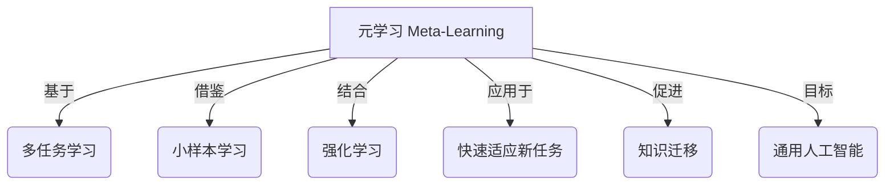
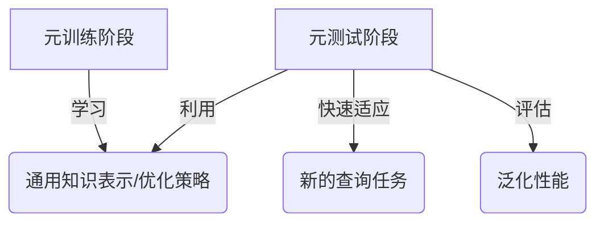

# 元学习 原理与代码实例讲解

## 1. 背景介绍

### 1.1 问题的由来

在传统的机器学习中，我们通常需要为每个新任务手动设计特征表示和模型架构,并从头开始训练模型。这种方法存在一些固有的缺陷:

1. **数据效率低下**: 对于每个新任务,我们都需要大量的标注数据来训练模型,这是一个代价高昂且重复的过程。

2. **泛化能力差**: 由于每个任务都是独立训练的,模型很难从之前学习到的知识中获益,从而在新任务上实现良好的泛化。

3. **缺乏适应性**: 当任务分布发生变化时,我们需要重新收集数据并从头开始训练新模型,这种方法缺乏灵活性和适应性。

为了解决这些问题,**元学习(Meta-Learning)** 应运而生。元学习旨在从多个相关任务中学习元知识,以便在遇到新任务时能够快速适应和学习。

### 1.2 研究现状

近年来,元学习在机器学习和人工智能领域引起了广泛关注,并取得了一些重要进展。主要研究方向包括:

1. **优化基元学习**: 通过设计特殊的优化算法,使模型能够快速适应新任务。代表性工作包括 MAML、Reptile 等。

2. **度量元学习**: 学习一个合适的距离度量,使得相似任务之间的知识可以有效传递。代表性工作包括 Siamese Networks、Matching Networks 等。

3. **生成模型元学习**: 通过生成模型,直接从任务分布中采样,生成用于新任务的初始模型或优化器。代表性工作包括 Meta-SGD、HyperNetworks 等。

4. **强化元学习**: 将元学习问题建模为强化学习问题,通过探索不同的策略来学习快速适应新任务的能力。代表性工作包括 RL^2、E-Trails 等。

### 1.3 研究意义

元学习的研究对于实现通用人工智能(Artificial General Intelligence, AGI)具有重要意义:

1. **提高数据效率**: 通过有效利用多任务之间的相关性,元学习可以大幅减少对于每个新任务所需的训练数据量。

2. **增强泛化能力**: 元学习使模型能够从之前学习到的知识中获益,从而在新任务上实现更好的泛化性能。

3. **提升适应能力**: 元学习赋予模型快速适应新环境和任务的能力,这种适应性是实现 AGI 的关键。

4. **促进知识迁移**: 元学习有助于实现跨任务、跨领域的知识迁移,这是构建通用人工智能系统的基础。

### 1.4 本文结构

本文将全面介绍元学习的核心概念、算法原理、数学模型、代码实现和应用场景,内容安排如下:

1. 核心概念与联系
2. 核心算法原理与具体操作步骤
3. 数学模型和公式详细讲解与案例分析
4. 项目实践:代码实例和详细解释说明
5. 实际应用场景
6. 工具和资源推荐
7. 总结:未来发展趋势与挑战
8. 附录:常见问题与解答

## 2. 核心概念与联系

元学习(Meta-Learning)是机器学习中的一个重要概念,旨在通过学习多个相关任务之间的共性知识,从而提高在新任务上的学习效率和泛化能力。

元学习与其他一些机器学习概念密切相关:

- **多任务学习(Multi-Task Learning)**: 元学习基于多个相关任务之间存在某种共性知识的假设,因此与多任务学习有着天然的联系。

- **小样本学习(Few-Shot Learning)**: 元学习旨在提高模型在小样本数据集上的学习能力,因此与小样本学习的目标高度一致。

- **强化学习(Reinforcement Learning)**: 一些元学习算法将快速适应新任务的过程建模为强化学习问题,通过探索不同的策略来优化模型的适应能力。

- **知识迁移(Transfer Learning)**: 元学习促进了跨任务、跨领域的知识迁移,这是构建通用人工智能系统的基础。

- **通用人工智能(Artificial General Intelligence, AGI)**: 元学习被认为是实现 AGI 的一个关键步骤,因为它赋予模型快速适应新环境和任务的能力。

## 3. 核心算法原理与具体操作步骤

元学习算法的核心思想是在多个相关任务上进行训练,从而学习一种通用的知识表示或优化策略,使得在遇到新任务时,模型能够快速适应并取得良好的性能。

### 3.1 算法原理概述

元学习算法通常包含两个主要阶段:

1. **元训练(Meta-Training)阶段**: 在这个阶段,算法在一系列支持任务(support tasks)上进行训练,目标是学习一种通用的知识表示或优化策略。

2. **元测试(Meta-Testing)阶段**: 在这个阶段,算法利用从支持任务中学习到的知识,快速适应新的查询任务(query tasks),并在这些任务上进行评估。

不同的元学习算法在具体实现上存在差异,但都遵循上述基本原理。接下来,我们将介绍几种典型的元学习算法。

### 3.2 算法步骤详解

#### 3.2.1 MAML (Model-Agnostic Meta-Learning)

MAML 是一种优化基元学习算法,其核心思想是在元训练阶段,通过一些支持任务,学习一个好的初始化参数,使得在元测试阶段,模型只需经过少量梯度更新,就能够快速适应新的查询任务。

MAML 算法的具体步骤如下:

1. 初始化模型参数 $\theta$
2. 对于每个支持任务 $\mathcal{T}_i$:
    a) 从 $\mathcal{T}_i$ 中采样一批训练数据 $\mathcal{D}_{\text{train}}$ 和测试数据 $\mathcal{D}_{\text{test}}$
    b) 计算在 $\mathcal{D}_{\text{train}}$ 上的损失函数 $\mathcal{L}_{\mathcal{T}_i}(\theta)$
    c) 通过梯度下降更新参数: $\theta' = \theta - \alpha \nabla_\theta \mathcal{L}_{\mathcal{T}_i}(\theta)$
    d) 计算在 $\mathcal{D}_{\text{test}}$ 上的损失函数 $\mathcal{L}_{\mathcal{T}_i}(\theta')$
3. 更新 $\theta$ 以最小化所有任务的测试损失: $\theta \leftarrow \theta - \beta \nabla_\theta \sum_{\mathcal{T}_i} \mathcal{L}_{\mathcal{T}_i}(\theta')$
4. 重复步骤 2-3,直到收敛

在元测试阶段,MAML 使用在元训练阶段学习到的初始化参数 $\theta$,并通过少量梯度更新即可适应新的查询任务。

#### 3.2.2 Reptile

Reptile 是另一种优化基元学习算法,其思想是在元训练阶段,通过支持任务的梯度更新,学习一个好的参数空间,使得在元测试阶段,模型只需在这个参数空间内进行少量更新,就能快速适应新任务。

Reptile 算法的具体步骤如下:

1. 初始化模型参数 $\theta$
2. 对于每个支持任务 $\mathcal{T}_i$:
    a) 从 $\mathcal{T}_i$ 中采样一批训练数据 $\mathcal{D}_{\text{train}}$
    b) 计算在 $\mathcal{D}_{\text{train}}$ 上的损失函数 $\mathcal{L}_{\mathcal{T}_i}(\theta)$
    c) 通过梯度下降更新参数: $\theta' = \theta - \alpha \nabla_\theta \mathcal{L}_{\mathcal{T}_i}(\theta)$
    d) 更新 $\theta$ 朝向 $\theta'$ 的方向: $\theta \leftarrow \theta + \beta (\theta' - \theta)$
3. 重复步骤 2,直到收敛

在元测试阶段,Reptile 使用在元训练阶段学习到的参数 $\theta$,并通过少量梯度更新即可适应新的查询任务。

#### 3.2.3 Matching Networks

Matching Networks 是一种度量元学习算法,其核心思想是学习一个合适的距离度量,使得相似的支持集和查询集之间的距离最小化。

Matching Networks 算法的具体步骤如下:

1. 初始化编码器网络 $f_\theta$ 和距离度量模块 $g_\phi$
2. 对于每个支持任务 $\mathcal{T}_i$:
    a) 从 $\mathcal{T}_i$ 中采样一批支持集 $\mathcal{S}$ 和查询集 $\mathcal{Q}$
    b) 计算支持集和查询集的嵌入: $\mathbf{x}_k = f_\theta(x_k), \forall x_k \in \mathcal{S} \cup \mathcal{Q}$
    c) 计算查询集样本与支持集样本之间的距离: $d(x, x') = g_\phi(\mathbf{x}, \mathbf{x'})$
    d) 根据距离进行分类,计算损失函数 $\mathcal{L}_{\mathcal{T}_i}(\theta, \phi)$
3. 更新参数 $\theta$ 和 $\phi$ 以最小化所有任务的损失: $\theta, \phi \leftarrow \theta - \alpha \nabla_{\theta, \phi} \sum_{\mathcal{T}_i} \mathcal{L}_{\mathcal{T}_i}(\theta, \phi)$
4. 重复步骤 2-3,直到收敛

在元测试阶段,Matching Networks 使用学习到的编码器网络 $f_\theta$ 和距离度量模块 $g_\phi$,对新的查询任务进行预测。

#### 3.2.4 Meta-SGD

Meta-SGD 是一种生成模型元学习算法,其核心思想是通过生成模型,直接从任务分布中采样,生成用于新任务的初始化参数或优化器。

Meta-SGD 算法的具体步骤如下:

1. 初始化生成模型参数 $\psi$
2. 对于每个支持任务 $\mathcal{T}_i$:
    a) 从任务分布 $p(\mathcal{T})$ 中采样一个新任务 $\mathcal{T}_i$
    b) 使用生成模型生成初始化参数或优化器: $\theta_i = g_\psi(\mathcal{T}_i)$
    c) 在任务 $\mathcal{T}_i$ 上训练模型,得到损失函数 $\mathcal{L}_{\mathcal{T}_i}(\theta_i)$
3. 更新生成模型参数 $\psi$ 以最小化所有任务的损失: $\psi \leftarrow \psi - \alpha \nabla_\psi \sum_{\mathcal{T}_i} \mathcal{L}_{\mathcal{T}_i}(g_\psi(\mathcal{T}_i))$
4. 重复步骤 2-3,直到收敛

在元测试阶段,Meta-SGD 使用学习到的生成模型 $g_\psi$,直接为新的查询任务生成初始化参数或优化器,从而快速适应该任务。

### 3.3 算法优缺点

不同的元学习算法各有优缺点,具体如下:

- **MAML**:
    - 优点: 算法思想简单直观,易于实现和理解。
    - 缺点: 需要对每个支持任务进行多次梯度更新,计算开销较大。

- **Reptile**:
    - 优点: 计算开销较小,训练过程更加简单