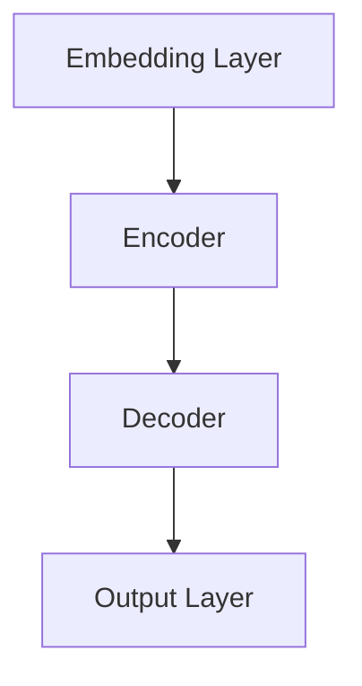

以下是根据您的要求撰写的技术博客文章《语言与思维：大模型的误解》的正文内容：

# 语言与思维：大模型的误解

## 1. 背景介绍

### 1.1 问题的由来

在过去的几年里,大型语言模型(Large Language Models,LLMs)的出现引发了人工智能领域的新热潮。这些模型通过在海量文本数据上进行训练,展现出令人惊叹的语言生成能力,在自然语言处理、问答系统、写作辅助等领域取得了突破性的进展。

然而,随着大模型的广泛应用,一些误解和质疑也开始浮现。人们开始怀疑这些模型是否真正"理解"语言的内涵,或者它们只是在模拟人类的语言行为。这种质疑不仅关乎模型本身的能力边界,更深层次地涉及了语言、思维和智能之间的关系。

### 1.2 研究现状

目前,关于大模型的语言理解能力存在着不同的观点和解释。支持者认为,通过足够大的模型和训练数据,大模型可以捕捉到语言的深层次语义和逻辑关系,从而实现真正的语言理解。而怀疑者则认为,大模型只是在进行模式匹配和统计规律的拟合,缺乏对语言内涵的深入理解。

此外,一些研究者提出,语言理解不仅需要语言知识,还需要与外部世界的交互和经验累积。单纯依赖文本数据训练可能无法赋予模型真正的理解能力。

### 1.3 研究意义

探讨大模型的语言理解能力,不仅关乎人工智能技术本身的发展方向,更深层次地涉及了人类对语言、思维和智能的认知。通过深入分析大模型的优缺点和局限性,我们可以更好地理解语言与思维之间的关系,从而指导未来的人工智能研究和应用。

### 1.4 本文结构

本文将从以下几个方面深入探讨大模型的语言理解能力:

1. 核心概念与联系:阐述语言、思维和智能之间的关系,以及大模型在其中的定位。
2. 核心算法原理与具体操作步骤:剖析大模型的核心算法原理,并详细解释其训练和推理过程。
3. 数学模型和公式详细讲解:介绍大模型中常用的数学模型和公式,并通过案例分析加深理解。
4. 项目实践:提供大模型的代码实现示例,并对关键部分进行详细解释。
5. 实际应用场景:探讨大模型在自然语言处理等领域的实际应用,并展望未来的发展方向。
6. 工具和资源推荐:推荐相关的学习资源、开发工具和论文,方便读者进一步深入研究。
7. 总结:对大模型的语言理解能力进行总结,并阐述未来面临的挑战和发展趋势。
8. 附录:回答一些常见的问题,帮助读者更好地理解相关概念。

## 2. 核心概念与联系

语言、思维和智能是密切相关的概念,它们之间存在着复杂的联系和相互影响。语言是人类表达思维和交流的工具,而思维则是认知和理解世界的过程。智能则是指个体对于信息的获取、处理、存储和运用的综合能力。

大型语言模型(LLMs)的出现,为我们探讨语言、思维和智能之间的关系提供了新的视角。这些模型通过在海量文本数据上进行训练,展现出了惊人的语言生成能力,似乎在某种程度上模拟了人类的语言行为。

然而,我们需要谨慎地看待大模型在语言理解方面的能力。虽然它们可以生成看似合理的语言输出,但这并不意味着它们真正理解了语言的内涵和背后的思维逻辑。语言理解不仅需要掌握语法和词汇,更需要将语言与外部世界的知识和经验相结合,形成对概念和事物的深入理解。

因此,探讨大模型的语言理解能力,实际上是在探讨语言、思维和智能之间的关系。我们需要明确大模型在这一关系中的定位,并客观评估它们的优缺点和局限性。只有这样,我们才能更好地指导人工智能技术的发展方向,并推动对语言、思维和智能本质的深入理解。

## 3. 核心算法原理与具体操作步骤

### 3.1 算法原理概述

大型语言模型(LLMs)的核心算法原理是基于自然语言处理(NLP)领域中的transformer模型。transformer模型是一种基于注意力机制(Attention Mechanism)的序列到序列(Seq2Seq)模型,它可以有效地捕捉输入序列中不同位置之间的长距离依赖关系。

在训练过程中,transformer模型会在海量的文本数据上进行自监督学习,目标是最大化下一个词的预测概率。通过这种方式,模型可以学习到语言的统计规律和上下文信息,从而获得强大的语言生成能力。

### 3.2 算法步骤详解

大型语言模型的训练和推理过程可以概括为以下几个主要步骤:

1. **数据预处理**:将原始文本数据进行tokenization(分词)、数字化编码等预处理操作,以便模型可以接受输入。

2. **嵌入层(Embedding Layer)**:将数字化的输入token映射到一个连续的向量空间,作为模型的初始输入表示。

3. **编码器(Encoder)**:编码器是transformer模型的核心部分,它由多个编码器层(Encoder Layer)组成。每个编码器层包含一个多头注意力子层(Multi-Head Attention Sublayer)和一个前馈神经网络子层(Feed-Forward Neural Network Sublayer)。注意力机制可以捕捉输入序列中不同位置之间的依赖关系,而前馈神经网络则对每个位置的表示进行非线性转换。

4. **解码器(Decoder)(可选)**:对于序列生成任务(如机器翻译、文本生成等),解码器会根据编码器的输出和前一步生成的token,预测下一个token。解码器的结构与编码器类似,但增加了一个掩码的多头注意力子层,以确保每个位置的预测只依赖于之前的token。

5. **输出层(Output Layer)**:输出层根据解码器(或编码器)的最终输出,计算每个可能token的概率分布,并选择概率最大的token作为输出。

6. **训练**:在训练阶段,模型会最小化输出token与真实token之间的交叉熵损失,通过反向传播算法更新模型参数。

7. **推理**:在推理阶段,模型会根据给定的起始token(或prompt),自回归地生成下一个token,直到达到预设的长度或生成终止token。

通过上述步骤,大型语言模型可以学习到语言的统计规律和上下文信息,从而获得强大的语言生成能力。然而,这种能力是否等同于真正的语言理解,仍然存在争议。

### 3.3 算法优缺点

大型语言模型的算法具有以下优缺点:

**优点**:

- 强大的语言生成能力,可以生成看似自然、流畅的文本。
- 通过自监督学习,可以从海量的文本数据中学习到丰富的语言知识。
- 注意力机制可以有效捕捉长距离依赖关系,提高了模型的表现。
- 可以通过预训练和微调的方式,快速适应新的任务和领域。

**缺点**:

- 缺乏对语言内涵和背后逻辑的深入理解,只是在模拟语言的表面形式。
- 容易受训练数据的偏差和噪声影响,产生不合理或有偏见的输出。
- 对于缺乏训练数据覆盖的领域,模型的表现可能较差。
- 训练过程计算量大,对硬件资源要求高。
- 缺乏常识推理和因果推理能力,难以处理复杂的推理任务。

### 3.4 算法应用领域

尽管存在一定的局限性,大型语言模型的算法仍然在自然语言处理领域展现出了广泛的应用前景,包括但不限于:

- **文本生成**:如新闻写作、故事创作、广告文案等。
- **对话系统**:如智能客服、虚拟助手等。
- **机器翻译**:将一种语言的文本翻译成另一种语言。
- **文本摘要**:自动生成文本的摘要或概述。
- **情感分析**:分析文本中的情感倾向(正面、负面等)。
- **命名实体识别**:识别文本中的人名、地名、组织机构名等实体。
- **问答系统**:根据给定的问题,从知识库中检索相关答案。

未来,随着算法和硬件的进一步发展,大型语言模型的应用领域有望进一步扩展。

## 4. 数学模型和公式详细讲解与举例说明

### 4.1 数学模型构建

在大型语言模型中,常用的数学模型是基于transformer的序列到序列(Seq2Seq)模型。该模型的核心思想是将输入序列(如一段文本)映射到另一个输出序列(如该文本的翻译或续写)。

transformer模型的基本结构如下所示:

其中,Embedding Layer将输入token映射到连续的向量空间;Encoder捕捉输入序列中的上下文信息;Decoder根据Encoder的输出和前一步生成的token,预测下一个token;Output Layer则输出每个可能token的概率分布。

在transformer的Encoder和Decoder中,关键的组件是多头注意力机制(Multi-Head Attention)和前馈神经网络(Feed-Forward Neural Network)。多头注意力机制可以捕捉输入序列中不同位置之间的依赖关系,而前馈神经网络则对每个位置的表示进行非线性转换。

### 4.2 公式推导过程

transformer模型中的核心公式是注意力机制(Attention Mechanism)。注意力机制的基本思想是,在生成一个输出token时,不是简单地基于当前token,而是根据输入序列中的所有token,赋予不同的注意力权重。

具体来说,对于一个查询向量 $q$、键向量 $k$ 和值向量 $v$,注意力机制的计算过程如下:

$$\begin{aligned}
\text{Attention}(q, k, v) &= \text{softmax}\left(\frac{qk^T}{\sqrt{d_k}}\right)v \
&= \sum_{i=1}^n \alpha_i v_i
\end{aligned}$$

其中,

- $q$、$k$、$v$ 分别表示查询向量、键向量和值向量
- $d_k$ 是键向量的维度,用于缩放点积的值
- $\alpha_i = \text{softmax}\left(\frac{qk_i^T}{\sqrt{d_k}}\right)$ 表示查询向量 $q$ 对键向量 $k_i$ 的注意力权重
- $v_i$ 是对应于键向量 $k_i$ 的值向量

注意力机制的核心在于通过查询向量和键向量的相似性(点积)来计算注意力权重,然后将注意力权重与值向量相乘,得到加权求和的注意力表示。

在transformer模型中,注意力机制被应用于不同的子层,如编码器中的自注意力(Self-Attention)和解码器中的掩码自注意力(Masked Self-Attention)等。此外,还引入了多头注意力(Multi-Head Attention)的概念,将注意力机制在不同的子空间中并行运行,以捕捉更丰富的依赖关系。

### 4.3 案例分析与讲解

为了更好地理解注意力机制的工作原理,我们可以通过一个简单的案例进行分析和讲解。

假设我们有一个输入序列 "The cat sat on the mat"。在生成下一个token时,模型需要根据整个输入序列来确定注意力权重。

1. 首先,我们将输入序列中的每个token映射到一个连续的向量空间,得到查询向量 $q$、键向量 $k$ 和值向量 $v$。

2. 然后,计算查询向量 $q$ 与每个键