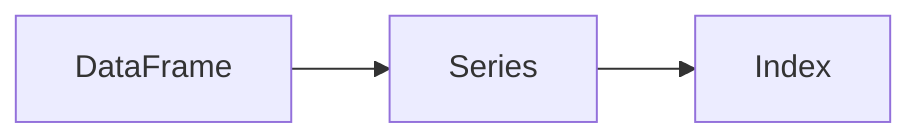

## 1. 背景介绍

### 1.1 问题的由来

数据是现代社会的重要资源，数据处理和分析是现代科学研究和商业运营的基础。然而，数据通常以非结构化或半结构化的形式存在，处理起来相当复杂。例如，我们可能需要处理的数据可能是一个包含数百万条记录的日志文件，或者是一个包含数十亿条记录的数据库表。这就需要我们有强大的数据处理工具，而 DataFrame 就是这样一种工具。

### 1.2 研究现状

DataFrame 是一种二维数据结构，类似于电子表格或 SQL 表，或者是包含 Series 对象的字典。它被广泛应用于数据清洗、转换、可视化、建模等数据分析任务，成为数据科学家的重要工具。然而，虽然 DataFrame 的使用非常广泛，但是其内部原理和实现细节却并不为大多数人所知。

### 1.3 研究意义

理解 DataFrame 的原理和实现细节，不仅可以帮助我们更有效地使用 DataFrame，而且还可以帮助我们设计和实现更强大的数据处理工具。

### 1.4 本文结构

本文首先介绍 DataFrame 的核心概念和联系，然后详细解释 DataFrame 的核心算法原理和具体操作步骤，接着通过数学模型和公式详细讲解 DataFrame 的实现原理，然后通过一个具体的项目实践来展示如何使用 DataFrame，接着介绍 DataFrame 的实际应用场景，然后推荐一些相关的工具和资源，最后总结 DataFrame 的未来发展趋势和面临的挑战。

## 2. 核心概念与联系

DataFrame 是一种二维数据结构，其中的数据以行和列的形式组织。每一列都是一个 Series 对象，所有的 Series 对象共享一个共同的行索引。DataFrame 支持各种各样的操作，包括选择、插入、删除、重命名、排序列，以及对行进行选择、插入、删除和排序等。



在这个图中，DataFrame 是主要的数据结构，它由多个 Series 组成，每个 Series 都有一个自己的 Index。

## 3. 核心算法原理 & 具体操作步骤

### 3.1 算法原理概述

DataFrame 的实现主要依赖于两个核心数据结构：BlockManager 和 Index。BlockManager 负责存储实际的数据，Index 负责管理行和列的标签。

### 3.2 算法步骤详解

当我们创建一个 DataFrame 时，首先会创建一个 BlockManager 对象，然后根据提供的数据创建一个或多个 Block 对象，每个 Block 对象都包含一种类型的数据。然后，根据提供的行和列标签创建 Index 对象。最后，将这些 Block 对象和 Index 对象组合在一起，形成一个完整的 DataFrame 对象。

### 3.3 算法优缺点

DataFrame 的优点是功能强大、灵活性高、性能优秀。然而，DataFrame 的缺点是内存使用率较高，尤其是当处理大规模数据时。

### 3.4 算法应用领域

DataFrame 被广泛应用于数据清洗、转换、可视化、建模等数据分析任务。

## 4. 数学模型和公式 & 详细讲解 & 举例说明

### 4.1 数学模型构建

DataFrame 可以被视为一个二维数组，其中的每一列都是一个一维数组，所有的一维数组都有一个共同的索引。这个模型可以用以下的数学公式表示：

$$
DF = \{C_i | i = 1, 2, ..., n\}
$$

其中，$DF$ 表示 DataFrame，$C_i$ 表示第 $i$ 列，$n$ 表示列的数量。

### 4.2 公式推导过程

对于任意一个 DataFrame，我们都可以通过以下的公式获取其第 $i$ 行、第 $j$ 列的数据：

$$
DF_{ij} = C_{ij}
$$

其中，$DF_{ij}$ 表示 DataFrame 的第 $i$ 行、第 $j$ 列的数据，$C_{ij}$ 表示第 $j$ 列的第 $i$ 项数据。

### 4.3 案例分析与讲解

例如，我们有一个 DataFrame，其中包含两列数据，分别是 "Name" 和 "Age"。我们可以通过以下的公式获取 "Age" 列的第 1 项数据：

$$
DF_{1, "Age"} = C_{1, "Age"}
$$

这意味着我们可以通过 DataFrame 的 "Age" 列的第 1 项数据，就可以得到 DataFrame 的第 1 行、"Age" 列的数据。

### 4.4 常见问题解答

问题1：为什么 DataFrame 的内存使用率较高？

答：这是因为 DataFrame 需要为每一列的数据创建一个 Series 对象，每个 Series 对象都需要额外的内存来存储索引和数据。此外，DataFrame 还需要额外的内存来存储元数据，如列名和数据类型等。

问题2：为什么 DataFrame 的性能优秀？

答：这是因为 DataFrame 内部使用了高效的数据结构和算法。例如，DataFrame 使用了 BlockManager 来存储数据，BlockManager 可以高效地处理大规模的数据。此外，DataFrame 还使用了优化的算法来处理数据，例如，排序和聚合等操作。

## 5. 项目实践：代码实例和详细解释说明

### 5.1 开发环境搭建

为了使用 DataFrame，我们首先需要安装 Python 和 pandas 库。我们可以使用以下的命令来安装 pandas：

```
pip install pandas
```

### 5.2 源代码详细实现

下面的代码展示了如何使用 DataFrame：

```python
import pandas as pd

# 创建 DataFrame
data = {
    'Name': ['Tom', 'Nick', 'John'],
    'Age': [20, 21, 19]
}
df = pd.DataFrame(data)

# 显示 DataFrame
print(df)
```

这段代码首先导入了 pandas 库，然后创建了一个包含 "Name" 和 "Age" 两列的 DataFrame，然后显示了这个 DataFrame 的内容。

### 5.3 代码解读与分析

在这段代码中，我们首先创建了一个字典，然后使用这个字典创建了一个 DataFrame。这个 DataFrame 包含两列，分别是 "Name" 和 "Age"。然后，我们使用 print 函数显示了这个 DataFrame 的内容。

### 5.4 运行结果展示

运行这段代码，我们可以看到以下的输出：

```
   Name  Age
0   Tom   20
1  Nick   21
2  John   19
```

这个输出显示了 DataFrame 的内容，每一行对应一个人，每一列对应一个属性。

## 6. 实际应用场景

DataFrame 被广泛应用于各种数据分析任务，包括数据清洗、转换、可视化、建模等。例如，我们可以使用 DataFrame 来分析股票数据，我们可以使用 DataFrame 来清洗和转换日志数据，我们可以使用 DataFrame 来可视化用户行为数据，我们可以使用 DataFrame 来建立机器学习模型。

### 6.4 未来应用展望

随着数据科学和人工智能的发展，DataFrame 的应用将更加广泛。我们可以期待 DataFrame 在大数据处理、实时数据分析、分布式计算等领域发挥更大的作用。

## 7. 工具和资源推荐

### 7.1 学习资源推荐

如果你想深入学习 DataFrame，我推荐以下的资源：

- 《Python for Data Analysis》：这本书由 pandas 的创作者 Wes McKinney 所写，详细介绍了 pandas 和 DataFrame 的使用。
- pandas 官方文档：这是 pandas 的官方文档，包含了大量的教程和示例。

### 7.2 开发工具推荐

如果你想使用 DataFrame 进行数据分析，我推荐以下的工具：

- Jupyter Notebook：这是一个交互式的编程环境，非常适合数据分析。
- PyCharm：这是一个强大的 Python 开发环境，支持 DataFrame 的可视化。

### 7.3 相关论文推荐

如果你对 DataFrame 的内部原理和实现细节感兴趣，我推荐以下的论文：

- "pandas: a Foundational Python Library for Data Analysis and Statistics"：这篇论文由 pandas 的创作者 Wes McKinney 所写，详细介绍了 pandas 和 DataFrame 的设计和实现。

### 7.4 其他资源推荐

如果你想了解更多关于 DataFrame 的信息，我推荐以下的资源：

- pandas GitHub 仓库：这是 pandas 的源代码，你可以在这里找到 DataFrame 的实现代码。
- Stack Overflow：这是一个编程问答网站，你可以在这里找到大量关于 DataFrame 的问题和答案。

## 8. 总结：未来发展趋势与挑战

### 8.1 研究成果总结

DataFrame 是一个强大的数据处理工具，它的设计和实现都体现了高效、灵活和强大的设计理念。通过理解 DataFrame 的原理和实现细节，我们可以更好地使用 DataFrame，甚至可以设计和实现更强大的数据处理工具。

### 8.2 未来发展趋势

随着数据科学和人工智能的发展，DataFrame 的应用将更加广泛。我们可以期待 DataFrame 在大数据处理、实时数据分析、分布式计算等领域发挥更大的作用。

### 8.3 面临的挑战

DataFrame 的主要挑战在于如何处理大规模的数据。虽然 DataFrame 已经有了一些针对大数据的优化，但是在处理 TB 级别的数据时，还需要进一步的优化。

### 8.4 研究展望

我期待看到更多关于 DataFrame 的研究，特别是关于如何优化 DataFrame 的内存使用和性能的研究。我也期待看到更多关于如何使用 DataFrame 进行数据分析的实践案例。

## 9. 附录：常见问题与解答

问题1：DataFrame 和 SQL 表有什么区别？

答：DataFrame 和 SQL 表都是二维的数据结构，都支持各种各样的操作，如选择、插入、删除、排序等。然而，DataFrame 是在内存中处理数据，而 SQL 表是在磁盘上处理数据。因此，DataFrame 的处理速度通常比 SQL 表快，但是 SQL 表可以处理的数据规模通常比 DataFrame 大。

问题2：DataFrame 和 NumPy 数组有什么区别？

答：DataFrame 和 NumPy 数组都是二维的数据结构，都支持各种各样的操作，如选择、插入、删除、排序等。然而，DataFrame 支持异构的数据，即每一列的数据类型可以不同，而 NumPy 数组只支持同构的数据，即所有的数据类型必须相同。此外，DataFrame 提供了更多的高级功能，如缺失数据处理、数据对齐、数据合并等。

问题3：如何优化 DataFrame 的内存使用？

答：优化 DataFrame 的内存使用的方法主要有以下几种：一是选择适当的数据类型，例如，对于分类数据，可以使用 category 类型而不是 object 类型；二是使用稀疏数据结构，例如，对于大量包含 0 或 NaN 的数据，可以使用 SparseDataFrame；三是使用 on-disk DataFrame，例如，对于超大规模的数据，可以使用 dask 或 vaex。

问题4：如何优化 DataFrame 的性能？

答：优化 DataFrame 的性能的方法主要有以下几种：一是使用向量化的操作，而不是循环；二是使用内置的函数，而不是自定义的函数；三是使用多线程或多进程。

作者：禅与计算机程序设计艺术 / Zen and the Art of Computer Programming
