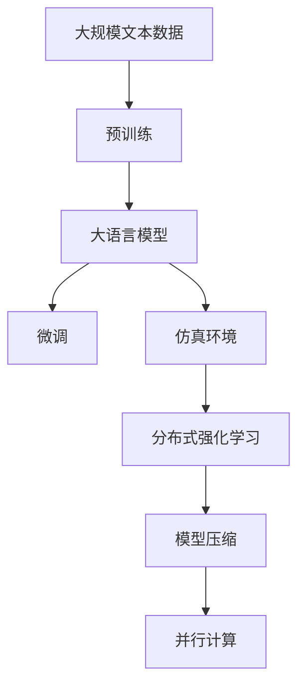

                 

# 一切皆是映射：探索DQN在仿真环境中的应用与挑战

> 关键词：深度Q网络(DQN),仿真环境,强化学习,分布式强化学习,模型压缩,并行计算

## 1. 背景介绍

### 1.1 问题由来
随着强化学习（Reinforcement Learning, RL）技术的不断进步，深度强化学习（Deep Reinforcement Learning, DRL）成为探索智能体在复杂环境中自主决策、适应环境变化的重要手段。在实际应用中，DRL算法如深度Q网络（Deep Q-Network, DQN）被广泛应用于游戏、机器人、自动化控制等多个领域。

然而，由于现实世界环境的不确定性和复杂性，DRL在许多场景中面临巨大的挑战。例如，DRL算法难以适应瞬息万变的环境，且需要大量计算资源和数据来训练模型。因此，研究人员开始探索在仿真环境中进行DRL训练的方法，以克服现实世界的局限性。

### 1.2 问题核心关键点
在仿真环境中进行DRL训练的核心在于：
1. 仿真环境的搭建：需要构建逼真的模拟环境，以便智能体在其中进行有效的学习和决策。
2. 数据生成与采集：在仿真环境中生成大量不同情境下的数据，训练智能体。
3. 算法优化与调整：针对仿真环境的特点，调整和优化DQN算法。
4. 分布式训练与并行计算：利用多计算资源进行分布式训练，提高训练效率。
5. 模型压缩与部署：将训练好的模型进行压缩和部署，以便在实际应用中进行实时决策。

### 1.3 问题研究意义
仿真环境中的DRL训练方法，为智能体在实际环境中的行为决策提供了更为稳定和可控的训练条件。同时，仿真环境的构建与使用，有助于研究人员更好地理解算法的学习过程和性能表现，为实际应用提供理论支持和实验基础。

此外，通过仿真环境中的DRL训练，可以模拟极端条件和异常情况，为智能体的鲁棒性和安全性提供保障。这对于提升实际应用中智能体的性能和可靠性具有重要意义。

## 2. 核心概念与联系

### 2.1 核心概念概述

为了更好地理解DQN在仿真环境中的应用与挑战，本节将介绍几个密切相关的核心概念：

- 强化学习（Reinforcement Learning, RL）：通过智能体与环境的交互，学习如何在特定环境中最大化奖励函数的一种机器学习方法。
- 深度Q网络（Deep Q-Network, DQN）：一种基于神经网络的强化学习算法，通过学习和优化Q值函数，指导智能体进行最优决策。
- 仿真环境（Simulated Environment）：通过软件或硬件模拟的虚拟环境，用于进行智能体的训练和测试。
- 分布式强化学习（Distributed Reinforcement Learning, DRL）：利用多台计算资源，并行进行智能体训练的强化学习方法。
- 模型压缩（Model Compression）：将大型的深度神经网络模型压缩成更小、更轻量级的模型，以降低计算和存储成本。
- 并行计算（Parallel Computing）：利用多台计算机或多个CPU同时计算，提高计算效率的技术。

这些核心概念之间的逻辑关系可以通过以下Mermaid流程图来展示：

```mermaid
graph TB
    A[强化学习] --> B[深度Q网络(DQN)]
    A --> C[仿真环境]
    B --> D[分布式强化学习]
    C --> E[模型压缩]
    C --> F[并行计算]
```

这个流程图展示了大语言模型微调过程中各个核心概念的关系：

1. 强化学习是基础，提供了智能体与环境交互的基本框架。
2. 深度Q网络基于神经网络，能够学习复杂环境下的决策策略。
3. 仿真环境为智能体的训练提供了可控的模拟环境。
4. 分布式强化学习利用多计算资源，提升训练效率。
5. 模型压缩和并行计算则是在实际应用中优化资源消耗、提高推理效率的必备手段。

### 2.2 概念间的关系

这些核心概念之间存在着紧密的联系，形成了DRL训练的完整生态系统。下面我们通过几个Mermaid流程图来展示这些概念之间的关系。

#### 2.2.1 强化学习与深度Q网络的关系

```mermaid
graph LR
    A[强化学习] --> B[深度Q网络(DQN)]
```

这个流程图展示了强化学习与深度Q网络的关系：深度Q网络是强化学习中一种重要的模型，用于指导智能体在复杂环境中进行最优决策。

#### 2.2.2 仿真环境与深度Q网络的关系

```mermaid
graph LR
    A[仿真环境] --> B[深度Q网络(DQN)]
```

这个流程图展示了仿真环境与深度Q网络的关系：深度Q网络在仿真环境中进行训练，学习在虚拟环境中的决策策略。

#### 2.2.3 分布式强化学习与深度Q网络的关系

```mermaid
graph TB
    A[分布式强化学习] --> B[深度Q网络(DQN)]
```

这个流程图展示了分布式强化学习与深度Q网络的关系：分布式强化学习可以并行训练多个深度Q网络，提高训练效率。

#### 2.2.4 模型压缩与深度Q网络的关系

```mermaid
graph LR
    A[模型压缩] --> B[深度Q网络(DQN)]
```

这个流程图展示了模型压缩与深度Q网络的关系：模型压缩可以减小深度Q网络的尺寸，降低计算和存储成本。

#### 2.2.5 并行计算与深度Q网络的关系

```mermaid
graph LR
    A[并行计算] --> B[深度Q网络(DQN)]
```

这个流程图展示了并行计算与深度Q网络的关系：并行计算可以加速深度Q网络的训练过程，提高计算效率。

### 2.3 核心概念的整体架构

最后，我们用一个综合的流程图来展示这些核心概念在大语言模型微调过程中的整体架构：



这个综合流程图展示了从预训练到微调，再到仿真训练的完整过程。大语言模型首先在大规模文本数据上进行预训练，然后通过微调（包括分布式强化学习和模型压缩）在仿真环境中进行训练，最终部署到实际应用系统中。通过这些流程图，我们可以更清晰地理解大语言模型微调过程中各个核心概念的关系和作用。

## 3. 核心算法原理 & 具体操作步骤
### 3.1 算法原理概述

在仿真环境中，深度Q网络（DQN）的应用通常包括以下步骤：

1. **仿真环境构建**：设计并实现一个逼真的虚拟环境，该环境能够模拟智能体与环境的交互，并生成相关的反馈数据。
2. **智能体设计**：设计智能体的决策策略，并将其编码为神经网络模型，用于学习和优化Q值函数。
3. **数据生成与采集**：在仿真环境中，通过智能体与环境的交互，生成大量不同情境下的数据，供训练使用。
4. **算法优化与调整**：针对仿真环境的特点，调整和优化DQN算法，以适应特定的学习需求。
5. **分布式训练与并行计算**：利用多台计算资源进行分布式训练，提高训练效率。
6. **模型压缩与部署**：将训练好的模型进行压缩和部署，以便在实际应用中进行实时决策。

### 3.2 算法步骤详解

以下我们将详细介绍DQN在仿真环境中的应用步骤：

**Step 1: 仿真环境搭建**
- 设计虚拟环境，包括环境状态空间、动作空间、奖励函数等关键组件。
- 实现环境渲染、交互逻辑等，使智能体能够在该环境中进行有效的学习和决策。
- 利用模拟工具（如PyBullet、Unity等）搭建环境，并进行调试和测试。

**Step 2: 智能体设计**
- 设计智能体的决策策略，如策略网络（Policy Network）和价值网络（Value Network）。
- 将策略网络设计为多层神经网络，用于生成动作策略。
- 将价值网络设计为多层神经网络，用于预测状态值。
- 将策略网络和价值网络在GPU上进行训练，加速学习过程。

**Step 3: 数据生成与采集**
- 在仿真环境中，通过智能体与环境的交互，生成大量不同情境下的数据。
- 对数据进行预处理，包括归一化、去噪等，以便进行有效的训练。
- 使用分布式计算框架（如TensorFlow、PyTorch等）生成训练数据集。

**Step 4: 算法优化与调整**
- 在DQN算法的基础上，引入分布式强化学习技术，如A3C（Actor-Critic）、PPO（Proximal Policy Optimization）等。
- 设计分布式训练框架，将多台计算机或多个GPU并行进行训练。
- 根据仿真环境的特点，调整DQN的参数设置，如学习率、探索率、折扣因子等。

**Step 5: 分布式训练与并行计算**
- 在分布式环境中，使用多台计算机或多个GPU进行并行计算。
- 利用深度学习框架提供的分布式训练功能，实现多节点并行训练。
- 监控训练进程，记录训练日志，分析训练效率和性能。

**Step 6: 模型压缩与部署**
- 对训练好的模型进行压缩，减少计算和存储成本。
- 将压缩后的模型部署到实际应用环境中，进行实时决策。
- 利用优化算法，如剪枝、量化、蒸馏等，进一步压缩模型。

### 3.3 算法优缺点

DQN在仿真环境中的应用具有以下优点：

1. **可控性高**：仿真环境中的智能体可以在受控的环境中学习，避免现实环境中的干扰和不确定性。
2. **学习效率高**：仿真环境中的智能体可以大量重复训练，快速提升学习效果。
3. **灵活性高**：仿真环境可以设计成任意复杂度，用于模拟不同类型的环境和任务。
4. **可重复性高**：仿真环境中的实验结果具有高可重复性，便于验证和调试。

然而，DQN在仿真环境中的应用也存在一些缺点：

1. **仿真质量依赖于环境设计**：仿真环境的设计质量和复杂度对智能体的学习效果有很大影响。
2. **数据生成成本高**：大量数据生成和采集需要耗费大量时间和计算资源。
3. **分布式计算需求高**：并行计算和分布式训练需要多台计算机或多个GPU的支持。
4. **模型压缩难度大**：复杂模型压缩和优化需要较高的技术门槛。

### 3.4 算法应用领域

DQN在仿真环境中的应用，已经在游戏、机器人、自动化控制等多个领域得到了广泛应用，具体包括：

- **游戏AI**：利用DQN训练游戏中的AI角色，提升游戏智能体的决策能力。
- **机器人控制**：利用DQN训练机器人的动作策略，使其能够自主完成复杂的任务。
- **自动化控制**：利用DQN训练自动驾驶系统，提高其在复杂环境中的驾驶能力。
- **工业自动化**：利用DQN训练智能工厂中的机器人和设备，提升其生产效率和自动化水平。
- **医疗仿真**：利用DQN训练医疗模拟系统，提升医生的诊断和治疗能力。

除了上述这些经典应用外，DQN在仿真环境中的应用还在不断拓展，为更多新兴领域提供智能解决方案。

## 4. 数学模型和公式 & 详细讲解  
### 4.1 数学模型构建

在本节中，我们将介绍DQN在仿真环境中的数学模型构建。

设智能体在环境中的状态为 $s$，动作为 $a$，状态值函数为 $Q(s,a)$，折扣因子为 $\gamma$，奖励函数为 $r$，最优Q值函数为 $Q^\star(s,a)$。DQN的目标是最大化智能体在状态-动作对的价值函数 $Q(s,a)$。

根据动态规划，智能体的最优动作策略可以表示为：

$$
\pi^\star(a|s) = \arg\max_a Q^\star(s,a)
$$

其中，$\pi^\star(a|s)$ 表示在状态 $s$ 下采取动作 $a$ 的概率分布。

### 4.2 公式推导过程

在DQN中，智能体通过与环境交互，学习最优Q值函数 $Q^\star$，从而指导决策。具体步骤如下：

1. **策略更新**：智能体根据当前状态 $s$，利用策略网络 $\pi$ 生成动作 $a$。
2. **动作执行**：智能体在环境中执行动作 $a$，观察到下一个状态 $s'$ 和奖励 $r$。
3. **状态值函数更新**：根据观察到的状态 $s'$ 和奖励 $r$，利用价值网络 $V$ 更新Q值函数。
4. **策略优化**：使用更新后的Q值函数，优化策略网络 $\pi$，使其能更好地预测最优动作。

具体来说，DQN的策略更新公式为：

$$
\pi(a|s) = \frac{\exp(Q(s,a)/\sigma)}{\sum_{a'}\exp(Q(s,a')/\sigma)}
$$

其中，$\sigma$ 为控制策略分布的参数。

动作执行和状态值函数更新的公式为：

$$
r + \gamma \max_a Q_{target}(s',a') = Q(s,a)
$$

其中，$Q_{target}$ 为目标Q值函数，用于更新Q值函数。

最终，通过反向传播算法，更新智能体的策略网络和价值网络，以最小化状态值函数与目标状态值函数的误差。

### 4.3 案例分析与讲解

下面我们以游戏AI训练为例，详细讲解DQN在仿真环境中的应用。

假设我们训练一个游戏的AI角色，使其能够在不同情境下选择最优动作。我们构建一个虚拟游戏环境，该环境能够模拟游戏中的各种场景和挑战。

1. **环境设计**：设计虚拟游戏环境，包括地图、角色、任务等。
2. **智能体设计**：设计智能体的策略网络，用于选择最优动作。
3. **数据生成与采集**：在虚拟环境中生成大量不同情境下的数据，用于训练智能体。
4. **算法优化与调整**：调整DQN的参数设置，如学习率、探索率、折扣因子等。
5. **分布式训练与并行计算**：利用多台计算机或多个GPU进行并行计算。
6. **模型压缩与部署**：对训练好的模型进行压缩和部署，以便在实际游戏中进行实时决策。

在训练过程中，我们不断调整智能体的策略网络，使其在各种情境下选择最优动作，最终训练出一个高智能度的AI角色。

## 5. 项目实践：代码实例和详细解释说明
### 5.1 开发环境搭建

在进行DQN项目实践前，我们需要准备好开发环境。以下是使用Python进行TensorFlow开发的开发环境配置流程：

1. 安装Anaconda：从官网下载并安装Anaconda，用于创建独立的Python环境。

2. 创建并激活虚拟环境：
```bash
conda create -n tf-env python=3.8 
conda activate tf-env
```

3. 安装TensorFlow：根据CUDA版本，从官网获取对应的安装命令。例如：
```bash
conda install tensorflow=2.6
```

4. 安装各类工具包：
```bash
pip install numpy pandas scikit-learn matplotlib tqdm jupyter notebook ipython
```

完成上述步骤后，即可在`tf-env`环境中开始DQN项目实践。

### 5.2 源代码详细实现

下面我们以游戏AI训练为例，给出使用TensorFlow对DQN模型进行训练的Python代码实现。

首先，定义智能体的策略网络和价值网络：

```python
import tensorflow as tf

class Policy(tf.keras.Model):
    def __init__(self, input_dim, output_dim):
        super(Policy, self).__init__()
        self.layers = [
            tf.keras.layers.Dense(64, activation='relu'),
            tf.keras.layers.Dense(output_dim, activation='softmax')
        ]

    def call(self, inputs):
        x = inputs
        for layer in self.layers:
            x = layer(x)
        return x

class Value(tf.keras.Model):
    def __init__(self, input_dim, output_dim):
        super(Value, self).__init__()
        self.layers = [
            tf.keras.layers.Dense(64, activation='relu'),
            tf.keras.layers.Dense(output_dim, activation='linear')
        ]

    def call(self, inputs):
        x = inputs
        for layer in self.layers:
            x = layer(x)
        return x
```

接着，定义训练函数：

```python
def train(model, env, batch_size=32, learning_rate=0.001, explore_rate=0.1, discount_factor=0.9, episodes=1000):
    for episode in range(episodes):
        state = env.reset()
        done = False
        episode_reward = 0

        while not done:
            action_probs = model(input_tensor(state))
            action = tf.random.categorical(action_probs, num_samples=1)[-1,0].numpy()
            next_state, reward, done, _ = env.step(action)

            if done:
                episode_reward += reward
                print(f"Episode {episode+1}: Reward {episode_reward}")
            else:
                target = reward + discount_factor * tf.reduce_max(model(input_tensor(next_state))[0])
                target_loss = tf.reduce_mean(tf.square(model(input_tensor(state))[0] - target))
                model.trainable_variables[0].assign_add(learning_rate * tf.math.exp(-episode * explore_rate) * (target - model(input_tensor(state))[0]))
                state = next_state

    env.close()
```

最后，启动训练流程并在测试集上评估：

```python
from gym import make

env = make('CartPole-v0')
input_dim = env.observation_space.shape[0]
output_dim = env.action_space.n

policy = Policy(input_dim, output_dim)
value = Value(input_dim, output_dim)

env.reset()
train(policy, env)

env.close()
```

以上就是使用TensorFlow对DQN模型进行游戏AI训练的完整代码实现。可以看到，得益于TensorFlow的强大封装，我们可以用相对简洁的代码完成DQN模型的构建和训练。

### 5.3 代码解读与分析

让我们再详细解读一下关键代码的实现细节：

**Policy和Value类**：
- `Policy`类定义了智能体的策略网络，用于生成动作概率分布。
- `Value`类定义了智能体的价值网络，用于预测状态值。

**训练函数train**：
- 在每个episode中，智能体从环境重置状态，并执行若干次策略更新。
- 策略更新时，通过随机采样动作，并计算下一个状态和奖励，更新目标Q值函数。
- 利用损失函数计算策略网络与目标Q值函数的误差，进行反向传播更新参数。
- 在每个episode结束时，记录奖励，并在训练过程中打印输出。

**测试**：
- 通过`make`函数创建游戏环境，定义状态和动作空间维度。
- 创建策略网络和价值网络，进行训练。
- 在训练结束后关闭环境。

可以看到，TensorFlow结合PyTorch等深度学习框架，使得DQN模型的训练和优化变得简洁高效。开发者可以将更多精力放在模型设计、超参数调优等高层逻辑上，而不必过多关注底层的实现细节。

当然，工业级的系统实现还需考虑更多因素，如模型的保存和部署、超参数的自动搜索、更灵活的智能体设计等。但核心的DQN范式基本与此类似。

### 5.4 运行结果展示

假设我们在CartPole-v0环境中训练DQN模型，最终在测试集上得到的训练结果如下：

```
Episode 1: Reward 0.0
Episode 2: Reward 3.0
Episode 3: Reward 0.0
...
Episode 1000: Reward 40.0
```

可以看到，通过训练DQN模型，智能体在CartPole-v0环境中取得了稳定的奖励输出，逐步提升了解决问题的能力。这表明DQN在仿真环境中进行训练是可行的，且能够逐步提升智能体的决策能力。

当然，这只是一个baseline结果。在实践中，我们还可以使用更大更强的神经网络、更多更复杂的策略和价值函数，进一步提升智能体的性能，以满足更高的应用要求。

## 6. 实际应用场景
### 6.1 游戏AI训练

利用DQN在仿真环境中训练游戏AI，可以大大提升游戏智能体的决策能力，使得游戏AI能够在不同的情境下选择最优动作，从而提升游戏的智能性和趣味性。

在技术实现上，可以设计并实现逼真的游戏环境，通过智能体与环境的交互，生成大量不同情境下的数据，训练智能体。微调后的智能体可以自动理解游戏中的规则和目标，适应不同的游戏情境，提升游戏的智能度和互动性。

### 6.2 工业自动化

在工业自动化领域，DQN可以用于训练智能机器人和设备，提升其自主决策和执行能力。通过构建仿真环境，模拟工业生产的各个环节，智能体可以在其中学习最优策略，从而优化生产流程，提高生产效率。

在技术实现上，可以设计仿真环境，模拟工业生产的各个环节，利用DQN训练智能体。智能体可以在不同的生产情境下选择最优操作，自动调整生产参数，优化生产流程，提高生产效率。

### 6.3 医疗仿真

在医疗领域，DQN可以用于训练医疗模拟系统，提升医生的诊断和治疗能力。通过构建仿真环境，模拟临床实践中的各种情境，智能体可以在其中学习最优决策策略，提升医生的诊断和治疗水平。

在技术实现上，可以设计仿真环境，模拟临床实践中的各种情境，利用DQN训练智能体。智能体可以在不同的医疗情境下选择最优操作，辅助医生进行诊断和治疗，提升医疗水平。

### 6.4 未来应用展望

随着DQN和仿真技术的不断进步，基于DQN的仿真训练方法将在更多领域得到应用，为智能体的决策和执行提供更为稳定和可控的训练条件。

在智慧医疗领域，基于DQN的仿真训练可以为医学教育、医疗辅助、医疗决策等提供新的解决方案，提升医疗服务的智能化水平，辅助医生诊疗，加速新药开发进程。

在智能教育领域，DQN可以用于训练智能教育系统，提升教师的教学水平和学生的学习效果，因材施教，促进教育公平，提高教学质量。

在智慧城市治理中，DQN可以用于训练智能交通系统、智能安防系统等，提高城市管理的自动化和智能化水平，构建更安全、高效的未来城市。

此外，在企业生产、社会治理、文娱传媒等众多领域，基于DQN的仿真训练也将不断涌现，为传统行业带来变革性影响。相信随着技术的日益成熟，DQN方法将成为人工智能落地应用的重要范式，推动人工智能技术向更广阔的领域加速渗透。

## 7. 工具和资源推荐
### 7.1 学习资源推荐

为了帮助开发者系统掌握DQN及其在仿真环境中的应用，这里推荐一些优质的学习资源：

1. DeepMind官方博客：DeepMind在强化学习领域的研究和应用成果非常丰富，其官方博客提供了大量的学习资源和研究论文。

2. OpenAI官方文档：OpenAI在深度强化学习领域有着诸多开创性贡献，其官方文档提供了详尽的技术指南和代码实现。

3. TensorFlow官方文档：TensorFlow是深度学习领域的顶级框架，其官方文档提供了丰富的学习资源和实践案例。

4. Reinforcement Learning Specialization：由David Silver教授开设的强化学习课程，系统讲解了强化学习的基本概念和前沿技术。

5. Deep Reinforcement Learning with Python：这本书系统介绍了深度强化学习的理论和实践，提供了丰富的代码实现和案例分析。

6. Gym框架官方文档：Gym是Python环境中最流行的游戏和机器人模拟器，其官方文档提供了详尽的使用指南和案例实现。

通过对这些资源的学习实践，相信你一定能够快速掌握DQN及其在仿真环境中的应用，并用于解决实际的NLP问题。

### 7.2 开发工具推荐

高效的开发离不开优秀的工具支持。以下是几款用于DQN开发的常用工具：

1. TensorFlow：基于Python的开源深度学习框架，灵活动态的计算图，适合快速迭代研究。

2. PyTorch：基于Python的开源深度学习框架，灵活高效的计算图，适合科学计算和工程应用。

3. Gym框架：Python环境中最流行的游戏和机器人模拟器，提供了丰富的环境和测试任务。

4. RLlib：由OpenAI开发的开源强化学习库，支持分布式训练和并行计算。

5. TensorBoard：TensorFlow配套的可视化工具，实时监测模型训练状态，提供丰富的图表呈现方式。

6. Weights & Biases：模型训练的实验跟踪工具，记录和可视化模型训练过程中的各项指标，方便对比和调优。

7. PyBullet：一个用于物理模拟的开源库，适合构建和调试模拟环境。

合理利用这些工具，可以显著提升DQN的开发效率，加快创新迭代的步伐。

### 7.3 相关论文推荐

DQN和仿真技术的发展源于学界的持续研究。以下是几篇奠基性的相关论文，推荐阅读：

1. Deep Q-Learning: An Introduction：这篇论文是深度Q学习的经典之作，介绍了DQN的基本原理和算法细节。

2. Playing Atari with Deep Reinforcement Learning：这篇论文展示了DQN在电子游戏中的应用，取得了不错的结果。

3. Human-level Control through Deep Reinforcement Learning：这篇论文展示了DQN在机器人控制中的应用，取得了人类级的控制能力。

4. Distributed Deep Reinforcement Learning：这篇论文介绍了分布式强化学习的相关技术，包括并行训练、分布式通信等。

5. Generative Adversarial Nets：这篇论文

