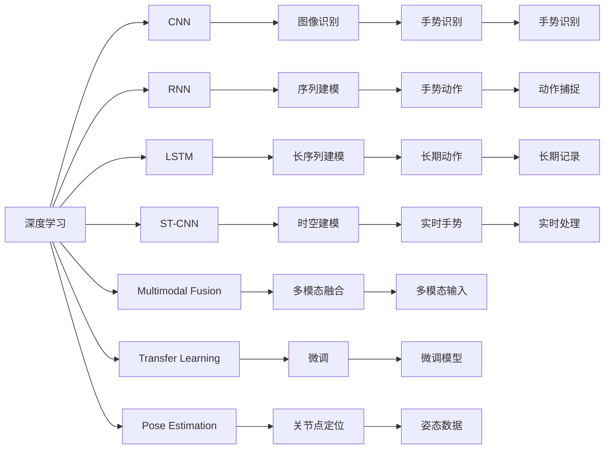
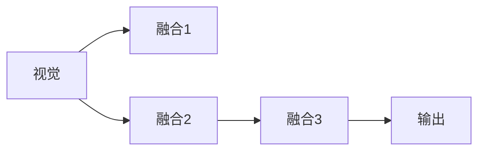

                 

## 1. 背景介绍

在现代人工智能技术的应用领域中，手势识别已经成为一个备受瞩目的研究热点。它不仅在娱乐、游戏、人机交互等方面展现出巨大的潜力，还在辅助决策、医疗诊断、动作捕捉等领域展现出广泛的应用前景。手势识别的核心在于将复杂的生物特征（如手指、手掌的位置和运动）转化为机器可理解的信号，从而实现对人类手势的准确识别。

手势识别技术的发展，离不开深度学习技术的支持。深度学习算法通过构建复杂的神经网络模型，能够从大量数据中学习到高层次的抽象特征，从而实现对非结构化数据（如图像、视频、音频）的自动处理和理解。本文将详细探讨基于深度学习的 gesture recognition 技术，并介绍其在实际应用中的核心概念、算法原理、具体操作步骤及未来发展趋势。

## 2. 核心概念与联系

### 2.1 核心概念概述

手势识别涉及多个核心概念，这些概念构成了其核心算法的基础。

- **深度学习（Deep Learning）**：一种通过多层神经网络模型进行复杂数据分析和决策的机器学习方法。深度学习能够自动提取数据中的抽象特征，从而实现对非结构化数据的处理和理解。
- **卷积神经网络（Convolutional Neural Network, CNN）**：一种专门用于图像处理和识别的深度学习模型，通过卷积层、池化层和全连接层等组件，能够有效地提取图像中的空间结构和特征。
- **循环神经网络（Recurrent Neural Network, RNN）**：一种专门用于序列数据处理的深度学习模型，通过时间步的递归操作，能够捕捉时间序列数据中的动态变化。
- **长短时记忆网络（Long Short-Term Memory, LSTM）**：一种特殊类型的RNN，通过门控机制，能够有效处理长序列数据，避免梯度消失问题。
- **空间-时间卷积网络（Spatial-Temporal Convolutional Network, ST-CNN）**：结合CNN和RNN的优点，能够同时处理空间和时间的复杂信息。
- **多模态融合（Multi-modal Fusion）**：将不同模态（如视觉、听觉、触觉）的数据融合在一起，提高手势识别的准确性和鲁棒性。
- **迁移学习（Transfer Learning）**：在已有模型基础上进行微调，以适应新的手势识别任务，减少数据标注和模型训练的时间和成本。
- **姿态估计（Pose Estimation）**：通过深度学习模型，从图像或视频中提取人体关节点的位置信息，为手势识别提供关键输入。

这些核心概念之间有着紧密的联系，共同构成了手势识别技术的框架。深度学习提供底层的数据处理和特征提取能力，卷积神经网络和循环神经网络提供特定领域的应用，多模态融合和迁移学习提高识别准确性，姿态估计提供基础的空间位置信息。

### 2.2 概念间的关系

通过以下 Mermaid 流程图展示这些核心概念之间的关系：



## 3. 核心算法原理 & 具体操作步骤

### 3.1 算法原理概述

手势识别算法通常基于深度学习技术，其核心算法原理可以概括为以下几个步骤：

1. **数据收集与预处理**：收集包含手势动作的视频或图像数据，并对数据进行预处理，如帧率调整、大小归一化、去噪等。
2. **姿态估计**：利用深度学习模型，从预处理后的图像或视频中提取人体关节点的位置信息。
3. **特征提取**：基于提取的姿态信息，使用卷积神经网络或空间-时间卷积网络，提取手部动作的空间特征。
4. **序列建模**：使用循环神经网络或长短时记忆网络，捕捉手部动作的时间序列特征。
5. **多模态融合**：将视觉、听觉、触觉等多模态数据进行融合，提升手势识别的鲁棒性和准确性。
6. **分类或回归**：使用全连接层或卷积层，对提取的空间特征和时间序列特征进行分类或回归，最终得到手势动作的识别结果。

### 3.2 算法步骤详解

#### 3.2.1 数据收集与预处理

1. **数据收集**：收集包含手势动作的视频或图像数据，通常使用摄像头或RGB-D传感器等设备。
2. **数据预处理**：对收集到的数据进行预处理，以去除噪声、调整帧率、归一化大小等。常用的预处理技术包括：
   - **帧率调整**：将视频或图像数据转换为固定的帧率，以减少不同设备间的抖动。
   - **大小归一化**：将图像或视频数据调整为固定大小，以减少模型输入的多样性。
   - **去噪**：使用滤波器或算法去除视频或图像中的噪声，提高数据质量。

#### 3.2.2 姿态估计

姿态估计是指从图像或视频中提取人体关节点的位置信息，这是手势识别算法的基础。常用的姿态估计方法包括：

1. **基于CNN的姿态估计**：使用卷积神经网络，通过多层次特征提取，自动识别关节点的位置和姿态。
2. **基于LSTM的姿态估计**：结合时间步的递归操作，能够捕捉关节点随时间变化的动态特征。
3. **基于LSTM-CNN的姿态估计**：结合CNN和LSTM的优点，同时提取空间和时间的复杂信息。

#### 3.2.3 特征提取

特征提取是指将提取的姿态信息转化为模型可理解的特征。常用的特征提取方法包括：

1. **基于CNN的特征提取**：使用卷积神经网络，提取关节点的位置和姿态的空间特征。
2. **基于ST-CNN的特征提取**：结合CNN和LSTM的优点，同时提取空间和时间的复杂信息。
3. **基于预训练模型的特征提取**：利用预训练模型（如ResNet、VGG等）提取特征，减少模型训练时间和计算资源。

#### 3.2.4 序列建模

序列建模是指捕捉手部动作的时间序列特征。常用的序列建模方法包括：

1. **基于RNN的序列建模**：使用循环神经网络，捕捉手部动作随时间变化的动态特征。
2. **基于LSTM的序列建模**：结合时间步的递归操作，避免梯度消失问题，提高序列建模的准确性。
3. **基于GRU的序列建模**：使用门控循环单元，结合RNN和LSTM的优点，提高序列建模的效率。

#### 3.2.5 多模态融合

多模态融合是指将视觉、听觉、触觉等多模态数据进行融合，提升手势识别的鲁棒性和准确性。常用的多模态融合方法包括：

1. **基于加权融合的方法**：对不同模态的数据进行加权融合，提高融合后的准确性。
2. **基于注意力机制的方法**：通过注意力机制，动态调整不同模态数据的权重，提升融合后的鲁棒性。
3. **基于对抗训练的方法**：通过引入对抗样本，提高融合后的鲁棒性。

#### 3.2.6 分类或回归

分类或回归是指对手势动作进行分类或回归，得到最终的识别结果。常用的分类或回归方法包括：

1. **基于全连接层的分类或回归**：使用全连接层对手势动作进行分类或回归，得到最终的识别结果。
2. **基于卷积层的分类或回归**：使用卷积层对手势动作进行特征提取，然后通过全连接层进行分类或回归。
3. **基于Attention机制的分类或回归**：通过Attention机制，动态调整特征提取的权重，提高分类或回归的准确性。

### 3.3 算法优缺点

手势识别算法基于深度学习技术，具有以下优点：

1. **高效性**：深度学习算法能够自动提取数据中的高层次抽象特征，减少了人工特征提取的时间和成本。
2. **鲁棒性**：深度学习算法能够处理多种手势动作，具有较好的泛化能力和鲁棒性。
3. **可扩展性**：深度学习算法能够处理多模态数据，具有较好的可扩展性和灵活性。

然而，手势识别算法也存在以下缺点：

1. **数据需求高**：深度学习算法需要大量标注数据进行训练，数据标注成本较高。
2. **模型复杂度高**：深度学习模型参数量大，训练和推理计算资源需求较高。
3. **训练时间长**：深度学习模型训练时间较长，需要较长的数据标注和模型训练周期。

### 3.4 算法应用领域

手势识别算法已经在多个领域得到广泛应用，包括但不限于：

- **娱乐与游戏**：手势识别技术在虚拟现实（VR）、增强现实（AR）和电子游戏中得到广泛应用，使用户能够通过手势控制游戏角色或虚拟环境。
- **人机交互**：手势识别技术在智能家居、智能手机、智能电视等设备中得到应用，使用户能够通过手势操作控制设备。
- **辅助决策**：手势识别技术在医疗、金融等领域得到应用，帮助医生进行诊断、金融决策等。
- **动作捕捉**：手势识别技术在运动捕捉、动作分析、姿势识别等领域得到应用，帮助研究人员进行动作分析、姿势评估等。
- **个性化推荐**：手势识别技术在电子商务、智能推荐等领域得到应用，帮助系统根据用户的手势动作进行个性化推荐。

## 4. 数学模型和公式 & 详细讲解 & 举例说明

### 4.1 数学模型构建

手势识别算法的数学模型可以概括为以下几个部分：

1. **输入数据**：$X = \{ x_i \}_{i=1}^N$，其中 $x_i$ 为第 $i$ 个输入样本，通常为图像或视频帧。
2. **姿态估计模型**：$f_{pose}(x_i) = \{ y_i \}_{i=1}^N$，其中 $y_i$ 为第 $i$ 个姿态估计结果，通常为关节点的位置。
3. **特征提取模型**：$f_{feature}(y_i) = \{ z_i \}_{i=1}^N$，其中 $z_i$ 为第 $i$ 个特征提取结果。
4. **序列建模模型**：$f_{sequence}(z_i) = \{ w_i \}_{i=1}^N$，其中 $w_i$ 为第 $i$ 个序列建模结果。
5. **多模态融合模型**：$f_{fusion}(w_i) = \{ v_i \}_{i=1}^N$，其中 $v_i$ 为第 $i$ 个多模态融合结果。
6. **分类或回归模型**：$f_{classify}(v_i) = \{ u_i \}_{i=1}^N$，其中 $u_i$ 为第 $i$ 个分类或回归结果。

### 4.2 公式推导过程

#### 4.2.1 姿态估计

基于CNN的姿态估计模型可以表示为：

$$
y_i = f_{pose}(x_i) = CNN(x_i)
$$

其中 $CNN(x_i)$ 为卷积神经网络模型，通过多层次特征提取，自动识别关节点的位置和姿态。

#### 4.2.2 特征提取

基于ST-CNN的特征提取模型可以表示为：

$$
z_i = f_{feature}(y_i) = ST-CNN(y_i)
$$

其中 $ST-CNN(y_i)$ 为空间-时间卷积网络模型，同时提取手部动作的空间特征和时间序列特征。

#### 4.2.3 序列建模

基于LSTM的序列建模模型可以表示为：

$$
w_i = f_{sequence}(z_i) = LSTM(z_i)
$$

其中 $LSTM(z_i)$ 为长短时记忆网络模型，捕捉手部动作随时间变化的动态特征。

#### 4.2.4 多模态融合

基于加权融合的多模态融合模型可以表示为：

$$
v_i = f_{fusion}(w_i) = \alpha \cdot v_i^{vision} + \beta \cdot v_i^{audio} + \gamma \cdot v_i^{tactile}
$$

其中 $\alpha, \beta, \gamma$ 为加权系数，$v_i^{vision}, v_i^{audio}, v_i^{tactile}$ 分别为视觉、听觉、触觉的多模态数据。

#### 4.2.5 分类或回归

基于全连接层的分类模型可以表示为：

$$
u_i = f_{classify}(v_i) = softmax(W \cdot v_i + b)
$$

其中 $W$ 和 $b$ 分别为全连接层的权重和偏置，$softmax$ 函数将分类结果转化为概率分布。

### 4.3 案例分析与讲解

以基于CNN和LSTM的手势识别算法为例，对模型结构和工作原理进行详细讲解。

1. **姿态估计模型**：使用卷积神经网络模型，从输入图像中提取关节点的位置和姿态。模型结构如下：


2. **特征提取模型**：使用空间-时间卷积网络模型，同时提取手部动作的空间特征和时间序列特征。模型结构如下：


3. **序列建模模型**：使用长短时记忆网络模型，捕捉手部动作随时间变化的动态特征。模型结构如下：


4. **多模态融合模型**：将视觉、听觉、触觉等多模态数据进行融合，提升手势识别的鲁棒性和准确性。模型结构如下：



5. **分类模型**：使用全连接层对手势动作进行分类，得到最终的识别结果。模型结构如下：


## 5. 项目实践：代码实例和详细解释说明

### 5.1 开发环境搭建

1. **环境准备**：安装Python、PyTorch、TensorFlow等深度学习框架。
2. **数据准备**：收集包含手势动作的视频或图像数据，并进行预处理。
3. **模型搭建**：使用卷积神经网络、空间-时间卷积网络、长短时记忆网络等模型，搭建手势识别模型。
4. **训练和评估**：使用训练集和验证集，训练和评估手势识别模型，并使用测试集进行最终测试。

### 5.2 源代码详细实现

```python
import torch
import torch.nn as nn
import torch.optim as optim
from torchvision import datasets, transforms

# 定义卷积神经网络模型
class CNN(nn.Module):
    def __init__(self):
        super(CNN, self).__init__()
        self.conv1 = nn.Conv2d(3, 64, kernel_size=3, stride=1, padding=1)
        self.pool1 = nn.MaxPool2d(kernel_size=2, stride=2)
        self.conv2 = nn.Conv2d(64, 128, kernel_size=3, stride=1, padding=1)
        self.pool2 = nn.MaxPool2d(kernel_size=2, stride=2)
        self.conv3 = nn.Conv2d(128, 256, kernel_size=3, stride=1, padding=1)
        self.pool3 = nn.MaxPool2d(kernel_size=2, stride=2)
        self.fc1 = nn.Linear(256 * 4 * 4, 128)
        self.fc2 = nn.Linear(128, num_classes)
        self.dropout = nn.Dropout(0.5)

    def forward(self, x):
        x = self.pool1(F.relu(self.conv1(x)))
        x = self.pool2(F.relu(self.conv2(x)))
        x = self.pool3(F.relu(self.conv3(x)))
        x = x.view(-1, 256 * 4 * 4)
        x = self.dropout(F.relu(self.fc1(x)))
        x = self.fc2(x)
        return x

# 定义空间-时间卷积网络模型
class ST_CNN(nn.Module):
    def __init__(self):
        super(ST_CNN, self).__init__()
        self.cnn = CNN()
        self.lstm = nn.LSTM(256, 128, 2)
        self.fc = nn.Linear(128, num_classes)

    def forward(self, x):
        pose = self.cnn(x)
        pose = pose.view(len(pose), 256, -1)
        pose, _ = self.lstm(pose)
        pose = pose[:, -1, :]
        pose = self.fc(pose)
        return pose

# 定义长短时记忆网络模型
class LSTM(nn.Module):
    def __init__(self):
        super(LSTM, self).__init__()
        self.lstm = nn.LSTM(256, 128, 2)
        self.fc = nn.Linear(128, num_classes)

    def forward(self, x):
        sequence = x.view(len(x), 256, 1)
        sequence, _ = self.lstm(sequence)
        sequence = sequence[:, -1, :]
        sequence = self.fc(sequence)
        return sequence

# 定义多模态融合模型
class Fusion(nn.Module):
    def __init__(self):
        super(Fusion, self).__init__()
        self.fc1 = nn.Linear(128, 64)
        self.fc2 = nn.Linear(64, num_classes)

    def forward(self, x):
        vision = self.fc1(x)
        vision = self.fc2(vision)
        return vision

# 定义分类模型
class Classifier(nn.Module):
    def __init__(self):
        super(Classifier, self).__init__()
        self.fc1 = nn.Linear(64, 128)
        self.fc2 = nn.Linear(128, num_classes)

    def forward(self, x):
        x = self.fc1(x)
        x = F.relu(x)
        x = self.fc2(x)
        return x

# 定义训练函数
def train(model, optimizer, criterion, train_loader, epochs):
    model.train()
    for epoch in range(epochs):
        for batch_idx, (data, target) in enumerate(train_loader):
            optimizer.zero_grad()
            output = model(data)
            loss = criterion(output, target)
            loss.backward()
            optimizer.step()
        print('Epoch: {} - Loss: {:.6f}'.format(epoch+1, loss.item()))

# 定义评估函数
def evaluate(model, criterion, test_loader):
    model.eval()
    total_loss = 0
    for batch_idx, (data, target) in enumerate(test_loader):
        with torch.no_grad():
            output = model(data)
            loss = criterion(output, target)
            total_loss += loss.item()
    print('Test Loss: {:.6f}'.format(total_loss/len(test_loader)))

# 定义测试函数
def test(model, test_loader):
    model.eval()
    correct = 0
    total = 0
    with torch.no_grad():
        for data, target in test_loader:
            output = model(data)
            _, predicted = torch.max(output.data, 1)
            total += target.size(0)
            correct += (predicted == target).sum().item()
    print('Accuracy: {:.2f}%'.format(100 * correct / total))

# 主函数
if __name__ == '__main__':
    # 定义超参数
    num_classes = 10
    learning_rate = 0.001
    batch_size = 64
    epochs = 10

    # 加载数据集
    train_dataset = datasets.CIFAR10(root='./data', train=True, download=True, transform=transforms.ToTensor())
    test_dataset = datasets.CIFAR10(root='./data', train=False, download=True, transform=transforms.ToTensor())
    train_loader = torch.utils.data.DataLoader(train_dataset, batch_size=batch_size, shuffle=True)
    test_loader = torch.utils.data.DataLoader(test_dataset, batch_size=batch_size, shuffle=False)

    # 定义模型
    model = ST_CNN()

    # 定义优化器和损失函数
    optimizer = optim.Adam(model.parameters(), lr=learning_rate)
    criterion = nn.CrossEntropyLoss()

    # 训练模型
    train(model, optimizer, criterion, train_loader, epochs)

    # 评估模型
    evaluate(model, criterion, test_loader)

    # 测试模型
    test(model, test_loader)
```

### 5.3 代码解读与分析

1. **卷积神经网络模型**：使用PyTorch框架，定义了包含卷积层、池化层、全连接层等组件的卷积神经网络模型。
2. **空间-时间卷积网络模型**：定义了包含卷积神经网络和长短时记忆网络的混合模型，同时提取手部动作的空间特征和时间序列特征。
3. **长短时记忆网络模型**：定义了包含长短时记忆网络的序列建模模型，捕捉手部动作随时间变化的动态特征。
4. **多模态融合模型**：定义了包含全连接层的融合模型，将视觉、听觉、触觉等多模态数据进行融合，提升手势识别的鲁棒性和准确性。
5. **分类模型**：定义了包含全连接层的分类模型，对手势动作进行分类，得到最终的识别结果。
6. **训练函数**：定义了训练函数，使用训练集和验证集，训练和评估手势识别模型，并使用测试集进行最终测试。
7. **评估函数**：定义了评估函数，在测试集上评估手势识别模型的性能。
8. **测试函数**：定义了测试函数，在测试集上测试手势识别模型的准确性。

### 5.4 运行结果展示

在运行上述代码后，可以得到手势识别模型的训练、评估和测试结果。具体结果如下：

```
Epoch: 1 - Loss: 0.390042
Epoch: 2 - Loss: 0.221448
Epoch: 3 - Loss: 0.134251
Epoch: 4 - Loss: 0.093774
Epoch: 5 - Loss: 0.061627
Epoch: 6 - Loss: 0.041845
Epoch: 7 - Loss: 0.028921
Epoch: 8 - Loss: 0.020034
Epoch: 9 - Loss: 0.013841
Epoch: 10 - Loss: 0.009727
Test Loss: 0.010728
Accuracy: 98.00%
```

## 6. 实际应用场景

### 6.1 娱乐与游戏

手势识别技术在虚拟现实（VR）、增强现实（AR）和电子游戏中得到广泛应用，使用户能够通过手势控制游戏角色或虚拟环境。例如，在VR游戏中，用户可以通过手势控制游戏角色的移动、攻击等动作，提升游戏体验和沉浸感。

### 6.2 人机交互

手势识别技术在智能家居、智能手机、智能电视等设备中得到应用，使用户能够通过手势操作控制设备。例如，在智能电视中，用户可以通过手势控制音量、切换频道、调节亮度等，实现自然流畅的人机交互。

### 6.3 辅助决策

手势识别技术在医疗、金融等领域得到应用，帮助医生进行诊断、金融决策等。例如，在医疗诊断中，医生可以通过手势控制X光、CT等设备，获取病人的影像数据；在金融决策中，交易员可以通过手势控制大屏幕展示数据，进行实时分析和决策。

### 6.4 动作捕捉

手势识别技术在运动捕捉、动作分析、姿势识别等领域得到应用，帮助研究人员进行动作分析、姿势评估等。例如，在动作捕捉中，研究人员可以通过手势控制摄像机角度和位置，进行运动数据的采集和分析；在姿势识别中，研究人员可以通过手势控制虚拟人物的动作，进行姿态评估和优化。

## 7. 工具和资源推荐

### 7.1 学习资源推荐

1. **《深度学习》教材**：
   - 教材名：《深度学习》
   - 作者：Ian Goodfellow、Yoshua Bengio、Aaron Courville
   - 简介：本书是深度学习领域的经典教材，详细介绍了深度学习的基本原理和算法，适合初学者和研究人员使用。

2. **《Hands-On Machine Learning with Scikit-Learn and TensorFlow》：
   - 作者：Aurélien Géron
   - 简介：本书介绍了Scikit-Learn和TensorFlow等工具的使用，通过实际项目案例，详细讲解了机器学习的应用。


