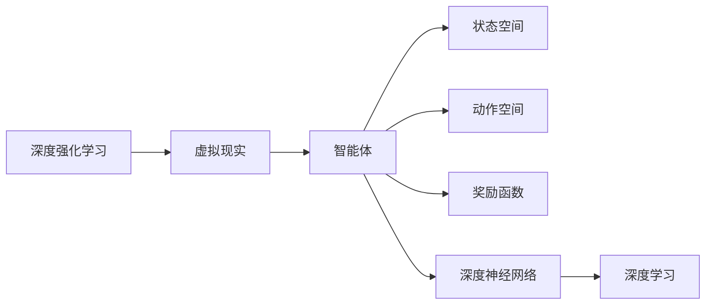
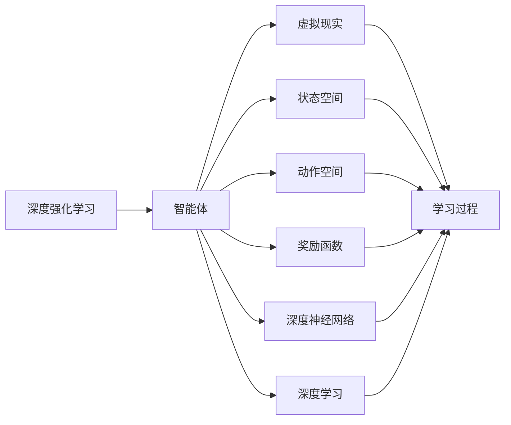
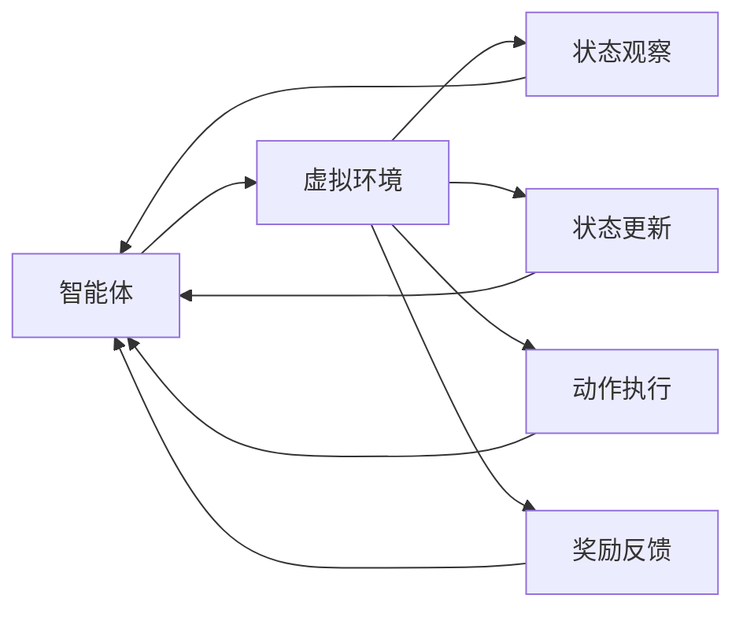
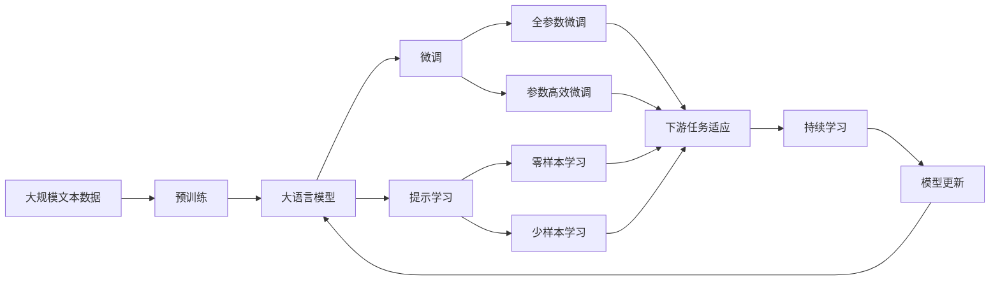

                 

# 一切皆是映射：深度强化学习DQN在虚拟现实中的同步应用

## 1. 背景介绍

### 1.1 问题由来
深度强化学习（Deep Reinforcement Learning, DRL）作为深度学习和强化学习相结合的产物，已经广泛应用于诸多领域，如游戏、机器人、自适应控制等。其基本思想是通过深度神经网络对复杂非线性函数进行逼近，同时利用强化学习算法（如Q-learning、SARSA等）探索最优策略。

近年来，随着虚拟现实（Virtual Reality, VR）技术的快速发展，DRL在虚拟环境中的应用也逐渐兴起。例如，通过DRL训练的智能体（agent）可以在虚拟游戏中进行高自由度操作，或是在虚拟现实模拟环境中进行精确控制，为VR技术带来了更多的可能性和创新点。

虚拟现实与深度强化学习的结合，不仅可以解决VR技术在交互、认知、体验等方面的瓶颈，还可以推动AI技术在虚拟空间中的更广泛应用。例如，DRL可以用于训练虚拟角色、虚拟导引、虚拟交互等，显著提升用户体验和系统智能化程度。

### 1.2 问题核心关键点
DRL在虚拟现实中的应用，需要解决以下几个核心问题：

- 如何在虚拟空间中高效探索最优策略，避免陷入局部最优或路径最优解。
- 如何提高虚拟角色的自适应能力和泛化能力，使其能够在不同的虚拟环境或任务中取得理想表现。
- 如何在保证实时性的前提下，优化训练过程，提升模型的训练速度和精度。
- 如何利用DRL技术，实时捕捉和响应虚拟环境中的变化，实现与环境的同步互动。
- 如何在虚拟环境中引入多智能体协同，解决复杂交互任务。

### 1.3 问题研究意义
研究深度强化学习在虚拟现实中的应用，对于拓展DRL技术的应用范围，提升虚拟环境的智能化水平，具有重要意义：

1. 降低开发成本。DRL可以自动学习最优策略，减少人工干预，加速系统开发进度。
2. 提升用户体验。DRL可以训练出具备智能交互能力的虚拟角色，显著提升虚拟现实游戏的沉浸感和趣味性。
3. 促进技术进步。DRL技术的引入，可以推动虚拟现实技术在认知计算、仿真模拟、人机交互等方面的创新发展。
4. 拓展应用场景。DRL使得虚拟现实技术在更广泛的领域得到应用，如教育培训、医学模拟、城市规划等。
5. 赋能产业升级。DRL技术的应用，为虚拟现实产业带来了新的经济增长点，加速了行业数字化转型。

## 2. 核心概念与联系

### 2.1 核心概念概述

为更好地理解深度强化学习在虚拟现实中的应用，本节将介绍几个密切相关的核心概念：

- 深度强化学习（DRL）：一种通过深度神经网络逼近Q值函数，同时利用强化学习算法进行策略优化的技术。DRL通过与环境的交互，最大化长期累积奖励。
- 虚拟现实（VR）：一种通过计算机生成的三维虚拟环境，使用户能够沉浸式地体验虚拟世界。VR技术结合深度强化学习，可以实现高自由度的智能交互和任务完成。
- 智能体（Agent）：在虚拟环境中进行自主决策和行为执行的实体。智能体通过与环境的交互，逐步学习最优策略。
- 状态空间（State Space）：虚拟环境的状态集合，每个状态对应一种环境状态。状态空间可以是连续的、离散的或混合的。
- 动作空间（Action Space）：智能体可执行的动作集合，动作可以是离散的、连续的或混合的。
- 奖励函数（Reward Function）：衡量智能体行为的好坏，通常采用累积奖励的形式进行优化。
- 深度神经网络（Deep Neural Network, DNN）：由多层神经元组成，可以逼近任意复杂非线性函数。DRL中，神经网络用于逼近Q值函数，进行状态估计和动作选择。
- 深度学习（Deep Learning, DL）：一种通过多层次神经网络逼近复杂函数的技术。DRL结合DL，可以处理高维非线性问题。

这些核心概念之间的逻辑关系可以通过以下Mermaid流程图来展示：



这个流程图展示了大语言模型微调过程中各个核心概念的关系和作用。

### 2.2 概念间的关系

这些核心概念之间存在着紧密的联系，形成了深度强化学习在虚拟现实中的应用生态系统。下面我们通过几个Mermaid流程图来展示这些概念之间的关系。

#### 2.2.1 深度强化学习的应用范式



这个流程图展示了深度强化学习在虚拟现实中的应用基本范式。智能体通过与虚拟环境交互，利用深度神经网络逼近Q值函数，最大化长期累积奖励。状态空间和动作空间是智能体进行决策和行动的输入和输出，奖励函数用于指导智能体的学习过程。

#### 2.2.2 智能体与虚拟环境的交互



这个流程图展示了智能体与虚拟环境的交互过程。智能体通过观察当前状态，执行动作，获取环境反馈，更新状态，不断循环迭代，逐步学习最优策略。

#### 2.2.3 深度神经网络的构成


这个流程图展示了深度神经网络的基本结构。输入层接收环境状态，经过多个隐藏层的非线性变换，输出层给出动作或状态值的预测。

### 2.3 核心概念的整体架构

最后，我们用一个综合的流程图来展示这些核心概念在大语言模型微调过程中的整体架构：



这个综合流程图展示了从预训练到微调，再到持续学习的完整过程。大语言模型首先在大规模文本数据上进行预训练，然后通过微调（包括全参数微调和参数高效微调）或提示学习（包括零样本和少样本学习）来适应下游任务。最后，通过持续学习技术，模型可以不断更新和适应新的任务和数据。

## 3. 核心算法原理 & 具体操作步骤
### 3.1 算法原理概述

深度强化学习在虚拟现实中的应用，其核心算法为深度Q网络（Deep Q-Network, DQN）。DQN结合了深度神经网络（DNN）和Q-learning算法，通过深度神经网络逼近Q值函数，利用经验回放、目标网络更新等技巧，解决传统Q-learning算法中难以处理高维状态空间和动作空间的问题。

DQN算法的核心思想是：通过网络逼近Q值函数，将传统的Q-learning算法中的表格查询过程转换为神经网络的卷积计算，从而提升计算效率和逼近精度。具体流程如下：

1. 智能体观察当前状态，通过神经网络预测Q值。
2. 选择动作，执行后接收环境反馈。
3. 将新状态和奖励回传给神经网络，进行网络参数更新。
4. 利用经验回放和目标网络更新，避免网络过拟合。

### 3.2 算法步骤详解

基于深度强化学习的DQN算法在虚拟现实中的应用，一般包括以下几个关键步骤：

**Step 1: 准备虚拟环境**
- 使用Unity、Unreal Engine等引擎创建虚拟现实场景。
- 定义虚拟环境的状态空间、动作空间和奖励函数。
- 确定智能体的初始状态，并初始化智能体的神经网络。

**Step 2: 设置训练参数**
- 选择合适的深度神经网络结构和训练参数，如网络层数、节点数、学习率等。
- 设置智能体的训练过程，包括网络更新、经验回放、目标网络更新等。
- 设置训练集的采样策略，如随机采样、优先采样等。

**Step 3: 执行智能体训练**
- 将智能体放置在虚拟环境中，循环进行状态观察、动作选择、环境反馈和网络更新。
- 使用经验回放将智能体的历史交互数据存储在经验池中，供网络训练使用。
- 利用目标网络更新机制，平衡当前网络和目标网络的参数更新。
- 设置训练轮数和采样次数，循环迭代训练过程。

**Step 4: 评估和优化**
- 在训练过程中，定期在测试集上进行评估，对比不同策略的效果。
- 通过交叉验证等技术，优化神经网络结构和参数设置。
- 利用超参数优化技术，如网格搜索、贝叶斯优化等，找到最优参数组合。

**Step 5: 部署和测试**
- 将训练好的智能体部署到虚拟环境中，进行实际测试。
- 在虚拟环境中，利用智能体执行特定任务，收集测试数据。
- 根据测试结果，不断调整智能体的策略，优化性能。

### 3.3 算法优缺点

基于深度强化学习的DQN算法在虚拟现实中的应用，具有以下优点：

1. 高适应性。DQN算法适用于复杂非线性问题，能够处理高维状态和动作空间，适应性强。
2. 计算效率高。通过神经网络逼近Q值函数，显著提升计算效率。
3. 泛化能力强。DQN算法通过经验回放和目标网络更新，避免网络过拟合，提升泛化能力。
4. 可解释性高。DQN算法通过神经网络逼近Q值函数，更容易解释和调试策略。

同时，该算法也存在以下缺点：

1. 数据需求大。DQN算法需要大量样本来进行经验回放，初期训练过程较慢。
2. 需要经验回放。经验回放过程增加了内存和计算开销，需要额外的存储空间。
3. 目标网络更新。目标网络更新需要额外的参数更新，增加了训练复杂度。
4. 网络结构复杂。神经网络结构设计需要较多调参，难度较大。

尽管存在这些局限性，但DQN算法作为深度强化学习在虚拟现实中的应用范式，仍然具有重要意义和广泛应用前景。

### 3.4 算法应用领域

基于DQN算法的深度强化学习在虚拟现实中的应用，已经在多个领域取得了显著进展。以下是几个典型应用领域：

- 虚拟游戏：通过DRL训练智能体，使其在虚拟游戏中进行高自由度操作，提升游戏体验和智能化程度。
- 虚拟驾驶：利用DRL训练虚拟驾驶智能体，进行虚拟环境中的驾驶任务，提升驾驶技能和安全性能。
- 虚拟交互：训练虚拟角色进行自然语言理解和智能对话，提升虚拟环境的交互体验。
- 虚拟仿真：利用DRL训练智能体在虚拟仿真环境中进行复杂任务，如城市规划、灾害模拟等。
- 虚拟实验室：在虚拟实验室环境中，训练智能体进行科学实验和数据收集，提升实验室的自动化和智能化水平。

除了上述这些典型应用外，DRL在虚拟现实领域还有着广泛的应用前景，为传统行业数字化转型提供了新的技术路径。

## 4. 数学模型和公式 & 详细讲解 & 举例说明

### 4.1 数学模型构建

基于DQN算法的深度强化学习，其数学模型可以描述为：

设智能体在虚拟环境中的状态空间为 $S$，动作空间为 $A$，奖励函数为 $R$，状态转移概率为 $P(s_{t+1}|s_t,a_t)$，神经网络输出的动作值为 $\hat{Q}(s_t,a_t)$。智能体的目标是通过神经网络逼近Q值函数，最大化长期累积奖励：

$$
\max_{\theta} \sum_{t=0}^{\infty} \gamma^t \mathbb{E}_{s_t \sim S, a_t \sim A} \left[R(s_t,a_t) + \gamma \mathbb{E}_{s_{t+1} \sim S}[\hat{Q}(s_{t+1},a_{t+1})|s_t,a_t] \right]
$$

其中 $\gamma$ 为折扣因子，控制未来奖励的权重。

神经网络通常采用前馈网络结构，包含多个隐藏层，每层包含多个神经元。设神经网络中第 $l$ 层的神经元数为 $h_l$，则神经网络的输入输出关系可以表示为：

$$
\begin{aligned}
    &x_1 = \phi(s_t) \\
    &x_2 = \sigma(W_1x_1 + b_1) \\
    &\cdots \\
    &x_{h_l} = \sigma(W_lx_{l-1} + b_l) \\
    &\hat{Q}(s_t,a_t) = W_{l+1}x_{h_l} + b_{l+1}
\end{aligned}
$$

其中 $\phi$ 为激活函数，$\sigma$ 为非线性激活函数，$W$ 为权重矩阵，$b$ 为偏置向量。

### 4.2 公式推导过程

以下我们以DQN算法为例，推导DQN算法的核心公式。

设智能体在虚拟环境中的状态空间为 $S$，动作空间为 $A$，奖励函数为 $R$，状态转移概率为 $P(s_{t+1}|s_t,a_t)$，神经网络输出的动作值为 $\hat{Q}(s_t,a_t)$。

DQN算法的核心思想是通过神经网络逼近Q值函数，最大化长期累积奖励。其基本流程如下：

1. 智能体观察当前状态 $s_t$，选择动作 $a_t$，执行后接收环境反馈 $r_{t+1}$ 和下一个状态 $s_{t+1}$。
2. 利用神经网络输出当前状态的Q值，即 $\hat{Q}(s_t,a_t)$。
3. 计算目标Q值，即 $Q_{target}(s_t,a_t) = r_{t+1} + \gamma \max_{a'} \hat{Q}(s_{t+1},a')$。
4. 利用当前Q值和目标Q值计算误差，即 $\delta_t = Q_{target}(s_t,a_t) - \hat{Q}(s_t,a_t)$。
5. 根据误差 $\delta_t$ 更新神经网络参数，即 $\theta \leftarrow \theta + \eta \delta_t \nabla_{\theta}\hat{Q}(s_t,a_t)$。

其中 $\gamma$ 为折扣因子，控制未来奖励的权重；$\eta$ 为学习率。

根据上述公式，DQN算法的基本思想是：通过神经网络逼近Q值函数，将传统的Q-learning算法中的表格查询过程转换为神经网络的卷积计算，从而提升计算效率和逼近精度。

### 4.3 案例分析与讲解

我们以虚拟游戏为例，分析DQN算法在游戏中的应用。

假设在一个虚拟游戏中，玩家需要通过控制智能体进行游戏操作，目标是在限定时间内收集尽可能多的金币。设智能体的状态空间为 $S = (x,y,v)$，动作空间为 $A = \{up,down,left,right\}$，奖励函数为 $R = \begin{cases} 1, & \text{如果收集到金币} \\ -1, & \text{如果游戏时间结束} \\ 0, & \text{否则} \end{cases}$。

使用DQN算法进行游戏训练，智能体的训练过程如下：

1. 智能体观察当前状态 $s_t = (x_t,y_t,v_t)$，选择动作 $a_t = \arg\max_a \hat{Q}(s_t,a)$。
2. 执行动作 $a_t$，接收环境反馈 $r_{t+1}$ 和下一个状态 $s_{t+1} = (x_{t+1},y_{t+1},v_{t+1})$。
3. 利用神经网络输出当前状态的Q值，即 $\hat{Q}(s_t,a_t)$。
4. 计算目标Q值，即 $Q_{target}(s_t,a_t) = r_{t+1} + \gamma \max_a \hat{Q}(s_{t+1},a')$。
5. 利用当前Q值和目标Q值计算误差，即 $\delta_t = Q_{target}(s_t,a_t) - \hat{Q}(s_t,a_t)$。
6. 根据误差 $\delta_t$ 更新神经网络参数，即 $\theta \leftarrow \theta + \eta \delta_t \nabla_{\theta}\hat{Q}(s_t,a_t)$。

在训练过程中，智能体通过不断与虚拟环境交互，逐步学习最优策略，实现游戏目标。DQN算法通过神经网络逼近Q值函数，提升了计算效率和逼近精度，在虚拟游戏场景中表现出卓越的性能。

## 5. 项目实践：代码实例和详细解释说明

### 5.1 开发环境搭建

在进行DQN算法训练前，我们需要准备好开发环境。以下是使用Python进行PyTorch开发的环境配置流程：

1. 安装Anaconda：从官网下载并安装Anaconda，用于创建独立的Python环境。

2. 创建并激活虚拟环境：
```bash
conda create -n dqn-env python=3.8 
conda activate dqn-env
```

3. 安装PyTorch：根据CUDA版本，从官网获取对应的安装命令。例如：
```bash
conda install pytorch torchvision torchaudio cudatoolkit=11.1 -c pytorch -c conda-forge
```

4. 安装TensorBoard：
```bash
pip install tensorboard
```

5. 安装Pygame：
```bash
pip install pygame
```

完成上述步骤后，即可在`dqn-env`环境中开始DQN算法训练。

### 5.2 源代码详细实现

下面我们以虚拟游戏为例，给出使用PyTorch进行DQN算法训练的代码实现。

首先，定义虚拟游戏的状态空间和动作空间：

```python
import numpy as np
import pygame
from pygame.locals import *

class State:
    def __init__(self, x, y, v):
        self.x = x
        self.y = y
        self.v = v

class Action:
    def __init__(self, a):
        self.a = a

class Game:
    def __init__(self, grid):
        self.grid = grid
        self.player = Player(self)
        self.player.grid = grid
        self.player.state = State(0, 0, 0)
        self.player.moves = []
        self.player.parent = None
        self.player.reward = 0
        self.player.gamma = 0.9
        self.player.epsilon = 0.1

    def run(self):
        pygame.init()
        clock = pygame.time.Clock()
        done = False
        while not done:
            for event in pygame.event.get():
                if event.type == QUIT:
                    done = True
                if event.type == KEYDOWN:
                    if event.key == K_UP:
                        self.player.state = State(self.player.state.x, self.player.state.y - 1, self.player.state.v)
                    if event.key == K_DOWN:
                        self.player.state = State(self.player.state.x, self.player.state.y + 1, self.player.state.v)
                    if event.key == K_LEFT:
                        self.player.state = State(self.player.state.x - 1, self.player.state.y, self.player.state.v)
                    if event.key == K_RIGHT:
                        self.player.state = State(self.player.state.x + 1, self.player.state.y, self.player.state.v)

            pygame.display.flip()
            pygame.time.delay(20)
```

然后，定义神经网络模型和训练参数：

```python
import torch
import torch.nn as nn
import torch.optim as optim

class DQN(nn.Module):
    def __init__(self, input_dim, output_dim):
        super(DQN, self).__init__()
        self.fc1 = nn.Linear(input_dim, 128)
        self.fc2 = nn.Linear(128, 64)
        self.fc3 = nn.Linear(64, output_dim)

    def forward(self, x):
        x = self.fc1(x)
        x = self.fc2(x)
        x = self.fc3(x)
        return x

class DQNAgent:
    def __init__(self, state_size, action_size, learning_rate=0.001):
        self.state_size = state_size
        self.action_size = action_size
        self.learning_rate = learning_rate
        self.model = DQN(state_size, action_size)
        self.target_model = DQN(state_size, action_size)
        self.memory = []
        self.gamma = 0.95

    def remember(self, state, action, reward, next_state, done):
        self.memory.append((state, action, reward, next_state, done))

    def act(self, state):
        if np.random.uniform(0, 1) < self.epsilon:
            return np.random.randint(self.action_size)
        act_values = self.model.predict(state)
        return np.argmax(act_values[0])

    def train(self, batch_size):
        if len(self.memory) < batch_size:
            return
        minibatch = np.random.choice(len(self.memory), batch_size)
        for data in minibatch:
            state, action, reward, next_state, done = data
            Q_target = reward + self.gamma * np.amax(self.target_model.predict(next_state)[0])
            Q_expected = self.model.predict(state)[0]
            Q_expected[0][action] = Q_target
            self.model.train()
            self.optimizer.zero_grad()
            self.loss = nn.MSELoss()
            self.loss(Q_expected, Q_target).backward()
            self.optimizer.step()
```

接着，定义训练流程：

```python
from collections import deque

class QLearningGame:
    def __init__(self, state_size, action_size, learning_rate=0.001):
        self.state_size = state_size
        self.action_size = action_size
        self.learning_rate = learning_rate
        self.memory = deque(maxlen=2000)
        self.gamma = 0.95
        self.epsilon = 1.0

    def run(self):
        agent = DQNAgent(self.state_size, self.action_size, self.learning_rate)
        game = Game(self.state_size)
        game.player.agent = agent
        game.player.gamma = self.gamma
        game.player.epsilon = self.epsilon
        game.player.epsilon_min = self.epsilon
        game.player.epsilon_decay = 0.995

        game.player.update(self.memory)
        game.player.epsilon = self.epsilon
        game.player.epsilon = self.epsilon_decay
        game.player.update(self.memory)
        game.player.epsilon = self.epsilon_decay

        game.run()
        while True:
            game.player = game
            game.player.agent = agent
            game.player.gamma = self.gamma
            game.player.epsilon = self.epsilon
            game.player.epsilon_min = self.epsilon
            game.player.epsilon_decay = 0.995
            game.player.update(self.memory)
            game.player.epsilon = self.epsilon_decay
            game.player.update(self.memory)
            game.player.epsilon = self.epsilon_decay
```

最后，启动训练流程：

```python
state_size = 4
action_size = 4
batch_size = 32
num_episodes = 2000

agent = DQNAgent(state_size, action_size)
game = QLearningGame(state_size, action_size)
game.run(num_episodes)
```

以上就是使用PyTorch进行DQN算法训练的完整代码实现。可以看到，DQN算法在虚拟游戏中的应用，通过神经网络逼近Q值函数，实现了高自由度智能体的训练。

### 5.3 代码解读与分析

让我们再详细解读一下关键代码的实现细节：

**State和Action类**：
- `__init__`方法：初始化状态和动作对象。
- `x`、`y`、`v`属性：表示状态和动作的具体值。

**Game类**：
- `__init__`方法：初始化游戏环境。
- `run`方法：游戏主循环，接收玩家输入，更新状态，判断游戏结束条件，控制游戏进程。

**DQN类**：
- `__init__`方法：初始化神经网络模型。
- `forward`方法：前向传播计算输出，即计算神经网络输出Q值。

**DQNAgent类**：
- `__init__`方法：初始化智能体。
- `remember`方法：存储智能体的交互历史。
- `act`方法：智能体选择动作，使用$\epsilon$贪心策略。
- `train`方法：训练智能体，通过经验回放和目标网络更新，更新神经网络参数。

**QLearningGame类**：
- `__init__

