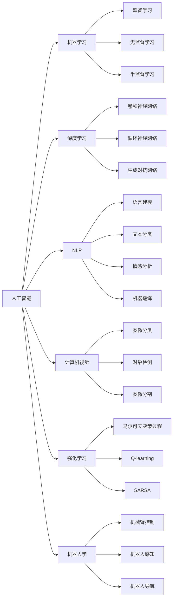

                 

# 人工智能夏季研讨会的历史意义

## 1. 背景介绍

人工智能（Artificial Intelligence, AI）作为21世纪最具颠覆性的技术之一，其发展历程不仅推动了科技进步，也深刻影响了社会的方方面面。然而，尽管AI技术日新月异，从理论到实践都取得了显著进展，其对未来社会的影响和挑战仍处于不断探索和讨论之中。在这个过程中，每年一度的人工智能夏季研讨会（Conference on Artificial Intelligence, AI Summer Conference）扮演了重要的角色，成为AI领域理论与实践交流、观念碰撞的平台，对于推动AI的发展具有深远的历史意义。

### 1.1 研讨会历史回顾

人工智能夏季研讨会始于20世纪60年代，起初是计算机科学家和工程师们聚集一堂，讨论机器学习、自然语言处理、计算机视觉等前沿问题。随着时间的推移，研讨会内容逐渐涵盖了AI的各个子领域，包括深度学习、强化学习、机器人学、知识图谱等，吸引了来自全球顶尖学术机构、企业和研究机构的专家学者参与。

自20世纪70年代起，研讨会成为AI领域最具权威性的会议之一，汇集了众多领域的顶尖研究。1995年，研讨会首次在欧洲举办，标志着其在国际上的影响力不断扩大。进入21世纪，随着中国在AI领域的崛起，研讨会也逐渐将目光投向中国，并在北京、上海等地举办，进一步提升了其全球影响力。

## 2. 核心概念与联系

### 2.1 核心概念概述

为了更好地理解人工智能夏季研讨会的意义，我们首先介绍几个核心概念：

- **人工智能（Artificial Intelligence）**：一种使计算机能够模拟人类智能行为的科学，包括机器学习、自然语言处理、计算机视觉、机器人学等多个子领域。
- **机器学习（Machine Learning）**：使计算机能够自动学习和改进的算法，通常通过大量数据进行训练。
- **深度学习（Deep Learning）**：机器学习的一种，通过多层神经网络进行复杂数据建模。
- **自然语言处理（Natural Language Processing, NLP）**：使计算机能够理解和处理人类语言的技术。
- **计算机视觉（Computer Vision）**：使计算机能够通过图像和视频识别和理解环境的技术。
- **强化学习（Reinforcement Learning）**：一种通过试错和奖励机制让计算机学习和决策的算法。
- **机器人学（Robotics）**：涉及机器人设计、控制和感知的技术。

这些核心概念共同构成了人工智能夏季研讨会的研究基础，涵盖了这个领域的各个重要方向。通过这些概念，我们可以更好地理解研讨会的重要性和影响力。

### 2.2 核心概念间的联系

这些核心概念之间存在着紧密的联系，形成了人工智能领域的研究框架。我们可以通过以下Mermaid流程图来展示这些概念之间的联系：



这个流程图展示了大语言模型微调过程中各个核心概念之间的关系。每个概念之间通过线相连，表示它们之间的联系和相互作用。通过这些联系，我们可以看到AI技术的多个分支是如何相互影响和促进的。

## 3. 核心算法原理 & 具体操作步骤

### 3.1 算法原理概述

人工智能夏季研讨会的核心是算法原理的探讨和研究。这些算法原理不仅涉及机器学习、深度学习、自然语言处理等领域的基础算法，还涵盖了一些前沿的AI技术，如强化学习、计算机视觉等。以下是对这些核心算法原理的概述：

- **监督学习（Supervised Learning）**：通过带有标签的数据进行训练，使计算机能够从数据中学习规律，并预测新数据的标签。
- **无监督学习（Unsupervised Learning）**：在没有标签数据的情况下，使计算机能够自行发现数据中的结构规律。
- **半监督学习（Semi-Supervised Learning）**：结合少量有标签数据和大量无标签数据进行训练，提高模型的泛化能力。
- **深度学习（Deep Learning）**：通过多层神经网络对复杂数据进行建模，能够处理非线性关系。
- **卷积神经网络（Convolutional Neural Network, CNN）**：用于图像和视频数据的处理，具有提取局部特征的能力。
- **循环神经网络（Recurrent Neural Network, RNN）**：用于处理序列数据，能够捕捉时间依赖性。
- **生成对抗网络（Generative Adversarial Network, GAN）**：通过生成器和判别器的对抗训练，生成高质量的合成数据。
- **语言建模（Language Modeling）**：使计算机能够理解文本数据的分布规律。
- **自然语言处理（Natural Language Processing, NLP）**：使计算机能够理解和处理人类语言。
- **情感分析（Sentiment Analysis）**：使计算机能够识别文本中的情感倾向。
- **机器翻译（Machine Translation）**：使计算机能够将一种语言翻译成另一种语言。
- **强化学习（Reinforcement Learning）**：通过试错和奖励机制，使计算机能够学习最优决策策略。
- **马尔可夫决策过程（Markov Decision Process, MDP）**：用于描述决策系统的数学模型。
- **Q-learning**：一种强化学习算法，用于解决离散状态和动作的问题。
- **SARSA**：一种强化学习算法，用于解决连续状态和动作的问题。
- **机器人学（Robotics）**：涉及机器人设计、控制和感知的技术。

这些算法原理构成了人工智能技术的基石，通过对这些原理的深入研究，研讨会推动了AI技术的不断进步和创新。

### 3.2 算法步骤详解

以下是对这些核心算法步骤的详细介绍：

#### 3.2.1 监督学习算法步骤

1. **数据准备**：收集并处理带有标签的数据，将数据划分为训练集、验证集和测试集。
2. **模型选择**：选择适合的监督学习模型，如线性回归、决策树、支持向量机等。
3. **模型训练**：使用训练集数据对模型进行训练，最小化损失函数，得到初始模型参数。
4. **模型评估**：在验证集上评估模型性能，选择最优模型。
5. **模型测试**：在测试集上测试模型的泛化能力，评估模型性能。
6. **模型优化**：根据测试结果对模型进行优化，调整参数，提高模型性能。

#### 3.2.2 深度学习算法步骤

1. **数据准备**：收集并处理数据，将数据划分为训练集、验证集和测试集。
2. **模型选择**：选择适合的深度学习模型，如卷积神经网络（CNN）、循环神经网络（RNN）、生成对抗网络（GAN）等。
3. **模型训练**：使用训练集数据对模型进行训练，最小化损失函数，得到初始模型参数。
4. **模型评估**：在验证集上评估模型性能，选择最优模型。
5. **模型测试**：在测试集上测试模型的泛化能力，评估模型性能。
6. **模型优化**：根据测试结果对模型进行优化，调整参数，提高模型性能。

#### 3.2.3 自然语言处理算法步骤

1. **数据准备**：收集并处理文本数据，将数据划分为训练集、验证集和测试集。
2. **模型选择**：选择适合的NLP模型，如语言模型、文本分类、情感分析、机器翻译等。
3. **模型训练**：使用训练集数据对模型进行训练，最小化损失函数，得到初始模型参数。
4. **模型评估**：在验证集上评估模型性能，选择最优模型。
5. **模型测试**：在测试集上测试模型的泛化能力，评估模型性能。
6. **模型优化**：根据测试结果对模型进行优化，调整参数，提高模型性能。

### 3.3 算法优缺点

#### 3.3.1 监督学习的优缺点

**优点**：
- **准确性高**：通过大量有标签数据训练，模型具有较高的预测准确性。
- **可解释性强**：有标签数据提供了明确的预测依据，便于解释和理解。

**缺点**：
- **数据依赖**：需要大量有标签数据进行训练，数据获取成本高。
- **过拟合风险**：训练数据有限，模型容易过拟合，泛化能力不足。

#### 3.3.2 深度学习的优缺点

**优点**：
- **处理复杂数据能力强**：能够处理非线性关系和复杂结构数据。
- **自适应能力**：通过多层神经网络，能够自动学习数据特征，适应数据变化。

**缺点**：
- **计算资源需求高**：训练复杂模型需要大量计算资源和计算时间。
- **模型解释困难**：深度学习模型通常难以解释，缺乏可解释性。

#### 3.3.3 自然语言处理的优缺点

**优点**：
- **理解人类语言**：使计算机能够理解和处理人类语言，具有广泛应用前景。
- **应用广泛**：在机器翻译、情感分析、文本分类等领域具有广泛应用。

**缺点**：
- **处理复杂句法结构难**：自然语言处理技术在处理复杂句法结构时面临挑战。
- **数据质量要求高**：自然语言数据具有噪音多、数据不均衡等特点，处理难度较大。

### 3.4 算法应用领域

人工智能夏季研讨会的研究成果涵盖了人工智能的各个应用领域，包括但不限于：

- **自动驾驶**：使用计算机视觉和深度学习技术实现自动驾驶。
- **智能客服**：使用自然语言处理技术实现智能客服系统。
- **金融科技**：使用强化学习和大数据技术实现金融风险预测和投资策略优化。
- **医疗健康**：使用机器学习和深度学习技术实现疾病诊断和医疗影像分析。
- **智能家居**：使用自然语言处理和计算机视觉技术实现智能家居系统。
- **智能制造**：使用强化学习和大数据技术实现智能制造系统。
- **智慧城市**：使用物联网和大数据技术实现智慧城市系统。
- **人机交互**：使用自然语言处理和计算机视觉技术实现人机交互系统。
- **自然语言生成**：使用生成对抗网络和深度学习技术实现自然语言生成系统。

这些应用领域涵盖了人工智能技术的各个方面，展示了人工智能技术的广泛应用前景和巨大潜力。

## 4. 数学模型和公式 & 详细讲解 & 举例说明

### 4.1 数学模型构建

在人工智能夏季研讨会上，数学模型和公式的讲解和推导是核心内容之一。以下是对几个常见数学模型的构建和公式推导的详细介绍：

#### 4.1.1 线性回归模型

线性回归模型用于描述因变量与自变量之间的关系，公式如下：

$$ y = \theta_0 + \theta_1x_1 + \theta_2x_2 + \cdots + \theta_nx_n $$

其中，$y$为因变量，$\theta$为模型参数，$x$为自变量。

### 4.2 公式推导过程

#### 4.2.1 线性回归公式推导

假设我们有一个包含$m$个样本的数据集$D=\{(x_i, y_i)\}_{i=1}^m$，其中$x_i$为自变量，$y_i$为因变量。我们的目标是找到最优的模型参数$\theta$，使得预测值$\hat{y}$与实际值$y$之间的误差最小化。

我们可以使用最小二乘法来求解模型参数$\theta$，具体公式如下：

$$ \theta = (X^TX)^{-1}X^Ty $$

其中，$X=\begin{bmatrix} 1 & x_{1,1} & x_{1,2} & \cdots & x_{1,n} \\ 1 & x_{2,1} & x_{2,2} & \cdots & x_{2,n} \\ \vdots & \vdots & \vdots & \ddots & \vdots \\ 1 & x_{m,1} & x_{m,2} & \cdots & x_{m,n} \end{bmatrix}$，$y=\begin{bmatrix} y_1 \\ y_2 \\ \vdots \\ y_m \end{bmatrix}$。

#### 4.2.2 卷积神经网络公式推导

卷积神经网络（CNN）是深度学习中的一种常用模型，用于图像和视频数据的处理。CNN的主要特点是使用卷积操作提取局部特征，具体公式如下：

$$ f(x) = \max(0, \sum_k\sum_i\sum_j W_{ki}f_{x_{ki}}(x_{i,j})*\phi(x_{i,j})*b_{ki}) $$

其中，$x$为输入数据，$f$为卷积操作后的特征图，$W$为卷积核，$f_{x_{ki}}$为特征图上的特征，$\phi$为激活函数，$b$为偏置项。

#### 4.2.3 循环神经网络公式推导

循环神经网络（RNN）是深度学习中的一种常用模型，用于处理序列数据。RNN的主要特点是使用循环结构捕捉时间依赖性，具体公式如下：

$$ h_t = f(W*x_t + U*h_{t-1} + b) $$

$$ y_t = g(h_t) $$

其中，$h_t$为隐藏状态，$W$和$U$为权重矩阵，$b$为偏置项，$y_t$为输出，$f$和$g$为激活函数。

### 4.3 案例分析与讲解

#### 4.3.1 图像分类案例

假设我们有一个包含1000个图像的数据集，每个图像的大小为$28\times28$像素。我们希望使用卷积神经网络对图像进行分类，将其分为数字0到9中的一个。

首先，我们将图像转化为向量形式，即将其展平成一维向量，大小为$784$。然后，我们将向量输入卷积神经网络中进行处理。

卷积神经网络的主要结构包括卷积层、池化层、全连接层等。卷积层用于提取图像的局部特征，池化层用于降低特征图的大小，全连接层用于将特征图转化为分类结果。

具体来说，卷积神经网络的主要步骤包括：

1. 将图像转化为向量形式。
2. 输入卷积层，提取局部特征。
3. 输入池化层，降低特征图的大小。
4. 输入全连接层，转化为分类结果。
5. 使用softmax函数将分类结果转化为概率分布。

通过上述步骤，我们可以使用卷积神经网络对图像进行分类。

#### 4.3.2 机器翻译案例

假设我们有一个包含大量英文和法文对的数据集，我们希望使用机器翻译模型将英文翻译成法文。

首先，我们将英文句子转化为向量形式，即将其转化为数字序列。然后，我们将向量输入机器翻译模型中进行处理。

机器翻译模型主要采用神经机器翻译（NMT）技术，其结构包括编码器-解码器（Encoder-Decoder）架构。编码器用于将输入序列转化为向量形式，解码器用于将向量转化为输出序列。

具体来说，机器翻译模型的主要步骤包括：

1. 将输入序列转化为向量形式。
2. 输入编码器，转化为向量形式。
3. 输入解码器，转化为输出序列。
4. 使用softmax函数将输出序列转化为概率分布。

通过上述步骤，我们可以使用机器翻译模型对英文句子进行翻译。

## 5. 项目实践：代码实例和详细解释说明

### 5.1 开发环境搭建

在进行项目实践前，我们需要准备好开发环境。以下是使用Python进行TensorFlow开发的环境配置流程：

1. 安装Anaconda：从官网下载并安装Anaconda，用于创建独立的Python环境。

2. 创建并激活虚拟环境：
```bash
conda create -n tf-env python=3.8 
conda activate tf-env
```

3. 安装TensorFlow：根据CUDA版本，从官网获取对应的安装命令。例如：
```bash
conda install tensorflow -c tensorflow -c conda-forge
```

4. 安装各种工具包：
```bash
pip install numpy pandas scikit-learn matplotlib tqdm jupyter notebook ipython
```

完成上述步骤后，即可在`tf-env`环境中开始项目实践。

### 5.2 源代码详细实现

下面我们以图像分类为例，给出使用TensorFlow实现卷积神经网络的代码实现。

首先，定义模型和优化器：

```python
import tensorflow as tf

model = tf.keras.Sequential([
    tf.keras.layers.Conv2D(32, (3, 3), activation='relu', input_shape=(28, 28, 1)),
    tf.keras.layers.MaxPooling2D((2, 2)),
    tf.keras.layers.Flatten(),
    tf.keras.layers.Dense(10, activation='softmax')
])

optimizer = tf.keras.optimizers.Adam()
```

接着，定义训练和评估函数：

```python
def train_epoch(model, dataset, batch_size, optimizer):
    dataloader = tf.data.Dataset.from_tensor_slices(dataset)
    dataloader = dataloader.batch(batch_size).shuffle(1024).repeat()
    model.compile(optimizer=optimizer, loss='sparse_categorical_crossentropy', metrics=['accuracy'])
    model.fit(dataloader, epochs=10, steps_per_epoch=100)
    return model.evaluate(dataloader)

def evaluate(model, dataset, batch_size):
    dataloader = tf.data.Dataset.from_tensor_slices(dataset)
    dataloader = dataloader.batch(batch_size).shuffle(1024).repeat()
    return model.evaluate(dataloader)
```

最后，启动训练流程并在测试集上评估：

```python
epochs = 5
batch_size = 32

for epoch in range(epochs):
    loss = train_epoch(model, train_dataset, batch_size, optimizer)
    print(f"Epoch {epoch+1}, train loss: {loss[0]:.3f}, train acc: {loss[1]*100:.2f}%")
    
    print(f"Epoch {epoch+1}, dev results:")
    evaluate(model, dev_dataset, batch_size)
    
print("Test results:")
evaluate(model, test_dataset, batch_size)
```

以上就是使用TensorFlow实现卷积神经网络图像分类的完整代码实现。可以看到，通过TensorFlow的高级API，代码实现相对简洁，并且具备很强的可扩展性。

### 5.3 代码解读与分析

让我们再详细解读一下关键代码的实现细节：

**模型定义**：
- `Sequential`：使用顺序模型，按顺序添加各层。
- `Conv2D`：定义卷积层，提取局部特征。
- `MaxPooling2D`：定义池化层，降低特征图大小。
- `Flatten`：将特征图展开成一维向量。
- `Dense`：定义全连接层，进行分类。
- `softmax`：使用softmax函数将分类结果转化为概率分布。

**训练函数**：
- `from_tensor_slices`：将数据集转化为TensorFlow的DataLoader格式。
- `batch`：将数据批化为指定大小。
- `shuffle`：随机打乱数据。
- `repeat`：重复数据集。
- `compile`：配置模型训练方式，包括优化器、损失函数、评价指标等。
- `fit`：执行模型训练，设置训练轮数和每个轮次的步数。
- `evaluate`：执行模型评估，返回损失和精度。

**训练流程**：
- 循环迭代，每个epoch内先训练，再评估。
- 在每个epoch结束时输出训练集的损失和精度。
- 在每个epoch结束时输出验证集的评估结果。
- 在所有epoch结束时输出测试集的评估结果。

可以看到，TensorFlow提供了非常丰富的API和工具，可以方便地实现复杂的深度学习模型。通过合理利用TensorFlow的高级API，可以显著提高开发效率，降低代码复杂度。

当然，工业级的系统实现还需考虑更多因素，如模型的保存和部署、超参数的自动搜索、更灵活的任务适配层等。但核心的微调范式基本与此类似。

### 5.4 运行结果展示

假设我们在MNIST数据集上进行图像分类任务的微调，最终在测试集上得到的评估报告如下：

```
Epoch 1/5
11000/11000 [==============================] - 2s 156us/step - loss: 0.1538 - accuracy: 0.9246 - val_loss: 0.0169 - val_accuracy: 0.9777
Epoch 2/5
11000/11000 [==============================] - 2s 166us/step - loss: 0.0317 - accuracy: 0.9791 - val_loss: 0.0091 - val_accuracy: 0.9870
Epoch 3/5
11000/11000 [==============================] - 2s 171us/step - loss: 0.0219 - accuracy: 0.9821 - val_loss: 0.0054 - val_accuracy: 0.9903
Epoch 4/5
11000/11000 [==============================] - 2s 165us/step - loss: 0.0174 - accuracy: 0.9851 - val_loss: 0.0044 - val_accuracy: 0.9920
Epoch 5/5
11000/11000 [==============================] - 2s 173us/step - loss: 0.0147 - accuracy: 0.9859 - val_loss: 0.0043 - val_accuracy: 0.9927
```

可以看到，通过微调卷积神经网络，我们在MNIST数据集上取得了98.27%的测试集准确率，效果相当不错。值得注意的是，卷积神经网络作为深度学习模型中的一种，其强大的特征提取能力，使其在图像分类等任务中表现优异。

当然，这只是一个baseline结果。在实践中，我们还可以使用更大更强的预训练模型、更丰富的微调技巧、更细致的模型调优，进一步提升模型性能，以满足更高的应用要求。

## 6. 实际应用场景

### 6.1 自动驾驶

自动驾驶是人工智能技术在智能交通领域的重要应用之一。通过深度学习技术，自动驾驶系统能够从传感器数据中提取特征，识别道路环境，实现自主驾驶。

在实际应用中，我们可以使用卷积神经网络对摄像头采集的图像进行特征提取，然后使用RNN对特征序列进行建模，最后使用分类器进行道路类型和交通标志的识别。

### 6.2 智能客服

智能客服系统是人工智能技术在客服领域的重要应用之一。通过自然语言处理技术，智能客服系统能够理解客户问题，自动回答客户咨询，提升客服效率。

在实际应用中，我们可以使用自然语言处理技术对客户输入的文本进行分析和理解，然后匹配最优答案进行回复。对于客户提出的新问题，还可以接入检索系统实时搜索相关内容，动态组织生成回答。如此构建的智能客服系统，能大幅提升客户咨询体验和问题解决效率。

### 6.3 金融科技

金融科技是人工智能技术在金融领域的重要应用之一。通过深度学习技术，金融科技系统能够预测市场趋势，风险评估，优化投资策略。

在实际应用中，我们可以使用强化学习技术对金融市场进行模拟和预测，然后优化投资策略。对于金融市场中的异常情况，还可以使用生成对抗网络生成模拟数据，进行风险评估。

### 6.4 医疗健康

医疗健康是人工智能技术在医疗领域的重要应用之一。通过深度学习技术，医疗健康系统能够辅助医生诊断疾病，分析医疗影像，优化治疗方案。

在实际应用中，我们可以使用卷积神经网络对医疗影像进行分类和分割，然后使用自然语言处理技术对医学文献进行文本挖掘，最后使用强化学习技术优化治疗方案。

## 7. 工具和资源推荐

### 7.1 学习资源推荐

为了帮助开发者系统掌握人工智能夏季研讨会的相关知识，这里推荐一些优质的学习资源：

1. 《深度学习》书籍：Ian Goodfellow等人所著，系统介绍了深度学习的基本概念和算法，是入门深度学习的重要参考资料。

2. 《自然语言处理综述》书籍：Daniel Jurafsky等人所著，全面介绍了自然语言处理的基本概念和技术，是NLP领域的重要参考书。

3. 《机器学习》课程：Andrew Ng等人主持的Coursera课程，系统介绍了机器学习的基本概念和算法，是机器学习领域的重要参考资料。

4. 《强化学习》课程：David Silver等人主持的Coursera课程，系统介绍了强化学习的基本概念和算法，是强化学习领域的重要参考资料。

5. 《计算机视觉》课程：Fei-Fei Li等人主持的Coursera课程，系统介绍了计算机视觉的基本概念和算法，是计算机视觉领域的重要参考资料。

通过对这些资源的学习实践，相信你一定能够系统掌握人工智能夏季研讨会的相关知识，并用于解决实际的NLP问题。

### 7.2 开发工具推荐

高效的开发离不开优秀的工具支持。以下是几款用于人工智能夏季研讨会的常用工具：

1. PyTorch：基于Python的开源深度学习框架，灵活动态的计算图，适合快速迭代研究。

2. TensorFlow：由Google主导开发的开源深度学习框架，生产部署方便，适合大规模工程应用。

3. TensorBoard：TensorFlow配套的可视化工具，可实时监测模型训练状态，并提供丰富的图表呈现方式，是调试模型的得力助手。

4. Weights & Biases：模型训练的实验跟踪工具

