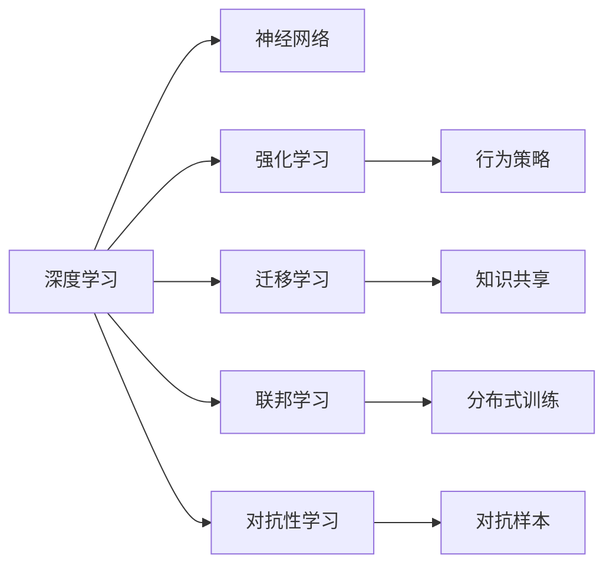
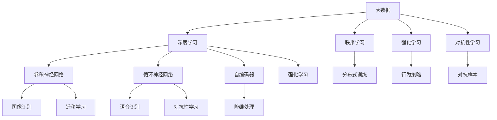

                 

# 人类智慧：AI 时代的新力量

## 1. 背景介绍

### 1.1 问题由来
人工智能（AI）已经迅速成为推动社会进步和改善人类生活的重要力量。随着大数据、深度学习、强化学习等技术的不断突破，AI已经从传统的领域任务，拓展到了更为广阔的应用场景。然而，在AI快速发展的过程中，我们也面临着一系列挑战，包括技术壁垒、数据隐私、伦理道德等。如何利用AI技术提升人类智慧，为人类社会的可持续发展提供新动力，成为了当前科技界和产业界共同关注的热点问题。

### 1.2 问题核心关键点
1. **数据驱动**：AI的发展离不开海量数据的支撑。如何高效地收集、存储、处理和利用数据，是AI技术创新的关键。
2. **算法创新**：深度学习、强化学习、迁移学习等算法的不断进步，为AI技术提供了强大的工具支持。
3. **人机协同**：在AI辅助下，人机协同的能力显著提升，特别是在医疗、教育、金融等领域。
4. **伦理与道德**：AI技术的应用必须遵循伦理和道德规范，避免对人类社会造成负面影响。
5. **可持续发展**：在追求经济效益的同时，AI技术也需要考虑其对社会、环境的影响，实现可持续发展。

### 1.3 问题研究意义
研究AI技术如何更好地服务于人类智慧，具有重要的理论价值和实际意义：

1. **提升决策质量**：AI技术可以辅助人类做出更加科学、合理的决策，特别是在复杂多变的环境下。
2. **优化资源配置**：AI能够优化资源配置，提高生产效率和生活质量，促进社会公平。
3. **应对全球挑战**：AI技术在应对气候变化、公共健康等全球性问题中，具有重要的作用。
4. **推动创新发展**：AI技术的发展为各行业的创新提供了新的工具和方法，推动了技术的进步和产业升级。
5. **促进跨界融合**：AI技术与各个领域的深度融合，带来了跨界创新的新机遇。

## 2. 核心概念与联系

### 2.1 核心概念概述

为更好地理解AI如何提升人类智慧，本节将介绍几个密切相关的核心概念：

- **人工智能**：指通过计算机技术和算法，使机器具有人类智能的过程。
- **深度学习**：一种基于神经网络的学习范式，通过多层非线性变换，从数据中自动提取特征，并进行分类、回归等任务。
- **强化学习**：一种通过与环境交互，不断调整行为策略，以最大化长期奖励的学习方法。
- **迁移学习**：指在多个相关任务之间，通过知识共享，提高学习效率和性能的方法。
- **联邦学习**：一种分布式学习方法，多个参与方在不共享数据的前提下，共同训练模型，提升模型性能。
- **对抗性学习**：通过引入对抗样本，提高模型的鲁棒性和泛化能力。

这些核心概念之间存在紧密的联系，共同构成了AI技术的核心框架。

### 2.2 概念间的关系

这些核心概念之间的关系可以通过以下Mermaid流程图来展示：



这个流程图展示了深度学习、强化学习、迁移学习、联邦学习、对抗性学习之间的联系和区别。

### 2.3 核心概念的整体架构

最后，我们用一个综合的流程图来展示这些核心概念在大数据、深度学习、强化学习等技术框架下的整体架构：



这个综合流程图展示了从大数据到深度学习、强化学习等核心技术的演进路径，以及它们在具体应用中的关联和作用。

## 3. 核心算法原理 & 具体操作步骤
### 3.1 算法原理概述

AI技术提升人类智慧，本质上是通过数据驱动的算法，构建人类智能的模型。其核心算法包括深度学习、强化学习、迁移学习等，这些算法通过不同的方法和机制，实现对人类智能的模拟和扩展。

以深度学习为例，其基本原理是通过多层神经网络，自动学习输入数据的特征表示，并通过反向传播算法，优化网络参数，使得模型能够准确地预测或分类输入数据。深度学习在图像识别、语音识别、自然语言处理等领域取得了突破性进展，极大地提升了人类对这些领域任务的处理能力。

### 3.2 算法步骤详解

深度学习的核心步骤包括数据预处理、模型构建、训练优化、模型评估等。以图像识别任务为例，其主要步骤如下：

1. **数据预处理**：将原始图像进行归一化、增强、旋转等预处理操作，以提高模型的泛化能力。
2. **模型构建**：选择合适的卷积神经网络（CNN）架构，并进行参数初始化。
3. **训练优化**：使用反向传播算法，通过随机梯度下降等优化方法，最小化损失函数，更新模型参数。
4. **模型评估**：在测试集上评估模型性能，如准确率、召回率等指标。

### 3.3 算法优缺点

深度学习等AI技术在提升人类智慧方面具有以下优点：

1. **高效性**：通过大规模数据训练，深度学习可以自动化地学习复杂特征，极大地提升了任务处理效率。
2. **可扩展性**：深度学习模型具有较好的可扩展性，可以通过增加层数、节点数等，提升模型复杂度，适应更多任务。
3. **泛化能力**：深度学习模型具有良好的泛化能力，能够在不同数据集上表现出色。

但同时也存在以下缺点：

1. **数据依赖性**：深度学习模型高度依赖数据质量，数据偏差可能导致模型学习到错误的模式。
2. **黑箱问题**：深度学习模型通常被认为是"黑箱"，难以解释其决策过程，限制了其在某些领域的应用。
3. **资源消耗**：深度学习模型通常需要较大的计算资源和存储空间，增加了训练和部署的成本。

### 3.4 算法应用领域

深度学习等AI技术在多个领域取得了显著应用：

1. **医疗领域**：在影像诊断、病理分析、基因组学等领域，深度学习技术提升了诊断准确率，减少了误诊率。
2. **金融领域**：在风险评估、信用评分、欺诈检测等方面，深度学习技术提高了金融机构的决策效率和风险控制能力。
3. **教育领域**：在智能辅导、学习评估、个性化推荐等方面，深度学习技术提供了更好的教育体验和效果。
4. **交通领域**：在智能驾驶、交通管理、事故预测等方面，深度学习技术提高了交通系统的安全和效率。
5. **媒体领域**：在内容推荐、情感分析、文本生成等方面，深度学习技术增强了媒体平台的用户体验。

## 4. 数学模型和公式 & 详细讲解

### 4.1 数学模型构建

深度学习模型的构建通常基于以下基本框架：

- **输入层**：将原始数据转换为网络可以处理的格式。
- **隐藏层**：通过多层非线性变换，提取数据特征。
- **输出层**：根据任务需求，输出预测结果或分类结果。

以图像识别为例，输入层通常为图像像素，输出层为分类结果。隐藏层可以是卷积层、池化层、全连接层等多种类型。

### 4.2 公式推导过程

以二分类任务为例，假设模型输入为 $x$，输出为 $y$，隐藏层输出为 $z$，模型参数为 $\theta$。常用的模型形式为：

$$
y = f(z; \theta)
$$

其中 $f$ 为激活函数，如 ReLU、Sigmoid 等。对于二分类任务，常用交叉熵损失函数：

$$
L(y, y') = -y\log(y') - (1-y)\log(1-y')
$$

在训练过程中，使用梯度下降算法，最小化损失函数：

$$
\theta \leftarrow \theta - \eta \nabla_{\theta}L(y, y')
$$

其中 $\eta$ 为学习率，$\nabla_{\theta}L(y, y')$ 为损失函数对参数 $\theta$ 的梯度。

### 4.3 案例分析与讲解

以图像分类任务为例，使用卷积神经网络（CNN）进行模型构建：

```python
import torch
import torch.nn as nn
import torchvision.transforms as transforms
from torch.utils.data import DataLoader

# 定义模型结构
class Net(nn.Module):
    def __init__(self):
        super(Net, self).__init__()
        self.conv1 = nn.Conv2d(3, 32, 3, padding=1)
        self.conv2 = nn.Conv2d(32, 64, 3, padding=1)
        self.pool = nn.MaxPool2d(2, 2)
        self.fc1 = nn.Linear(64 * 4 * 4, 128)
        self.fc2 = nn.Linear(128, 10)
        self.dropout = nn.Dropout(p=0.2)

    def forward(self, x):
        x = self.pool(torch.relu(self.conv1(x)))
        x = self.pool(torch.relu(self.conv2(x)))
        x = x.view(-1, 64 * 4 * 4)
        x = torch.relu(self.fc1(x))
        x = self.dropout(x)
        x = torch.relu(self.fc2(x))
        return x

# 定义训练过程
def train(model, device, train_loader, optimizer, criterion, num_epochs):
    model.to(device)
    for epoch in range(num_epochs):
        for idx, (data, target) in enumerate(train_loader):
            data, target = data.to(device), target.to(device)
            optimizer.zero_grad()
            output = model(data)
            loss = criterion(output, target)
            loss.backward()
            optimizer.step()
```

通过上述代码，可以看到，使用 PyTorch 构建的卷积神经网络模型，通过数据预处理、模型构建、训练优化等步骤，能够实现高效的图像分类任务。

## 5. 项目实践：代码实例和详细解释说明

### 5.1 开发环境搭建

在进行AI项目实践前，我们需要准备好开发环境。以下是使用Python进行PyTorch开发的环境配置流程：

1. 安装Anaconda：从官网下载并安装Anaconda，用于创建独立的Python环境。

2. 创建并激活虚拟环境：
```bash
conda create -n pytorch-env python=3.8 
conda activate pytorch-env
```

3. 安装PyTorch：根据CUDA版本，从官网获取对应的安装命令。例如：
```bash
conda install pytorch torchvision torchaudio cudatoolkit=11.1 -c pytorch -c conda-forge
```

4. 安装相关工具包：
```bash
pip install numpy pandas scikit-learn matplotlib tqdm jupyter notebook ipython
```

完成上述步骤后，即可在`pytorch-env`环境中开始AI项目实践。

### 5.2 源代码详细实现

这里以图像分类任务为例，给出使用PyTorch进行CNN模型训练的代码实现。

```python
import torch
import torch.nn as nn
import torchvision.transforms as transforms
from torch.utils.data import DataLoader
from torchvision.datasets import CIFAR10

# 定义数据预处理函数
transform_train = transforms.Compose([
    transforms.RandomCrop(32, padding=4),
    transforms.RandomHorizontalFlip(),
    transforms.ToTensor(),
    transforms.Normalize((0.4914, 0.4822, 0.4465), (0.2023, 0.1994, 0.2010))
])

transform_test = transforms.Compose([
    transforms.ToTensor(),
    transforms.Normalize((0.4914, 0.4822, 0.4465), (0.2023, 0.1994, 0.2010))
])

# 加载CIFAR-10数据集
train_set = CIFAR10(root='./data', train=True, download=True, transform=transform_train)
test_set = CIFAR10(root='./data', train=False, download=True, transform=transform_test)

# 定义数据加载器
train_loader = DataLoader(train_set, batch_size=64, shuffle=True)
test_loader = DataLoader(test_set, batch_size=64, shuffle=False)

# 定义模型结构
class Net(nn.Module):
    def __init__(self):
        super(Net, self).__init__()
        self.conv1 = nn.Conv2d(3, 32, 3, padding=1)
        self.conv2 = nn.Conv2d(32, 64, 3, padding=1)
        self.pool = nn.MaxPool2d(2, 2)
        self.fc1 = nn.Linear(64 * 4 * 4, 128)
        self.fc2 = nn.Linear(128, 10)
        self.dropout = nn.Dropout(p=0.2)

    def forward(self, x):
        x = self.pool(torch.relu(self.conv1(x)))
        x = self.pool(torch.relu(self.conv2(x)))
        x = x.view(-1, 64 * 4 * 4)
        x = torch.relu(self.fc1(x))
        x = self.dropout(x)
        x = torch.relu(self.fc2(x))
        return x

# 定义模型参数
model = Net().to(device)

# 定义优化器和损失函数
optimizer = torch.optim.Adam(model.parameters(), lr=0.001)
criterion = nn.CrossEntropyLoss()

# 定义训练过程
def train(model, device, train_loader, optimizer, criterion, num_epochs):
    model.train()
    for epoch in range(num_epochs):
        for idx, (data, target) in enumerate(train_loader):
            data, target = data.to(device), target.to(device)
            optimizer.zero_grad()
            output = model(data)
            loss = criterion(output, target)
            loss.backward()
            optimizer.step()
```

通过上述代码，可以看到，使用PyTorch构建的卷积神经网络模型，通过数据预处理、模型构建、训练优化等步骤，能够实现高效的图像分类任务。

### 5.3 代码解读与分析

让我们再详细解读一下关键代码的实现细节：

**数据预处理函数**：
- `transform_train` 和 `transform_test` 分别定义了训练集和测试集的数据预处理流程，包括随机裁剪、水平翻转、归一化等步骤。

**CIFAR-10数据集加载**：
- `train_set` 和 `test_set` 分别定义了CIFAR-10数据集的加载，使用 `transform_train` 和 `transform_test` 进行数据预处理。

**模型定义**：
- `Net` 类定义了卷积神经网络的结构，包括卷积层、池化层、全连接层等。

**模型训练过程**：
- 在训练函数 `train` 中，首先设置模型的训练状态为 True，然后对数据进行迭代训练。

**优化器和损失函数**：
- 使用 Adam 优化器和交叉熵损失函数，进行模型参数的更新和损失计算。

通过上述代码，可以看到，使用 PyTorch 构建的卷积神经网络模型，通过数据预处理、模型构建、训练优化等步骤，能够实现高效的图像分类任务。

## 6. 实际应用场景

### 6.1 智能医疗

AI技术在医疗领域的应用已经取得了显著进展，特别是在医学影像诊断、病理分析、基因组学等方面。深度学习等技术能够快速处理大量医疗数据，提供精准的诊断和治疗建议，显著提升了医疗服务的效率和质量。

### 6.2 金融风险管理

AI技术在金融领域的应用，特别是在风险管理和欺诈检测方面，具有重要的应用价值。通过深度学习等技术，金融机构能够实时分析市场数据，预测风险趋势，及时采取措施，降低金融风险。

### 6.3 智能制造

AI技术在制造领域的应用，特别是在智能制造和供应链管理方面，具有显著的提升效果。通过深度学习等技术，制造企业能够实时监控生产线，优化生产流程，提高生产效率，降低生产成本。

### 6.4 环境保护

AI技术在环境保护方面的应用，特别是在气候变化监测、环境污染治理等方面，具有重要的应用价值。通过深度学习等技术，科学家能够实时分析环境数据，预测环境变化趋势，及时采取措施，保护生态环境。

## 7. 工具和资源推荐

### 7.1 学习资源推荐

为了帮助开发者系统掌握AI技术的基本原理和实践技巧，这里推荐一些优质的学习资源：

1. 《深度学习》系列课程：斯坦福大学和Coursera合作推出的深度学习课程，涵盖了深度学习的基本概念和经典模型。
2. 《TensorFlow实战》书籍：TensorFlow官方出版的实战指南，详细介绍了TensorFlow的用法和最佳实践。
3. 《动手学深度学习》在线教材：由李沐等人编写，涵盖深度学习的理论基础和实践技巧。
4. 《Python深度学习》书籍：Francois Chollet所著，详细介绍了TensorFlow和Keras的使用方法。
5. 《深度学习入门》书籍：斋藤康毅所著，涵盖深度学习的基本概念和经典模型，适合初学者入门。

通过对这些资源的学习实践，相信你一定能够快速掌握AI技术的基本原理和实践技巧，并用于解决实际问题。

### 7.2 开发工具推荐

高效的开发离不开优秀的工具支持。以下是几款用于AI项目开发的常用工具：

1. TensorFlow：由Google主导开发的深度学习框架，支持大规模分布式训练和部署。
2. PyTorch：由Facebook主导开发的深度学习框架，灵活易用，适合快速迭代开发。
3. Keras：由Francois Chollet主导的高级神经网络API，易于上手，适合初学者使用。
4. Jupyter Notebook：支持代码、文本、图表等多种格式，适合进行交互式开发和数据可视化。
5. Anaconda：Python的虚拟环境管理工具，支持多种第三方包的安装和版本管理。

合理利用这些工具，可以显著提升AI项目开发的效率和质量。

### 7.3 相关论文推荐

AI技术的发展源于学界的持续研究。以下是几篇奠基性的相关论文，推荐阅读：

1. AlexNet：ImageNet大规模视觉识别竞赛冠军模型，标志着深度学习时代的开始。
2. ResNet：深度残差网络，解决了深度网络退化的问题，推动了深度学习的进一步发展。
3. AlphaGo：使用深度强化学习技术，在围棋比赛中击败人类冠军，展示了深度学习的巨大潜力。
4. GAN：生成对抗网络，通过生成器和判别器的对抗训练，生成高质量的图像和视频。
5. Attention Mechanism：Transformer中的注意力机制，极大提升了深度学习模型的性能和应用范围。

这些论文代表了大数据、深度学习、强化学习等技术的发展脉络，为AI技术的发展提供了重要参考。

除上述资源外，还有一些值得关注的前沿资源，帮助开发者紧跟AI技术的发展趋势，例如：

1. arXiv论文预印本：人工智能领域最新研究成果的发布平台，包括大量尚未发表的前沿工作，学习前沿技术的必读资源。
2. 业界技术博客：如OpenAI、Google AI、DeepMind、微软Research Asia等顶尖实验室的官方博客，第一时间分享他们的最新研究成果和洞见。
3. 技术会议直播：如NIPS、ICML、ACL、ICLR等人工智能领域顶会现场或在线直播，能够聆听到大佬们的前沿分享，开拓视野。
4. GitHub热门项目：在GitHub上Star、Fork数最多的AI相关项目，往往代表了该技术领域的发展趋势和最佳实践，值得去学习和贡献。
5. 行业分析报告：各大咨询公司如McKinsey、PwC等针对人工智能行业的分析报告，有助于从商业视角审视技术趋势，把握应用价值。

总之，对于AI项目的学习和实践，需要开发者保持开放的心态和持续学习的意愿。多关注前沿资讯，多动手实践，多思考总结，必将收获满满的成长收益。

## 8. 总结：未来发展趋势与挑战

### 8.1 总结

本文对AI技术如何提升人类智慧进行了全面系统的介绍。首先阐述了AI技术在医疗、金融、制造、环境保护等领域的广泛应用，明确了AI技术对人类社会的深远影响。其次，从原理到实践，详细讲解了深度学习等核心算法的基本原理和具体操作步骤，给出了具体的代码实例。同时，本文还探讨了AI技术在实际应用中面临的挑战，提出了相应的解决方案。

通过本文的系统梳理，可以看到，AI技术在提升人类智慧方面具有巨大的潜力和广泛的应用前景。然而，要充分发挥AI技术的优势，还需不断突破技术瓶颈，解决实际问题，确保AI技术的应用符合伦理道德，促进人类社会的可持续发展。

### 8.2 未来发展趋势

展望未来，AI技术的发展将呈现以下几个趋势：

1. **模型可解释性增强**：AI模型的可解释性将成为重要的研究方向，通过对模型决策过程的透明化，提升AI技术的可信度和可控性。
2. **跨领域融合**：AI技术将与更多领域进行深度融合，推动跨学科创新，解决复杂多变的问题。
3. **分布式训练优化**：随着数据规模的扩大，分布式训练成为必然选择，如何优化分布式训练算法，提高训练效率，是未来的重要研究方向。
4. **知识图谱的引入**：将知识图谱等外部知识与AI模型进行融合，提升模型的认知能力和推理能力。
5. **边缘计算的普及**：将AI技术部署到边缘设备，实现实时处理和决策，提升系统的响应速度和可靠性。

这些趋势将进一步推动AI技术的发展，提升其在各领域的应用水平，带来更多创新突破。

### 8.3 面临的挑战

尽管AI技术在提升人类智慧方面取得了显著成就，但在应用过程中仍面临以下挑战：

1. **数据隐私保护**：如何在保证数据隐私的前提下，充分利用数据进行AI训练，是未来的重要课题。
2. **模型鲁棒性提升**：AI模型在面对对抗样本和噪声数据时，容易出现错误，如何提高模型的鲁棒性，是一个亟待解决的问题。
3. **伦理道德问题**：AI技术的应用必须遵循伦理道德规范，避免对人类社会造成负面影响。
4. **计算资源瓶颈**：AI模型通常需要大量的计算资源，如何优化模型结构，降低计算成本，是未来的重要研究方向。
5. **跨领域应用限制**：AI技术在特定领域的应用效果往往不如预期，如何提高AI技术的泛化能力，是未来的重要课题。

这些挑战需要科技界和产业界共同努力，通过技术创新和政策支持，逐步解决这些问题。

### 8.4 研究展望

面对AI技术面临的挑战，未来的研究需要在以下几个方面寻求新的突破：

1. **跨模态学习**：将视觉、语音、文本等多种模态数据进行融合，提升AI系统的综合能力。
2. **因果推理**：通过引入因果推断方法，提升AI系统的推理能力和泛化能力。
3. **模型压缩**：通过模型压缩技术，降低计算成本，提升系统性能。
4. **模型优化**：通过模型优化技术，提高模型的训练效率和性能。
5. **数据增强**：通过数据增强技术，提升模型的泛化能力和鲁棒性。

这些研究方向的探索，必将引领AI技术迈向更高的台阶，为人类社会带来更多创新突破。

## 9. 附录：常见问题与解答

**Q1：AI技术如何提升人类智慧？**

A: AI技术通过数据驱动的算法，构建人类智能的模型。通过深度学习等技术，AI模型可以高效地处理大量数据，提取复杂特征，进行分类、回归等任务。这些模型在医疗、金融、制造、环境保护等领域，已经展现出显著的应用价值，提升了人类在这些领域的工作效率和生活质量。

**Q2：AI技术在实际应用中面临哪些挑战？**

A: AI技术在实际应用中面临以下挑战：
1. 数据隐私保护：如何在保证数据隐私的前提下，充分利用数据进行AI训练，是一个重要的课题。
2. 模型鲁棒性提升：AI模型在面对对抗样本和噪声数据时，容易出现错误，如何提高模型的鲁棒性，是未来的重要研究方向。
3. 伦理道德问题：AI技术的应用必须遵循伦理道德规范，避免对人类社会造成负面影响。
4. 计算资源瓶颈：AI模型通常需要大量的计算资源，如何优化模型结构，降低计算成本，是未来的重要研究方向。
5. 跨领域应用限制：AI技术在特定领域的应用效果往往不如预期，如何提高AI技术的泛化能力，是未来的重要课题。

**Q3：AI技术在未来的发展方向有哪些？**

A: AI技术在未来的发展方向包括以下几个方面：
1. 模型可解释性增强：AI模型的可解释性将成为重要的研究方向，通过对模型决策过程的透明化，提升AI技术的可信度和可控性。
2. 跨领域融合：AI技术将与更多领域进行深度融合，推动跨学科创新，解决复杂多变的问题。
3. 分布式训练优化：随着数据规模的扩大，分布式训练成为必然选择，如何优化分布式训练算法，提高训练效率，是未来的重要研究方向。
4. 知识图谱的引入：将知识图谱等外部知识与AI模型进行融合，提升模型的认知能力和推理能力。
5. 边缘计算的普及：将AI技术部署到边缘设备，实现实时处理和决策，提升系统的响应速度和可靠性。

总之，AI技术在未来的发展方向将继续向着智能化、泛化能力、鲁棒性、可解释

