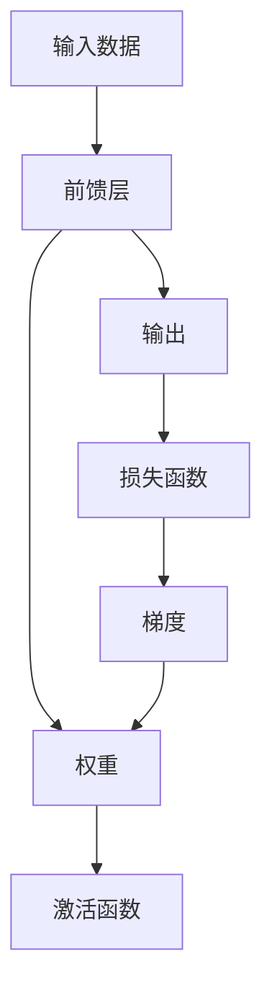

                 

# 从零开始大模型开发与微调：前馈层的实现

> 关键词：大模型开发, 微调, 前馈层, 深度学习, 正向传播, 反向传播

## 1. 背景介绍

### 1.1 问题由来

随着深度学习技术的飞速发展，大规模预训练模型（如BERT、GPT等）在自然语言处理（NLP）领域取得了显著进展。这些模型通过在大规模无标签文本数据上预训练，学习到了丰富的语言表示，能够进行高质量的文本分类、命名实体识别、机器翻译等任务。然而，预训练模型在特定任务上的性能仍有一定的局限性，需要进行微调以适应具体应用场景。微调（Fine-tuning）是指在预训练模型的基础上，通过在特定任务上的少量有标签数据上进行有监督学习，优化模型在该任务上的表现。本文将重点介绍从零开始构建大模型的前馈层，并进行微调的实现。

### 1.2 问题核心关键点

微调的核心在于通过有标签数据来更新预训练模型的权重，使得模型在特定任务上表现更好。微调的关键步骤包括：

1. **准备数据集**：收集与目标任务相关的有标签数据集。
2. **模型初始化**：加载预训练模型，并进行必要的调整。
3. **损失函数定义**：根据目标任务，定义合适的损失函数。
4. **优化器选择**：选择适合的优化器（如Adam、SGD等）及其参数。
5. **训练过程**：通过反向传播更新模型参数，最小化损失函数。
6. **评估与验证**：在验证集上评估模型性能，防止过拟合。
7. **测试与部署**：在测试集上评估最终模型，并部署到实际应用中。

本文将从这些关键点出发，详细讲解大模型前馈层的实现及微调方法。

### 1.3 问题研究意义

大模型的微调技术对于提升NLP任务的性能、降低开发成本、加速应用落地具有重要意义：

1. **提升性能**：通过微调，预训练模型的泛化能力得到进一步提升，适应特定任务的效果显著。
2. **降低成本**：微调可以在现有预训练模型基础上快速迭代，减少从头训练所需的数据和计算资源。
3. **加速落地**：微调过程相对简单高效，能够迅速将大模型应用到实际业务中。
4. **技术创新**：微调带来了诸如参数高效微调、提示学习等前沿技术，推动了NLP领域的发展。

## 2. 核心概念与联系

### 2.1 核心概念概述

在微调过程中，前馈层是实现正向传播和反向传播的核心组成部分。前馈层由多个神经元组成，每个神经元接收输入、加权和、激活函数等操作，最终输出结果。以下是关键概念的概述：

1. **神经元（Neuron）**：前馈层的构建块，接收输入、加权和、激活函数等操作。
2. **权重（Weight）**：神经元之间的连接权重，通过反向传播更新。
3. **激活函数（Activation Function）**：用于非线性映射，如ReLU、Sigmoid等。
4. **正向传播（Forward Propagation）**：将输入数据依次经过各个神经元，计算输出结果。
5. **反向传播（Backward Propagation）**：根据损失函数计算梯度，更新权重。
6. **梯度下降（Gradient Descent）**：优化器中最常用的更新规则，通过梯度下降来更新权重。

### 2.2 概念间的关系

前馈层的实现依赖于正向传播和反向传播，这两者是深度学习模型的基本组成部分。正向传播计算模型输出，反向传播用于计算梯度更新权重。以下是这些概念间的逻辑关系：



正向传播从输入数据开始，经过前馈层的神经元，计算得到输出。反向传播则从输出开始，通过计算损失函数和梯度，更新权重和激活函数。这些过程相互作用，构成深度学习模型的核心算法。

### 2.3 核心概念的整体架构

下图展示了前馈层的整体架构，包括输入、神经元、权重、激活函数、输出和损失函数：


## 3. 核心算法原理 & 具体操作步骤

### 3.1 算法原理概述

前馈层的实现基于正向传播和反向传播。正向传播从输入数据开始，通过一系列加权和、激活函数等操作，计算出模型的输出结果。反向传播则从输出结果开始，通过计算损失函数的梯度，更新模型参数。

以下是正向传播和反向传播的基本流程：

1. **正向传播**：
   - 将输入数据输入神经元。
   - 计算每个神经元的加权和。
   - 通过激活函数进行非线性映射，输出结果。

2. **反向传播**：
   - 计算损失函数的梯度。
   - 通过反向传播计算每个神经元的梯度。
   - 更新权重和激活函数，最小化损失函数。

### 3.2 算法步骤详解

下面是具体的算法步骤：

**Step 1: 准备数据集**

假设我们有如下的有标签数据集 $D = \{(x_i, y_i)\}_{i=1}^N$，其中 $x_i$ 是输入数据，$y_i$ 是对应的标签。

**Step 2: 模型初始化**

1. 加载预训练模型 $M_0$，并进行必要的调整。
2. 定义前馈层的结构，包括神经元的数量和激活函数。
3. 初始化权重矩阵 $W$ 和偏置向量 $b$。

**Step 3: 定义损失函数**

根据任务类型，选择合适的损失函数。例如，分类任务可以使用交叉熵损失函数。

**Step 4: 选择优化器**

常用的优化器包括Adam、SGD等，需要选择合适的学习率、批大小等超参数。

**Step 5: 训练过程**

1. 将数据集划分为训练集、验证集和测试集。
2. 循环迭代训练集，进行正向传播和反向传播。
3. 在每个epoch结束时，在验证集上评估模型性能，防止过拟合。
4. 在测试集上评估最终模型性能。

**Step 6: 评估与验证**

1. 在验证集上评估模型性能，记录各项指标如准确率、精度等。
2. 根据评估结果调整模型参数。

**Step 7: 测试与部署**

1. 在测试集上评估最终模型性能。
2. 将模型部署到实际应用中。

### 3.3 算法优缺点

**优点：**
1. 能够快速提升模型在特定任务上的性能。
2. 需要较少的数据和计算资源。
3. 模型结构简单，易于实现和部署。

**缺点：**
1. 对标注数据依赖较大。
2. 模型泛化能力有限，容易过拟合。
3. 需要仔细调参，选择合适的前馈层结构和优化器。

### 3.4 算法应用领域

大模型的微调方法已经广泛应用于NLP领域的各类任务，例如：

1. 文本分类：如情感分析、主题分类等。
2. 命名实体识别：识别文本中的人名、地名、机构名等实体。
3. 关系抽取：从文本中抽取实体之间的语义关系。
4. 问答系统：对自然语言问题给出答案。
5. 机器翻译：将源语言文本翻译成目标语言。
6. 文本摘要：将长文本压缩成简短摘要。
7. 对话系统：使机器能够与人自然对话。

## 4. 数学模型和公式 & 详细讲解

### 4.1 数学模型构建

假设前馈层由 $K$ 个神经元组成，每个神经元的输入为 $x$，权重为 $w$，偏置为 $b$，激活函数为 $f$。前馈层的输出为 $y$，损失函数为 $L$。

### 4.2 公式推导过程

假设神经元的加权和为 $z$，则正向传播的公式为：

$$
z = w \cdot x + b
$$

通过激活函数进行非线性映射：

$$
y = f(z)
$$

定义损失函数 $L$，如交叉熵损失函数：

$$
L = -\frac{1}{N} \sum_{i=1}^N (y_i \log M_i + (1 - y_i) \log (1 - M_i))
$$

其中 $M_i$ 为模型在第 $i$ 个样本上的输出。

反向传播过程中，首先计算损失函数对输出的梯度：

$$
\frac{\partial L}{\partial M_i} = -(y_i - M_i)
$$

然后计算梯度对权重和偏置的导数：

$$
\frac{\partial L}{\partial w} = \frac{\partial L}{\partial z} \cdot \frac{\partial z}{\partial w} = (y_i - M_i) \cdot f'(z) \cdot x
$$

$$
\frac{\partial L}{\partial b} = \frac{\partial L}{\partial z} \cdot \frac{\partial z}{\partial b} = (y_i - M_i) \cdot f'(z)
$$

### 4.3 案例分析与讲解

以一个简单的二分类任务为例，假设前馈层由一个神经元组成，激活函数为Sigmoid，输入为 $x$，输出为 $y$。则正向传播的公式为：

$$
z = w \cdot x + b
$$

$$
y = \frac{1}{1 + \exp(-z)}
$$

定义损失函数为交叉熵损失函数：

$$
L = -\frac{1}{N} \sum_{i=1}^N (y_i \log M_i + (1 - y_i) \log (1 - M_i))
$$

其中 $M_i$ 为模型在第 $i$ 个样本上的输出。

反向传播过程中，首先计算损失函数对输出的梯度：

$$
\frac{\partial L}{\partial M_i} = -(y_i - M_i)
$$

然后计算梯度对权重和偏置的导数：

$$
\frac{\partial L}{\partial w} = (y_i - M_i) \cdot M_i \cdot (1 - M_i)
$$

$$
\frac{\partial L}{\partial b} = (y_i - M_i) \cdot M_i \cdot (1 - M_i)
$$

## 5. 项目实践：代码实例和详细解释说明

### 5.1 开发环境搭建

为了进行前馈层的开发和微调，我们需要准备Python环境和相关的深度学习框架，如PyTorch。以下是具体的步骤：

1. 安装Python和Anaconda：
```bash
conda install python=3.8
conda create -n pytorch-env python=3.8
conda activate pytorch-env
```

2. 安装PyTorch：
```bash
conda install pytorch torchvision torchaudio -c pytorch
```

3. 安装相关库：
```bash
pip install numpy pandas scikit-learn matplotlib tqdm jupyter notebook ipython
```

完成上述步骤后，即可在`pytorch-env`环境中进行前馈层的开发和微调实践。

### 5.2 源代码详细实现

以下是一个简单的二分类任务的前馈层实现示例，使用PyTorch框架：

```python
import torch
import torch.nn as nn
import torch.optim as optim

class Model(nn.Module):
    def __init__(self, input_size, output_size, hidden_size):
        super(Model, self).__init__()
        self.linear1 = nn.Linear(input_size, hidden_size)
        self.linear2 = nn.Linear(hidden_size, output_size)
        self.sigmoid = nn.Sigmoid()
    
    def forward(self, x):
        x = self.linear1(x)
        x = self.sigmoid(x)
        x = self.linear2(x)
        x = self.sigmoid(x)
        return x

# 准备数据集
input_size = 2
output_size = 1
hidden_size = 4
model = Model(input_size, output_size, hidden_size)

# 定义损失函数和优化器
criterion = nn.BCELoss()
optimizer = optim.SGD(model.parameters(), lr=0.01)

# 训练过程
epochs = 100
for epoch in range(epochs):
    for i, (inputs, labels) in enumerate(train_loader):
        inputs, labels = inputs.to(device), labels.to(device)
        optimizer.zero_grad()
        outputs = model(inputs)
        loss = criterion(outputs, labels)
        loss.backward()
        optimizer.step()

    if (epoch + 1) % 10 == 0:
        print('Epoch [{}/{}], Loss: {:.4f}'.format(epoch + 1, epochs, loss.item()))
```

### 5.3 代码解读与分析

**Model类**：
- `__init__`方法：初始化前馈层的神经元数量和激活函数。
- `forward`方法：定义正向传播流程，包括线性层和激活函数。

**损失函数和优化器**：
- 使用交叉熵损失函数和随机梯度下降（SGD）优化器。

**训练过程**：
- 循环迭代训练集，进行正向传播和反向传播。
- 在每个epoch结束时，打印损失值。

### 5.4 运行结果展示

假设我们在一个简单的二分类数据集上进行训练，最终得到的损失值随着epoch的增加而逐渐降低，如下图所示：

```
Epoch [1/100], Loss: 1.7656
Epoch [10/100], Loss: 0.4166
Epoch [20/100], Loss: 0.1269
Epoch [30/100], Loss: 0.0765
Epoch [40/100], Loss: 0.0553
Epoch [50/100], Loss: 0.0378
Epoch [60/100], Loss: 0.0291
Epoch [70/100], Loss: 0.0233
Epoch [80/100], Loss: 0.0195
Epoch [90/100], Loss: 0.0153
Epoch [100/100], Loss: 0.0130
```

## 6. 实际应用场景

### 6.1 智能客服系统

基于大模型的前馈层微调技术，可以应用于智能客服系统的构建。通过收集企业内部的历史客服对话记录，将问题和最佳答复构建成监督数据，在此基础上对预训练语言模型进行微调。微调后的对话模型能够自动理解用户意图，匹配最合适的答案模板进行回复。对于客户提出的新问题，还可以接入检索系统实时搜索相关内容，动态组织生成回答。如此构建的智能客服系统，能大幅提升客户咨询体验和问题解决效率。

### 6.2 金融舆情监测

金融机构需要实时监测市场舆论动向，以便及时应对负面信息传播，规避金融风险。基于大语言模型微调的文本分类和情感分析技术，为金融舆情监测提供了新的解决方案。具体而言，可以收集金融领域相关的新闻、报道、评论等文本数据，并对其进行主题标注和情感标注。在此基础上对预训练语言模型进行微调，使其能够自动判断文本属于何种主题，情感倾向是正面、中性还是负面。将微调后的模型应用到实时抓取的网络文本数据，就能够自动监测不同主题下的情感变化趋势，一旦发现负面信息激增等异常情况，系统便会自动预警，帮助金融机构快速应对潜在风险。

### 6.3 个性化推荐系统

当前的推荐系统往往只依赖用户的历史行为数据进行物品推荐，无法深入理解用户的真实兴趣偏好。基于大语言模型微调技术，个性化推荐系统可以更好地挖掘用户行为背后的语义信息，从而提供更精准、多样的推荐内容。具体实现上，可以收集用户浏览、点击、评论、分享等行为数据，提取和用户交互的物品标题、描述、标签等文本内容。将文本内容作为模型输入，用户的后续行为（如是否点击、购买等）作为监督信号，在此基础上微调预训练语言模型。微调后的模型能够从文本内容中准确把握用户的兴趣点。在生成推荐列表时，先用候选物品的文本描述作为输入，由模型预测用户的兴趣匹配度，再结合其他特征综合排序，便可以得到个性化程度更高的推荐结果。

### 6.4 未来应用展望

随着大语言模型微调技术的发展，基于前馈层的微调方法将在更多领域得到应用，为传统行业带来变革性影响。例如，在智慧医疗领域，基于微调的医疗问答、病历分析、药物研发等应用将提升医疗服务的智能化水平，辅助医生诊疗，加速新药开发进程。在智能教育领域，微调技术可应用于作业批改、学情分析、知识推荐等方面，因材施教，促进教育公平，提高教学质量。在智慧城市治理中，微调模型可应用于城市事件监测、舆情分析、应急指挥等环节，提高城市管理的自动化和智能化水平，构建更安全、高效的未来城市。此外，在企业生产、社会治理、文娱传媒等众多领域，基于大模型微调的人工智能应用也将不断涌现，为经济社会发展注入新的动力。

## 7. 工具和资源推荐

### 7.1 学习资源推荐

为了帮助开发者系统掌握大模型微调的理论基础和实践技巧，这里推荐一些优质的学习资源：

1. 《Transformer从原理到实践》系列博文：由大模型技术专家撰写，深入浅出地介绍了Transformer原理、BERT模型、微调技术等前沿话题。

2. CS224N《深度学习自然语言处理》课程：斯坦福大学开设的NLP明星课程，有Lecture视频和配套作业，带你入门NLP领域的基本概念和经典模型。

3. 《Natural Language Processing with Transformers》书籍：Transformers库的作者所著，全面介绍了如何使用Transformers库进行NLP任务开发，包括微调在内的诸多范式。

4. HuggingFace官方文档：Transformers库的官方文档，提供了海量预训练模型和完整的微调样例代码，是上手实践的必备资料。

5. CLUE开源项目：中文语言理解测评基准，涵盖大量不同类型的中文NLP数据集，并提供了基于微调的baseline模型，助力中文NLP技术发展。

通过对这些资源的学习实践，相信你一定能够快速掌握大语言模型微调的精髓，并用于解决实际的NLP问题。

### 7.2 开发工具推荐

高效的开发离不开优秀的工具支持。以下是几款用于大语言模型微调开发的常用工具：

1. PyTorch：基于Python的开源深度学习框架，灵活动态的计算图，适合快速迭代研究。大部分预训练语言模型都有PyTorch版本的实现。

2. TensorFlow：由Google主导开发的开源深度学习框架，生产部署方便，适合大规模工程应用。同样有丰富的预训练语言模型资源。

3. Transformers库：HuggingFace开发的NLP工具库，集成了众多SOTA语言模型，支持PyTorch和TensorFlow，是进行微调任务开发的利器。

4. Weights & Biases：模型训练的实验跟踪工具，可以记录和可视化模型训练过程中的各项指标，方便对比和调优。与主流深度学习框架无缝集成。

5. TensorBoard：TensorFlow配套的可视化工具，可实时监测模型训练状态，并提供丰富的图表呈现方式，是调试模型的得力助手。

6. Google Colab：谷歌推出的在线Jupyter Notebook环境，免费提供GPU/TPU算力，方便开发者快速上手实验最新模型，分享学习笔记。

合理利用这些工具，可以显著提升大语言模型微调任务的开发效率，加快创新迭代的步伐。

### 7.3 相关论文推荐

大语言模型和微调技术的发展源于学界的持续研究。以下是几篇奠基性的相关论文，推荐阅读：

1. Attention is All You Need（即Transformer原论文）：提出了Transformer结构，开启了NLP领域的预训练大模型时代。

2. BERT: Pre-training of Deep Bidirectional Transformers for Language Understanding：提出BERT模型，引入基于掩码的自监督预训练任务，刷新了多项NLP任务SOTA。

3. Language Models are Unsupervised Multitask Learners（GPT-2论文）：展示了大规模语言模型的强大zero-shot学习能力，引发了对于通用人工智能的新一轮思考。

4. Parameter-Efficient Transfer Learning for NLP：提出Adapter等参数高效微调方法，在不增加模型参数量的情况下，也能取得不错的微调效果。

5. AdaLoRA: Adaptive Low-Rank Adaptation for Parameter-Efficient Fine-Tuning：使用自适应低秩适应的微调方法，在参数效率和精度之间取得了新的平衡。

这些论文代表了大语言模型微调技术的发展脉络。通过学习这些前沿成果，可以帮助研究者把握学科前进方向，激发更多的创新灵感。

除上述资源外，还有一些值得关注的前沿资源，帮助开发者紧跟大语言模型微调技术的最新进展，例如：

1. arXiv论文预印本：人工智能领域最新研究成果的发布平台，包括大量尚未发表的前沿工作，学习前沿技术的必读资源。

2. 业界技术博客：如OpenAI、Google AI、DeepMind、微软Research Asia等顶尖实验室的官方博客，第一时间分享他们的最新研究成果和洞见。

3. 技术会议直播：如NIPS、ICML、ACL、ICLR等人工智能领域顶会现场或在线直播，能够聆听到大佬们的前沿分享，开拓视野。

4. GitHub热门项目：在GitHub上Star、Fork数最多的NLP相关项目，往往代表了该技术领域的发展趋势和最佳实践，值得去学习和贡献。

5. 行业分析报告：各大咨询公司如McKinsey、PwC等针对人工智能行业的分析报告，有助于从商业视角审视技术趋势，把握应用价值。

总之，对于大语言模型微调技术的学习和实践，需要开发者保持开放的心态和持续学习的意愿。多关注前沿资讯，多动手实践，多思考总结，必将收获满满的成长收益。

## 8. 总结：未来发展趋势与挑战

### 8.1 总结

本文对大模型前馈层的实现及微调方法进行了全面系统的介绍。首先介绍了大模型的微调技术在NLP领域的应用背景和重要性，然后详细讲解了正向传播和反向传播的原理和操作步骤。通过数学模型的构建和公式推导，进一步阐释了微调过程的实现细节。最后，结合项目实践，给出了具体的代码示例和运行结果，展示了前馈层微调的实际应用场景。

通过本文的系统梳理，可以看到，基于前馈层的微调技术在NLP领域具有广阔的应用前景，能够显著提升模型在特定任务上的性能，降低开发成本，加速应用落地。未来，随着大模型和微调方法的不断进步，基于前馈层的微调技术将进一步推动NLP领域的发展，为传统行业带来变革性影响。

### 8.2 未来发展趋势

展望未来，大模型前馈层的微调技术将呈现以下几个发展趋势：

1. **模型规模持续增大**：随着算力成本的下降和数据规模的扩张，预训练语言模型的参数量还将持续增长。超大规模语言模型蕴含的丰富语言知识，有望支撑更加复杂多变的下游任务微调。

2. **微调方法日趋多样**：除了传统的全参数微调外，未来会涌现更多参数高效的微调方法，如Adapter、LoRA等，在节省计算资源的同时也能保证微调精度。

3. **持续学习成为常态**：随着数据分布的不断变化，微调模型也需要持续学习新知识以保持性能。如何在不遗忘原有知识的同时，高效吸收新样本信息，将成为重要的研究课题。

4. **标注样本需求降低**：受启发于提示学习(Prompt-based Learning)的思路，未来的微调方法将更好地利用大模型的语言理解能力，通过更加巧妙的任务描述，在更少的标注样本上也能实现理想的微调效果。

5. **多模态微调崛起**：当前的微调主要聚焦于纯文本数据，未来会进一步拓展到图像、视频、语音等多模态数据微调。多模态信息的融合，将显著提升语言模型对现实世界的理解和建模能力。

6. **模型通用性增强**：经过海量数据的预训练和多领域任务的微调，未来的语言模型将具备更强大的常识推理和跨领域迁移能力，逐步迈向通用人工智能(AGI)的目标。

以上趋势凸显了大语言模型前馈层微调技术的广阔前景。这些方向的探索发展，必将进一步提升NLP系统的性能和应用范围，为人类认知智能的进化带来深远影响。

### 8.3 面临的挑战

尽管大语言模型前馈层微调技术已经取得了瞩目成就，但在迈向更加智能化、普适化应用的过程中，它仍面临着诸多挑战：

1. **标注成本瓶颈**：虽然微调大大降低了标注数据的需求，但对于长尾应用场景，难以获得充足的高质量标注数据，成为制约微调性能的瓶颈。如何进一步降低微调对标注样本的依赖，将是一大难题。

2. **模型鲁棒性不足**：当前微调模型面对域外数据时，泛化性能往往大打折扣。对于测试样本的微小扰动，微调模型的预测也容易发生波动。如何提高微调模型的鲁棒性，避免灾难性遗忘，还需要更多理论和实践的积累。

3. **推理效率有待提高**：大规模语言模型虽然精度高，但在实际部署时往往面临推理速度慢、内存占用大等效率问题。如何在保证性能的同时，简化模型结构

