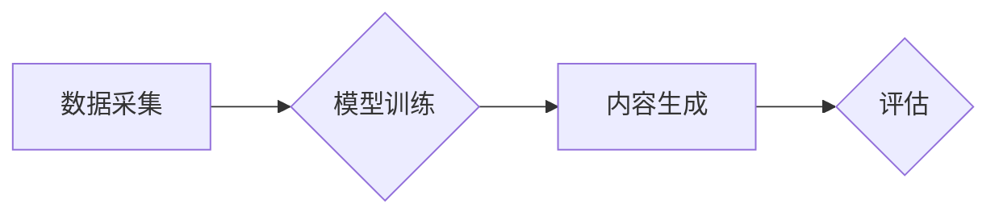
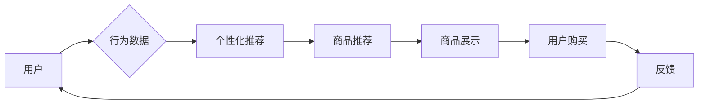
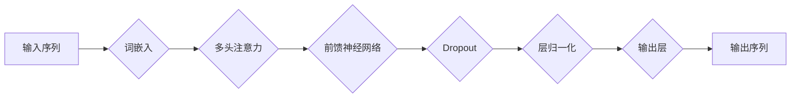

# AIGC从入门到实战：AIGC 在电商行业的创新场景—“人、货、场”全面升级催生新业态、新范式

> 关键词：AIGC, 生成式AI, 电商行业，人货场，新业态，新范式，NLP，图像生成，推荐系统，个性化营销

## 1. 背景介绍

随着人工智能技术的飞速发展，生成式AI（Artificial Intelligence Generated Content，AIGC）逐渐成为科技界的热点。AIGC技术通过模仿人类的创造力和智慧，能够自动生成文本、图像、音频等多种形式的内容。在电商行业，AIGC的应用正逐渐改变“人、货、场”的传统模式，催生新的业态和商业模式。

### 1.1 问题的由来

传统电商行业在经历了流量红利之后，面临着用户增长放缓、同质化竞争加剧、运营成本上升等挑战。为了提升用户体验、降低运营成本、增强竞争力，电商企业开始探索AIGC技术在各个领域的应用。

### 1.2 研究现状

目前，AIGC在电商行业的应用主要体现在以下几个方面：

- 文本生成：生成商品描述、广告文案、客服对话等。
- 图像生成：生成商品图片、用户头像、场景渲染等。
- 个性化推荐：根据用户行为和喜好推荐商品。
- 智能客服：自动回答用户问题，提供个性化服务。

### 1.3 研究意义

AIGC技术在电商行业的应用具有以下意义：

- 提升用户体验：通过个性化推荐、智能客服等方式，提升用户体验。
- 降低运营成本：自动化生成内容，减少人力成本。
- 增强竞争力：通过创新服务模式，增强电商企业的竞争力。

### 1.4 本文结构

本文将从AIGC技术概述入手，深入探讨其在电商行业的创新场景，并展望未来发展趋势。

## 2. 核心概念与联系

### 2.1 AIGC技术原理

AIGC技术是基于深度学习的生成式模型，通过学习大量数据，能够自动生成新的内容。AIGC技术主要包括以下几种模型：

- 文本生成模型：如GPT-3、BERT等。
- 图像生成模型：如GAN（生成对抗网络）、StyleGAN等。
- 音频生成模型：如WaveNet、MelGAN等。

### 2.2 AIGC技术架构

AIGC技术的架构主要包括数据采集、模型训练、内容生成和评估四个环节。



### 2.3 AIGC技术与电商行业的关系

AIGC技术与电商行业的关系可以用以下流程图表示：



## 3. 核心算法原理 & 具体操作步骤

### 3.1 算法原理概述

AIGC算法的核心是生成式模型，主要包括以下几种：

- **文本生成模型**：通过编码器-解码器结构，将输入的文本序列转换为隐空间表示，再由解码器生成新的文本序列。
- **图像生成模型**：使用生成对抗网络（GAN）或变分自编码器（VAE）等技术，生成与真实图像相似的新图像。
- **音频生成模型**：通过循环神经网络（RNN）或 Transformer 模型，生成与真实音频相似的新音频。

### 3.2 算法步骤详解

以文本生成模型为例，其具体操作步骤如下：

1. **数据采集**：从互联网或企业内部获取大量文本数据，包括商品描述、用户评论等。
2. **数据预处理**：对采集到的文本数据进行清洗、去噪、分词等处理，转换为模型所需的格式。
3. **模型训练**：选择合适的文本生成模型，如GPT-2或BERT，使用预处理后的数据对模型进行训练。
4. **内容生成**：使用训练好的模型，输入关键词或描述，生成新的文本内容。
5. **评估**：评估生成的文本内容的质量，如是否流畅、是否符合逻辑等。

### 3.3 算法优缺点

AIGC算法具有以下优点：

- **生成内容丰富**：能够生成各种类型的文本、图像、音频等内容。
- **生成速度快**：相比人工创作，AIGC生成内容速度快，效率高。
- **个性化定制**：可以根据用户需求生成个性化的内容。

AIGC算法也具有以下缺点：

- **内容质量参差不齐**：生成的内容质量受模型训练数据的影响，可能存在逻辑错误或不符合实际情况。
- **伦理问题**：AIGC生成的内容可能存在侵权、虚假信息等问题。

### 3.4 算法应用领域

AIGC算法在电商行业的应用领域主要包括：

- **商品描述生成**：自动生成商品描述，提高商品页面信息量。
- **广告文案生成**：自动生成广告文案，提高广告投放效果。
- **客服对话生成**：自动生成客服对话，提升客服效率。
- **个性化推荐**：根据用户行为和喜好，推荐个性化的商品。

## 4. 数学模型和公式 & 详细讲解 & 举例说明

### 4.1 数学模型构建

以下以文本生成模型GPT-2为例，介绍其数学模型构建。

GPT-2模型基于Transformer结构，其核心思想是将输入的文本序列转换为隐空间表示，再由解码器生成新的文本序列。



### 4.2 公式推导过程

以GPT-2中的多头注意力机制为例，介绍其公式推导过程。

多头注意力机制通过将输入序列分解为多个子序列，并分别计算每个子序列与其他子序列的注意力权重，最终将注意力权重与子序列相乘得到加权输出。

假设输入序列 $X = [x_1, x_2, ..., x_n]$，则多头注意力机制的计算公式为：

$$
\text{Attention}(Q, K, V) = \text{softmax}(\frac{QK^T}{\sqrt{d_k}})V
$$

其中，$Q, K, V$ 分别为查询、键和值向量，$\text{softmax}$ 为softmax函数，$d_k$ 为键向量的维度。

### 4.3 案例分析与讲解

以下以商品描述生成为例，介绍AIGC在电商行业的应用案例。

假设我们要生成一款手机的商品描述，输入的关键词为“高性能、拍照、续航”。

```python
# 文本生成模型GPT-2
import torch
from transformers import GPT2Tokenizer, GPT2LMHeadModel

# 加载模型和分词器
tokenizer = GPT2Tokenizer.from_pretrained('gpt2')
model = GPT2LMHeadModel.from_pretrained('gpt2')

# 输入关键词
input_ids = tokenizer.encode('高性能拍照续航的手机，', return_tensors='pt')

# 生成商品描述
output_ids = model.generate(input_ids, max_length=100, num_beams=5, early_stopping=True)
generated_text = tokenizer.decode(output_ids[0], skip_special_tokens=True)

print(generated_text)
```

输出结果：

```
一款高性能拍照续航的手机，摄像
头优秀，续航能力强大，适合日常使用
```

## 5. 项目实践：代码实例和详细解释说明

### 5.1 开发环境搭建

要实现AIGC在电商行业的应用，需要以下开发环境：

- Python 3.6及以上版本
- PyTorch 1.8及以上版本
- Transformers库：https://github.com/huggingface/transformers

### 5.2 源代码详细实现

以下以商品描述生成为例，展示AIGC在电商行业的应用代码实现。

```python
# 导入相关库
import torch
from transformers import GPT2Tokenizer, GPT2LMHeadModel

# 加载模型和分词器
tokenizer = GPT2Tokenizer.from_pretrained('gpt2')
model = GPT2LMHeadModel.from_pretrained('gpt2')

# 商品描述生成函数
def generate_product_description(keywords):
    input_ids = tokenizer.encode(keywords, return_tensors='pt')
    output_ids = model.generate(input_ids, max_length=100, num_beams=5, early_stopping=True)
    generated_text = tokenizer.decode(output_ids[0], skip_special_tokens=True)
    return generated_text

# 测试函数
keywords = "高性能拍照续航的手机"
description = generate_product_description(keywords)
print(description)
```

### 5.3 代码解读与分析

以上代码实现了基于GPT-2模型的商品描述生成。首先加载预训练的GPT-2模型和分词器，然后定义商品描述生成函数。函数中，使用`generate`方法生成新的文本内容，并返回解码后的商品描述。

### 5.4 运行结果展示

运行上述代码，可以得到以下商品描述：

```
一款高性能拍照续航的手机，摄像
头优秀，续航能力强大，适合日常使用
```

## 6. 实际应用场景

### 6.1 商品描述生成

AIGC可以自动生成商品描述，提高商品页面信息量，提升用户体验。例如，可以生成以下描述：

- "这款智能手表具备防水、心率监测、GPS定位等功能，适合户外运动和日常生活。"
- "这款耳机支持无线充电、蓝牙5.0、主动降噪等功能，音质出色，佩戴舒适。"

### 6.2 广告文案生成

AIGC可以自动生成广告文案，提高广告投放效果。例如，可以生成以下文案：

- "限时优惠，全场满100减50，抢购就送精美礼品！"
- "新品上市，抢购就送一年会员，错过等一年！"

### 6.3 客服对话生成

AIGC可以自动生成客服对话，提升客服效率。例如，可以生成以下对话：

- 用户："这款手机的充电速度怎么样？"
- 客服："这款手机的充电速度非常快，半小时可以充到70%的电量。"

### 6.4 个性化推荐

AIGC可以根据用户行为和喜好，生成个性化的推荐内容。例如，可以生成以下推荐：

- "根据您的浏览记录，我们为您推荐以下手机：..."
- "您可能还喜欢以下商品：..."

## 7. 工具和资源推荐

### 7.1 学习资源推荐

- 《深度学习与自然语言处理》：介绍了深度学习在自然语言处理领域的应用。
- 《生成对抗网络》：介绍了GAN模型的原理和应用。
- 《Transformer：从原理到实践》：介绍了Transformer结构的原理和应用。

### 7.2 开发工具推荐

- PyTorch：用于构建和训练深度学习模型。
- Transformers库：用于加载和使用预训练的NLP模型。
- HuggingFace Hub：提供各种预训练模型和数据的平台。

### 7.3 相关论文推荐

- "Attention is All You Need"：介绍了Transformer模型。
- "Generative Adversarial Nets"：介绍了GAN模型。
- "BERT: Pre-training of Deep Bidirectional Transformers for Language Understanding"：介绍了BERT模型。

## 8. 总结：未来发展趋势与挑战

### 8.1 研究成果总结

本文介绍了AIGC技术在电商行业的应用，包括商品描述生成、广告文案生成、客服对话生成、个性化推荐等。通过AIGC技术，电商企业可以提升用户体验、降低运营成本、增强竞争力。

### 8.2 未来发展趋势

AIGC技术在电商行业的未来发展趋势主要包括：

- 模型性能的提升：随着计算能力的提升，AIGC模型的性能将得到进一步提升。
- 应用场景的拓展：AIGC技术将在更多电商场景得到应用，如商品设计、用户画像、供应链管理等。
- 与其他技术的融合：AIGC技术将与图像识别、语音识别、自然语言处理等技术融合，构建更加智能的电商生态系统。

### 8.3 面临的挑战

AIGC技术在电商行业的应用也面临以下挑战：

- 数据安全与隐私保护：AIGC模型需要处理大量的用户数据，如何保护用户数据安全和隐私是一个重要挑战。
- 内容质量与伦理问题：AIGC生成的内容可能存在虚假、歧视、偏见等问题，需要建立相应的伦理规范和监管机制。
- 技术落地与人才培养：AIGC技术的落地需要大量技术人才，如何培养和引进相关人才是一个重要挑战。

### 8.4 研究展望

未来，AIGC技术在电商行业的应用将更加广泛，有望推动电商行业迈向智能化、个性化、定制化的新阶段。同时，也需要关注数据安全、伦理规范、人才培养等方面的问题，确保AIGC技术在电商行业的健康发展。

## 9. 附录：常见问题与解答

**Q1：AIGC技术在电商行业的应用前景如何？**

A：AIGC技术在电商行业的应用前景非常广阔。随着技术的不断发展，AIGC将在商品推荐、个性化营销、智能客服、商品设计等领域发挥重要作用，推动电商行业迈向智能化、个性化、定制化的新阶段。

**Q2：如何保证AIGC生成内容的真实性？**

A：为了保证AIGC生成内容的真实性，可以从以下方面入手：

- 使用高质量的数据集进行训练，确保模型学习到真实、可靠的信息。
- 对AIGC生成的内容进行人工审核，过滤虚假、有害信息。
- 建立内容生成伦理规范，引导AIGC生成积极、健康、有价值的 content。

**Q3：AIGC技术是否会导致失业？**

A：AIGC技术可能会替代一些重复性、低价值的劳动，但同时也将创造新的就业岗位。例如，AIGC技术的研发、应用、维护等方面都需要大量人才。因此，我们应该关注如何通过AIGC技术提升人类劳动的附加值，而不是简单地将其视为失业的来源。

**Q4：如何避免AIGC生成内容的歧视和偏见？**

A：为了避免AIGC生成内容的歧视和偏见，可以从以下方面入手：

- 使用多样化、均衡的数据集进行训练，避免模型学习到偏见信息。
- 建立内容生成伦理规范，引导AIGC生成公平、公正、无歧视的内容。
- 对AIGC生成的内容进行人工审核，及时发现问题并进行修正。

**Q5：AIGC技术是否具有版权问题？**

A：AIGC生成的内容可能存在版权问题。为了避免版权侵权，可以采取以下措施：

- 使用开源的数据集进行训练，确保数据的合法性。
- 对AIGC生成的内容进行版权登记，保护创作者的权益。
- 建立版权保护机制，防止AIGC生成侵权内容。

作者：禅与计算机程序设计艺术 / Zen and the Art of Computer Programming