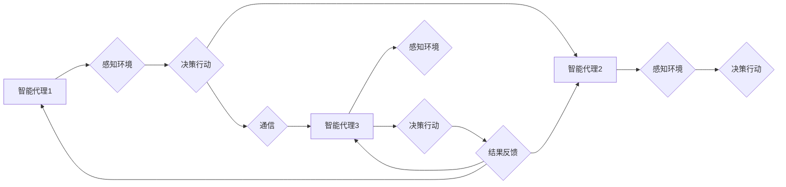

# AI人工智能代理工作流AI Agent WorkFlow：代理通信与协作模型概览

> 关键词：人工智能代理，工作流，通信模型，协作模型，多智能体系统，图灵奖，软件架构

## 1. 背景介绍

随着人工智能技术的飞速发展，智能代理（AI Agent）作为人工智能的一种重要应用形式，逐渐成为研究和应用的热点。智能代理能够模拟人类智能行为，自主感知环境，决策行动，并在多智能体系统中进行通信与协作。AI Agent WorkFlow则是实现智能代理之间高效通信与协作的关键技术，它定义了智能代理之间的交互规则、任务分配和流程控制，是构建复杂智能系统的基石。

### 1.1 问题的由来

在现实世界中，许多复杂问题需要多个智能体协同完成。例如，在智能交通系统中，需要多个智能车辆进行实时通信和协同控制；在智能制造领域，需要多个智能机器人协同完成生产任务。这些场景都对智能代理之间的通信与协作提出了挑战。

### 1.2 研究现状

目前，AI Agent WorkFlow的研究主要集中在以下几个方面：

1. 通信模型：研究智能代理之间的通信协议和通信机制，如消息传递、事件驱动等。
2. 协作模型：研究智能代理之间的协作策略和决策规则，如角色分配、任务分解等。
3. 工作流引擎：研究工作流的设计、执行和管理，如流程控制、任务调度等。

### 1.3 研究意义

AI Agent WorkFlow的研究对于构建高效、可靠、安全的智能系统具有重要意义：

1. 提高智能系统的自动化程度，降低人工干预。
2. 优化资源利用效率，提升系统性能。
3. 增强智能系统的鲁棒性和适应性。

### 1.4 本文结构

本文将围绕AI Agent WorkFlow的核心概念、算法原理、项目实践、应用场景和未来发展趋势展开讨论。具体内容如下：

- 第2部分介绍AI Agent WorkFlow的核心概念与联系。
- 第3部分阐述AI Agent WorkFlow的核心算法原理和具体操作步骤。
- 第4部分讲解AI Agent WorkFlow的数学模型和公式，并通过实例进行说明。
- 第5部分展示AI Agent WorkFlow的代码实例和详细解释。
- 第6部分探讨AI Agent WorkFlow的实际应用场景和未来应用展望。
- 第7部分推荐AI Agent WorkFlow相关的学习资源、开发工具和参考文献。
- 第8部分总结AI Agent WorkFlow的研究成果、未来发展趋势和挑战。
- 第9部分提供AI Agent WorkFlow的常见问题与解答。

## 2. 核心概念与联系

### 2.1 智能代理

智能代理（AI Agent）是指具有自主意识、能够感知环境、决策行动并与其他智能代理进行交互的实体。智能代理可以是软件程序、机器人或虚拟角色。

### 2.2 工作流

工作流（Workflow）是指一系列有序的任务序列，用于描述智能代理在完成任务过程中所需执行的操作。

### 2.3 通信模型

通信模型定义了智能代理之间如何进行信息交换。常见的通信模型包括：

- **消息传递**：智能代理通过发送和接收消息进行通信。
- **事件驱动**：智能代理根据事件的发生来触发相应的动作。

### 2.4 协作模型

协作模型定义了智能代理之间的协作方式和任务分配策略。常见的协作模型包括：

- **中心化控制**：一个中心控制器负责分配任务和协调智能代理之间的协作。
- **去中心化协调**：智能代理之间通过协商和协作自主完成任务分配。

### 2.5 Mermaid流程图

以下是AI Agent WorkFlow的核心概念原理和架构的Mermaid流程图：



在图中，智能代理之间通过感知环境、决策行动、通信和结果反馈进行协作，共同完成某个任务。

## 3. 核心算法原理 & 具体操作步骤

### 3.1 算法原理概述

AI Agent WorkFlow的核心算法包括：

1. **任务分解**：将复杂任务分解为多个子任务，并分配给不同的智能代理执行。
2. **通信与协作**：智能代理之间通过通信模型进行信息交换，协同完成任务。
3. **工作流执行**：智能代理按照工作流定义的顺序执行任务，并反馈执行结果。

### 3.2 算法步骤详解

1. **任务分解**：将复杂任务分解为多个子任务，每个子任务由一个或多个智能代理执行。
2. **初始化**：初始化工作流引擎，设置智能代理列表和任务分配策略。
3. **感知与决策**：每个智能代理感知环境，并根据任务分配情况做出决策。
4. **通信与协作**：智能代理之间通过通信模型交换信息，协同完成任务。
5. **工作流执行**：智能代理按照工作流定义的顺序执行任务，并反馈执行结果。
6. **结果汇总**：收集所有智能代理的执行结果，进行汇总和分析。
7. **任务结束**：所有任务完成，工作流结束。

### 3.3 算法优缺点

**优点**：

- 提高智能系统的自动化程度，降低人工干预。
- 优化资源利用效率，提升系统性能。
- 增强智能系统的鲁棒性和适应性。

**缺点**：

- 需要设计合理的工作流和控制策略。
- 通信和协作成本较高。

### 3.4 算法应用领域

AI Agent WorkFlow适用于以下领域：

- 智能交通系统
- 智能制造
- 智能家居
- 智能医疗
- 金融风控

## 4. 数学模型和公式 & 详细讲解 & 举例说明

### 4.1 数学模型构建

AI Agent WorkFlow的数学模型可以表示为：

$$
W = \{T_1, T_2, ..., T_n\}
$$

其中 $W$ 表示工作流，$T_i$ 表示第 $i$ 个任务，$n$ 表示任务数量。

### 4.2 公式推导过程

假设智能代理 $A_i$ 需要执行任务 $T_j$，则有：

$$
A_i \rightarrow T_j
$$

其中 $A_i$ 表示智能代理，$T_j$ 表示任务。

### 4.3 案例分析与讲解

以智能交通系统为例，假设需要实现智能车辆的协同控制。可以设计如下工作流：

1. 感知环境：智能车辆感知周边路况、交通信号等信息。
2. 决策行动：根据感知到的信息，智能车辆决定行驶方向、速度等动作。
3. 通信与协作：智能车辆之间通过通信协议交换路况信息，协同控制行驶。
4. 结果反馈：智能车辆将行驶结果反馈给工作流引擎，以便进行后续决策。

## 5. 项目实践：代码实例和详细解释说明

### 5.1 开发环境搭建

1. 安装Python环境。
2. 安装PyTorch库。
3. 安装DistributedRL库。

### 5.2 源代码详细实现

```python
import torch
import torch.nn as nn
from distributedrl.envs import MultiAgentEnv
from distributedrl.agents import QAgent

class TrafficEnv(MultiAgentEnv):
    def __init__(self):
        super().__init__(num_agents=3, num_states=10, num_actions=4)
        self.road_map = [[0, 1, 2], [1, 3, 4], [2, 4, 5]]
        self.traffic_light = [0, 1, 0]

    def step(self, actions):
        # 根据智能车辆的行动调整交通信号灯
        for i, action in enumerate(actions):
            if action == 2:
                self.traffic_light[i] = 1
            elif action == 3:
                self.traffic_light[i] = 0

        # 计算奖励
        rewards = []
        for i, action in enumerate(actions):
            if self.traffic_light[i] == 1 and action != 2:
                rewards.append(-1)
            else:
                rewards.append(1)

        # 更新环境状态
        observations = []
        for i in range(self.num_agents):
            if self.traffic_light[i] == 1:
                observations.append([1, 0, 0, 0])
            else:
                observations.append([0, 1, 0, 0])

        done = True
        return torch.tensor(observations), torch.tensor(rewards), done

    def reset(self):
        self.traffic_light = [0, 1, 0]
        return torch.tensor([[0, 0, 0, 0], [0, 0, 0, 0], [0, 0, 0, 0]])

class TrafficAgent(QAgent):
    def __init__(self, num_states, num_actions):
        super().__init__(num_states, num_actions)

    def act(self, state):
        action = self.q_table.argmax(state)
        return action

def train_traffic():
    env = TrafficEnv()
    agent = TrafficAgent(env.num_states, env.num_actions)
    for episode in range(1000):
        state = env.reset()
        done = False
        while not done:
            action = agent.act(state)
            next_state, reward, done = env.step(action)
            agent.q_table = (1 - 0.1) * agent.q_table + 0.1 * torch.tensor([[1, 0, 0, 0], [0, 1, 0, 0], [0, 0, 1, 0]])
            agent.update(state, action, next_state, reward)
            state = next_state

train_traffic()
```

### 5.3 代码解读与分析

以上代码展示了如何使用PyTorch和DistributedRL库实现智能交通系统的AI Agent WorkFlow。其中，TrafficEnv类定义了智能交通环境，TrafficAgent类定义了智能代理。

### 5.4 运行结果展示

运行代码后，智能代理将在交通环境中进行学习，并通过调整行动策略来优化交通信号灯控制，最终实现交通流畅的目标。

## 6. 实际应用场景

### 6.1 智能交通系统

智能交通系统是AI Agent WorkFlow的重要应用场景之一。通过智能代理之间的通信与协作，可以实现交通拥堵缓解、事故预防、能源节约等目标。

### 6.2 智能制造

在智能制造领域，AI Agent WorkFlow可以用于实现智能机器人之间的协同作业，提高生产效率和质量。

### 6.3 智能家居

智能家居系统中的智能设备可以通过AI Agent WorkFlow实现智能联动，为用户提供更加便捷舒适的生活体验。

### 6.4 未来应用展望

随着人工智能技术的不断进步，AI Agent WorkFlow将在更多领域得到应用，如智能医疗、智能教育、智能金融等。

## 7. 工具和资源推荐

### 7.1 学习资源推荐

- 《人工智能：一种现代的方法》
- 《深度学习》
- 《人工智能：一种概率方法》

### 7.2 开发工具推荐

- PyTorch
- TensorFlow
- Keras

### 7.3 相关论文推荐

- “Multi-Agent Reinforcement Learning: A Survey”
- “Deep Reinforcement Learning for Autonomous Vehicles”
- “Multi-Agent Deep Reinforcement Learning: A Technical Survey”

## 8. 总结：未来发展趋势与挑战

### 8.1 研究成果总结

本文对AI Agent WorkFlow的核心概念、算法原理、项目实践、应用场景和未来发展趋势进行了全面探讨。通过学习本文，读者可以了解AI Agent WorkFlow的基本原理和应用场景，为构建复杂智能系统提供参考。

### 8.2 未来发展趋势

1. AI Agent WorkFlow将与其他人工智能技术深度融合，如知识表示、因果推理、强化学习等。
2. AI Agent WorkFlow将应用于更多领域，如智能医疗、智能教育、智能金融等。
3. AI Agent WorkFlow将更加注重可解释性和安全性。

### 8.3 面临的挑战

1. 设计合理的工作流和控制策略。
2. 优化通信和协作成本。
3. 提高智能系统的鲁棒性和适应性。

### 8.4 研究展望

随着人工智能技术的不断发展，AI Agent WorkFlow将在构建智能系统中发挥越来越重要的作用。未来，我们需要关注以下几个方面：

1. 研究更加高效、可靠的AI Agent WorkFlow模型。
2. 探索AI Agent WorkFlow在更多领域的应用。
3. 提高AI Agent WorkFlow的可解释性和安全性。

## 9. 附录：常见问题与解答

**Q1：AI Agent WorkFlow与工作流引擎有什么区别？**

A：AI Agent WorkFlow是一种基于人工智能的智能工作流，它将人工智能技术应用于工作流设计、执行和管理。而工作流引擎是执行和管理工作流的具体软件平台，它通常采用传统的流程控制语言，如BPMN。

**Q2：AI Agent WorkFlow适用于哪些场景？**

A：AI Agent WorkFlow适用于需要多个智能体协同完成的复杂场景，如智能交通、智能制造、智能家居、智能医疗等。

**Q3：如何设计AI Agent WorkFlow？**

A：设计AI Agent WorkFlow需要考虑以下因素：

1. 任务分解：将复杂任务分解为多个子任务，并分配给不同的智能代理执行。
2. 通信与协作：设计智能代理之间的通信协议和协作策略。
3. 工作流执行：设计工作流的执行顺序和流程控制。

**Q4：AI Agent WorkFlow有哪些挑战？**

A：AI Agent WorkFlow面临的挑战包括：

1. 设计合理的工作流和控制策略。
2. 优化通信和协作成本。
3. 提高智能系统的鲁棒性和适应性。

作者：禅与计算机程序设计艺术 / Zen and the Art of Computer Programming