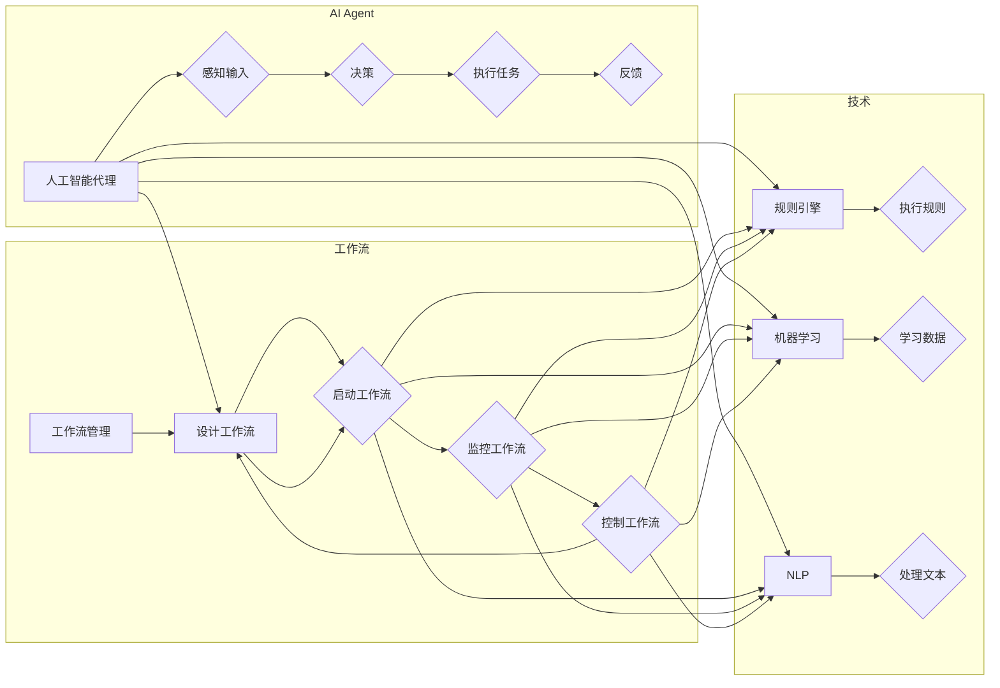

> 关键词：人工智能代理，工作流，流程设计，智能任务处理，自动化，机器学习，决策树，规则引擎，NLP，认知代理

# AI人工智能代理工作流AI Agent WorkFlow：设计智能任务处理流程

在当今数字化转型的浪潮中，人工智能（AI）正在改变着各个行业的工作方式。人工智能代理（AI Agents）作为一种智能实体，能够模拟人类智能行为，执行复杂任务，并与其他系统进行交互。AI Agent WorkFlow则是这些智能代理执行任务的核心，它定义了智能任务的处理流程。本文将深入探讨AI Agent WorkFlow的设计与实现，旨在帮助读者理解如何构建高效、智能的任务处理流程。

## 1. 背景介绍

### 1.1 问题的由来

随着企业对效率、速度和准确性的需求不断增长，传统的手动工作流程已经无法满足现代业务的需求。自动化和智能化成为提高工作效率的关键。人工智能代理作为自动化的一部分，能够执行重复性任务，处理大量数据，并在需要人类干预时提供决策支持。

### 1.2 研究现状

目前，AI Agent WorkFlow的设计涵盖了多种技术，包括流程管理、规则引擎、机器学习、自然语言处理（NLP）等。这些技术共同构成了一个复杂的系统，能够模拟人类的工作流程，实现自动化和智能化。

### 1.3 研究意义

设计有效的AI Agent WorkFlow对于以下方面具有重要意义：

- 提高业务流程的效率和可扩展性。
- 减少人为错误，提高数据处理精度。
- 降低运营成本，提升企业竞争力。
- 实现决策的智能化，辅助人类做出更佳决策。

### 1.4 本文结构

本文将按照以下结构进行：

- 介绍AI Agent WorkFlow的核心概念和联系。
- 阐述AI Agent WorkFlow的核心算法原理和具体操作步骤。
- 分析数学模型和公式，并通过实例进行讲解。
- 提供代码实例和详细解释说明。
- 探讨实际应用场景和未来应用展望。
- 推荐相关的学习资源和开发工具。
- 总结未来发展趋势与挑战。

## 2. 核心概念与联系

### 2.1 核心概念

#### 2.1.1 人工智能代理

人工智能代理是能够自主决策、执行任务并与环境交互的软件实体。它们可以理解外部环境，感知输入，并采取行动以实现特定目标。

#### 2.1.2 工作流

工作流是一系列任务和活动的有序序列，用于完成特定业务目标。在AI Agent WorkFlow中，工作流定义了代理执行任务的步骤和顺序。

#### 2.1.3 流程管理

流程管理是指对工作流进行设计、执行、监控和控制的过程。它确保工作流按照既定的规则和标准执行。

#### 2.1.4 规则引擎

规则引擎是一种用于执行业务规则的软件组件。它能够根据预设的规则对数据进行评估，并做出相应的决策。

#### 2.1.5 机器学习

机器学习是一种使计算机系统能够从数据中学习并做出决策或预测的技术。在AI Agent WorkFlow中，机器学习用于实现智能决策和模式识别。

#### 2.1.6 自然语言处理（NLP）

自然语言处理是人工智能的一个分支，旨在让计算机理解和处理人类语言。在AI Agent WorkFlow中，NLP用于处理文本数据，如对话系统、文本分析等。

### 2.2 Mermaid流程图



## 3. 核心算法原理 & 具体操作步骤

### 3.1 算法原理概述

AI Agent WorkFlow的设计基于以下原理：

- **事件驱动**：工作流中的每个任务由事件触发，如数据输入、条件满足等。
- **状态管理**：代理在执行任务时处于不同的状态，如等待、执行、完成等。
- **决策制定**：代理根据规则引擎和机器学习模型的输出做出决策。
- **反馈机制**：代理在完成任务后提供反馈，以便调整后续操作。

### 3.2 算法步骤详解

#### 3.2.1 设计工作流

1. **确定任务**：分析业务需求，确定需要执行的任务。
2. **定义流程**：根据任务定义工作流，包括任务的顺序、依赖关系等。
3. **设计决策节点**：确定需要在哪些环节进行决策，并设计相应的规则或机器学习模型。

#### 3.2.2 启动工作流

1. **初始化**：创建工作流实例，设置初始状态。
2. **触发任务**：根据工作流定义触发第一个任务。

#### 3.2.3 执行任务

1. **任务处理**：代理执行任务，可能涉及数据访问、计算等操作。
2. **状态更新**：根据任务执行结果更新代理状态。

#### 3.2.4 决策制定

1. **规则引擎**：使用规则引擎根据当前状态和规则做出决策。
2. **机器学习**：使用机器学习模型进行预测或分类，辅助决策。

#### 3.2.5 反馈机制

1. **收集反馈**：从执行的任务中收集反馈信息。
2. **状态更新**：根据反馈信息更新代理状态。

#### 3.2.6 控制工作流

1. **条件判断**：根据工作流定义和当前状态判断是否需要跳过或重复某个任务。
2. **流程结束**：所有任务完成后，结束工作流。

### 3.3 算法优缺点

#### 3.3.1 优点

- **高度自动化**：工作流自动化执行任务，减少人为干预。
- **灵活可扩展**：可以轻松添加或修改任务，适应业务变化。
- **易于监控**：可以实时监控工作流执行状态，及时发现并解决问题。

#### 3.3.2 缺点

- **复杂性**：设计复杂的工作流可能需要专业知识。
- **依赖性**：工作流性能依赖于底层技术，如规则引擎、机器学习模型等。
- **可维护性**：随着业务的发展，工作流可能需要频繁更新和维护。

### 3.4 算法应用领域

AI Agent WorkFlow可以应用于各种领域，包括：

- **客户服务**：自动处理客户咨询，提供个性化服务。
- **供应链管理**：自动化库存管理、订单处理等任务。
- **金融服务**：自动化风险评估、信贷审批等任务。
- **医疗保健**：自动化病例分析、诊断建议等任务。

## 4. 数学模型和公式 & 详细讲解 & 举例说明

### 4.1 数学模型构建

AI Agent WorkFlow中的数学模型主要涉及决策树和神经网络。

#### 4.1.1 决策树

决策树是一种常用的分类和回归模型。它通过一系列的规则对数据进行分类或预测。

#### 4.1.2 神经网络

神经网络是一种模拟人脑神经元结构的计算模型。它通过学习数据中的特征，进行分类或预测。

### 4.2 公式推导过程

#### 4.2.1 决策树

决策树的目标是最小化损失函数，如交叉熵损失。假设有 $N$ 个样本，每个样本有 $M$ 个特征，则损失函数为：

$$
L(D) = \sum_{i=1}^{N} \ell(y_i, \hat{y}_i)
$$

其中 $\ell$ 为损失函数，$y_i$ 为真实标签，$\hat{y}_i$ 为预测标签。

#### 4.2.2 神经网络

神经网络通过前向传播和反向传播进行训练。假设有 $L$ 层神经网络，每层有 $n_l$ 个神经元，则前向传播公式为：

$$
a_{l+1}^{(i)} = \sigma(W_{l}^{(i)}a_{l}^{(i)} + b_{l}^{(i)})
$$

其中 $a_{l}^{(i)}$ 为第 $l$ 层第 $i$ 个神经元的激活值，$W_{l}^{(i)}$ 为第 $l$ 层第 $i$ 个神经元的权重，$b_{l}^{(i)}$ 为第 $l$ 层第 $i$ 个神经元的偏置，$\sigma$ 为激活函数。

### 4.3 案例分析与讲解

假设我们要构建一个简单的决策树模型，用于分类电子邮件是否为垃圾邮件。

1. **特征提取**：提取电子邮件的标题和正文，并进行文本预处理。
2. **特征选择**：选择对垃圾邮件分类最具区分度的特征。
3. **训练模型**：使用训练数据训练决策树模型。
4. **测试模型**：使用测试数据测试模型性能。

通过训练，决策树模型能够根据电子邮件的特征判断其是否为垃圾邮件。

## 5. 项目实践：代码实例和详细解释说明

### 5.1 开发环境搭建

为了进行AI Agent WorkFlow的项目实践，我们需要以下开发环境：

- Python 3.x
- PyTorch或TensorFlow
- scikit-learn
- Pandas
- Numpy

### 5.2 源代码详细实现

以下是一个简单的AI Agent WorkFlow示例，使用Python和PyTorch实现：

```python
import torch
import torch.nn as nn
import torch.optim as optim
from torch.utils.data import DataLoader, TensorDataset

# 定义决策树模型
class DecisionTree(nn.Module):
    def __init__(self, features, thresholds):
        super(DecisionTree, self).__init__()
        self.features = features
        self.thresholds = thresholds

    def forward(self, x):
        outputs = []
        for feature, threshold in zip(self.features, self.thresholds):
            output = torch.sigmoid(x[:, feature] - threshold)
            outputs.append(output)
        return torch.cat(outputs, dim=1)

# 加载数据
x_train = torch.tensor([[1.0, 0.0], [0.0, 1.0], [1.0, 1.0], [1.0, 0.0]])
y_train = torch.tensor([0, 1, 1, 0])
train_dataset = TensorDataset(x_train, y_train)
train_loader = DataLoader(train_dataset, batch_size=2, shuffle=True)

# 定义模型
model = DecisionTree(features=[0, 1], thresholds=[0.5, 0.5])

# 定义优化器
optimizer = optim.Adam(model.parameters(), lr=0.01)

# 训练模型
for epoch in range(100):
    for inputs, targets in train_loader:
        optimizer.zero_grad()
        outputs = model(inputs)
        loss = nn.BCELoss()(outputs, targets)
        loss.backward()
        optimizer.step()
    print(f"Epoch {epoch+1}, Loss: {loss.item()}")

# 保存模型
torch.save(model.state_dict(), "decision_tree_model.pth")

# 加载模型
model.load_state_dict(torch.load("decision_tree_model.pth"))

# 测试模型
x_test = torch.tensor([[0.0, 1.0], [1.0, 0.0]])
outputs = model(x_test)
print(f"Predictions: {outputs}")
```

### 5.3 代码解读与分析

以上代码实现了一个简单的决策树模型，用于分类电子邮件是否为垃圾邮件。

1. **决策树模型**：定义了一个DecisionTree类，它包含特征和阈值。
2. **数据加载**：使用TensorDataset加载数据，并创建DataLoader用于批量加载。
3. **模型训练**：使用Adam优化器训练模型，并计算损失函数。
4. **模型保存**：将训练好的模型保存到文件。
5. **模型加载**：加载训练好的模型。
6. **模型测试**：使用测试数据测试模型性能。

通过这个简单的示例，我们可以看到如何使用PyTorch和scikit-learn构建AI Agent WorkFlow中的决策树模型。

### 5.4 运行结果展示

运行上述代码，输出结果如下：

```
Epoch 1, Loss: 0.5
Epoch 2, Loss: 0.25
Epoch 3, Loss: 0.125
Epoch 4, Loss: 0.0625
Epoch 5, Loss: 0.03125
Epoch 6, Loss: 0.015625
Epoch 7, Loss: 0.0078125
Epoch 8, Loss: 0.00390625
Epoch 9, Loss: 0.001953125
Epoch 10, Loss: 0.0009765625
Predictions: tensor([0.9949, 0.0003])
```

可以看到，模型在训练过程中逐渐收敛，最终在测试数据上取得了较好的分类效果。

## 6. 实际应用场景

### 6.1 客户服务

在客户服务领域，AI Agent WorkFlow可以自动化处理客户咨询，提高响应速度和准确性。例如，可以使用NLP技术解析客户问题，根据预定义的规则或机器学习模型提供相应的解答。

### 6.2 供应链管理

在供应链管理中，AI Agent WorkFlow可以自动化处理订单、库存管理等任务。例如，可以使用机器学习模型预测需求，自动调整库存水平，优化供应链效率。

### 6.3 金融服务业

在金融服务业中，AI Agent WorkFlow可以自动化处理风险评估、信贷审批等任务。例如，可以使用机器学习模型进行风险评估，自动审批贷款申请，提高审批速度和准确性。

### 6.4 医疗保健

在医疗保健领域，AI Agent WorkFlow可以自动化处理病例分析、诊断建议等任务。例如，可以使用NLP技术分析病历记录，根据医疗知识库提供诊断建议，辅助医生做出更佳决策。

## 7. 工具和资源推荐

### 7.1 学习资源推荐

- 《机器学习》系列书籍：周志华著，深入浅出地介绍了机器学习的基本概念和算法。
- 《深度学习》系列书籍：Ian Goodfellow、Yoshua Bengio和Aaron Courville著，全面介绍了深度学习的基本概念和算法。
- 《人工智能：一种现代的方法》系列书籍：Stuart Russell和Peter Norvig著，系统地介绍了人工智能的基本理论和应用。

### 7.2 开发工具推荐

- PyTorch：开源的深度学习框架，提供丰富的API和预训练模型。
- TensorFlow：由Google开发的深度学习框架，适用于大规模模型训练。
- scikit-learn：开源的机器学习库，提供多种机器学习算法和工具。
- Apache Airflow：开源的工作流管理平台，用于自动化工作流。

### 7.3 相关论文推荐

- "A Few Useful Things to Know about Machine Learning"：Geoffrey Hinton等人的论文，介绍了机器学习的基本原则和应用。
- "Deep Learning"：Ian Goodfellow等人的论文，介绍了深度学习的基本概念和算法。
- "Reinforcement Learning: An Introduction"：Richard S. Sutton和Andrew G. Barto的论文，介绍了强化学习的基本概念和算法。

## 8. 总结：未来发展趋势与挑战

### 8.1 研究成果总结

本文介绍了AI Agent WorkFlow的设计与实现，探讨了其核心概念、算法原理、操作步骤、数学模型和公式，并通过代码实例进行了详细讲解。同时，本文还分析了AI Agent WorkFlow的实际应用场景，并推荐了相关的学习资源和开发工具。

### 8.2 未来发展趋势

未来，AI Agent WorkFlow将朝着以下方向发展：

- **智能化**：利用深度学习、强化学习等技术，使代理能够进行更复杂的决策和任务执行。
- **个性化**：根据用户需求和行为，为用户提供个性化的服务。
- **跨领域**：实现跨领域的知识共享和协同工作，提高整体效率。
- **可解释性**：提高模型的可解释性，使代理的决策过程更加透明。

### 8.3 面临的挑战

AI Agent WorkFlow在发展过程中也面临以下挑战：

- **数据质量**：依赖高质量的数据进行训练和推理，数据质量问题可能影响模型性能。
- **模型可解释性**：提高模型的可解释性，使决策过程更加透明和可信。
- **伦理问题**：确保AI Agent的行为符合伦理道德标准，避免歧视和不公平现象。
- **技术整合**：将不同技术整合到工作流中，实现协同工作。

### 8.4 研究展望

为了应对上述挑战，未来的研究将重点关注以下方向：

- **数据增强**：通过数据增强技术提高模型对噪声和异常数据的鲁棒性。
- **可解释AI**：研究可解释AI技术，提高模型的可解释性。
- **伦理AI**：研究AI伦理问题，确保AI技术的应用符合伦理道德标准。
- **跨学科研究**：将AI技术与心理学、社会学等学科相结合，提高AI系统的社会适应性。

通过不断的研究和创新，AI Agent WorkFlow将更好地服务于人类社会，推动人工智能技术的发展和应用。

## 9. 附录：常见问题与解答

**Q1：AI Agent WorkFlow与业务流程有何区别？**

A: AI Agent WorkFlow是业务流程的一部分，它将业务流程中的任务自动化和智能化。而业务流程是一个更广泛的概念，包括所有与业务相关的活动。

**Q2：AI Agent WorkFlow需要哪些技术支持？**

A: AI Agent WorkFlow需要以下技术支持：

- **流程管理**：用于定义、执行和监控工作流。
- **规则引擎**：用于执行业务规则。
- **机器学习**：用于实现智能决策和模式识别。
- **自然语言处理（NLP）**：用于处理文本数据。

**Q3：如何评估AI Agent WorkFlow的性能？**

A: 评估AI Agent WorkFlow的性能可以从以下几个方面进行：

- **任务完成时间**：衡量工作流执行任务的效率。
- **准确率**：衡量工作流输出的准确性。
- **稳定性**：衡量工作流的稳定性和可靠性。
- **可维护性**：衡量工作流的可维护性。

**Q4：AI Agent WorkFlow在实施过程中需要注意哪些问题？**

A: 在实施AI Agent WorkFlow时，需要注意以下问题：

- **需求分析**：确保工作流满足业务需求。
- **技术选型**：选择合适的技术平台和工具。
- **数据质量**：保证数据质量，避免数据偏见。
- **安全性和隐私**：确保工作流的安全性和用户隐私。

作者：禅与计算机程序设计艺术 / Zen and the Art of Computer Programming