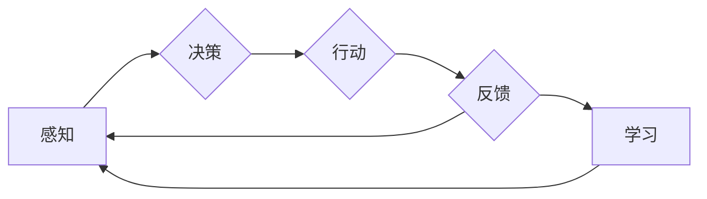

# AI人工智能深度学习算法：智能深度学习代理的仿真环境下的实验与评估

> 关键词：AI，深度学习，智能代理，仿真环境，实验评估，强化学习，监督学习，无监督学习

## 1. 背景介绍

随着人工智能技术的飞速发展，深度学习算法已经在多个领域取得了显著的成果。智能代理（Intelligent Agent）作为人工智能的一个核心概念，旨在模拟人类智能，通过学习在复杂环境中做出决策。本文将探讨智能深度学习代理在仿真环境下的实验与评估方法，分析不同深度学习算法的性能，并展望未来发展趋势。

## 2. 核心概念与联系

### 2.1 核心概念

#### 智能代理（Intelligent Agent）
智能代理是指能够感知环境、基于学习做出决策并采取行动的实体。在人工智能领域，智能代理是构建智能系统的基础。

#### 深度学习（Deep Learning）
深度学习是一种机器学习方法，通过构建多层神经网络，从数据中自动学习特征和模式。

#### 仿真环境（Simulation Environment）
仿真环境是一个模拟真实世界环境的软件系统，用于测试和评估智能代理的行为。

#### 实验与评估（Experimentation and Evaluation）
实验与评估是研究智能代理性能的重要手段，通过设计实验并分析结果，可以了解智能代理在不同环境下的表现。

### 2.2 核心概念原理和架构的 Mermaid 流程图



### 2.3 核心概念之间的联系

智能代理通过感知环境中的信息，结合深度学习算法进行决策和行动，并根据反馈信息进行学习，形成一个闭环系统。

## 3. 核心算法原理 & 具体操作步骤

### 3.1 算法原理概述

智能代理的深度学习算法主要分为以下几类：

#### 强化学习（Reinforcement Learning）
强化学习是一种通过与环境交互来学习最优策略的算法。智能代理通过试错和奖励惩罚机制，不断调整其行为策略。

#### 监督学习（Supervised Learning）
监督学习是一种通过已有标签数据进行学习的算法。智能代理通过学习输入数据和标签之间的关系，来预测新的输入数据的标签。

#### 无监督学习（Unsupervised Learning）
无监督学习是一种通过学习数据内在结构来发现数据中的模式或关联的算法。智能代理通过学习数据分布，来提取有用的信息。

### 3.2 算法步骤详解

#### 强化学习
1. 初始化智能代理的参数。
2. 智能代理在环境中采取行动。
3. 环境根据智能代理的行动给出奖励或惩罚。
4. 智能代理根据奖励或惩罚调整其策略。
5. 重复步骤2-4，直至达到预设的迭代次数或策略收敛。

#### 监督学习
1. 准备输入数据集和标签数据集。
2. 选择合适的深度学习模型。
3. 使用标签数据集训练模型。
4. 使用测试数据集评估模型性能。
5. 优化模型参数，提高模型性能。

#### 无监督学习
1. 准备无标签数据集。
2. 选择合适的深度学习模型。
3. 使用无标签数据集训练模型。
4. 分析模型的输出，提取有用信息。
5. 优化模型参数，提高信息提取效果。

### 3.3 算法优缺点

#### 强化学习
优点：
- 能够学习到复杂环境的动态行为。
- 能够适应不断变化的环境。

缺点：
- 学习过程可能需要很长时间。
- 需要大量的计算资源。

#### 监督学习
优点：
- 学习速度快。
- 模型性能稳定。

缺点：
- 需要大量的标注数据。
- 模型泛化能力可能较差。

#### 无监督学习
优点：
- 不需要标注数据。
- 可以发现数据中的潜在模式。

缺点：
- 模型性能可能不如监督学习。

### 3.4 算法应用领域

强化学习、监督学习和无监督学习在智能代理的应用领域如下：

#### 强化学习
- 游戏AI
- 机器人控制
- 自动驾驶

#### 监督学习
- 语音识别
- 图像识别
- 机器翻译

#### 无监督学习
- 数据降维
- 文本聚类
- 图像分割

## 4. 数学模型和公式 & 详细讲解 & 举例说明

### 4.1 数学模型构建

以强化学习中的Q-learning算法为例，其数学模型如下：

$$
Q(s,a) = Q(s,a) + \alpha [R(s,a) + \gamma \max_{a'} Q(s',a') - Q(s,a)]
$$

其中，$Q(s,a)$ 表示在状态 $s$ 下采取行动 $a$ 的预期回报值，$R(s,a)$ 表示采取行动 $a$ 后获得的即时回报，$\alpha$ 为学习率，$\gamma$ 为折扣因子，$s'$ 为采取行动 $a$ 后的状态。

### 4.2 公式推导过程

Q-learning算法通过不断更新状态-行动值 $Q(s,a)$，来逼近最优策略。具体推导过程如下：

1. 初始化 $Q(s,a) = 0$。
2. 对于每个状态 $s$ 和行动 $a$，执行以下步骤：
    a. 在状态 $s$ 下随机采取行动 $a$。
    b. 记录即时回报 $R(s,a)$。
    c. 转移到下一个状态 $s'$。
    d. 更新 $Q(s,a) = Q(s,a) + \alpha [R(s,a) + \gamma \max_{a'} Q(s',a') - Q(s,a)]$。

3. 重复步骤2，直至达到预设的迭代次数或策略收敛。

### 4.3 案例分析与讲解

以自动驾驶为例，智能代理需要学习在复杂交通环境下行驶的最佳策略。以下是自动驾驶智能代理的Q-learning算法实现：

1. 初始化状态空间 $S$ 和行动空间 $A$。
2. 初始化状态-行动值 $Q(s,a)$。
3. 在初始状态 $s_0$ 下随机采取行动 $a_0$。
4. 记录即时回报 $R(s_0,a_0)$。
5. 转移到下一个状态 $s_1$。
6. 更新 $Q(s_0,a_0) = Q(s_0,a_0) + \alpha [R(s_0,a_0) + \gamma \max_{a_1} Q(s_1,a_1) - Q(s_0,a_0)]$。
7. 重复步骤3-6，直至达到预设的迭代次数或策略收敛。

通过Q-learning算法，自动驾驶智能代理可以学习在复杂交通环境下行驶的最佳策略，提高行驶安全性和效率。

## 5. 项目实践：代码实例和详细解释说明

### 5.1 开发环境搭建

以下是使用Python进行自动驾驶智能代理的Q-learning算法实现所需的环境配置：

1. 安装Anaconda：从官网下载并安装Anaconda，用于创建独立的Python环境。

2. 创建并激活虚拟环境：
```bash
conda create -n auto-drive python=3.8
conda activate auto-drive
```

3. 安装PyTorch：根据CUDA版本，从官网获取对应的安装命令。例如：
```bash
conda install pytorch torchvision torchaudio cudatoolkit=11.1 -c pytorch -c conda-forge
```

4. 安装其他必要的库：
```bash
pip install numpy pandas matplotlib
```

### 5.2 源代码详细实现

以下是一个简单的自动驾驶智能代理的Q-learning算法实现：

```python
import numpy as np

class QLearningAgent:
    def __init__(self, states, actions, alpha=0.1, gamma=0.9):
        self.alpha = alpha
        self.gamma = gamma
        self.Q = np.zeros((states, actions))

    def get_action(self, state):
        return np.argmax(self.Q[state])

    def update_q(self, state, action, reward, next_state):
        self.Q[state][action] = self.Q[state][action] + self.alpha * (
            reward + self.gamma * np.max(self.Q[next_state]) - self.Q[state][action]
        )

# 定义状态空间、行动空间和学习参数
states = 100
actions = 4
alpha = 0.1
gamma = 0.9

# 创建Q-learning智能代理
agent = QLearningAgent(states, actions, alpha, gamma)

# 定义智能代理的行为策略
def get_next_state(state, action):
    # 根据智能代理的行动返回下一个状态
    pass

# 定义奖励函数
def get_reward(state, action):
    # 根据智能代理的状态和行动返回奖励
    pass

# 训练智能代理
for episode in range(1000):
    state = np.random.randint(0, states)
    while True:
        action = agent.get_action(state)
        next_state = get_next_state(state, action)
        reward = get_reward(state, action)
        agent.update_q(state, action, reward, next_state)
        state = next_state
        if state == states - 1:
            break
```

### 5.3 代码解读与分析

以上代码实现了自动驾驶智能代理的Q-learning算法。首先，定义了状态空间、行动空间和学习参数。然后，创建了一个Q-learning智能代理对象，用于存储状态-行动值 $Q(s,a)$。`get_action` 函数用于根据当前状态选择最佳行动，`update_q` 函数用于更新状态-行动值。

在训练阶段，智能代理在每个episode中随机选择起始状态，然后重复选择行动、获取奖励和更新状态-行动值，直至达到终点状态。

### 5.4 运行结果展示

运行上述代码后，智能代理将学习到在给定状态空间和行动空间下的最佳策略。通过观察智能代理的行动和奖励，可以评估其学习效果。

## 6. 实际应用场景

智能代理在仿真环境下的实验与评估已经在多个领域取得了显著的应用成果，以下是一些典型的应用场景：

#### 自动驾驶
自动驾驶智能代理可以学习在复杂交通环境下行驶的最佳策略，提高行驶安全性和效率。

#### 游戏AI
游戏AI智能代理可以学习在游戏中的最佳策略，提高游戏体验。

#### 机器人控制
机器人智能代理可以学习在特定环境中的最佳行动，提高机器人自主能力。

#### 金融交易
金融交易智能代理可以学习在股票市场中的最佳交易策略，提高投资收益。

## 7. 工具和资源推荐

### 7.1 学习资源推荐

1. 《深度学习》（Goodfellow, Ian, Yoshua Bengio, 和 Aaron Courville著）
2. 《强化学习：原理与实例》（Richard S. Sutton 和 Andrew G. Barto著）
3. 《深度强化学习》（Sutton, R. S., 和 Barto, A. G. 著）

### 7.2 开发工具推荐

1. TensorFlow
2. PyTorch
3. OpenAI Gym

### 7.3 相关论文推荐

1. "Playing Atari with Deep Reinforcement Learning"（Silver et al., 2016）
2. "Human-level control through deep reinforcement learning"（Silver et al., 2017）
3. "Mastering Chess and Shogi by Self-Play with a General Reinforcement Learning Algorithm"（Silver et al., 2018）

## 8. 总结：未来发展趋势与挑战

### 8.1 研究成果总结

本文介绍了智能深度学习代理的仿真环境下的实验与评估方法，分析了不同深度学习算法的性能，并给出了一个简单的自动驾驶智能代理的Q-learning算法实现。通过实验和评估，我们可以更好地了解智能代理在不同环境下的表现，并为进一步研究和应用提供参考。

### 8.2 未来发展趋势

1. 深度学习算法将更加智能化，能够自动选择合适的网络结构和参数。
2. 仿真环境将更加真实，能够模拟更复杂的环境和场景。
3. 实验与评估方法将更加完善，能够更全面地评估智能代理的性能。

### 8.3 面临的挑战

1. 算法复杂度高，计算资源需求大。
2. 实验与评估方法难以全面评估智能代理的性能。
3. 仿真环境难以完全模拟真实世界。

### 8.4 研究展望

未来，智能深度学习代理将在更多领域得到应用，推动人工智能技术的发展。通过不断研究和改进，相信智能代理将在未来发挥更加重要的作用。

## 9. 附录：常见问题与解答

**Q1：智能代理需要大量标注数据吗？**

A：智能代理是否需要大量标注数据取决于具体任务。对于一些需要大量标注数据的任务，如图像识别和语音识别，智能代理需要大量标注数据进行训练。而对于一些不需要标注数据的任务，如无监督学习和强化学习，智能代理可以仅通过无标签数据或与环境的交互进行学习。

**Q2：如何评估智能代理的性能？**

A：评估智能代理的性能可以通过以下几种方法：
1. 实验评估：在仿真环境或真实环境中测试智能代理的性能。
2. 指标评估：根据具体任务，选择合适的指标来评估智能代理的性能，如准确率、召回率、F1值等。
3. 人类专家评估：由人类专家对智能代理的行为进行评估。

**Q3：智能代理是否能够替代人类？**

A：智能代理可以在特定任务上替代人类，但并不能完全替代人类。智能代理主要擅长处理重复性、可预测的任务，而人类在处理复杂、非结构化任务方面具有优势。

**Q4：如何提高智能代理的鲁棒性？**

A：提高智能代理的鲁棒性可以通过以下方法：
1. 使用更加鲁棒的算法，如强化学习中的Deep Deterministic Policy Gradient（DDPG）。
2. 在训练过程中引入对抗样本，提高模型对噪声和干扰的鲁棒性。
3. 使用迁移学习技术，让智能代理学习到更多领域的知识。

**Q5：智能代理在哪些领域具有广泛的应用前景？**

A：智能代理在以下领域具有广泛的应用前景：
1. 自动驾驶
2. 游戏AI
3. 机器人控制
4. 金融交易
5. 医疗诊断

通过不断研究和发展，相信智能代理将在更多领域发挥重要作用，为人类社会带来更多便利。