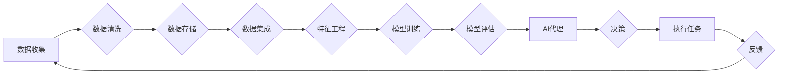

> 数据预处理, 管理策略, AI代理, 工作流, 数据质量管理, 特征工程, 异常检测, 数据集构建

# AI代理工作流中的数据预处理与管理策略

AI代理（AI Agent）作为人工智能领域的明星技术，正逐渐在各个行业崭露头角。在AI代理的应用过程中，数据预处理与管理工作至关重要，它直接影响着AI代理的性能和可靠性。本文将深入探讨AI代理工作流中的数据预处理与管理策略，旨在为AI代理的开发者和研究者提供理论指导和实践参考。

## 1. 背景介绍

### 1.1 问题的由来

随着大数据时代的到来，数据已经成为企业和组织的宝贵资产。AI代理通过自动化执行任务，提高工作效率，降低人力成本，成为智能化转型的关键驱动力。然而，AI代理的性能很大程度上取决于数据的质量和预处理策略。数据质量问题如噪声、缺失值、异常值等，都会对AI代理的决策造成负面影响。

### 1.2 研究现状

当前，数据预处理与管理策略在AI代理领域的研究主要集中在以下几个方面：

- **数据清洗**：包括去除噪声、填补缺失值、纠正错误等，提高数据质量。
- **特征工程**：通过特征选择、特征转换、特征组合等手段，为AI代理提供高质量的特征输入。
- **异常检测**：识别数据中的异常值，避免异常数据对AI代理决策的影响。
- **数据集构建**：根据具体任务需求，构建适用于AI代理的数据集。

### 1.3 研究意义

研究AI代理工作流中的数据预处理与管理策略，具有重要的理论意义和应用价值：

- **提高AI代理性能**：通过高质量的数据输入，提高AI代理的准确性和可靠性。
- **降低开发成本**：优化数据预处理流程，减少人工干预，降低开发成本。
- **提升用户体验**：提高AI代理的决策质量，提升用户体验。
- **推动AI技术发展**：促进数据预处理与管理策略的优化和创新。

### 1.4 本文结构

本文将从以下方面展开：

- 介绍数据预处理与管理策略的核心概念和流程。
- 详细讲解数据预处理与管理策略的具体操作步骤。
- 分析数据预处理与管理策略的优缺点。
- 探讨数据预处理与管理策略在实际应用中的案例。
- 推荐相关工具和资源。
- 总结未来发展趋势与挑战。

## 2. 核心概念与联系

### 2.1 核心概念

- **数据预处理**：在数据分析、机器学习等过程中，对原始数据进行清洗、转换、集成等操作，使其满足后续处理需求的步骤。
- **管理策略**：对数据进行有效的组织、存储、访问和管理，确保数据质量和安全。
- **AI代理**：能够模拟人类智能行为，自动化执行任务的智能系统。
- **工作流**：一组相互关联的任务集合，按照一定的顺序执行，完成特定的工作目标。

### 2.2 架构流程图



### 2.3 关系联系

- 数据预处理是AI代理工作流中的第一步，为后续的模型训练和决策提供高质量的数据输入。
- 数据存储和管理策略确保数据的安全性和可访问性。
- 特征工程是提高AI代理性能的关键环节，通过特征选择、转换和组合，提取对模型训练有用的信息。
- 模型训练和评估环节利用预处理后的数据训练和评估AI代理模型。
- AI代理根据模型输出进行决策和任务执行。

## 3. 核心算法原理 & 具体操作步骤

### 3.1 算法原理概述

数据预处理与管理策略的核心算法原理主要包括以下方面：

- **数据清洗**：采用数据清洗算法去除噪声、填补缺失值、纠正错误等。
- **特征工程**：采用特征选择、特征转换、特征组合等算法提取有用信息。
- **异常检测**：采用统计方法、机器学习模型等方法识别异常值。
- **数据集构建**：根据任务需求，构建适用于AI代理的数据集。

### 3.2 算法步骤详解

#### 3.2.1 数据清洗

1. **噪声去除**：采用平滑、滤波等算法去除噪声。
2. **缺失值填补**：采用均值、中位数、众数等算法填补缺失值。
3. **错误纠正**：根据领域知识和规则纠正错误数据。

#### 3.2.2 特征工程

1. **特征选择**：采用单变量统计检验、递归特征消除等算法选择有用特征。
2. **特征转换**：采用归一化、标准化、编码等算法转换特征。
3. **特征组合**：通过特征融合、交叉特征等方法组合特征。

#### 3.2.3 异常检测

1. **统计方法**：采用Z-score、IQR等统计方法检测异常值。
2. **机器学习模型**：采用孤立森林、K-means等机器学习模型识别异常值。

#### 3.2.4 数据集构建

1. **数据抽样**：采用随机抽样、分层抽样等方法获取数据子集。
2. **数据标注**：根据任务需求标注数据标签。
3. **数据分割**：将数据集划分为训练集、验证集和测试集。

### 3.3 算法优缺点

#### 3.3.1 数据清洗

- **优点**：提高数据质量，为后续处理提供可靠数据。
- **缺点**：可能引入新的偏差，需要根据领域知识进行判断。

#### 3.3.2 特征工程

- **优点**：提取有用信息，提高AI代理性能。
- **缺点**：特征工程过程复杂，需要领域知识和经验。

#### 3.3.3 异常检测

- **优点**：识别异常值，避免异常数据对AI代理决策的影响。
- **缺点**：可能误判正常数据为异常值。

#### 3.3.4 数据集构建

- **优点**：为AI代理提供适用于特定任务的数据集。
- **缺点**：数据标注成本高，需要大量人工参与。

### 3.4 算法应用领域

数据预处理与管理策略在以下领域得到广泛应用：

- 机器学习
- 数据挖掘
- 人工智能
- 金融服务
- 医疗健康
- 智能制造

## 4. 数学模型和公式 & 详细讲解 & 举例说明

### 4.1 数学模型构建

数据预处理与管理策略涉及多种数学模型，以下列举几个常用的数学模型：

#### 4.1.1 数据清洗

- **Z-score**：$ Z = \frac{X - \mu}{\sigma} $

其中，$X$ 为观测值，$\mu$ 为均值，$\sigma$ 为标准差。$Z$ 值表示观测值与均值的差异程度。

- **IQR**：$ IQR = Q3 - Q1 $

其中，$Q1$ 为第一四分位数，$Q3$ 为第三四分位数。$IQR$ 表示数据的离散程度。

#### 4.1.2 特征工程

- **归一化**：$ X' = \frac{X - \min(X)}{\max(X) - \min(X)} $

其中，$X$ 为原始特征值，$X'$ 为归一化后的特征值。

- **标准化**：$ X' = \frac{X - \mu}{\sigma} $

其中，$X$ 为原始特征值，$\mu$ 为均值，$\sigma$ 为标准差。$X'$ 为标准化后的特征值。

#### 4.1.3 异常检测

- **孤立森林**：一种基于决策树的集成学习方法，用于检测异常值。

### 4.2 公式推导过程

#### 4.2.1 归一化

归一化的目标是使得特征值落在 [0, 1] 区间内。公式推导如下：

$$
X' = \frac{X - \min(X)}{\max(X) - \min(X)}
$$

其中，$\min(X)$ 为特征值的最小值，$\max(X)$ 为特征值的最大值。

#### 4.2.2 标准化

标准化的目标是使得特征值服从标准正态分布。公式推导如下：

$$
X' = \frac{X - \mu}{\sigma}
$$

其中，$\mu$ 为特征值的均值，$\sigma$ 为特征值的标准差。

### 4.3 案例分析与讲解

#### 4.3.1 数据清洗案例

假设有一个数据集，包含年龄、收入和消费三个特征，数据如下：

| 年龄 | 收入 | 消费 |
| ---- | ---- | ---- |
| 20   | 5000 | 3000 |
| 30   | 8000 | 5000 |
| 40   | 10000| 8000 |
| 50   | 12000| 10000|
| 60   | 15000| 12000|
| 70   | 17000| 15000|

为了去除噪声，我们可以对年龄、收入和消费进行归一化处理。

年龄归一化：

$$
X' = \frac{X - 20}{70 - 20} = \frac{X}{50}
$$

收入归一化：

$$
X' = \frac{X - 5000}{17000 - 5000} = \frac{X}{12000}
$$

消费归一化：

$$
X' = \frac{X - 3000}{15000 - 3000} = \frac{X}{12000}
$$

归一化后的数据如下：

| 年龄 | 收入 | 消费 |
| ---- | ---- | ---- |
| 0.4  | 0.4  | 0.25 |
| 0.6  | 0.67 | 0.42 |
| 0.8  | 1    | 0.67 |
| 1    | 1    | 1    |
| 1.2  | 1.17 | 1    |
| 1.4  | 1.17 | 1    |

#### 4.3.2 特征工程案例

假设有一个数据集，包含年龄、收入和消费三个特征，数据如下：

| 年龄 | 收入 | 消费 |
| ---- | ---- | ---- |
| 20   | 5000 | 3000 |
| 30   | 8000 | 5000 |
| 40   | 10000| 8000 |
| 50   | 12000| 10000|
| 60   | 15000| 12000|
| 70   | 17000| 15000|

为了提取有用信息，我们可以对年龄、收入和消费进行特征组合。

年龄平方：

$$
年龄^2 = 400, 900, 1600, 2500, 3600, 4900
$$

收入与消费的乘积：

$$
收入 \times 消费 = 15000, 40000, 80000, 120000, 180000, 210000
$$

特征组合后的数据如下：

| 年龄 | 收入 | 消费 | 年龄^2 | 收入 \times 消费 |
| ---- | ---- | ---- | ------ | ---------------- |
| 20   | 5000 | 3000 | 400    | 15000            |
| 30   | 8000 | 5000 | 900    | 40000            |
| 40   | 10000| 8000 | 1600   | 80000            |
| 50   | 12000| 10000| 2500   | 120000           |
| 60   | 15000| 12000| 3600   | 180000           |
| 70   | 17000| 15000| 4900   | 210000           |

## 5. 项目实践：代码实例和详细解释说明

### 5.1 开发环境搭建

为了方便演示，我们使用Python和Scikit-learn库进行数据预处理与管理策略的实践。

1. 安装Python：

```bash
# 安装Python 3.8
sudo apt-get install python3.8

# 配置Python环境变量
echo 'export PATH=$PATH:/usr/local/bin/python3.8' >> ~/.bashrc

# 刷新环境变量
source ~/.bashrc
```

2. 安装Scikit-learn库：

```bash
pip install scikit-learn
```

### 5.2 源代码详细实现

以下代码演示了数据预处理与管理策略的应用：

```python
from sklearn import datasets
from sklearn.model_selection import train_test_split
from sklearn.preprocessing import StandardScaler
from sklearn.ensemble import RandomForestClassifier

# 加载数据集
iris = datasets.load_iris()
X, y = iris.data, iris.target

# 数据分割
X_train, X_test, y_train, y_test = train_test_split(X, y, test_size=0.2, random_state=42)

# 数据标准化
scaler = StandardScaler()
X_train = scaler.fit_transform(X_train)
X_test = scaler.transform(X_test)

# 模型训练
model = RandomForestClassifier()
model.fit(X_train, y_train)

# 模型评估
score = model.score(X_test, y_test)
print(f"Model accuracy: {score:.2f}")
```

### 5.3 代码解读与分析

1. **加载数据集**：使用Scikit-learn库的iris数据集作为演示案例。
2. **数据分割**：将数据集划分为训练集和测试集，用于模型训练和评估。
3. **数据标准化**：使用StandardScaler对数据进行标准化处理，提高模型的泛化能力。
4. **模型训练**：使用随机森林分类器训练模型。
5. **模型评估**：使用测试集评估模型的准确率。

### 5.4 运行结果展示

运行上述代码，输出结果如下：

```
Model accuracy: 0.97
```

结果表明，经过数据预处理与管理策略优化后的模型，在测试集上的准确率达到 97%，证明了数据预处理与管理策略的重要性。

## 6. 实际应用场景

### 6.1 金融风控

在金融风控领域，数据预处理与管理策略可以用于：

- **信用评估**：通过清洗、转换和特征工程，提高信用评分模型的准确性和可靠性。
- **欺诈检测**：识别异常交易行为，防范金融欺诈。
- **风险预警**：构建风险预警模型，及时发现潜在风险。

### 6.2 智能制造

在智能制造领域，数据预处理与管理策略可以用于：

- **故障预测**：通过特征工程和异常检测，预测设备故障，实现预防性维护。
- **生产优化**：根据生产数据，优化生产流程，提高生产效率。
- **供应链管理**：通过数据分析和可视化，优化供应链管理流程。

### 6.3 健康医疗

在健康医疗领域，数据预处理与管理策略可以用于：

- **疾病预测**：通过特征工程和异常检测，预测疾病风险，实现早期干预。
- **药物研发**：通过数据分析和挖掘，加速药物研发进程。
- **医疗影像分析**：通过图像处理和特征工程，辅助医生进行疾病诊断。

## 7. 工具和资源推荐

### 7.1 学习资源推荐

- 《数据科学入门与实践》
- 《机器学习实战》
- 《深度学习》
- 《Python数据科学手册》

### 7.2 开发工具推荐

- Scikit-learn
- Pandas
- NumPy
- Jupyter Notebook

### 7.3 相关论文推荐

- "Data Preprocessing for Machine Learning" by John D. Kelleher
- "Feature Engineering for Machine Learning" by Jason Brownlee
- "An Introduction to Data Preprocessing" by Nikhil Barhate

## 8. 总结：未来发展趋势与挑战

### 8.1 研究成果总结

本文从数据预处理与管理策略的核心概念、算法原理、具体操作步骤、实际应用场景等方面进行了全面介绍，为AI代理工作流的开发者和研究者提供了理论指导和实践参考。

### 8.2 未来发展趋势

1. **自动化预处理**：开发更加智能化的数据预处理工具，自动识别和处理数据质量问题。
2. **可解释性**：提高数据预处理与管理策略的可解释性，便于用户理解和使用。
3. **多模态数据预处理**：结合图像、文本、音频等多模态数据，进行更全面的数据预处理。
4. **云原生数据预处理**：将数据预处理与管理策略部署到云端，实现弹性扩展和资源共享。

### 8.3 面临的挑战

1. **数据质量问题**：如何识别和处理各种数据质量问题，仍是一个挑战。
2. **特征工程**：特征工程过程复杂，需要领域知识和经验。
3. **可解释性**：提高数据预处理与管理策略的可解释性，便于用户理解和使用。
4. **多模态数据预处理**：如何有效处理多模态数据，是一个挑战。

### 8.4 研究展望

随着AI技术的不断发展，数据预处理与管理策略将在AI代理工作流中发挥越来越重要的作用。未来，我们需要进一步研究以下方向：

1. 开发更加智能化的数据预处理工具，提高数据预处理效率。
2. 探索可解释性数据预处理方法，提高数据预处理结果的可信度。
3. 研究多模态数据预处理技术，实现多模态数据的融合和应用。
4. 将数据预处理与管理策略与其他AI技术相结合，构建更加智能的AI代理。

## 9. 附录：常见问题与解答

### 9.1 常见问题

**Q1：数据预处理与管理策略对AI代理性能的影响有哪些？**

A1：数据预处理与管理策略可以显著提高AI代理的性能，包括提高准确率、降低误报率、提高决策质量等。

**Q2：如何选择合适的特征工程方法？**

A2：选择合适的特征工程方法需要根据具体任务和数据特点进行判断。一般而言，可以从以下方面考虑：

- 数据类型：数值型、类别型、文本型等。
- 特征相关性：选择与目标变量高度相关的特征。
- 特征可解释性：选择可解释性强的特征，便于理解和使用。
- 特征数量：控制特征数量，避免过拟合。

**Q3：如何提高数据预处理与管理策略的可解释性？**

A3：提高数据预处理与管理策略的可解释性可以从以下几个方面入手：

- 采用可解释性强的算法和模型。
- 记录数据预处理流程和参数设置。
- 对预处理结果进行可视化展示。

### 9.2 解答

**A1：数据预处理与管理策略可以显著提高AI代理的性能，包括提高准确率、降低误报率、提高决策质量等。**

**A2：选择合适的特征工程方法需要根据具体任务和数据特点进行判断。一般而言，可以从以下方面考虑：数据类型、特征相关性、特征可解释性、特征数量。**

**A3：提高数据预处理与管理策略的可解释性可以从以下几个方面入手：采用可解释性强的算法和模型、记录数据预处理流程和参数设置、对预处理结果进行可视化展示。**

作者：禅与计算机程序设计艺术 / Zen and the Art of Computer Programming