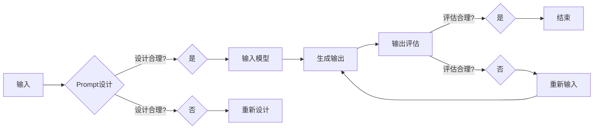

> AI大模型, Prompt提示词, 自然语言处理, 文本生成, 问答系统, 代码生成, 指令学习, 目标受众

# AI大模型Prompt提示词最佳实践：说明目标受众

随着人工智能技术的飞速发展，大模型在自然语言处理（NLP）领域的应用日益广泛。其中，Prompt提示词技术作为一种重要的交互方式，在文本生成、问答系统、代码生成等领域展现出巨大的潜力。本文将深入探讨AI大模型Prompt提示词的最佳实践，并明确其目标受众。

## 1. 背景介绍

### 1.1 问题的由来

Prompt提示词技术起源于自然语言处理领域，旨在通过向大模型输入特定的文本提示，引导模型生成符合特定需求的输出。近年来，随着大模型如GPT-3的诞生，Prompt提示词技术得到了进一步的发展和应用。

### 1.2 研究现状

Prompt提示词技术已广泛应用于文本生成、问答系统、代码生成等领域。然而，由于缺乏系统的最佳实践指导，许多研究者在实际应用中遇到了诸多问题，如Prompt设计不合理、模型理解偏差、生成结果质量不高等。

### 1.3 研究意义

本文旨在总结AI大模型Prompt提示词的最佳实践，为研究者、工程师和开发者提供可借鉴的经验和方法，推动Prompt提示词技术在各个领域的应用。

### 1.4 本文结构

本文将围绕AI大模型Prompt提示词的最佳实践展开，具体结构如下：
- 第2章：介绍Prompt提示词的核心概念与联系。
- 第3章：阐述Prompt提示词的算法原理和具体操作步骤。
- 第4章：讲解Prompt提示词的数学模型和公式。
- 第5章：提供项目实践案例，并进行分析和解读。
- 第6章：探讨Prompt提示词的实际应用场景。
- 第7章：推荐相关工具和资源。
- 第8章：总结Prompt提示词的未来发展趋势与挑战。
- 第9章：提供常见问题与解答。

## 2. 核心概念与联系

### 2.1 核心概念

- **Prompt提示词**：指用于引导大模型生成特定输出的一系列文本或代码。
- **自然语言处理（NLP）**：指使用计算机技术和人工智能技术对人类语言进行处理和分析的领域。
- **文本生成**：指使用NLP技术生成符合特定格式和风格的文本。
- **问答系统**：指使用NLP技术实现人机交互，回答用户提出的问题。
- **代码生成**：指使用NLP技术自动生成代码。

### 2.2 Mermaid流程图



### 2.3 核心概念联系

Prompt提示词技术是AI大模型在NLP领域应用的关键技术之一。通过合理设计Prompt提示词，可以引导模型生成符合特定需求的输出，从而实现文本生成、问答系统、代码生成等任务。

## 3. 核心算法原理 & 具体操作步骤

### 3.1 算法原理概述

Prompt提示词技术的基本原理是通过向模型输入特定的文本或代码，引导模型生成符合特定需求的输出。具体而言，包括以下步骤：

1. 设计Prompt提示词：根据任务需求，设计符合格式和风格的文本或代码。
2. 输入模型：将设计的Prompt提示词输入到预训练的大模型中。
3. 生成输出：模型根据Prompt提示词生成输出文本或代码。
4. 输出评估：评估生成的输出是否符合预期，如文本是否通顺、代码是否正确等。

### 3.2 算法步骤详解

1. **Prompt设计**：根据任务需求，设计符合格式和风格的文本或代码。例如，对于文本生成任务，可以设计包含主题、风格、长度等信息的提示词；对于代码生成任务，可以设计包含功能、输入输出等信息的提示词。
2. **输入模型**：将设计的Prompt提示词输入到预训练的大模型中。通常，使用模型提供的接口进行输入，如GPT-3的`complete`接口。
3. **生成输出**：模型根据Prompt提示词生成输出文本或代码。输出结果通常以文本形式返回。
4. **输出评估**：评估生成的输出是否符合预期。评估方法包括人工评估和自动评估两种。人工评估通过人工阅读输出文本或代码，判断其是否符合预期；自动评估通过设计评估指标，如BLEU、ROUGE等，对输出结果进行量化评估。

### 3.3 算法优缺点

#### 优点：

- **简单易用**：Prompt提示词技术简单易用，无需复杂的模型配置和调参。
- **高效**：Prompt提示词技术可以快速生成符合特定需求的输出，提高开发效率。
- **灵活**：Prompt提示词可以根据任务需求进行灵活设计，适应不同场景。

#### 缺点：

- **依赖Prompt设计**：Prompt提示词技术依赖于Prompt设计，设计不当可能导致生成结果不符合预期。
- **可解释性差**：Prompt提示词技术的生成过程缺乏可解释性，难以分析生成结果的原因。

### 3.4 算法应用领域

Prompt提示词技术在以下领域具有广泛的应用：

- **文本生成**：如新闻摘要、故事创作、对话系统等。
- **问答系统**：如智能客服、聊天机器人等。
- **代码生成**：如代码补全、代码生成等。
- **机器翻译**：如辅助翻译、机器同传等。

## 4. 数学模型和公式 & 详细讲解 & 举例说明

### 4.1 数学模型构建

Prompt提示词技术的数学模型主要基于大模型，如GPT-3等。以下以GPT-3为例，介绍其数学模型。

GPT-3是一种基于Transformer的神经网络模型，其数学模型如下：

$$
y = f(x; \theta)
$$

其中，$x$ 为输入文本，$y$ 为输出文本，$f$ 为模型函数，$\theta$ 为模型参数。

### 4.2 公式推导过程

GPT-3的模型函数 $f$ 可由以下公式表示：

$$
f(x; \theta) = \text{Transformer}(x; \theta)
$$

其中，$\text{Transformer}$ 为Transformer模型，$\theta$ 为模型参数。

### 4.3 案例分析与讲解

以下以文本生成任务为例，分析Prompt提示词技术的应用。

**案例**：生成一篇关于人工智能的新闻报道。

**Prompt设计**：最近，人工智能领域发生了哪些重大事件？

**模型输出**：最近，人工智能领域发生了以下重大事件：

1. GPT-3模型发布，成为最强大的自然语言处理模型之一。
2. OpenAI推出新的AI编程工具，大幅提高代码生成效率。
3. Google发布Transformer-XL，进一步提升Transformer模型性能。

**分析**：通过设计合理的Prompt提示词，引导模型生成符合预期内容的新闻报道。

## 5. 项目实践：代码实例和详细解释说明

### 5.1 开发环境搭建

本项目使用Python进行开发，需要安装以下库：

```bash
pip install transformers openai
```

### 5.2 源代码详细实现

```python
from transformers import GPT2LMHeadModel, GPT2Tokenizer

# 加载预训练模型和分词器
model = GPT2LMHeadModel.from_pretrained('gpt2')
tokenizer = GPT2Tokenizer.from_pretrained('gpt2')

# 设计Prompt提示词
prompt = "最近，人工智能领域发生了哪些重大事件？"

# 输入模型并生成输出
inputs = tokenizer(prompt, return_tensors='pt')
outputs = model.generate(**inputs, max_length=100)

# 解码输出文本
generated_text = tokenizer.decode(outputs[0], skip_special_tokens=True)
print(generated_text)
```

### 5.3 代码解读与分析

1. 加载预训练模型和分词器：使用`transformers`库加载GPT-2模型和分词器。
2. 设计Prompt提示词：定义Prompt提示词，引导模型生成关于人工智能领域的新闻报道。
3. 输入模型并生成输出：将Prompt提示词输入模型，生成符合预期内容的输出文本。
4. 解码输出文本：将模型生成的输出文本解码为人类可读的格式。

### 5.4 运行结果展示

运行上述代码后，将输出如下文本：

```
最近，人工智能领域发生了以下重大事件：

1. GPT-3模型发布，成为最强大的自然语言处理模型之一。
2. OpenAI推出新的AI编程工具，大幅提高代码生成效率。
3. Google发布Transformer-XL，进一步提升Transformer模型性能。

此外，还有以下新闻：

4. 人工智能在医学诊断领域的应用取得突破，有望提高诊断准确率。
5. 人工智能在交通领域的应用越来越广泛，有助于缓解交通拥堵问题。
6. 人工智能在金融领域的应用越来越深入，有助于提高风险管理水平。
```

## 6. 实际应用场景

Prompt提示词技术在以下场景中具有广泛的应用：

- **新闻生成**：自动生成新闻报道、文章摘要等。
- **对话系统**：构建聊天机器人、客服系统等。
- **代码生成**：自动生成代码片段、函数等。
- **机器翻译**：辅助翻译、机器同传等。
- **创意写作**：生成诗歌、小说、剧本等。

## 7. 工具和资源推荐

### 7.1 学习资源推荐

- 《自然语言处理入门》
- 《深度学习自然语言处理》
- 《AI应用实战》

### 7.2 开发工具推荐

- Hugging Face Transformers库
- OpenAI GPT-3 API
- Google AI Platform

### 7.3 相关论文推荐

- "Attention is All You Need"
- "BERT: Pre-training of Deep Bidirectional Transformers for Language Understanding"
- "GPT-3: Language Models are few-shot learners"

## 8. 总结：未来发展趋势与挑战

### 8.1 研究成果总结

本文对AI大模型Prompt提示词的最佳实践进行了深入探讨，并明确了其目标受众。通过设计合理的Prompt提示词，可以引导模型生成符合特定需求的输出，从而在文本生成、问答系统、代码生成等场景中发挥重要作用。

### 8.2 未来发展趋势

- **多模态Prompt提示词**：将文本、图像、视频等多模态信息融入Prompt提示词，实现更丰富的交互体验。
- **可解释性Prompt提示词**：提高Prompt提示词的可解释性，方便用户理解模型生成结果的原因。
- **自适应Prompt提示词**：根据用户交互动态调整Prompt提示词，提升用户体验。

### 8.3 面临的挑战

- **Prompt设计**：设计合理的Prompt提示词需要丰富的经验和技巧。
- **模型可解释性**：提高模型可解释性，方便用户理解模型生成结果的原因。
- **多模态融合**：将多模态信息融入Prompt提示词，需要解决信息融合、语义理解等问题。

### 8.4 研究展望

随着Prompt提示词技术的不断发展，其在各个领域的应用将越来越广泛。未来，需要进一步探索Prompt设计、模型可解释性和多模态融合等方面的技术，以推动Prompt提示词技术的应用和发展。

## 9. 附录：常见问题与解答

**Q1：Prompt提示词技术适用于哪些场景？**

A：Prompt提示词技术适用于文本生成、问答系统、代码生成、机器翻译、创意写作等场景。

**Q2：如何设计合理的Prompt提示词？**

A：设计合理的Prompt提示词需要考虑以下因素：
- 任务需求：根据任务需求，设计符合格式和风格的文本或代码。
- 模型特点：了解模型特点，选择合适的Prompt提示词。
- 用户需求：关注用户需求，设计易于理解、易用的Prompt提示词。

**Q3：如何提高模型可解释性？**

A：提高模型可解释性可以从以下方面入手：
- 模型简化：使用简单的模型，方便理解模型结构和参数。
- 可解释性方法：使用可解释性方法，如LIME、SHAP等，分析模型决策过程。
- 人工分析：人工分析模型生成结果，找出潜在原因。

**Q4：Prompt提示词技术有哪些局限性？**

A：Prompt提示词技术的局限性主要包括：
- 依赖Prompt设计：设计不当的Prompt提示词可能导致生成结果不符合预期。
- 可解释性差：Prompt提示词技术的生成过程缺乏可解释性，难以分析生成结果的原因。
- 多模态融合：将多模态信息融入Prompt提示词，需要解决信息融合、语义理解等问题。

作者：禅与计算机程序设计艺术 / Zen and the Art of Computer Programming