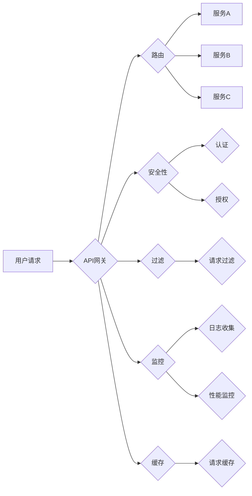

# API 网关的功能和优势

> 关键词：API网关，服务治理，微服务，API管理，安全性，性能优化，分布式系统

## 1. 背景介绍

随着云计算和微服务架构的兴起，企业应用程序的架构变得越来越复杂。为了管理这些分散的、分布式的服务，需要一个中心化的协调点来处理服务之间的通信、路由、安全性、监控和策略控制。API网关应运而生，成为了现代分布式系统架构中的关键组件。本文将深入探讨API网关的功能和优势，并分析其在复杂系统中的应用。

### 1.1 问题的由来

在传统的单体架构中，所有的功能都集成在一个应用程序中，服务之间的通信简单直接。然而，随着业务需求的不断增长，单体架构的扩展性变得有限，难以应对日益复杂的业务逻辑。微服务架构通过将应用程序分解为独立的、可扩展的服务，提高了系统的灵活性和可维护性。

微服务架构虽然带来了诸多好处，但也引入了一系列挑战：

- **服务间通信复杂**：服务之间需要进行大量的通信，这可能导致系统的复杂性增加。
- **安全性管理困难**：每个服务都需要独立的安全策略，管理起来非常繁琐。
- **监控和日志收集困难**：由于服务分散，监控和日志收集变得复杂，难以进行整体分析。
- **跨域问题**：不同服务可能运行在不同的域或地区，需要解决跨域通信问题。

### 1.2 研究现状

为了解决上述问题，API网关作为服务治理的中心节点，提供了统一的入口点，对进入系统的所有请求进行处理。通过API网关，可以实现服务的路由、安全性控制、协议转换、负载均衡等功能，从而简化服务间的通信，提高系统的安全性、可靠性和可维护性。

### 1.3 研究意义

研究API网关的功能和优势，对于构建稳定、高效、可扩展的分布式系统具有重要意义：

- **简化服务间通信**：API网关作为统一的服务入口，简化了服务间的通信复杂度。
- **提高安全性**：API网关可以实现统一的身份验证、授权和安全性策略。
- **增强可维护性**：集中式管理策略和配置，简化了系统的维护工作。
- **提升性能**：通过负载均衡和缓存机制，提高系统性能。

## 2. 核心概念与联系

### 2.1 核心概念

- **API网关**：一个服务，作为所有API请求的统一入口，负责处理请求的路由、过滤、安全性、监控等功能。
- **服务治理**：管理、监控、维护分布式系统中的服务。
- **微服务**：将大型应用程序分解为独立的、可扩展的服务，以提高系统的灵活性和可维护性。
- **分布式系统**：由多个独立节点组成的系统，这些节点可能分布在不同的地理位置。

### 2.2 核心概念原理和架构的 Mermaid 流程图



### 2.3 核心概念联系

API网关是服务治理的关键组件，它通过路由、安全性、过滤、监控和缓存等功能，实现了对微服务架构中服务的统一管理和控制。API网关与服务、分布式系统紧密相连，共同构成了现代分布式架构的核心。

## 3. 核心算法原理 & 具体操作步骤

### 3.1 算法原理概述

API网关的核心算法原理主要包括：

- **路由算法**：根据请求的路径、方法、参数等信息，将请求路由到相应的服务。
- **安全性算法**：进行用户认证、授权，确保只有授权用户才能访问受保护的服务。
- **过滤算法**：对请求进行过滤，移除或添加请求头、参数等。
- **监控算法**：收集和监控服务的性能指标，如响应时间、错误率等。
- **缓存算法**：缓存常用请求的结果，减少对后端服务的调用。

### 3.2 算法步骤详解

1. **请求接收**：API网关接收用户请求。
2. **请求解析**：解析请求的路径、方法、参数等信息。
3. **路由决策**：根据路由算法，确定请求的目标服务。
4. **安全性检查**：进行用户认证、授权，确保请求的安全性。
5. **请求过滤**：对请求进行过滤，移除或添加请求头、参数等。
6. **请求转发**：将请求转发到目标服务。
7. **响应处理**：处理服务的响应，如转换格式、添加头信息等。
8. **响应返回**：将响应返回给用户。

### 3.3 算法优缺点

#### 优点

- **简化服务间通信**：统一的服务入口，简化了服务间的通信复杂度。
- **提高安全性**：集中式安全策略，提高系统的安全性。
- **增强可维护性**：集中式管理，简化了系统的维护工作。
- **提升性能**：通过缓存和负载均衡，提高系统性能。

#### 缺点

- **单点故障**：API网关成为系统的单点故障点。
- **性能瓶颈**：在高并发情况下，API网关可能成为性能瓶颈。
- **复杂性**：需要复杂的配置和管理。

### 3.4 算法应用领域

API网关在以下领域得到广泛应用：

- **电子商务**：处理订单、支付等业务。
- **金融系统**：处理交易、风控等业务。
- **移动应用**：处理用户请求，访问后端服务。
- **物联网**：处理设备请求，访问云服务。

## 4. 数学模型和公式 & 详细讲解 & 举例说明

### 4.1 数学模型构建

API网关的数学模型主要涉及概率论和统计学。以下是一个简单的数学模型：

$$
P(S) = \sum_{i=1}^n P(S_i)
$$

其中，$P(S)$ 是请求被成功处理的概率，$P(S_i)$ 是请求被第 $i$ 个服务成功处理的概率。

### 4.2 公式推导过程

该公式的推导过程如下：

1. 请求首先被发送到API网关。
2. API网关根据路由算法，将请求路由到第 $i$ 个服务。
3. 第 $i$ 个服务处理请求，并返回响应。
4. 如果所有服务都成功处理请求，则请求被成功处理。

### 4.3 案例分析与讲解

假设有一个由三个服务组成的系统，每个服务的成功处理概率分别为 $P(S_1) = 0.95$、$P(S_2) = 0.90$ 和 $P(S_3) = 0.85$。根据上述公式，请求被成功处理的概率为：

$$
P(S) = P(S_1) + P(S_2) + P(S_3) = 0.95 + 0.90 + 0.85 = 2.7
$$

然而，概率值不可能超过 1，因此我们需要对公式进行修正。修正后的公式如下：

$$
P(S) = 1 - (1 - P(S_1))(1 - P(S_2))(1 - P(S_3))
$$

根据该公式，请求被成功处理的概率为：

$$
P(S) = 1 - (1 - 0.95)(1 - 0.90)(1 - 0.85) = 0.9975
$$

这表明，在所有服务都成功处理请求的情况下，请求被成功处理的概率非常高。

## 5. 项目实践：代码实例和详细解释说明

### 5.1 开发环境搭建

为了演示API网关的实现，我们将使用Python编写一个简单的API网关示例。

1. 安装Flask框架：
```bash
pip install Flask
```

2. 创建一个名为 `api_gateway` 的Python文件。

### 5.2 源代码详细实现

以下是一个简单的API网关示例：

```python
from flask import Flask, request, jsonify

app = Flask(__name__)

# 定义路由
@app.route('/service1', methods=['GET', 'POST'])
def service1():
    # 处理请求并返回响应
    # ...
    return jsonify({'message': 'Service 1 response'})

@app.route('/service2', methods=['GET', 'POST'])
def service2():
    # 处理请求并返回响应
    # ...
    return jsonify({'message': 'Service 2 response'})

@app.route('/service3', methods=['GET', 'POST'])
def service3():
    # 处理请求并返回响应
    # ...
    return jsonify({'message': 'Service 3 response'})

if __name__ == '__main__':
    app.run()
```

### 5.3 代码解读与分析

上述代码定义了一个简单的API网关，它包含三个路由：`/service1`、`/service2` 和 `/service3`。每个路由都对应一个服务，当请求到达对应的路由时，API网关会调用对应的服务并返回响应。

### 5.4 运行结果展示

运行上述代码后，可以使用curl命令测试API网关：

```bash
curl -X GET http://localhost:5000/service1
```

这将返回：

```json
{"message": "Service 1 response"}
```

## 6. 实际应用场景

### 6.1 电商系统

在电商系统中，API网关可以用于统一处理商品查询、订单处理、支付等服务的请求，确保请求的安全性、可靠性和一致性。

### 6.2 金融系统

在金融系统中，API网关可以用于处理交易请求、风险控制、账户管理等服务的请求，确保金融交易的安全性和合规性。

### 6.3 移动应用

在移动应用中，API网关可以用于处理用户请求，访问后端服务，并提供统一的接口，方便移动应用的开发和使用。

### 6.4 物联网

在物联网系统中，API网关可以用于处理设备请求，访问云服务，并提供统一的设备管理接口。

## 7. 工具和资源推荐

### 7.1 学习资源推荐

- 《RESTful API设计指南》
- 《微服务架构设计》
- 《API网关技术实战》

### 7.2 开发工具推荐

- Spring Cloud Gateway
- Kong
- AWS API Gateway

### 7.3 相关论文推荐

- 《RESTful API设计最佳实践》
- 《微服务架构：设计与实现》
- 《API网关：构建可扩展的微服务架构》

## 8. 总结：未来发展趋势与挑战

### 8.1 研究成果总结

本文介绍了API网关的功能和优势，分析了其在分布式系统中的应用。API网关作为服务治理的关键组件，能够简化服务间通信、提高安全性、增强可维护性、提升性能。

### 8.2 未来发展趋势

- **API网关的智能化**：利用人工智能技术，实现智能路由、智能监控、智能诊断等功能。
- **API网关的云原生**：与云原生技术（如Kubernetes）集成，实现自动化部署、扩展和管理。
- **API网关的微服务化**：将API网关本身也设计为微服务，提高其可扩展性和可维护性。

### 8.3 面临的挑战

- **性能瓶颈**：在高并发情况下，API网关可能成为性能瓶颈。
- **安全性问题**：API网关成为攻击者的目标，需要加强安全性设计。
- **可维护性**：随着服务数量的增加，API网关的配置和管理变得越来越复杂。

### 8.4 研究展望

未来，API网关将继续发展，以应对分布式系统中的新挑战。以下是一些研究方向：

- **性能优化**：通过优化算法、硬件升级等方式，提高API网关的性能。
- **安全性提升**：研究新的安全机制，提高API网关的安全性。
- **可维护性改进**：设计更加简洁、易用的API网关管理工具。

## 9. 附录：常见问题与解答

**Q1：API网关与负载均衡器有什么区别？**

A: 负载均衡器主要功能是分发请求到多个后端服务，以提高系统性能。API网关除了负载均衡功能外，还提供了路由、安全性、监控等更多功能。

**Q2：API网关如何处理跨域请求？**

A: API网关可以通过设置CORS（跨源资源共享）策略，允许跨域请求。

**Q3：如何保证API网关的安全性？**

A: 可以通过以下方式保证API网关的安全性：
- 使用HTTPS协议
- 实施严格的身份验证和授权机制
- 定期更新和修补安全漏洞

**Q4：API网关如何处理高并发请求？**

A: 可以通过以下方式处理高并发请求：
- 使用高性能服务器
- 实现异步处理
- 优化缓存策略

**Q5：API网关与API管理有什么区别？**

A: API网关主要负责处理API请求，而API管理主要负责API的生命周期管理，包括API设计、开发、发布、监控等。

---

作者：禅与计算机程序设计艺术 / Zen and the Art of Computer Programming