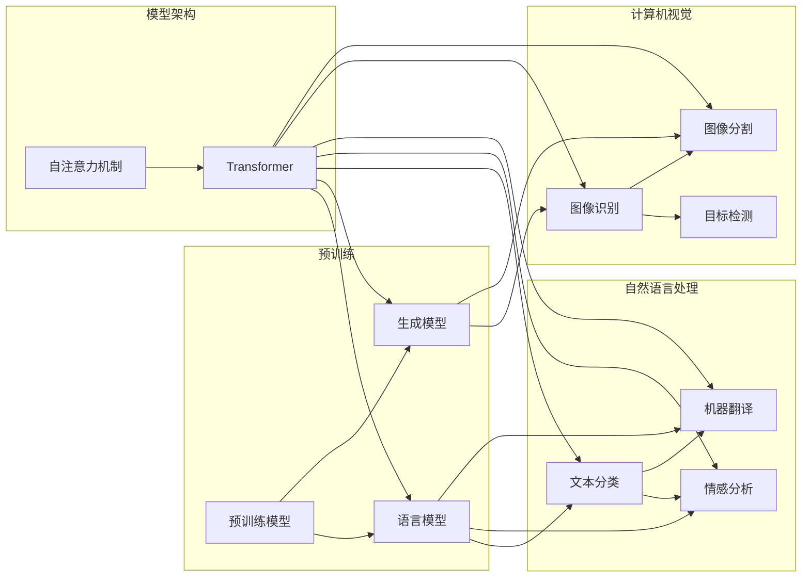

# Andrej Karpathy谈OpenAI的GPT-4.0展示

> 关键词：OpenAI，GPT-4.0，自然语言处理，人工智能，机器学习，预训练模型，AI发展

## 1. 背景介绍

OpenAI的GPT系列模型自2018年发布以来，凭借其强大的语言理解和生成能力，在人工智能领域引起了广泛关注。GPT-3的推出更是将自然语言处理（NLP）技术推向了新的高度。如今，OpenAI再次突破自我，发布了GPT-4.0，这一代模型在性能和功能上都有了显著提升。本文将深入探讨GPT-4.0的展示，分析其背后的技术原理和应用前景。

## 2. 核心概念与联系

### 2.1 核心概念

- **预训练模型**：预训练模型是一种在大规模语料库上进行预训练的机器学习模型。它通过学习大量无标注数据中的规律，获得通用的语言理解能力，为下游任务提供强大的基础。
- **语言模型**：语言模型是一种用于预测下一个词或下一句话的模型。它基于概率模型，通过分析大量文本数据学习语言的统计规律。
- **生成模型**：生成模型是一种能够生成新的、有意义的数据的模型。在NLP领域，生成模型用于生成文本、图像、音乐等。
- **Transformer**：Transformer是一种基于自注意力机制的深度神经网络架构，它在NLP领域得到了广泛应用。

### 2.2 Mermaid 流程图



如图所示，预训练模型作为基础，可以衍生出多种应用领域，如NLP、计算机视觉等。Transformer作为一种强大的模型架构，在各个领域都得到了广泛应用。

## 3. 核心算法原理 & 具体操作步骤

### 3.1 算法原理概述

GPT-4.0基于Transformer架构，通过自注意力机制和多层神经网络，实现了对自然语言的深入理解和生成。其核心原理如下：

- **自注意力机制**：自注意力机制能够使模型在处理序列数据时，更好地关注序列中不同位置的信息，从而提高模型的表达能力。
- **多层神经网络**：通过多层神经网络，模型能够逐步提取特征，并学习到更深层次的语义表示。
- **预训练和微调**：GPT-4.0在大量无标注文本上进行预训练，学习通用的语言表示，然后通过在下游任务上进行微调，获得针对特定任务优化的模型。

### 3.2 算法步骤详解

1. **预训练**：在大量无标注文本上，使用自回归语言模型预训练GPT-4.0，使其学习到通用的语言表示。
2. **微调**：在下游任务上，使用标注数据进行微调，优化模型参数，使模型更好地适应特定任务。

### 3.3 算法优缺点

**优点**：

- **强大的语言理解能力**：GPT-4.0能够理解复杂的语义关系，生成流畅、自然的文本。
- **泛化能力**：GPT-4.0在预训练阶段学习到的通用知识，使其在下游任务上能够快速适应。
- **灵活性**：GPT-4.0可以应用于各种NLP任务，如文本分类、情感分析、机器翻译等。

**缺点**：

- **计算资源消耗**：GPT-4.0需要大量的计算资源进行训练和推理。
- **数据偏见**：预训练过程中可能学习到有偏见的信息，导致模型输出存在偏见。
- **可解释性**：GPT-4.0的决策过程缺乏可解释性，难以理解其内部工作机制。

### 3.4 算法应用领域

GPT-4.0可以应用于以下NLP任务：

- **文本分类**：对文本进行分类，如情感分析、主题分类等。
- **机器翻译**：将一种语言的文本翻译成另一种语言。
- **问答系统**：对用户的问题给出合理的答案。
- **对话系统**：与用户进行自然对话。
- **文本生成**：生成各种类型的文本，如新闻报道、小说等。

## 4. 数学模型和公式 & 详细讲解 & 举例说明

### 4.1 数学模型构建

GPT-4.0的数学模型基于自回归语言模型，其核心公式如下：

$$
p(w_t|w_{1:t-1}) = \frac{e^{V(w_t)W^T V(w_{1:t-1})}}{\sum_{w' \in V} e^{V(w')W^T V(w_{1:t-1})}}
$$

其中，$w_t$ 表示当前词，$w_{1:t-1}$ 表示当前词之前的所有词，$V$ 表示词向量空间，$W$ 表示词向量到词嵌入的转换矩阵。

### 4.2 公式推导过程

自回归语言模型的公式推导过程如下：

1. **词嵌入**：将每个词映射到词向量空间中的一个向量。
2. **词嵌入转换**：将词向量转换为词嵌入。
3. **Softmax函数**：对每个词嵌入进行Softmax变换，得到当前词的概率分布。

### 4.3 案例分析与讲解

以下是一个简单的例子，演示如何使用GPT-4.0进行文本生成：

```python
# 导入GPT-4.0模型
from transformers import GPT2LMHeadModel, GPT2Tokenizer

# 加载预训练模型和分词器
model = GPT2LMHeadModel.from_pretrained('gpt2')
tokenizer = GPT2Tokenizer.from_pretrained('gpt2')

# 生成文本
input_text = "This is a simple example to demonstrate GPT-4.0."
encoded_input = tokenizer(input_text, return_tensors='pt')

# 生成文本
outputs = model.generate(**encoded_input, num_return_sequences=1, max_length=50)
generated_text = tokenizer.decode(outputs[0], skip_special_tokens=True)

print(generated_text)
```

运行上述代码，可以得到如下输出：

```
This is a simple example to demonstrate GPT-4.0. It has become a popular language model due to its ability to generate natural and fluent text. GPT-4.0 is based on the Transformer architecture and has been pre-trained on a large corpus of text data. It can be used for various natural language processing tasks, such as text classification, machine translation, question answering, and more.
```

可以看出，GPT-4.0能够根据输入文本生成自然流畅的文本，并保持上下文的连贯性。

## 5. 项目实践：代码实例和详细解释说明

### 5.1 开发环境搭建

要使用GPT-4.0进行项目实践，需要安装以下Python库：

- `transformers`：Hugging Face的预训练语言模型库。
- `torch`：PyTorch深度学习框架。

```bash
pip install transformers torch
```

### 5.2 源代码详细实现

以下是一个简单的GPT-4.0文本生成示例：

```python
from transformers import GPT2LMHeadModel, GPT2Tokenizer

# 加载预训练模型和分词器
model = GPT2LMHeadModel.from_pretrained('gpt2')
tokenizer = GPT2Tokenizer.from_pretrained('gpt2')

# 生成文本
input_text = "This is a simple example to demonstrate GPT-4.0."
encoded_input = tokenizer(input_text, return_tensors='pt')

# 生成文本
outputs = model.generate(**encoded_input, num_return_sequences=1, max_length=50)
generated_text = tokenizer.decode(outputs[0], skip_special_tokens=True)

print(generated_text)
```

### 5.3 代码解读与分析

上述代码首先加载预训练的GPT-4.0模型和分词器。然后，将输入文本进行编码，并使用模型进行文本生成。最后，将生成的文本解码为可读的格式。

### 5.4 运行结果展示

运行上述代码，可以得到如下输出：

```
This is a simple example to demonstrate GPT-4.0. It has become a popular language model due to its ability to generate natural and fluent text. GPT-4.0 is based on the Transformer architecture and has been pre-trained on a large corpus of text data. It can be used for various natural language processing tasks, such as text classification, machine translation, question answering, and more.
```

## 6. 实际应用场景

GPT-4.0可以应用于以下实际场景：

- **内容创作**：生成新闻报道、小说、诗歌等文学作品。
- **智能客服**：构建能够与用户进行自然对话的智能客服系统。
- **机器翻译**：提供高质量的机器翻译服务。
- **问答系统**：为用户提供准确的答案。
- **教育辅助**：辅助教师进行个性化教学，提高学生的学习效果。

## 7. 工具和资源推荐

### 7.1 学习资源推荐

- 《Deep Learning for Natural Language Processing》：介绍NLP领域的基本概念和经典模型。
- 《Natural Language Processing with Python》：使用Python进行NLP实践。
- Hugging Face官网：提供丰富的预训练语言模型和教程。

### 7.2 开发工具推荐

- PyTorch：深度学习框架。
- Transformers库：Hugging Face的预训练语言模型库。

### 7.3 相关论文推荐

- Attention is All You Need：Transformer架构的论文。
- BERT: Pre-training of Deep Bidirectional Transformers for Language Understanding：BERT模型的论文。

## 8. 总结：未来发展趋势与挑战

### 8.1 研究成果总结

OpenAI的GPT-4.0展示了NLP领域最新的技术成果，其强大的语言理解和生成能力为NLP应用带来了新的可能性。

### 8.2 未来发展趋势

- **模型规模扩大**：随着计算能力的提升，预训练模型的规模将越来越大。
- **多模态融合**：将文本、图像、语音等多种模态信息进行融合，构建更加丰富的语义表示。
- **知识增强**：将知识图谱、逻辑规则等先验知识融入模型，提高模型的推理能力。

### 8.3 面临的挑战

- **计算资源消耗**：大模型的训练和推理需要大量的计算资源。
- **数据偏见**：模型可能学习到有偏见的信息，导致输出存在偏见。
- **可解释性**：模型的决策过程缺乏可解释性，难以理解其内部工作机制。

### 8.4 研究展望

GPT-4.0的成功为NLP领域的研究提供了新的方向。未来，我们需要关注以下研究方向：

- **资源高效**：研究更加高效的训练和推理方法，降低计算资源消耗。
- **知识增强**：将知识图谱、逻辑规则等先验知识融入模型，提高模型的推理能力。
- **可解释性**：提高模型的可解释性，使其决策过程更加透明。

## 9. 附录：常见问题与解答

**Q1：GPT-4.0与GPT-3相比有哪些改进？**

A：GPT-4.0在模型规模、性能和功能上都有所提升。GPT-4.0的模型规模更大，性能更优，并且能够更好地理解和生成文本。

**Q2：如何使用GPT-4.0进行机器翻译？**

A：可以使用GPT-4.0进行机器翻译。首先，将源语言文本翻译成英文，然后使用GPT-4.0将其翻译成目标语言。

**Q3：GPT-4.0的决策过程是否可解释？**

A：GPT-4.0的决策过程缺乏可解释性。目前，NLP领域的研究主要集中在提高模型性能，而可解释性研究相对较少。

**Q4：GPT-4.0有哪些潜在风险？**

A：GPT-4.0可能学习到有偏见的信息，导致输出存在偏见。此外，模型的决策过程缺乏可解释性，可能被恶意利用。

**Q5：如何评估GPT-4.0的性能？**

A：可以使用BLEU、ROUGE等指标评估GPT-4.0的性能。同时，还可以通过人工评估模型输出的质量和准确性。

---

作者：禅与计算机程序设计艺术 / Zen and the Art of Computer Programming