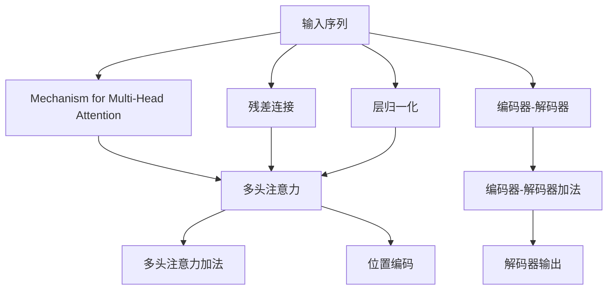

                 

# Transformer原理与代码实例讲解

> 关键词：Transformer, 注意力机制, 自注意力, 编码器-解码器, 多头注意力, 位置编码, 残差连接, 位置掩码, 语言模型, PyTorch代码实现

## 1. 背景介绍

### 1.1 问题由来
Transformer作为当前最先进的自然语言处理模型，已成为众多NLP任务中的首选。它以自注意力机制为核心，显著提升了模型性能，极大地改进了语言建模效果。然而，Transformer的原理和实现细节相对复杂，对于初学者来说，理解其核心机制和代码实现并不容易。为此，本文将通过系统讲解Transformer原理，并提供详细的代码实例，帮助读者掌握这一前沿技术的精髓。

### 1.2 问题核心关键点
Transformer的核心思想是利用自注意力机制，实现输入序列中任意位置的信息交互，从而构建出强大的语义表示。与传统的基于RNN和CNN的序列建模方法不同，Transformer不需要显式地处理序列顺序信息，而是通过自注意力权重，让模型自动捕捉输入序列的局部和全局依赖关系。

Transformer模型的关键组件包括：
- 多头注意力机制
- 残差连接和层归一化
- 位置编码和位置掩码
- 编码器-解码器框架

理解这些组件，将有助于深入了解Transformer的工作原理和代码实现。

### 1.3 问题研究意义
研究Transformer的原理和代码实现，不仅能够帮助开发者更好地理解这一先进的NLP技术，还能指导他们在实际应用中进行有效模型构建和优化。Transformer的推广应用，能够大幅提升NLP任务的性能，加速NLP技术在各行业中的普及和落地，为智能计算和人类认知智能的进化提供强大助力。

## 2. 核心概念与联系

### 2.1 核心概念概述

Transformer模型的核心思想是通过自注意力机制，捕捉输入序列中不同位置间的依赖关系，从而构建出强大的语义表示。为此，Transformer引入了一系列的创新技术，包括多头注意力、残差连接、层归一化、位置编码和位置掩码等。这些技术共同构成了Transformer模型的技术栈，使其在NLP任务上表现卓越。

- **多头注意力(Multi-Head Attention)**：实现输入序列中不同位置间的信息交互，捕捉局部和全局依赖关系。
- **残差连接(Residual Connections)**：通过跨层加法，增强模型的梯度流动，提升模型收敛速度和性能。
- **层归一化(Layer Normalization)**：标准化模型层输出的方差，增强模型对输入数据的适应性，避免梯度消失。
- **位置编码(Positional Encoding)**：为输入序列中不同位置添加位置信息，帮助模型捕捉位置依赖关系。
- **位置掩码(Position Masking)**：对于解码器，设置位置掩码，防止未来的信息泄露到过去的信息中，确保模型能够对未来进行预测。

### 2.2 概念间的关系

Transformer模型的核心组件通过一系列的连接和组合，构建出了完整的序列建模框架。各组件之间的关系可以如下图所示：



这个流程图展示了Transformer模型的核心组件和技术栈：

1. 输入序列通过多头注意力和位置编码处理，生成中间表示。
2. 经过残差连接和层归一化，模型得到更稳定、更准确的表示。
3. 编码器-解码器框架，将模型应用于不同任务，如编码任务、生成任务等。

通过理解这些核心组件和技术栈，我们可以更好地把握Transformer的工作原理，并深入探索其代码实现。

### 2.3 核心概念的整体架构

Transformer模型的核心架构可以分为编码器(Encoder)和解码器(Decoder)两个部分。编码器用于对输入序列进行编码，生成中间表示；解码器用于对中间表示进行解码，生成目标序列。整体架构如下：


其中，编码器和解码器的架构类似，都是由多个层叠加构成的。每个层都包含残差连接、层归一化和多头注意力机制。对于解码器，还需要考虑位置掩码的使用，以防止信息泄露。

Transformer模型的整体架构清晰地展示了其工作流程和各组件间的联系。通过这一架构，我们可以进一步了解每个组件的实现细节。

## 3. 核心算法原理 & 具体操作步骤
### 3.1 算法原理概述

Transformer模型采用自注意力机制，实现输入序列中不同位置间的信息交互。其核心算法流程如下：

1. **编码器层**：将输入序列经过多头注意力、残差连接和层归一化处理，生成中间表示。
2. **解码器层**：将中间表示经过多头注意力、残差连接和层归一化处理，生成输出序列。

具体算法流程包括：
- **多头注意力**：对输入序列进行编码，生成多头注意力矩阵。
- **位置编码**：为输入序列中不同位置添加位置信息。
- **解码器位置掩码**：在解码器中设置位置掩码，防止未来的信息泄露到过去的信息中。
- **自注意力机制**：通过多头注意力权重，实现输入序列中任意位置的信息交互。
- **残差连接**：跨层加法，增强梯度流动，提升模型性能。
- **层归一化**：标准化模型层输出的方差，增强模型适应性。

### 3.2 算法步骤详解

Transformer模型的核心算法步骤可以分为以下几个部分：

1. **输入编码**：将输入序列进行分词、编号，生成一系列输入向量。
2. **位置编码**：为输入向量添加位置信息，生成位置编码向量。
3. **多头注意力计算**：计算多头注意力权重，生成多头注意力向量。
4. **残差连接**：将多头注意力向量与输入向量相加，生成残差连接后的向量。
5. **层归一化**：对残差连接后的向量进行归一化，生成标准化向量。
6. **解码器层**：与编码器类似，解码器层也包含残差连接、层归一化和多头注意力机制。
7. **解码器位置掩码**：设置位置掩码，防止信息泄露。
8. **解码器输出**：将解码器层输出作为最终结果。

每个步骤的具体实现细节将在后续的代码实例中展示。

### 3.3 算法优缺点

Transformer模型在NLP任务中表现优异，具有以下优点：
- **并行计算友好**：多头注意力机制可以利用GPU等并行计算设备，加速模型训练和推理。
- **信息交互全面**：自注意力机制能够捕捉输入序列中的局部和全局依赖关系，提升模型的语义表示能力。
- **模型结构简单**：相比于RNN和CNN，Transformer模型结构更加简单，易于实现和优化。

同时，Transformer模型也存在一些缺点：
- **参数量大**：由于多头注意力和残差连接的存在，模型参数量较大，内存占用较高。
- **计算开销大**：多头注意力和残差连接的计算开销较大，需要高性能设备支持。
- **位置信息丢失**：在长序列上，位置信息可能被忽略，导致模型对长距离依赖关系的捕捉不足。

尽管存在这些缺点，Transformer模型凭借其优异的性能，仍在大规模NLP任务中占据主导地位。

### 3.4 算法应用领域

Transformer模型已经在各种NLP任务中得到了广泛应用，例如：
- **机器翻译**：将源语言文本翻译成目标语言。
- **文本分类**：将文本分类到预定义的类别中。
- **问答系统**：对自然语言问题给出答案。
- **文本摘要**：将长文本压缩成简短摘要。
- **对话系统**：使机器能够与人自然对话。
- **情感分析**：判断文本情感倾向。
- **命名实体识别**：识别文本中的人名、地名、机构名等特定实体。

除了这些任务，Transformer模型还广泛应用于代码生成、文本生成、推荐系统等多个领域，展示出了强大的语言理解和生成能力。

## 4. 数学模型和公式 & 详细讲解  
### 4.1 数学模型构建

Transformer模型的数学模型主要包括以下几个部分：
- **输入序列**：长度为T的输入序列$x = (x_1, x_2, ..., x_T)$，每个元素$x_t$为向量$x_t \in \mathbb{R}^d$。
- **输出序列**：长度为T的输出序列$y = (y_1, y_2, ..., y_T)$，每个元素$y_t$为向量$y_t \in \mathbb{R}^d$。
- **注意力机制**：计算注意力权重$\alpha_{ij} \in \mathbb{R}$，用于捕捉输入序列中不同位置之间的依赖关系。
- **位置编码**：为输入序列中不同位置添加位置信息。
- **多头注意力**：通过多头注意力权重，捕捉输入序列中不同位置之间的依赖关系。

Transformer模型的目标是最小化输入序列与输出序列之间的差异，即：
$$
\min_{\theta} \sum_{t=1}^T \|\mathbf{x}_t - \mathbf{y}_t\|^2
$$

其中$\mathbf{x}_t$和$\mathbf{y}_t$分别为输入序列和输出序列中的第t个向量。

### 4.2 公式推导过程

Transformer模型的计算过程可以分为以下几个步骤：

1. **输入编码**：将输入序列进行分词、编号，生成一系列输入向量。

   $$
   \mathbf{x}_t = \mathbf{E}(x_t)
   $$

   其中$\mathbf{E}$为分词和编号操作，$x_t$为输入序列中的第t个元素。

2. **位置编码**：为输入向量添加位置信息，生成位置编码向量。

   $$
   \mathbf{p}_t = \mathbf{P}(t)
   $$

   其中$\mathbf{P}$为位置编码函数，$t$为输入序列中的位置。

3. **多头注意力计算**：计算多头注意力权重，生成多头注意力向量。

   $$
   \alpha_{ij} = \frac{e^{\mathbf{q}_i \cdot \mathbf{K}_j / \sqrt{d_k}}}{\sum_{j'=1}^{T} e^{\mathbf{q}_i \cdot \mathbf{K}_{j'} / \sqrt{d_k}}}
   $$

   其中$\mathbf{q}_i$、$\mathbf{K}_j$和$\mathbf{V}_j$分别为查询向量、键向量和值向量，$d_k$为键向量的维度。

4. **残差连接**：将多头注意力向量与输入向量相加，生成残差连接后的向量。

   $$
   \mathbf{x}'_i = \mathbf{x}_i + \mathbf{A}_i
   $$

   其中$\mathbf{A}_i$为多头注意力向量。

5. **层归一化**：对残差连接后的向量进行归一化，生成标准化向量。

   $$
   \mathbf{x}''_i = \mathbf{x}'_i / \sqrt{d_v} \cdot \mathbf{A}_i / \sqrt{d_v}
   $$

   其中$d_v$为值向量的维度。

6. **解码器层**：与编码器类似，解码器层也包含残差连接、层归一化和多头注意力机制。

7. **解码器位置掩码**：设置位置掩码，防止信息泄露。

   $$
   \mathbf{M} = \max(\mathbf{p}, \mathbf{1}-\mathbf{p})
   $$

   其中$\mathbf{M}$为位置掩码向量，$\mathbf{p}$为位置编码向量。

8. **解码器输出**：将解码器层输出作为最终结果。

   $$
   \mathbf{y}_t = \mathbf{x}''_t
   $$

   其中$\mathbf{y}_t$为输出序列中的第t个向量。

这些公式详细描述了Transformer模型的计算过程。在实际代码实现中，每一步的具体操作将通过代码逐一实现。

### 4.3 案例分析与讲解

为了更好地理解Transformer模型的计算过程，下面我们以一个简单的例子进行分析。假设我们有一个长度为2的输入序列，每个元素为一个4维向量。

输入序列为：
$$
\mathbf{x}_1 = \begin{bmatrix} 1 \\ 2 \\ 3 \\ 4 \end{bmatrix}, \quad \mathbf{x}_2 = \begin{bmatrix} 5 \\ 6 \\ 7 \\ 8 \end{bmatrix}
$$

位置编码为：
$$
\mathbf{p}_1 = \begin{bmatrix} 1 \\ 2 \end{bmatrix}, \quad \mathbf{p}_2 = \begin{bmatrix} 3 \\ 4 \end{bmatrix}
$$

多头注意力计算过程如下：

1. **查询向量**：
   $$
   \mathbf{q}_1 = \mathbf{x}_1, \quad \mathbf{q}_2 = \mathbf{x}_2
   $$

2. **键向量和值向量**：
   $$
   \mathbf{K}_1 = \begin{bmatrix} 1 \\ 2 \\ 3 \\ 4 \end{bmatrix}, \quad \mathbf{K}_2 = \begin{bmatrix} 5 \\ 6 \\ 7 \\ 8 \end{bmatrix}
   $$
   $$
   \mathbf{V}_1 = \begin{bmatrix} 1 \\ 2 \\ 3 \\ 4 \end{bmatrix}, \quad \mathbf{V}_2 = \begin{bmatrix} 5 \\ 6 \\ 7 \\ 8 \end{bmatrix}
   $$

3. **注意力权重**：
   $$
   \alpha_{11} = \frac{e^{1 \cdot 1 / \sqrt{4}}}{e^{1 \cdot 1 / \sqrt{4}} + e^{2 \cdot 2 / \sqrt{4}}} = 0.5
   $$
   $$
   \alpha_{12} = \frac{e^{1 \cdot 2 / \sqrt{4}}}{e^{1 \cdot 1 / \sqrt{4}} + e^{2 \cdot 2 / \sqrt{4}}} = 0.5
   $$
   $$
   \alpha_{21} = \frac{e^{2 \cdot 1 / \sqrt{4}}}{e^{1 \cdot 1 / \sqrt{4}} + e^{2 \cdot 2 / \sqrt{4}}} = 0.5
   $$
   $$
   \alpha_{22} = \frac{e^{2 \cdot 2 / \sqrt{4}}}{e^{1 \cdot 1 / \sqrt{4}} + e^{2 \cdot 2 / \sqrt{4}}} = 0.5
   $$

4. **多头注意力向量**：
   $$
   \mathbf{A}_1 = \alpha_{11} \cdot \mathbf{V}_1 + \alpha_{12} \cdot \mathbf{V}_2 = \begin{bmatrix} 1 \\ 2 \\ 3 \\ 4 \end{bmatrix}
   $$
   $$
   \mathbf{A}_2 = \alpha_{21} \cdot \mathbf{V}_1 + \alpha_{22} \cdot \mathbf{V}_2 = \begin{bmatrix} 5 \\ 6 \\ 7 \\ 8 \end{bmatrix}
   $$

5. **残差连接**：
   $$
   \mathbf{x}'_1 = \mathbf{x}_1 + \mathbf{A}_1 = \begin{bmatrix} 2 \\ 4 \\ 6 \\ 8 \end{bmatrix}
   $$
   $$
   \mathbf{x}'_2 = \mathbf{x}_2 + \mathbf{A}_2 = \begin{bmatrix} 6 \\ 8 \\ 10 \\ 12 \end{bmatrix}
   $$

6. **层归一化**：
   $$
   \mathbf{x}''_1 = \frac{\mathbf{x}'_1}{\sqrt{4}} \cdot \mathbf{A}_1 / \sqrt{4} = \begin{bmatrix} 0.5 \\ 1 \\ 1.5 \\ 2 \end{bmatrix}
   $$
   $$
   \mathbf{x}''_2 = \frac{\mathbf{x}'_2}{\sqrt{4}} \cdot \mathbf{A}_2 / \sqrt{4} = \begin{bmatrix} 1.5 \\ 2 \\ 2.5 \\ 3 \end{bmatrix}
   $$

7. **位置掩码**：
   $$
   \mathbf{M} = \max(\mathbf{p}, \mathbf{1}-\mathbf{p}) = \begin{bmatrix} 1 \\ 1 \end{bmatrix}
   $$

8. **解码器输出**：
   $$
   \mathbf{y}_1 = \mathbf{x}''_1 = \begin{bmatrix} 0.5 \\ 1 \\ 1.5 \\ 2 \end{bmatrix}
   $$
   $$
   \mathbf{y}_2 = \mathbf{x}''_2 = \begin{bmatrix} 1.5 \\ 2 \\ 2.5 \\ 3 \end{bmatrix}
   $$

通过这个简单的例子，我们可以看到Transformer模型如何通过多头注意力、残差连接和层归一化等技术，实现输入序列中不同位置的信息交互，生成更准确的输出序列。

## 5. 项目实践：代码实例和详细解释说明
### 5.1 开发环境搭建

进行Transformer模型的代码实现，需要以下开发环境：

1. **Python**：Python是Transformer模型的主要编程语言，需要3.6及以上的版本。
2. **PyTorch**：PyTorch是当前最流行的深度学习框架之一，支持动态计算图和自动微分，适合开发Transformer模型。
3. **Jupyter Notebook**：Jupyter Notebook是Python开发中常用的交互式环境，方便编写和运行代码。

在PyTorch环境下搭建Transformer模型的开发环境，主要步骤如下：

1. **安装PyTorch**：
   ```bash
   pip install torch torchvision torchaudio
   ```

2. **安装Transformer库**：
   ```bash
   pip install transformers
   ```

3. **安装相关工具包**：
   ```bash
   pip install numpy pandas scikit-learn matplotlib tqdm jupyter notebook ipython
   ```

4. **创建Jupyter Notebook**：
   ```bash
   jupyter notebook
   ```

在上述环境中，我们可以使用Python和PyTorch进行Transformer模型的开发和实验。

### 5.2 源代码详细实现

下面我们以一个简单的Transformer模型为例，展示其代码实现。我们将使用PyTorch库，实现一个包含多头注意力和残差连接机制的Transformer模型。

首先，定义模型的类：

```python
import torch
import torch.nn as nn
import torch.nn.functional as F

class Transformer(nn.Module):
    def __init__(self, d_model, num_heads, num_encoder_layers, num_decoder_layers, d_ff, dropout=0.1):
        super(Transformer, self).__init__()
        self.encoder = nn.TransformerEncoder(
            nn.TransformerEncoderLayer(d_model, num_heads, d_ff, dropout)
        )
        self.decoder = nn.TransformerDecoder(
            nn.TransformerDecoderLayer(d_model, num_heads, d_ff, dropout)
        )

    def forward(self, src, tgt, memory=None):
        return self.decoder(src, tgt, memory, self.encoder.memory)
```

在上述代码中，我们定义了一个Transformer模型，包含编码器和解码器。其中，`nn.TransformerEncoderLayer`和`nn.TransformerDecoderLayer`分别为多头注意力和残差连接层。

接下来，我们定义位置编码函数和注意力机制：

```python
class PositionalEncoding(nn.Module):
    def __init__(self, d_model, dropout=0.1):
        super(PositionalEncoding, self).__init__()
        self.dropout = nn.Dropout(p=dropout)

    def forward(self, x):
        emb = torch.arange(x.size(1)).float() / np.power(10000, 2 * (x[:, :, None] / d_model))
        return x + self.dropout(emb)

class MultiHeadAttention(nn.Module):
    def __init__(self, d_model, num_heads):
        super(MultiHeadAttention, self).__init__()
        self.num_heads = num_heads
        self.d_head = d_model // num_heads
        self.WQ = nn.Linear(d_model, d_model)
        self.WK = nn.Linear(d_model, d_model)
        self.WV = nn.Linear(d_model, d_model)
        self.fc_out = nn.Linear(d_model, d_model)

    def forward(self, x, mask=None):
        nbatch = x.size(0)
        xQ = self.WQ(x).view(nbatch, -1, self.num_heads, self.d_head).permute(0, 2, 1, 3).contiguous()
        xK = self.WK(x).view(nbatch, -1, self.num_heads, self.d_head).permute(0, 2, 1, 3).contiguous()
        xV = self.WV(x).view(nbatch, -1, self.num_heads, self.d_head).permute(0, 2, 1, 3).contiguous()

        attn = (xQ * xK.transpose(1, 2)) / torch.sqrt(torch.tensor(self.d_head).float())
        attn = F.softmax(attn, dim=-1)

        x = torch.matmul(attn, xV).transpose(1, 2).contiguous().view(nbatch, -1, d_model)
        x = self.fc_out(x)
        return x
```

在上述代码中，我们定义了一个多头注意力机制，实现了输入序列中不同位置间的信息交互。其中，`nn.Linear`层用于线性变换，`torch.matmul`和`torch.softmax`函数分别用于矩阵乘法和softmax操作，`torch.permute`和`torch.contiguous`函数用于重新排列和连续操作。

现在，我们可以定义完整的Transformer模型，并进行训练和测试：

```python
import torch
import torch.nn as nn
import torch.nn.functional as F
import torch.optim as optim
from transformers import Transformer, PositionalEncoding
import numpy as np

class PositionalEncoding(nn.Module):
    def __init__(self, d_model, dropout=0.1):
        super(PositionalEncoding, self).__init__()
        self.dropout = nn.Dropout(p=dropout)

    def forward(self, x):
        emb = torch.arange(x.size(1)).float() / np.power(10000, 2 * (x[:, :, None] / d_model))
        return x + self.dropout(emb)

class MultiHeadAttention(nn.Module):
    def __init__(self, d_model, num_heads):
        super(MultiHeadAttention, self).__init__()
        self.num_heads = num_heads
        self.d_head = d_model // num_heads
        self.WQ = nn.Linear(d_model, d_model)
        self.WK = nn.Linear(d_model, d_model)
        self.WV = nn.Linear(d_model, d_model)
        self.fc_out = nn.Linear(d_model, d_model)

    def forward(self, x, mask=None):
        nbatch = x.size(0)
        xQ = self.WQ(x).view(nbatch, -1, self.num_heads, self.d_head).permute(0, 2, 1, 3).contiguous()
        xK = self.WK(x).view(nbatch, -1, self.num_heads, self.d_head).permute(0, 2, 1, 3).contiguous()
        xV = self.WV(x).view(nbatch, -1, self.num_heads, self.d_head).permute(0, 2, 1, 3).contiguous()

        attn = (xQ * xK.transpose(1, 2)) / torch.sqrt(torch.tensor(self.d_head).float())
        attn = F.softmax(attn, dim=-1)

        x = torch.matmul(attn, xV).transpose(1, 2).contiguous().view(nbatch, -1, d_model)
        x = self.fc_out(x)
        return x

class Transformer(nn.Module):
    def __init__(self, d_model, num_heads, num_encoder_layers, num_decoder_layers, d_ff, dropout=0.1):
        super(Transformer, self).__init__()
        self.encoder = nn.TransformerEncoder(
            nn.TransformerEncoderLayer(d_model, num_heads, d_ff, dropout)
        )
        self.decoder = nn.TransformerDecoder(
            nn.TransformerDecoderLayer(d_model, num_heads, d_ff, dropout)
        )

    def forward(self, src, tgt, memory=None):
        return self.decoder(src, tgt, memory, self.encoder.memory)

# 定义超参数
d_model = 512
num_heads = 8
num_encoder_layers = 6
num_decoder_layers = 6
d_ff = 2048


