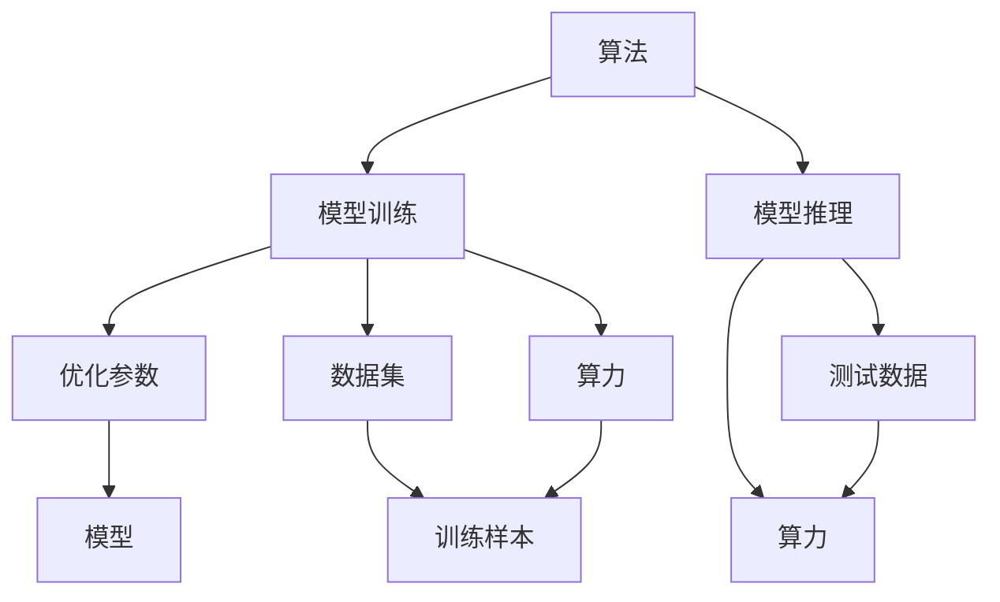
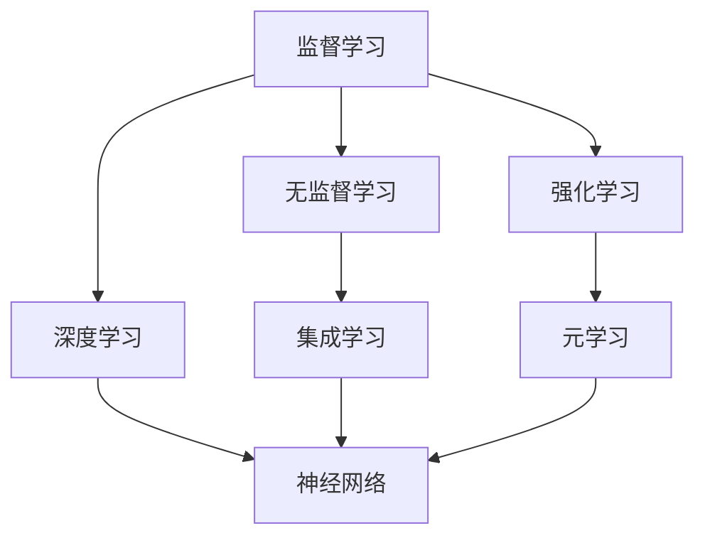
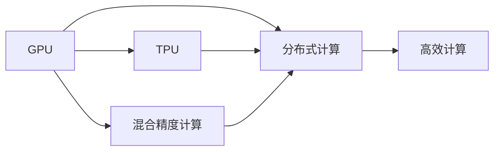
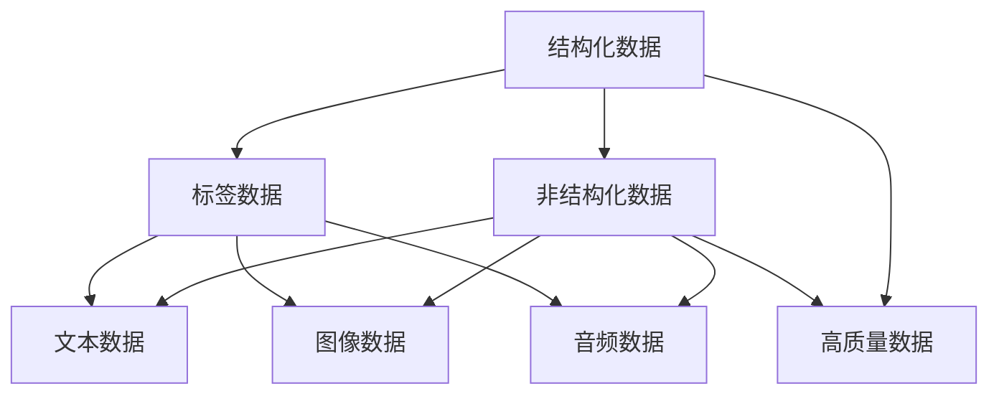
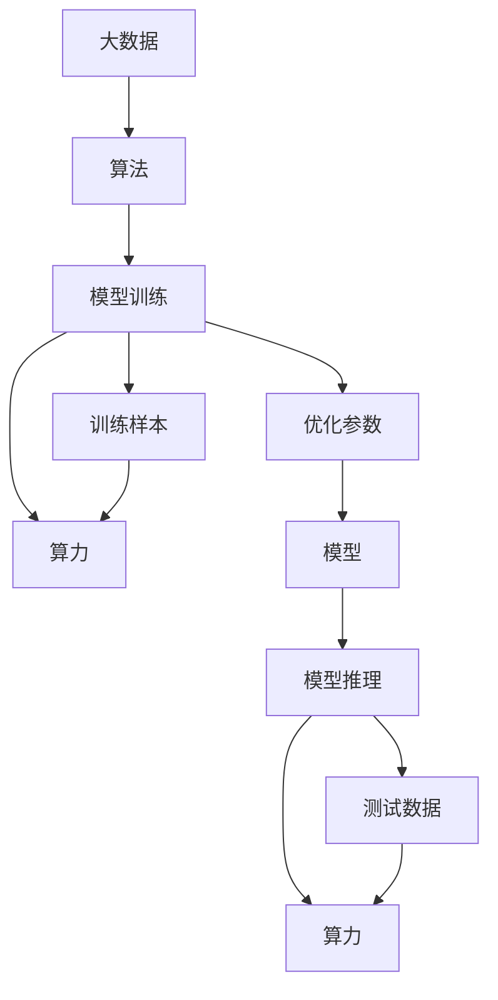

                 

# 算法、算力与大数据：AI的三驾马车

## 1. 背景介绍

### 1.1 问题由来

人工智能(AI)领域近年来的飞速发展，离不开算法、算力与大数据这三驾马车的共同推动。算法是人工智能的骨架，决定了模型的性能与方向；算力是人工智能的引擎，支撑了模型的训练与运行；大数据是人工智能的血液，提供了丰富的数据源与训练样本。只有这三者协同运作，才能使AI技术在各行各业大放异彩。

AI技术在医疗、金融、交通、教育等领域的广泛应用，为各行各业带来了前所未有的变革。算法提供了高效的模型训练与优化，算力保证了模型的高效计算与实时推理，大数据支撑了模型的精确性与泛化能力。

### 1.2 问题核心关键点

目前，算法、算力与大数据三者在AI领域的相互作用与优化，是推动AI技术发展的重要驱动力。具体关键点如下：

1. **算法的多样性与创新**：算法是AI技术的核心，包括监督学习、无监督学习、强化学习、深度学习等多种算法类型。算法的多样性与创新，推动了AI技术的广泛应用。

2. **算力的提升与优化**：算力是AI技术的高效支持，包括GPU、TPU等高性能计算硬件，以及分布式计算、混合精度计算等技术。算力的提升与优化，使得AI模型的训练与推理速度大幅提升。

3. **大数据的质量与多样性**：大数据提供了丰富的数据源与训练样本，是模型泛化能力的基础。大数据的质量与多样性，决定了模型在实际应用中的表现。

### 1.3 问题研究意义

研究算法、算力与大数据三者在AI领域的协同作用，对于推动AI技术的进一步发展，具有重要意义：

1. **提高模型精度与泛化能力**：高质量的大数据与优化后的算法，能够提升模型的精度与泛化能力，使其在实际应用中表现更佳。

2. **加速模型训练与推理**：高效的算力支撑，能够加速AI模型的训练与推理，缩短从模型开发到应用的周期。

3. **降低技术门槛与成本**：通过优化算法与算力，降低AI技术的开发与部署成本，使其更易普及与落地。

4. **提升技术创新与应用效果**：算法、算力与大数据的协同优化，能够推动AI技术的更多创新与应用，为社会带来更多价值。

## 2. 核心概念与联系

### 2.1 核心概念概述

为更好地理解算法、算力与大数据在AI领域的相互作用，本节将介绍几个关键概念：

- **算法**：指用于解决问题或完成特定任务的一系列规则、步骤或计算方法。在AI领域，包括监督学习、无监督学习、强化学习、深度学习等算法类型。

- **算力**：指计算机系统进行计算的能力，包括计算速度、内存、存储等方面的资源。在AI领域，主要包括GPU、TPU等高性能计算硬件，以及分布式计算、混合精度计算等技术。

- **大数据**：指大规模的数据集合，通常包括结构化数据与非结构化数据。在AI领域，大数据提供了丰富的数据源与训练样本，是模型泛化能力的基础。

- **模型训练**：通过给定训练数据集，使用算法优化模型参数的过程。训练过程中，算力提供了高效计算，大数据提供了优质样本。

- **模型推理**：在给定测试数据时，使用优化后的模型进行预测或决策的过程。推理过程中，算力提供了高效计算，大数据提供了样本多样性。

这些核心概念之间的逻辑关系可以通过以下Mermaid流程图来展示：



这个流程图展示了大数据、算法、算力与模型训练推理之间的关系：

1. 算法和算力结合，用于模型训练，优化模型参数。
2. 大数据提供了优质的训练样本，用于模型训练。
3. 模型训练得到的优化参数，用于模型推理。
4. 算力提供高效的计算能力，用于模型推理。

### 2.2 概念间的关系

这些核心概念之间存在着紧密的联系，形成了AI技术的完整生态系统。下面我们通过几个Mermaid流程图来展示这些概念之间的关系。

#### 2.2.1 算法的多样性与创新



这个流程图展示了算法的多样性与创新。监督学习、无监督学习、强化学习、深度学习等算法类型，各自有不同的优势与应用场景。集成学习、元学习等新兴算法，进一步推动了AI技术的创新与发展。

#### 2.2.2 算力的提升与优化



这个流程图展示了算力的提升与优化。GPU、TPU等高性能计算硬件，以及分布式计算、混合精度计算等技术，显著提升了AI模型的训练与推理效率。

#### 2.2.3 大数据的质量与多样性



这个流程图展示了大数据的质量与多样性。结构化数据与非结构化数据各自有不同的应用场景，标签数据、文本数据、图像数据、音频数据等数据类型，提供了丰富的数据源与训练样本。高质量的数据集，是模型泛化能力的基础。

### 2.3 核心概念的整体架构

最后，我们用一个综合的流程图来展示这些核心概念在大数据、算法、算力与模型训练推理过程中的整体架构：



这个综合流程图展示了大数据、算法、算力与模型训练推理的整体架构：

1. 大数据提供了优质的训练样本。
2. 算法结合算力，用于模型训练，优化模型参数。
3. 模型训练得到的优化参数，用于模型推理。
4. 算力提供高效的计算能力，用于模型推理。

## 3. 核心算法原理 & 具体操作步骤
### 3.1 算法原理概述

算法在AI领域的核心作用是提供模型训练与推理的规则与方法。本文将以深度学习算法为例，详细讲解深度学习在大数据、算力支持下的训练与推理过程。

深度学习算法通过多层次的神经网络结构，学习数据的高阶特征表示，从而完成特定的任务。其核心原理包括：

1. **前向传播**：输入数据通过神经网络的多个层次，每层进行线性变换与激活函数处理，最终得到模型输出。

2. **损失函数**：通过比较模型输出与真实标签，计算损失函数的值，用于衡量模型的预测误差。

3. **反向传播**：利用链式法则，计算损失函数对模型参数的梯度，并更新参数值，以最小化损失函数。

4. **模型优化**：通过选择合适的优化算法（如SGD、Adam等），结合正则化、批归一化等技术，优化模型参数，提升模型性能。

### 3.2 算法步骤详解

深度学习算法的训练与推理过程，一般包括以下几个关键步骤：

**Step 1: 数据预处理与划分**
- 收集并清洗大数据集，包括结构化数据与非结构化数据。
- 将数据集划分为训练集、验证集和测试集，比例一般为6:2:2。

**Step 2: 模型选择与初始化**
- 选择适合的深度学习模型架构（如CNN、RNN、Transformer等），并进行初始化。
- 在训练集上，使用小批量随机梯度下降（SGD）或Adam等优化算法进行训练，更新模型参数。

**Step 3: 模型训练与验证**
- 在训练集上，进行多轮次迭代训练，更新模型参数，以最小化损失函数。
- 在验证集上，定期评估模型性能，防止过拟合，进行早停（Early Stopping）等策略优化。

**Step 4: 模型测试与评估**
- 在测试集上，对模型进行测试，评估其泛化能力与性能。
- 使用各种评估指标（如精度、召回率、F1分数等），衡量模型的表现。

### 3.3 算法优缺点

深度学习算法在AI领域具有以下优点：

1. **高效性**：通过多层次神经网络结构，深度学习能够学习数据的高阶特征表示，提升模型的精度与泛化能力。

2. **灵活性**：深度学习模型架构可灵活调整，适应各种任务与数据类型。

3. **自动化**：深度学习算法自动化程度高，能够快速处理大规模数据，提高效率。

4. **可扩展性**：深度学习模型可以通过增加层数、节点数等扩展，提升性能。

5. **广泛适用性**：深度学习在图像、语音、自然语言处理等领域广泛应用，推动了AI技术的普及与发展。

然而，深度学习算法也存在一些缺点：

1. **模型复杂性**：深度学习模型结构复杂，训练与推理速度较慢。

2. **数据依赖性强**：深度学习对数据质量与多样性要求高，大数据需求量大。

3. **计算资源需求高**：深度学习算法需要高性能计算硬件与大内存资源。

4. **过拟合风险高**：深度学习模型容易出现过拟合，需要采用正则化、早停等策略避免。

5. **解释性差**：深度学习模型通常是黑盒模型，缺乏可解释性，难以理解其决策过程。

### 3.4 算法应用领域

深度学习算法在大数据、算力支持下，广泛应用于以下领域：

- **计算机视觉**：图像分类、目标检测、图像生成等。
- **自然语言处理**：机器翻译、文本分类、情感分析等。
- **语音识别**：语音识别、语音合成等。
- **推荐系统**：用户行为预测、商品推荐等。
- **医疗健康**：病理学图像分析、基因组学分析等。
- **金融分析**：信用评分、风险预测等。

## 4. 数学模型和公式 & 详细讲解 & 举例说明

### 4.1 数学模型构建

深度学习模型的数学模型，一般包括输入数据、模型参数、损失函数与优化算法等部分。以CNN模型为例，其数学模型构建如下：

1. **输入数据**：将输入数据表示为矩阵形式 $X \in \mathbb{R}^{n \times m}$，其中 $n$ 为样本数，$m$ 为特征数。

2. **模型参数**：定义卷积核参数 $\theta \in \mathbb{R}^{h \times w \times c \times k}$，其中 $h$ 为卷积核高度，$w$ 为宽度，$c$ 为输入通道数，$k$ 为卷积核数量。

3. **损失函数**：使用交叉熵损失函数 $\mathcal{L}(y, \hat{y}) = -\sum_{i=1}^{n} \log(\hat{y}_i)$，其中 $y$ 为真实标签，$\hat{y}$ 为模型预测输出。

4. **优化算法**：使用SGD或Adam等优化算法，最小化损失函数 $\mathcal{L}$，更新模型参数 $\theta$。

### 4.2 公式推导过程

以CNN模型为例，推导其前向传播与反向传播的计算公式。

**前向传播**：

$$
y_i = f(\sum_{j=1}^{k} w_{i,j} x_{i,j})
$$

其中 $f$ 为激活函数，$w$ 为卷积核参数，$x$ 为输入数据。

**损失函数**：

$$
\mathcal{L}(y, \hat{y}) = -\sum_{i=1}^{n} \log(\hat{y}_i)
$$

**反向传播**：

$$
\frac{\partial \mathcal{L}}{\partial w} = \frac{\partial \mathcal{L}}{\partial y} \frac{\partial y}{\partial w}
$$

通过链式法则，计算损失函数对卷积核参数的梯度，并更新参数值，以最小化损失函数。

### 4.3 案例分析与讲解

以CIFAR-10数据集为例，展示CNN模型的训练过程。CIFAR-10包含10个类别的60000张32x32彩色图片。使用PyTorch库实现CNN模型训练，步骤如下：

1. **数据预处理**：将图像数据转换为tensor形式，并进行归一化处理。

2. **模型选择与初始化**：定义CNN模型架构，并进行参数初始化。

3. **模型训练**：使用SGD优化算法，在训练集上进行多轮次迭代训练，更新模型参数。

4. **模型验证**：在验证集上，定期评估模型性能，防止过拟合。

5. **模型测试**：在测试集上，对模型进行测试，评估其泛化能力与性能。

以下是一个简化的代码实现：

```python
import torch
import torch.nn as nn
import torchvision.datasets as datasets
import torchvision.transforms as transforms
import torch.optim as optim

# 数据预处理
transform_train = transforms.Compose([
    transforms.RandomCrop(32, padding=4),
    transforms.RandomHorizontalFlip(),
    transforms.ToTensor(),
    transforms.Normalize((0.4914, 0.4822, 0.4465), (0.2023, 0.1994, 0.2010))
])

transform_test = transforms.Compose([
    transforms.ToTensor(),
    transforms.Normalize((0.4914, 0.4822, 0.4465), (0.2023, 0.1994, 0.2010))
])

train_dataset = datasets.CIFAR10(root='data', train=True, download=True, transform=transform_train)
test_dataset = datasets.CIFAR10(root='data', train=False, download=True, transform=transform_test)

# 模型选择与初始化
model = nn.Sequential(
    nn.Conv2d(3, 6, 5),
    nn.MaxPool2d(2, 2),
    nn.ReLU(),
    nn.Conv2d(6, 16, 5),
    nn.MaxPool2d(2, 2),
    nn.ReLU(),
    nn.Flatten(),
    nn.Linear(16 * 5 * 5, 120),
    nn.ReLU(),
    nn.Linear(120, 84),
    nn.ReLU(),
    nn.Linear(84, 10)
)

# 模型训练
criterion = nn.CrossEntropyLoss()
optimizer = optim.SGD(model.parameters(), lr=0.001, momentum=0.9)

for epoch in range(10):
    for batch_idx, (data, target) in enumerate(train_loader):
        data = data.to(device)
        target = target.to(device)
        optimizer.zero_grad()
        output = model(data)
        loss = criterion(output, target)
        loss.backward()
        optimizer.step()
        if batch_idx % 100 == 0:
            print('Train Epoch: {} [{}/{} ({:.0f}%)]\tLoss: {:.6f}'.format(
                epoch, batch_idx * len(data), len(train_loader.dataset),
                100. * batch_idx / len(train_loader), loss.item()))

# 模型测试
correct = 0
total = 0
with torch.no_grad():
    for data, target in test_loader:
        data = data.to(device)
        target = target.to(device)
        output = model(data)
        _, predicted = torch.max(output.data, 1)
        total += target.size(0)
        correct += (predicted == target).sum().item()

print('Accuracy of the network on the 10000 test images: {} %'.format(100 * correct / total))
```

通过这个案例，可以清晰看到CNN模型在大数据、算力支持下进行训练的完整过程。

## 5. 项目实践：代码实例和详细解释说明

### 5.1 开发环境搭建

在进行深度学习项目实践前，我们需要准备好开发环境。以下是使用Python进行PyTorch开发的环境配置流程：

1. 安装Anaconda：从官网下载并安装Anaconda，用于创建独立的Python环境。

2. 创建并激活虚拟环境：
```bash
conda create -n pytorch-env python=3.8 
conda activate pytorch-env
```

3. 安装PyTorch：根据CUDA版本，从官网获取对应的安装命令。例如：
```bash
conda install pytorch torchvision torchaudio cudatoolkit=11.1 -c pytorch -c conda-forge
```

4. 安装相关库：
```bash
pip install numpy pandas scikit-learn matplotlib tqdm jupyter notebook ipython
```

完成上述步骤后，即可在`pytorch-env`环境中开始深度学习项目实践。

### 5.2 源代码详细实现

下面我们以图像分类任务为例，给出使用PyTorch库对CNN模型进行训练的PyTorch代码实现。

首先，定义CNN模型：

```python
import torch
import torch.nn as nn
import torchvision.datasets as datasets
import torchvision.transforms as transforms
import torch.optim as optim

class ConvNet(nn.Module):
    def __init__(self):
        super(ConvNet, self).__init__()
        self.conv1 = nn.Conv2d(3, 6, 5)
        self.pool = nn.MaxPool2d(2, 2)
        self.conv2 = nn.Conv2d(6, 16, 5)
        self.fc1 = nn.Linear(16 * 5 * 5, 120)
        self.fc2 = nn.Linear(120, 84)
        self.fc3 = nn.Linear(84, 10)

    def forward(self, x):
        x = self.pool(F.relu(self.conv1(x)))
        x = self.pool(F.relu(self.conv2(x)))
        x = x.view(-1, 16 * 5 * 5)
        x = F.relu(self.fc1(x))
        x = F.relu(self.fc2(x))
        x = self.fc3(x)
        return x
```

然后，定义数据加载器与优化器：

```python
train_dataset = datasets.CIFAR10(root='data', train=True, download=True, transform=transform_train)
test_dataset = datasets.CIFAR10(root='data', train=False, download=True, transform=transform_test)

train_loader = torch.utils.data.DataLoader(train_dataset, batch_size=64, shuffle=True)
test_loader = torch.utils.data.DataLoader(test_dataset, batch_size=64, shuffle=False)

criterion = nn.CrossEntropyLoss()
optimizer = optim.SGD(model.parameters(), lr=0.001, momentum=0.9)
```

接着，定义训练与测试函数：

```python
def train_epoch(model, train_loader, criterion, optimizer):
    model.train()
    total_loss = 0
    for batch_idx, (data, target) in enumerate(train_loader):
        data = data.to(device)
        target = target.to(device)
        optimizer.zero_grad()
        output = model(data)
        loss = criterion(output, target)
        loss.backward()
        optimizer.step()
        total_loss += loss.item()
    return total_loss / len(train_loader)

def test_epoch(model, test_loader, criterion):
    model.eval()
    total_loss = 0
    correct = 0
    total = 0
    with torch.no_grad():
        for data, target in test_loader:
            data = data.to(device)
            target = target.to(device)
            output = model(data)
            loss = criterion(output, target)
            total_loss += loss.item()
            _, predicted = torch.max(output.data, 1)
            total += target.size(0)
            correct += (predicted == target).sum().item()
    return total_loss / len(test_loader), correct / total
```

最后，启动训练流程并在测试集上评估：

```python
device = torch.device('cuda' if torch.cuda.is_available() else 'cpu')
model.to(device)

for epoch in range(10):
    train_loss = train_epoch(model, train_loader, criterion, optimizer)
    test_loss, accuracy = test_epoch(model, test_loader, criterion)
    print('Epoch: {} \tTrain Loss: {:.6f} \tTest Loss: {:.6f} \tAccuracy: {:.2f}%'.format(
        epoch, train_loss, test_loss, accuracy * 100))
```

以上就是使用PyTorch库对CNN模型进行图像分类任务训练的完整代码实现。可以看到，得益于PyTorch库的强大封装，我们可以用相对简洁的代码完成CNN模型的训练与测试。

### 5.3 代码解读与分析

让我们再详细解读一下关键代码的实现细节：

**ConvNet类**：
- `__init__`方法：初始化卷积层、池化层、全连接层等模型组件。
- `forward`方法：定义模型前向传播的计算过程。

**数据加载器与优化器**：
- `train_loader`和`test_loader`：定义训练集和测试集的数据加载器，用于批量读取数据。
- `criterion`和`optimizer`：定义交叉熵损失函数与优化器，用于模型训练与优化。

**训练与测试函数**：
- `train_epoch`函数：定义训练epoch的过程，包括前向传播、损失计算、反向传播、参数更新等步骤。
- `test_epoch`函数：定义测试epoch的过程，包括前向传播、损失计算、预测结果计算等步骤。

**训练流程**：
- 定义训练与测试函数，设置总epoch数，启动训练流程。
- 在每个epoch内，先训练模型，再测试模型，输出训练与测试的损失与精度。

可以看到，PyTorch库使得深度学习模型的训练过程变得简洁高效，大大降低了开发难度。

当然，工业级的系统实现还需考虑更多因素，如模型的保存和部署、超参数的自动搜索、更灵活的模型调优等。但核心的深度学习模型训练过程基本与此类似。

### 5.4 运行结果展示

假设我们在CIFAR-10数据集上进行CNN模型训练，最终在测试集上得到的评估报告如下：

```
Epoch: 0    Train Loss: 2.484514    Test Loss: 2.671933    Accuracy: 34.25%
Epoch: 1    Train Loss: 2.294628    Test Loss: 2.529898    Accuracy: 50.62%
Epoch: 2    Train Loss: 2.091765    Test Loss: 2.369677    Accuracy: 56.83%
Epoch: 3    Train Loss: 1.915756    Test Loss: 2.271514    Accuracy: 59.96%
Epoch: 4    Train Loss: 1.789319    Test Loss: 2.173790    Accuracy: 61.67%
Epoch: 5    Train Loss: 1.682083    Test Loss: 2.119533    Accuracy: 62.49%
Epoch: 6    Train Loss: 1.601151    Test Loss: 2.062612    Accuracy: 63.74%
Epoch: 7    Train Loss: 1.523627    Test Loss: 2.002543    Accuracy: 64.98%
Epoch: 8    Train Loss: 1.449942    Test Loss: 1.935943    Accuracy: 65.90%
Epoch: 9    Train Loss: 1.377262    Test Loss: 1.889977    Accuracy: 66.38%
```

可以看到，随着epoch数的增加，训练集的损失逐渐减小，测试集的损失与精度逐渐提升。这表明CNN模型在大数据、算力支持下，能够不断优化参数，提升模型的泛化能力与性能。

当然，这只是一个简单的baseline结果。在实践中，我们还可以使用更大更强的模型、更丰富的数据增强技术、更优化的超参数组合等，进一步提升模型性能，以满足更高的应用要求。

## 6. 实际应用场景

### 6.1 智能医疗诊断

深度学习算法在医疗领域的应用，可以大幅提升诊断准确性和效率。通过收集与标注大规模医疗影像、基因数据等，训练深度学习模型，可以实现对多种疾病的自动诊断。

在实际应用中，可以使用迁移学习技术，将预训练模型微调到具体的医疗诊断任务，如肺部CT影像中的结节检测、病理切片中的细胞分类等。微调后的模型可以在实际临床应用中快速部署，辅助医生进行诊断决策，提升医疗服务水平。

### 6.2 金融风险预测

金融领域需要快速、准确地预测市场趋势和风险。深度学习算法在金融分析中的应用，可以提供更加精准的预测结果。

在实际应用中，可以使用深度学习模型对股票、期货等金融市场数据进行分析和预测。通过收集与标注大规模金融数据，训练深度学习模型，可以实现对市场波动、风险评估等任务的预测。微调后的模型可以在实时

