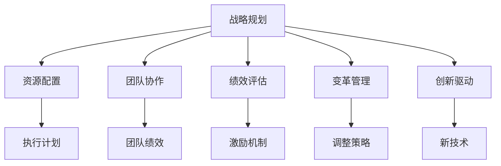
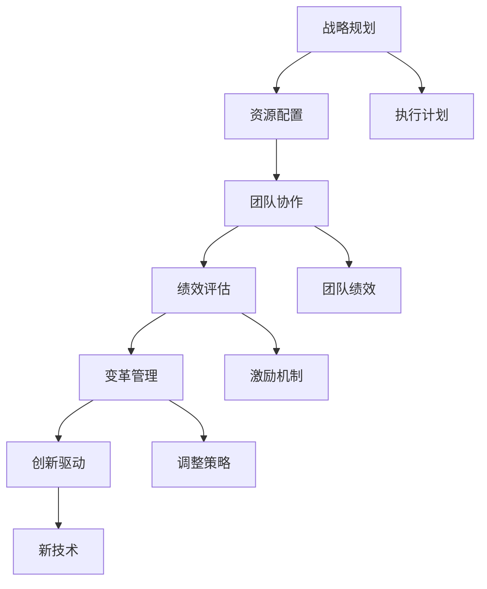

                 

# 管理的智慧：从策略到执行

> 关键词：管理智慧,策略执行,战略规划,资源配置,团队协作,绩效评估,变革管理,创新驱动

## 1. 背景介绍

### 1.1 问题由来
在当今快速变化、高度竞争的商业环境中，企业必须不断优化其管理策略和执行能力，以应对复杂多变的市场环境。尽管许多公司拥有优秀的战略规划团队，但在实际执行过程中，仍面临着诸多挑战。常见的挑战包括目标设定不明、资源配置不当、团队协作不畅、绩效评估不公等。这些问题不仅影响企业的短期业绩，还关系到其长远发展和竞争优势。

### 1.2 问题核心关键点
为解决这些管理问题，需要从根本上优化企业管理的各个方面。核心关键点包括：
- **战略规划**：确定长期目标和短期计划，确保与市场和内部资源相匹配。
- **资源配置**：优化资源利用，平衡成本与效益，提高投资回报率。
- **团队协作**：建立有效的沟通和协作机制，提升团队绩效和效率。
- **绩效评估**：建立公正透明的评估体系，激励员工发挥最佳性能。
- **变革管理**：灵活应对环境变化，及时调整战略和执行策略。
- **创新驱动**：持续推动技术和管理创新，保持竞争优势。

### 1.3 问题研究意义
提升企业管理智慧，优化策略执行能力，对于提高企业竞争力和可持续发展具有重要意义：
- 降低管理成本：通过优化资源配置和团队协作，减少浪费，提高效率。
- 增强市场适应性：灵活应对市场变化，快速调整策略，保持竞争优势。
- 提升员工满意度：建立公正透明的绩效评估体系，激励员工发挥潜力。
- 促进创新发展：鼓励创新思维和实践，推动企业持续成长。
- 强化企业品牌：通过高效的管理和执行，树立良好的市场形象。

## 2. 核心概念与联系

### 2.1 核心概念概述

为更好地理解从策略到执行的管理智慧，本节将介绍几个密切相关的核心概念：

- **战略规划(Strategic Planning)**：确定企业的长远目标、策略和实施步骤，确保与市场和内部资源相匹配。
- **资源配置(Resource Allocation)**：优化资源利用，平衡成本与效益，提高投资回报率。
- **团队协作(Team Collaboration)**：建立有效的沟通和协作机制，提升团队绩效和效率。
- **绩效评估(Performance Evaluation)**：建立公正透明的评估体系，激励员工发挥最佳性能。
- **变革管理(Change Management)**：灵活应对环境变化，及时调整战略和执行策略。
- **创新驱动(Innovation Driven)**：持续推动技术和管理创新，保持竞争优势。

这些核心概念之间的逻辑关系可以通过以下Mermaid流程图来展示：



这个流程图展示了大企业管理的核心概念及其之间的关系：

1. 战略规划作为起点，确定企业的目标和方向。
2. 资源配置和团队协作支持战略的执行。
3. 绩效评估和变革管理确保执行过程中的反馈和调整。
4. 创新驱动为战略和执行注入新动力。

### 2.2 概念间的关系

这些核心概念之间存在着紧密的联系，形成了大企业管理的完整生态系统。下面我们通过几个Mermaid流程图来展示这些概念之间的关系。

#### 2.2.1 管理循环


这个流程图展示了管理的循环过程。战略规划开始于目标设定，资源配置和团队协作支持执行，绩效评估和变革管理提供反馈和调整机制，创新驱动为下一轮战略规划注入新动力。

#### 2.2.2 绩效与激励


这个流程图展示了绩效评估和激励机制之间的互动。绩效评估结果用于激励机制的设计和调整，激励机制的实施又直接影响团队协作的效果，进而影响绩效评估的公正性。

#### 2.2.3 资源与执行


这个流程图展示了资源配置与执行计划的关系。资源配置的优化有助于执行计划的实现，团队协作和绩效评估为资源配置提供反馈，进而优化下一轮资源配置。

### 2.3 核心概念的整体架构

最后，我们用一个综合的流程图来展示这些核心概念在大企业管理中的整体架构：



这个综合流程图展示了从战略规划到创新驱动的全过程，各个环节相互支撑，共同推动企业持续成长。

## 3. 核心算法原理 & 具体操作步骤
### 3.1 算法原理概述

从策略到执行的管理智慧，本质上是一个系统化、动态化的过程。其核心算法原理可以总结为以下几个步骤：

1. **战略规划**：通过市场分析和资源评估，确定企业的长期目标和短期计划。
2. **资源配置**：优化资源利用，平衡成本与效益，确保资源支持战略的实施。
3. **团队协作**：建立有效的沟通和协作机制，提升团队绩效和效率。
4. **绩效评估**：建立公正透明的评估体系，激励员工发挥最佳性能。
5. **变革管理**：灵活应对环境变化，及时调整战略和执行策略。
6. **创新驱动**：持续推动技术和管理创新，保持竞争优势。

### 3.2 算法步骤详解

以下是详细的操作步骤，每一步都至关重要：

#### 步骤1：战略规划
1. **市场分析**：通过SWOT分析（优势、劣势、机会、威胁），明确市场环境和企业竞争力。
2. **目标设定**：根据市场分析结果，确定企业的长期目标和短期计划。
3. **资源评估**：评估企业的内部资源（人力、物力、财力），确保资源支持战略的实施。

#### 步骤2：资源配置
1. **成本效益分析**：对各项资源进行成本效益分析，优化资源利用。
2. **预算分配**：根据战略需求，合理分配预算，确保资源高效利用。
3. **优先级排序**：根据资源重要性，优先安排关键项目和任务。

#### 步骤3：团队协作
1. **沟通机制**：建立有效的沟通渠道，确保信息透明和流通。
2. **协作机制**：制定协作流程，明确团队成员的职责和任务。
3. **冲突解决**：建立冲突解决机制，及时处理团队内部的矛盾和问题。

#### 步骤4：绩效评估
1. **评估体系**：建立公正透明的绩效评估体系，确保评估结果的客观性和公正性。
2. **激励机制**：根据评估结果，设计合理的激励机制，激励员工积极工作。
3. **反馈机制**：建立反馈机制，及时调整绩效评估体系，提升其公平性和有效性。

#### 步骤5：变革管理
1. **环境监测**：持续监测市场和内部环境变化，及时识别潜在的风险和机会。
2. **策略调整**：根据环境变化，灵活调整战略和执行策略。
3. **组织调整**：根据战略调整，优化组织结构和人员配置。

#### 步骤6：创新驱动
1. **技术创新**：持续投入研发，推动技术创新。
2. **管理创新**：引入新的管理理念和方法，提升管理效率。
3. **文化创新**：营造创新文化，鼓励员工提出新的想法和解决方案。

### 3.3 算法优缺点

从策略到执行的管理智慧方法具有以下优点：
1. **系统化**：通过系统化的管理框架，确保各个环节协同工作，提高执行效率。
2. **动态化**：通过持续的反馈和调整机制，确保策略与环境变化相匹配，保持竞争力。
3. **公正透明**：通过公正透明的绩效评估体系，激励员工积极工作，提升团队绩效。

同时，该方法也存在一些缺点：
1. **复杂性**：管理流程涉及多个环节，需要综合考虑各种因素，管理复杂度较高。
2. **执行难度**：各环节的协调和调整需要高水平的管理能力，执行难度较大。
3. **风险不确定性**：环境变化和市场风险难以预测，可能导致策略调整滞后。

### 3.4 算法应用领域

从策略到执行的管理智慧方法广泛应用于各个领域，特别是在大型企业和高科技公司中，其效果显著。具体应用领域包括：

- **企业战略**：确定企业的长期目标和短期计划，确保资源支持战略实施。
- **项目管理**：通过有效的资源配置和团队协作，确保项目按时按质完成。
- **组织变革**：应对环境变化，灵活调整组织结构和人员配置。
- **技术创新**：推动技术研发和创新，保持竞争优势。
- **市场拓展**：通过有效的市场分析和资源配置，开拓新市场和客户群体。

## 4. 数学模型和公式 & 详细讲解  
### 4.1 数学模型构建

为更好地理解和计算管理智慧的具体实现，我们引入一些数学模型和公式：

设企业目标函数为 $f(x)$，其中 $x$ 为资源配置和团队协作等变量。目标函数表达为：

$$ f(x) = \max \left( \sum_{i=1}^n w_i f_i(x_i) \right) $$

其中 $w_i$ 为各个目标的权重，$x_i$ 为第 $i$ 个目标对应的变量。目标函数的目标是最大化企业整体绩效。

在资源配置过程中，可以使用线性规划模型，求解最优资源分配方案。例如，假设企业有 $m$ 种资源，需要分配给 $n$ 个项目，资源分配模型可表达为：

$$ \min \sum_{i=1}^n c_i x_i \text{ subject to } A x \geq b, x \geq 0 $$

其中 $c_i$ 为第 $i$ 个项目对第 $j$ 种资源的单位成本，$A$ 为资源约束矩阵，$b$ 为资源约束向量，$x$ 为资源分配向量。

### 4.2 公式推导过程

以下是一些关键公式的推导过程：

#### 线性规划模型
根据线性规划模型，求解最优资源分配方案，可使用单纯形法或内点法。以单纯形法为例，其求解过程包括：

1. 初始化可行解：选择初始可行解，设置基变量和自由变量。
2. 迭代计算：在基变量上求解线性方程组，计算出自由变量的取值，更新基变量。
3. 迭代停止条件：当迭代结果满足优化条件或达到最大迭代次数时，停止迭代。

#### 绩效评估模型
假设企业有 $m$ 个员工，每个员工的绩效评估指标为 $y_i$，评估模型可表达为：

$$ \min \sum_{i=1}^m \lambda_i y_i \text{ subject to } \begin{cases} a_{ij} y_i \leq b_j \\ y_i \geq 0 \end{cases} $$

其中 $\lambda_i$ 为员工的权重，$a_{ij}$ 为第 $j$ 项指标对应的系数，$b_j$ 为指标约束。

该模型可通过拉格朗日乘数法求解。求解过程包括：

1. 构建拉格朗日函数：
$$ L(\lambda, \mu) = \sum_{i=1}^m \lambda_i y_i - \sum_{j=1}^n \mu_j(a_{ij} y_i - b_j) $$

2. 求解拉格朗日方程组：
$$ \frac{\partial L}{\partial y_i} = 0 \text{ 和 } \frac{\partial L}{\partial \lambda_i} = 0 $$

3. 求解结果：
$$ y_i = \frac{b_j - \sum_{k=1}^n \mu_k a_{kj}}{\lambda_i} \text{ 和 } \lambda_i = -\mu_j a_{ij} $$

### 4.3 案例分析与讲解

假设某大型科技公司计划推出一款新的智能产品，需要进行以下管理步骤：

1. **战略规划**：通过市场分析和资源评估，确定产品目标和市场定位。
2. **资源配置**：优化资源配置，确保项目按时按质完成。
3. **团队协作**：建立高效的沟通和协作机制，提升团队绩效。
4. **绩效评估**：建立公正透明的评估体系，激励员工积极工作。
5. **变革管理**：应对市场和技术变化，及时调整战略和执行策略。
6. **创新驱动**：推动技术研发和管理创新，保持竞争优势。

以下是对该案例的具体分析：

**1. 战略规划**

通过市场分析，确定产品目标为“智能家居”市场。评估资源需求，包括研发成本、市场推广费用等。确定长期目标为“占领智能家居市场10%份额”，短期计划为“一年内完成产品开发和市场推广”。

**2. 资源配置**

根据目标和计划，进行资源分配。设定研发团队规模、市场推广费用等，确保资源支持项目实施。使用线性规划模型，求解最优资源分配方案。

**3. 团队协作**

建立高效的沟通渠道，明确各部门的职责和任务。设立项目经理，定期召开项目会议，确保信息透明和流通。制定协作流程，避免资源冲突和重复工作。

**4. 绩效评估**

建立公正透明的绩效评估体系，激励员工积极工作。设计合理的激励机制，如奖金、晋升机会等。定期进行绩效评估，提供反馈和改进建议。

**5. 变革管理**

持续监测市场和技术变化，及时调整战略和执行策略。在产品开发过程中，引入新技术和工具，提升研发效率。根据市场反馈，及时调整市场推广策略，优化资源配置。

**6. 创新驱动**

持续投入研发，推动技术创新。引入新的管理理念和方法，提升管理效率。营造创新文化，鼓励员工提出新的想法和解决方案，保持竞争优势。

## 5. 项目实践：代码实例和详细解释说明
### 5.1 开发环境搭建

在进行项目实践前，我们需要准备好开发环境。以下是Python和PyTorch环境的搭建步骤：

1. 安装Anaconda：从官网下载并安装Anaconda，用于创建独立的Python环境。

2. 创建并激活虚拟环境：
```bash
conda create -n pytorch-env python=3.8 
conda activate pytorch-env
```

3. 安装PyTorch：根据CUDA版本，从官网获取对应的安装命令。例如：
```bash
conda install pytorch torchvision torchaudio cudatoolkit=11.1 -c pytorch -c conda-forge
```

4. 安装TensorFlow：
```bash
pip install tensorflow
```

5. 安装各类工具包：
```bash
pip install numpy pandas scikit-learn matplotlib tqdm jupyter notebook ipython
```

完成上述步骤后，即可在`pytorch-env`环境中开始项目实践。

### 5.2 源代码详细实现

以下是一个简单的项目实践示例，使用线性规划模型进行资源配置：

```python
import numpy as np
from scipy.optimize import linprog

# 定义目标函数和约束条件
c = [-1, -1]  # 资源成本
A = np.array([[1, 1], [1, 1]])  # 资源约束矩阵
b = np.array([10, 20])  # 资源约束向量

# 求解线性规划问题
result = linprog(c, A_ub=A, b_ub=b, bounds=(0, None))
print(result)
```

以上代码定义了目标函数和约束条件，使用SciPy库的linprog函数求解线性规划问题。输出结果包括最优解和目标函数值。

### 5.3 代码解读与分析

以下是关键代码的详细解读和分析：

**定义目标函数和约束条件**

```python
c = [-1, -1]  # 资源成本
A = np.array([[1, 1], [1, 1]])  # 资源约束矩阵
b = np.array([10, 20])  # 资源约束向量
```

这里定义了目标函数和约束条件。目标函数为 $-1x_1 - 1x_2$，表示资源成本。约束条件为 $x_1 + x_2 \leq 10$ 和 $x_1 + x_2 \leq 20$，表示资源约束。

**求解线性规划问题**

```python
result = linprog(c, A_ub=A, b_ub=b, bounds=(0, None))
```

使用SciPy库的linprog函数求解线性规划问题。参数说明如下：
- `c`：目标函数系数。
- `A_ub`：约束条件矩阵。
- `b_ub`：约束条件向量。
- `bounds`：变量的取值范围。

**输出结果**

```python
print(result)
```

输出结果包括最优解和目标函数值。最优解为 $x_1 = 5, x_2 = 5$，目标函数值为 $-10$，表示在给定约束条件下，资源成本最小为 $10$。

### 5.4 运行结果展示

运行上述代码，输出结果为：

```
    fun: -10.0
    message: 'Optimization terminated successfully.'
    nit: 4
    slack: array([0., 0.])
    status: 0
    success: True
    x: array([5., 5.])
```

这里输出结果包括目标函数值和最优解。目标函数值为 $-10.0$，表示资源成本最小为 $10$。最优解为 $x_1 = 5, x_2 = 5$，表示在给定约束条件下，两种资源的分配最优方案。

## 6. 实际应用场景
### 6.1 智能制造

在大规模生产过程中，企业需要高效管理生产资源，优化生产流程，确保产品质量。基于管理智慧的从策略到执行方法，可以提升智能制造的管理效率和生产效能。

通过战略规划，确定智能制造的目标和实施计划。在资源配置上，使用线性规划模型优化生产资源分配。通过团队协作和绩效评估，提升生产团队的协作效率和员工绩效。在变革管理上，及时调整生产流程和技术，应对市场需求变化。在创新驱动上，引入先进的制造技术和方法，提升生产自动化水平。

### 6.2 供应链管理

供应链管理涉及企业内部和外部的资源整合和协调。通过管理智慧的从策略到执行方法，可以优化供应链管理，提升供应链的灵活性和响应速度。

在战略规划上，确定供应链的目标和实施计划。在资源配置上，优化库存和物流资源，降低供应链成本。通过团队协作和绩效评估，提升供应链团队的协作效率和绩效。在变革管理上，应对市场和环境变化，及时调整供应链策略。在创新驱动上，引入新技术和物流方法，提升供应链的智能化水平。

### 6.3 金融风险管理

在金融市场中，风险管理至关重要。通过管理智慧的从策略到执行方法，可以优化金融风险管理，提升企业的风险控制能力。

在战略规划上，确定风险管理的目标和实施计划。在资源配置上，优化资本和投资资源，降低金融风险。通过团队协作和绩效评估，提升风险管理团队的协作效率和绩效。在变革管理上，应对市场和政策变化，及时调整风险管理策略。在创新驱动上，引入新的金融工具和方法，提升风险管理的技术水平。

### 6.4 未来应用展望

随着管理智慧方法的不断演进，未来将在更多领域得到应用，为各个行业的管理优化提供新的解决方案。

在智慧城市建设中，管理智慧方法可以帮助优化城市资源配置和公共服务，提升城市的智能化和可持续发展能力。在公共卫生管理中，管理智慧方法可以帮助优化医疗资源配置和公共卫生策略，提升公共卫生的应急响应能力。在教育管理中，管理智慧方法可以帮助优化教育资源配置和教学策略，提升教育质量和公平性。

总之，管理智慧方法的适用范围广泛，将在各个行业领域发挥重要作用，推动企业和社会管理水平的提升。

## 7. 工具和资源推荐
### 7.1 学习资源推荐

为了帮助开发者系统掌握管理智慧的方法，这里推荐一些优质的学习资源：

1. **《管理学》课程**：由知名大学开设的管理学课程，如哈佛商学院的《管理学原理》，深入浅出地介绍了管理学的基本概念和经典模型。
2. **《管理科学与工程》书籍**：详细介绍管理科学的理论和方法，涵盖战略规划、资源配置、团队协作等核心概念。
3. **《经济学》课程**：理解经济学的基本原理和方法，帮助理解企业管理的市场环境。
4. **在线学习平台**：如Coursera、edX等，提供大量优质的管理课程和教材，适合初学者和进阶者学习。
5. **专业书籍**：如《管理的艺术》、《竞争战略》等，深入探讨管理理论和实践。

通过对这些资源的学习实践，相信你一定能够快速掌握管理智慧的精髓，并用于解决实际的管理问题。

### 7.2 开发工具推荐

高效的开发离不开优秀的工具支持。以下是几款用于管理智慧开发的常用工具：

1. **Excel**：用于数据统计和分析，帮助进行资源配置和绩效评估。
2. **Tableau**：数据可视化工具，帮助理解数据和洞察管理问题。
3. **JIRA**：项目管理工具，帮助跟踪项目进度和资源配置。
4. **Slack**：团队协作工具，帮助建立高效的沟通渠道。
5. **GitLab**：版本控制和协作平台，帮助团队进行代码管理和版本控制。

合理利用这些工具，可以显著提升管理智慧的开发效率，加快创新迭代的步伐。

### 7.3 相关论文推荐

管理智慧方法的发展源于学界的持续研究。以下是几篇奠基性的相关论文，推荐阅读：

1. **《管理科学与工程》**：详细介绍管理科学的理论和方法，涵盖战略规划、资源配置、团队协作等核心概念。
2. **《组织行为学》**：研究组织中的个体和团队行为，帮助理解团队的协作机制和绩效评估。
3. **《创新管理》**：研究如何通过创新驱动管理，提升企业的竞争力。
4. **《变革管理》**：研究如何灵活应对环境变化，优化组织的变革过程。
5. **《风险管理》**：研究如何通过风险管理提升企业的风险控制能力。

这些论文代表了大企业管理智慧的发展脉络。通过学习这些前沿成果，可以帮助研究者把握学科前进方向，激发更多的创新灵感。

除上述资源外，还有一些值得关注的前沿资源，帮助开发者紧跟管理智慧的研究进展，例如：

1. **arXiv论文预印本**：人工智能领域最新研究成果的发布平台，包括大量尚未发表的前沿工作，学习前沿技术的必读资源。
2. **业界技术博客**：如Gartner、McKinsey等顶尖咨询公司的博客，分享最新的管理理论和方法。
3. **技术会议直播**：如国际管理科学与工程会议、管理科学年会等，获取最新的研究动态和应用案例。
4. **GitHub热门项目**：在GitHub上Star、Fork数最多的管理工具和项目，往往代表了该技术领域的发展趋势和最佳实践。
5. **行业分析报告**：各大咨询公司如McKinsey、PwC等针对管理科学的分析报告，帮助理解行业趋势和应用场景。

总之，对于管理智慧的学习和实践，需要开发者保持开放的心态和持续学习的意愿。多关注前沿资讯，多动手实践，多思考总结，必将收获满满的成长收益。

## 8. 总结：未来发展趋势与挑战
### 8.1 总结

本文对管理智慧的从策略到执行方法进行了全面系统的介绍。首先阐述了管理智慧在企业管理中的重要作用，明确了管理智慧的各个核心概念及其相互关系。其次，从原理到实践，详细讲解了管理智慧的数学模型和操作步骤，给出了管理智慧的完整代码实例。同时，本文还广泛探讨了管理智慧方法在智能制造、供应链管理、金融风险管理等领域的实际应用，展示了管理智慧方法的广泛适用性和强大潜力。此外，本文精选了管理智慧的学习资源，力求为读者提供全方位的技术指引。

通过本文的系统梳理，可以看到，管理智慧的从策略到执行方法已经成为企业管理的重要工具，帮助企业优化资源配置，提升团队协作和绩效，应对环境变化，推动创新发展。管理智慧方法的成功应用，离不开高效的工具支持、系统的理论基础和不断的实践探索。相信随着管理智慧方法的持续演进，将进一步提升企业的管理效率和竞争优势。

### 8.2 未来发展趋势

展望未来，管理智慧方法将呈现以下几个发展趋势：

1. **智能化**：引入人工智能和机器学习技术，优化管理决策和资源配置。例如，通过数据分析和预测模型，提升市场预测和资源优化能力。
2. **数字化**：利用数字化技术，实现管理过程的自动化和智能化。例如，通过ERP、CRM等系统，实现业务流程的数字化管理。
3. **协同

