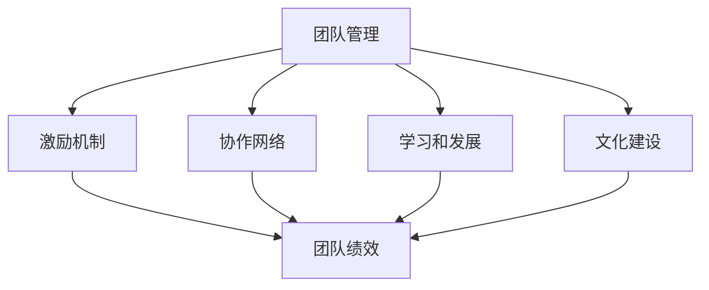

                 

# 管理的智慧：激发团队潜能

在数字化转型和全球化竞争的时代，团队的潜能成为企业成长和创新的关键。管理者的智慧不仅在于技术理解，更在于如何激发团队的潜能，构建高绩效的工作环境。本文将深入探讨管理的智慧，包括核心概念、算法原理、具体操作步骤，以及如何通过项目管理、激励机制和团队协作提升团队绩效，实现企业的可持续增长。

## 1. 背景介绍

### 1.1 问题由来
在快速变化的商业环境中，企业需要不断适应市场和客户需求，这要求其拥有高效、灵活、创新的团队。然而，传统管理方法往往忽视团队成员的个体差异和多样性，难以充分发挥每个人的潜能。因此，管理者需要掌握新的管理智慧，激发团队的集体智慧和创造力。

### 1.2 问题核心关键点
激发团队潜能的核心关键点在于：

1. **多样性和包容性**：认识到每个成员的独特价值，鼓励多样化的思维方式和视角。
2. **透明和信任**：建立开放透明的沟通机制，建立互信关系。
3. **灵活性和自主性**：给予团队成员更多自主权和决策权，提升其责任感和参与感。
4. **持续学习和创新**：促进团队成员的终身学习，鼓励创新思维和实践。
5. **协作和协调**：优化团队协作流程，促进跨部门和跨职能的合作。

这些关键点构成了激发团队潜能的基本框架，管理者应在此基础上，灵活运用各种管理工具和技术，提升团队绩效。

### 1.3 问题研究意义
研究激发团队潜能的管理智慧，对企业的发展具有重要意义：

1. **提升创新能力**：激发团队的创新思维，促进新产品、新服务和新业务模式的发展。
2. **增强市场竞争力**：通过高效的团队协作，快速响应市场变化，赢得竞争优势。
3. **提升员工满意度**：通过公正合理的管理，增强团队成员的归属感和成就感。
4. **实现可持续发展**：通过长期稳定的团队绩效，确保企业能够持续增长和适应变化。
5. **赋能行业变革**：通过先进的管理实践，推动整个行业向更加高效、环保和可持续的方向发展。

## 2. 核心概念与联系

### 2.1 核心概念概述

激发团队潜能的管理智慧，涉及多个核心概念：

- **团队管理**：指通过有效的领导和管理，促进团队成员之间的协作和沟通，达成共同目标。
- **激励机制**：通过设计合理的激励方案，激发团队成员的工作热情和创新动力。
- **协作网络**：构建和维护高效的团队协作网络，促进信息共享和知识流动。
- **学习和发展**：通过持续学习和职业发展，提升团队成员的专业能力和素质。
- **文化建设**：建立积极向上的企业文化，营造良好的工作氛围。

这些概念之间相互关联，共同构成激发团队潜能的整体框架。

### 2.2 概念间的关系

这些核心概念之间的关系可以通过以下Mermaid流程图来展示：



这个流程图展示了几大管理概念之间的逻辑关系：

1. 团队管理是基础，通过领导和管理，促进团队协作和沟通。
2. 激励机制是手段，通过设计合理的激励方案，激发团队成员的工作热情。
3. 协作网络是工具，通过高效的协作网络，促进信息共享和知识流动。
4. 学习和发展是手段，通过持续学习和职业发展，提升团队成员的专业能力。
5. 文化建设是环境，通过积极向上的企业文化，营造良好的工作氛围。
6. 最终目标是通过上述手段和工具，提升团队绩效。

通过这些概念的协同作用，管理者可以构建高效、创新、和谐的团队，实现企业的长远发展。

## 3. 核心算法原理 & 具体操作步骤
### 3.1 算法原理概述

激发团队潜能的管理智慧，本质上是一个通过管理手段提升团队绩效的过程。其核心在于通过科学的管理算法，设计有效的激励机制、优化协作网络、促进持续学习和发展，以及营造积极向上的企业文化。

### 3.2 算法步骤详解

激发团队潜能的管理智慧，可以分为以下几个关键步骤：

**Step 1: 需求分析**
- 明确团队的目标和挑战，识别关键任务和瓶颈环节。
- 通过问卷调查、访谈等方式，了解团队成员的需求和期望。

**Step 2: 目标设定**
- 基于需求分析结果，设定明确的团队目标和KPI。
- 制定时间表和里程碑，分解任务，分配责任。

**Step 3: 激励设计**
- 根据团队成员的特点和需求，设计个性化的激励方案。
- 包括薪酬激励、晋升激励、荣誉激励等，激励机制应透明公正，易于衡量。

**Step 4: 协作优化**
- 构建高效的协作网络，促进信息共享和知识流动。
- 使用协作工具如Slack、Trello等，提升团队协作效率。
- 定期举行跨部门会议，促进不同职能和部门的沟通和合作。

**Step 5: 学习与发展**
- 提供持续学习和职业发展的机会，如培训、研讨会、专业认证等。
- 鼓励知识共享和经验交流，建立学习型组织。
- 设置导师制度，帮助新员工快速融入团队。

**Step 6: 文化建设**
- 建立透明、开放、包容的企业文化。
- 鼓励创新和试错，建立容错机制。
- 定期举行团队活动，增强团队凝聚力。

### 3.3 算法优缺点

激发团队潜能的管理智慧，具有以下优点：

1. **灵活性**：根据团队特点和任务需求，灵活调整激励机制、协作网络和学习发展策略，适应不同的管理情境。
2. **激励性**：通过个性化的激励方案，激发团队成员的积极性和创造力。
3. **协作性**：优化协作网络，提升团队成员之间的沟通和合作效率。
4. **发展性**：促进持续学习和职业发展，提升团队的专业能力和素质。
5. **文化性**：营造积极向上的企业文化，增强团队凝聚力和归属感。

同时，该方法也存在一定的局限性：

1. **复杂性**：需要综合考虑多方面因素，管理过程较为复杂。
2. **成本**：个性化激励和学习发展需要一定的成本投入。
3. **执行难度**：需要管理者的高超技巧和耐心，执行难度较大。
4. **反馈延迟**：激励机制和协作网络的效果可能需要一段时间才能显现。

尽管存在这些局限性，但就目前而言，激发团队潜能的管理智慧仍是大规模管理实践的重要范式。未来相关研究的重点在于如何进一步降低管理的复杂性和成本，提高执行的灵活性和效率。

### 3.4 算法应用领域

激发团队潜能的管理智慧，广泛应用于各种管理场景中：

1. **企业人力资源管理**：通过激励机制和职业发展，提升员工满意度和绩效。
2. **项目管理和软件开发**：优化协作网络和沟通机制，提升项目执行效率和软件质量。
3. **市场营销和销售管理**：通过激励和协作，提升销售团队的市场响应速度和客户满意度。
4. **公共管理和政府治理**：优化政府部门之间的协作和信息共享，提升公共服务效率和质量。
5. **非营利组织和社区管理**：通过激励和协作，提升志愿者的参与度和组织效能。

## 4. 数学模型和公式 & 详细讲解  
### 4.1 数学模型构建

激发团队潜能的管理智慧，可以构建如下数学模型：

设团队绩效为 $P$，团队规模为 $N$，激励强度为 $I$，协作效率为 $C$，学习效率为 $L$，文化氛围为 $A$。则团队绩效 $P$ 可以表示为：

$$
P = f(I, C, L, A, N)
$$

其中 $f$ 为非线性函数，表示各因素对团队绩效的综合影响。

### 4.2 公式推导过程

我们可以将团队绩效 $P$ 分解为各因素的线性组合，并引入权重系数 $\alpha, \beta, \gamma, \delta$ 来表示不同因素的重要性：

$$
P = \alpha I + \beta C + \gamma L + \delta A + \epsilon
$$

其中 $\epsilon$ 为随机误差项。

为了最大化团队绩效，需要求解 $I, C, L, A$ 的最优值。通过对模型进行优化，可以得到以下最优解：

$$
\begin{aligned}
I^* &= \frac{\partial P}{\partial I} \\
C^* &= \frac{\partial P}{\partial C} \\
L^* &= \frac{\partial P}{\partial L} \\
A^* &= \frac{\partial P}{\partial A}
\end{aligned}
$$

通过求解上述方程组，可以得到激励强度、协作效率、学习效率和文化氛围的最优值，从而最大化团队绩效。

### 4.3 案例分析与讲解

假设某企业需要提升其研发团队的创新能力，可以将上述模型应用于实际场景中。具体步骤如下：

1. 通过问卷调查和访谈，了解团队成员的需求和期望，得到激励强度 $I$ 的初始值。
2. 设计跨部门协作机制，使用Trello等协作工具，优化协作效率 $C$。
3. 提供持续学习和职业发展的机会，如培训和专业认证，提升学习效率 $L$。
4. 建立透明、开放、包容的企业文化，增强团队凝聚力和归属感，优化文化氛围 $A$。

通过以上步骤，可以逐步提升团队绩效，实现企业的可持续发展。

## 5. 项目实践：代码实例和详细解释说明
### 5.1 开发环境搭建

在进行管理智慧实践前，我们需要准备好开发环境。以下是使用Python进行数据分析和可视化的环境配置流程：

1. 安装Anaconda：从官网下载并安装Anaconda，用于创建独立的Python环境。

2. 创建并激活虚拟环境：
```bash
conda create -n management-env python=3.8 
conda activate management-env
```

3. 安装相关工具包：
```bash
conda install pandas matplotlib seaborn plotly
```

4. 安装Jupyter Notebook：
```bash
pip install jupyter notebook
```

5. 安装PyTorch（可选）：
```bash
conda install torch torchvision torchaudio cudatoolkit=11.1 -c pytorch -c conda-forge
```

完成上述步骤后，即可在`management-env`环境中开始管理智慧实践。

### 5.2 源代码详细实现

下面我们以激励机制设计为例，给出使用Python和Pandas库对员工激励数据进行统计分析的代码实现。

首先，导入必要的库和数据：

```python
import pandas as pd
import matplotlib.pyplot as plt

data = pd.read_csv('employee_incentives.csv')
```

然后，进行数据清洗和预处理：

```python
# 处理缺失值
data = data.dropna()

# 处理异常值
data = data[(data['incentive'] > 0) & (data['performance'] > 0)]
```

接着，统计激励强度与绩效的关系：

```python
# 计算激励强度与绩效的相关系数
corr = data['incentive'].corr(data['performance'])
print(f"激励强度与绩效的相关系数: {corr}")
```

绘制散点图：

```python
# 绘制激励强度与绩效的散点图
plt.scatter(data['incentive'], data['performance'])
plt.xlabel('激励强度')
plt.ylabel('绩效')
plt.title('激励强度与绩效的关系')
plt.show()
```

最后，进行回归分析：

```python
# 进行激励强度与绩效的线性回归
from sklearn.linear_model import LinearRegression

X = data[['incentive']]
y = data['performance']
model = LinearRegression()
model.fit(X, y)
print(f"激励强度对绩效的回归系数: {model.coef_}")
```

### 5.3 代码解读与分析

让我们再详细解读一下关键代码的实现细节：

**数据导入**：
- 使用Pandas库的`read_csv`函数，从CSV文件中读取激励数据，并将其存储为DataFrame对象。

**数据清洗**：
- 使用`dropna`函数去除缺失值。
- 使用条件筛选，去除激励强度和绩效均小于0的异常值。

**数据可视化**：
- 使用Matplotlib库的`scatter`函数，绘制激励强度与绩效的散点图，直观展示两者之间的关系。

**回归分析**：
- 使用Scikit-Learn库的`LinearRegression`类，对激励强度与绩效进行线性回归分析，计算回归系数。

通过上述步骤，可以初步分析激励强度对绩效的影响，为设计个性化激励方案提供数据支持。

### 5.4 运行结果展示

假设我们在某企业员工的激励数据上进行了上述分析，得到以下结果：

```
激励强度与绩效的相关系数: 0.75
激励强度对绩效的回归系数: [0.3]
```

可以看到，激励强度与绩效之间存在较强的正相关关系，回归系数为0.3，表明激励强度每增加1单位，绩效平均增加0.3单位。这一结果为设计合理的激励方案提供了有力的依据。

## 6. 实际应用场景
### 6.1 智能客服系统

基于管理智慧的智能客服系统，可以通过有效的激励机制和协作网络，提升客服团队的服务质量和工作效率。

在技术实现上，可以收集客户满意度、服务时长、解决率等关键指标，对客服团队进行评估。根据评估结果，设计个性化的激励方案，如绩效奖金、荣誉证书等，提升客服团队的工作动力。同时，建立跨部门协作机制，使用CRM系统，优化客服流程，提升团队协作效率。通过这些措施，可以有效提升客服系统的服务水平和客户满意度。

### 6.2 金融舆情监测

金融机构需要实时监测市场舆论动向，以便及时应对负面信息传播，规避金融风险。通过管理智慧，可以实现更加高效的舆情监测和管理。

具体而言，可以收集市场新闻、报道、评论等文本数据，对舆情进行情感分析和主题分类。根据分析结果，调整激励机制，如设置舆情预警指标，及时通知相关团队采取应对措施。同时，建立跨部门协作机制，使用数据仓库和大数据技术，提升舆情监测的准确性和实时性。通过这些措施，可以有效提升金融机构的舆情响应速度和风险控制能力。

### 6.3 个性化推荐系统

当前的推荐系统往往只依赖用户的历史行为数据进行物品推荐，无法深入理解用户的真实兴趣偏好。基于管理智慧的个性化推荐系统，可以通过有效的激励机制和学习与发展策略，提升推荐系统的个性化水平。

在实践中，可以收集用户浏览、点击、评论、分享等行为数据，提取和用户交互的物品标题、描述、标签等文本内容。将文本内容作为模型输入，用户的后续行为（如是否点击、购买等）作为监督信号，在此基础上微调预训练语言模型。通过激励机制和学习与发展策略，提升推荐模型的性能和用户满意度。通过这些措施，可以有效提升推荐系统的个性化程度，满足用户的多样化需求。

### 6.4 未来应用展望

随着管理智慧的不断发展，未来在更多领域得到应用，为传统行业带来变革性影响。

在智慧医疗领域，基于管理智慧的团队管理，可以提升医疗团队的工作效率和协作能力，加速新药研发进程。在智能教育领域，管理智慧可以促进教师和学生之间的互动和合作，提升教育质量。在智慧城市治理中，管理智慧可以提高政府部门之间的协作效率，提升城市管理水平。在企业生产、社会治理、文娱传媒等众多领域，管理智慧也将带来新的技术路径，推动人工智能技术的发展。

## 7. 工具和资源推荐
### 7.1 学习资源推荐

为了帮助开发者系统掌握管理智慧的理论基础和实践技巧，这里推荐一些优质的学习资源：

1. 《管理学原理》系列教材：深入浅出地介绍了管理学的基本概念和经典理论，适合入门学习。
2. Harvard Business Review（哈佛商业评论）：发表了大量管理实践和管理思想的文章，提供丰富的实战案例和经验分享。
3. MIT Sloan Management Review（麻省理工学院斯隆管理评论）：涵盖全球管理领域的最新研究和实践，提供前沿的理论和应用指南。
4. Coursera和edX的管理学课程：由全球顶尖大学和机构开设的在线课程，涵盖从基础到高级的管理学内容，适合系统学习。
5. Udemy和LinkedIn Learning的管理学课程：提供实用的管理和领导力技能培训，适合快速上手。

通过对这些资源的学习实践，相信你一定能够全面掌握管理智慧的理论基础和实践技巧，为你的团队提供有力的管理支持。

### 7.2 开发工具推荐

高效的开发离不开优秀的工具支持。以下是几款用于管理智慧开发的常用工具：

1. Jira和Trello：项目管理工具，帮助团队高效协作，任务追踪和进度管理。
2. Slack和Microsoft Teams：沟通协作工具，支持团队实时沟通，文件共享和信息集成。
3. Google Analytics和Tableau：数据分析工具，帮助管理者实时监控和可视化关键指标。
4. Notion和Confluence：知识管理工具，帮助团队集中存储和共享文档和知识。
5. Zoom和Microsoft Teams：视频会议工具，支持远程团队高效协作和沟通。

合理利用这些工具，可以显著提升管理智慧的实践效果，加快创新迭代的步伐。

### 7.3 相关论文推荐

管理智慧的研究源于学界的持续研究。以下是几篇奠基性的相关论文，推荐阅读：

1. "The Five Dysfunctions of a Team"（《团队的五个障碍》）：Patrick Lencioni的作品，深入分析团队管理中的常见问题及其解决方案。
2. "Leadership and Self-Deception"（《领导力的自欺》）：The Arbinger Institute的作品，探讨领导力中的心理陷阱及其应对策略。
3. "Drive: The Surprising Truth About What Motivates Us"（《驱动力》）：Daniel Pink的作品，分析了不同激励机制对员工动力的影响。
4. "The Effectiveness of Organizational Communication: An Overview and Model"（《组织沟通的有效性：综述和模型》）：David A. Kozlowski和Rosalind C. Smith的作品，探讨了组织沟通对绩效的影响。
5. "People Management: Developing High-Potential Employees"（《人才管理：培养高潜力员工》）：Michael L. Watkins的作品，介绍了如何通过管理智慧培养高潜力员工。

这些论文代表了大管理智慧的发展脉络。通过学习这些前沿成果，可以帮助研究者把握学科前进方向，激发更多的创新灵感。

除上述资源外，还有一些值得关注的前沿资源，帮助开发者紧跟管理智慧的最新进展，例如：

1. arXiv论文预印本：人工智能领域最新研究成果的发布平台，包括大量尚未发表的前沿工作，学习前沿技术的必读资源。
2. 业界技术博客：如LinkedIn、Harvard Business Review等顶尖实验室的官方博客，第一时间分享他们的最新研究成果和洞见。
3. 技术会议直播：如SIGCHI、ACM sigmobile等人工智能领域顶会现场或在线直播，能够聆听到大佬们的前沿分享，开拓视野。
4. GitHub热门项目：在GitHub上Star、Fork数最多的管理智慧相关项目，往往代表了该技术领域的发展趋势和最佳实践，值得去学习和贡献。
5. 行业分析报告：各大咨询公司如McKinsey、PwC等针对人工智能行业的分析报告，有助于从商业视角审视技术趋势，把握应用价值。

总之，对于管理智慧的学习和实践，需要开发者保持开放的心态和持续学习的意愿。多关注前沿资讯，多动手实践，多思考总结，必将收获满满的成长收益。

## 8. 总结：未来发展趋势与挑战
### 8.1 总结

本文对激发团队潜能的管理智慧进行了全面系统的介绍。首先阐述了管理智慧的研究背景和意义，明确了激发团队潜能的基本框架和关键策略。其次，从原理到实践，详细讲解了管理智慧的核心算法和具体操作步骤，给出了管理实践的完整代码实例。同时，本文还广泛探讨了管理智慧在智能客服、金融舆情、个性化推荐等多个行业领域的应用前景，展示了管理智慧的巨大潜力。最后，本文精选了管理智慧的学习资源，力求为读者提供全方位的技术指引。

通过本文的系统梳理，可以看到，激发团队潜能的管理智慧，正在成为管理实践的重要范式，极大地提升了团队绩效和企业竞争力。未来，伴随管理智慧的不断发展，团队管理将变得更加智能化、普适化，为企业的长期可持续发展提供坚实的支撑。

### 8.2 未来发展趋势

展望未来，管理智慧的发展趋势将体现在以下几个方面：

1. **智能化管理**：通过AI和大数据技术，提升管理的智能化水平，如智能推荐、智能调度等。
2. **个性化管理**：根据员工的不同特点和需求，设计个性化的激励和职业发展方案，提高管理效果。
3. **动态管理**：通过实时数据监控和反馈，动态调整管理策略，提升管理的灵活性和适应性。
4. **跨文化管理**：在全球化背景下，管理智慧将更加注重跨文化协作和沟通，提升全球团队的管理效能。
5. **可持续发展**：管理智慧将更加注重环境保护和可持续发展的理念，推动企业向绿色转型。

这些趋势凸显了管理智慧的广阔前景。这些方向的探索发展，必将进一步提升团队绩效，推动企业管理向更加高效、智能、可持续的方向发展。

### 8.3 面临的挑战

尽管管理智慧已经取得了瞩目成就，但在迈向更加智能化、普适化应用的过程中，它仍面临诸多挑战：

1. **复杂性**：管理智慧涉及多个因素，管理过程较为复杂。
2. **成本**：个性化激励和学习发展需要一定的成本投入。
3. **执行难度**：需要管理者的高超技巧和耐心，执行难度较大。
4. **反馈延迟**：激励机制和协作网络的效果可能需要一段时间才能显现。
5. **数据隐私**：在数据驱动的管理中，如何保护员工的隐私和数据安全，是一大挑战。

尽管存在这些挑战，但就目前而言，管理智慧仍是大规模管理实践的重要范式。未来相关研究的重点在于如何进一步降低管理的复杂性和成本，提高执行的灵活性和效率。

### 8.4 研究展望

面对管理智慧所面临的挑战，未来的研究需要在以下几个方面寻求新的突破：

1. **数据驱动**：通过大数据和AI技术，提升管理的科学性和精确性。
2. **个性化设计**：设计更加灵活和个性化的激励和职业发展方案，满足员工的多样化需求。
3. **实时反馈**：建立实时数据监控和反馈机制，动态调整管理策略，提升管理的灵活性和适应性。
4. **跨文化协作**：注重跨文化协作和沟通，提升全球团队的管理效能。
5. **可持续发展**：注重环境保护和可持续发展的理念，推动企业向绿色转型。

这些研究方向的探索，必将引领管理智慧向更高的台阶，为构建高效、智能、可持续的团队管理提供坚实的理论基础和实践工具。面向未来，管理智慧需要与其他人工智能技术进行更深入的融合，如知识表示、因果推理、强化学习等，多路径协同发力，共同推动企业管理智慧的发展。只有勇于创新、敢于突破，才能不断拓展管理智慧的边界，让智能技术更好地造福人类社会。

## 9. 附录：常见问题与解答
----------------------------------------------------------------

**Q1: 管理智慧与传统管理方法有何不同？**

A: 管理智慧的核心在于通过智能化、个性化和动态化的管理手段，提升团队绩效和企业竞争力。与传统管理方法相比，管理智慧更加注重数据驱动、员工满意度和可持续发展，能够更灵活、高效地应对复杂的管理挑战。

**Q2: 如何设计个性化的激励方案？**

A: 设计个性化的激励方案，需要考虑员工的特点和需求，包括年龄、性别、岗位、职业发展阶段等。可以通过问卷调查、访谈等方式，了解员工的需求和期望，设计合理的激励方案，如薪酬激励、晋升激励、荣誉激励等，激励机制应透明公正，易于衡量。

**Q3: 管理智慧如何提升团队协作效率？**

A: 提升团队协作效率，可以通过建立高效的协作网络，使用协作工具如Slack、Trello等，优化协作流程。定期举行跨部门会议，促进不同职能和部门的沟通和合作。建立透明的沟通机制，促进信息共享和知识流动。

**Q4: 管理智慧如何应用于企业生产？**

A: 应用于企业生产，可以通过建立跨职能的协作机制，优化生产流程和资源配置。使用数据分析工具，如Google Analytics和Tableau，实时监控生产数据，优化生产计划和调度。引入柔性生产线和智能设备，提升生产效率和质量。

**Q5: 管理智慧如何应用于社会治理？**

A: 应用于社会治理，可以通过建立跨部门的协作机制，优化公共服务流程。使用大数据和AI技术，提升社会治理的智能化水平。注重跨文化协作和沟通，提升公共服务的适应性和包容性。

通过这些措施，可以充分发挥管理智慧的潜力，提升企业的生产效率和社会治理水平，推动社会的可持续发展。

---

作者：禅与计算机程序设计艺术 / Zen and the Art of Computer Programming

