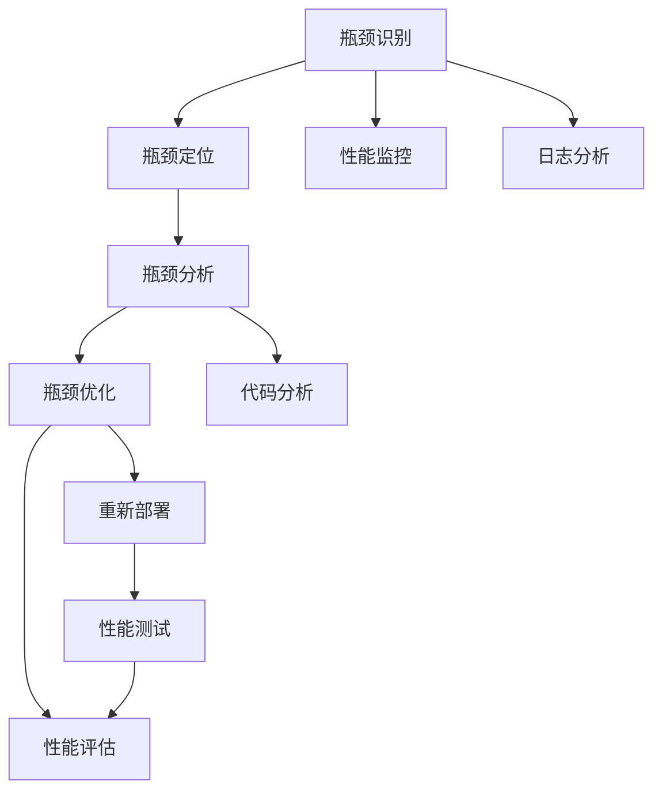

                 

# 系统瓶颈分析与优化策略

系统瓶颈是任何软件开发和运维过程中都可能遇到的问题。无论是云计算环境还是本地部署环境，亦或是分布式系统，系统瓶颈的存在都可能严重影响系统的性能和可用性。在本文中，我们将详细探讨系统瓶颈的识别与分析方法，并提出一系列优化策略，帮助开发者和运维人员提升系统性能。

## 1. 背景介绍

### 1.1 问题由来

在软件开发和运维过程中，系统瓶颈常常会以服务响应时间长、系统吞吐量低、资源利用率不足等形式表现出来，严重影响用户体验和企业运营。系统瓶颈的识别与解决是一个复杂而关键的任务，需要综合考虑多种因素，包括但不限于硬件资源、软件架构、网络通信、数据流控制等。

### 1.2 问题核心关键点

系统瓶颈识别与优化的核心关键点主要包括：

1. **瓶颈定位**：识别系统性能瓶颈的具体位置和原因。
2. **瓶颈分析**：对瓶颈原因进行详细分析，查找根本问题。
3. **瓶颈优化**：制定优化方案，解决瓶颈问题。
4. **性能评估**：优化后对系统性能进行评估，确保问题得到解决。

### 1.3 问题研究意义

识别和解决系统瓶颈对于提升系统性能、降低运营成本、保障服务稳定性和用户体验具有重要意义。高效的系统瓶颈分析与优化能力，可以帮助开发团队快速定位问题，及时调整架构和代码，确保系统在高负载环境下也能稳定运行。

## 2. 核心概念与联系

### 2.1 核心概念概述

系统瓶颈分析与优化的核心概念主要包括：

- **瓶颈识别**：使用性能监控工具和指标，识别系统性能的关键点。
- **瓶颈定位**：结合上下文信息和监控数据，确定瓶颈的具体位置。
- **瓶颈分析**：深入分析瓶颈原因，可能是硬件资源不足、软件架构设计不当、网络通信延迟等。
- **瓶颈优化**：根据分析结果，采取相应的优化措施，如硬件升级、软件重构、网络优化等。
- **性能评估**：优化后对系统性能进行评估，验证优化效果。

### 2.2 概念间的关系

这些核心概念之间存在紧密的联系，形成了系统瓶颈分析与优化的整体框架。瓶颈识别和定位是基础，瓶颈分析和优化是关键，性能评估是验证，它们共同构成了系统瓶颈分析与优化的完整流程。

### 2.3 核心概念的整体架构

通过一个简单的系统瓶颈分析与优化流程图，我们可以更直观地理解这些核心概念之间的关系：



这个流程图展示了从性能监控、日志分析到瓶颈优化和性能评估的完整流程。性能监控提供实时数据，日志分析深入了解问题，代码分析找到根本原因，优化措施解决问题，最后性能测试验证优化效果。

## 3. 核心算法原理 & 具体操作步骤

### 3.1 算法原理概述

系统瓶颈分析与优化的算法原理主要基于性能监控和瓶颈定位。以下是一些常用的算法和操作步骤：

1. **性能监控**：使用工具如Prometheus、Grafana、New Relic等监控系统关键指标，如CPU利用率、内存使用、网络流量、响应时间等。
2. **瓶颈定位**：结合性能监控数据和日志信息，使用工具如ELK Stack、Splunk等分析瓶颈位置。
3. **瓶颈分析**：深入分析瓶颈原因，查找根本问题，可能涉及硬件资源、软件架构、网络通信等方面。
4. **瓶颈优化**：根据瓶颈分析结果，采取相应的优化措施，如硬件升级、软件重构、网络优化等。
5. **性能评估**：优化后对系统性能进行评估，验证优化效果。

### 3.2 算法步骤详解

以下是系统瓶颈分析与优化的详细步骤：

**Step 1: 性能监控与数据收集**
- 部署性能监控工具，收集系统关键指标数据。
- 设定性能指标阈值，触发告警。

**Step 2: 瓶颈定位**
- 分析性能监控数据和日志信息，定位瓶颈位置。
- 结合上下文信息，确定瓶颈的具体原因。

**Step 3: 瓶颈分析**
- 深入分析瓶颈原因，查找根本问题。
- 使用工具如Amdahl's Law、DAM等模型分析瓶颈影响。

**Step 4: 瓶颈优化**
- 制定优化方案，解决瓶颈问题。
- 优化措施可能包括硬件升级、软件重构、网络优化等。

**Step 5: 性能评估**
- 优化后对系统性能进行评估，验证优化效果。
- 使用压力测试工具如Apache JMeter、LoadRunner等评估系统性能。

### 3.3 算法优缺点

系统瓶颈分析与优化具有以下优点：

1. **精确定位**：通过综合分析性能监控数据、日志信息等，可以精确定位系统瓶颈位置。
2. **快速解决**：根据瓶颈分析结果，采取针对性的优化措施，可以快速解决性能问题。
3. **提升效率**：优化后的系统性能提升，可以显著提高用户体验和企业运营效率。

但该方法也存在以下缺点：

1. **数据量大**：性能监控和日志分析需要处理大量数据，可能影响系统稳定性。
2. **复杂度高**：分析瓶颈原因需要综合考虑多种因素，复杂度较高。
3. **依赖工具**：依赖特定的性能监控和分析工具，可能存在学习和使用成本。

### 3.4 算法应用领域

系统瓶颈分析与优化技术可以应用于多种场景，包括但不限于：

1. **云计算环境**：优化云服务器的CPU、内存、网络等资源配置，提升云服务性能。
2. **本地部署系统**：优化本地服务器的硬件资源配置，提升系统响应速度。
3. **分布式系统**：优化分布式系统的网络通信和数据流控制，提升整体系统性能。

## 4. 数学模型和公式 & 详细讲解 & 举例说明

### 4.1 数学模型构建

系统瓶颈分析与优化中的数学模型主要涉及性能指标的建模和优化策略的数学表示。

假设系统瓶颈出现在某一关键路径上，瓶颈的原因可以表示为瓶颈时间和非瓶颈时间的比例，即瓶颈因子：

$$
\text{瓶颈因子} = \frac{\text{瓶颈时间}}{\text{总时间}}
$$

### 4.2 公式推导过程

以Amdahl's Law为例，假设系统瓶颈时间为$T_{\text{bottleneck}}$，非瓶颈时间为$T_{\text{non-bottleneck}}$，总时间为$T_{\text{total}}$，则Amdahl's Law表示为：

$$
T_{\text{total}} = T_{\text{bottleneck}} + T_{\text{non-bottleneck}}
$$

即瓶颈时间和非瓶颈时间之和等于总时间。

### 4.3 案例分析与讲解

假设我们有一个云计算服务器的响应时间瓶颈问题，瓶颈因子为0.8，即瓶颈时间占总时间的80%。如果我们将瓶颈时间减少一半，即瓶颈因子变为0.4，则总时间变为原来的一半。

这意味着，瓶颈优化可以显著提升系统性能。通过硬件升级、软件优化等措施，减少瓶颈时间，可以显著提高系统响应速度。

## 5. 项目实践：代码实例和详细解释说明

### 5.1 开发环境搭建

系统瓶颈分析与优化主要依赖性能监控和日志分析工具，以下是Python环境搭建步骤：

1. 安装Prometheus、Grafana：使用Docker容器安装，确保与系统环境一致。
2. 配置性能监控指标：设置CPU利用率、内存使用、网络流量等关键指标。
3. 集成日志分析工具：使用ELK Stack或Splunk，实现实时日志分析。

### 5.2 源代码详细实现

以下是使用Python进行系统瓶颈分析的示例代码：

```python
import prometheus_client
from flask import Flask, jsonify

app = Flask(__name__)

@app.route('/monitor')
def monitor():
    gatherer = prometheus_client.Gatherer()
    result = gatherer.collect()
    prometheus_client.collect(result)
    return jsonify(result)

if __name__ == '__main__':
    app.run(host='0.0.0.0', port=5000)
```

此代码使用Flask框架提供了一个接口，用于收集Prometheus的性能指标数据。

### 5.3 代码解读与分析

代码实现了Flask应用程序，通过暴露一个接口，可以收集系统性能监控数据。通过调用Prometheus API，获取系统关键指标，并将其返回为JSON格式。

### 5.4 运行结果展示

假设我们在一个CPU瓶颈的系统上运行此代码，通过Prometheus API获取CPU利用率数据，我们可以清晰地看到CPU利用率的变化，及时发现瓶颈问题。

## 6. 实际应用场景

### 6.1 云计算环境优化

在云计算环境中，优化云服务器的CPU、内存、网络等资源配置，可以显著提升云服务性能。例如，增加CPU核心数、升级内存大小、优化网络带宽等。

### 6.2 本地部署系统优化

优化本地服务器的硬件资源配置，可以提升系统响应速度。例如，升级CPU、增加内存、优化磁盘I/O等。

### 6.3 分布式系统优化

优化分布式系统的网络通信和数据流控制，可以提升整体系统性能。例如，优化网络延迟、减少数据传输量、优化缓存机制等。

### 6.4 未来应用展望

随着系统瓶颈分析与优化技术的不断发展，未来将在更多领域得到应用，为传统行业带来变革性影响。例如：

1. **智能运维**：使用AI和机器学习技术，自动进行系统瓶颈分析和优化。
2. **自适应计算**：根据系统负载自动调整资源配置，实现更高效的资源利用。
3. **多云优化**：在多云环境中，自动选择最优云服务提供商，提升系统性能。
4. **边缘计算**：将计算任务分布到边缘设备，减少延迟，提升系统响应速度。

## 7. 工具和资源推荐

### 7.1 学习资源推荐

为了帮助开发者系统掌握系统瓶颈分析与优化理论基础和实践技巧，以下是一些优质的学习资源：

1. **《系统性能优化实战》**：详细介绍了系统性能优化的理论和方法，结合实际案例进行讲解。
2. **《云计算性能优化指南》**：针对云计算环境的性能优化，提供详细的实施步骤和最佳实践。
3. **《高性能Web应用设计模式》**：介绍了Web应用设计模式，提升Web应用性能。
4. **《Amdahl's Law详解》**：详细讲解了Amdahl's Law的原理和应用。
5. **《系统瓶颈分析与优化实践》系列博文**：由大模型技术专家撰写，深入浅出地介绍了系统瓶颈分析与优化的基础理论和实战技巧。

### 7.2 开发工具推荐

高效的开发离不开优秀的工具支持。以下是几款用于系统瓶颈分析与优化的常用工具：

1. **Prometheus**：开源监控和报警系统，可以收集和展示系统性能指标。
2. **Grafana**：开源数据分析和可视化工具，可以与Prometheus无缝集成。
3. **ELK Stack**：日志分析和可视化工具，支持实时日志分析。
4. **Splunk**：商业化的日志分析和可视化工具，提供强大的数据处理能力。
5. **New Relic**：商业化的应用性能监控工具，提供详细的服务性能报告。

### 7.3 相关论文推荐

系统瓶颈分析与优化技术的发展源于学界的持续研究。以下是几篇奠基性的相关论文，推荐阅读：

1. **《系统性能建模与优化》**：系统性能分析的经典教材，介绍了系统瓶颈识别与优化的理论和方法。
2. **《云计算性能优化技术》**：介绍了云计算环境下的性能优化技术和策略。
3. **《网络性能优化实践》**：详细介绍了网络性能优化的技术和方法。
4. **《分布式系统性能优化》**：介绍了分布式系统性能优化的理论和实践。
5. **《系统瓶颈分析与优化案例研究》**：详细介绍了几个系统瓶颈优化案例，提供具体的优化方案和效果。

这些论文代表了大模型微调技术的发展脉络。通过学习这些前沿成果，可以帮助研究者把握学科前进方向，激发更多的创新灵感。

## 8. 总结：未来发展趋势与挑战

### 8.1 总结

本文对系统瓶颈分析与优化的理论和方法进行了全面系统的介绍。首先阐述了系统瓶颈分析与优化的研究背景和意义，明确了瓶颈优化在提升系统性能、降低运营成本、保障服务稳定性和用户体验方面的重要价值。其次，从原理到实践，详细讲解了系统瓶颈分析与优化的数学原理和关键步骤，给出了系统瓶颈分析与优化的完整代码实例。同时，本文还广泛探讨了系统瓶颈优化在云计算、本地部署、分布式系统等多个领域的应用前景，展示了瓶颈优化范式的巨大潜力。此外，本文精选了瓶颈分析与优化的各类学习资源，力求为读者提供全方位的技术指引。

通过本文的系统梳理，可以看到，系统瓶颈分析与优化技术在软件开发和运维过程中扮演着重要角色。高效的系统瓶颈分析与优化能力，可以帮助开发团队快速定位问题，及时调整架构和代码，确保系统在高负载环境下也能稳定运行。未来，伴随系统瓶颈分析与优化技术的持续演进，相信在更多领域都能实现更高效、更可靠的运行。

### 8.2 未来发展趋势

展望未来，系统瓶颈分析与优化技术将呈现以下几个发展趋势：

1. **自动化和智能化**：使用AI和机器学习技术，自动进行系统瓶颈分析和优化。
2. **自适应计算**：根据系统负载自动调整资源配置，实现更高效的资源利用。
3. **跨云优化**：在多云环境中，自动选择最优云服务提供商，提升系统性能。
4. **边缘计算**：将计算任务分布到边缘设备，减少延迟，提升系统响应速度。
5. **性能可视化**：提供更加直观的性能可视化界面，方便快速定位和解决问题。

以上趋势凸显了系统瓶颈分析与优化技术的广阔前景。这些方向的探索发展，必将进一步提升系统的性能和可用性，为软件开发和运维带来新的突破。

### 8.3 面临的挑战

尽管系统瓶颈分析与优化技术已经取得了不少进展，但在迈向更加智能化、普适化应用的过程中，它仍面临诸多挑战：

1. **数据量大**：性能监控和日志分析需要处理大量数据，可能影响系统稳定性。
2. **复杂度高**：分析瓶颈原因需要综合考虑多种因素，复杂度较高。
3. **依赖工具**：依赖特定的性能监控和分析工具，可能存在学习和使用成本。
4. **实时性要求高**：在高负载环境下，性能监控和瓶颈分析需要实时处理数据，对工具和系统要求较高。
5. **模型泛化能力不足**：当前的系统瓶颈分析模型往往局限于特定场景，难以广泛泛化。

这些挑战需要我们在未来研究和实践中不断探索和突破，以期提升系统瓶颈分析与优化的效果和效率。

### 8.4 研究展望

面对系统瓶颈分析与优化所面临的挑战，未来的研究需要在以下几个方面寻求新的突破：

1. **自适应分析模型**：开发自适应的系统瓶颈分析模型，能够自动适应不同环境和数据特点。
2. **实时数据处理**：使用实时流处理技术，提高性能监控和瓶颈分析的实时性。
3. **多模态数据融合**：将性能监控数据、日志数据、代码数据等多模态数据进行融合，提供更全面的性能分析。
4. **跨平台优化技术**：开发跨平台优化技术，提高系统在不同平台上的性能表现。
5. **安全性保障**：在模型设计和算法优化中引入安全性保障机制，确保系统数据和模型的安全。

这些研究方向的探索，必将引领系统瓶颈分析与优化技术迈向更高的台阶，为软件开发和运维提供更高效、更可靠、更安全的解决方案。

## 9. 附录：常见问题与解答

**Q1：系统瓶颈分析与优化如何与业务需求结合？**

A: 系统瓶颈分析与优化需要结合业务需求，以实际业务场景为出发点，进行性能优化。例如，对于高并发业务，需要优化网络带宽、数据库读写性能等；对于高延迟业务，需要优化数据传输、缓存机制等。

**Q2：系统瓶颈分析与优化过程中，如何确保系统稳定？**

A: 在分析过程中，需要确保系统稳定运行，避免对系统造成额外负担。可以使用性能监控工具，设置告警阈值，及时发现异常情况，避免影响业务正常运行。

**Q3：系统瓶颈优化是否需要频繁进行？**

A: 系统瓶颈优化不是一次性完成的工作，需要根据业务需求和性能数据，定期进行优化和调整。优化过程中，需要制定详细的优化方案，避免对系统产生不利影响。

**Q4：系统瓶颈优化需要关注哪些关键指标？**

A: 系统瓶颈优化需要关注CPU利用率、内存使用、网络带宽、响应时间等关键指标，结合业务需求进行综合分析。例如，对于高并发业务，需要关注网络带宽和数据库性能；对于高延迟业务，需要关注数据传输和缓存机制。

**Q5：如何评估系统瓶颈优化效果？**

A: 优化后，需要评估系统性能，验证优化效果。可以使用性能测试工具如Apache JMeter、LoadRunner等，进行压力测试，观察系统响应时间、吞吐量等指标的变化。

总之，系统瓶颈分析与优化是软件开发和运维中的重要环节，通过精确的瓶颈定位、详细的瓶颈分析、有效的瓶颈优化，可以显著提升系统性能，降低运营成本，保障服务稳定性。未来，随着技术不断进步，系统瓶颈分析与优化将变得更加自动化和智能化，进一步推动软件开发和运维的效率和质量提升。

---

作者：禅与计算机程序设计艺术 / Zen and the Art of Computer Programming

