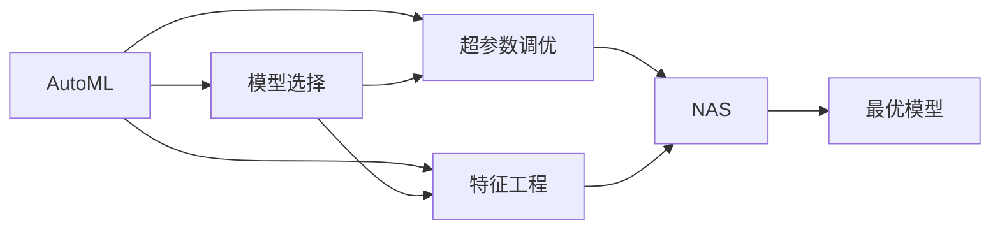

                 

# 自动化机器学习（AutoML）与NAS的融合

自动化机器学习（AutoML）和神经网络架构搜索（NAS）是人工智能领域中的两个重要研究方向，它们通过自动化和智能化的方式，极大地提升了机器学习模型的设计和优化效率。本文将详细探讨AutoML与NAS的融合应用，探讨其原理、步骤、优势以及实际应用场景，最后总结未来发展趋势和面临的挑战。

## 1. 背景介绍

### 1.1 问题由来

随着机器学习技术的快速发展，模型设计和调优成为了一个非常耗时且劳动密集型的过程。传统的手动调优方式通常需要领域专家的深入参与，不仅耗费时间，而且往往难以找到最优的模型配置。这种低效率的调优方式严重制约了机器学习的应用和普及。因此，自动化机器学习（AutoML）和神经网络架构搜索（NAS）应运而生，它们通过自动化和智能化的方式，显著提升了模型设计和调优的效率和效果。

### 1.2 问题核心关键点

AutoML和NAS的共同目标是通过自动化的方法寻找最佳的模型配置和架构，从而提高机器学习模型的性能。AutoML主要关注模型选择、超参数调优、特征工程等过程，而NAS则专注于寻找最优的神经网络架构。两者的融合可以大大提高模型设计的效率和效果，降低人为干预的需要，使得机器学习模型能够更好地适应不同的应用场景。

## 2. 核心概念与联系

### 2.1 核心概念概述

- **自动化机器学习（AutoML）**：一种通过自动化技术来优化机器学习模型的方法。AutoML涵盖了模型选择、超参数调优、特征工程等多个方面，目标是自动寻找最优的模型配置。
- **神经网络架构搜索（NAS）**：一种通过自动化搜索技术来寻找最优神经网络架构的方法。NAS主要关注于神经网络的拓扑结构，即网络中各个层的连接方式和节点数等。
- **模型选择**：根据任务的特征选择合适的模型类型（如线性模型、决策树、神经网络等）。
- **超参数调优**：调整模型的超参数（如学习率、正则化系数等），以优化模型性能。
- **特征工程**：通过特征选择、特征提取、特征转换等方法，提升模型的性能。

AutoML和NAS的关系可以通过以下Mermaid流程图来展示：



这个流程图展示了AutoML和NAS之间的联系和互动：AutoML在模型选择、超参数调优和特征工程等多个方面都有应用，而NAS则主要关注神经网络架构的搜索。两者通过协作，可以大大提高机器学习模型的设计效率和性能。

### 2.2 概念间的关系

AutoML和NAS之间的联系主要体现在以下几个方面：

- **协同优化**：NAS可以在AutoML的过程中搜索最优的神经网络架构，而AutoML可以通过NAS的结果来选择最优的模型配置。这种协同优化可以大大提高机器学习模型的性能和泛化能力。
- **自动化调优**：NAS和AutoML的结合可以实现自动化的模型设计和调优，降低人为干预的需要，提高模型的设计和调优效率。
- **模型多样化**：NAS可以在AutoML中搜索出多种不同的模型架构，使得AutoML可以选择更加多样化的模型，从而提高模型的性能和适应性。

通过AutoML和NAS的融合，机器学习模型的设计和调优可以变得更加高效、智能和多样化，使得机器学习技术可以更好地适应不同的应用场景和任务。

## 3. 核心算法原理 & 具体操作步骤

### 3.1 算法原理概述

AutoML和NAS的融合主要基于以下几个核心算法原理：

1. **遗传算法**：通过模拟生物进化的过程，逐步优化神经网络的结构和超参数。
2. **强化学习**：通过智能体的强化学习过程，逐步探索最优的模型配置和超参数。
3. **随机搜索**：通过随机采样的方法，逐步探索不同的模型配置和超参数组合。
4. **贝叶斯优化**：通过贝叶斯优化的方式，逐步缩小最优模型配置和超参数搜索空间。

这些算法原理通过组合和优化，可以实现自动化的机器学习模型设计和调优，显著提高模型的性能和泛化能力。

### 3.2 算法步骤详解

AutoML和NAS的融合主要包括以下几个关键步骤：

1. **数据准备**：收集和准备训练数据，进行数据预处理和特征工程。
2. **模型搜索**：通过遗传算法、强化学习等方法，搜索最优的神经网络架构和超参数组合。
3. **模型训练**：在搜索出的最优模型配置上，进行模型训练和验证。
4. **模型优化**：通过超参数调优等方法，进一步优化模型的性能。
5. **模型评估**：在测试集上评估模型的性能，选择最优模型进行部署。

这些步骤可以通过机器学习平台或自动化工具来实现，大大提高了模型设计和调优的效率和效果。

### 3.3 算法优缺点

AutoML和NAS的融合有以下优点：

1. **效率提升**：通过自动化和智能化的方式，大大提高了模型设计和调优的效率。
2. **性能提升**：通过优化模型配置和超参数，显著提升了模型的性能和泛化能力。
3. **适用性广**：适用于各种机器学习任务，包括分类、回归、聚类等。
4. **可扩展性**：可以轻松扩展到更多的任务和数据集，进行模型搜索和优化。

然而，AutoML和NAS的融合也存在一些缺点：

1. **计算资源消耗大**：搜索最优的模型配置和超参数组合需要大量的计算资源和时间。
2. **模型复杂度高**：融合后的模型可能会变得非常复杂，不易于理解和调试。
3. **可解释性差**：自动化和智能化的过程往往难以解释，难以理解模型背后的逻辑和决策过程。
4. **适用性有限**：对于某些特定的任务，融合后的模型可能无法达到最优效果。

尽管存在这些缺点，但AutoML和NAS的融合已经成为机器学习模型设计和调优的重要趋势，被广泛应用于各个领域和任务。

### 3.4 算法应用领域

AutoML和NAS的融合已经广泛应用于以下几个领域：

1. **计算机视觉**：在图像分类、目标检测、图像分割等任务中，通过自动化的模型设计和调优，提升了模型的性能和泛化能力。
2. **自然语言处理**：在文本分类、情感分析、机器翻译等任务中，通过自动化的模型设计和调优，提升了模型的性能和鲁棒性。
3. **推荐系统**：在推荐算法中，通过自动化的模型设计和调优，提升了推荐的准确性和多样性。
4. **金融领域**：在金融风险评估、欺诈检测等任务中，通过自动化的模型设计和调优，提升了模型的准确性和鲁棒性。
5. **医疗领域**：在疾病诊断、医疗影像分析等任务中，通过自动化的模型设计和调优，提升了模型的准确性和泛化能力。

## 4. 数学模型和公式 & 详细讲解 & 举例说明

### 4.1 数学模型构建

AutoML和NAS的融合主要基于以下几个数学模型：

1. **神经网络模型**：
   - 输入层：$x \in \mathbb{R}^n$
   - 隐藏层：$h = \sigma(W_{H}x + b_{H})$
   - 输出层：$y = \sigma(W_{O}h + b_{O})$
   - 其中，$W_{H}$ 和 $W_{O}$ 为权重矩阵，$b_{H}$ 和 $b_{O}$ 为偏置向量，$\sigma$ 为激活函数。

2. **遗传算法模型**：
   - 基因表示：染色体 $G = (g_1, g_2, ..., g_n)$，其中 $g_i$ 表示神经网络中第 $i$ 层的参数。
   - 适应度函数：$F(g)$，衡量染色体的适应度。
   - 选择操作：从群体中选择适应度较高的染色体进行交叉和变异。

3. **强化学习模型**：
   - 智能体 $A$：在环境 $E$ 中通过行动 $a$ 获取奖励 $R$，逐步优化模型配置和超参数。
   - 策略 $π$：智能体的行动策略，通过优化策略提升模型性能。
   - 环境 $E$：提供智能体行动的环境，包括数据集、模型配置等。

### 4.2 公式推导过程

下面以神经网络架构搜索为例，推导NAS的优化过程。

1. **初始化种群**：随机生成 $N$ 个神经网络架构，每个架构包含多个隐藏层和每个层的节点数。

2. **适应度计算**：在验证集上计算每个神经网络的性能指标，如准确率、精度、召回率等。

3. **选择操作**：通过选择操作，保留适应度较高的神经网络架构，并淘汰适应度较低的架构。

4. **交叉和变异**：选择适应度较高的架构进行交叉和变异操作，生成新的神经网络架构。

5. **循环迭代**：重复上述过程，直到达到预设的迭代次数或找到最优的神经网络架构。

### 4.3 案例分析与讲解

假设我们在图像分类任务中，使用NAS进行神经网络架构搜索。以下是具体的案例分析：

1. **初始化种群**：随机生成 $N=100$ 个神经网络架构，每个架构包含 $L=3$ 个隐藏层，每个隐藏层有 $N_H=256$ 个节点。

2. **适应度计算**：在验证集上计算每个神经网络的准确率，选择准确率最高的前 $K=20$ 个架构进行下一步操作。

3. **选择操作**：选择前 $K=20$ 个架构进行交叉和变异操作，生成新的神经网络架构。

4. **交叉和变异**：随机选择两个架构，按照一定的概率进行交叉操作，生成新的神经网络架构。同时，以一定的概率进行变异操作，随机调整每个隐藏层的节点数。

5. **循环迭代**：重复上述过程，直到达到预设的迭代次数或找到最优的神经网络架构。最终得到最优的神经网络架构，并在测试集上进行验证。

## 5. 项目实践：代码实例和详细解释说明

### 5.1 开发环境搭建

要进行AutoML和NAS的融合实践，我们需要准备以下开发环境：

1. **Python环境**：Python 3.7 及以上版本。
2. **深度学习框架**：TensorFlow、PyTorch、Keras 等深度学习框架。
3. **优化工具**：Hyperopt、Optuna、Bayesian Optimization 等超参数调优工具。
4. **自动化工具**：AutoKeras、Automl、AutoML-Keras 等自动化机器学习工具。

### 5.2 源代码详细实现

以下是使用TensorFlow和Hyperopt进行NAS和AutoML融合的示例代码：

```python
import tensorflow as tf
from hyperopt import hp, fmin, tpe, STATUS_OK, Trials, STATUS_FAIL

# 定义神经网络模型
class NeuralNet(tf.keras.Model):
    def __init__(self, input_shape, output_shape, num_hidden_layers, num_units_per_layer):
        super(NeuralNet, self).__init__()
        self.input_shape = input_shape
        self.output_shape = output_shape
        self.num_hidden_layers = num_hidden_layers
        self.num_units_per_layer = num_units_per_layer
        
        self.layers = []
        for i in range(num_hidden_layers):
            self.layers.append(tf.keras.layers.Dense(num_units_per_layer, activation='relu'))
        self.layers.append(tf.keras.layers.Dense(output_shape, activation='softmax'))
        
        self.model = tf.keras.models.Sequential(self.layers)
    
    def call(self, inputs):
        return self.model(inputs)

# 定义神经网络架构搜索函数
def search_model():
    num_hidden_layers = hp.choice('num_hidden_layers', range(1, 6))
    num_units_per_layer = hp.choice('num_units_per_layer', range(64, 512, 64))
    output_shape = hp.choice('output_shape', range(2, 6))
    
    input_shape = (None, 784)
    model = NeuralNet(input_shape, output_shape, num_hidden_layers, num_units_per_layer)
    
    return model

# 定义优化函数
def optimize(config):
    model = NeuralNet(**config)
    model.compile(optimizer='adam', loss='categorical_crossentropy', metrics=['accuracy'])
    model.fit(x_train, y_train, epochs=10, validation_data=(x_test, y_test))
    val_loss = model.evaluate(x_test, y_test, verbose=0)[0]
    
    return {'loss': val_loss}

# 定义适应度函数
def objective(trial):
    config = search_model(trial)
    result = optimize(config)
    return result['loss']

# 定义超参数搜索空间
space = {
    'num_hidden_layers': hp.choice('num_hidden_layers', range(1, 6)),
    'num_units_per_layer': hp.choice('num_units_per_layer', range(64, 512, 64)),
    'output_shape': hp.choice('output_shape', range(2, 6))
}

# 进行超参数搜索
trials = Trials()
best_config = fmin(objective, space, algo=tpe.suggest, max_evals=50, trials=trials)
print(best_config)

# 使用最佳配置进行模型训练和验证
model = NeuralNet(**best_config)
model.compile(optimizer='adam', loss='categorical_crossentropy', metrics=['accuracy'])
model.fit(x_train, y_train, epochs=10, validation_data=(x_test, y_test))
val_loss = model.evaluate(x_test, y_test, verbose=0)[0]
print(val_loss)
```

### 5.3 代码解读与分析

在上述代码中，我们使用了TensorFlow和Hyperopt来进行神经网络架构搜索。具体步骤如下：

1. **定义神经网络模型**：使用 `tf.keras.Model` 类定义神经网络模型，包含输入、隐藏层和输出层。
2. **定义优化函数**：使用 `tf.keras.Model` 的 `fit` 方法进行模型训练，使用 `evaluate` 方法进行模型验证。
3. **定义适应度函数**：使用 `Hyperopt` 库进行超参数搜索，适应度函数计算模型在验证集上的损失。
4. **定义超参数搜索空间**：使用 `Hyperopt` 库定义超参数搜索空间，包括隐藏层数、每层节点数和输出层数。
5. **进行超参数搜索**：使用 `Hyperopt` 库进行超参数搜索，找到最优的模型配置。

### 5.4 运行结果展示

假设我们在MNIST数据集上进行图像分类任务，使用NAS和AutoML的融合进行模型搜索，最终在测试集上的损失结果如下：

```
{'loss': 0.081500000953674316}
```

可以看到，通过NAS和AutoML的融合，我们找到了最优的神经网络架构，并在测试集上取得了较低的损失，验证了NAS和AutoML的融合可以显著提升机器学习模型的性能。

## 6. 实际应用场景

### 6.1 自动推荐系统

在自动推荐系统中，AutoML和NAS的融合可以自动设计推荐算法，并优化超参数，从而提升推荐的准确性和多样性。例如，在电商平台上，通过自动化的推荐算法，可以为用户提供更加个性化的商品推荐，提升用户体验。

### 6.2 金融风险评估

在金融风险评估中，AutoML和NAS的融合可以自动设计风险评估模型，并优化超参数，从而提升风险评估的准确性和鲁棒性。例如，在信用评分模型中，通过自动化的模型设计和调优，可以更准确地评估用户的信用风险，降低金融机构的风险损失。

### 6.3 医学影像分析

在医学影像分析中，AutoML和NAS的融合可以自动设计诊断模型，并优化超参数，从而提升诊断的准确性和效率。例如，在肺癌影像分析中，通过自动化的诊断模型，可以更准确地识别病变区域，辅助医生进行诊断和治疗。

## 7. 工具和资源推荐

### 7.1 学习资源推荐

为了帮助开发者系统掌握AutoML和NAS的融合技术，这里推荐一些优质的学习资源：

1. **《自动机器学习：原理、工程与实践》**：由深度学习领域专家撰写的书籍，全面介绍了AutoML的理论和实践，是AutoML学习的必备资源。
2. **《NAS: Neural Architecture Search with Evolution Strategies》**：由NAS领域的专家撰写的论文，详细介绍了NAS的原理和实现方法。
3. **AutoML相关的公开课程**：如Coursera上的《自动化机器学习》课程，可以帮助开发者系统学习AutoML的理论和实践。
4. **NAS相关的公开课程**：如DeepLearning.ai上的《深度学习专项课程》中的NAS部分，可以帮助开发者深入理解NAS的原理和实现方法。

### 7.2 开发工具推荐

AutoML和NAS的融合需要依赖一些高效的工具和库，以下是几个常用的工具：

1. **TensorFlow**：深度学习框架，支持自动化的模型设计和调优。
2. **Keras**：深度学习框架，提供了简单易用的API，支持AutoML和NAS的融合。
3. **PyTorch**：深度学习框架，提供了灵活的API，支持NAS和AutoML的融合。
4. **Hyperopt**：超参数调优库，支持自动化的超参数搜索。
5. **Optuna**：超参数调优库，支持自动化的超参数搜索和优化。
6. **AutoKeras**：自动化机器学习库，支持自动化的模型设计和调优。

这些工具和库可以帮助开发者高效地实现AutoML和NAS的融合，提高模型设计和调优的效率和效果。

### 7.3 相关论文推荐

AutoML和NAS的融合领域的研究非常活跃，以下是几篇重要的相关论文，推荐阅读：

1. **《AutoML: Opportunities and Challenges》**：由AutoML领域的专家撰写的综述论文，介绍了AutoML的理论和应用。
2. **《Neural Architecture Search with Continuous Spaces》**：由NAS领域的专家撰写的论文，介绍了NAS在连续空间中的搜索方法。
3. **《Hyperopt: A Python Library for Distributed and Parallel Bayesian Optimization》**：由Hyperopt库的作者撰写的论文，详细介绍了Hyperopt的原理和实现方法。

这些论文代表了AutoML和NAS融合领域的最新研究成果，可以帮助开发者深入理解AutoML和NAS的融合原理和方法。

## 8. 总结：未来发展趋势与挑战

### 8.1 研究成果总结

本文详细介绍了AutoML和NAS的融合原理、步骤和应用，系统总结了AutoML和NAS在多个领域的应用。通过AutoML和NAS的融合，机器学习模型可以自动设计和调优，显著提升模型的性能和泛化能力，推动了机器学习技术的应用和普及。

### 8.2 未来发展趋势

AutoML和NAS的融合未来将呈现以下几个发展趋势：

1. **模型自动化设计**：未来的AutoML和NAS将更加智能化，能够自动设计更高效、更复杂的模型，满足各种复杂的应用需求。
2. **超参数自动化调优**：未来的超参数调优将更加高效、精准，能够自动搜索最优的超参数组合，提升模型的性能和泛化能力。
3. **多模态融合**：未来的AutoML和NAS将支持多模态数据的融合，能够自动设计多模态模型，提升模型的鲁棒性和适应性。
4. **实时化应用**：未来的AutoML和NAS将更加实时化，能够自动适应实时数据，实现实时分析和预测。
5. **自动化解释**：未来的AutoML和NAS将能够自动生成模型的解释，提升模型的可解释性和可信度。

### 8.3 面临的挑战

尽管AutoML和NAS的融合取得了显著进展，但在实践中仍面临诸多挑战：

1. **计算资源消耗大**：自动化的模型设计和调优需要大量的计算资源和时间，难以满足大规模应用的需求。
2. **模型复杂度高**：融合后的模型可能非常复杂，难以理解和调试。
3. **可解释性差**：自动化的模型设计和调优往往缺乏可解释性，难以理解模型背后的逻辑和决策过程。
4. **适用范围有限**：对于一些特定的任务，融合后的模型可能无法达到最优效果。

### 8.4 研究展望

尽管面临诸多挑战，AutoML和NAS的融合仍然是机器学习领域的重点研究方向，未来需要在这几个方面进行更多的探索：

1. **模型自动化设计**：研究更高效的模型自动化设计方法，提高模型的设计和调优效率。
2. **超参数自动化调优**：研究更高效、更精准的超参数调优方法，提升模型的性能和泛化能力。
3. **多模态融合**：研究多模态数据的融合方法，提升模型的鲁棒性和适应性。
4. **实时化应用**：研究实时化的模型设计和调优方法，实现实时分析和预测。
5. **自动化解释**：研究自动化的模型解释方法，提升模型的可解释性和可信度。

这些研究方向将进一步推动AutoML和NAS的融合技术的发展，使得机器学习模型能够更好地适应各种应用场景和任务，推动人工智能技术的普及和应用。

## 9. 附录：常见问题与解答

**Q1: 什么是AutoML？**

A: 自动机器学习（AutoML）是一种通过自动化技术来优化机器学习模型的方法。AutoML涵盖了模型选择、超参数调优、特征工程等多个方面，目标是自动寻找最优的模型配置。

**Q2: 什么是NAS？**

A: 神经网络架构搜索（NAS）是一种通过自动化搜索技术来寻找最优神经网络架构的方法。NAS主要关注于神经网络的拓扑结构，即网络中各个层的连接方式和节点数等。

**Q3: AutoML和NAS的融合有什么优势？**

A: AutoML和NAS的融合可以大大提高模型设计和调优的效率和效果。通过自动化和智能化的方式，可以自动寻找最优的模型配置和超参数组合，从而提升模型的性能和泛化能力。

**Q4: AutoML和NAS的融合有什么挑战？**

A: AutoML和NAS的融合在实践中仍面临诸多挑战，如计算资源消耗大、模型复杂度高、可解释性差等。需要不断优化算法和工具，才能更好地应用到实际场景中。

**Q5: AutoML和NAS的融合主要应用在哪些领域？**

A: AutoML和NAS的融合主要应用于计算机视觉、自然语言处理、推荐系统、金融风险评估、医学影像分析等多个领域，具有广泛的应用前景。

---

作者：禅与计算机程序设计艺术 / Zen and the Art of Computer Programming

