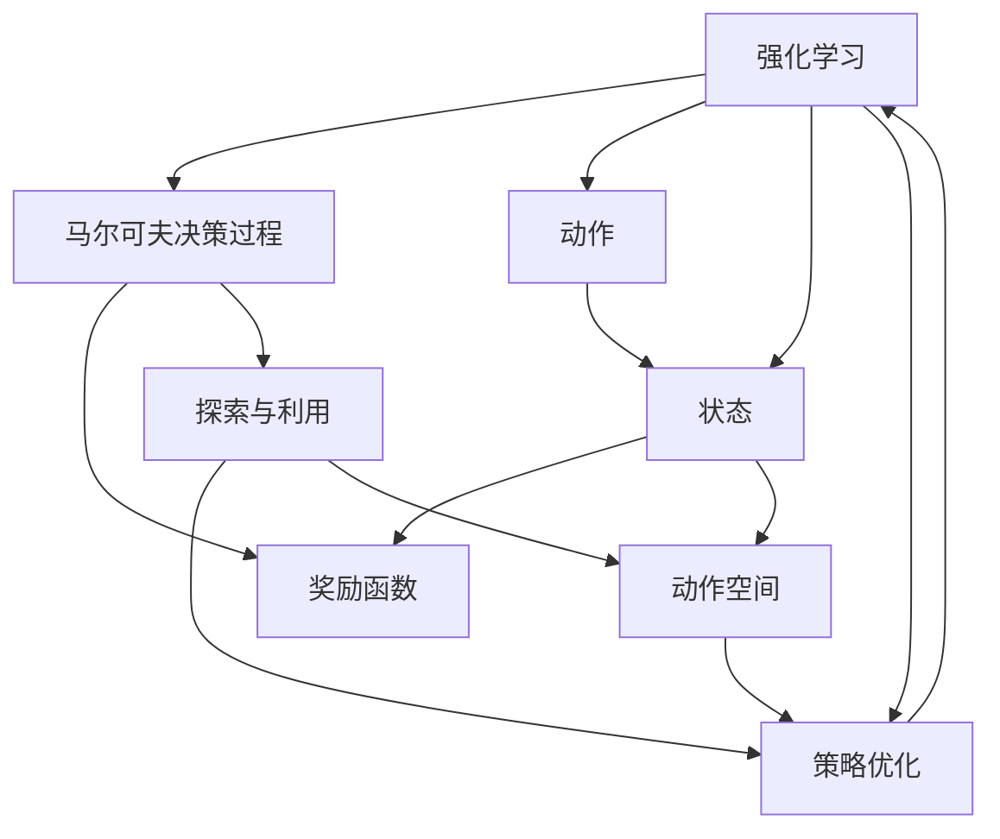
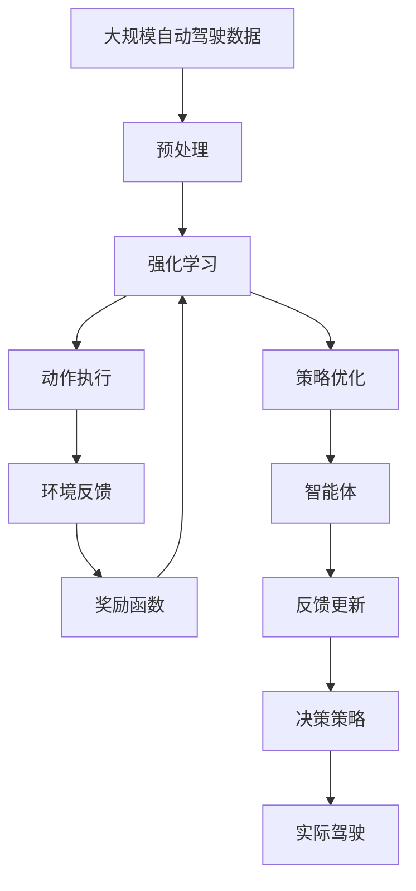

                 

# 自动驾驶中的强化学习方法

## 1. 背景介绍

### 1.1 问题由来
自动驾驶技术的发展一直是人工智能领域的重要研究课题。与传统的人类驾驶相比，自动驾驶要求车辆在复杂的道路环境中，通过传感器、摄像头等设备获取实时数据，通过计算机视觉、路径规划等技术，实现自主驾驶。强化学习（Reinforcement Learning, RL）作为人工智能的重要分支，为自动驾驶提供了新的解决思路。

强化学习通过智能体（agent）在环境中不断尝试并积累经验，逐步优化策略以实现特定目标。在自动驾驶中，智能体（通常是车辆）通过执行一系列驾驶动作（如加速、转向、刹车），最大化期望奖励（如安全、舒适、高效），同时避免惩罚（如碰撞、超速、违规）。

强化学习在自动驾驶中的应用主要体现在路径规划、行为控制、传感器数据处理等方面。通过RL技术，智能体可以在复杂多变的驾驶环境中，学习到最优的驾驶策略，从而提高驾驶安全和效率。

### 1.2 问题核心关键点
强化学习在自动驾驶中的应用，关键在于如何将复杂、高维的驾驶场景转化为可学习的模型，以及如何设计合适的奖励函数和惩罚机制，使得智能体在训练过程中能够不断优化策略。

为了应对自动驾驶中的动态变化，强化学习需要设计具有灵活性和适应性的学习算法。此外，自动驾驶场景中存在大量不确定性和噪声，强化学习还需引入鲁棒性强的算法，避免模型在复杂的道路环境中失效。

### 1.3 问题研究意义
强化学习在自动驾驶中的应用，对于提升驾驶安全性、效率和舒适性具有重要意义：

1. **提升驾驶安全性**：强化学习通过优化驾驶策略，能够有效避免交通事故，提高行车安全。
2. **提高驾驶效率**：通过路径规划和行为控制，智能体能够找到最优行驶路径，减少拥堵和等待时间。
3. **改善驾驶体验**：强化学习能够学习到稳定的驾驶习惯，减少驾驶员的疲劳和压力。

此外，强化学习还能促进自动驾驶技术的普及和应用，加速传统行业向智能化的转型升级，为经济发展和社会进步提供新的驱动力。

## 2. 核心概念与联系

### 2.1 核心概念概述

为了更好地理解强化学习在自动驾驶中的应用，本节将介绍几个关键概念：

- **强化学习**：通过智能体在环境中执行动作并积累经验，逐步优化策略以实现特定目标的机器学习方法。
- **马尔可夫决策过程**：描述智能体在环境中执行动作并接收状态反馈的过程，是强化学习的基本模型。
- **动作和状态**：智能体的行为（如加速、转向、刹车）和所处环境的状态（如道路、交通信号、车辆位置）。
- **奖励函数**：智能体执行动作后，环境对其行为的评估，用于引导智能体学习最优策略。
- **探索和利用**：智能体在实际执行动作前，需平衡探索新策略和利用已有经验，以达到最佳学习效果。
- **策略优化**：通过强化学习算法，智能体逐步优化其执行动作的策略，以最大化期望奖励。
- **动作空间和状态空间**：智能体可执行的动作和环境的状态空间，决定了强化学习的复杂度。

这些核心概念构成了强化学习的基础，并通过以下Mermaid流程图展示它们之间的关系：



通过这张图，我们可以清晰地看到，强化学习通过智能体在环境中的动作执行，不断积累经验，并利用奖励函数和探索与利用策略，优化动作执行策略。

### 2.2 概念间的关系

强化学习在自动驾驶中的应用，需要整合多个核心概念。以下是几个相关概念的进一步探讨：

- **动作空间和状态空间**：自动驾驶场景中，智能体（车辆）可执行的动作包括加速、转向、刹车等，而状态空间则包括道路状况、交通信号、车辆位置等。动作和状态空间的复杂度决定了强化学习算法的难度。
- **奖励函数**：在自动驾驶中，奖励函数需要综合考虑安全性、效率、舒适性等多方面因素，如避免碰撞、遵守交通规则、避免拥堵等。
- **探索和利用**：在自动驾驶中，智能体需要在新策略和老策略之间找到平衡，既要探索新的驾驶策略以适应复杂的道路环境，又要利用已有经验以确保安全和效率。

### 2.3 核心概念的整体架构

最后，我们用一个综合的流程图来展示这些核心概念在大规模强化学习应用中的整体架构：



这个流程图展示了从大规模数据预处理，到强化学习算法训练，再到智能体实际执行动作的全过程。

## 3. 核心算法原理 & 具体操作步骤
### 3.1 算法原理概述

强化学习在自动驾驶中的应用，核心在于设计合适的强化学习算法，使得智能体能够逐步优化其驾驶策略。常用的强化学习算法包括Q-Learning、策略梯度（Policy Gradient）、深度强化学习等。

Q-Learning是一种基于值函数的强化学习算法，通过学习动作值（Q值）函数，预测在当前状态下执行每个动作的期望奖励。其核心思想是通过不断更新Q值，逐步优化策略，最大化期望奖励。

策略梯度算法则直接优化策略函数，通过梯度上升或下降，调整策略参数，以最大化期望奖励。该算法更适合处理高维连续动作空间，但需要求解复杂的策略梯度。

深度强化学习将神经网络引入强化学习算法，通过学习动作值函数或策略函数，实现更高效的强化学习。深度Q-Network（DQN）和深度确定性策略梯度（DDPG）是其中的典型算法，分别适用于离散和连续动作空间。

### 3.2 算法步骤详解

以下是基于深度强化学习的自动驾驶强化学习算法（如DQN）的详细步骤：

**Step 1: 环境搭建**

1. 收集大规模自动驾驶数据集，包括道路场景、车辆行为、传感器数据等。
2. 预处理数据，将其转化为模型可接受的格式，如将图像转换为张量，将标签编码为数字。

**Step 2: 模型选择**

1. 选择合适的深度神经网络架构，如CNN、RNN、LSTM等，用于提取特征。
2. 确定动作空间和状态空间，选择合适的神经网络层数和节点数，以适应复杂度。

**Step 3: 模型训练**

1. 设计奖励函数，综合考虑安全性、效率、舒适性等因素，如避免碰撞、遵守交通规则、避免拥堵等。
2. 定义智能体的动作执行函数，选择合适的动作策略。
3. 设置训练参数，如学习率、批大小、训练轮数等。
4. 进行模型训练，通过反向传播算法更新模型参数，最小化期望奖励与实际奖励的差距。

**Step 4: 策略优化**

1. 通过Q-Learning或策略梯度算法，逐步优化动作值函数或策略函数。
2. 引入经验回放（Experience Replay）技术，从历史经验中采样数据，减少方差，提高模型稳定性。
3. 应用目标网络（Target Network）技术，将当前网络与目标网络结合，保证模型更新稳定。

**Step 5: 测试与部署**

1. 在验证集上评估训练后的模型，检验其性能。
2. 将模型部署到实际驾驶场景中，实时调整策略，优化驾驶行为。
3. 通过实际驾驶数据不断反馈，进一步优化模型参数。

### 3.3 算法优缺点

强化学习在自动驾驶中的应用，具有以下优点：

1. **适应性强**：强化学习能够应对复杂的道路环境和多变的情况，逐步优化驾驶策略，提高适应性和鲁棒性。
2. **实时优化**：强化学习通过不断积累经验，实时调整策略，能够快速适应新的驾驶场景。
3. **数据利用率高**：强化学习能够高效利用大规模自动驾驶数据，快速提升模型性能。

同时，强化学习也存在一些缺点：

1. **训练时间长**：强化学习需要大量时间进行训练，尤其是在高维、复杂的自动驾驶场景中。
2. **数据需求大**：强化学习需要大规模的标注数据，而自动驾驶场景中，高质量标注数据的获取成本较高。
3. **安全风险**：在实际驾驶中，强化学习模型的决策可能存在安全风险，需要进行严格的测试和验证。

### 3.4 算法应用领域

强化学习在自动驾驶中的应用领域十分广泛，包括但不限于以下几个方面：

- **路径规划**：通过优化驾驶策略，智能体能够找到最优的行驶路径，避免拥堵和违规。
- **行为控制**：智能体能够根据实时环境反馈，动态调整加速、转向、刹车等动作，提高行车安全和效率。
- **传感器数据处理**：智能体能够通过处理摄像头、雷达等传感器数据，实时感知周围环境，做出合理决策。
- **环境感知**：智能体能够学习到环境中的重要特征，如道路标志、交通信号等，提高对复杂环境的理解能力。
- **目标检测**：智能体能够学习到目标检测方法，实时识别和跟踪行人、车辆等交通参与者，确保行车安全。

## 4. 数学模型和公式 & 详细讲解

### 4.1 数学模型构建

强化学习的数学模型基于马尔可夫决策过程（MDP），包含状态空间 $S$、动作空间 $A$、状态转移概率 $P(s'|s,a)$、奖励函数 $R(s,a)$ 和策略 $\pi(a|s)$。

- $S$：环境中的所有可能状态，如车辆位置、道路状况等。
- $A$：智能体可执行的所有动作，如加速、转向、刹车等。
- $P(s'|s,a)$：给定状态 $s$ 和动作 $a$，环境转移到下一个状态 $s'$ 的概率。
- $R(s,a)$：给定状态 $s$ 和动作 $a$，智能体获得的奖励。
- $\pi(a|s)$：智能体在状态 $s$ 下执行动作 $a$ 的概率。

强化学习的目标是最大化长期累积奖励，即：

$$
\max_{\pi} \mathbb{E}_{s_0}[\sum_{t=0}^{\infty} \gamma^t R(s_t,a_t)]
$$

其中 $\gamma$ 为折扣因子，$R(s_t,a_t)$ 为当前状态下执行动作后的奖励，$(s_t,a_t)$ 为状态和动作序列。

### 4.2 公式推导过程

以Q-Learning算法为例，推导其核心公式：

假设智能体在状态 $s_t$ 下执行动作 $a_t$，获得奖励 $r_{t+1}$，并转移到下一个状态 $s_{t+1}$。其Q值函数 $Q(s_t,a_t)$ 定义为：

$$
Q(s_t,a_t) = r_t + \gamma \max_{a} Q(s_{t+1},a)
$$

该公式表示在状态 $s_t$ 下执行动作 $a_t$ 的Q值，等于即时奖励 $r_t$ 加上未来状态 $s_{t+1}$ 的Q值。

在实际应用中，Q值函数通常通过神经网络来学习，其输出为在当前状态下执行每个动作的Q值。Q-Learning通过不断更新Q值函数，逐步优化策略。其更新公式为：

$$
Q(s_t,a_t) \leftarrow Q(s_t,a_t) + \alpha [r_{t+1} + \gamma \max_{a} Q(s_{t+1},a) - Q(s_t,a_t)]
$$

其中 $\alpha$ 为学习率，$Q(s_t,a_t)$ 为当前状态和动作的Q值，$r_{t+1}$ 为即时奖励，$\max_{a} Q(s_{t+1},a)$ 为未来状态的最大Q值，$\gamma$ 为折扣因子。

### 4.3 案例分析与讲解

假设智能体在自动驾驶场景中执行如下动作序列：

1. 当前状态 $s_t$：车辆位于主道，直行状态。
2. 动作 $a_t$：加速，执行直行。
3. 奖励 $r_{t+1}$：获得交通信号绿光奖励0.5。
4. 下一个状态 $s_{t+1}$：车辆进入辅道，右转状态。

智能体当前状态的Q值函数输出为：

$$
Q(s_t,a_t) = Q(s_t,加速) = 0.5
$$

智能体执行动作后的状态转移为：

$$
P(s_{t+1}|s_t,加速) = 0.8
$$

智能体在下一个状态下的Q值函数输出为：

$$
Q(s_{t+1},右转) = 1.0
$$

智能体通过Q-Learning算法更新Q值函数：

$$
Q(s_t,加速) \leftarrow Q(s_t,加速) + \alpha [0.5 + \gamma \max_{a} Q(s_{t+1},a) - Q(s_t,加速)]
$$

$$
Q(s_t,加速) \leftarrow 0.5 + \alpha [0.5 + \gamma \times 1.0 - 0.5] = 0.5 + 0.1 \times (0.5 + 0.8 - 0.5) = 0.9
$$

通过不断更新Q值函数，智能体逐步优化其驾驶策略，以最大化期望奖励。

## 5. 项目实践：代码实例和详细解释说明

### 5.1 开发环境搭建

在进行自动驾驶强化学习项目实践前，我们需要准备好开发环境。以下是使用Python和PyTorch进行环境配置的步骤：

1. 安装Anaconda：从官网下载并安装Anaconda，用于创建独立的Python环境。

2. 创建并激活虚拟环境：
```bash
conda create -n autolearn-env python=3.8 
conda activate autolearn-env
```

3. 安装PyTorch：根据CUDA版本，从官网获取对应的安装命令。例如：
```bash
conda install pytorch torchvision torchaudio cudatoolkit=11.1 -c pytorch -c conda-forge
```

4. 安装Tensorboard：用于可视化模型训练过程和结果，便于调试和分析。
```bash
pip install tensorboard
```

5. 安装PyBullet：用于模拟自动驾驶环境，进行模型训练和测试。
```bash
pip install pybullet
```

完成上述步骤后，即可在`autolearn-env`环境中开始项目实践。

### 5.2 源代码详细实现

以下是使用PyTorch和PyBullet实现深度强化学习算法的代码实例，以DQN为例：

```python
import torch
import torch.nn as nn
import torch.optim as optim
import numpy as np
import pybullet
from collections import deque
from tensorboard import SummaryWriter

# 定义动作和状态空间
NUM_ACTIONS = 3
NUM_STATES = 10

# 定义Q网络
class QNetwork(nn.Module):
    def __init__(self, num_states, num_actions, hidden_size):
        super(QNetwork, self).__init__()
        self.fc1 = nn.Linear(num_states, hidden_size)
        self.fc2 = nn.Linear(hidden_size, num_actions)

    def forward(self, x):
        x = self.fc1(x)
        x = nn.functional.relu(x)
        x = self.fc2(x)
        return x

# 定义经验回放
class ReplayMemory:
    def __init__(self, capacity):
        self.capacity = capacity
        self.buffer = deque(maxlen=capacity)

    def add(self, transition):
        self.buffer.append(transition)

    def sample(self, batch_size):
        return np.random.choice(self.buffer, batch_size)

# 定义智能体
class Agent:
    def __init__(self, num_states, num_actions, hidden_size, gamma, learning_rate):
        self.num_states = num_states
        self.num_actions = num_actions
        self.hidden_size = hidden_size
        self.gamma = gamma
        self.learning_rate = learning_rate
        self.q_network = QNetwork(num_states, num_actions, hidden_size)
        self.target_q_network = QNetwork(num_states, num_actions, hidden_size)
        self.target_q_network.load_state_dict(self.q_network.state_dict())
        self.optimizer = optim.Adam(self.q_network.parameters(), lr=learning_rate)
        self.memory = ReplayMemory(capacity=10000)

    def choose_action(self, state):
        state = torch.FloatTensor(state).unsqueeze(0)
        q_values = self.q_network(state)
        action_values = q_values.data.numpy()[0]
        action = np.argmax(action_values)
        return action

    def update(self, state, action, reward, next_state, done):
        transition = (state, action, reward, next_state, done)
        self.memory.add(transition)

        if len(self.memory) > self.memory.capacity:
            transitions = self.memory.sample(32)
            states = torch.FloatTensor(np.vstack([t[0] for t in transitions]))
            actions = torch.LongTensor(np.vstack([t[1] for t in transitions]))
            rewards = torch.FloatTensor(np.vstack([t[2] for t in transitions]))
            next_states = torch.FloatTensor(np.vstack([t[3] for t in transitions]))
            dones = torch.FloatTensor(np.vstack([t[4] for t in transitions]))

            q_values_next = self.target_q_network(next_states).detach()
            q_values_next = q_values_next.max(1, keepdim=True)[0].unsqueeze(1)
            q_values = self.q_network(states).gather(1, actions)

            targets = rewards + self.gamma * q_values_next * (1 - dones)

            loss = nn.MSELoss()(targets, q_values)
            self.optimizer.zero_grad()
            loss.backward()
            self.optimizer.step()

            self.target_q_network.load_state_dict(self.q_network.state_dict())

    def learn(self):
        if len(self.memory) < 4:
            return
        transitions = self.memory.sample(32)
        states = torch.FloatTensor(np.vstack([t[0] for t in transitions]))
        actions = torch.LongTensor(np.vstack([t[1] for t in transitions]))
        rewards = torch.FloatTensor(np.vstack([t[2] for t in transitions]))
        next_states = torch.FloatTensor(np.vstack([t[3] for t in transitions]))
        dones = torch.FloatTensor(np.vstack([t[4] for t in transitions]))

        q_values_next = self.target_q_network(next_states).detach()
        q_values_next = q_values_next.max(1, keepdim=True)[0].unsqueeze(1)
        q_values = self.q_network(states).gather(1, actions)

        targets = rewards + self.gamma * q_values_next * (1 - dones)

        loss = nn.MSELoss()(targets, q_values)
        self.optimizer.zero_grad()
        loss.backward()
        self.optimizer.step()

        self.target_q_network.load_state_dict(self.q_network.state_dict())

# 定义自动驾驶环境
def setup_environment():
    pybullet.resetSimulation()
    pybullet.setGravity(0, 0, -9.8)
    pybullet.setCollisionFilterMode(1, -1)
    pybullet.setCollisionFlags(1, pybullet.CollisionFlags.CFG_SCENE查询，pybullet.CollisionFlags.CFG_SCENE查询)

    pybullet.loadURDF('car.urdf', 1, -1)
    pybullet.setLightColor(0.2, 0.2, 0.2)
    pybullet.setLightIntensity(0.6)

    car_base_pos = np.array([0, 0, 0.2])
    pybullet.resetBasePositionAndOrientation(car_base_pos, pybullet.getQuaternionFromEuler([0, 0, 0]))
    car_base_time_step = 1000

    car = pybullet.getPhysicsSimulationState()[0]

    return car

# 定义环境感知函数
def get_state(car):
    state = []
    state.append(car.position())
    state.append(car.angularVelocity())
    state.append(car.angularMotion())
    return state

# 定义动作执行函数
def perform_action(car, action):
    if action == 0:  # 加速
        pybullet.setVehicleControl(car, 0, 0, 0, 0, 0, 0)
    elif action == 1:  # 转向左
        pybullet.setVehicleControl(car, 0, 0, 0, 0, -0.5, 0)
    elif action == 2:  # 转向右
        pybullet.setVehicleControl(car, 0, 0, 0, 0, 0.5, 0)
    else:
        raise ValueError('Invalid action')

# 定义奖励函数
def get_reward(car):
    if car.bumpDetected:
        return -1
    elif car.crashed:
        return -5
    else:
        return 0

# 定义训练函数
def train(car, env, num_episodes):
    state = get_state(car)
    state = torch.FloatTensor(state).unsqueeze(0)
    q_values = q_network(state)
    action_values = q_values.data.numpy()[0]
    action = np.argmax(action_values)

    for episode in range(num_episodes):
        total_reward = 0
        done = False

        while not done:
            reward = get_reward(car)
            next_state = get_state(car)

            perform_action(car, action)

            if reward != 0:
                total_reward += reward

            done = pybullet.getVehicleStatus(car)[2]

            state = next_state
            state = torch.FloatTensor(state).unsqueeze(0)
            q_values = q_network(state)
            action_values = q_values.data.numpy()[0]
            action = np.argmax(action_values)

            agent.update(state, action, total_reward, next_state, done)

            if done:
                state = get_state(car)
                state = torch.FloatTensor(state).unsqueeze(0)
                q_values = q_network(state)
                action_values = q_values.data.numpy()[0]
                action = np.argmax(action_values)

        print('Episode {}: Total reward = {}.'.format(episode+1, total_reward))

    # 停止训练
    pybullet.resetSimulation()
    q_network = QNetwork(num_states, num_actions, hidden_size)
    agent.q_network = q_network

# 测试代码实例
if __name__ == '__main__':
    # 定义模型参数
    num_states = NUM_STATES
    num_actions = NUM_ACTIONS
    hidden_size = 64
    gamma = 0.95
    learning_rate = 0.001

    # 初始化环境
    car = setup_environment()

    # 初始化智能体
    agent = Agent(num_states, num_actions, hidden_size, gamma, learning_rate)

    # 开始训练
    train(car, 1000)

    # 可视化训练过程
    writer = SummaryWriter('logs')
    writer.add_histogram('Q_values', q_network.parameters())
```

在上述代码中，我们首先定义了动作和状态空间，然后创建了Q网络和经验回放缓存。在`Agent`类中，我们实现了选择动作、更新Q值函数、学习等核心功能。在`setup_environment`函数中，我们定义了自动驾驶环境，包括车辆模型、灯光和物理属性。在`get_state`、`perform_action`、`get_reward`等函数中，我们实现了环境感知、动作执行、奖励计算等功能。最后，在`train`函数中，我们进行模型训练，并通过TensorBoard可视化训练过程。

### 5.3 代码解读与分析

以下是关键代码的详细解读和分析：

**QNetwork类**：
- 定义了一个神经网络，用于计算在给定状态下执行每个动作的Q值。
- `forward`方法定义了网络的前向传播过程，先通过两个全连接层，再进行非线性激活函数处理，最后输出Q值。

**ReplayMemory类**：
- 定义了一个经验回放缓存，用于存储训练过程中的数据。
- `add`方法用于向缓存中添加新的训练数据。
- `sample`方法用于从缓存中随机采样数据，供模型更新使用。

**Agent类**：
- 实现了智能体的核心功能，包括选择动作、更新Q值函数、学习等。
- `choose_action`方法选择动作，将输入状态通过神经网络计算Q值，然后选择Q值最大的动作。
- `update`方法更新Q值函数，根据当前状态、动作、奖励、下一个状态和是否结束等参数，更新Q值函数，并进行经验回放。
- `learn`方法更新模型参数，从经验回放中随机采样数据，计算目标Q值，更新模型参数。
- `target_q_network`和`q_network`分别表示目标网络和当前网络，用于进行目标网络更新。

**setup_environment函数**：
- 初始化自动驾驶环境，加载车辆模型，设置物理属性和灯光。
- 将车辆放置在指定位置，并设置初始状态。

**get_state函数**：
- 获取车辆的状态，包括位置、速度和角速度。
- 将状态转换为Tensor，供神经网络输入使用。

**perform_action函数**：
- 根据动作执行不同的控制命令，实现加速、转向等操作。

**get_reward函数**：
- 计算当前动作的奖励，根据车辆状态判断是否发生碰撞、是否违规等。

**train函数**：
- 定义训练过程，通过循环迭代执行动作、计算奖励

