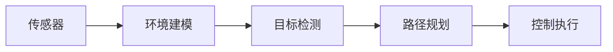

                 

## 1. 背景介绍

自动驾驶技术的崛起带来了巨大商机与广泛社会关注，其核心在于传感器、决策规划、控制执行三大模块的协同运作。感知模块作为自动驾驶系统的眼睛和大脑，承担着环境信息收集、物体识别、道路状况感知等关键任务。在自动驾驶技术的发展过程中，感知模块一直处于引领地位。本文将系统回顾自动驾驶感知技术的发展历程、最新进展以及面临的机遇与挑战，旨在为未来的技术革新提供参考。

### 1.1 感知技术的重要性

自动驾驶感知技术直接关系到安全、高效、可靠等关键指标。它能实时感知车辆周围的环境和交通情况，通过传感器、地图、定位系统等获取信息，并进行实时处理和分析，帮助驾驶员和车辆做出正确的驾驶决策。一个高效的感知系统，不仅能提升驾驶安全性，还能显著提高交通效率，降低能源消耗，降低事故发生率，提升用户体验。

### 1.2 感知技术的地位

在自动驾驶系统中，感知技术是其他模块的基础。通过感知模块获取的环境信息，决策规划模块才能做出准确的路径规划和决策，而控制执行模块才能准确地执行这些决策。此外，感知技术在自动驾驶的高级功能中扮演重要角色，如自动泊车、交通标志识别、行人行为预测等，都离不开高精度的感知系统。因此，感知技术是自动驾驶技术实现的前提与核心。

## 2. 核心概念与联系

### 2.1 核心概念概述

在自动驾驶中，感知技术涉及多个重要概念，包括传感器、环境建模、目标检测、路径规划等。

- **传感器**：如激光雷达、摄像头、雷达等，负责采集车辆周围的环境数据。
- **环境建模**：通过对传感器数据进行处理和分析，构建车辆周围的环境模型。
- **目标检测**：识别并定位环境中的静态或动态目标，如行人、车辆、道路标志等。
- **路径规划**：基于环境模型和目标检测结果，规划车辆行驶路径。

这些概念之间相互联系，形成一个闭环系统。感知技术通过传感器获取数据，环境建模和目标检测对数据进行处理和分析，最后通过路径规划执行决策和控制。

### 2.2 概念间的关系

为了更清晰地理解这些核心概念之间的关系，我们用以下Mermaid流程图来展示：



这个流程图展示了感知技术的基本流程，传感器数据经过环境建模和目标检测的处理，最后通过路径规划和控制执行模块转化为具体的驾驶决策和动作。

## 3. 核心算法原理 & 具体操作步骤

### 3.1 算法原理概述

自动驾驶感知技术主要依赖于机器学习和深度学习技术。以基于深度学习的感知技术为例，其核心算法包括卷积神经网络(CNN)、循环神经网络(RNN)、时空卷积网络(Temporal Convolutional Network,TCN)等。通过这些算法，系统可以从传感器数据中提取特征，实现环境建模和目标检测。

### 3.2 算法步骤详解

以基于深度学习的目标检测算法为例，其一般步骤包括：

1. **数据预处理**：对传感器数据进行预处理，如降采样、归一化、坐标变换等。
2. **特征提取**：使用CNN等算法提取环境特征，生成高维特征表示。
3. **目标检测**：通过CNN或RNN等算法，对特征进行分类和定位，识别出环境中的目标。
4. **后处理**：对检测结果进行后处理，如非极大值抑制(NMS)、坐标校正等，提高检测的准确性和鲁棒性。

### 3.3 算法优缺点

深度学习技术在目标检测、环境建模等方面取得了显著的成果，但也存在一些问题：

- **计算复杂度高**：深度学习算法需要大量的计算资源和时间。
- **数据需求量大**：深度学习模型需要大量的标注数据进行训练，标注成本较高。
- **模型可解释性差**：深度学习模型的内部机制难以解释，缺乏透明度。

### 3.4 算法应用领域

自动驾驶感知技术主要应用于以下领域：

- **目标检测**：如行人、车辆、道路标志等目标的检测。
- **环境建模**：如道路地图、交通信号、车道线等的建模。
- **路径规划**：如自动驾驶车辆的路径规划。
- **行为预测**：如行人、车辆行为预测，以避免潜在的碰撞风险。

## 4. 数学模型和公式 & 详细讲解

### 4.1 数学模型构建

基于深度学习的感知技术通常使用卷积神经网络(CNN)或循环神经网络(RNN)进行建模。以CNN为例，其基本的数学模型可以表示为：

$$
f(x)=\sum_i w_ix_i + b
$$

其中 $x$ 为输入向量，$w$ 为权重向量，$b$ 为偏置项。

### 4.2 公式推导过程

CNN的核心是卷积操作，其推导过程如下：

$$
\begin{aligned}
&F_{i,j}^{(l+1)} = \sum_{k=-2}^{2}\sum_{m=-2}^{2} w_{k,m}F_{i+k,j+m}^{(l)} + b^{(l+1)} \\
&y_i = \sigma(\sum_j w_jF_{i,j}^{(l+1)} + b^{(l+1)}) \\
\end{aligned}
$$

其中 $w$ 为卷积核，$F$ 为特征图，$y$ 为输出特征，$\sigma$ 为激活函数。

### 4.3 案例分析与讲解

以目标检测为例，常用的CNN架构包括YOLO、SSD、Faster R-CNN等。这里以YOLO为例进行讲解。

YOLO（You Only Look Once）算法将目标检测分为两个阶段：特征提取和目标分类。在特征提取阶段，通过多个卷积层提取图像特征。在目标分类阶段，使用多个分类层对特征图进行分类，得到每个目标的位置和类别。

YOLO的检测过程如下：

1. **特征提取**：将输入图像分为 $S \times S$ 个网格，每个网格中提取特征。
2. **分类**：在每个网格中提取 $C \times 2$ 个特征，每个特征表示一个目标。
3. **回归**：对每个目标的位置进行回归，预测其在特征图中的偏移量。
4. **非极大值抑制**：通过NMS算法，消除冗余检测结果，保留最佳的检测结果。

## 5. 项目实践：代码实例和详细解释说明

### 5.1 开发环境搭建

要实现一个基于深度学习的目标检测系统，需要搭建相应的开发环境。以下是基本的搭建步骤：

1. **安装Python**：建议安装Python 3.7及以上版本。
2. **安装深度学习框架**：安装TensorFlow或PyTorch等深度学习框架。
3. **安装模型库**：安装如YOLO、SSD等目标检测模型的库。
4. **准备数据集**：准备标注好的训练集和测试集。
5. **搭建服务器**：搭建高性能的服务器，支持GPU加速。

### 5.2 源代码详细实现

以下是一个简单的目标检测实现，以YOLO为例：

```python
import cv2
import numpy as np
import tensorflow as tf

# 加载YOLO模型
model = tf.keras.models.load_model('yolo_model.h5')

# 加载类别标签
class_names = ['person', 'car', 'bike', 'bus']

# 加载输入图像
img = cv2.imread('test_image.jpg')

# 预处理图像
img = cv2.resize(img, (416, 416))
img = img / 255.0

# 运行模型进行目标检测
result = model.predict(np.array([img]))

# 解析检测结果
for i in range(result.shape[0]):
    box = result[i][::5]
    scores = result[i][5:]
    boxes = np.hstack((box, scores))
    boxes = boxes[boxes[4] > 0.5]

    for j in range(boxes.shape[0]):
        x1, y1, x2, y2, score, cls = boxes[j]
        label = class_names[int(cls)]
        cv2.rectangle(img, (x1, y1), (x2, y2), (0, 255, 0), 2)
        cv2.putText(img, label, (x1, y1), cv2.FONT_HERSHEY_SIMPLEX, 1, (0, 255, 0), 2)

# 显示图像
cv2.imshow('result', img)
cv2.waitKey(0)
cv2.destroyAllWindows()
```

### 5.3 代码解读与分析

在上述代码中，我们使用了YOLO模型进行目标检测。首先，加载了预训练的YOLO模型和类别标签。然后，加载了待检测图像并进行预处理。最后，将处理后的图像输入模型进行目标检测，并显示检测结果。

### 5.4 运行结果展示

运行上述代码，可以得到检测结果图像，其中标注了检测到的目标位置和类别。

## 6. 实际应用场景

### 6.1 自动驾驶车辆

自动驾驶车辆中的感知技术可以用于识别道路、车辆、行人等，实时监测周围环境，为路径规划提供重要数据。以激光雷达为例，它可以获取高精度的环境地图，并根据实时数据进行路径规划。

### 6.2 智能交通系统

智能交通系统中的感知技术可以用于车辆监测、交通流量分析、道路状况检测等。以摄像头为例，它可以获取实时交通视频，进行车辆检测和行人识别，帮助交通管理中心实时掌握交通状况。

### 6.3 无人机自动飞行

无人机自动飞行中的感知技术可以用于环境建模、目标检测、行为预测等。以多旋翼无人机为例，其可以通过摄像头和激光雷达等传感器，实时监测周围环境，进行避障和路径规划，实现自主飞行。

## 7. 工具和资源推荐

### 7.1 学习资源推荐

- **机器学习基础**：《机器学习》（周志华）
- **深度学习基础**：《深度学习》（Ian Goodfellow）
- **目标检测算法**：《目标检测算法综述》（arXiv）
- **TensorFlow官方文档**：TensorFlow官网提供详细教程和文档
- **YOLO官方文档**：YOLO官网提供模型和代码实现

### 7.2 开发工具推荐

- **深度学习框架**：TensorFlow、PyTorch
- **模型库**：YOLO、SSD、Faster R-CNN
- **开发环境**：Ubuntu、Anaconda
- **开发工具**：Git、GitHub、Jupyter Notebook

### 7.3 相关论文推荐

- **目标检测**：《YOLO: Real-Time Object Detection》（Russakovsky et al., 2015）
- **环境建模**：《3D Scene Understanding by Prediction》（Zhou et al., 2019）
- **路径规划**：《Fast and Accurate Optical Flow》（Kitti团队，2012）

## 8. 总结：未来发展趋势与挑战

### 8.1 研究成果总结

近年来，自动驾驶感知技术取得了显著的进展。特别是深度学习算法，在目标检测、环境建模等方面取得了突破性成果。以YOLO、SSD、Faster R-CNN为代表的目标检测算法，在精度和速度上取得了新的突破，为自动驾驶感知技术的发展提供了坚实基础。

### 8.2 未来发展趋势

未来，自动驾驶感知技术将呈现以下几个发展趋势：

- **多传感器融合**：融合多种传感器数据，提升感知系统的准确性和鲁棒性。
- **高精度地图**：结合高精度地图和传感器数据，实现更精确的环境建模。
- **实时处理**：通过优化算法和计算资源，实现更高效的实时处理和推理。
- **跨平台兼容**：实现跨平台兼容，支持各种环境下的感知任务。

### 8.3 面临的挑战

尽管自动驾驶感知技术取得了一定的进展，但也面临一些挑战：

- **数据获取难度**：高质量的训练数据获取成本较高，数据量不足。
- **环境复杂性**：不同环境下的感知需求不同，需要针对性地优化模型。
- **模型可解释性**：深度学习模型的内部机制难以解释，缺乏透明度。
- **资源需求**：深度学习算法对计算资源和时间需求较高。

### 8.4 研究展望

未来，自动驾驶感知技术需要在以下几个方面进行深入研究：

- **多传感器融合**：开发更高效的多传感器融合算法，提升感知系统的整体性能。
- **高精度地图**：结合高精度地图和传感器数据，实现更精确的环境建模。
- **实时处理**：开发更高效的实时处理算法，实现更快速、更稳定的感知系统。
- **跨平台兼容**：实现跨平台兼容，支持各种环境下的感知任务。

## 9. 附录：常见问题与解答

### Q1: 深度学习算法在自动驾驶感知中面临哪些挑战？

A: 深度学习算法在自动驾驶感知中面临的主要挑战包括：

1. **计算复杂度高**：深度学习算法需要大量的计算资源和时间。
2. **数据需求量大**：深度学习模型需要大量的标注数据进行训练，标注成本较高。
3. **模型可解释性差**：深度学习模型的内部机制难以解释，缺乏透明度。

### Q2: 如何优化自动驾驶感知系统的性能？

A: 优化自动驾驶感知系统的性能需要从以下几个方面入手：

1. **多传感器融合**：融合多种传感器数据，提升感知系统的准确性和鲁棒性。
2. **高精度地图**：结合高精度地图和传感器数据，实现更精确的环境建模。
3. **实时处理**：通过优化算法和计算资源，实现更高效的实时处理和推理。
4. **跨平台兼容**：实现跨平台兼容，支持各种环境下的感知任务。

### Q3: 自动驾驶感知技术在实际应用中面临哪些难点？

A: 自动驾驶感知技术在实际应用中面临的主要难点包括：

1. **数据获取难度**：高质量的训练数据获取成本较高，数据量不足。
2. **环境复杂性**：不同环境下的感知需求不同，需要针对性地优化模型。
3. **模型可解释性**：深度学习模型的内部机制难以解释，缺乏透明度。
4. **资源需求**：深度学习算法对计算资源和时间需求较高。

### Q4: 自动驾驶感知技术未来有哪些发展趋势？

A: 自动驾驶感知技术的未来发展趋势包括：

1. **多传感器融合**：融合多种传感器数据，提升感知系统的准确性和鲁棒性。
2. **高精度地图**：结合高精度地图和传感器数据，实现更精确的环境建模。
3. **实时处理**：开发更高效的实时处理算法，实现更快速、更稳定的感知系统。
4. **跨平台兼容**：实现跨平台兼容，支持各种环境下的感知任务。

---

作者：禅与计算机程序设计艺术 / Zen and the Art of Computer Programming

