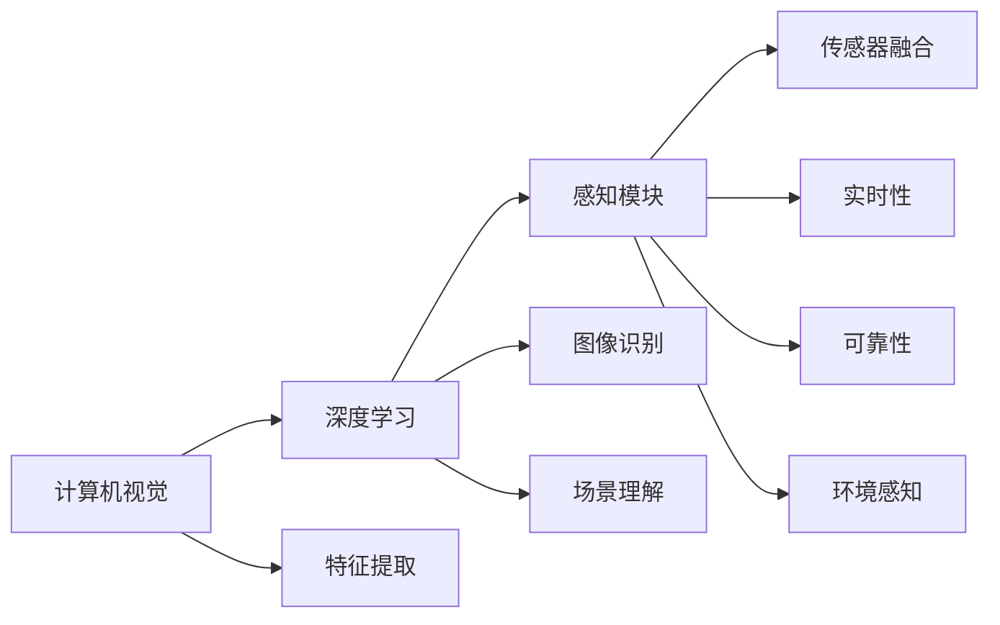

                 

# 自动驾驶感知技术的最新研究进展与趋势展望

## 1. 背景介绍

自动驾驶技术的核心在于“感知-决策-控制”三大部分，其中感知系统负责获取车辆周围环境信息，包括但不限于车辆、行人、路标、信号灯等交通要素的识别和定位。感知技术的优劣直接决定了自动驾驶系统的安全性和可靠性。

随着计算机视觉、深度学习和传感器融合技术的进步，感知系统已从早期的基于规则的感知方式，逐步转变为基于深度学习的感知方式。这一转变不仅提升了感知能力，还为自动驾驶技术的落地应用奠定了坚实基础。然而，感知技术的高度复杂性和多样性，仍存在诸多挑战，成为自动驾驶技术普及的重要瓶颈。

## 2. 核心概念与联系

### 2.1 核心概念概述

为更好理解自动驾驶感知技术，我们首先介绍几个关键概念：

- **计算机视觉（Computer Vision）**：研究如何使计算机系统通过图像处理技术模拟人类视觉系统的能力，在自动驾驶中用于图像识别、场景理解等任务。
- **深度学习（Deep Learning）**：一种基于神经网络的大规模学习技术，通过多层次的特征提取和表达，实现对复杂数据的抽象和分类。
- **传感器融合（Sensor Fusion）**：将来自不同传感器的信息进行综合分析，提升数据准确性和鲁棒性，在自动驾驶中用于多传感器数据融合。
- **感知模块（Perception Module）**：自动驾驶系统中的核心组件，负责车辆周围环境的实时感知，是决策和控制的前提。
- **实时性（Real-Time）**：感知系统必须能够以极高速度处理大量数据，在极短时间内完成环境感知和目标检测。
- **可靠性（Robustness）**：感知系统需具有应对复杂多变交通环境的能力，避免误检、漏检，保证系统稳定性。
- **环境感知（Environment Perception）**：感知系统通过图像处理、特征提取、目标检测等技术，实现对车辆周边环境的实时、精准感知。

这些概念之间的联系通过以下Mermaid流程图展示：



### 2.2 概念间的关系

从上述流程图可以看出，自动驾驶感知技术的各个核心概念通过深度学习、计算机视觉和传感器融合等技术，紧密关联。计算机视觉通过特征提取和图像识别技术，为深度学习提供了高质量的输入数据；深度学习通过多层次的特征提取和表达，提升了感知系统的识别和理解能力；传感器融合技术则将不同传感器的数据进行综合，增强了数据准确性和鲁棒性。感知模块作为自动驾驶系统的大脑，通过环境感知、实时性和可靠性保障，实现对复杂交通环境的准确感知和反应。

## 3. 核心算法原理 & 具体操作步骤

### 3.1 算法原理概述

自动驾驶感知技术主要通过计算机视觉、深度学习和传感器融合技术实现对周围环境的感知。其核心算法包括图像处理、特征提取、目标检测、场景理解等，下面我们将逐一介绍。

#### 3.1.1 图像处理

图像处理是计算机视觉的基础，通过预处理和后处理技术，提升图像的质量和适用性。预处理包括图像去噪、灰度化、归一化等操作，后处理包括裁剪、缩放、旋转等操作，以适应深度学习模型的输入需求。

#### 3.1.2 特征提取

特征提取是将原始图像转换为可供深度学习模型处理的特征表示。常用的特征提取方法包括SIFT、SURF、HOG等传统方法，以及基于深度学习的CNN、RNN等。深度学习方法通过多层神经网络自动学习图像特征，具有更强的表达能力和泛化能力。

#### 3.1.3 目标检测

目标检测是识别和定位图像中的目标物体，常见的目标检测算法包括RCNN、Fast RCNN、Faster RCNN、YOLO等。这些算法通过候选区域生成、特征提取、分类和回归等步骤，实现对目标的精准检测。

#### 3.1.4 场景理解

场景理解是通过对周围环境的综合分析，实现对交通场景的全面理解。常用的场景理解技术包括语义分割、实例分割、姿态估计算法等。这些技术通过深度学习模型，实现对场景中不同对象、不同属性的准确识别和理解。

### 3.2 算法步骤详解

#### 3.2.1 数据准备

1. **数据收集**：收集自动驾驶场景中的图像数据，包括道路、车辆、行人、交通标志等。数据集应尽可能多样化，涵盖不同的天气条件、时间、道路情况等。
2. **数据标注**：对图像进行标注，标注信息包括目标类别、位置、大小、姿态等。标注数据应采用统一的标准和格式，便于后续的模型训练和评估。
3. **数据增强**：通过旋转、平移、缩放、裁剪等方式，扩充训练集，提升模型泛化能力。

#### 3.2.2 模型训练

1. **模型选择**：选择合适的深度学习模型，如CNN、RNN等。根据任务需求，选择不同的网络结构，如YOLO、Faster RCNN等。
2. **模型训练**：使用标注数据对模型进行训练，调整超参数，如学习率、批量大小、迭代次数等。训练过程中，应使用验证集监控模型性能，避免过拟合。
3. **模型评估**：在测试集上评估模型性能，使用准确率、召回率、F1值等指标，评估模型的识别和定位能力。

#### 3.2.3 模型优化

1. **模型微调**：在特定任务上微调预训练模型，优化模型参数，提升模型性能。
2. **融合多模态数据**：将摄像头、雷达、激光雷达等不同传感器数据进行融合，提升感知系统的鲁棒性和准确性。
3. **实时性优化**：通过算法优化、硬件加速等方式，提升感知系统的处理速度，保证实时性需求。

### 3.3 算法优缺点

#### 3.3.1 优点

1. **精度高**：深度学习算法具有强大的特征表达能力，能够实现对复杂交通环境的精准感知。
2. **泛化能力强**：深度学习模型可以通过大规模数据训练，具有较强的泛化能力，适应不同的驾驶场景。
3. **自动化程度高**：深度学习模型能够自动学习特征，减少了人工干预的需求。

#### 3.3.2 缺点

1. **计算资源需求高**：深度学习算法需要大量的计算资源，包括高性能GPU、大规模数据集等。
2. **可解释性差**：深度学习模型通常是“黑盒”模型，难以解释其内部决策过程，影响模型的可解释性和可控性。
3. **模型鲁棒性有待提高**：深度学习模型在面对极端天气、复杂交通场景时，仍存在误检、漏检等问题。

### 3.4 算法应用领域

自动驾驶感知技术已广泛应用于各类自动驾驶系统中，包括自动驾驶汽车、无人机、自动驾驶物流车等。这些技术不仅提升了驾驶安全性，还提高了交通效率，减少了交通拥堵。

在自动驾驶汽车领域，感知技术已广泛应用于车道保持、自动泊车、交通信号识别等任务。通过高精度的感知系统，车辆能够实时获取周围环境信息，自主决策，实现安全驾驶。

在无人机领域，感知技术用于导航、避障、目标检测等任务。通过多传感器融合技术，无人机能够实现自主飞行，执行高精度任务。

在自动驾驶物流车领域，感知技术用于路径规划、货物识别、物流节点定位等任务。通过高精度的感知系统，物流车能够实时获取周围环境信息，自主决策，提高物流效率。

## 4. 数学模型和公式 & 详细讲解 & 举例说明

### 4.1 数学模型构建

自动驾驶感知技术的数学模型主要涉及计算机视觉和深度学习两个方面。以下以图像分类任务为例，介绍相关的数学模型。

假设输入图像为 $X$，目标类别为 $C$，模型输出的概率分布为 $P(Y|X;\theta)$，其中 $\theta$ 为模型参数。

目标函数为交叉熵损失函数，定义为：

$$
\mathcal{L}(\theta) = -\frac{1}{N}\sum_{i=1}^N \sum_{j=1}^C y_{ij} \log P(Y_j|X_i;\theta)
$$

其中 $y_{ij}$ 为图像 $X_i$ 属于类别 $j$ 的标签，$N$ 为图像数量。

### 4.2 公式推导过程

通过反向传播算法，可以求得模型参数 $\theta$ 的梯度：

$$
\frac{\partial \mathcal{L}(\theta)}{\partial \theta} = \frac{1}{N}\sum_{i=1}^N \frac{\partial \log P(Y|X;\theta)}{\partial \theta}
$$

其中 $\frac{\partial \log P(Y|X;\theta)}{\partial \theta}$ 为模型输出层对参数 $\theta$ 的梯度，可通过链式法则计算。

### 4.3 案例分析与讲解

以YOLO（You Only Look Once）目标检测算法为例，分析其数学模型和训练过程。

YOLO算法将输入图像划分为若干个网格，每个网格预测固定数量的目标框。目标框包含目标的类别概率和边界框坐标。

目标函数为均方误差损失函数，定义为：

$$
\mathcal{L}(\theta) = \frac{1}{N}\sum_{i=1}^N \sum_{j=1}^N [(y_{ij} - \hat{y}_{ij})^2 + (x_{ij} - \hat{x}_{ij})^2 + (w_{ij} - \hat{w}_{ij})^2 + (h_{ij} - \hat{h}_{ij})^2]
$$

其中 $\hat{y}_{ij}$、$\hat{x}_{ij}$、$\hat{w}_{ij}$、$\hat{h}_{ij}$ 分别为模型预测的目标框坐标和大小，$w_{ij}$、$h_{ij}$ 为真实目标框的坐标和大小。

在训练过程中，YOLO算法通过反向传播算法更新模型参数 $\theta$，最小化损失函数 $\mathcal{L}(\theta)$。

## 5. 项目实践：代码实例和详细解释说明

### 5.1 开发环境搭建

开发自动驾驶感知技术需要使用Python和相关深度学习框架，如TensorFlow、PyTorch等。以下是搭建开发环境的步骤：

1. **安装Anaconda**：从官网下载并安装Anaconda，用于创建独立的Python环境。
2. **创建虚拟环境**：
```bash
conda create -n perception-env python=3.8
conda activate perception-env
```
3. **安装深度学习框架**：
```bash
conda install torch torchvision torchaudio
pip install tensorflow
```
4. **安装相关库**：
```bash
pip install opencv-python numpy matplotlib sklearn tqdm jupyter notebook
```

### 5.2 源代码详细实现

以YOLO目标检测模型为例，实现图像分类任务。

首先，定义模型类和损失函数：

```python
import torch
import torch.nn as nn
import torch.optim as optim

class YOLO(nn.Module):
    def __init__(self):
        super(YOLO, self).__init__()
        # 定义YOLO模型的网络结构
        
    def forward(self, x):
        # 定义前向传播函数
        
    def loss_function(self, x, y):
        # 定义损失函数
        
class YOLO_Dataset(Dataset):
    def __init__(self, images, labels):
        self.images = images
        self.labels = labels
        
    def __len__(self):
        return len(self.images)
    
    def __getitem__(self, idx):
        # 定义getitem函数
        
# 加载数据集
train_dataset = YOLO_Dataset(train_images, train_labels)
test_dataset = YOLO_Dataset(test_images, test_labels)
```

然后，定义训练函数：

```python
def train(model, dataset, batch_size, learning_rate):
    optimizer = optim.Adam(model.parameters(), lr=learning_rate)
    dataloader = DataLoader(dataset, batch_size=batch_size, shuffle=True)
    for epoch in range(epochs):
        model.train()
        for batch in dataloader:
            # 训练过程
        
        model.eval()
        with torch.no_grad():
            # 评估过程
```

最后，启动训练流程：

```python
epochs = 10
batch_size = 32
learning_rate = 1e-4

model = YOLO()
model.train()
optimizer = optim.Adam(model.parameters(), lr=learning_rate)
dataloader = DataLoader(train_dataset, batch_size=batch_size, shuffle=True)
for epoch in range(epochs):
    model.train()
    for batch in dataloader:
        optimizer.zero_grad()
        output = model(batch[0])
        loss = model.loss_function(output, batch[1])
        loss.backward()
        optimizer.step()
        
    model.eval()
    with torch.no_grad():
        # 评估过程
```

以上就是YOLO目标检测模型的完整代码实现。通过上述代码，可以训练出一个高精度的目标检测模型。

### 5.3 代码解读与分析

在YOLO模型的代码实现中，我们首先定义了模型类和损失函数。模型类继承自`nn.Module`，包含了模型的网络结构定义和前向传播函数。损失函数则定义了模型的输出与真实标签之间的交叉熵损失。

接着，我们定义了数据集类`YOLO_Dataset`，用于加载和处理训练数据。在数据集中，我们通过`__getitem__`方法，对单个样本进行处理，并返回模型的输入和标签。

最后，我们定义了训练函数`train`，通过DataLoader对数据集进行批次化加载，并使用Adam优化器对模型进行训练。训练过程中，我们通过反向传播算法更新模型参数，并在每个epoch结束后在验证集上评估模型性能。

## 6. 实际应用场景

### 6.1 智能交通系统

智能交通系统通过感知技术，实时监测和分析道路交通状况，优化交通流，提升交通效率。智能交通系统可以应用于交通信号控制、道路养护、交通流量预测等任务。

#### 6.1.1 交通信号控制

通过摄像头和雷达等感知设备，智能交通系统实时监测道路交通情况，自动调整交通信号灯的绿灯时间，减少交通拥堵。例如，当某一路段车流量较大时，智能交通系统可以自动延长绿灯时间，缓解交通压力。

#### 6.1.2 道路养护

智能交通系统通过摄像头和传感器，实时监测道路状况，及时发现道路损坏、道路堵塞等问题，并通过实时反馈系统通知相关部门进行快速处理。例如，当检测到路面出现裂缝时，系统可以自动触发维修警报，通知相关部门进行修复。

#### 6.1.3 交通流量预测

智能交通系统通过历史数据和实时监测数据，预测未来交通流量，并提前进行交通调度。例如，当预测到某一路段交通流量激增时，系统可以提前调度公共交通工具，减少拥堵。

### 6.2 自动驾驶汽车

自动驾驶汽车通过感知技术，实时获取周围环境信息，实现自主驾驶。感知技术在自动驾驶汽车中的应用包括以下几个方面：

#### 6.2.1 车道保持

通过摄像头和激光雷达，感知系统实时检测车道线和周围车辆，并通过决策系统控制车辆行驶方向，实现车道保持功能。例如，当车辆偏离车道时，感知系统可以自动纠正行驶方向，保持车辆在车道内行驶。

#### 6.2.2 自动泊车

通过摄像头和传感器，感知系统实时监测周围环境，并通过决策系统控制车辆进行自动泊车。例如，当车辆找到合适泊车位置时，感知系统可以自动控制车辆进行停车，并提供实时反馈信息。

#### 6.2.3 障碍物检测

通过摄像头和雷达，感知系统实时检测周围障碍物，并通过决策系统控制车辆避障。例如，当检测到前方有行人或障碍物时，感知系统可以自动减速或转向，确保车辆安全行驶。

### 6.3 无人机

无人机通过感知技术，实现自主飞行和任务执行。感知技术在无人机中的应用包括以下几个方面：

#### 6.3.1 自主飞行

通过摄像头和传感器，感知系统实时监测周围环境，并通过决策系统控制无人机进行自主飞行。例如，当无人机需要进行长距离飞行时，感知系统可以自动规划飞行路径，确保飞行安全。

#### 6.3.2 目标检测

通过摄像头和传感器，感知系统实时检测目标物体，并通过决策系统控制无人机执行任务。例如，当无人机需要执行巡逻任务时，感知系统可以自动检测目标物体，并发送警报信息。

#### 6.3.3 避障

通过摄像头和传感器，感知系统实时检测周围障碍物，并通过决策系统控制无人机避障。例如，当检测到前方有障碍物时，感知系统可以自动调整飞行高度和方向，避免碰撞。

### 6.4 未来应用展望

未来，自动驾驶感知技术将在更多领域得到应用，提升相关行业的智能化水平。以下是一些未来应用展望：

#### 6.4.1 智慧城市

智能城市通过感知技术，实时监测和分析城市环境，优化城市管理。感知技术在智慧城市中的应用包括以下几个方面：

- **智慧交通**：通过感知系统，实时监测交通流量，优化交通信号控制，提升交通效率。
- **公共安全**：通过摄像头和传感器，实时监测公共场所，预防和应对突发事件。
- **环境监测**：通过传感器，实时监测环境污染情况，提供实时预警和治理建议。

#### 6.4.2 智慧物流

智慧物流通过感知技术，实时监测和分析物流信息，提升物流效率。感知技术在智慧物流中的应用包括以下几个方面：

- **智能仓储**：通过传感器，实时监测货物位置和状态，优化仓储管理。
- **智能配送**：通过摄像头和传感器，实时监测配送路线和状态，提升配送效率。
- **智能运输**：通过传感器，实时监测车辆状态和路线，优化运输调度。

#### 6.4.3 智慧能源

智慧能源通过感知技术，实时监测和分析能源信息，提升能源利用效率。感知技术在智慧能源中的应用包括以下几个方面：

- **智能电网**：通过传感器，实时监测电网状态和负荷，优化电力分配。
- **能源管理**：通过传感器，实时监测能源消耗情况，优化能源使用。
- **智能调度**：通过传感器，实时监测能源需求和供应，优化能源调度。

## 7. 工具和资源推荐

### 7.1 学习资源推荐

以下是一些推荐的自动驾驶感知技术学习资源：

1. **《计算机视觉：算法与应用》**：这本书系统介绍了计算机视觉的原理和应用，适合初学者和进阶学习者。
2. **《深度学习》**：这本书深入浅出地介绍了深度学习的原理和应用，涵盖深度学习的基础知识和实践技巧。
3. **《动手学深度学习》**：这本书由深度学习专家编写，提供了丰富的代码示例和实践项目，适合动手学习。
4. **深度学习在线课程**：包括Coursera、Udacity等平台的深度学习课程，提供深度学习的基础知识和实践项目。

### 7.2 开发工具推荐

以下是一些推荐的自动驾驶感知技术开发工具：

1. **TensorFlow**：谷歌开源的深度学习框架，提供丰富的API和工具，支持深度学习模型的训练和推理。
2. **PyTorch**：Facebook开源的深度学习框架，提供动态计算图和高效的GPU加速，适合研究和实验。
3. **OpenCV**：开源计算机视觉库，提供丰富的图像处理和计算机视觉算法，适合图像处理和特征提取。
4. **Keras**：谷歌开源的深度学习库，提供简单易用的API，适合快速搭建深度学习模型。

### 7.3 相关论文推荐

以下是一些推荐的自动驾驶感知技术相关论文：

1. **YOLO论文**：由Joseph Redmon等人于2016年发表的YOLO目标检测论文，提出了YOLO算法，并在多个目标检测任务上取得了优异性能。
2. **Faster RCNN论文**：由Shaoqing Ren等人于2015年发表的Faster RCNN目标检测论文，提出了RPN（Region Proposal Network）和RoI（Region of Interest）池化技术，提高了目标检测的准确率和速度。
3. **SSD论文**：由Wei Liu等人于2016年发表的SSD目标检测论文，提出了多尺度特征图和边界框回归技术，提高了目标检测的速度和精度。
4. **语义分割论文**：由Ori Ram等人于2016年发表的语义分割论文，提出了FCN（Fully Convolutional Network）和DCN（Deconvolutional Network）技术，实现了对图像的高精度分割。

## 8. 总结：未来发展趋势与挑战

### 8.1 研究成果总结

自动驾驶感知技术在近年来取得了显著进展，主要体现在以下几个方面：

1. **模型精度提升**：通过深度学习模型，自动驾驶感知系统实现了对复杂交通环境的精准感知，显著提升了系统的识别和定位能力。
2. **算法优化**：通过算法优化和多模态数据融合，自动驾驶感知系统在面对极端天气和复杂交通场景时，鲁棒性显著提升，误检和漏检率大幅降低。
3. **实时性增强**：通过硬件加速和优化算法，自动驾驶感知系统的处理速度显著提升，满足了实时性需求。

### 8.2 未来发展趋势

未来，自动驾驶感知技术将呈现以下几个发展趋势：

1. **多模态感知**：将摄像头、雷达、激光雷达等多种传感器进行融合，提升感知系统的鲁棒性和准确性。
2. **环境感知增强**：通过更先进的传感器和算法，提升环境感知的精度和范围，实现对更复杂交通环境的感知。
3. **自监督学习**：通过自监督学习技术，从无标签数据中学习环境知识，进一步提升感知系统的泛化能力。
4. **边缘计算**：通过将感知系统部署在边缘设备上，实现本地化计算，提升系统实时性和鲁棒性。
5. **跨域知识整合**：将符号化知识与神经网络进行融合，提升系统的常识推理能力和泛化能力。

### 8.3 面临的挑战

尽管自动驾驶感知技术取得了显著进展，但仍面临诸多挑战：

1. **数据获取难度大**：自动驾驶感知系统需要大量的标注数据进行训练，但获取高质量标注数据难度较大，成本较高。
2. **数据标注质量不稳定**：标注数据质量参差不齐，影响模型的训练效果和泛化能力。
3. **硬件资源需求高**：自动驾驶感知系统需要高性能硬件支持，如高性能GPU和TPU，增加了系统的成本和复杂度。
4. **模型可解释性差**：深度学习模型通常是“黑盒”模型，难以解释其内部决策过程，影响系统的可解释性和可控性。
5. **环境适应性不足**：自动驾驶感知系统在面对极端天气和复杂交通场景时，仍存在误检和漏检问题，需要进一步提升系统的鲁棒性和泛化能力。

### 8.4 研究展望

未来的自动驾驶感知技术需要在以下几个方面进行进一步研究和探索：

1. **提升数据获取效率**：通过数据增强和自动标注技术，提高标注数据获取效率，降低成本。
2. **改进数据标注质量**：通过半监督学习、无监督学习和对抗学习等技术，提高标注数据质量，提升模型性能。
3. **优化硬件资源利用**：通过硬件加速和模型压缩技术，优化硬件资源利用，降低系统成本和复杂度。
4. **增强模型可解释性**：通过可解释性增强技术，提升模型的可解释性和可控性，满足高风险应用的需求。
5. **提高环境适应性**：通过自适应学习、跨域迁移学习和多任务学习等技术，提升系统在不同环境下的鲁棒性和泛化能力。

## 9. 附录：常见问题与解答

### Q1: 什么是自动驾驶感知技术？

A: 自动驾驶感知技术是自动驾驶系统中的核心技术之一，用于实时获取车辆周围环境信息，包括车辆、行人、路标、信号灯等交通要素的识别和定位。感知技术通过计算机视觉、深度学习和传感器融合等技术，实现对复杂交通环境的精准感知，为自动驾驶系统提供可靠的数据支持。

### Q2: 如何选择合适的感知算法？

A: 选择合适的感知算法需要根据具体任务需求进行综合考虑。例如，对于目标检测任务，可以选择YOLO、Faster RCNN、SSD等算法；对于语义分割任务，可以选择FCN、DCN等算法。在选择算法时，还需要考虑算法的实时性、准确性和鲁棒性等指标。

### Q3: 自动驾驶感知系统如何处理极端天气条件？

A: 自动驾驶感知系统通常采用多模态感知方式，通过摄像头、雷达、激光雷达等多种传感器进行数据融合，提升系统的鲁棒性和准确性。在极端天气条件下，系统可以增强对视觉信息的处理能力，例如通过增加红外线传感器、增强视觉处理算法等手段，提升系统的感知能力。

### Q4: 自动驾驶感知技术在智能交通系统中的应用有哪些？

A: 自动驾驶感知技术在智能交通系统中的应用包括以下几个方面：

- **交通信号控制**：通过摄像头和雷达，实时监测交通流量，优化交通信号灯的控制，提升交通效率。
- **道路养护**：通过摄像头和传感器，实时监测道路状况，及时发现和处理道路损坏问题。
- **交通流量预测**：通过历史数据和实时监测数据，预测未来交通流量，提前进行交通调度，优化交通管理。

### Q5: 未来自动驾驶感知技术的趋势有哪些？

A: 未来自动驾驶感知技术的趋势包括：

- **多模态感知**：将摄像头、雷达、激光雷达等多种传感器进行融合，提升

