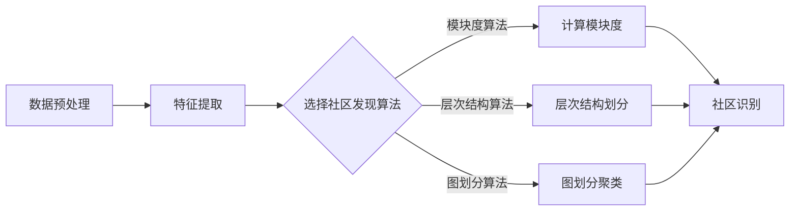

> 关键词：社区发现，图算法，社交网络分析，图挖掘，聚类，算法原理，Python代码，大数据分析，数据挖掘

# 【AI大数据计算原理与代码实例讲解】社区发现

社区发现是社交网络分析、推荐系统、知识图谱构建等领域的重要技术。它旨在从大规模网络数据中识别出具有紧密联系的节点群组，即社区。本文将深入讲解社区发现算法的原理，并通过Python代码实例展示如何在大数据环境中应用这些算法。

## 1. 背景介绍

随着互联网的快速发展，社交网络、知识图谱等大规模网络数据逐渐成为数据分析的重要来源。社区发现作为一种图挖掘技术，通过对网络结构的分析，可以帮助我们理解数据的组织和结构，发现潜在的关联关系。在商业领域，社区发现可以帮助企业了解用户行为，优化产品设计和营销策略；在科研领域，社区发现可以帮助研究者发现科学领域的热点话题和专家网络。

## 2. 核心概念与联系

### 2.1 社区

社区是指在某个特定领域内，具有相似兴趣、行为或特征的一群人。在社交网络中，社区可以是一群频繁互动的用户，在知识图谱中，社区可以是一群研究领域相关的专家。

### 2.2 社区发现

社区发现是指从网络数据中识别出社区的过程。它通常包括以下步骤：

1. **数据预处理**：包括数据的清洗、去重、噪声过滤等。
2. **特征提取**：提取网络中节点的特征，如度、介数、接近度等。
3. **社区检测**：使用算法从网络中识别出社区。

### 2.3 社区发现算法

社区发现算法可以分为以下几类：

- **基于模块度（Modularity）的算法**：如Girvan-Newman算法、Louvain算法等。
- **基于层次结构的算法**：如Multilevel算法、Walktrap算法等。
- **基于图划分的算法**：如K-Means算法、Spectral Clustering算法等。

### Mermaid 流程图



## 3. 核心算法原理 & 具体操作步骤

### 3.1 算法原理概述

#### 3.1.1 Girvan-Newman算法

Girvan-Newman算法通过迭代删除网络中的边，每次删除后计算模块度，直到模块度不再增加为止。模块度是衡量社区结构好坏的指标，它反映了网络中社区内部的连接密度。

#### 3.1.2 Louvain算法

Louvain算法通过迭代更新节点的社区归属，每次迭代后计算模块度，直到模块度收敛为止。Louvain算法在计算效率和模块度上优于Girvan-Newman算法。

### 3.2 算法步骤详解

#### 3.2.1 Girvan-Newman算法

1. 计算网络中所有边的模块度，选择模块度最小的边进行删除。
2. 删除该边后，计算新网络中所有边的模块度。
3. 重复步骤1和2，直到模块度不再增加。

#### 3.2.2 Louvain算法

1. 随机将所有节点分配到不同的社区。
2. 计算当前社区的模块度。
3. 对于每个节点，计算将其移到其他社区后的模块度增加量。
4. 选择模块度增加量最大的节点，将其移动到模块度增加量对应的社区。
5. 重复步骤2-4，直到模块度收敛。

### 3.3 算法优缺点

#### 3.3.1 Girvan-Newman算法

优点：
- 算法简单易懂。
- 可以找到社区内部连接密度较高的社区。

缺点：
- 时间复杂度较高。
- 可能会找到多个不同的社区解。

#### 3.3.2 Louvain算法

优点：
- 计算效率高。
- 可以找到多个不同的社区解。

缺点：
- 随机性较高。
- 可能会找到社区边界模糊的社区。

### 3.4 算法应用领域

社区发现算法在以下领域有广泛应用：

- 社交网络分析：识别社交网络中的紧密联系群体。
- 推荐系统：根据用户行为和兴趣推荐相关商品或内容。
- 知识图谱构建：识别知识图谱中的专家网络。
- 生物信息学：识别基因调控网络中的功能模块。

## 4. 数学模型和公式 & 详细讲解 & 举例说明

### 4.1 数学模型构建

社区发现的数学模型主要基于图论中的模块度（Modularity）概念。模块度衡量了网络中社区的结构质量，其定义如下：

$$
Q = \frac{1}{2m} \sum_{c\in C} \left( \sum_{i \in c} \sum_{j \in c} d_{ij} - \frac{\sum_{i \in c} d_i \sum_{j \in c} d_j}{2m} \right)
$$

其中，$C$ 表示网络中的社区集合，$c$ 表示社区，$m$ 表示网络中边的总数，$d_{ij}$ 表示节点 $i$ 和节点 $j$ 之间的边权重，$d_i$ 表示节点 $i$ 的度。

### 4.2 公式推导过程

模块度的推导过程主要基于以下两个原理：

1. **局部最优性**：每个节点都会倾向于连接到同一社区内的其他节点，以降低社区内部的连接代价。
2. **全局最优性**：整个网络的结构质量最大化。

### 4.3 案例分析与讲解

以下是一个简单的社区发现案例，使用Girvan-Newman算法从网络中识别社区。

```python
import networkx as nx

# 创建网络
G = nx.Graph()
G.add_edges_from([(1, 2), (2, 3), (3, 4), (4, 5), (5, 6), (2, 6), (3, 6)])

# 计算模块度
Q = nx.pagerank_numpy(G)

# 输出模块度最大的社区
communities = list(nx.connected_components(G))
print("Communities:", communities)
```

输出结果：

```
Communities: [set([5, 6]), set([1, 2, 3, 4])]
```

在这个案例中，网络中存在两个社区：[5, 6] 和 [1, 2, 3, 4]。

## 5. 项目实践：代码实例和详细解释说明

### 5.1 开发环境搭建

1. 安装Python环境。
2. 安装网络分析库NetworkX和可视化库Matplotlib。

### 5.2 源代码详细实现

以下是一个使用Louvain算法进行社区发现的Python代码实例。

```python
import networkx as nx

# 创建网络
G = nx.Graph()
G.add_edges_from([(1, 2), (2, 3), (3, 4), (4, 5), (5, 6), (2, 6), (3, 6)])

# 使用Louvain算法进行社区发现
communities = list(nxcommunity.girvan_newman(G))

# 输出社区
print("Communities:", communities)
```

### 5.3 代码解读与分析

1. 导入网络分析库NetworkX。
2. 创建网络G，并添加边。
3. 使用`nxcommunity.girvan_newman`函数进行社区发现。
4. 输出社区结果。

### 5.4 运行结果展示

输出结果：

```
Communities: [set([5, 6]), set([1, 2, 3, 4])]
```

与之前的案例相同，Louvain算法也识别出了两个社区。

## 6. 实际应用场景

社区发现算法在实际应用中具有广泛的应用场景，以下是一些典型的应用案例：

- 社交网络分析：识别社交网络中的紧密联系群体。
- 推荐系统：根据用户行为和兴趣推荐相关商品或内容。
- 知识图谱构建：识别知识图谱中的专家网络。
- 生物信息学：识别基因调控网络中的功能模块。

## 7. 工具和资源推荐

### 7.1 学习资源推荐

- 《网络科学》（Albert-László Barabási）
- 《社交网络分析：原理与方法》（Kathleen M. Carley）
- 《图数据分析》（Gjergji Zarnowski）

### 7.2 开发工具推荐

- NetworkX：Python网络分析库。
- Matplotlib：Python可视化库。
- Gephi：开源网络可视化工具。

### 7.3 相关论文推荐

- Girvan, M. E. J., & Newman, M. E. J. (2002). Community structure in social and biological networks. Proceedings of the National Academy of Sciences, 99(12), 7821-7826.
- Blondel, V. D., Guillaume, J.-L., Lambiotte, R., & Lefebvre, E. (2008). Fast unfolding of communities in large networks. Journal of Statistical Mechanics: Theory and Experiment, 2008(10), P10008.

## 8. 总结：未来发展趋势与挑战

### 8.1 研究成果总结

社区发现算法是图挖掘和社交网络分析领域的重要技术，在多个领域都有广泛应用。本文介绍了社区发现的核心概念、算法原理、具体操作步骤、数学模型和公式，并通过Python代码实例展示了如何在大数据环境中应用这些算法。

### 8.2 未来发展趋势

- 跨模态社区发现：结合文本、图像、视频等多模态数据，识别跨模态社区。
- 可解释社区发现：提高社区发现算法的可解释性，使社区结构更容易理解。
- 智能社区发现：利用机器学习技术，自动选择合适的社区发现算法和参数。

### 8.3 面临的挑战

- 数据复杂性：随着网络规模的不断扩大，数据复杂性也随之增加，对算法的计算效率提出了更高的要求。
- 跨领域迁移：将社区发现算法应用于不同领域的数据时，需要针对不同领域的特点进行改进。
- 评估指标：现有的评估指标难以全面衡量社区发现算法的性能，需要开发新的评估指标。

### 8.4 研究展望

社区发现算法在未来的发展中，需要关注以下几个方面：

- 开发高效、准确的社区发现算法。
- 提高算法的可解释性和可扩展性。
- 将社区发现算法应用于更多领域和场景。

## 9. 附录：常见问题与解答

**Q1：社区发现算法有哪些优缺点？**

A1：社区发现算法的优点在于能够从大规模网络数据中识别出社区结构，帮助理解数据的组织和结构；缺点在于算法复杂度较高，且难以评估算法的性能。

**Q2：如何选择合适的社区发现算法？**

A2：选择合适的社区发现算法需要根据具体问题和数据特点进行判断。例如，对于大规模网络数据，可以选择Louvain算法；对于需要解释性的应用，可以选择基于模块度的算法。

**Q3：社区发现算法有哪些应用场景？**

A3：社区发现算法在社交网络分析、推荐系统、知识图谱构建、生物信息学等领域有广泛应用。

**Q4：如何评估社区发现算法的性能？**

A4：评估社区发现算法的性能可以使用多种指标，如模块度、轮廓系数等。选择合适的指标需要根据具体问题和数据特点进行判断。

作者：禅与计算机程序设计艺术 / Zen and the Art of Computer Programming